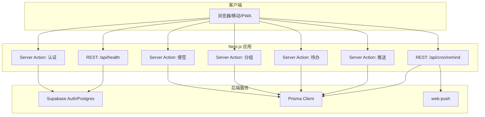
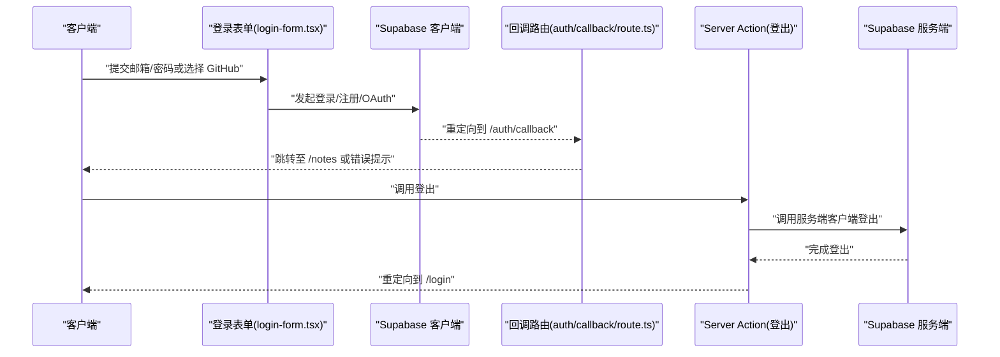
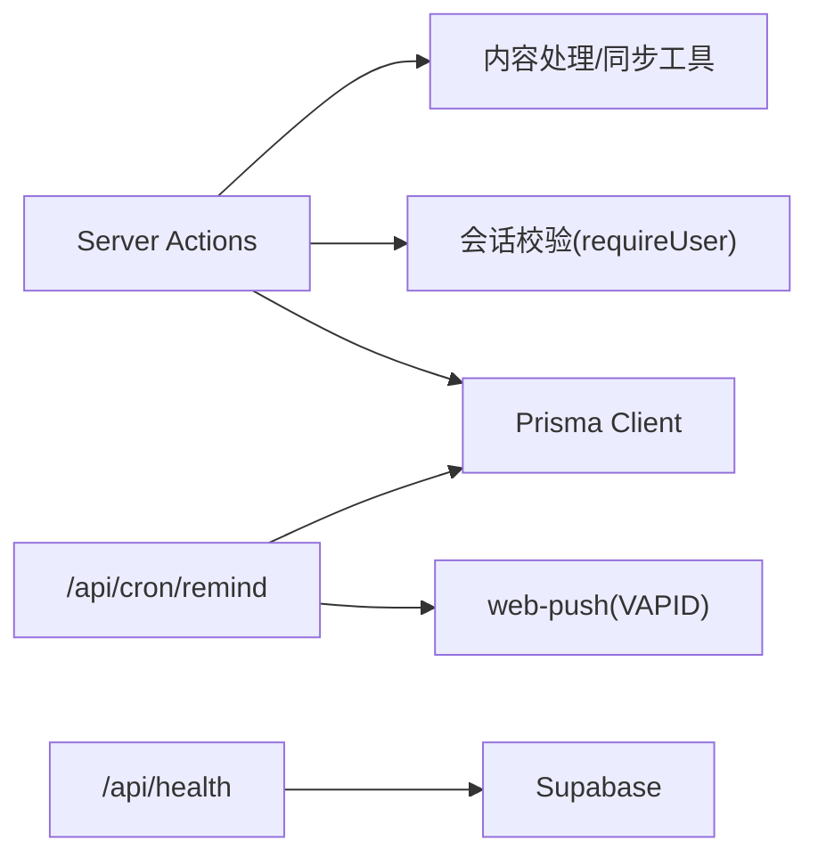
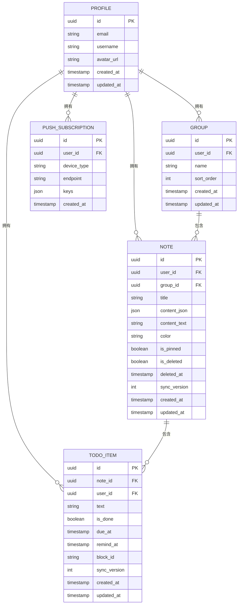

# API 参考

<cite>
**本文引用的文件**
- [src/actions/auth.ts](file://src/actions/auth.ts)
- [src/actions/groups.ts](file://src/actions/groups.ts)
- [src/actions/notes.ts](file://src/actions/notes.ts)
- [src/actions/todos.ts](file://src/actions/todos.ts)
- [src/actions/push.ts](file://src/actions/push.ts)
- [src/app/api/cron/remind/route.ts](file://src/app/api/cron/remind/route.ts)
- [src/app/api/health/route.ts](file://src/app/api/health/route.ts)
- [src/lib/auth/session.ts](file://src/lib/auth/session.ts)
- [src/lib/db/index.ts](file://src/lib/db/index.ts)
- [src/components/auth/login-form.tsx](file://src/components/auth/login-form.tsx)
- [src/components/push/web-push-subscribe-button.tsx](file://src/components/push/web-push-subscribe-button.tsx)
- [prisma/schema.prisma](file://prisma/schema.prisma)
- [package.json](file://package.json)
- [README.md](file://README.md)
</cite>

## 目录
1. [简介](#简介)
2. [项目结构](#项目结构)
3. [核心组件](#核心组件)
4. [架构总览](#架构总览)
5. [详细组件分析](#详细组件分析)
6. [依赖关系分析](#依赖关系分析)
7. [性能考量](#性能考量)
8. [故障排查指南](#故障排查指南)
9. [结论](#结论)
10. [附录](#附录)

## 简介
本文件为 Smart-Todo 的 API 参考文档，覆盖以下内容：
- Server Actions 接口规范：认证、便签、分组、待办、推送等。
- REST API 端点：健康检查、定时提醒扫描。
- 认证流程与会话管理：登录、登出、回调。
- 便签管理：CRUD、分组、回收站、颜色与置顶。
- 待办管理：勾选回写、状态同步、聚合查询。
- 推送通知：订阅、取消、定时提醒。
- 错误处理与常见问题。
- API 版本与向后兼容。

## 项目结构
Smart-Todo 基于 Next.js App Router，采用 Server Actions 作为主要后端接口，并通过 REST API 提供健康检查与定时提醒扫描。数据库使用 Prisma + Supabase Postgres，认证由 Supabase Auth 提供。

图表来源
- [src/actions/auth.ts:1-13](file://src/actions/auth.ts#L1-L13)
- [src/actions/notes.ts:1-230](file://src/actions/notes.ts#L1-L230)
- [src/actions/groups.ts:1-59](file://src/actions/groups.ts#L1-L59)
- [src/actions/todos.ts:1-70](file://src/actions/todos.ts#L1-L70)
- [src/actions/push.ts:1-62](file://src/actions/push.ts#L1-L62)
- [src/app/api/health/route.ts:1-13](file://src/app/api/health/route.ts#L1-L13)
- [src/app/api/cron/remind/route.ts:1-115](file://src/app/api/cron/remind/route.ts#L1-L115)
- [src/lib/db/index.ts:1-16](file://src/lib/db/index.ts#L1-L16)

章节来源
- [README.md: 161-202:161-202](file://README.md#L161-L202)
- [package.json: 1-L86:1-86](file://package.json#L1-L86)

## 核心组件
- Server Actions（服务端动作）
  - 认证：登出
  - 便签：创建、更新、移动分组、软删/恢复/永久删、置顶、着色、保存编辑器内容
  - 分组：创建、重命名、删除
  - 待办：从聚合页勾选回写便签并同步 todo_items
  - 推送：保存/移除 Web Push 订阅
- REST API
  - 健康检查：GET /api/health
  - 定时提醒：GET /api/cron/remind（受密钥保护）

章节来源
- [src/actions/auth.ts: 1-L13:1-13](file://src/actions/auth.ts#L1-L13)
- [src/actions/notes.ts: 1-L230:1-230](file://src/actions/notes.ts#L1-L230)
- [src/actions/groups.ts: 1-L59:1-59](file://src/actions/groups.ts#L1-L59)
- [src/actions/todos.ts: 1-L70:1-70](file://src/actions/todos.ts#L1-L70)
- [src/actions/push.ts: 1-L62:1-62](file://src/actions/push.ts#L1-L62)
- [src/app/api/health/route.ts: 1-L13:1-13](file://src/app/api/health/route.ts#L1-L13)
- [src/app/api/cron/remind/route.ts: 1-L115:1-115](file://src/app/api/cron/remind/route.ts#L1-L115)

## 架构总览
- 认证：前端通过 Supabase 客户端进行邮箱/密码或 OAuth 登录；服务端通过 Server Action 调用 Supabase 服务端客户端进行登出。
- 数据层：Prisma Client 访问 Supabase Postgres；模型包含 Profile、Group、Note、TodoItem、PushSubscription。
- 推送：前端注册 Service Worker 与 Push 订阅，保存订阅信息；定时任务扫描待办并使用 VAPID 发送 Web Push。

图表来源
- [src/components/auth/login-form.tsx: 1-L243:1-243](file://src/components/auth/login-form.tsx#L1-L243)
- [src/actions/auth.ts: 1-L13:1-13](file://src/actions/auth.ts#L1-L13)

## 详细组件分析

### 认证 API
- 登录/注册
  - 支持邮箱密码与 GitHub OAuth。
  - 邮箱注册会携带回调地址参数，OAuth 登录同样指向回调路由。
- 登出
  - Server Action 调用 Supabase 服务端客户端登出，随后重新验证路径并重定向到登录页。
- 会话要求
  - 多数 Server Actions 通过会话校验函数确保已登录用户。

接口定义
- 登录/注册（前端组件）
  - 输入：邮箱、密码、模式（登录/注册）
  - 输出：登录成功跳转、注册提示或错误信息
- 登出（Server Action）
  - 输入：无
  - 输出：重定向到 /login

章节来源
- [src/components/auth/login-form.tsx: 65-L112:65-112](file://src/components/auth/login-form.tsx#L65-L112)
- [src/actions/auth.ts: 7-L12:7-12](file://src/actions/auth.ts#L7-L12)
- [src/lib/auth/session.ts: 12-L18:12-18](file://src/lib/auth/session.ts#L12-L18)

### 便签管理 API
- 创建空白便签
  - Server Action：创建空便签并跳转到新便签页面
- 在分组中创建便签
  - Server Action：校验分组存在性后创建
- 更新便签内容
  - 支持乐观并发：基于 syncVersion 的版本锁
  - 支持跳过版本校验（离线重放时）
  - 同步更新便签标题/纯文本与 todo_items
- 保存编辑器内容
  - 自动注入待办块 ID、提取标题与纯文本后调用更新
- 移动到分组/取消分组
- 软删除/恢复/永久删除
- 置顶/取消置顶
- 着色/取消着色
- 返回值
  - 成功：{ ok: true, ... }
  - 冲突：{ conflict: true, serverSyncVersion }
  - 错误：{ error: string }

接口定义
- 创建空白便签
  - 方法：POST（通过表单/按钮触发）
  - 参数：无
  - 返回：重定向到新便签
- 在分组中创建便签
  - 方法：POST（通过表单/按钮触发）
  - 参数：groupId
  - 返回：{ ok: true } 或 { error: string }
- 更新便签内容
  - 方法：POST（通过表单/按钮触发）
  - 参数：noteId, contentJson, contentText, title, options(expectedSyncVersion?, skipExpectedVersion?)
  - 返回：{ ok: true, syncVersion } | { conflict: true, serverSyncVersion } | { error: string }
- 保存编辑器内容
  - 方法：POST（通过编辑器触发）
  - 参数：noteId, docJson, options
  - 返回：同上
- 移动到分组
  - 方法：POST（通过 UI 触发）
  - 参数：noteId, groupId
  - 返回：{ ok: true } | { error: string }
- 软删除/恢复/永久删除
  - 方法：POST（通过 UI 触发）
  - 参数：noteId
  - 返回：重定向或 { ok: true }
- 置顶/取消置顶
  - 方法：POST
  - 参数：noteId, isPinned
  - 返回：{ ok: true }
- 着色/取消着色
  - 方法：POST
  - 参数：noteId, color
  - 返回：{ ok: true }

章节来源
- [src/actions/notes.ts: 23-L36:23-36](file://src/actions/notes.ts#L23-L36)
- [src/actions/notes.ts: 38-L57:38-57](file://src/actions/notes.ts#L38-L57)
- [src/actions/notes.ts: 59-L138:59-138](file://src/actions/notes.ts#L59-L138)
- [src/actions/notes.ts: 141-L152:141-152](file://src/actions/notes.ts#L141-L152)
- [src/actions/notes.ts: 154-L173:154-173](file://src/actions/notes.ts#L154-L173)
- [src/actions/notes.ts: 175-L185:175-185](file://src/actions/notes.ts#L175-L185)
- [src/actions/notes.ts: 187-L197:187-197](file://src/actions/notes.ts#L187-L197)
- [src/actions/notes.ts: 199-L207:199-207](file://src/actions/notes.ts#L199-L207)
- [src/actions/notes.ts: 209-L218:209-218](file://src/actions/notes.ts#L209-L218)
- [src/actions/notes.ts: 220-L229:220-229](file://src/actions/notes.ts#L220-L229)

### 分组管理 API
- 创建分组
  - 参数：name（去空白）
  - 返回：{ ok: true } | { error: string }
- 重命名分组
  - 参数：groupId, name
  - 返回：{ ok: true } | { error: string }
- 删除分组
  - 参数：groupId
  - 行为：事务中将关联便签的 groupId 置空并删除分组
  - 返回：{ ok: true }

接口定义
- 创建分组
  - 方法：POST（通过表单触发）
  - 参数：name
  - 返回：{ ok: true } | { error: string }
- 重命名分组
  - 方法：POST
  - 参数：groupId, name
  - 返回：{ ok: true } | { error: string }
- 删除分组
  - 方法：POST
  - 参数：groupId
  - 返回：{ ok: true }

章节来源
- [src/actions/groups.ts: 7-L21:7-21](file://src/actions/groups.ts#L7-L21)
- [src/actions/groups.ts: 23-L38:23-38](file://src/actions/groups.ts#L23-L38)
- [src/actions/groups.ts: 40-L53:40-53](file://src/actions/groups.ts#L40-L53)

### 待办管理 API
- 从聚合页勾选完成
  - 校验：待办存在且所属便签未被删除
  - 处理：在便签 JSON 中定位并更新任务项状态
  - 同步：更新便签标题/纯文本与 syncVersion，并同步 todo_items
  - 返回：{ ok: true } | { error: string }

接口定义
- 勾选/取消待办
  - 方法：POST（通过聚合页触发）
  - 参数：todoItemId, nextDone
  - 返回：{ ok: true } | { error: string }

章节来源
- [src/actions/todos.ts: 12-L69:12-69](file://src/actions/todos.ts#L12-L69)

### 推送通知 API
- 订阅管理
  - 保存订阅：幂等 upsert，按 userId+endpoint 唯一
  - 取消订阅：按 endpoint 删除
- 定时提醒
  - 扫描：根据时间窗口扫描未完成且到达提醒时间的待办
  - 发送：使用 VAPID 与 web-push 发送通知
  - 清理：对 410/404 的订阅进行清理

接口定义
- 保存订阅
  - 方法：POST
  - 参数：subscription（包含 endpoint、keys.p256dh、keys.auth）
  - 返回：{ ok: true } | { error: string }
- 移除订阅
  - 方法：POST
  - 参数：endpoint
  - 返回：{ ok: true } | { error: string }
- 定时提醒扫描
  - 方法：GET
  - 认证：Authorization: Bearer {CRON_SECRET}
  - 查询：时间窗口内未完成的待办（含所属便签标题）
  - 返回：{ ok: true, scanned, sent, failures }

章节来源
- [src/actions/push.ts: 13-L49:13-49](file://src/actions/push.ts#L13-L49)
- [src/actions/push.ts: 52-L61:52-61](file://src/actions/push.ts#L52-L61)
- [src/app/api/cron/remind/route.ts: 28-L114:28-114](file://src/app/api/cron/remind/route.ts#L28-L114)

### REST API 端点
- 健康检查
  - 方法：GET
  - 路径：/api/health
  - 返回：{ ok: true, service, version, timestamp }
- 定时提醒扫描
  - 方法：GET
  - 路径：/api/cron/remind
  - 认证：Authorization: Bearer {CRON_SECRET}
  - 返回：{ ok: true, scanned, sent, failures }

章节来源
- [src/app/api/health/route.ts: 5-L12:5-12](file://src/app/api/health/route.ts#L5-L12)
- [src/app/api/cron/remind/route.ts: 28-L114:28-114](file://src/app/api/cron/remind/route.ts#L28-L114)

## 依赖关系分析
- Server Actions 依赖
  - 会话校验：requireUser
  - 数据库：Prisma Client
  - 内容处理：编辑器 JSON 解析与标题/纯文本提取
  - 待办同步：将便签 JSON 的任务项同步到独立表
- REST API 依赖
  - web-push：VAPID 配置与通知发送
  - Supabase：健康检查可复用用户会话能力（此处直接返回服务状态）

图表来源
- [src/lib/auth/session.ts: 12-L18:12-18](file://src/lib/auth/session.ts#L12-L18)
- [src/lib/db/index.ts: 7-L16:7-16](file://src/lib/db/index.ts#L7-L16)
- [src/app/api/health/route.ts: 5-L12:5-12](file://src/app/api/health/route.ts#L5-L12)
- [src/app/api/cron/remind/route.ts: 39-L43:39-43](file://src/app/api/cron/remind/route.ts#L39-L43)

章节来源
- [src/lib/db/index.ts: 1-L16:1-16](file://src/lib/db/index.ts#L1-L16)
- [src/lib/auth/session.ts: 1-L19:1-19](file://src/lib/auth/session.ts#L1-L19)

## 性能考量
- Server Actions
  - 事务：批量写入与同步在单事务中完成，保证一致性
  - 并发控制：使用 syncVersion 实现乐观锁，减少冲突
  - 路由刷新：写入后对相关页面进行重新验证，避免缓存不一致
- REST API
  - 动态禁用缓存：强制动态响应，确保扫描结果实时
  - TTL：推送消息设置短 TTL，降低过期消息影响
  - 时间窗口：扫描范围限制在极短的时间窗内，避免高负载

章节来源
- [src/actions/notes.ts: 80-L121:80-121](file://src/actions/notes.ts#L80-L121)
- [src/app/api/cron/remind/route.ts: 5-L6:5-6](file://src/app/api/cron/remind/route.ts#L5-L6)
- [src/app/api/cron/remind/route.ts: 95-L96:95-96](file://src/app/api/cron/remind/route.ts#L95-L96)

## 故障排查指南
- 认证
  - 登录失败：检查 Supabase Redirect URLs 是否包含开发端口；确认邮箱/密码或 GitHub 凭据正确
  - 登出异常：确认服务端客户端初始化与会话状态
- 便签
  - 写入冲突：当返回 { conflict: true } 时，提示用户刷新页面并重试
  - 便签不存在/已删除：检查 noteId 与用户权限
- 分组
  - 分组不存在：确认 groupId 与用户匹配
- 待办
  - 无法定位待办：在便签中编辑保存一次后再试
- 推送
  - 未配置 VAPID：前端订阅按钮会提示未配置公钥；后端扫描会返回 VAPID 未配置错误
  - 410/404：后端会自动清理失效订阅
  - HTTPS/localhost：订阅需要 HTTPS 或 localhost
- 定时提醒
  - 401 Unauthorized：检查 CRON_SECRET 是否正确传递
  - 500 VAPID keys not configured：检查 VAPID 公私钥与主题

章节来源
- [src/actions/notes.ts: 121-L133:121-133](file://src/actions/notes.ts#L121-L133)
- [src/actions/todos.ts: 18-L27:18-27](file://src/actions/todos.ts#L18-L27)
- [src/components/push/web-push-subscribe-button.tsx: 40-L76:40-76](file://src/components/push/web-push-subscribe-button.tsx#L40-L76)
- [src/app/api/cron/remind/route.ts: 29-L37:29-37](file://src/app/api/cron/remind/route.ts#L29-L37)
- [src/app/api/cron/remind/route.ts: 101-L104:101-104](file://src/app/api/cron/remind/route.ts#L101-L104)

## 结论
本 API 参考文档梳理了 Smart-Todo 的 Server Actions 与 REST API，明确了接口参数、返回值与错误处理策略。通过会话校验、乐观并发与事务保证数据一致性；通过 VAPID 与 web-push 实现可靠的推送通知；通过健康检查与定时扫描保障服务可用性与提醒时效。

## 附录

### 数据模型概览

图表来源
- [prisma/schema.prisma: 16-L116:16-116](file://prisma/schema.prisma#L16-L116)

### API 版本与兼容性
- 版本标识
  - 服务版本来自包版本字段
- 兼容性
  - Server Actions 采用“无状态 + 会话校验”设计，便于演进
  - REST API 保持最小必要接口，便于向后兼容
  - 数据模型通过 Prisma 管理迁移，建议在变更时创建迁移文件

章节来源
- [src/app/api/health/route.ts: 9-L11:9-11](file://src/app/api/health/route.ts#L9-L11)
- [package.json: 3-L3:3-3](file://package.json#L3-L3)