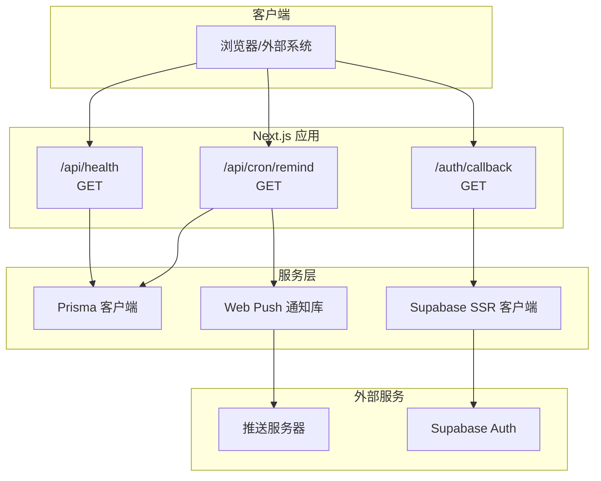
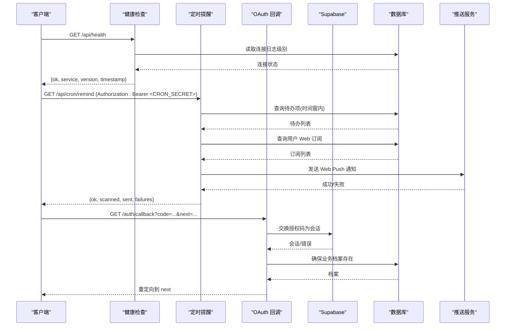
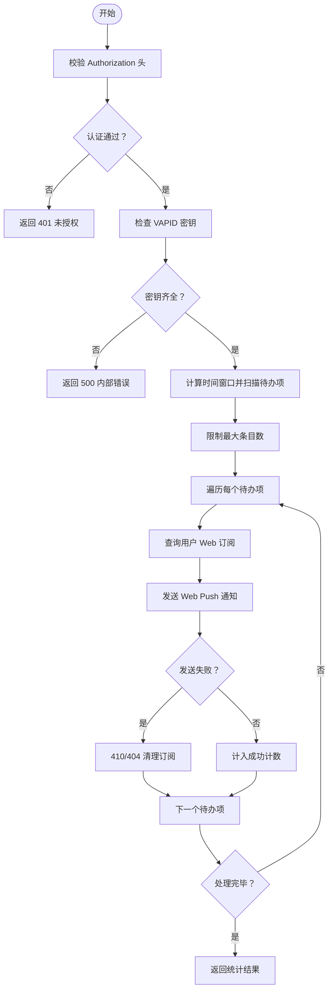
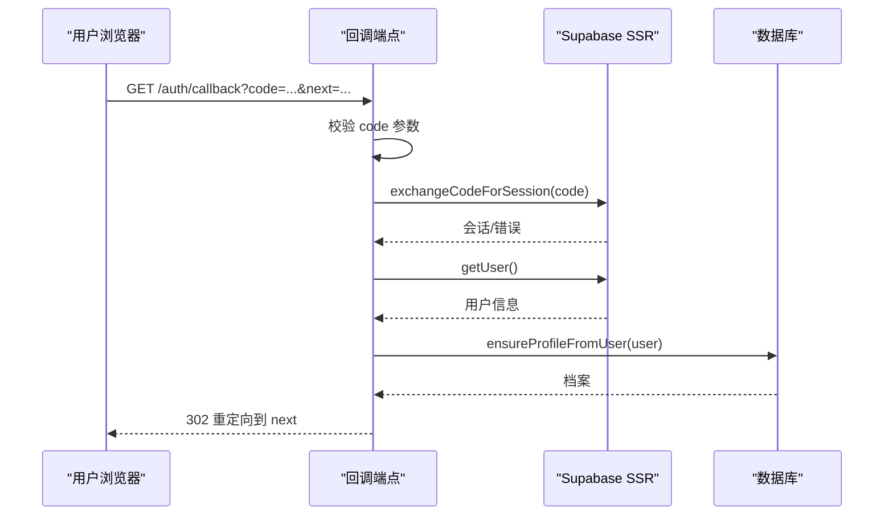
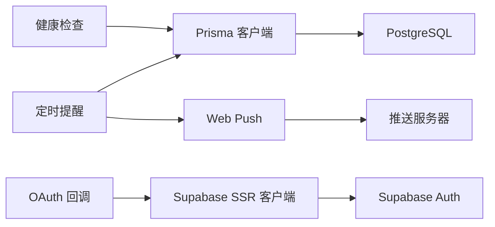

# REST API 端点

<cite>
**本文引用的文件**
- [src/app/api/health/route.ts](file://src/app/api/health/route.ts)
- [src/app/api/cron/remind/route.ts](file://src/app/api/cron/remind/route.ts)
- [src/app/auth/callback/route.ts](file://src/app/auth/callback/route.ts)
- [src/lib/db/index.ts](file://src/lib/db/index.ts)
- [src/lib/supabase/server.ts](file://src/lib/supabase/server.ts)
- [src/lib/supabase/client.ts](file://src/lib/supabase/client.ts)
- [src/lib/auth/profile.ts](file://src/lib/auth/profile.ts)
- [src/components/auth/login-form.tsx](file://src/components/auth/login-form.tsx)
- [prisma/schema.prisma](file://prisma/schema.prisma)
- [package.json](file://package.json)
</cite>

## 目录
1. [简介](#简介)
2. [项目结构](#项目结构)
3. [核心组件](#核心组件)
4. [架构总览](#架构总览)
5. [详细组件分析](#详细组件分析)
6. [依赖分析](#依赖分析)
7. [性能考量](#性能考量)
8. [故障排除指南](#故障排除指南)
9. [结论](#结论)
10. [附录](#附录)

## 简介
本文件为 Smart-Todo 的 REST API 端点提供完整接口文档，覆盖以下三个端点：
- 健康检查 API：/api/health
- 定时提醒 Cron API：/api/cron/remind
- OAuth 回调 API：/auth/callback

文档内容包括请求方法、响应格式、状态码含义、监控用途、触发条件、执行逻辑、数据处理、错误处理机制、认证要求、速率限制、调试与故障排除方法，以及版本控制与向后兼容性策略。

## 项目结构
本项目采用 Next.js App Router 结构，API 端点位于 src/app 下的路由处理器中，数据库访问通过 Prisma 客户端，认证基于 Supabase SSR 客户端。

图表来源
- [src/app/api/health/route.ts:1-13](file://src/app/api/health/route.ts#L1-L13)
- [src/app/api/cron/remind/route.ts:1-115](file://src/app/api/cron/remind/route.ts#L1-L115)
- [src/app/auth/callback/route.ts:1-49](file://src/app/auth/callback/route.ts#L1-L49)
- [src/lib/db/index.ts:1-16](file://src/lib/db/index.ts#L1-L16)
- [src/lib/supabase/server.ts:1-29](file://src/lib/supabase/server.ts#L1-L29)
- [src/lib/supabase/client.ts:1-9](file://src/lib/supabase/client.ts#L1-L9)

章节来源
- [src/app/api/health/route.ts:1-13](file://src/app/api/health/route.ts#L1-L13)
- [src/app/api/cron/remind/route.ts:1-115](file://src/app/api/cron/remind/route.ts#L1-L115)
- [src/app/auth/callback/route.ts:1-49](file://src/app/auth/callback/route.ts#L1-L49)
- [src/lib/db/index.ts:1-16](file://src/lib/db/index.ts#L1-L16)
- [src/lib/supabase/server.ts:1-29](file://src/lib/supabase/server.ts#L1-L29)
- [src/lib/supabase/client.ts:1-9](file://src/lib/supabase/client.ts#L1-L9)

## 核心组件
- 健康检查端点：返回服务可用性、版本与时间戳等基础信息，便于监控系统拉取。
- 定时提醒端点：按时间窗口扫描未完成且到达提醒时间的待办项，向用户 Web 推送订阅发送提醒通知，并统计发送与失败数量。
- OAuth 回调端点：接收 Supabase OAuth 重定向携带的授权码，换取会话并确保用户业务档案存在，最后重定向至目标页面。

章节来源
- [src/app/api/health/route.ts:1-13](file://src/app/api/health/route.ts#L1-L13)
- [src/app/api/cron/remind/route.ts:1-115](file://src/app/api/cron/remind/route.ts#L1-L115)
- [src/app/auth/callback/route.ts:1-49](file://src/app/auth/callback/route.ts#L1-L49)

## 架构总览
下图展示三类端点在整体系统中的交互关系与职责边界：

图表来源
- [src/app/api/health/route.ts:1-13](file://src/app/api/health/route.ts#L1-L13)
- [src/app/api/cron/remind/route.ts:1-115](file://src/app/api/cron/remind/route.ts#L1-L115)
- [src/app/auth/callback/route.ts:1-49](file://src/app/auth/callback/route.ts#L1-L49)
- [src/lib/db/index.ts:1-16](file://src/lib/db/index.ts#L1-L16)
- [src/lib/supabase/server.ts:1-29](file://src/lib/supabase/server.ts#L1-L29)
- [src/lib/auth/profile.ts:1-30](file://src/lib/auth/profile.ts#L1-L30)

## 详细组件分析

### 健康检查 API：/api/health
- 请求方法：GET
- 动态行为：强制动态生成，避免缓存
- 响应字段
  - ok：布尔值，表示服务可用
  - service：字符串，服务名称
  - version：字符串，版本号（来自包版本）
  - timestamp：字符串，ISO 时间戳
- 状态码
  - 200 OK：服务正常
- 监控用途
  - 健康探针、部署就绪/存活探测
  - 版本追踪与变更审计
- 请求示例
  - 方法：GET
  - 路径：/api/health
  - 头部：无特殊要求
- 响应示例
  - 状态：200
  - 正文：包含 ok、service、version、timestamp 的 JSON 对象
- 兼容性与版本
  - 字段稳定，遵循语义化版本策略
- 错误处理
  - 该端点不返回错误对象，仅在服务不可用时无法响应

章节来源
- [src/app/api/health/route.ts:1-13](file://src/app/api/health/route.ts#L1-L13)
- [package.json:1-86](file://package.json#L1-L86)

### 定时提醒 Cron API：/api/cron/remind
- 请求方法：GET
- 动态行为：强制动态生成，允许最长执行时间
- 认证要求
  - Authorization: Bearer <CRON_SECRET>（必需）
  - 缺少或错误的密钥将返回 401 Unauthorized
- VAPID 密钥要求
  - NEXT_PUBLIC_VAPID_PUBLIC_KEY 与 VAPID_PRIVATE_KEY 必须配置
  - 未配置将返回 500 内部错误
- 执行逻辑
  - 时间窗口：当前时间前后各约 30 秒（扫描范围约 1 分钟）
  - 查询条件：未完成、提醒时间在窗口内、所属便签未删除
  - 限制：单次最多处理 200 条待办项
  - 通知：对每个用户的 Web 设备订阅发送推送
  - 统计：返回扫描数、成功发送数、失败数
- 响应字段
  - ok：布尔值
  - scanned：扫描到的待办项数量
  - sent：成功发送数量
  - failures：失败数量
- 状态码
  - 200 OK：成功执行
  - 401 Unauthorized：认证失败
  - 500 Internal Server Error：VAPID 密钥未配置
- 请求示例
  - 方法：GET
  - 路径：/api/cron/remind
  - 头部：Authorization: Bearer <CRON_SECRET>
- 响应示例
  - 状态：200
  - 正文：包含 ok、scanned、sent、failures 的 JSON 对象
- 错误处理机制
  - 推送失败且状态码为 410 或 404 时，清理无效订阅
  - 其他异常仅计入失败计数，不影响整体响应
- 性能与并发
  - 最大执行时长限制为 60 秒
  - 单次扫描上限 200 条，避免过载
- 数据模型与索引
  - TodoItem.remindAt 与 userId 上有索引，支持高效扫描
  - PushSubscription.deviceType 用于筛选 Web 订阅
- 调试与排障
  - 检查 CRON_SECRET 是否正确设置
  - 检查 VAPID 密钥是否配置
  - 查看扫描数与失败数比对，定位推送服务问题
  - 关注 410/404 失败后的订阅清理情况

图表来源
- [src/app/api/cron/remind/route.ts:1-115](file://src/app/api/cron/remind/route.ts#L1-L115)
- [prisma/schema.prisma:77-100](file://prisma/schema.prisma#L77-L100)
- [prisma/schema.prisma:102-116](file://prisma/schema.prisma#L102-L116)

章节来源
- [src/app/api/cron/remind/route.ts:1-115](file://src/app/api/cron/remind/route.ts#L1-L115)
- [prisma/schema.prisma:77-100](file://prisma/schema.prisma#L77-L100)
- [prisma/schema.prisma:102-116](file://prisma/schema.prisma#L102-L116)

### OAuth 回调 API：/auth/callback
- 请求方法：GET
- 参数
  - code：必填，Supabase OAuth 授权码
  - next：可选，登录后重定向路径，默认为 /notes
- 认证流程
  - 从 URL 查询参数提取 code
  - 使用 Supabase SSR 客户端交换授权码为会话
  - 获取当前用户并确保业务档案存在
  - 重定向到 next 指定的路径
- 响应
  - 成功：302 Found，Location 为 next
  - 失败：302 Found，重定向到 /login 并附带错误信息
- 安全考虑
  - 严格校验 code 参数是否存在
  - 使用 Supabase SSR 客户端管理 Cookie，确保会话安全
  - next 参数来源于查询参数，需注意开放重定向风险（建议仅允许受信路径）

图表来源
- [src/app/auth/callback/route.ts:1-49](file://src/app/auth/callback/route.ts#L1-L49)
- [src/lib/supabase/server.ts:1-29](file://src/lib/supabase/server.ts#L1-L29)
- [src/lib/auth/profile.ts:1-30](file://src/lib/auth/profile.ts#L1-L30)

章节来源
- [src/app/auth/callback/route.ts:1-49](file://src/app/auth/callback/route.ts#L1-L49)
- [src/lib/supabase/server.ts:1-29](file://src/lib/supabase/server.ts#L1-L29)
- [src/lib/auth/profile.ts:1-30](file://src/lib/auth/profile.ts#L1-L30)
- [src/components/auth/login-form.tsx:1-243](file://src/components/auth/login-form.tsx#L1-L243)

## 依赖分析
- 数据库访问
  - Prisma 客户端封装全局实例，开发环境下启用查询日志
- 认证与会话
  - Supabase SSR 客户端负责服务端会话管理与 Cookie 设置
  - 浏览器端 Supabase 客户端用于前端交互
- 通知服务
  - Web Push 库用于发送订阅通知，需要 VAPID 凭据
- 类型与模型
  - Prisma 模型定义了用户业务档案、便签、待办项与推送订阅的结构与索引

图表来源
- [src/lib/db/index.ts:1-16](file://src/lib/db/index.ts#L1-L16)
- [src/lib/supabase/server.ts:1-29](file://src/lib/supabase/server.ts#L1-L29)
- [src/lib/supabase/client.ts:1-9](file://src/lib/supabase/client.ts#L1-L9)
- [src/app/api/cron/remind/route.ts:1-115](file://src/app/api/cron/remind/route.ts#L1-L115)
- [prisma/schema.prisma:1-117](file://prisma/schema.prisma#L1-L117)

章节来源
- [src/lib/db/index.ts:1-16](file://src/lib/db/index.ts#L1-L16)
- [src/lib/supabase/server.ts:1-29](file://src/lib/supabase/server.ts#L1-L29)
- [src/lib/supabase/client.ts:1-9](file://src/lib/supabase/client.ts#L1-L9)
- [prisma/schema.prisma:1-117](file://prisma/schema.prisma#L1-L117)

## 性能考量
- 健康检查
  - 强制动态，避免缓存；响应体小，开销低
- 定时提醒
  - 最大执行时长 60 秒，扫描上限 200 条，降低峰值负载
  - 仅针对 Web 设备订阅发送通知，减少无效推送
- OAuth 回调
  - 仅进行授权码交换与会话设置，逻辑简单，响应快速

## 故障排除指南
- 健康检查
  - 若无法访问，检查服务运行状态与网络连通性
- 定时提醒
  - 401：确认 CRON_SECRET 已正确设置并在请求头中传递
  - 500：检查 VAPID 公私钥是否配置
  - 大量 410/404：定期清理无效订阅，关注推送服务状态
  - 扫描数为 0：确认时间窗口与待办项 remindAt 是否正确
- OAuth 回调
  - 重定向到 /login 并带有错误参数：检查 Supabase 配置与授权码有效性
  - 会话未建立：确认 Supabase SSR 客户端初始化与 Cookie 设置

章节来源
- [src/app/api/cron/remind/route.ts:1-115](file://src/app/api/cron/remind/route.ts#L1-L115)
- [src/app/auth/callback/route.ts:1-49](file://src/app/auth/callback/route.ts#L1-L49)

## 结论
本文档提供了 Smart-Todo 三个关键 API 端点的完整接口规范与实现细节。健康检查端点用于服务可用性监控；定时提醒端点通过严格的认证与限流保障稳定性；OAuth 回调端点实现了安全的第三方登录流程。建议在生产环境中妥善配置密钥与环境变量，并结合监控与日志进行持续观测。

## 附录

### API 规范汇总
- /api/health
  - 方法：GET
  - 认证：无需
  - 响应：ok, service, version, timestamp
  - 状态码：200
- /api/cron/remind
  - 方法：GET
  - 认证：Bearer <CRON_SECRET>
  - 响应：ok, scanned, sent, failures
  - 状态码：200, 401, 500
- /auth/callback
  - 方法：GET
  - 参数：code, next
  - 响应：302 重定向
  - 状态码：302

### 认证与安全
- 定时提醒端点必须携带 Bearer Token，Token 来源于 CRON_SECRET
- OAuth 回调端点依赖 Supabase SSR 客户端管理会话与 Cookie
- 建议对回调 next 参数进行白名单校验，防止开放重定向

### 速率限制与配额
- 当前代码未实现显式速率限制；建议在网关或上游代理层实施
- 定时任务建议使用稳定的调度器（如平台 Cron）并配合幂等设计

### 版本控制与向后兼容
- 服务版本号来源于包版本（package.json），可用于发布追踪
- 健康检查响应字段稳定，建议保持兼容性
- OAuth 回调参数与重定向行为遵循 Supabase 标准，升级时需关注其变更

章节来源
- [package.json:1-86](file://package.json#L1-L86)
- [src/app/api/health/route.ts:1-13](file://src/app/api/health/route.ts#L1-L13)
- [src/app/api/cron/remind/route.ts:1-115](file://src/app/api/cron/remind/route.ts#L1-L115)
- [src/app/auth/callback/route.ts:1-49](file://src/app/auth/callback/route.ts#L1-L49)