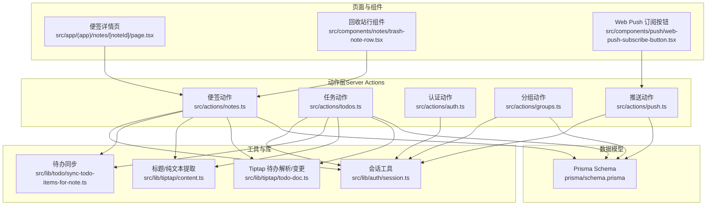
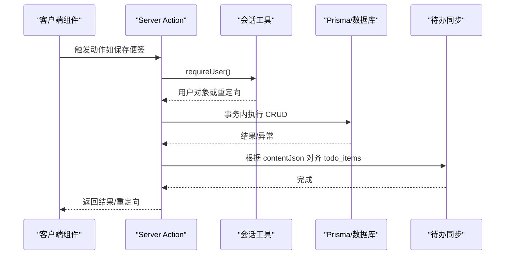
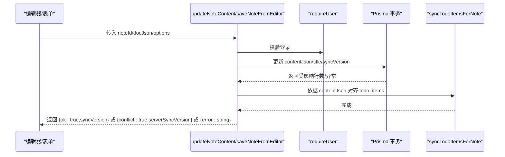
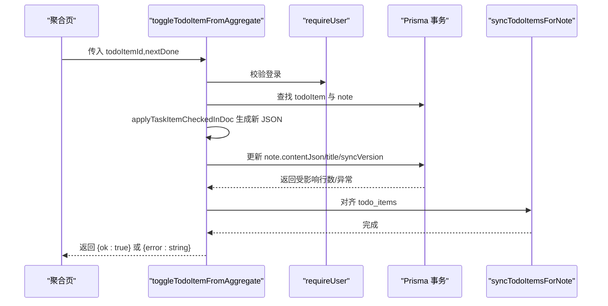
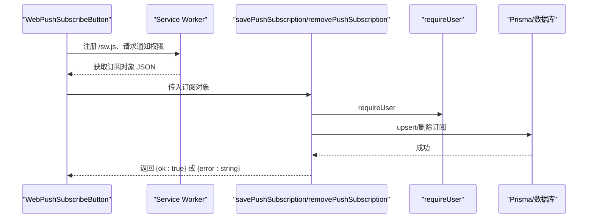
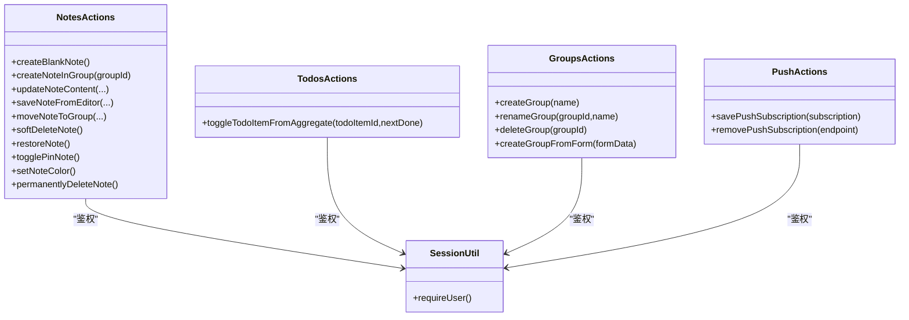
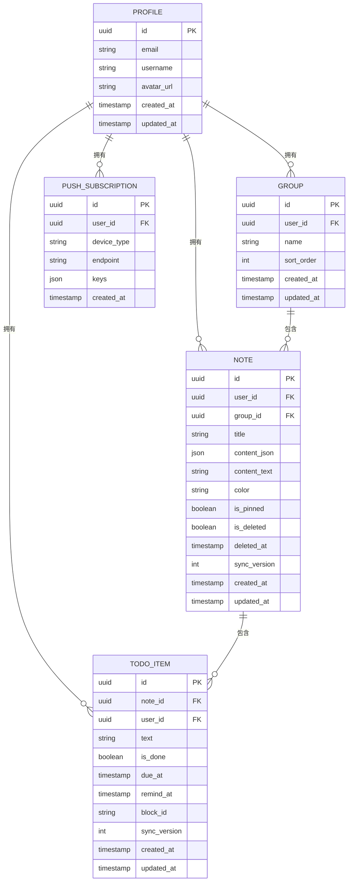

# Server Actions API

<cite>
**本文引用的文件**
- [src/actions/notes.ts](file://src/actions/notes.ts)
- [src/actions/todos.ts](file://src/actions/todos.ts)
- [src/actions/auth.ts](file://src/actions/auth.ts)
- [src/actions/groups.ts](file://src/actions/groups.ts)
- [src/actions/push.ts](file://src/actions/push.ts)
- [src/lib/auth/session.ts](file://src/lib/auth/session.ts)
- [src/lib/todo/sync-todo-items-for-note.ts](file://src/lib/todo/sync-todo-items-for-note.ts)
- [src/lib/tiptap/content.ts](file://src/lib/tiptap/content.ts)
- [src/lib/tiptap/todo-doc.ts](file://src/lib/tiptap/todo-doc.ts)
- [src/app/(app)/notes/[noteId]/page.tsx](file://src/app/(app)/notes/[noteId]/page.tsx)
- [src/components/push/web-push-subscribe-button.tsx](file://src/components/push/web-push-subscribe-button.tsx)
- [src/components/notes/trash-note-row.tsx](file://src/components/notes/trash-note-row.tsx)
- [prisma/schema.prisma](file://prisma/schema.prisma)
</cite>

## 目录
1. [简介](#简介)
2. [项目结构](#项目结构)
3. [核心组件](#核心组件)
4. [架构总览](#架构总览)
5. [详细组件分析](#详细组件分析)
6. [依赖关系分析](#依赖关系分析)
7. [性能考量](#性能考量)
8. [故障排查指南](#故障排查指南)
9. [结论](#结论)
10. [附录](#附录)

## 简介
本文件系统性梳理 Smart-Todo 的 Server Actions API，覆盖便签管理、任务管理、认证、分组管理和推送通知五大类别的接口规范。文档面向前端开发者与集成工程师，提供函数签名、参数定义、返回值格式、错误处理、权限要求、调用示例与最佳实践，帮助快速、安全地集成与扩展。

## 项目结构
Server Actions 位于 src/actions 下，按功能域拆分模块；与之配套的工具函数位于 src/lib，数据库模型定义于 prisma/schema.prisma。页面组件通过 use client 引用 Server Actions，实现表单提交、按钮触发与交互逻辑。

图表来源
- [src/actions/notes.ts:1-230](file://src/actions/notes.ts#L1-L230)
- [src/actions/todos.ts:1-70](file://src/actions/todos.ts#L1-L70)
- [src/actions/auth.ts:1-13](file://src/actions/auth.ts#L1-L13)
- [src/actions/groups.ts:1-59](file://src/actions/groups.ts#L1-L59)
- [src/actions/push.ts:1-62](file://src/actions/push.ts#L1-L62)
- [src/lib/auth/session.ts:1-19](file://src/lib/auth/session.ts#L1-L19)
- [src/lib/todo/sync-todo-items-for-note.ts:1-59](file://src/lib/todo/sync-todo-items-for-note.ts#L1-L59)
- [src/lib/tiptap/content.ts:1-53](file://src/lib/tiptap/content.ts#L1-L53)
- [src/lib/tiptap/todo-doc.ts:1-101](file://src/lib/tiptap/todo-doc.ts#L1-L101)
- [src/app/(app)/notes/[noteId]/page.tsx](file://src/app/(app)/notes/[noteId]/page.tsx#L1-L56)
- [src/components/notes/trash-note-row.tsx:1-65](file://src/components/notes/trash-note-row.tsx#L1-L65)
- [src/components/push/web-push-subscribe-button.tsx:1-127](file://src/components/push/web-push-subscribe-button.tsx#L1-L127)
- [prisma/schema.prisma:1-117](file://prisma/schema.prisma#L1-L117)

章节来源
- [src/actions/notes.ts:1-230](file://src/actions/notes.ts#L1-L230)
- [src/actions/todos.ts:1-70](file://src/actions/todos.ts#L1-L70)
- [src/actions/auth.ts:1-13](file://src/actions/auth.ts#L1-L13)
- [src/actions/groups.ts:1-59](file://src/actions/groups.ts#L1-L59)
- [src/actions/push.ts:1-62](file://src/actions/push.ts#L1-L62)
- [prisma/schema.prisma:1-117](file://prisma/schema.prisma#L1-L117)

## 核心组件
- 会话与鉴权：requireUser 用于强制登录态校验，未登录自动跳转登录页。
- 便签动作：创建、编辑、移动、软删、还原、置顶/取消、着色、永久删除。
- 任务动作：从聚合页切换待办完成状态，联动更新便签 JSON 与 todo_items。
- 分组动作：创建、重命名、删除（级联清空笔记分组并删除分组）。
- 推送动作：保存 Web Push 订阅、移除订阅。
- 工具函数：标题/纯文本提取、确保任务块 ID、从 JSON 抽取/应用待办变更、事务内对齐 todo_items。

章节来源
- [src/lib/auth/session.ts:12-18](file://src/lib/auth/session.ts#L12-L18)
- [src/lib/todo/sync-todo-items-for-note.ts:4-58](file://src/lib/todo/sync-todo-items-for-note.ts#L4-L58)
- [src/lib/tiptap/content.ts:12-52](file://src/lib/tiptap/content.ts#L12-L52)
- [src/lib/tiptap/todo-doc.ts:4-100](file://src/lib/tiptap/todo-doc.ts#L4-L100)

## 架构总览
Server Actions 作为 Next.js 14+ Server Functions，运行在服务端，负责：
- 权限校验（requireUser）
- 数据库事务（Prisma $transaction）
- 内容同步（从便签 JSON 抽取/对齐 todo_items）
- 路由缓存失效（revalidatePath）
- 页面重定向（redirect）

图表来源
- [src/actions/notes.ts:59-138](file://src/actions/notes.ts#L59-L138)
- [src/lib/auth/session.ts:12-18](file://src/lib/auth/session.ts#L12-L18)
- [src/lib/todo/sync-todo-items-for-note.ts:4-58](file://src/lib/todo/sync-todo-items-for-note.ts#L4-L58)

## 详细组件分析

### 便签管理 Server Actions
- 函数清单与用途
  - 新建空白便签：创建新便签并跳转至详情页
  - 在分组中新建便签：校验分组归属后创建
  - 更新便签内容：支持乐观并发（expectedSyncVersion/skipExpectedVersion）
  - 从编辑器保存：自动补全任务块 ID、提取标题/纯文本后委托更新
  - 移动到分组：校验分组归属，支持取消分组
  - 软删除便签：标记删除并跳转列表
  - 还原便签：取消删除并跳转详情
  - 切换置顶：更新 isPinned
  - 设置颜色：更新 color
  - 永久删除：仅允许已删除便签，物理删除

- 参数与返回值
  - 统一鉴权：requireUser，未登录重定向
  - 并发控制：updateNoteContent 支持 expectedSyncVersion 与 skipExpectedVersion
  - 返回值：
    - 成功：{ ok: true, syncVersion }
    - 冲突：{ conflict: true, serverSyncVersion }
    - 错误：{ error: string }

- 错误处理
  - 便签不存在/已删除：抛出 NOTE_NOT_FOUND，返回 error
  - 并发冲突：抛出 SYNC_CONFLICT，返回 conflict
  - 其他异常：向上抛出

- 调用示例（路径参考）
  - 新建空白便签：[src/app/(app)/notes/page.tsx](file://src/app/(app)/notes/page.tsx)
  - 从编辑器保存：[src/actions/notes.ts:140-152](file://src/actions/notes.ts#L140-L152)
  - 软删除/还原/永久删除：[src/components/notes/trash-note-row.tsx:14-64](file://src/components/notes/trash-note-row.tsx#L14-L64)

- 权限要求
  - 所有动作均需登录用户上下文

- 最佳实践
  - 使用 expectedSyncVersion 实现乐观并发；离线重放场景可跳过版本校验
  - 保存前确保任务块 ID 唯一且稳定
  - 变更后及时 revalidatePath，保证路由缓存一致性

章节来源
- [src/actions/notes.ts:22-36](file://src/actions/notes.ts#L22-L36)
- [src/actions/notes.ts:38-57](file://src/actions/notes.ts#L38-L57)
- [src/actions/notes.ts:59-138](file://src/actions/notes.ts#L59-L138)
- [src/actions/notes.ts:140-152](file://src/actions/notes.ts#L140-L152)
- [src/actions/notes.ts:154-173](file://src/actions/notes.ts#L154-L173)
- [src/actions/notes.ts:175-185](file://src/actions/notes.ts#L175-L185)
- [src/actions/notes.ts:187-197](file://src/actions/notes.ts#L187-L197)
- [src/actions/notes.ts:199-207](file://src/actions/notes.ts#L199-L207)
- [src/actions/notes.ts:209-218](file://src/actions/notes.ts#L209-L218)
- [src/actions/notes.ts:220-229](file://src/actions/notes.ts#L220-L229)
- [src/lib/auth/session.ts:12-18](file://src/lib/auth/session.ts#L12-L18)
- [src/lib/todo/sync-todo-items-for-note.ts:4-58](file://src/lib/todo/sync-todo-items-for-note.ts#L4-L58)
- [src/lib/tiptap/todo-doc.ts:4-21](file://src/lib/tiptap/todo-doc.ts#L4-L21)
- [src/lib/tiptap/content.ts:12-52](file://src/lib/tiptap/content.ts#L12-L52)
- [src/components/notes/trash-note-row.tsx:14-64](file://src/components/notes/trash-note-row.tsx#L14-L64)

#### 便签内容保存流程（序列图）

图表来源
- [src/actions/notes.ts:59-138](file://src/actions/notes.ts#L59-L138)
- [src/lib/todo/sync-todo-items-for-note.ts:4-58](file://src/lib/todo/sync-todo-items-for-note.ts#L4-L58)

### 任务管理 Server Actions
- 函数：toggleTodoItemFromAggregate
  - 场景：在“待办聚合”页切换某条待办的完成状态
  - 步骤：定位 todoItem → 生成新的便签 JSON（应用 checked 变更）→ 保存便签 → 同步 todo_items
  - 返回：成功/错误

- 参数与返回
  - 输入：todoItemId, nextDone
  - 返回：{ ok: true } 或 { error: string }

- 错误处理
  - 待办不存在或所属用户不匹配：返回 error
  - 便签已在回收站：返回 error
  - 无法在便签中定位该待办：返回 error
  - 便签不存在/已删除：返回 error

- 调用示例（路径参考）
  - 聚合页切换完成状态：[src/actions/todos.ts:11-69](file://src/actions/todos.ts#L11-L69)

章节来源
- [src/actions/todos.ts:11-69](file://src/actions/todos.ts#L11-L69)
- [src/lib/tiptap/todo-doc.ts:81-100](file://src/lib/tiptap/todo-doc.ts#L81-L100)
- [src/lib/todo/sync-todo-items-for-note.ts:4-58](file://src/lib/todo/sync-todo-items-for-note.ts#L4-L58)

#### 聚合页切换待办流程（序列图）

图表来源
- [src/actions/todos.ts:11-69](file://src/actions/todos.ts#L11-L69)
- [src/lib/tiptap/todo-doc.ts:81-100](file://src/lib/tiptap/todo-doc.ts#L81-L100)
- [src/lib/todo/sync-todo-items-for-note.ts:4-58](file://src/lib/todo/sync-todo-items-for-note.ts#L4-L58)

### 认证相关 Server Actions
- 函数：signOut
  - 功能：登出当前用户，清理会话，重定向至登录页
  - 返回：void（内部重定向）

- 调用示例（路径参考）
  - 登出按钮：[src/components/auth/sign-out-submit.tsx](file://src/components/auth/sign-out-submit.tsx)

章节来源
- [src/actions/auth.ts:7-12](file://src/actions/auth.ts#L7-L12)
- [src/lib/auth/session.ts:12-18](file://src/lib/auth/session.ts#L12-L18)

### 分组管理 Server Actions
- 函数与行为
  - 创建分组：校验名称非空，创建后刷新路由
  - 重命名分组：校验名称非空，若不存在返回 error
  - 删除分组：事务内先清空笔记分组，再删除分组，刷新路由

- 参数与返回
  - createGroup/renameGroup/deleteGroup：返回 { ok: true } 或 { error: string }

- 调用示例（路径参考）
  - 表单提交入口：[src/actions/groups.ts:55-58](file://src/actions/groups.ts#L55-L58)

章节来源
- [src/actions/groups.ts:7-21](file://src/actions/groups.ts#L7-L21)
- [src/actions/groups.ts:23-38](file://src/actions/groups.ts#L23-L38)
- [src/actions/groups.ts:40-53](file://src/actions/groups.ts#L40-L53)
- [src/actions/groups.ts:55-58](file://src/actions/groups.ts#L55-L58)

### 推送通知 Server Actions
- 函数与行为
  - 保存订阅：校验订阅对象结构，upsert 至数据库（同一 endpoint 幂等）
  - 移除订阅：按用户与 endpoint 删除

- 参数与返回
  - savePushSubscription：订阅对象（endpoint、keys），返回 { ok: true } 或 { error: string }
  - removePushSubscription：endpoint 字符串，返回 { ok: true } 或 { error: string }

- 调用示例（路径参考）
  - Web Push 订阅按钮组件：[src/components/push/web-push-subscribe-button.tsx:13-96](file://src/components/push/web-push-subscribe-button.tsx#L13-L96)

章节来源
- [src/actions/push.ts:12-49](file://src/actions/push.ts#L12-L49)
- [src/actions/push.ts:51-61](file://src/actions/push.ts#L51-L61)
- [src/components/push/web-push-subscribe-button.tsx:13-96](file://src/components/push/web-push-subscribe-button.tsx#L13-L96)

#### Web Push 订阅流程（序列图）

图表来源
- [src/components/push/web-push-subscribe-button.tsx:39-96](file://src/components/push/web-push-subscribe-button.tsx#L39-L96)
- [src/actions/push.ts:12-49](file://src/actions/push.ts#L12-L49)

## 依赖关系分析
- 低耦合高内聚：各动作模块独立，仅共享会话与工具函数
- 事务边界：便签与任务动作在 Prisma 事务内执行，保证一致性
- 缓存失效：动作完成后调用 revalidatePath，确保 Next.js 路由缓存一致
- 数据模型映射：Prisma 模型定义了字段约束、索引与外键关系，支撑动作的查询与更新

图表来源
- [src/actions/notes.ts:22-229](file://src/actions/notes.ts#L22-L229)
- [src/actions/todos.ts:11-69](file://src/actions/todos.ts#L11-L69)
- [src/actions/groups.ts:7-58](file://src/actions/groups.ts#L7-L58)
- [src/actions/push.ts:12-61](file://src/actions/push.ts#L12-L61)
- [src/lib/auth/session.ts:12-18](file://src/lib/auth/session.ts#L12-L18)

章节来源
- [prisma/schema.prisma:48-116](file://prisma/schema.prisma#L48-L116)

## 性能考量
- 乐观并发：通过 expectedSyncVersion 降低冲突概率，提升用户体验
- 事务批处理：在单次交互中完成多步写入，减少往返
- 路由缓存：合理使用 revalidatePath，避免过度 revalidate 导致性能下降
- 索引利用：数据库模型针对常用查询建立索引，动作层尽量命中索引
- 离线重放：skipExpectedVersion 用于离线队列重放，采用最后写入获胜策略

## 故障排查指南
- 并发冲突
  - 现象：返回 { conflict: true, serverSyncVersion }
  - 处理：提示用户刷新页面或合并变更
- 便签不存在/已删除
  - 现象：返回 { error: "便签不存在或已删除" }
  - 处理：引导用户回到列表或重新打开便签
- 分组不存在
  - 现象：返回 { error: "分组不存在" }
  - 处理：提示用户刷新分组列表
- 待办不存在/便签在回收站
  - 现象：返回 { error: "待办不存在" } 或 { error: "便签已在回收站" }
  - 处理：提示用户在便签中编辑保存后再试
- 订阅无效
  - 现象：返回 { error: "缺少 endpoint" / "缺少 keys.p256dh / keys.auth" / "无效的订阅数据" }
  - 处理：检查前端订阅生成与传输过程

章节来源
- [src/actions/notes.ts:122-132](file://src/actions/notes.ts#L122-L132)
- [src/actions/todos.ts:18-27](file://src/actions/todos.ts#L18-L27)
- [src/actions/push.ts:15-26](file://src/actions/push.ts#L15-L26)

## 结论
Smart-Todo 的 Server Actions 以清晰的职责划分与严格的权限控制为基础，结合 Prisma 事务与路由缓存策略，提供了可靠的便签、任务、分组与推送能力。遵循本文的参数规范、错误处理与最佳实践，可确保集成过程高效、稳定且易于维护。

## 附录

### 数据模型概览（与 Server Actions 相关）

图表来源
- [prisma/schema.prisma:15-116](file://prisma/schema.prisma#L15-L116)