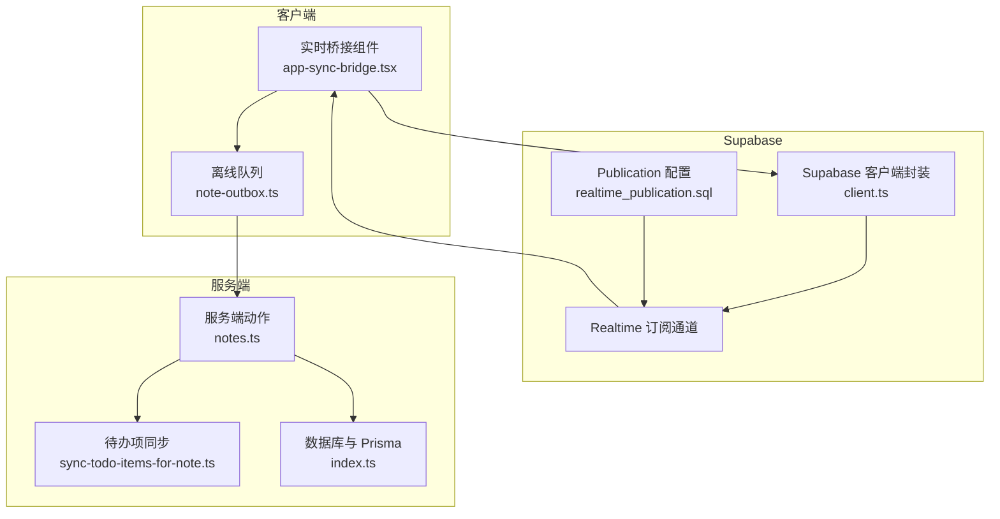
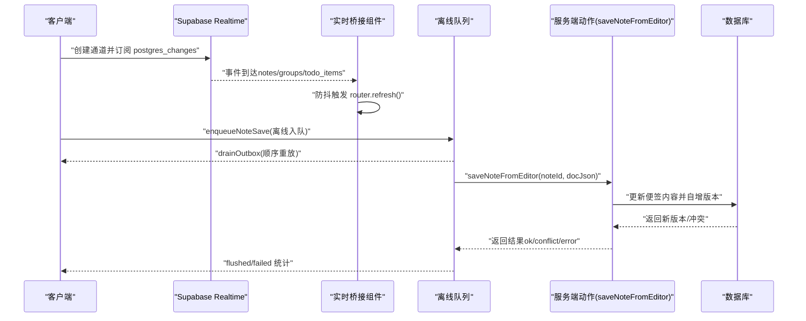
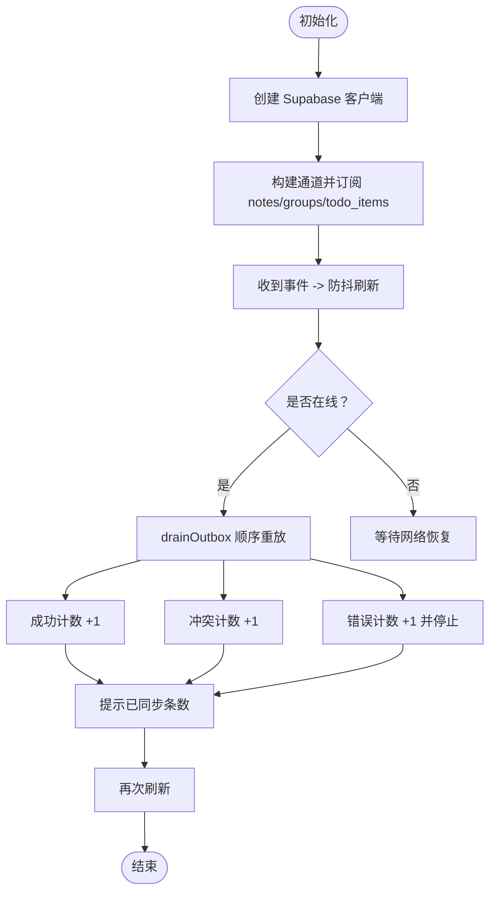
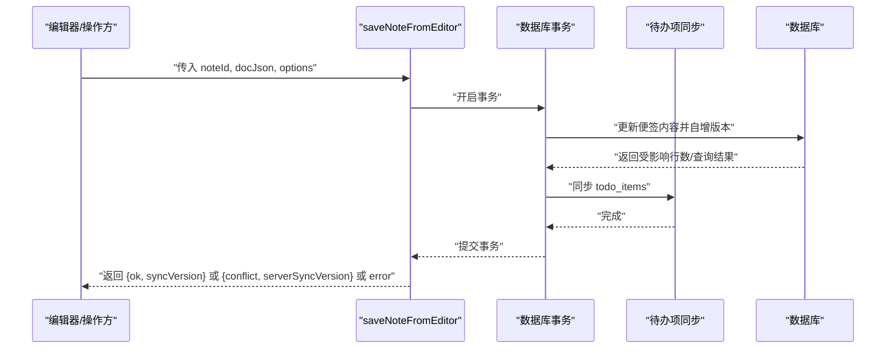
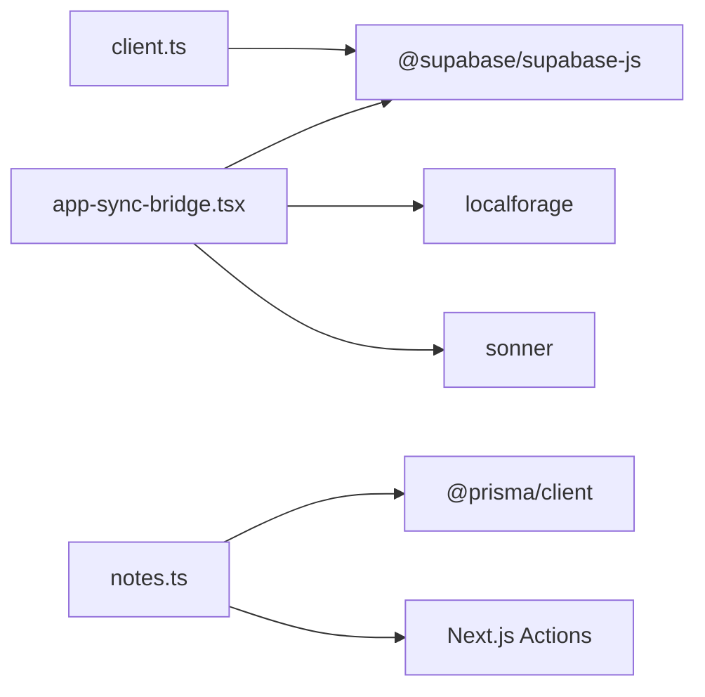

# 实时同步 API

<cite>
**本文引用的文件**
- [src/components/app/app-sync-bridge.tsx](file://src/components/app/app-sync-bridge.tsx)
- [src/lib/supabase/client.ts](file://src/lib/supabase/client.ts)
- [src/lib/offline/note-outbox.ts](file://src/lib/offline/note-outbox.ts)
- [src/actions/notes.ts](file://src/actions/notes.ts)
- [src/lib/todo/sync-todo-items-for-note.ts](file://src/lib/todo/sync-todo-items-for-note.ts)
- [supabase/migrations/20260513140000_realtime_publication.sql](file://supabase/migrations/20260513140000_realtime_publication.sql)
- [package.json](file://package.json)
- [src/lib/db/index.ts](file://src/lib/db/index.ts)
</cite>

## 目录
1. [简介](#简介)
2. [项目结构](#项目结构)
3. [核心组件](#核心组件)
4. [架构总览](#架构总览)
5. [详细组件分析](#详细组件分析)
6. [依赖关系分析](#依赖关系分析)
7. [性能考量](#性能考量)
8. [故障排查指南](#故障排查指南)
9. [结论](#结论)
10. [附录](#附录)

## 简介
本文件为 Smart-Todo 的实时同步系统提供全面的 API 文档，重点覆盖以下方面：
- Supabase Realtime 的集成与订阅管理、事件监听与连接维护
- 实时同步桥接组件的接口与行为，包括数据同步、冲突检测与版本控制
- 离线队列系统的 API 规范，涵盖本地存储、队列管理与批量同步流程
- 实时数据同步的状态管理，包括同步状态跟踪、错误恢复与重试机制
- 实时同步的配置选项、性能调优与网络适应性
- 安全考虑（数据加密、访问控制、隐私保护）
- 监控指标与调试工具
- 扩展性与分布式部署建议

## 项目结构
实时同步相关的关键模块分布如下：
- 客户端实时桥接：负责订阅 Supabase Realtime 事件并触发页面刷新
- 离线队列：基于 localforage 的本地持久化与批量重放
- 后端动作层：提供幂等的保存接口与版本控制逻辑
- 数据库与迁移：启用 RLS 与 realtime publication，确保订阅可见性
- Supabase 客户端封装：统一创建 Supabase 客户端实例



图表来源
- [src/components/app/app-sync-bridge.tsx:1-118](file://src/components/app/app-sync-bridge.tsx#L1-L118)
- [src/lib/supabase/client.ts:1-9](file://src/lib/supabase/client.ts#L1-L9)
- [src/lib/offline/note-outbox.ts:1-86](file://src/lib/offline/note-outbox.ts#L1-L86)
- [src/actions/notes.ts:1-230](file://src/actions/notes.ts#L1-L230)
- [src/lib/todo/sync-todo-items-for-note.ts:1-59](file://src/lib/todo/sync-todo-items-for-note.ts#L1-L59)
- [supabase/migrations/20260513140000_realtime_publication.sql:1-7](file://supabase/migrations/20260513140000_realtime_publication.sql#L1-L7)

章节来源
- [src/components/app/app-sync-bridge.tsx:1-118](file://src/components/app/app-sync-bridge.tsx#L1-L118)
- [src/lib/supabase/client.ts:1-9](file://src/lib/supabase/client.ts#L1-L9)
- [src/lib/offline/note-outbox.ts:1-86](file://src/lib/offline/note-outbox.ts#L1-L86)
- [src/actions/notes.ts:1-230](file://src/actions/notes.ts#L1-L230)
- [src/lib/todo/sync-todo-items-for-note.ts:1-59](file://src/lib/todo/sync-todo-items-for-note.ts#L1-L59)
- [supabase/migrations/20260513140000_realtime_publication.sql:1-7](file://supabase/migrations/20260513140000_realtime_publication.sql#L1-L7)
- [src/lib/db/index.ts:1-16](file://src/lib/db/index.ts#L1-L16)

## 核心组件
- 实时桥接组件：在登录后的应用壳内订阅 notes/groups/todo_items 的 postgres_changes 事件，通过防抖触发路由刷新，同时在联网时尝试刷出离线队列。
- Supabase 客户端封装：提供统一的浏览器端 Supabase 客户端创建入口。
- 离线队列：基于 localforage 的 outbox 存储，支持入队、列出、移除与顺序重放。
- 服务端动作：提供带版本控制的便签内容保存接口，支持乐观并发与离线重放场景下的 LWW（最后写入获胜）策略。

章节来源
- [src/components/app/app-sync-bridge.tsx:16-118](file://src/components/app/app-sync-bridge.tsx#L16-L118)
- [src/lib/supabase/client.ts:3-8](file://src/lib/supabase/client.ts#L3-L8)
- [src/lib/offline/note-outbox.ts:10-86](file://src/lib/offline/note-outbox.ts#L10-L86)
- [src/actions/notes.ts:59-152](file://src/actions/notes.ts#L59-L152)

## 架构总览
实时同步由“客户端订阅 + 服务端持久化 + 离线队列重放”三部分组成：
- 客户端通过 Supabase Realtime 订阅用户相关的变更事件，收到事件后触发页面刷新以拉取最新数据。
- 用户在离线或弱网环境下产生的变更被写入本地 outbox；当网络恢复时顺序重放，成功则移除，冲突或错误则保留以便后续处理。
- 服务端保存接口采用“期望版本锁 + 自增版本号”的并发控制策略，支持离线重放时跳过版本校验。



图表来源
- [src/components/app/app-sync-bridge.tsx:37-114](file://src/components/app/app-sync-bridge.tsx#L37-L114)
- [src/lib/offline/note-outbox.ts:48-86](file://src/lib/offline/note-outbox.ts#L48-L86)
- [src/actions/notes.ts:140-152](file://src/actions/notes.ts#L140-L152)

## 详细组件分析

### 实时桥接组件 API
- 组件职责
  - 创建 Supabase 通道并订阅 notes/groups/todo_items 的 postgres_changes 事件，按用户维度过滤。
  - 使用防抖机制减少频繁刷新带来的性能开销。
  - 监听 online 事件，在网络恢复时尝试刷出离线队列，并提示同步结果。
- 关键参数
  - userId：用户标识，用于生成私有通道名与事件过滤条件。
  - 刷新防抖时间：固定为 900ms。
- 生命周期
  - 初始化：创建客户端、建立通道、注册事件回调、订阅。
  - 销毁：清理防抖定时器、移除通道。
- 事件处理
  - 收到事件：触发防抖刷新。
  - 订阅回调：捕获 CHANNEL_ERROR 并输出警告日志。



图表来源
- [src/components/app/app-sync-bridge.tsx:20-114](file://src/components/app/app-sync-bridge.tsx#L20-L114)

章节来源
- [src/components/app/app-sync-bridge.tsx:16-118](file://src/components/app/app-sync-bridge.tsx#L16-L118)

### Supabase 客户端封装 API
- 功能：封装浏览器端 Supabase 客户端创建，读取环境变量中的 Supabase URL 与匿名密钥。
- 适用场景：所有需要与 Supabase 交互的客户端代码统一通过该函数获取实例。

章节来源
- [src/lib/supabase/client.ts:3-8](file://src/lib/supabase/client.ts#L3-L8)

### 离线队列 API
- 存储引擎：localforage，命名空间为 smart-note，store 名为 note_outbox。
- 数据模型：OutboxEntry 包含 noteId、Tiptap JSON 文档、入队时间戳。
- 核心方法
  - enqueueNoteSave(noteId, docJson)：入队，同一 noteId 仅保留最后一次内容。
  - listOutbox()：列出全部待重放条目。
  - removeOutboxEntry(noteId)：移除指定条目。
  - drainOutbox(saver)：顺序重放队列，支持三种结果分类统计（flushed、failed）。
- 冲突与错误处理
  - 成功：移除队列条目，flushed+1。
  - 冲突：移除队列条目，failed+1（交由上层决定是否保留或提示）。
  - 失败：failed+1，若为错误则中断后续重放。

```mermaid
classDiagram
class OutboxEntry {
+string noteId
+unknown docJson
+number enqueuedAt
}
class NoteOutbox {
+enqueueNoteSave(noteId, docJson) Promise~void~
+listOutbox() Promise~OutboxEntry[]~
+removeOutboxEntry(noteId) Promise~void~
+drainOutbox(saver) Promise~{flushed, failed}~
}
NoteOutbox --> OutboxEntry : "管理"
```

图表来源
- [src/lib/offline/note-outbox.ts:10-86](file://src/lib/offline/note-outbox.ts#L10-L86)

章节来源
- [src/lib/offline/note-outbox.ts:10-86](file://src/lib/offline/note-outbox.ts#L10-L86)

### 服务端动作：便签内容保存 API
- 接口名称：saveNoteFromEditor
  - 输入：noteId、docJson、可选期望版本与跳过版本校验标志
  - 输出：保存结果（ok/syncVersion、conflict/serverSyncVersion、error）
- 接口名称：updateNoteContent
  - 输入：noteId、contentJson、contentText、title、可选期望版本与跳过版本校验标志
  - 输出：保存结果（ok/syncVersion、conflict/serverSyncVersion、error）
- 版本控制与并发
  - 默认使用期望版本锁进行乐观并发控制。
  - 离线重放场景可通过 skipExpectedVersion=true 跳过版本校验，采用 LWW 策略。
  - 事务内同时更新便签内容与自增版本号，并同步 todo_items。
- 冲突检测
  - 当更新未命中行时，区分“便签不存在/已删除”与“并发冲突”，返回不同错误码。
- 重新验证
  - 成功后对相关路径执行 revalidate，确保 Next.js 缓存一致性。



图表来源
- [src/actions/notes.ts:59-152](file://src/actions/notes.ts#L59-L152)
- [src/lib/todo/sync-todo-items-for-note.ts:4-59](file://src/lib/todo/sync-todo-items-for-note.ts#L4-L59)

章节来源
- [src/actions/notes.ts:59-152](file://src/actions/notes.ts#L59-L152)
- [src/lib/todo/sync-todo-items-for-note.ts:4-59](file://src/lib/todo/sync-todo-items-for-note.ts#L4-L59)

### 数据库与迁移配置
- RLS 与 Storage：启用行级安全策略与存储桶配置（迁移文件存在）。
- Realtime Publication：将 notes、groups、todo_items 加入 supabase_realtime publication，使客户端可通过 postgres_changes 订阅。
- 数据库客户端：全局缓存 PrismaClient，开发模式下开启查询日志。

章节来源
- [supabase/migrations/20260513140000_realtime_publication.sql:1-7](file://supabase/migrations/20260513140000_realtime_publication.sql#L1-L7)
- [src/lib/db/index.ts:1-16](file://src/lib/db/index.ts#L1-L16)

## 依赖关系分析
- 客户端依赖
  - @supabase/supabase-js：用于 Realtime 订阅与通道管理
  - localforage：用于离线队列的本地持久化
  - sonner：用于消息提示
- 服务端依赖
  - @prisma/client：ORM 访问数据库
  - Next.js Actions：服务端函数，提供幂等保存接口
- 运行时配置
  - NEXT_PUBLIC_SUPABASE_URL、NEXT_PUBLIC_SUPABASE_ANON_KEY：Supabase 客户端初始化
  - NEXT_PUBLIC_VAPID_PUBLIC_KEY：Web Push 订阅（与实时同步同属前端通知体系）



图表来源
- [package.json:22-60](file://package.json#L22-L60)
- [src/components/app/app-sync-bridge.tsx:1-118](file://src/components/app/app-sync-bridge.tsx#L1-L118)
- [src/actions/notes.ts:1-230](file://src/actions/notes.ts#L1-L230)
- [src/lib/supabase/client.ts:1-9](file://src/lib/supabase/client.ts#L1-L9)

章节来源
- [package.json:22-60](file://package.json#L22-L60)

## 性能考量
- 订阅粒度与过滤
  - 通过 user_id 过滤减少无关事件，降低客户端处理压力。
- 防抖刷新
  - 900ms 防抖窗口避免高频事件导致的重复刷新与渲染抖动。
- 顺序重放
  - drainOutbox 逐条重放，保证幂等与一致性；遇到错误立即停止，避免连锁失败。
- 事务内同步
  - 便签更新与 todo_items 对齐在单事务内完成，减少中间态与二次同步。
- 日志与告警
  - 订阅回调中对 CHANNEL_ERROR 进行警告输出，便于问题定位。

章节来源
- [src/components/app/app-sync-bridge.tsx:10-118](file://src/components/app/app-sync-bridge.tsx#L10-L118)
- [src/lib/offline/note-outbox.ts:48-86](file://src/lib/offline/note-outbox.ts#L48-L86)
- [src/actions/notes.ts:59-152](file://src/actions/notes.ts#L59-L152)

## 故障排查指南
- 订阅无响应
  - 确认 Supabase Realtime 已启用且 publication 已包含目标表。
  - 检查环境变量是否正确，确认客户端初始化成功。
- 冲突与版本问题
  - 离线重放时使用 skipExpectedVersion=true 以 LWW 覆盖本地最新内容。
  - 服务端返回 conflict 时，提示用户以服务器版本为准或合并更改。
- 网络恢复后未同步
  - 确认 online 事件已触发，drainOutbox 返回 flush/fail 统计。
  - 检查 saver 回调是否抛出异常或返回 error。
- 日志与监控
  - 订阅回调输出 CHANNEL_ERROR 警告。
  - 使用浏览器开发者工具 Network 面板查看 Realtime 与 API 请求状态。

章节来源
- [supabase/migrations/20260513140000_realtime_publication.sql:1-7](file://supabase/migrations/20260513140000_realtime_publication.sql#L1-L7)
- [src/lib/supabase/client.ts:3-8](file://src/lib/supabase/client.ts#L3-L8)
- [src/components/app/app-sync-bridge.tsx:79-83](file://src/components/app/app-sync-bridge.tsx#L79-L83)
- [src/lib/offline/note-outbox.ts:48-86](file://src/lib/offline/note-outbox.ts#L48-L86)
- [src/actions/notes.ts:121-137](file://src/actions/notes.ts#L121-L137)

## 结论
Smart-Todo 的实时同步系统通过 Supabase Realtime 与本地离线队列实现了低延迟、高可用的数据同步。客户端侧的防抖刷新与服务端侧的版本控制共同保障了并发安全与最终一致性。配合完善的错误处理与监控，系统在弱网与离线场景下仍能保持良好的用户体验。

## 附录

### 配置选项与环境变量
- Supabase
  - NEXT_PUBLIC_SUPABASE_URL：Supabase 项目 URL
  - NEXT_PUBLIC_SUPABASE_ANON_KEY：匿名访问密钥
- Web Push（与实时同步同属前端通知体系）
  - NEXT_PUBLIC_VAPID_PUBLIC_KEY：VAPID 公钥，用于 Web Push 订阅

章节来源
- [src/lib/supabase/client.ts:4-7](file://src/lib/supabase/client.ts#L4-L7)
- [src/components/push/web-push-subscribe-button.tsx:18-18](file://src/components/push/web-push-subscribe-button.tsx#L18-L18)

### 安全考虑
- 访问控制
  - 通过 RLS 与用户过滤条件限制订阅范围，确保每个用户只能接收自身数据变更。
- 数据传输
  - 使用 Supabase 提供的加密通道进行实时通信。
- 隐私保护
  - 离线队列仅存储必要的文档快照，不包含敏感字段；建议在生产环境启用 HTTPS 与最小权限原则。

章节来源
- [supabase/migrations/20260513140000_realtime_publication.sql:1-7](file://supabase/migrations/20260513140000_realtime_publication.sql#L1-L7)
- [src/components/app/app-sync-bridge.tsx:46-74](file://src/components/app/app-sync-bridge.tsx#L46-L74)

### 监控指标与调试工具
- 指标建议
  - 订阅连接状态（CONNECTED/DISCONNECTED/ERROR）
  - 事件到达速率与延迟
  - 队列积压数量与重放成功率
  - 冲突率与失败率
- 调试工具
  - 浏览器 Network 面板观察 Realtime 与 API 请求
  - 控制台日志：订阅回调中的警告输出
  - 服务端日志：开发模式下 Prisma 查询日志

章节来源
- [src/components/app/app-sync-bridge.tsx:79-83](file://src/components/app/app-sync-bridge.tsx#L79-L83)
- [src/lib/db/index.ts:9-11](file://src/lib/db/index.ts#L9-L11)

### 扩展性与分布式部署
- 水平扩展
  - 使用 Supabase Realtime 的多节点部署与负载均衡，确保高可用。
  - 将 outbox 存储与服务端解耦，可在多实例间共享存储（如 IndexedDB/LocalStorage 的跨标签页一致性需谨慎评估）。
- 分布式一致性
  - 通过版本号与事务保证最终一致；对关键路径增加重试与幂等设计。
- 网络适应性
  - 根据网络状态动态调整防抖窗口与重放频率；在弱网环境下优先保证本地体验与数据安全。

[本节为概念性建议，无需源文件引用]