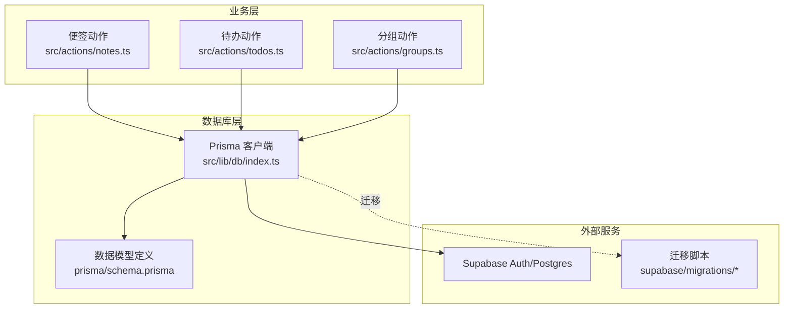
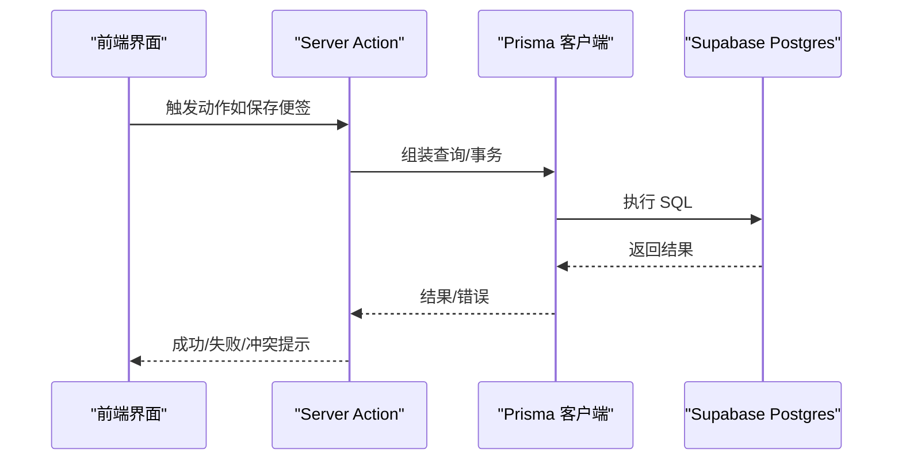
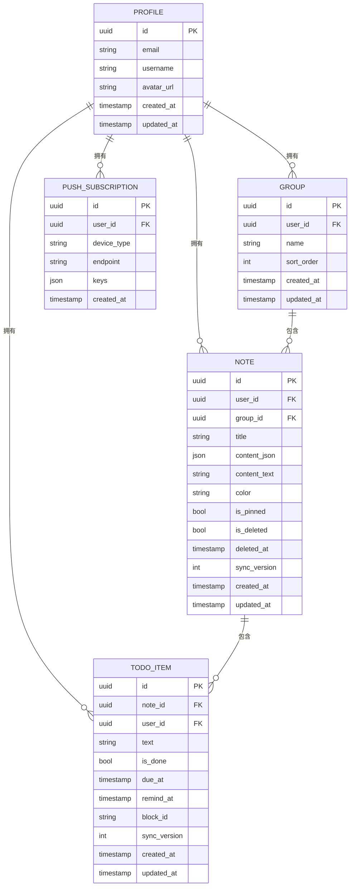
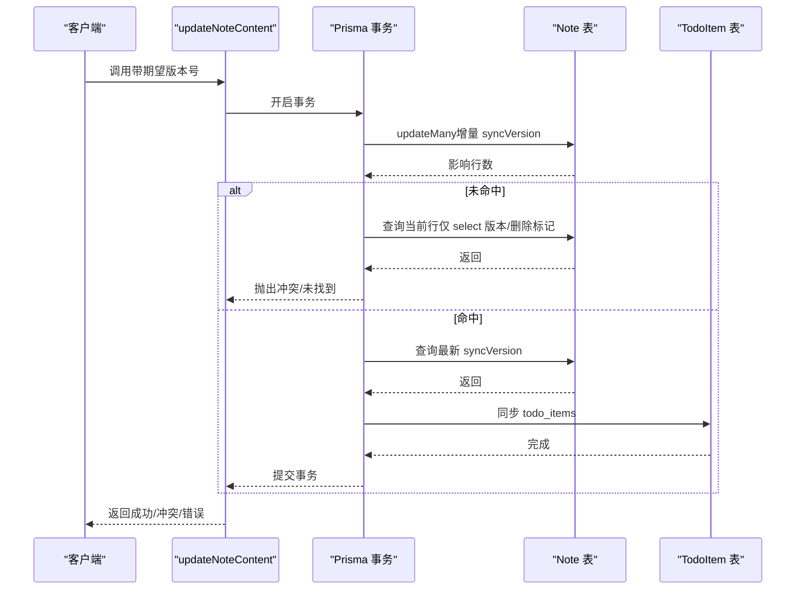
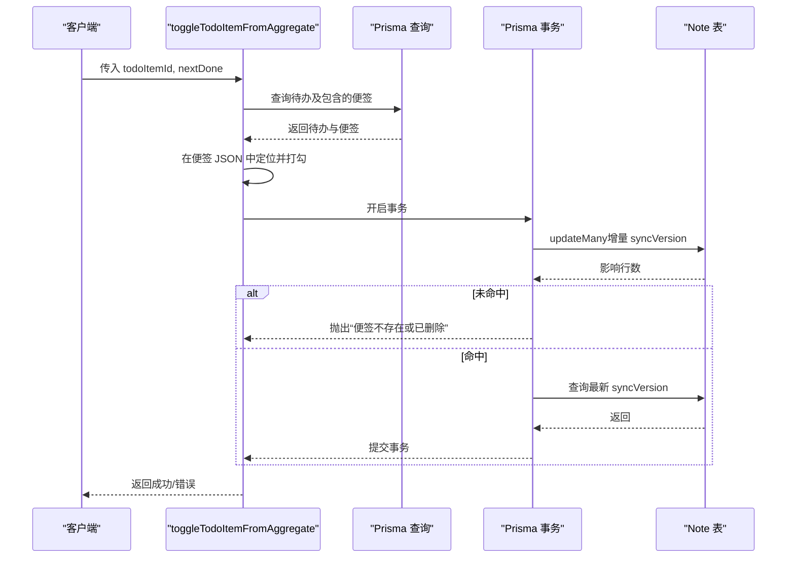
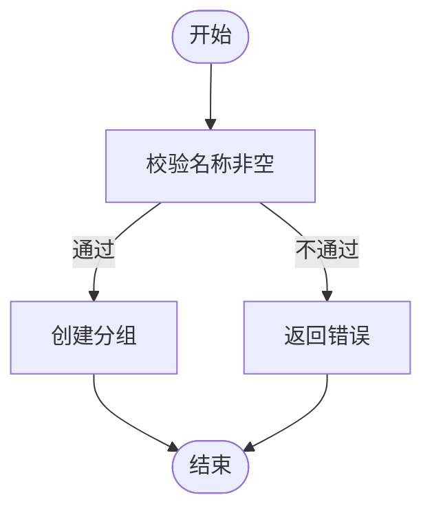
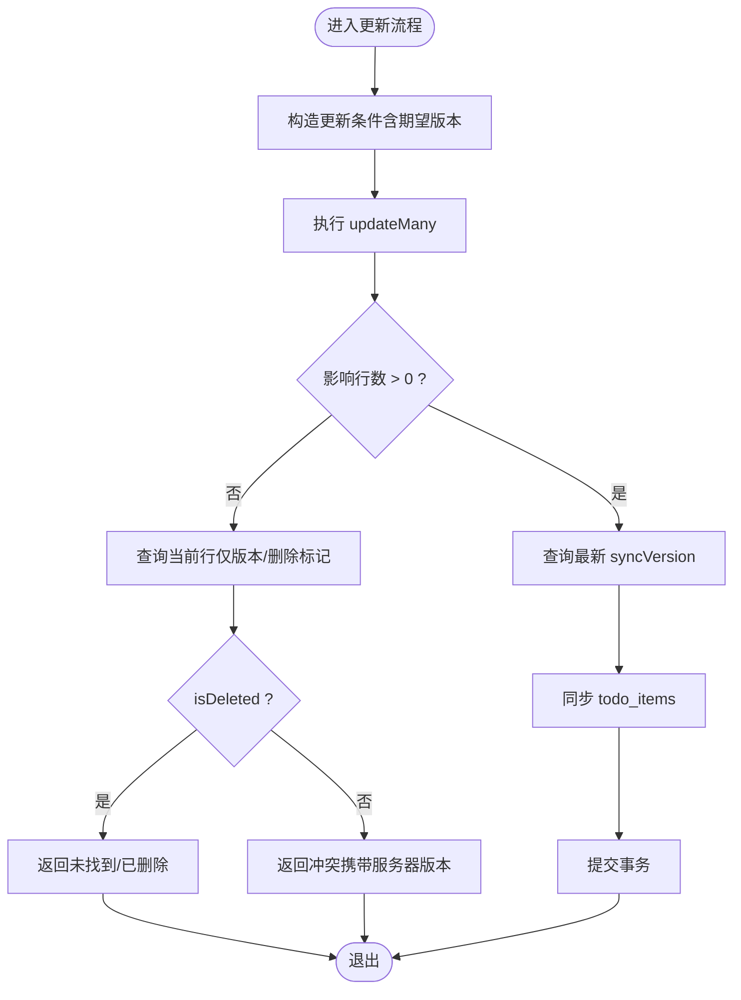
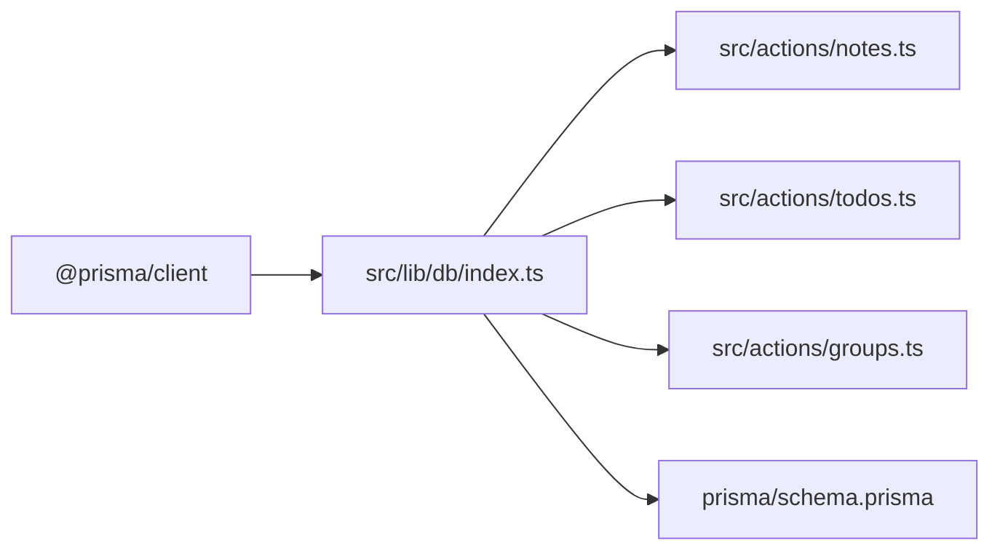

# 数据库 API

<cite>
**本文引用的文件**
- [prisma/schema.prisma](file://prisma/schema.prisma)
- [src/lib/db/index.ts](file://src/lib/db/index.ts)
- [src/actions/notes.ts](file://src/actions/notes.ts)
- [src/actions/todos.ts](file://src/actions/todos.ts)
- [src/actions/groups.ts](file://src/actions/groups.ts)
- [src/lib/constants.ts](file://src/lib/constants.ts)
- [package.json](file://package.json)
</cite>

## 目录
1. [简介](#简介)
2. [项目结构](#项目结构)
3. [核心组件](#核心组件)
4. [架构总览](#架构总览)
5. [详细组件分析](#详细组件分析)
6. [依赖分析](#依赖分析)
7. [性能考虑](#性能考虑)
8. [故障排查指南](#故障排查指南)
9. [结论](#结论)
10. [附录](#附录)

## 简介
本文件面向 Smart-Todo 的数据库访问层，系统化梳理基于 Prisma 的数据模型、查询构建、事务处理与 API 使用方式，并结合项目中的实际实现，给出接口规范、并发控制策略、性能优化建议与运维脚本说明。数据库后端为 Supabase Postgres，鉴权由 Supabase Auth 提供，业务表通过 userId 关联。

## 项目结构
数据库相关的核心位置如下：
- 数据模型定义：prisma/schema.prisma
- Prisma 客户端实例：src/lib/db/index.ts
- 业务动作层（Server Actions）：src/actions/*.ts
- 常量与颜色枚举：src/lib/constants.ts
- 数据库脚本与迁移命令：package.json

**图表来源**
- [src/lib/db/index.ts:1-16](file://src/lib/db/index.ts#L1-L16)
- [prisma/schema.prisma:1-117](file://prisma/schema.prisma#L1-L117)
- [src/actions/notes.ts:1-230](file://src/actions/notes.ts#L1-L230)
- [src/actions/todos.ts:1-70](file://src/actions/todos.ts#L1-L70)
- [src/actions/groups.ts:1-59](file://src/actions/groups.ts#L1-L59)

**章节来源**
- [src/lib/db/index.ts:1-16](file://src/lib/db/index.ts#L1-L16)
- [prisma/schema.prisma:1-117](file://prisma/schema.prisma#L1-L117)
- [package.json:1-86](file://package.json#L1-L86)

## 核心组件
- Prisma 客户端实例：全局单例，开发环境开启查询日志，生产环境仅记录错误。
- 数据模型：Profile、Group、Note、TodoItem、PushSubscription。
- 动作层 API：便签 CRUD、移动分组、软删除/恢复、置顶/着色、待办勾选回写、分组增删改等。
- 并发控制：基于 Note.syncVersion 的乐观锁；对冲突进行明确返回。
- 事务：跨表更新与一致性保障，如分组删除时先清空关联笔记的分组再删除分组。

**章节来源**
- [src/lib/db/index.ts:1-16](file://src/lib/db/index.ts#L1-L16)
- [prisma/schema.prisma:15-117](file://prisma/schema.prisma#L15-L117)
- [src/actions/notes.ts:59-138](file://src/actions/notes.ts#L59-L138)
- [src/actions/todos.ts:12-69](file://src/actions/todos.ts#L12-L69)
- [src/actions/groups.ts:42-50](file://src/actions/groups.ts#L42-L50)

## 架构总览
下图展示数据库访问层的整体交互：前端通过 Next Server Actions 调用业务逻辑，业务逻辑封装 Prisma 查询与事务，最终落到 Supabase Postgres。

**图表来源**
- [src/actions/notes.ts:23-36](file://src/actions/notes.ts#L23-L36)
- [src/actions/todos.ts:12-69](file://src/actions/todos.ts#L12-L69)
- [src/lib/db/index.ts:1-16](file://src/lib/db/index.ts#L1-L16)

## 详细组件分析

### 数据模型与关系
- Profile（用户资料）
  - 字段：id、email、username、avatarUrl、createdAt、updatedAt
  - 关系：一对多到 Group、Note、TodoItem、PushSubscription
  - 约束：id 为主键，UUID 类型
- Group（自定义分组）
  - 字段：id、userId、name、sortOrder、createdAt、updatedAt
  - 关系：属于 Profile；一对多到 Note
  - 约束：id 主键；外键级联删除；索引(userId)
- Note（便签）
  - 字段：id、userId、groupId、title、contentJson、contentText、color、isPinned、isDeleted、deletedAt、syncVersion、createdAt、updatedAt
  - 关系：属于 Profile 与可选 Group；一对多到 TodoItem
  - 约束：id 主键；软删除；乐观并发版本号；索引（userId,isDeleted,isPinned,updatedAt）、（groupId）
- TodoItem（从便签内容抽取的待办项）
  - 字段：id、noteId、userId、text、isDone、dueAt、remindAt、blockId、syncVersion、createdAt、updatedAt
  - 关系：属于 Note 与 Profile
  - 约束：唯一索引（noteId,blockId）；索引（userId,remindAt）、（userId,isDone,dueAt）、（noteId）
- PushSubscription（推送订阅）
  - 字段：id、userId、deviceType、endpoint、keys、createdAt
  - 关系：属于 Profile
  - 约束：唯一索引（userId,endpoint）；索引（userId）

**图表来源**
- [prisma/schema.prisma:15-117](file://prisma/schema.prisma#L15-L117)

**章节来源**
- [prisma/schema.prisma:15-117](file://prisma/schema.prisma#L15-L117)

### 便签 API（Notes）
- 创建空白便签
  - 入参：无（隐式当前用户）
  - 行为：创建默认内容的便签，跳转至新便签页面
  - 关键点：写入默认文档结构，设置空标题与空内容文本
- 在分组内创建便签
  - 入参：groupId
  - 行为：校验分组归属，创建便签并绑定分组
- 更新便签内容（含乐观锁）
  - 入参：noteId、contentJson、contentText、title、选项（期望版本号、是否跳过版本校验）
  - 行为：事务内更新 contentJson/title/syncVersion；若更新计数为 0，则判定为冲突或资源不存在
  - 冲突处理：返回冲突状态与服务器最新版本号
- 从编辑器保存（自动派生标题与纯文本）
  - 入参：noteId、docJson、选项
  - 行为：确保任务块 ID、派生标题与纯文本后调用更新函数
- 移动便签到分组
  - 入参：noteId、groupId
  - 行为：校验分组归属，更新笔记分组字段
- 软删除/恢复/永久删除
  - 行为：标记 isDeleted、deletedAt；恢复时清除标记；永久删除清理回收站
- 置顶/着色
  - 行为：更新 isPinned/color 字段

**图表来源**
- [src/actions/notes.ts:59-138](file://src/actions/notes.ts#L59-L138)

**章节来源**
- [src/actions/notes.ts:23-36](file://src/actions/notes.ts#L23-L36)
- [src/actions/notes.ts:38-57](file://src/actions/notes.ts#L38-L57)
- [src/actions/notes.ts:59-138](file://src/actions/notes.ts#L59-L138)
- [src/actions/notes.ts:141-152](file://src/actions/notes.ts#L141-L152)
- [src/actions/notes.ts:154-173](file://src/actions/notes.ts#L154-L173)
- [src/actions/notes.ts:175-185](file://src/actions/notes.ts#L175-L185)
- [src/actions/notes.ts:187-197](file://src/actions/notes.ts#L187-L197)
- [src/actions/notes.ts:199-207](file://src/actions/notes.ts#L199-L207)
- [src/actions/notes.ts:220-229](file://src/actions/notes.ts#L220-L229)

### 待办 API（Todos）
- 聚合页勾选完成
  - 入参：todoItemId、目标完成状态
  - 行为：读取待办及其所属便签；在便签 JSON 中定位并打勾；回写便签 JSON、标题与纯文本；事务内更新便签并同步 todo_items

**图表来源**
- [src/actions/todos.ts:12-69](file://src/actions/todos.ts#L12-L69)

**章节来源**
- [src/actions/todos.ts:12-69](file://src/actions/todos.ts#L12-L69)

### 分组 API（Groups）
- 创建分组
  - 入参：name
  - 行为：去除首尾空格后创建
- 重命名分组
  - 入参：groupId、name
  - 行为：校验存在性后更新
- 删除分组
  - 行为：事务内先将该分组下的笔记 groupId 清空，再删除分组本身

**图表来源**
- [src/actions/groups.ts:7-21](file://src/actions/groups.ts#L7-L21)

**章节来源**
- [src/actions/groups.ts:7-21](file://src/actions/groups.ts#L7-L21)
- [src/actions/groups.ts:23-38](file://src/actions/groups.ts#L23-L38)
- [src/actions/groups.ts:40-53](file://src/actions/groups.ts#L40-L53)

### 并发控制与冲突处理
- 乐观锁机制
  - 通过 Note.syncVersion 实现：更新时带上期望版本号，仅当数据库中版本匹配且未被删除时才允许更新
  - 若更新计数为 0，则区分“资源不存在/已删除”与“版本冲突”，分别返回不同错误码
- 冲突处理策略
  - 返回服务器最新版本号，客户端据此决定是否重试或提示用户
  - 对离线重放场景提供跳过版本校验选项（LWW 场景）

**图表来源**
- [src/actions/notes.ts:72-138](file://src/actions/notes.ts#L72-L138)

**章节来源**
- [src/actions/notes.ts:72-138](file://src/actions/notes.ts#L72-L138)

### 事务使用模式
- 单表更新：如置顶、着色、移动分组等
- 多表一致性：如删除分组（先清空笔记分组再删除分组）
- 读写一致性：如更新便签内容时同时同步 todo_items，保证文档与索引一致

**章节来源**
- [src/actions/groups.ts:42-50](file://src/actions/groups.ts#L42-L50)
- [src/actions/notes.ts:81-120](file://src/actions/notes.ts#L81-L120)
- [src/actions/todos.ts:30-57](file://src/actions/todos.ts#L30-L57)

### 错误处理与异常管理
- 明确的错误类型：
  - “便签不存在或已删除”
  - “同步冲突（携带服务器版本）”
- 未捕获异常将向上抛出，由上层框架处理
- 对于“未找到/冲突”的分支，返回结构化的错误对象，便于前端提示

**章节来源**
- [src/actions/notes.ts:121-133](file://src/actions/notes.ts#L121-L133)
- [src/actions/todos.ts:58-63](file://src/actions/todos.ts#L58-L63)

## 依赖分析
- Prisma 客户端依赖：@prisma/client
- 运维脚本：通过 package.json 中的脚本进行生成、迁移、RLS/Storage/Realtime 初始化等
- 数据模型与索引：schema.prisma 定义了主键、外键、索引与唯一约束

**图表来源**
- [package.json:27](file://package.json#L27)
- [src/lib/db/index.ts:1-16](file://src/lib/db/index.ts#L1-L16)
- [src/actions/notes.ts:6](file://src/actions/notes.ts#L6)
- [src/actions/todos.ts:5](file://src/actions/todos.ts#L5)
- [src/actions/groups.ts:4](file://src/actions/groups.ts#L4)
- [prisma/schema.prisma:5-13](file://prisma/schema.prisma#L5-L13)

**章节来源**
- [package.json:22-86](file://package.json#L22-L86)
- [src/lib/db/index.ts:1-16](file://src/lib/db/index.ts#L1-L16)
- [prisma/schema.prisma:5-13](file://prisma/schema.prisma#L5-L13)

## 性能考虑
- 索引使用
  - Note：按 (userId,isDeleted,isPinned,updatedAt) 排序检索；按 groupId 快速定位分组内便签
  - TodoItem：按 (userId,remindAt) 与 (userId,isDone,dueAt) 支持提醒与聚合查询
  - Group/PushSubscription：按 userId 建立索引以加速用户维度查询
- 查询计划
  - 利用现有索引避免全表扫描；对高频过滤字段（如 isDeleted、isDone、remindAt）优先使用索引
- 缓存策略
  - Next.js revalidatePath 用于失效路由缓存，避免脏读
  - 对热点列表（如便签列表、待办聚合）可结合 React Query 缓存策略（需在上层实现）
- 连接池与高可用
  - 通过 DATABASE_URL/DIRECT_URL 环境变量配置连接；PrismaClient 默认行为适配 Supabase
  - 生产环境仅记录错误日志，降低开销

**章节来源**
- [prisma/schema.prisma:72-98](file://prisma/schema.prisma#L72-L98)
- [src/lib/db/index.ts:9-11](file://src/lib/db/index.ts#L9-L11)

## 故障排查指南
- 乐观锁冲突
  - 现象：返回“同步冲突”，携带服务器最新版本号
  - 处理：客户端根据服务器版本重试或提示用户
- 资源不存在/已删除
  - 现象：返回“便签不存在或已删除”
  - 处理：刷新页面或提示用户
- 分组删除失败
  - 现象：删除前未清空笔记分组导致外键约束
  - 处理：确认事务已先更新笔记分组为空
- 查询慢
  - 检查是否命中索引；确认过滤字段包含在索引列中

**章节来源**
- [src/actions/notes.ts:121-133](file://src/actions/notes.ts#L121-L133)
- [src/actions/todos.ts:58-63](file://src/actions/todos.ts#L58-L63)
- [src/actions/groups.ts:42-50](file://src/actions/groups.ts#L42-L50)

## 结论
本数据库访问层以 Prisma 为核心，围绕便签、分组、待办与推送订阅构建了清晰的数据模型与 API。通过乐观锁与事务保障并发安全与一致性，配合索引与缓存策略满足常见查询性能需求。运维方面通过脚本化迁移与 Supabase RLS/Storage/Realtime 初始化，形成完整的生命周期管理。

## 附录

### 数据库连接配置
- 环境变量
  - DATABASE_URL：数据库连接串（用于 Prisma）
  - DIRECT_URL：直接连接串（用于某些 CLI 操作）
- 日志级别
  - 开发环境：记录 query/warn/error
  - 生产环境：仅记录 error

**章节来源**
- [prisma/schema.prisma:9-13](file://prisma/schema.prisma#L9-L13)
- [src/lib/db/index.ts:9-11](file://src/lib/db/index.ts#L9-L11)

### 迁移与初始化脚本
- 生成客户端：db:generate
- 推送/拉取模式：db:push
- 迁移开发：db:migrate
- Studio 可视化：db:studio
- 重置迁移：db:reset
- RLS 策略：db:rls
- 存储与图片：db:storage
- Realtime 发布：db:realtime

**章节来源**
- [package.json:12-20](file://package.json#L12-L20)

### 便签颜色枚举
- 便签支持的颜色：黄色、粉色、蓝色、绿色、紫色、灰色
- 类型别名：NoteColor

**章节来源**
- [src/lib/constants.ts:4-15](file://src/lib/constants.ts#L4-L15)