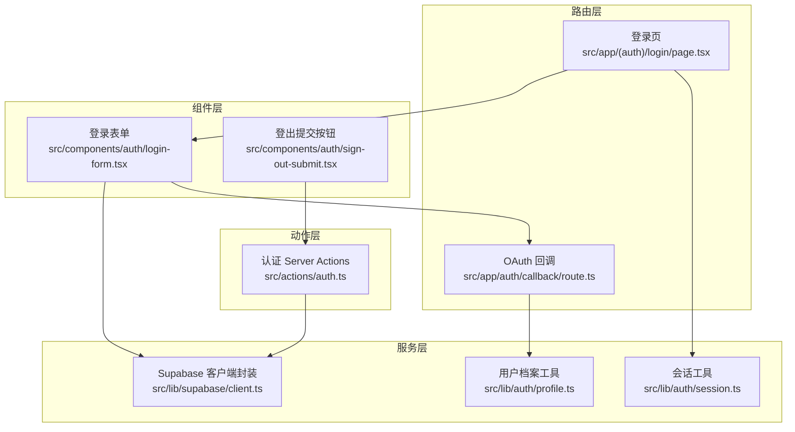
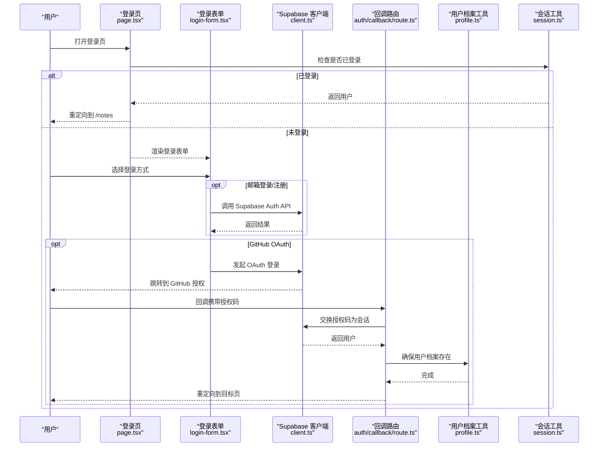
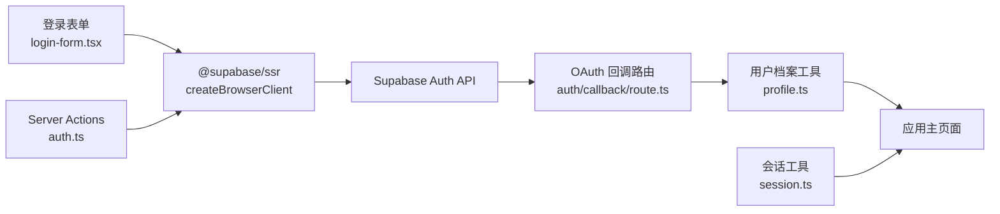

# 认证 API

<cite>
**本文引用的文件**
- [src/actions/auth.ts](file://src/actions/auth.ts)
- [src/app/auth/callback/route.ts](file://src/app/auth/callback/route.ts)
- [src/app/(auth)/login/page.tsx](file://src/app/(auth)/login/page.tsx)
- [src/components/auth/login-form.tsx](file://src/components/auth/login-form.tsx)
- [src/components/auth/sign-out-submit.tsx](file://src/components/auth/sign-out-submit.tsx)
- [src/lib/auth/session.ts](file://src/lib/auth/session.ts)
- [src/lib/auth/profile.ts](file://src/lib/auth/profile.ts)
- [src/lib/supabase/client.ts](file://src/lib/supabase/client.ts)
- [package.json](file://package.json)
</cite>

## 目录
1. [简介](#简介)
2. [项目结构](#项目结构)
3. [核心组件](#核心组件)
4. [架构总览](#架构总览)
5. [详细组件分析](#详细组件分析)
6. [依赖关系分析](#依赖关系分析)
7. [性能考量](#性能考量)
8. [故障排查指南](#故障排查指南)
9. [结论](#结论)
10. [附录](#附录)

## 简介
本文件为 Smart-Todo 的认证系统提供全面的 API 文档，覆盖 Supabase Auth 集成（含 OAuth 回调）、会话管理、用户注册与登录机制、认证 Server Actions 接口规范、会话状态检查与自动续期、认证中间件与权限控制、前端集成与后端处理流程、安全注意事项（CSRF、会话劫持、密码策略）、调试技巧与常见问题，以及扩展性与自定义建议。

## 项目结构
认证相关代码主要分布在以下模块：
- 路由层：登录页与 OAuth 回调处理
- 组件层：登录表单、登出提交按钮
- 服务层：Supabase 客户端封装、会话与用户档案工具
- 动作层：认证相关的 Server Actions

图表来源
- [src/app/(auth)/login/page.tsx:1-31](file://src/app/(auth)/login/page.tsx#L1-L31)
- [src/app/auth/callback/route.ts:1-49](file://src/app/auth/callback/route.ts#L1-L49)
- [src/components/auth/login-form.tsx:1-243](file://src/components/auth/login-form.tsx#L1-L243)
- [src/components/auth/sign-out-submit.tsx:1-31](file://src/components/auth/sign-out-submit.tsx#L1-L31)
- [src/lib/supabase/client.ts:1-9](file://src/lib/supabase/client.ts#L1-L9)
- [src/lib/auth/session.ts:1-19](file://src/lib/auth/session.ts#L1-L19)
- [src/lib/auth/profile.ts:1-30](file://src/lib/auth/profile.ts#L1-L30)
- [src/actions/auth.ts:1-13](file://src/actions/auth.ts#L1-L13)

章节来源
- [src/app/(auth)/login/page.tsx:1-31](file://src/app/(auth)/login/page.tsx#L1-L31)
- [src/app/auth/callback/route.ts:1-49](file://src/app/auth/callback/route.ts#L1-L49)
- [src/components/auth/login-form.tsx:1-243](file://src/components/auth/login-form.tsx#L1-L243)
- [src/components/auth/sign-out-submit.tsx:1-31](file://src/components/auth/sign-out-submit.tsx#L1-L31)
- [src/lib/supabase/client.ts:1-9](file://src/lib/supabase/client.ts#L1-L9)
- [src/lib/auth/session.ts:1-19](file://src/lib/auth/session.ts#L1-L19)
- [src/lib/auth/profile.ts:1-30](file://src/lib/auth/profile.ts#L1-L30)
- [src/actions/auth.ts:1-13](file://src/actions/auth.ts#L1-L13)

## 核心组件
- Supabase 客户端封装：在浏览器端创建 Supabase 客户端实例，用于直接调用 Supabase Auth API（如邮箱登录、注册、OAuth 登录）。
- 登录表单组件：支持邮箱密码登录与注册、GitHub OAuth 登录；负责错误提示与信息提示展示。
- OAuth 回调路由：接收来自 Supabase 的授权码，换取会话并确保用户档案存在，最后重定向到目标页面。
- 会话工具：提供获取当前用户与“必须已登录”校验的辅助函数，用于权限控制。
- 用户档案工具：根据 Supabase 用户元数据创建或更新业务侧用户档案。
- 认证 Server Actions：提供登出动作，清理会话并重定向至登录页。
- 登出提交按钮：配合 Server Actions 提供可访问的登出入口。

章节来源
- [src/lib/supabase/client.ts:1-9](file://src/lib/supabase/client.ts#L1-L9)
- [src/components/auth/login-form.tsx:1-243](file://src/components/auth/login-form.tsx#L1-L243)
- [src/app/auth/callback/route.ts:1-49](file://src/app/auth/callback/route.ts#L1-L49)
- [src/lib/auth/session.ts:1-19](file://src/lib/auth/session.ts#L1-L19)
- [src/lib/auth/profile.ts:1-30](file://src/lib/auth/profile.ts#L1-L30)
- [src/actions/auth.ts:1-13](file://src/actions/auth.ts#L1-L13)
- [src/components/auth/sign-out-submit.tsx:1-31](file://src/components/auth/sign-out-submit.tsx#L1-L31)

## 架构总览
下图展示了从用户访问登录页到完成会话建立与权限校验的整体流程。

图表来源
- [src/app/(auth)/login/page.tsx:1-31](file://src/app/(auth)/login/page.tsx#L1-L31)
- [src/components/auth/login-form.tsx:1-243](file://src/components/auth/login-form.tsx#L1-L243)
- [src/lib/supabase/client.ts:1-9](file://src/lib/supabase/client.ts#L1-L9)
- [src/app/auth/callback/route.ts:1-49](file://src/app/auth/callback/route.ts#L1-L49)
- [src/lib/auth/profile.ts:1-30](file://src/lib/auth/profile.ts#L1-L30)
- [src/lib/auth/session.ts:1-19](file://src/lib/auth/session.ts#L1-L19)

## 详细组件分析

### 登录页与会话检查
- 登录页负责在服务端检查当前会话，若已登录则直接重定向到应用主页面；否则渲染登录表单并传递初始错误参数。
- 会话工具提供“获取当前用户”和“必须已登录”的辅助方法，前者用于判断，后者用于强制跳转。

章节来源
- [src/app/(auth)/login/page.tsx:1-31](file://src/app/(auth)/login/page.tsx#L1-L31)
- [src/lib/auth/session.ts:1-19](file://src/lib/auth/session.ts#L1-L19)

### 登录表单组件
- 支持两种模式：登录与注册；通过切换标签页在两者间切换。
- 邮箱登录：调用 Supabase Auth 的邮箱密码登录接口，成功后跳转到应用主页面并刷新。
- 邮箱注册：调用 Supabase Auth 的注册接口，并设置回调地址；若启用邮箱验证，需等待邮件并通过回调完成会话建立。
- GitHub OAuth：调用 Supabase Auth 的 OAuth 登录接口，配置回调地址；授权完成后由回调路由处理并重定向。
- 错误与信息提示：统一通过组件状态展示，便于用户理解失败原因或操作指引。

章节来源
- [src/components/auth/login-form.tsx:1-243](file://src/components/auth/login-form.tsx#L1-L243)

### OAuth 回调路由
- 接收授权码，调用 Supabase Auth 的授权码换会话接口。
- 若发生错误，重定向回登录页并附带错误消息。
- 成功后获取当前用户，调用用户档案工具以确保业务侧档案存在。
- 最终根据 next 参数重定向到目标页面。

章节来源
- [src/app/auth/callback/route.ts:1-49](file://src/app/auth/callback/route.ts#L1-L49)
- [src/lib/auth/profile.ts:1-30](file://src/lib/auth/profile.ts#L1-L30)

### 用户档案工具
- 从 Supabase 用户元数据中提取用户名与头像等信息。
- 使用 Prisma 在业务数据库中 upsert 用户档案，保证后续业务逻辑可用。

章节来源
- [src/lib/auth/profile.ts:1-30](file://src/lib/auth/profile.ts#L1-L30)

### 认证 Server Actions
- 提供登出动作：调用 Supabase Auth 的登出接口，清理会话，刷新布局缓存并重定向到登录页。
- 登出提交按钮：基于 React Server Component 的表单状态，提供可访问的登出入口。

章节来源
- [src/actions/auth.ts:1-13](file://src/actions/auth.ts#L1-L13)
- [src/components/auth/sign-out-submit.tsx:1-31](file://src/components/auth/sign-out-submit.tsx#L1-L31)

### Supabase 客户端封装
- 在浏览器端创建 Supabase 客户端实例，用于直接调用 Supabase Auth API（如邮箱登录、注册、OAuth 登录）。
- 该封装在登录表单与回调路由中被广泛使用。

章节来源
- [src/lib/supabase/client.ts:1-9](file://src/lib/supabase/client.ts#L1-L9)

## 依赖关系分析
- 前端依赖：Next.js 16、React 19、@supabase/ssr 与 @supabase/supabase-js。
- 数据库与 ORM：Prisma 与本地开发环境。
- 认证链路：登录表单 -> Supabase Auth -> OAuth 回调路由 -> 用户档案工具 -> 应用主页面。

图表来源
- [src/components/auth/login-form.tsx:1-243](file://src/components/auth/login-form.tsx#L1-L243)
- [src/lib/supabase/client.ts:1-9](file://src/lib/supabase/client.ts#L1-L9)
- [src/app/auth/callback/route.ts:1-49](file://src/app/auth/callback/route.ts#L1-L49)
- [src/lib/auth/profile.ts:1-30](file://src/lib/auth/profile.ts#L1-L30)
- [src/lib/auth/session.ts:1-19](file://src/lib/auth/session.ts#L1-L19)
- [src/actions/auth.ts:1-13](file://src/actions/auth.ts#L1-L13)

章节来源
- [package.json:22-60](file://package.json#L22-L60)

## 性能考量
- 减少不必要的会话查询：在登录页与受保护页面按需调用会话工具，避免重复请求。
- 合理使用缓存：利用 Next.js 的 revalidatePath 与缓存策略，平衡实时性与性能。
- 异步加载：OAuth 登录与回调应异步处理，避免阻塞主线程。
- 客户端 SDK：使用 @supabase/ssr 的客户端封装，减少初始化成本。

## 故障排查指南
- 授权码缺失：回调路由会检查授权码是否存在，缺失时重定向到登录页并附带错误参数。请确认 OAuth 配置与回调地址一致。
- 会话交换失败：若授权码换会话失败，回调路由会将错误消息作为查询参数返回登录页，便于定位问题。
- 用户档案未创建：确保回调路由在成功获取用户后调用了用户档案工具；若业务侧字段缺失，检查用户元数据是否正确传入。
- 登出无效：确认 Server Actions 是否被正确触发；检查会话清理与重定向逻辑。
- 邮箱验证：若启用了邮箱验证，注册后需引导用户查收邮件并完成验证流程。

章节来源
- [src/app/auth/callback/route.ts:1-49](file://src/app/auth/callback/route.ts#L1-L49)
- [src/lib/auth/profile.ts:1-30](file://src/lib/auth/profile.ts#L1-L30)
- [src/actions/auth.ts:1-13](file://src/actions/auth.ts#L1-L13)

## 结论
Smart-Todo 的认证系统基于 Supabase Auth 实现，结合 OAuth 与邮箱密码登录，提供完整的用户生命周期管理。通过会话工具与 Server Actions，系统实现了简洁而可靠的权限控制与会话管理。遵循本文的安全建议与调试指南，可有效提升系统的安全性与稳定性。

## 附录

### 认证 API 接口规范

- 邮箱登录
  - 方法：POST（通过 Supabase Auth API）
  - 请求体：邮箱、密码
  - 成功：返回会话信息，前端跳转到应用主页面
  - 失败：返回错误信息，前端显示提示

- 邮箱注册
  - 方法：POST（通过 Supabase Auth API）
  - 请求体：邮箱、密码、回调地址
  - 成功：返回空或成功标记，前端提示等待验证
  - 失败：返回错误信息，前端显示提示

- GitHub OAuth 登录
  - 方法：GET（通过 Supabase Auth API）
  - 参数：provider=github、redirectTo（回调地址）
  - 成功：重定向到 GitHub 授权页
  - 失败：返回错误信息，前端显示提示

- OAuth 回调
  - 方法：GET
  - 参数：code（授权码）、next（目标页面）
  - 成功：交换授权码为会话，确保用户档案存在，重定向到 next
  - 失败：重定向到登录页并附带错误参数

- 获取当前用户
  - 方法：GET（通过 Supabase Auth API）
  - 成功：返回用户对象
  - 失败：返回空或错误

- 登出
  - 方法：POST（通过 Server Actions）
  - 成功：清理会话，重定向到登录页
  - 失败：返回错误信息，前端显示提示

章节来源
- [src/components/auth/login-form.tsx:1-243](file://src/components/auth/login-form.tsx#L1-L243)
- [src/app/auth/callback/route.ts:1-49](file://src/app/auth/callback/route.ts#L1-L49)
- [src/lib/auth/session.ts:1-19](file://src/lib/auth/session.ts#L1-L19)
- [src/actions/auth.ts:1-13](file://src/actions/auth.ts#L1-L13)

### 认证流程示例（端到端）

- 前端集成
  - 登录页渲染登录表单，监听用户输入与提交事件。
  - 邮箱登录/注册：调用 Supabase Auth API；GitHub OAuth：调用 Supabase Auth 的 OAuth 登录接口。
  - 回调：在回调路由中交换授权码为会话，确保用户档案存在，再重定向到目标页面。

- 后端处理
  - 登录页：服务端检查会话，已登录则重定向；未登录则渲染表单。
  - 回调路由：严格校验授权码，错误时重定向并附带错误信息；成功后调用用户档案工具。
  - Server Actions：提供登出动作，清理会话并重定向。

- 错误处理
  - 授权码缺失：重定向到登录页并附带错误参数。
  - 会话交换失败：将错误消息作为查询参数返回登录页。
  - 用户档案异常：检查用户元数据与 upsert 逻辑。

章节来源
- [src/app/(auth)/login/page.tsx:1-31](file://src/app/(auth)/login/page.tsx#L1-L31)
- [src/components/auth/login-form.tsx:1-243](file://src/components/auth/login-form.tsx#L1-L243)
- [src/app/auth/callback/route.ts:1-49](file://src/app/auth/callback/route.ts#L1-L49)
- [src/lib/auth/profile.ts:1-30](file://src/lib/auth/profile.ts#L1-L30)
- [src/actions/auth.ts:1-13](file://src/actions/auth.ts#L1-L13)

### 安全考虑
- CSRF 保护：使用 Supabase Auth 默认的 CSRF 保护机制；确保回调地址与配置一致。
- 会话劫持防护：启用安全的 Cookie 属性（HttpOnly、Secure、SameSite），并在服务器端严格校验会话。
- 密码策略：在 Supabase 控制台配置最小长度、复杂度要求与历史密码限制；前端进行基础校验（如最小长度）。
- 传输安全：生产环境使用 HTTPS，确保回调与 API 通信加密。
- 权限控制：使用会话工具在服务端强制校验用户身份，避免绕过。

章节来源
- [src/lib/auth/session.ts:1-19](file://src/lib/auth/session.ts#L1-L19)
- [src/app/auth/callback/route.ts:1-49](file://src/app/auth/callback/route.ts#L1-L49)

### 调试技巧与常见问题
- 调试技巧
  - 在回调路由中打印授权码与错误信息，便于定位问题。
  - 使用 Supabase Dashboard 查看用户与会话状态。
  - 在登录页与回调路由中输出关键变量（如 next、user），帮助理解流程。
- 常见问题
  - 回调地址不匹配：检查 Supabase 控制台与前端配置的一致性。
  - 邮箱验证未完成：引导用户查看邮件并完成验证。
  - 用户档案未创建：检查用户元数据与 upsert 逻辑。

章节来源
- [src/app/auth/callback/route.ts:1-49](file://src/app/auth/callback/route.ts#L1-L49)
- [src/lib/auth/profile.ts:1-30](file://src/lib/auth/profile.ts#L1-L30)

### 扩展性与自定义
- 自定义登录方式：在 Supabase 控制台启用更多 OAuth 提供商，并在前端表单中添加对应入口。
- 自定义会话存储：根据需要调整 Cookie 配置与会话生命周期。
- 自定义权限模型：在会话工具基础上扩展角色/权限检查，结合业务表进行细粒度授权。
- 多租户支持：在用户档案中增加租户字段，结合 RLS 进行数据隔离。

章节来源
- [src/components/auth/login-form.tsx:1-243](file://src/components/auth/login-form.tsx#L1-L243)
- [src/lib/auth/profile.ts:1-30](file://src/lib/auth/profile.ts#L1-L30)
- [src/lib/auth/session.ts:1-19](file://src/lib/auth/session.ts#L1-L19)