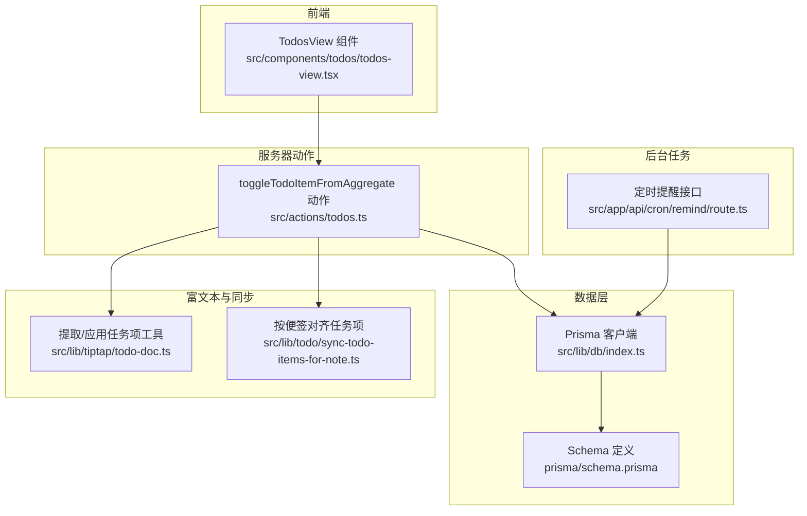
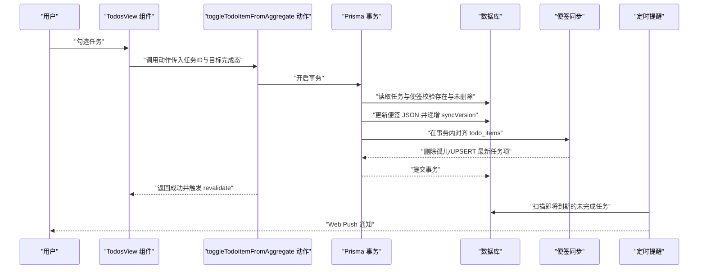
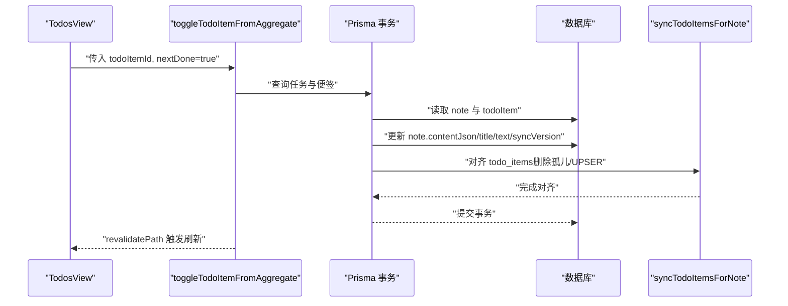
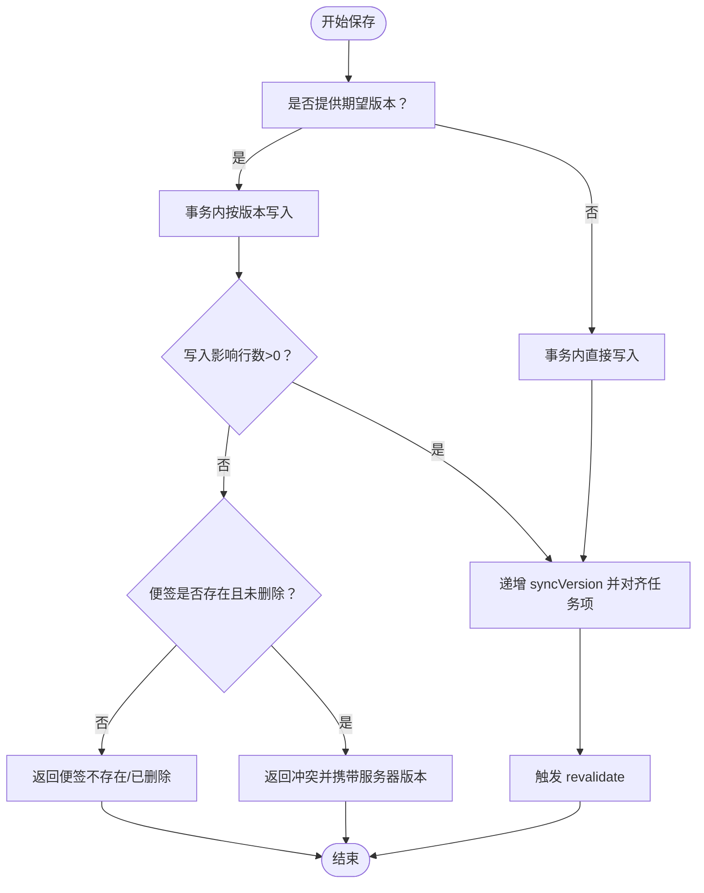
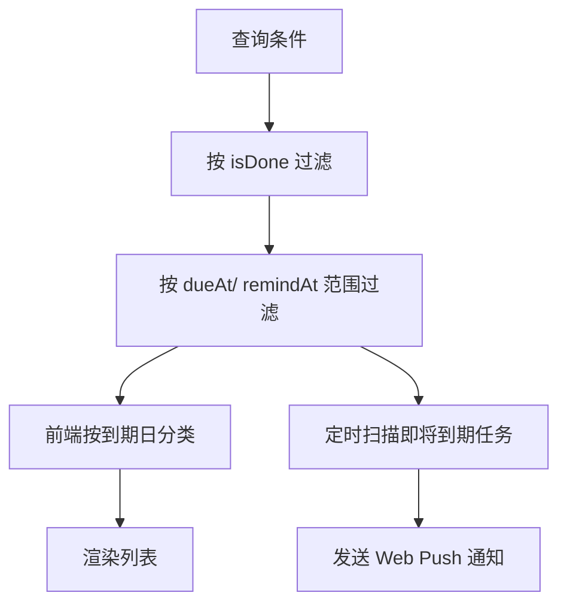
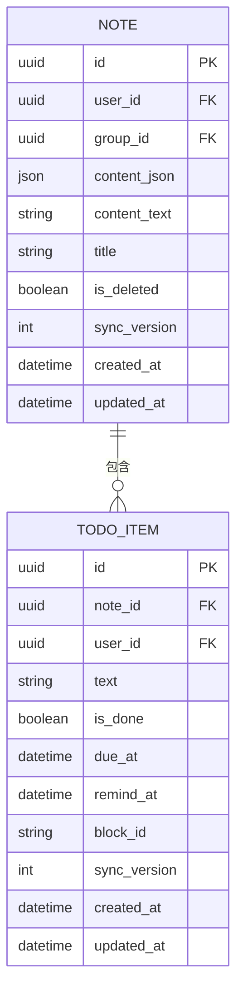
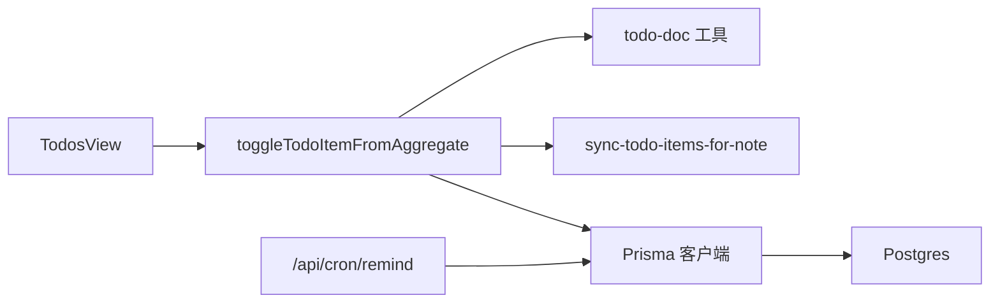

# 任务生命周期管理

<cite>
**本文引用的文件**
- [src/actions/todos.ts](file://src/actions/todos.ts)
- [src/components/todos/todos-view.tsx](file://src/components/todos/todos-view.tsx)
- [src/lib/tiptap/todo-doc.ts](file://src/lib/tiptap/todo-doc.ts)
- [src/lib/todo/sync-todo-items-for-note.ts](file://src/lib/todo/sync-todo-items-for-note.ts)
- [src/app/api/cron/remind/route.ts](file://src/app/api/cron/remind/route.ts)
- [src/lib/db/index.ts](file://src/lib/db/index.ts)
- [prisma/schema.prisma](file://prisma/schema.prisma)
- [src/lib/offline/note-outbox.ts](file://src/lib/offline/note-outbox.ts)
- [src/actions/notes.ts](file://src/actions/notes.ts)
- [需求文档.md](file://需求文档.md)
</cite>

## 目录
1. [引言](#引言)
2. [项目结构](#项目结构)
3. [核心组件](#核心组件)
4. [架构总览](#架构总览)
5. [详细组件分析](#详细组件分析)
6. [依赖关系分析](#依赖关系分析)
7. [性能考虑](#性能考虑)
8. [故障排查指南](#故障排查指南)
9. [结论](#结论)
10. [附录](#附录)

## 引言
本文件围绕“任务生命周期管理”主题，系统梳理从任务创建、编辑、完成、删除到状态持久化与实时更新的完整流程。重点说明以下方面：
- 任务状态持久化机制：本地状态与服务器状态的同步策略
- 实时更新与冲突处理：乐观锁与并发控制
- 批量操作：批量完成、批量删除的实现思路
- 搜索与过滤：按状态、到期时间等条件筛选
- 性能优化与错误处理
- API 使用示例与最佳实践

## 项目结构
本项目采用 Next.js App Router 架构，任务相关逻辑主要分布在以下位置：
- 前端组件：负责展示与交互（如待办聚合视图）
- 服务器动作：封装数据库写入与缓存失效
- 数据模型：Prisma 定义的 Note 与 TodoItem
- 提示文档：明确技术选型与架构原则

图表来源
- [src/components/todos/todos-view.tsx:1-149](file://src/components/todos/todos-view.tsx#L1-L149)
- [src/actions/todos.ts:1-70](file://src/actions/todos.ts#L1-L70)
- [src/lib/db/index.ts:1-16](file://src/lib/db/index.ts#L1-L16)
- [prisma/schema.prisma:1-117](file://prisma/schema.prisma#L1-L117)
- [src/lib/tiptap/todo-doc.ts:1-101](file://src/lib/tiptap/todo-doc.ts#L1-L101)
- [src/lib/todo/sync-todo-items-for-note.ts:1-58](file://src/lib/todo/sync-todo-items-for-note.ts#L1-L58)
- [src/app/api/cron/remind/route.ts:1-115](file://src/app/api/cron/remind/route.ts#L1-L115)

章节来源
- [src/components/todos/todos-view.tsx:1-149](file://src/components/todos/todos-view.tsx#L1-L149)
- [src/actions/todos.ts:1-70](file://src/actions/todos.ts#L1-L70)
- [src/lib/db/index.ts:1-16](file://src/lib/db/index.ts#L1-L16)
- [prisma/schema.prisma:1-117](file://prisma/schema.prisma#L1-L117)
- [src/lib/tiptap/todo-doc.ts:1-101](file://src/lib/tiptap/todo-doc.ts#L1-L101)
- [src/lib/todo/sync-todo-items-for-note.ts:1-58](file://src/lib/todo/sync-todo-items-for-note.ts#L1-L58)
- [src/app/api/cron/remind/route.ts:1-115](file://src/app/api/cron/remind/route.ts#L1-L115)

## 核心组件
- 待办聚合视图组件：负责渲染未完成任务列表，并提供按到期日分类与完成切换
- 服务器动作：封装任务完成的原子性写入与缓存失效
- 富文本工具：从 Tiptap JSON 中抽取/更新任务项
- 便签同步：在事务内对齐 TodoItem 与便签正文
- 定时提醒：扫描即将到期任务并发送 Web Push 通知
- 数据模型：Note 与 TodoItem 的字段设计与索引

章节来源
- [src/components/todos/todos-view.tsx:1-149](file://src/components/todos/todos-view.tsx#L1-L149)
- [src/actions/todos.ts:1-70](file://src/actions/todos.ts#L1-L70)
- [src/lib/tiptap/todo-doc.ts:1-101](file://src/lib/tiptap/todo-doc.ts#L1-L101)
- [src/lib/todo/sync-todo-items-for-note.ts:1-58](file://src/lib/todo/sync-todo-items-for-note.ts#L1-L58)
- [src/app/api/cron/remind/route.ts:1-115](file://src/app/api/cron/remind/route.ts#L1-L115)
- [prisma/schema.prisma:77-100](file://prisma/schema.prisma#L77-L100)

## 架构总览
任务生命周期贯穿“前端交互 → 服务器动作 → 数据库事务 → 便签正文同步 → 实时提醒”的闭环。

图表来源
- [src/components/todos/todos-view.tsx:110-118](file://src/components/todos/todos-view.tsx#L110-L118)
- [src/actions/todos.ts:12-69](file://src/actions/todos.ts#L12-L69)
- [src/lib/todo/sync-todo-items-for-note.ts:4-58](file://src/lib/todo/sync-todo-items-for-note.ts#L4-L58)
- [src/app/api/cron/remind/route.ts:49-62](file://src/app/api/cron/remind/route.ts#L49-L62)

## 详细组件分析

### 任务创建与编辑
- 创建：通过富文本编辑器生成 Tiptap JSON，保存至便签；随后在事务内对齐 TodoItem
- 编辑：更新便签 JSON 后，重新抽取任务项并进行对齐
- 关键点：
  - 便携式 blockId：确保任务项在数据库与富文本中一一对应
  - 事务一致性：保证“正文变更 + 任务项对齐”原子性
  - 版本号：便签的 syncVersion 用于并发控制与 LWW 冲突解决

章节来源
- [src/lib/tiptap/todo-doc.ts:50-79](file://src/lib/tiptap/todo-doc.ts#L50-L79)
- [src/lib/todo/sync-todo-items-for-note.ts:4-58](file://src/lib/todo/sync-todo-items-for-note.ts#L4-L58)
- [prisma/schema.prisma:54-66](file://prisma/schema.prisma#L54-L66)

### 任务完成（单个）
- 前端交互：TodosView 提供复选框，触发服务器动作
- 服务器动作：读取任务与便签，应用任务项完成态到富文本 JSON，更新标题/纯文本快照，递增 syncVersion，并在事务内对齐 todo_items
- 缓存失效：针对 todos 与 notes 页面路径执行 revalidate，确保 UI 即时更新

图表来源
- [src/components/todos/todos-view.tsx:110-118](file://src/components/todos/todos-view.tsx#L110-L118)
- [src/actions/todos.ts:12-69](file://src/actions/todos.ts#L12-L69)
- [src/lib/todo/sync-todo-items-for-note.ts:4-58](file://src/lib/todo/sync-todo-items-for-note.ts#L4-L58)

章节来源
- [src/components/todos/todos-view.tsx:110-118](file://src/components/todos/todos-view.tsx#L110-L118)
- [src/actions/todos.ts:12-69](file://src/actions/todos.ts#L12-L69)

### 任务删除
- 便签删除：通过 Notes 侧的删除/回收站流程实现，删除后 TodoItem 将随 cascade 删除
- 任务项删除：当前代码未提供直接删除 TodoItem 的入口；可通过编辑便签正文移除任务项，从而在事务内被清理

章节来源
- [prisma/schema.prisma:92-93](file://prisma/schema.prisma#L92-L93)
- [src/lib/todo/sync-todo-items-for-note.ts:18-29](file://src/lib/todo/sync-todo-items-for-note.ts#L18-L29)

### 状态持久化与并发控制
- 乐观锁：便签内容保存时支持 expectedSyncVersion 参数，通过“仅当版本匹配才写入”的 where 条件实现
- 冲突处理：若版本不匹配，返回冲突并告知服务器最新 syncVersion，客户端据此决定拉取最新内容或提示用户
- LWW 冲突：便签与任务项均维护 syncVersion，用于离线重放时的最后写入者获胜策略

图表来源
- [src/actions/notes.ts:72-137](file://src/actions/notes.ts#L72-L137)
- [src/lib/offline/note-outbox.ts:43-86](file://src/lib/offline/note-outbox.ts#L43-L86)
- [prisma/schema.prisma:63-64](file://prisma/schema.prisma#L63-L64)

章节来源
- [src/actions/notes.ts:72-137](file://src/actions/notes.ts#L72-L137)
- [src/lib/offline/note-outbox.ts:43-86](file://src/lib/offline/note-outbox.ts#L43-L86)
- [prisma/schema.prisma:63-64](file://prisma/schema.prisma#L63-L64)

### 实时更新与冲突处理
- 乐观锁：在内容保存时使用 expectedSyncVersion 作为 where 条件，避免覆盖他人修改
- 离线队列：note-outbox 支持顺序重放，遇到冲突则丢弃本地条目并计数失败
- LWW：便签与任务项的 syncVersion 用于离线恢复时以“最后写入者为准”

章节来源
- [src/actions/notes.ts:64-75](file://src/actions/notes.ts#L64-L75)
- [src/lib/offline/note-outbox.ts:43-86](file://src/lib/offline/note-outbox.ts#L43-L86)
- [prisma/schema.prisma:88](file://prisma/schema.prisma#L88)

### 批量操作
- 当前实现：未提供专门的“批量完成/批量删除” API 或动作
- 实现建议：
  - 批量完成：在服务器动作中接收任务 ID 列表，逐个调用现有完成逻辑，或在事务内批量更新
  - 批量删除：通过编辑便签正文一次性移除多个任务项，或在 Notes 侧增加批量删除入口
- 注意：批量操作应保持事务一致性与缓存失效范围的正确性

章节来源
- [src/actions/todos.ts:12-69](file://src/actions/todos.ts#L12-L69)
- [src/lib/todo/sync-todo-items-for-note.ts:31-57](file://src/lib/todo/sync-todo-items-for-note.ts#L31-L57)

### 搜索与过滤
- 按状态：TodoItem.isDone 字段用于区分未完成/已完成
- 按到期时间：TodoItem.dueAt 与 TodoItem.remindAt 字段支持范围查询
- 前端分类：TodosView 按到期日分为“今日/未来/已过期/无到期日”
- 后台提醒：定时接口扫描即将到期的任务并发送通知

图表来源
- [prisma/schema.prisma:83-88](file://prisma/schema.prisma#L83-L88)
- [src/components/todos/todos-view.tsx:22-42](file://src/components/todos/todos-view.tsx#L22-L42)
- [src/app/api/cron/remind/route.ts:49-62](file://src/app/api/cron/remind/route.ts#L49-L62)

章节来源
- [prisma/schema.prisma:83-88](file://prisma/schema.prisma#L83-L88)
- [src/components/todos/todos-view.tsx:22-42](file://src/components/todos/todos-view.tsx#L22-L42)
- [src/app/api/cron/remind/route.ts:49-62](file://src/app/api/cron/remind/route.ts#L49-L62)

### 数据模型与索引
- Note：contentJson（富文本）、contentText（全文检索快照）、syncVersion（并发控制/LWW）
- TodoItem：与 Note 多对一，唯一约束（noteId, blockId），索引覆盖用户、完成状态、到期时间、提醒时间等
- 作用：支撑聚合视图、提醒扫描与搜索过滤

图表来源
- [prisma/schema.prisma:49-75](file://prisma/schema.prisma#L49-L75)
- [prisma/schema.prisma:77-100](file://prisma/schema.prisma#L77-L100)

章节来源
- [prisma/schema.prisma:49-75](file://prisma/schema.prisma#L49-L75)
- [prisma/schema.prisma:77-100](file://prisma/schema.prisma#L77-L100)

## 依赖关系分析
- 组件依赖：TodosView 依赖 toggleTodoItemFromAggregate 动作
- 动作依赖：toggleTodoItemFromAggregate 依赖富文本工具与便签同步函数
- 数据层：Prisma 客户端连接 Supabase Postgres，模型定义于 schema.prisma
- 定时任务：/api/cron/remind 依赖 web-push 与 VAPID 凭据

图表来源
- [src/components/todos/todos-view.tsx:7](file://src/components/todos/todos-view.tsx#L7)
- [src/actions/todos.ts:1-10](file://src/actions/todos.ts#L1-L10)
- [src/lib/db/index.ts:1-16](file://src/lib/db/index.ts#L1-L16)
- [src/app/api/cron/remind/route.ts:1-115](file://src/app/api/cron/remind/route.ts#L1-L115)

章节来源
- [src/components/todos/todos-view.tsx:7](file://src/components/todos/todos-view.tsx#L7)
- [src/actions/todos.ts:1-10](file://src/actions/todos.ts#L1-L10)
- [src/lib/db/index.ts:1-16](file://src/lib/db/index.ts#L1-L16)
- [src/app/api/cron/remind/route.ts:1-115](file://src/app/api/cron/remind/route.ts#L1-L115)

## 性能考虑
- 查询优化：为用户、完成状态、到期时间建立索引，减少扫描成本
- 批处理：定时提醒接口限制扫描数量与时间窗口，避免高负载
- 事务内对齐：在单事务中完成正文更新与任务项对齐，降低锁竞争
- 缓存失效：精确 revalidatePath，避免全局刷新带来的性能损耗
- 离线队列：顺序重放，失败快速终止，减少无效尝试

章节来源
- [prisma/schema.prisma:96-98](file://prisma/schema.prisma#L96-L98)
- [src/app/api/cron/remind/route.ts:45-62](file://src/app/api/cron/remind/route.ts#L45-L62)
- [src/actions/todos.ts:30-57](file://src/actions/todos.ts#L30-L57)

## 故障排查指南
- 任务完成失败
  - 检查任务是否存在且所属用户匹配
  - 检查便签是否已被删除
  - 若富文本中无法定位任务项，需先在便签中编辑保存一次
- 内容保存冲突
  - 返回冲突时，拉取服务器最新版本并合并本地修改
  - 离线重放时遇到冲突，记录失败并提示用户
- 定时提醒未送达
  - 检查 VAPID 凭据配置
  - 查看 web-push 错误码，410/404 会清理无效订阅
- 缓存未刷新
  - 确认 revalidatePath 是否覆盖了 todos 与 notes 路径

章节来源
- [src/actions/todos.ts:18-27](file://src/actions/todos.ts#L18-L27)
- [src/actions/todos.ts:58-63](file://src/actions/todos.ts#L58-L63)
- [src/actions/notes.ts:121-133](file://src/actions/notes.ts#L121-L133)
- [src/lib/offline/note-outbox.ts:68-82](file://src/lib/offline/note-outbox.ts#L68-L82)
- [src/app/api/cron/remind/route.ts:98-104](file://src/app/api/cron/remind/route.ts#L98-L104)

## 结论
本系统通过“富文本 JSON + 事务内对齐 + syncVersion 并发控制”的组合，实现了任务从创建到完成的可靠生命周期管理。前端以最小代价响应用户交互，服务器动作保证一致性与实时性，定时任务提供可靠的提醒能力。后续可在现有基础上扩展批量操作与更丰富的搜索过滤能力。

## 附录

### API 使用示例与最佳实践
- 勾选完成（单个）
  - 前端：在 TodosView 中监听复选框变化，调用 toggleTodoItemFromAggregate
  - 后端：在事务内更新便签 JSON、递增 syncVersion，并对齐 todo_items
  - 最佳实践：确保富文本中存在稳定的 blockId；失败时根据错误类型提示用户
- 内容保存（编辑）
  - 前端：在保存时传入 expectedSyncVersion，避免覆盖他人修改
  - 后端：若版本不匹配，返回冲突并携带服务器版本
  - 最佳实践：离线重放时跳过版本校验，采用 LWW 策略
- 定时提醒
  - 后端：按时间窗口扫描未完成任务，发送 Web Push 通知
  - 最佳实践：严格校验授权头与 VAPID 凭据，清理无效订阅

章节来源
- [src/components/todos/todos-view.tsx:110-118](file://src/components/todos/todos-view.tsx#L110-L118)
- [src/actions/todos.ts:12-69](file://src/actions/todos.ts#L12-L69)
- [src/actions/notes.ts:72-137](file://src/actions/notes.ts#L72-L137)
- [src/app/api/cron/remind/route.ts:19-26](file://src/app/api/cron/remind/route.ts#L19-L26)