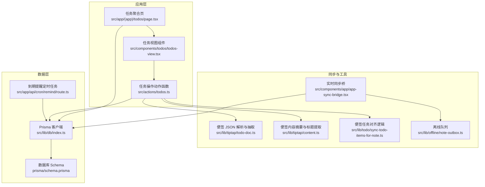
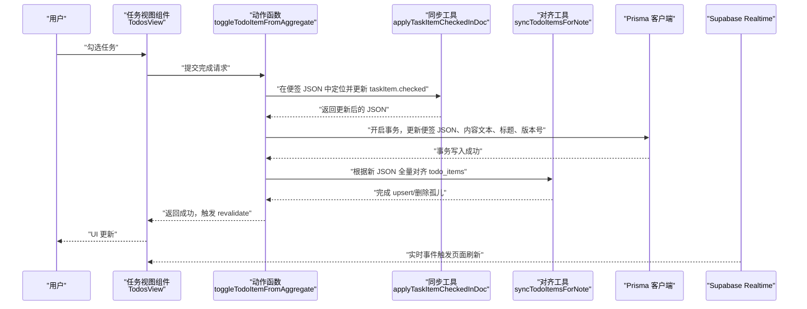
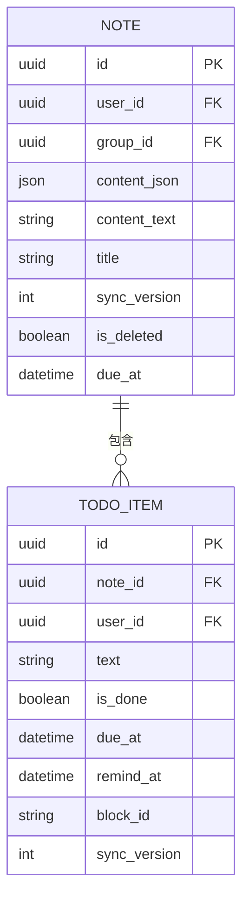
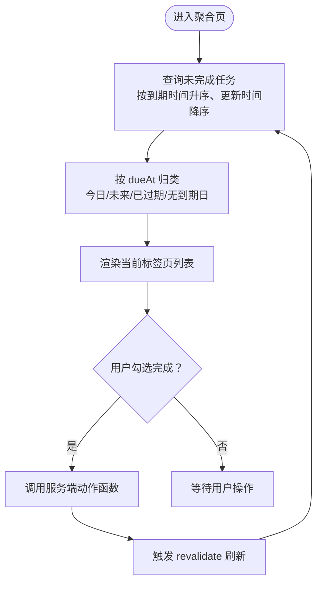
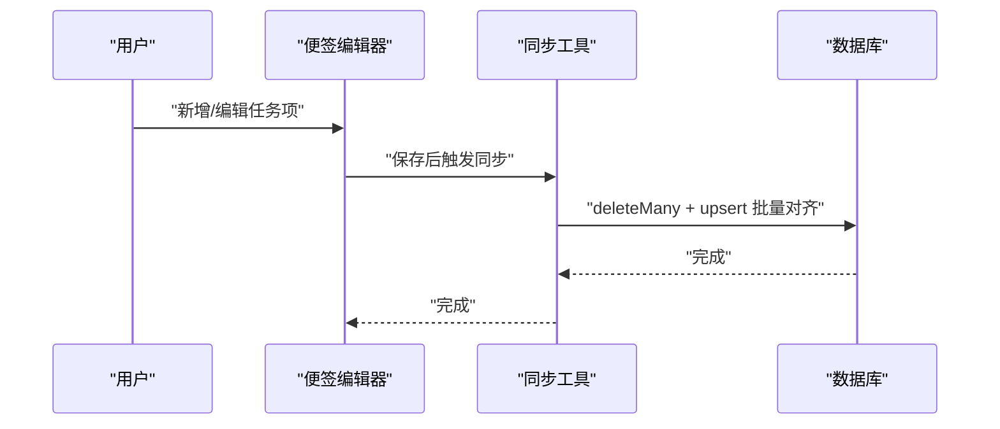
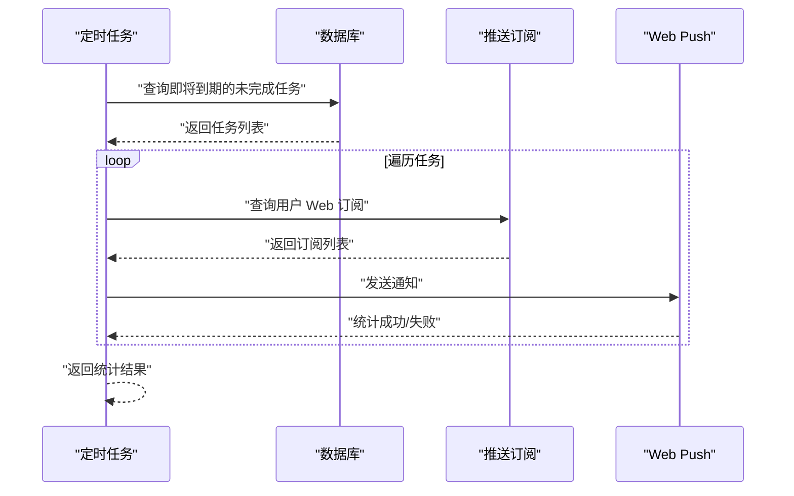
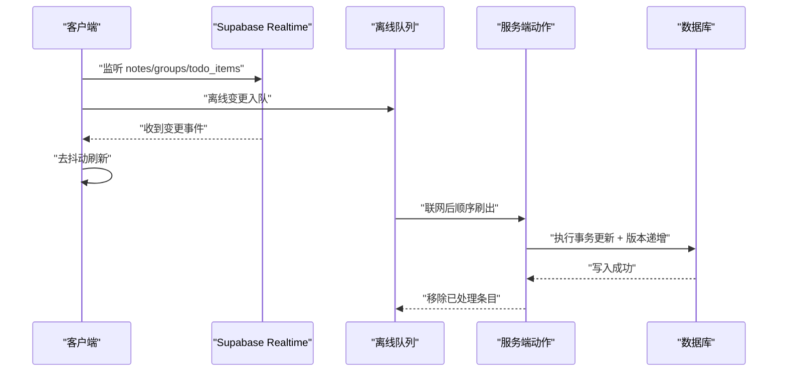
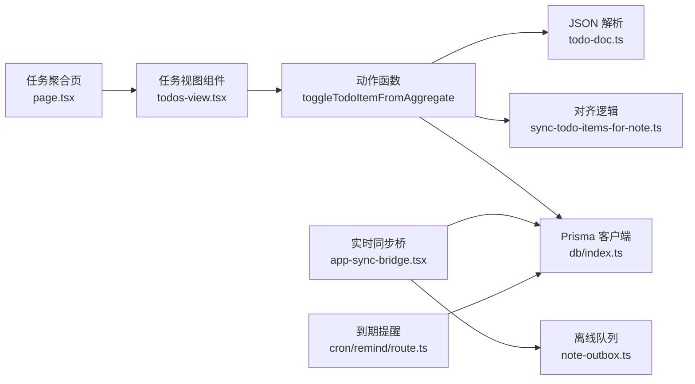

# 任务管理系统

<cite>
**本文引用的文件**
- [prisma/schema.prisma](file://prisma/schema.prisma)
- [src/app/(app)/todos/page.tsx](file://src/app/(app)/todos/page.tsx)
- [src/components/todos/todos-view.tsx](file://src/components/todos/todos-view.tsx)
- [src/actions/todos.ts](file://src/actions/todos.ts)
- [src/lib/todo/sync-todo-items-for-note.ts](file://src/lib/todo/sync-todo-items-for-note.ts)
- [src/lib/tiptap/todo-doc.ts](file://src/lib/tiptap/todo-doc.ts)
- [src/lib/tiptap/content.ts](file://src/lib/tiptap/content.ts)
- [src/lib/db/index.ts](file://src/lib/db/index.ts)
- [src/components/app/app-sync-bridge.tsx](file://src/components/app/app-sync-bridge.tsx)
- [src/lib/offline/note-outbox.ts](file://src/lib/offline/note-outbox.ts)
- [src/lib/supabase/client.ts](file://src/lib/supabase/client.ts)
- [src/app/api/cron/remind/route.ts](file://src/app/api/cron/remind/route.ts)
</cite>

## 目录
1. [简介](#简介)
2. [项目结构](#项目结构)
3. [核心组件](#核心组件)
4. [架构总览](#架构总览)
5. [详细组件分析](#详细组件分析)
6. [依赖关系分析](#依赖关系分析)
7. [性能考量](#性能考量)
8. [故障排查指南](#故障排查指南)
9. [结论](#结论)
10. [附录](#附录)

## 简介
本文件面向 Smart-Todo 的任务管理系统，系统围绕“便签中的任务项”展开，采用“便签 JSON（Tiptap）与数据库表 todo_items 双向同步”的设计，确保用户在便签中编辑任务状态、到期时间、提醒时间时，数据库能保持一致且可查询的状态。系统提供任务聚合视图（今日/未来/已过期/无到期日）、到期提醒（基于定时任务）、实时同步（Supabase Realtime + 离线队列）以及完整的任务生命周期管理（创建、完成、删除、编辑）。同时，系统通过事务与版本号机制保障数据一致性，并提供性能优化与用户体验设计建议。

## 项目结构
Smart-Todo 的任务管理相关代码主要分布在以下模块：
- 数据模型与查询：Prisma Schema 定义、数据库访问封装
- 任务聚合视图：服务端渲染聚合页面、客户端分类展示
- 任务同步逻辑：从便签 JSON 抽取任务、事务级对齐数据库
- 实时同步与离线：Supabase Realtime 订阅、离线队列刷出
- 到期提醒：定时任务扫描即将到期的任务并推送通知

图表来源
- [src/app/(app)/todos/page.tsx:1-32](file://src/app/(app)/todos/page.tsx#L1-L32)
- [src/components/todos/todos-view.tsx:1-149](file://src/components/todos/todos-view.tsx#L1-L149)
- [src/actions/todos.ts:1-70](file://src/actions/todos.ts#L1-L70)
- [src/lib/todo/sync-todo-items-for-note.ts:1-59](file://src/lib/todo/sync-todo-items-for-note.ts#L1-L59)
- [src/lib/tiptap/todo-doc.ts:1-101](file://src/lib/tiptap/todo-doc.ts#L1-L101)
- [src/lib/tiptap/content.ts:1-53](file://src/lib/tiptap/content.ts#L1-L53)
- [src/lib/db/index.ts:1-16](file://src/lib/db/index.ts#L1-L16)
- [src/components/app/app-sync-bridge.tsx:1-118](file://src/components/app/app-sync-bridge.tsx#L1-L118)
- [src/lib/offline/note-outbox.ts:1-87](file://src/lib/offline/note-outbox.ts#L1-L87)
- [src/app/api/cron/remind/route.ts:1-115](file://src/app/api/cron/remind/route.ts#L1-L115)

章节来源
- [src/app/(app)/todos/page.tsx:1-32](file://src/app/(app)/todos/page.tsx#L1-L32)
- [src/components/todos/todos-view.tsx:1-149](file://src/components/todos/todos-view.tsx#L1-L149)
- [src/actions/todos.ts:1-70](file://src/actions/todos.ts#L1-L70)
- [src/lib/todo/sync-todo-items-for-note.ts:1-59](file://src/lib/todo/sync-todo-items-for-note.ts#L1-L59)
- [src/lib/tiptap/todo-doc.ts:1-101](file://src/lib/tiptap/todo-doc.ts#L1-L101)
- [src/lib/tiptap/content.ts:1-53](file://src/lib/tiptap/content.ts#L1-L53)
- [src/lib/db/index.ts:1-16](file://src/lib/db/index.ts#L1-L16)
- [src/components/app/app-sync-bridge.tsx:1-118](file://src/components/app/app-sync-bridge.tsx#L1-L118)
- [src/lib/offline/note-outbox.ts:1-87](file://src/lib/offline/note-outbox.ts#L1-L87)
- [src/app/api/cron/remind/route.ts:1-115](file://src/app/api/cron/remind/route.ts#L1-L115)

## 核心组件
- 数据模型与索引
  - 便签表（Note）：存储 Tiptap JSON、全文文本快照、颜色、是否置顶、是否删除、同步版本号等字段，并与用户、分组、任务项关联。
  - 任务项表（TodoItem）：从便签 JSON 中抽取的任务行，包含文本、完成状态、到期时间、提醒时间、回链 blockId、同步版本号等，并与用户、便签关联。
  - 索引策略：对用户维度的完成状态+到期时间、提醒时间进行索引，便于聚合视图与提醒查询。
- 任务聚合视图
  - 服务端查询未完成任务，按到期时间升序、更新时间降序排序，序列化为前端可用的数据结构。
  - 客户端按今日/未来/已过期/无到期日四类进行分类展示，支持点击完成并同步回便签。
- 任务同步机制
  - 从便签 JSON 抽取任务行，事务内删除孤儿记录并 upsert 新记录，保证与便签内容完全一致。
  - 完成任务时，先在便签 JSON 中定位并更新 taskItem 的 checked 状态，再全量对齐数据库。
- 实时同步与离线
  - 使用 Supabase Realtime 订阅 notes/groups/todo_items 表变化，去抖动刷新页面。
  - 离线场景下将便签变更入队，联网后顺序刷出，冲突时移除离线条目并提示。
- 到期提醒
  - 定时任务扫描即将到期（±约 30 秒窗口）的未完成任务，按用户推送 Web Push 通知。

章节来源
- [prisma/schema.prisma:48-100](file://prisma/schema.prisma#L48-L100)
- [src/app/(app)/todos/page.tsx:7-31](file://src/app/(app)/todos/page.tsx#L7-L31)
- [src/components/todos/todos-view.tsx:51-149](file://src/components/todos/todos-view.tsx#L51-L149)
- [src/actions/todos.ts:11-70](file://src/actions/todos.ts#L11-L70)
- [src/lib/todo/sync-todo-items-for-note.ts:4-59](file://src/lib/todo/sync-todo-items-for-note.ts#L4-L59)
- [src/lib/tiptap/todo-doc.ts:49-101](file://src/lib/tiptap/todo-doc.ts#L49-L101)
- [src/components/app/app-sync-bridge.tsx:20-118](file://src/components/app/app-sync-bridge.tsx#L20-L118)
- [src/lib/offline/note-outbox.ts:26-87](file://src/lib/offline/note-outbox.ts#L26-L87)
- [src/app/api/cron/remind/route.ts:28-115](file://src/app/api/cron/remind/route.ts#L28-L115)

## 架构总览
系统采用“便签 JSON 作为事实源 + 数据库表作为派生索引”的架构。便签 JSON 负责承载任务的文本、完成状态、到期/提醒时间等，数据库表负责高效查询与提醒。

图表来源
- [src/components/todos/todos-view.tsx:110-119](file://src/components/todos/todos-view.tsx#L110-L119)
- [src/actions/todos.ts:11-70](file://src/actions/todos.ts#L11-L70)
- [src/lib/tiptap/todo-doc.ts:81-101](file://src/lib/tiptap/todo-doc.ts#L81-L101)
- [src/lib/todo/sync-todo-items-for-note.ts:4-59](file://src/lib/todo/sync-todo-items-for-note.ts#L4-L59)
- [src/components/app/app-sync-bridge.tsx:20-118](file://src/components/app/app-sync-bridge.tsx#L20-L118)

## 详细组件分析

### 数据模型与索引（todo_items 与便签 JSON 的双向同步）
- 设计要点
  - 便签 JSON 存储任务的完整上下文，数据库表仅作为派生索引与查询加速。
  - TodoItem.blockId 与便签 JSON 中 taskItem.attrs.id 建立一一对应关系，保证定位与更新的稳定性。
  - 便签表包含 syncVersion 字段，用于冲突检测与 LWW（最后写入获胜）策略。
- 查询与索引
  - 聚合视图按 dueAt 升序、updatedAt 降序排序，提升“即将到期”任务的可见性。
  - 对用户维度的 dueAt/isDone、remindAt 建立索引，支撑快速筛选与提醒扫描。
- 双向同步流程
  - 从 JSON 抽取任务行，删除孤儿（blockId 不在 JSON 中），对剩余行 upsert。
  - 完成任务时，先在 JSON 中更新 checked，再全量对齐数据库，确保一致性。

图表来源
- [prisma/schema.prisma:48-100](file://prisma/schema.prisma#L48-L100)

章节来源
- [prisma/schema.prisma:48-100](file://prisma/schema.prisma#L48-L100)
- [src/lib/todo/sync-todo-items-for-note.ts:4-59](file://src/lib/todo/sync-todo-items-for-note.ts#L4-L59)
- [src/lib/tiptap/todo-doc.ts:49-101](file://src/lib/tiptap/todo-doc.ts#L49-L101)

### 任务聚合视图（今日/未来/已过期/无到期日）
- 分类算法
  - 将 dueAt 截断至当日零点后与当前零点比较，归类为今日/未来/已过期/无到期日。
- 展示与交互
  - 支持点击完成，触发服务端动作函数，完成后自动 revalidate 并刷新视图。
  - 提供“在便签中打开”链接，直接跳转到对应 block。
- 排序策略
  - 未完成任务按到期时间升序、更新时间降序排列，优先呈现即将到期的任务。

图表来源
- [src/app/(app)/todos/page.tsx:7-31](file://src/app/(app)/todos/page.tsx#L7-L31)
- [src/components/todos/todos-view.tsx:20-49](file://src/components/todos/todos-view.tsx#L20-L49)
- [src/components/todos/todos-view.tsx:51-149](file://src/components/todos/todos-view.tsx#L51-L149)

章节来源
- [src/app/(app)/todos/page.tsx:7-31](file://src/app/(app)/todos/page.tsx#L7-L31)
- [src/components/todos/todos-view.tsx:20-49](file://src/components/todos/todos-view.tsx#L20-L49)
- [src/components/todos/todos-view.tsx:51-149](file://src/components/todos/todos-view.tsx#L51-L149)

### 任务生命周期管理（创建、完成、删除、编辑）
- 创建
  - 在便签中新增 taskItem，保存后由同步逻辑自动抽取并 upsert 到 todo_items。
- 完成
  - 在聚合页勾选，动作函数先在便签 JSON 中更新 taskItem.checked，再全量对齐数据库，最后触发 revalidate。
- 删除
  - 便签被移动至回收站时，其关联的 todo_items 会因外键级联删除而清理。
- 编辑
  - 修改便签中的任务文本、到期/提醒时间等属性，保存后同步工具会重新抽取并 upsert。

图表来源
- [src/lib/todo/sync-todo-items-for-note.ts:13-58](file://src/lib/todo/sync-todo-items-for-note.ts#L13-L58)
- [src/lib/tiptap/todo-doc.ts:49-101](file://src/lib/tiptap/todo-doc.ts#L49-L101)

章节来源
- [src/lib/todo/sync-todo-items-for-note.ts:13-58](file://src/lib/todo/sync-todo-items-for-note.ts#L13-L58)
- [src/lib/tiptap/todo-doc.ts:49-101](file://src/lib/tiptap/todo-doc.ts#L49-L101)

### 到期时间管理（日期选择器、时间设置、到期提醒）
- 日期与时间设置
  - 便签 JSON 的 taskItem 支持 dueAt/remindAt 字段，解析为 ISO 时间后存入数据库。
- 到期提醒机制
  - 定时任务每分钟扫描一次，查询窗口内即将到期的未完成任务。
  - 为每个用户推送 Web Push 通知，点击后跳转到对应便签的 block。

图表来源
- [src/app/api/cron/remind/route.ts:28-115](file://src/app/api/cron/remind/route.ts#L28-L115)

章节来源
- [src/app/api/cron/remind/route.ts:28-115](file://src/app/api/cron/remind/route.ts#L28-L115)
- [src/lib/tiptap/todo-doc.ts:23-29](file://src/lib/tiptap/todo-doc.ts#L23-L29)

### 实时同步与乐观锁冲突处理
- 实时同步
  - 使用 Supabase Realtime 订阅 notes/groups/todo_items 表，收到变更后去抖动刷新页面。
- 乐观锁与版本控制
  - 便签表维护 syncVersion，在事务更新便签与对齐任务时递增，用于冲突检测与 LWW。
- 离线队列
  - 离线保存便签变更入队，联网后顺序刷出；若发生冲突则移除离线条目并提示。

图表来源
- [src/components/app/app-sync-bridge.tsx:20-118](file://src/components/app/app-sync-bridge.tsx#L20-L118)
- [src/lib/offline/note-outbox.ts:26-87](file://src/lib/offline/note-outbox.ts#L26-L87)
- [src/lib/db/index.ts:1-16](file://src/lib/db/index.ts#L1-L16)

章节来源
- [src/components/app/app-sync-bridge.tsx:20-118](file://src/components/app/app-sync-bridge.tsx#L20-L118)
- [src/lib/offline/note-outbox.ts:26-87](file://src/lib/offline/note-outbox.ts#L26-L87)
- [src/lib/db/index.ts:1-16](file://src/lib/db/index.ts#L1-L16)

### 性能优化策略
- 查询优化
  - 为用户维度的 dueAt/isDone、remindAt 建立索引，减少聚合与提醒扫描成本。
  - 聚合页使用排序与 limit，避免一次性加载过多数据。
- 写入优化
  - 事务内批量 deleteMany + upsert，减少多次往返。
  - 仅在必要时全量对齐，避免频繁写入。
- 实时刷新
  - 使用去抖动策略降低频繁刷新带来的性能压力。
- 离线策略
  - 离线队列顺序刷出，失败重试与冲突剔除，避免堆积导致的抖动。

章节来源
- [prisma/schema.prisma:96-97](file://prisma/schema.prisma#L96-L97)
- [src/app/(app)/todos/page.tsx:18-18](file://src/app/(app)/todos/page.tsx#L18-L18)
- [src/lib/todo/sync-todo-items-for-note.ts:18-57](file://src/lib/todo/sync-todo-items-for-note.ts#L18-L57)
- [src/components/app/app-sync-bridge.tsx:10-35](file://src/components/app/app-sync-bridge.tsx#L10-L35)
- [src/lib/offline/note-outbox.ts:49-86](file://src/lib/offline/note-outbox.ts#L49-L86)

### 用户体验设计
- 明确的视觉反馈：勾选完成时禁用输入，过渡期间显示 pending 状态。
- 便捷的导航：提供“在便签中打开”直达链接，快速回到原文位置。
- 清晰的分类：四类视图直观展示不同到期状态的任务数量。
- 实时更新：变更后自动刷新，减少手动刷新成本。

章节来源
- [src/components/todos/todos-view.tsx:51-149](file://src/components/todos/todos-view.tsx#L51-L149)

## 依赖关系分析
- 组件耦合
  - 页面组件依赖数据访问层与 UI 组件，动作函数承担跨层协调职责。
  - 同步工具与解析工具解耦于页面与动作函数，便于复用与测试。
- 外部依赖
  - Supabase Realtime 提供实时订阅能力。
  - web-push 用于推送通知。
  - localforage 用于离线队列持久化。

图表来源
- [src/app/(app)/todos/page.tsx:1-32](file://src/app/(app)/todos/page.tsx#L1-L32)
- [src/components/todos/todos-view.tsx:1-149](file://src/components/todos/todos-view.tsx#L1-L149)
- [src/actions/todos.ts:1-70](file://src/actions/todos.ts#L1-L70)
- [src/lib/todo/sync-todo-items-for-note.ts:1-59](file://src/lib/todo/sync-todo-items-for-note.ts#L1-L59)
- [src/lib/tiptap/todo-doc.ts:1-101](file://src/lib/tiptap/todo-doc.ts#L1-L101)
- [src/lib/db/index.ts:1-16](file://src/lib/db/index.ts#L1-L16)
- [src/components/app/app-sync-bridge.tsx:1-118](file://src/components/app/app-sync-bridge.tsx#L1-L118)
- [src/lib/offline/note-outbox.ts:1-87](file://src/lib/offline/note-outbox.ts#L1-L87)
- [src/app/api/cron/remind/route.ts:1-115](file://src/app/api/cron/remind/route.ts#L1-L115)

章节来源
- [src/app/(app)/todos/page.tsx:1-32](file://src/app/(app)/todos/page.tsx#L1-L32)
- [src/components/todos/todos-view.tsx:1-149](file://src/components/todos/todos-view.tsx#L1-L149)
- [src/actions/todos.ts:1-70](file://src/actions/todos.ts#L1-L70)
- [src/lib/todo/sync-todo-items-for-note.ts:1-59](file://src/lib/todo/sync-todo-items-for-note.ts#L1-L59)
- [src/lib/tiptap/todo-doc.ts:1-101](file://src/lib/tiptap/todo-doc.ts#L1-L101)
- [src/lib/db/index.ts:1-16](file://src/lib/db/index.ts#L1-L16)
- [src/components/app/app-sync-bridge.tsx:1-118](file://src/components/app/app-sync-bridge.tsx#L1-L118)
- [src/lib/offline/note-outbox.ts:1-87](file://src/lib/offline/note-outbox.ts#L1-L87)
- [src/app/api/cron/remind/route.ts:1-115](file://src/app/api/cron/remind/route.ts#L1-L115)

## 性能考量
- 查询层面
  - 使用索引覆盖常用过滤条件（用户、完成状态、到期/提醒时间）。
  - 聚合页排序与 limit 控制数据规模。
- 写入层面
  - 事务内批量 upsert，减少往返次数。
  - 仅在 JSON 发生结构性变化时触发全量对齐。
- 实时刷新
  - 去抖动策略降低频繁刷新开销。
- 离线策略
  - 顺序刷出避免并发写入冲突，失败条目及时剔除。

## 故障排查指南
- 便签中找不到任务
  - 现象：完成按钮不可用或报错。
  - 排查：确认任务是否带有稳定的 blockId；若缺失，需在便签中保存一次以生成 blockId。
- 无法完成任务
  - 现象：点击完成无反应或报错。
  - 排查：检查便签是否已被删除；确认动作函数返回的错误信息；查看事务是否成功提交。
- 实时同步不生效
  - 现象：变更后页面未刷新。
  - 排查：确认 Supabase Realtime 连接状态；检查去抖动刷新逻辑；确认用户维度过滤正确。
- 离线草稿未同步
  - 现象：联网后未自动恢复。
  - 排查：检查离线队列是否存在；确认刷出函数返回值；查看冲突剔除逻辑。
- 到期提醒未送达
  - 现象：任务到期未收到通知。
  - 排查：确认定时任务授权头与 VAPID 密钥配置；检查订阅有效性（410/404 会自动清理）；核对扫描窗口与任务状态。

章节来源
- [src/actions/todos.ts:18-27](file://src/actions/todos.ts#L18-L27)
- [src/lib/tiptap/todo-doc.ts:81-101](file://src/lib/tiptap/todo-doc.ts#L81-L101)
- [src/components/app/app-sync-bridge.tsx:79-83](file://src/components/app/app-sync-bridge.tsx#L79-L83)
- [src/lib/offline/note-outbox.ts:68-82](file://src/lib/offline/note-outbox.ts#L68-L82)
- [src/app/api/cron/remind/route.ts:98-105](file://src/app/api/cron/remind/route.ts#L98-L105)

## 结论
Smart-Todo 的任务管理系统以“便签 JSON 为事实源、数据库表为派生索引”的方式实现了高一致性的任务管理。通过事务级对齐、版本号控制与实时同步，系统在多端协作与离线场景下保持稳定。到期提醒与聚合视图进一步提升了任务的可见性与效率。建议持续关注索引与查询性能，完善错误提示与日志追踪，以提升整体用户体验。

## 附录
- 关键路径参考
  - 任务聚合页：[src/app/(app)/todos/page.tsx](file://src/app/(app)/todos/page.tsx#L1-L32)
  - 任务视图组件：[src/components/todos/todos-view.tsx:1-149](file://src/components/todos/todos-view.tsx#L1-L149)
  - 完成任务动作：[src/actions/todos.ts:11-70](file://src/actions/todos.ts#L11-L70)
  - JSON 抽取与更新：[src/lib/tiptap/todo-doc.ts:49-101](file://src/lib/tiptap/todo-doc.ts#L49-L101)
  - 任务对齐逻辑：[src/lib/todo/sync-todo-items-for-note.ts:4-59](file://src/lib/todo/sync-todo-items-for-note.ts#L4-L59)
  - 实时同步桥：[src/components/app/app-sync-bridge.tsx:1-118](file://src/components/app/app-sync-bridge.tsx#L1-L118)
  - 离线队列：[src/lib/offline/note-outbox.ts:1-87](file://src/lib/offline/note-outbox.ts#L1-L87)
  - 定时提醒：[src/app/api/cron/remind/route.ts:1-115](file://src/app/api/cron/remind/route.ts#L1-L115)
  - 数据库客户端：[src/lib/db/index.ts:1-16](file://src/lib/db/index.ts#L1-L16)
  - Supabase 客户端：[src/lib/supabase/client.ts:1-9](file://src/lib/supabase/client.ts#L1-L9)