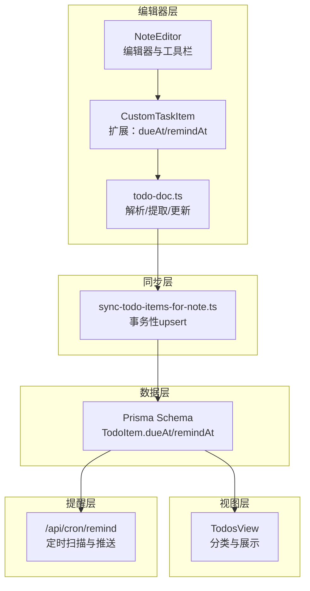
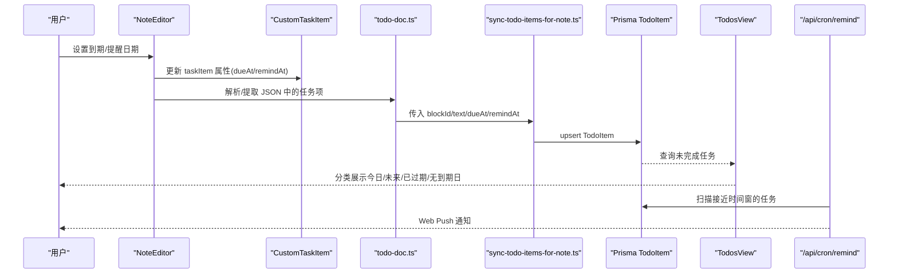
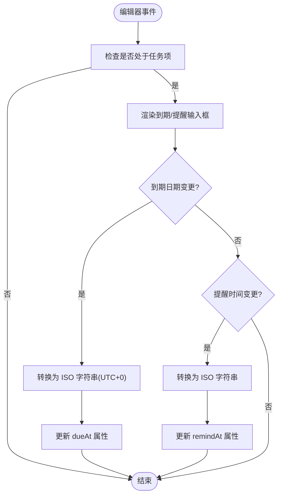
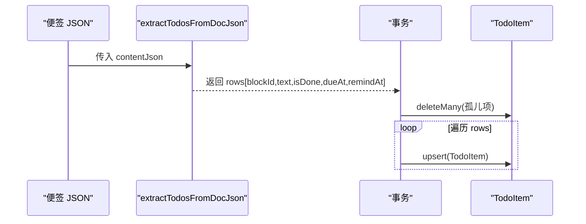
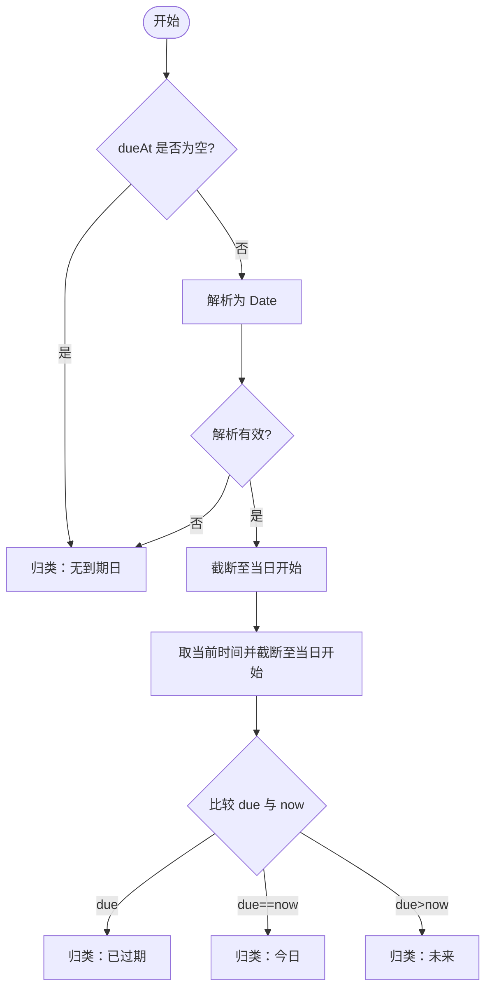
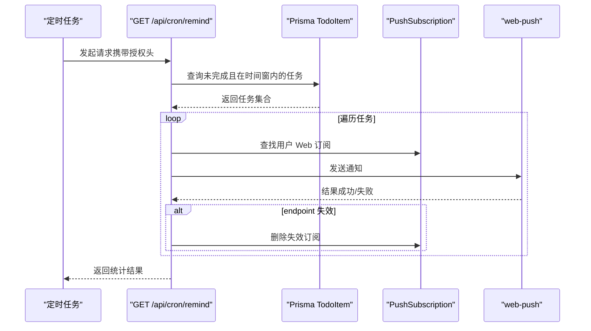
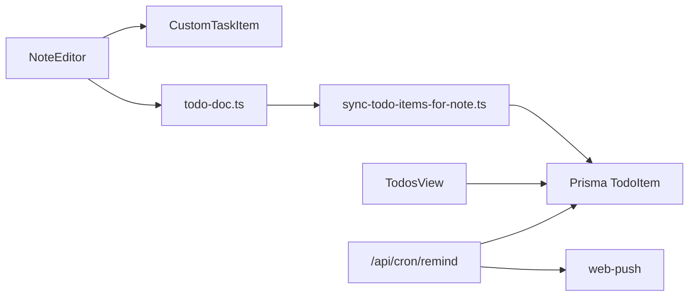

# 到期时间管理

<cite>
**本文引用的文件**
- [prisma/schema.prisma](file://prisma/schema.prisma)
- [src/lib/tiptap/custom-task-item.ts](file://src/lib/tiptap/custom-task-item.ts)
- [src/lib/tiptap/todo-doc.ts](file://src/lib/tiptap/todo-doc.ts)
- [src/lib/todo/sync-todo-items-for-note.ts](file://src/lib/todo/sync-todo-items-for-note.ts)
- [src/components/editor/note-editor.tsx](file://src/components/editor/note-editor.tsx)
- [src/components/todos/todos-view.tsx](file://src/components/todos/todos-view.tsx)
- [src/actions/todos.ts](file://src/actions/todos.ts)
- [src/app/api/cron/remind/route.ts](file://src/app/api/cron/remind/route.ts)
- [scripts/verify-m4-cron.mjs](file://scripts/verify-m4-cron.mjs)
- [README.md](file://README.md)
</cite>

## 目录
1. [简介](#简介)
2. [项目结构](#项目结构)
3. [核心组件](#核心组件)
4. [架构总览](#架构总览)
5. [详细组件分析](#详细组件分析)
6. [依赖关系分析](#依赖关系分析)
7. [性能考量](#性能考量)
8. [故障排查指南](#故障排查指南)
9. [结论](#结论)
10. [附录](#附录)

## 简介
本文件围绕“到期时间管理”功能进行系统化说明，覆盖以下方面：
- 任务到期时间的设置、显示与管理机制
- 日期分类算法（今日、未来、已过期、无到期日）
- 到期时间的数据存储格式与时序处理函数
- 到期提醒的触发机制与通知流程
- 到期时间的编辑能力（日期选择器与时间设置）
- 最佳实践与用户体验设计建议
- 使用示例与常见问题解决方案

## 项目结构
与到期时间管理直接相关的模块分布如下：
- 编辑器扩展：在富文本编辑器中为任务项增加到期/提醒属性，并以 ISO 字符串形式持久化
- 数据抽取与同步：从便签 JSON 中抽取待办项，建立与数据库的 upsert 同步
- 聚合视图：按到期日期进行分类展示
- 提醒服务：基于定时任务扫描数据库，向已订阅的用户发送 Web Push 通知

图表来源
- [src/components/editor/note-editor.tsx:444-490](file://src/components/editor/note-editor.tsx#L444-L490)
- [src/lib/tiptap/custom-task-item.ts:1-31](file://src/lib/tiptap/custom-task-item.ts#L1-L31)
- [src/lib/tiptap/todo-doc.ts:50-79](file://src/lib/tiptap/todo-doc.ts#L50-L79)
- [src/lib/todo/sync-todo-items-for-note.ts:5-58](file://src/lib/todo/sync-todo-items-for-note.ts#L5-L58)
- [prisma/schema.prisma:78-100](file://prisma/schema.prisma#L78-L100)
- [src/components/todos/todos-view.tsx:22-49](file://src/components/todos/todos-view.tsx#L22-L49)
- [src/app/api/cron/remind/route.ts:49-62](file://src/app/api/cron/remind/route.ts#L49-L62)

章节来源
- [src/components/editor/note-editor.tsx:444-490](file://src/components/editor/note-editor.tsx#L444-L490)
- [src/lib/tiptap/custom-task-item.ts:1-31](file://src/lib/tiptap/custom-task-item.ts#L1-L31)
- [src/lib/tiptap/todo-doc.ts:50-79](file://src/lib/tiptap/todo-doc.ts#L50-L79)
- [src/lib/todo/sync-todo-items-for-note.ts:5-58](file://src/lib/todo/sync-todo-items-for-note.ts#L5-L58)
- [prisma/schema.prisma:78-100](file://prisma/schema.prisma#L78-L100)
- [src/components/todos/todos-view.tsx:22-49](file://src/components/todos/todos-view.tsx#L22-L49)
- [src/app/api/cron/remind/route.ts:49-62](file://src/app/api/cron/remind/route.ts#L49-L62)

## 核心组件
- 富文本扩展：在任务项中注入 dueAt 与 remindAt 属性，渲染为 HTML data-* 属性，便于抽取与展示
- JSON 解析与同步：从便签 JSON 中抽取带 blockId 的任务项，写入数据库并维护 upsert
- 分类展示：按到期日将未完成任务分为今日、未来、已过期、无到期日四类
- 定时提醒：扫描数据库中接近当前时间窗口的任务，向订阅用户推送 Web Push 通知

章节来源
- [src/lib/tiptap/custom-task-item.ts:1-31](file://src/lib/tiptap/custom-task-item.ts#L1-L31)
- [src/lib/tiptap/todo-doc.ts:50-79](file://src/lib/tiptap/todo-doc.ts#L50-L79)
- [src/lib/todo/sync-todo-items-for-note.ts:5-58](file://src/lib/todo/sync-todo-items-for-note.ts#L5-L58)
- [src/components/todos/todos-view.tsx:22-49](file://src/components/todos/todos-view.tsx#L22-L49)
- [src/app/api/cron/remind/route.ts:49-62](file://src/app/api/cron/remind/route.ts#L49-L62)

## 架构总览
到期时间管理贯穿“编辑—抽取—同步—展示—提醒”的闭环。

图表来源
- [src/components/editor/note-editor.tsx:444-490](file://src/components/editor/note-editor.tsx#L444-L490)
- [src/lib/tiptap/custom-task-item.ts:1-31](file://src/lib/tiptap/custom-task-item.ts#L1-L31)
- [src/lib/tiptap/todo-doc.ts:50-79](file://src/lib/tiptap/todo-doc.ts#L50-L79)
- [src/lib/todo/sync-todo-items-for-note.ts:5-58](file://src/lib/todo/sync-todo-items-for-note.ts#L5-L58)
- [prisma/schema.prisma:78-100](file://prisma/schema.prisma#L78-L100)
- [src/components/todos/todos-view.tsx:22-49](file://src/components/todos/todos-view.tsx#L22-L49)
- [src/app/api/cron/remind/route.ts:49-62](file://src/app/api/cron/remind/route.ts#L49-L62)

## 详细组件分析

### 1) 到期时间的数据模型与存储
- 数据模型：数据库表 TodoItem 持有 dueAt 与 remindAt 两个可空字段，类型为 DateTime
- 存储格式：编辑器扩展将 dueAt/remindAt 以 ISO 字符串形式存储于任务项属性中，便于跨组件传递与持久化
- 约束与索引：对 userId、isDone、dueAt 与 userId、remindAt 建有索引，支撑聚合与提醒扫描

章节来源
- [prisma/schema.prisma:78-100](file://prisma/schema.prisma#L78-L100)

### 2) 富文本扩展与编辑器交互
- 扩展增强：CustomTaskItem 在默认任务项基础上新增 dueAt 与 remindAt 属性，支持 HTML 渲染与解析
- 编辑器工具栏：当处于任务项时，显示“到期”日期输入框与“提醒”时间输入框
  - 到期：使用 date 类型，onChange 将日期转换为 ISO 字符串（时区偏移固定为 Z）
  - 提醒：使用 datetime-local 类型，onChange 将本地时间转换为 ISO 字符串
- 格式化显示：datetime-local 输入框使用 formatForDatetimeLocal 将 ISO 时间格式化为本地可编辑字符串

图表来源
- [src/components/editor/note-editor.tsx:444-490](file://src/components/editor/note-editor.tsx#L444-L490)
- [src/components/editor/note-editor.tsx:61-71](file://src/components/editor/note-editor.tsx#L61-L71)
- [src/lib/tiptap/custom-task-item.ts:1-31](file://src/lib/tiptap/custom-task-item.ts#L1-L31)

章节来源
- [src/components/editor/note-editor.tsx:444-490](file://src/components/editor/note-editor.tsx#L444-L490)
- [src/components/editor/note-editor.tsx:61-71](file://src/components/editor/note-editor.tsx#L61-L71)
- [src/lib/tiptap/custom-task-item.ts:1-31](file://src/lib/tiptap/custom-task-item.ts#L1-L31)

### 3) JSON 抽取与数据库同步
- JSON 抽取：ensureTaskItemBlockIds 为缺失 blockId 的任务项生成稳定标识；extractTodosFromDocJson 从 JSON 中收集带 blockId 的任务项，解析 dueAt/remindAt 为 Date
- 事务同步：syncTodoItemsForNote 在单个事务中删除孤儿项并 upsert 新项，确保与便签正文一致

图表来源
- [src/lib/tiptap/todo-doc.ts:5-21](file://src/lib/tiptap/todo-doc.ts#L5-L21)
- [src/lib/tiptap/todo-doc.ts:50-79](file://src/lib/tiptap/todo-doc.ts#L50-L79)
- [src/lib/todo/sync-todo-items-for-note.ts:5-58](file://src/lib/todo/sync-todo-items-for-note.ts#L5-L58)

章节来源
- [src/lib/tiptap/todo-doc.ts:5-21](file://src/lib/tiptap/todo-doc.ts#L5-L21)
- [src/lib/tiptap/todo-doc.ts:50-79](file://src/lib/tiptap/todo-doc.ts#L50-L79)
- [src/lib/todo/sync-todo-items-for-note.ts:5-58](file://src/lib/todo/sync-todo-items-for-note.ts#L5-L58)

### 4) 日期分类算法（今日/未来/已过期/无到期日）
- 输入：每个未完成任务的 dueAt（ISO 字符串或空）
- 步骤：
  1) 若 dueAt 为空或解析失败，归类为“无到期日”
  2) 将 dueAt 与当前时间统一到“当日开始”粒度
  3) 比较：
     - 小于当天开始：已过期
     - 等于当天开始：今日
     - 大于当天开始：未来
- 输出：按分类组织的列表，支持切换标签页查看

图表来源
- [src/components/todos/todos-view.tsx:22-49](file://src/components/todos/todos-view.tsx#L22-L49)

章节来源
- [src/components/todos/todos-view.tsx:22-49](file://src/components/todos/todos-view.tsx#L22-L49)

### 5) 到期提醒触发机制与通知流程
- 触发条件：定时任务扫描数据库，筛选未完成且在时间窗内的任务（remindAt 在 ±约 30~70 秒之间）
- 通知内容：标题“待办提醒”，正文为任务文本（限制长度），点击跳转至对应便签块
- 推送细节：使用 VAPID 凭据，逐条向用户 Web 订阅发送通知；对失效 endpoint 自动清理

图表来源
- [src/app/api/cron/remind/route.ts:28-114](file://src/app/api/cron/remind/route.ts#L28-L114)
- [scripts/verify-m4-cron.mjs:1-82](file://scripts/verify-m4-cron.mjs#L1-L82)
- [README.md:115-134](file://README.md#L115-L134)

章节来源
- [src/app/api/cron/remind/route.ts:28-114](file://src/app/api/cron/remind/route.ts#L28-L114)
- [scripts/verify-m4-cron.mjs:1-82](file://scripts/verify-m4-cron.mjs#L1-L82)
- [README.md:115-134](file://README.md#L115-L134)

### 6) 编辑功能与用户体验
- 日期选择器：
  - 到期：date 输入，onChange 将日期标准化为 ISO 字符串（时区偏移 Z），便于跨时区一致性
  - 提醒：datetime-local 输入，onChange 将本地时间转换为 ISO 字符串
- 显示格式：datetime-local 输入框使用 formatForDatetimeLocal 将 ISO 时间格式化为本地可读字符串
- 同步回正文：勾选完成时，通过事务同步回便签 JSON，并更新 TodoItem 状态

章节来源
- [src/components/editor/note-editor.tsx:444-490](file://src/components/editor/note-editor.tsx#L444-L490)
- [src/components/editor/note-editor.tsx:61-71](file://src/components/editor/note-editor.tsx#L61-L71)
- [src/actions/todos.ts:12-69](file://src/actions/todos.ts#L12-L69)

## 依赖关系分析
- 组件耦合：
  - NoteEditor 依赖 CustomTaskItem 与 todo-doc.ts 的解析能力
  - sync-todo-items-for-note 依赖 todo-doc.ts 的抽取结果
  - TodosView 依赖数据库查询结果与分类函数
  - /api/cron/remind 依赖数据库与 Web Push SDK
- 外部依赖：
  - Prisma（PostgreSQL）作为数据存储
  - web-push 用于 Web Push 通知
  - date-fns 用于日期比较与粒度处理

图表来源
- [src/components/editor/note-editor.tsx:444-490](file://src/components/editor/note-editor.tsx#L444-L490)
- [src/lib/tiptap/custom-task-item.ts:1-31](file://src/lib/tiptap/custom-task-item.ts#L1-L31)
- [src/lib/tiptap/todo-doc.ts:50-79](file://src/lib/tiptap/todo-doc.ts#L50-L79)
- [src/lib/todo/sync-todo-items-for-note.ts:5-58](file://src/lib/todo/sync-todo-items-for-note.ts#L5-L58)
- [src/components/todos/todos-view.tsx:22-49](file://src/components/todos/todos-view.tsx#L22-L49)
- [src/app/api/cron/remind/route.ts:28-114](file://src/app/api/cron/remind/route.ts#L28-L114)

章节来源
- [src/components/editor/note-editor.tsx:444-490](file://src/components/editor/note-editor.tsx#L444-L490)
- [src/lib/tiptap/custom-task-item.ts:1-31](file://src/lib/tiptap/custom-task-item.ts#L1-L31)
- [src/lib/tiptap/todo-doc.ts:50-79](file://src/lib/tiptap/todo-doc.ts#L50-L79)
- [src/lib/todo/sync-todo-items-for-note.ts:5-58](file://src/lib/todo/sync-todo-items-for-note.ts#L5-L58)
- [src/components/todos/todos-view.tsx:22-49](file://src/components/todos/todos-view.tsx#L22-L49)
- [src/app/api/cron/remind/route.ts:28-114](file://src/app/api/cron/remind/route.ts#L28-L114)

## 性能考量
- 查询索引：dueAt 与 remindAt 均有索引，提醒扫描与聚合查询具备良好性能
- 时间窗控制：提醒扫描采用短时间窗（±约 30~70 秒），避免频繁推送与抖动
- 批量限制：提醒扫描限制返回数量，防止一次性处理过多任务
- 事务同步：在单事务内完成 upsert，减少并发写入冲突

章节来源
- [prisma/schema.prisma:96-97](file://prisma/schema.prisma#L96-L97)
- [src/app/api/cron/remind/route.ts:49-62](file://src/app/api/cron/remind/route.ts#L49-L62)
- [src/lib/todo/sync-todo-items-for-note.ts:5-58](file://src/lib/todo/sync-todo-items-for-note.ts#L5-L58)

## 故障排查指南
- 提醒未触发
  - 确认定时任务已正确配置授权头与时间窗
  - 使用自检脚本验证环境变量与端点可达性
  - 检查 VAPID 公私钥与主题配置
- 通知点击无效
  - 确认 NEXT_PUBLIC_APP_URL 已正确设置，用于拼接通知跳转链接
- 订阅失效
  - 服务端在收到 410/404 时会自动清理失效订阅
- 日期显示异常
  - 检查 datetime-local 格式化函数是否正确处理 ISO 字符串
  - 确保到期日期在编辑器中被转换为 UTC+0 的 ISO 字符串

章节来源
- [scripts/verify-m4-cron.mjs:1-82](file://scripts/verify-m4-cron.mjs#L1-L82)
- [src/app/api/cron/remind/route.ts:8-17](file://src/app/api/cron/remind/route.ts#L8-L17)
- [src/app/api/cron/remind/route.ts:98-104](file://src/app/api/cron/remind/route.ts#L98-L104)
- [README.md:115-134](file://README.md#L115-L134)

## 结论
到期时间管理通过“编辑器扩展 + JSON 抽取 + 事务同步 + 分类展示 + 定时提醒”的完整链路，实现了从输入到提醒的一体化体验。合理的数据模型、索引与时间窗策略保证了性能与稳定性；清晰的分类与通知机制提升了用户的任务管理效率。

## 附录

### A. 使用示例
- 在便签中添加任务项，使用“到期”日期输入框设置截止日期
- 使用“提醒”时间输入框设置推送时间
- 在“待办”页面查看不同分类下的任务
- 配置定时任务与 VAPID 凭据，启用到期提醒

章节来源
- [src/components/editor/note-editor.tsx:444-490](file://src/components/editor/note-editor.tsx#L444-L490)
- [src/components/todos/todos-view.tsx:51-96](file://src/components/todos/todos-view.tsx#L51-L96)
- [README.md:115-134](file://README.md#L115-L134)

### B. 最佳实践与用户体验设计
- 日期输入建议：
  - 到期日期使用 date 输入，便于用户聚焦“日”粒度
  - 提醒时间使用 datetime-local，结合 formatForDatetimeLocal 提升可读性
- 分类与导航：
  - 默认展示“今日”，快速聚焦当前任务
  - 为每个分类按钮显示计数，帮助用户了解分布
- 提醒策略：
  - 合理设置时间窗，避免过于频繁或延迟
  - 对已过期任务进行视觉强调，提升紧迫感
- 同步一致性：
  - 通过事务同步确保数据库与便签正文一致
  - 对勾选完成的操作即时回写，减少用户等待

章节来源
- [src/components/editor/note-editor.tsx:61-71](file://src/components/editor/note-editor.tsx#L61-L71)
- [src/components/todos/todos-view.tsx:44-49](file://src/components/todos/todos-view.tsx#L44-L49)
- [src/actions/todos.ts:12-69](file://src/actions/todos.ts#L12-L69)