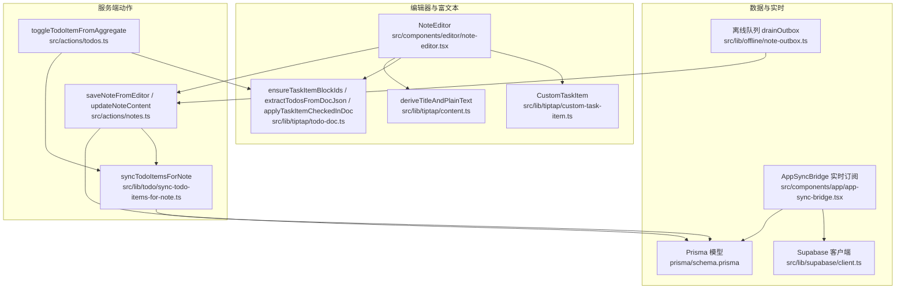
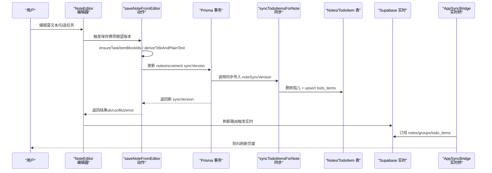
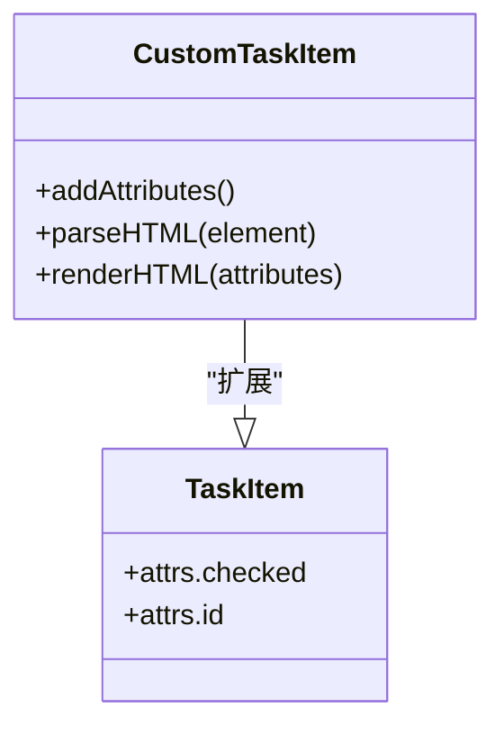
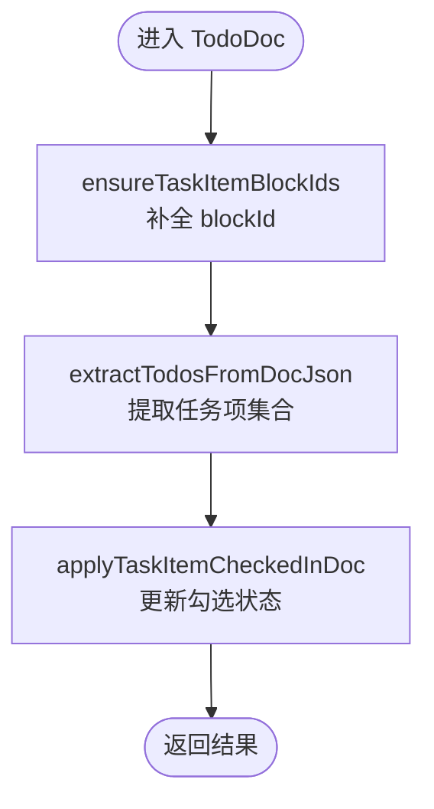
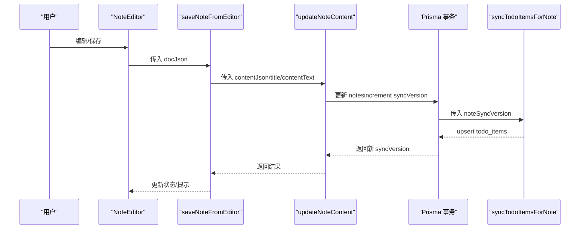
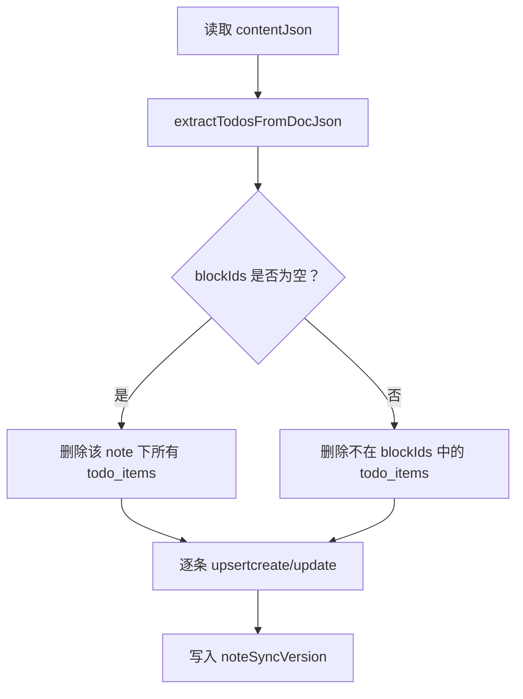
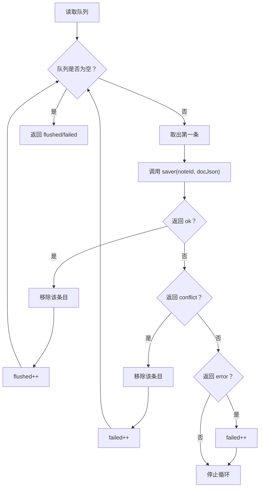
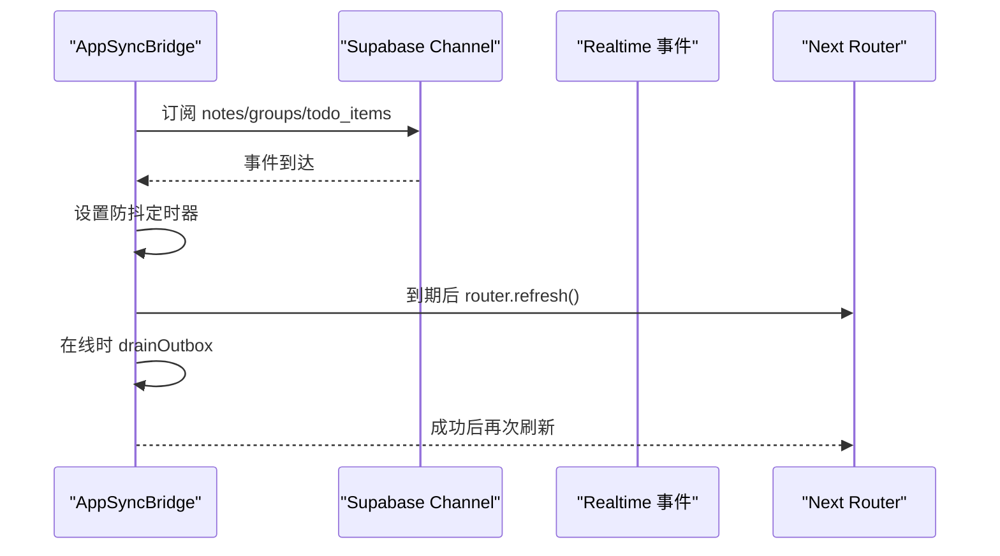
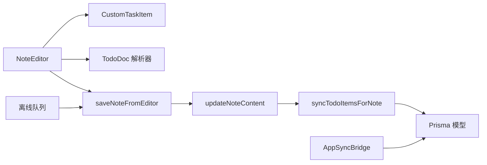

# 待办事项同步机制

<cite>
**本文引用的文件**
- [src/actions/todos.ts](file://src/actions/todos.ts)
- [src/actions/notes.ts](file://src/actions/notes.ts)
- [src/lib/tiptap/custom-task-item.ts](file://src/lib/tiptap/custom-task-item.ts)
- [src/lib/tiptap/todo-doc.ts](file://src/lib/tiptap/todo-doc.ts)
- [src/lib/tiptap/content.ts](file://src/lib/tiptap/content.ts)
- [src/lib/todo/sync-todo-items-for-note.ts](file://src/lib/todo/sync-todo-items-for-note.ts)
- [src/lib/offline/note-outbox.ts](file://src/lib/offline/note-outbox.ts)
- [src/components/app/app-sync-bridge.tsx](file://src/components/app/app-sync-bridge.tsx)
- [src/components/editor/note-editor.tsx](file://src/components/editor/note-editor.tsx)
- [src/lib/db/index.ts](file://src/lib/db/index.ts)
- [src/lib/supabase/client.ts](file://src/lib/supabase/client.ts)
- [prisma/schema.prisma](file://prisma/schema.prisma)
</cite>

## 目录
1. [简介](#简介)
2. [项目结构](#项目结构)
3. [核心组件](#核心组件)
4. [架构总览](#架构总览)
5. [详细组件分析](#详细组件分析)
6. [依赖关系分析](#依赖关系分析)
7. [性能考量](#性能考量)
8. [故障排查指南](#故障排查指南)
9. [结论](#结论)
10. [附录](#附录)

## 简介
本文件系统性阐述“便签内容与 todo_items 表之间的双向同步机制”。重点覆盖以下方面：
- JSON 内容解析与任务项提取
- 任务项的序列化与反序列化、属性映射
- TodoDoc 解析器的工作原理（从富文本内容中提取任务项、嵌入与更新）
- 版本控制与冲突处理机制
- 同步性能优化策略与调试方法
- 具体的代码示例路径与使用场景

## 项目结构
围绕“待办同步”的关键模块分布如下：
- 编辑器与富文本扩展：自定义任务项扩展、JSON 内容解析与纯文本派生
- 服务端动作：便签内容保存、待办项同步、聚合页切换
- 数据层：Prisma 模型与事务一致性
- 实时与离线：Supabase 实时订阅、离线队列与重放

图表来源
- [src/components/editor/note-editor.tsx:113-136](file://src/components/editor/note-editor.tsx#L113-L136)
- [src/lib/tiptap/custom-task-item.ts:4-30](file://src/lib/tiptap/custom-task-item.ts#L4-L30)
- [src/lib/tiptap/todo-doc.ts:5-21](file://src/lib/tiptap/todo-doc.ts#L5-L21)
- [src/lib/tiptap/content.ts:13-52](file://src/lib/tiptap/content.ts#L13-L52)
- [src/actions/notes.ts:141-152](file://src/actions/notes.ts#L141-L152)
- [src/actions/todos.ts:12-28](file://src/actions/todos.ts#L12-L28)
- [src/lib/todo/sync-todo-items-for-note.ts:5-58](file://src/lib/todo/sync-todo-items-for-note.ts#L5-L58)
- [src/lib/offline/note-outbox.ts:49-86](file://src/lib/offline/note-outbox.ts#L49-L86)
- [src/components/app/app-sync-bridge.tsx:37-91](file://src/components/app/app-sync-bridge.tsx#L37-L91)
- [src/lib/supabase/client.ts:3-8](file://src/lib/supabase/client.ts#L3-L8)
- [prisma/schema.prisma:48-100](file://prisma/schema.prisma#L48-L100)

章节来源
- [src/components/editor/note-editor.tsx:113-136](file://src/components/editor/note-editor.tsx#L113-L136)
- [src/lib/tiptap/custom-task-item.ts:4-30](file://src/lib/tiptap/custom-task-item.ts#L4-L30)
- [src/lib/tiptap/todo-doc.ts:5-21](file://src/lib/tiptap/todo-doc.ts#L5-L21)
- [src/lib/tiptap/content.ts:13-52](file://src/lib/tiptap/content.ts#L13-L52)
- [src/actions/notes.ts:141-152](file://src/actions/notes.ts#L141-L152)
- [src/actions/todos.ts:12-28](file://src/actions/todos.ts#L12-L28)
- [src/lib/todo/sync-todo-items-for-note.ts:5-58](file://src/lib/todo/sync-todo-items-for-note.ts#L5-L58)
- [src/lib/offline/note-outbox.ts:49-86](file://src/lib/offline/note-outbox.ts#L49-L86)
- [src/components/app/app-sync-bridge.tsx:37-91](file://src/components/app/app-sync-bridge.tsx#L37-L91)
- [src/lib/supabase/client.ts:3-8](file://src/lib/supabase/client.ts#L3-L8)
- [prisma/schema.prisma:48-100](file://prisma/schema.prisma#L48-L100)

## 核心组件
- 自定义任务项扩展 CustomTaskItem：在默认任务项基础上扩展 dueAt/remindAt 属性，用于到期与提醒信息的序列化与渲染。
- TodoDoc 解析器：负责确保任务项 blockId 稳定、从 JSON 中提取任务项、在 JSON 中应用勾选状态变更。
- 便签内容同步动作：统一入口 saveNoteFromEditor，负责计算纯文本、派生标题、执行版本锁与事务内的 todo_items 对齐。
- 聚合页切换动作：toggleTodoItemFromAggregate，负责在便签 JSON 中定位并更新任务项勾选状态，再同步 todo_items。
- 待办项全量对齐：syncTodoItemsForNote，在事务内删除孤儿、upsert 当前任务项，并写入当前便签 syncVersion。
- 离线队列与重放：drainOutbox，顺序重放本地待保存条目，处理成功/冲突/错误。
- 实时桥接：AppSyncBridge，订阅 notes/groups/todo_items 实时事件，防抖刷新页面。

章节来源
- [src/lib/tiptap/custom-task-item.ts:4-30](file://src/lib/tiptap/custom-task-item.ts#L4-L30)
- [src/lib/tiptap/todo-doc.ts:5-21](file://src/lib/tiptap/todo-doc.ts#L5-L21)
- [src/lib/tiptap/todo-doc.ts:50-79](file://src/lib/tiptap/todo-doc.ts#L50-L79)
- [src/lib/tiptap/todo-doc.ts:82-100](file://src/lib/tiptap/todo-doc.ts#L82-L100)
- [src/actions/notes.ts:141-152](file://src/actions/notes.ts#L141-L152)
- [src/actions/notes.ts:59-138](file://src/actions/notes.ts#L59-L138)
- [src/actions/todos.ts:12-69](file://src/actions/todos.ts#L12-L69)
- [src/lib/todo/sync-todo-items-for-note.ts:5-58](file://src/lib/todo/sync-todo-items-for-note.ts#L5-L58)
- [src/lib/offline/note-outbox.ts:49-86](file://src/lib/offline/note-outbox.ts#L49-L86)
- [src/components/app/app-sync-bridge.tsx:20-91](file://src/components/app/app-sync-bridge.tsx#L20-L91)

## 架构总览
下图展示从编辑器到数据库再到实时订阅的整体流程，以及离线队列的重放路径。

图表来源
- [src/components/editor/note-editor.tsx:138-189](file://src/components/editor/note-editor.tsx#L138-L189)
- [src/actions/notes.ts:141-152](file://src/actions/notes.ts#L141-L152)
- [src/lib/todo/sync-todo-items-for-note.ts:5-58](file://src/lib/todo/sync-todo-items-for-note.ts#L5-L58)
- [src/components/app/app-sync-bridge.tsx:37-91](file://src/components/app/app-sync-bridge.tsx#L37-L91)

## 详细组件分析

### 自定义任务项扩展 CustomTaskItem
- 目标：在默认任务项基础上扩展 dueAt/remindAt 属性，存储 ISO 字符串，便于聚合页与后续推送使用。
- 序列化/反序列化：通过 HTML 属性 data-due-at/data-remind-at 进行渲染与解析。
- 与 UniqueID 协作：配合 UniqueID 为 taskItem 生成稳定 blockId，作为数据库主键之一。

图表来源
- [src/lib/tiptap/custom-task-item.ts:4-30](file://src/lib/tiptap/custom-task-item.ts#L4-L30)

章节来源
- [src/lib/tiptap/custom-task-item.ts:4-30](file://src/lib/tiptap/custom-task-item.ts#L4-L30)

### TodoDoc 解析器
- ensureTaskItemBlockIds：遍历 JSON，为缺失 attrs.id 的 taskItem 写入稳定 ID（基于 nanoid），保证与数据库 blockId 对齐。
- extractTodosFromDocJson：递归遍历 JSON，收集带稳定 blockId 的 taskItem，派生 text/isDone/dueAt/remindAt。
- applyTaskItemCheckedInDoc：深度克隆 JSON，按 blockId 定位并更新 checked 状态，返回新 JSON 或空。

图表来源
- [src/lib/tiptap/todo-doc.ts:5-21](file://src/lib/tiptap/todo-doc.ts#L5-L21)
- [src/lib/tiptap/todo-doc.ts:50-79](file://src/lib/tiptap/todo-doc.ts#L50-L79)
- [src/lib/tiptap/todo-doc.ts:82-100](file://src/lib/tiptap/todo-doc.ts#L82-L100)

章节来源
- [src/lib/tiptap/todo-doc.ts:5-21](file://src/lib/tiptap/todo-doc.ts#L5-L21)
- [src/lib/tiptap/todo-doc.ts:50-79](file://src/lib/tiptap/todo-doc.ts#L50-L79)
- [src/lib/tiptap/todo-doc.ts:82-100](file://src/lib/tiptap/todo-doc.ts#L82-L100)

### 便签内容同步与聚合页切换
- saveNoteFromEditor：确保任务项 blockId、派生纯文本与标题、调用 updateNoteContent。
- updateNoteContent：可选版本锁（expectedSyncVersion），执行事务更新 notes 并 increment syncVersion，随后调用 syncTodoItemsForNote。
- toggleTodoItemFromAggregate：在便签 JSON 中定位任务项并更新勾选状态，再同步 todo_items。

图表来源
- [src/components/editor/note-editor.tsx:138-189](file://src/components/editor/note-editor.tsx#L138-L189)
- [src/actions/notes.ts:141-152](file://src/actions/notes.ts#L141-L152)
- [src/actions/notes.ts:59-138](file://src/actions/notes.ts#L59-L138)
- [src/lib/todo/sync-todo-items-for-note.ts:5-58](file://src/lib/todo/sync-todo-items-for-note.ts#L5-L58)

章节来源
- [src/actions/notes.ts:141-152](file://src/actions/notes.ts#L141-L152)
- [src/actions/notes.ts:59-138](file://src/actions/notes.ts#L59-L138)
- [src/lib/todo/sync-todo-items-for-note.ts:5-58](file://src/lib/todo/sync-todo-items-for-note.ts#L5-L58)

### 待办项全量对齐与版本控制
- 全量对齐策略：先删除孤儿（不在当前 blockIds 集合中的记录），再对每个任务项 upsert，同时写入当前便签的 syncVersion。
- 版本控制：notes.syncVersion 作为 LWW（最后写入获胜）的依据；updateNoteContent 支持 expectedSyncVersion 的乐观并发锁。
- 冲突处理：当更新被拒绝且非“便签不存在”，判定为冲突，返回服务器最新 syncVersion，编辑器提示“重新加载”。

图表来源
- [src/lib/todo/sync-todo-items-for-note.ts:14-58](file://src/lib/todo/sync-todo-items-for-note.ts#L14-L58)
- [src/actions/notes.ts:79-105](file://src/actions/notes.ts#L79-L105)

章节来源
- [src/lib/todo/sync-todo-items-for-note.ts:5-58](file://src/lib/todo/sync-todo-items-for-note.ts#L5-L58)
- [src/actions/notes.ts:79-105](file://src/actions/notes.ts#L79-L105)

### 离线队列与重放
- 入队策略：enqueueNoteSave 会去重，仅保留同一 noteId 的最后一次内容。
- 重放策略：drainOutbox 顺序消费队列，支持三种结果：ok（移除）、conflict（移除，计数+1）、error（停止并计数+1）。
- 离线恢复策略：AppSyncBridge 在 online 时调用 drainOutbox，对每个条目调用 saveNoteFromEditor（skipExpectedVersion=true）以 LWW 胜负决定最终内容。

图表来源
- [src/lib/offline/note-outbox.ts:49-86](file://src/lib/offline/note-outbox.ts#L49-L86)
- [src/components/app/app-sync-bridge.tsx:93-114](file://src/components/app/app-sync-bridge.tsx#L93-L114)

章节来源
- [src/lib/offline/note-outbox.ts:27-32](file://src/lib/offline/note-outbox.ts#L27-L32)
- [src/lib/offline/note-outbox.ts:49-86](file://src/lib/offline/note-outbox.ts#L49-L86)
- [src/components/app/app-sync-bridge.tsx:93-114](file://src/components/app/app-sync-bridge.tsx#L93-L114)

### 实时桥接与防抖刷新
- 订阅范围：notes、groups、todo_items，按 user_id 过滤。
- 防抖策略：收到变更事件后，设置定时器在固定延迟后执行 router.refresh，避免频繁刷新。
- 在线重放：window.onOnline 时触发 drainOutbox，成功/失败分别提示。

图表来源
- [src/components/app/app-sync-bridge.tsx:37-91](file://src/components/app/app-sync-bridge.tsx#L37-L91)
- [src/lib/supabase/client.ts:3-8](file://src/lib/supabase/client.ts#L3-L8)

章节来源
- [src/components/app/app-sync-bridge.tsx:20-114](file://src/components/app/app-sync-bridge.tsx#L20-L114)
- [src/lib/supabase/client.ts:3-8](file://src/lib/supabase/client.ts#L3-L8)

## 依赖关系分析
- 编辑器依赖自定义扩展与解析器，输出标准化 JSON。
- 动作层依赖解析器与同步器，保证事务一致性与版本控制。
- 数据层模型定义了 notes 与 todo_items 的关联与索引。
- 实时层与离线层共同保障跨端一致性与可用性。

图表来源
- [src/components/editor/note-editor.tsx:113-136](file://src/components/editor/note-editor.tsx#L113-L136)
- [src/lib/tiptap/custom-task-item.ts:4-30](file://src/lib/tiptap/custom-task-item.ts#L4-L30)
- [src/lib/tiptap/todo-doc.ts:5-21](file://src/lib/tiptap/todo-doc.ts#L5-L21)
- [src/actions/notes.ts:141-152](file://src/actions/notes.ts#L141-L152)
- [src/lib/todo/sync-todo-items-for-note.ts:5-58](file://src/lib/todo/sync-todo-items-for-note.ts#L5-L58)
- [prisma/schema.prisma:48-100](file://prisma/schema.prisma#L48-L100)
- [src/components/app/app-sync-bridge.tsx:37-91](file://src/components/app/app-sync-bridge.tsx#L37-L91)
- [src/lib/offline/note-outbox.ts:49-86](file://src/lib/offline/note-outbox.ts#L49-L86)

章节来源
- [src/components/editor/note-editor.tsx:113-136](file://src/components/editor/note-editor.tsx#L113-L136)
- [src/lib/tiptap/custom-task-item.ts:4-30](file://src/lib/tiptap/custom-task-item.ts#L4-L30)
- [src/lib/tiptap/todo-doc.ts:5-21](file://src/lib/tiptap/todo-doc.ts#L5-L21)
- [src/actions/notes.ts:141-152](file://src/actions/notes.ts#L141-L152)
- [src/lib/todo/sync-todo-items-for-note.ts:5-58](file://src/lib/todo/sync-todo-items-for-note.ts#L5-L58)
- [prisma/schema.prisma:48-100](file://prisma/schema.prisma#L48-L100)
- [src/components/app/app-sync-bridge.tsx:37-91](file://src/components/app/app-sync-bridge.tsx#L37-L91)
- [src/lib/offline/note-outbox.ts:49-86](file://src/lib/offline/note-outbox.ts#L49-L86)

## 性能考量
- 防抖与批量刷新：编辑器保存与实时桥均采用防抖，减少不必要的刷新与请求。
- 事务内全量对齐：在单事务中完成孤儿清理与 upsert，降低并发竞争窗口。
- 索引优化：notes 与 todo_items 均配置了常用查询索引，提升检索与聚合效率。
- 离线优先：网络异常时立即入队，避免阻塞 UI；上线后顺序重放，提高整体吞吐。
- JSON 深拷贝与遍历：ensureTaskItemBlockIds/extractTodosFromDocJson/applyTaskItemCheckedInDoc 均进行深拷贝与树遍历，建议在大文档场景关注内存占用与遍历成本。

[本节为通用性能建议，不直接分析具体文件]

## 故障排查指南
- 冲突提示“便签已在其他端更新”：编辑器收到 SYNC_CONFLICT，提示“重新加载”。建议在 UI 中提供一键刷新按钮。
- “无法在便签中定位该待办”：toggleTodoItemFromAggregate 返回错误，通常由于 blockId 不匹配或 JSON 未保存。建议引导用户先在编辑器中打开并保存一次。
- 离线保存失败：drainOutbox 遇到 error 会停止并计数+1。检查网络状态与服务端响应；必要时清除队列并重试。
- 实时无刷新：确认 AppSyncBridge 已正确订阅；检查 Supabase 凭据与网络连通性。
- 数据库日志：开发环境开启 Prisma 日志，定位慢查询与重复更新。

章节来源
- [src/components/editor/note-editor.tsx:157-166](file://src/components/editor/note-editor.tsx#L157-L166)
- [src/actions/todos.ts:24-27](file://src/actions/todos.ts#L24-L27)
- [src/lib/offline/note-outbox.ts:73-82](file://src/lib/offline/note-outbox.ts#L73-L82)
- [src/lib/db/index.ts:9-11](file://src/lib/db/index.ts#L9-L11)

## 结论
该同步机制通过“富文本 JSON → 任务项抽取 → 事务内 upsert → 实时与离线补偿”的闭环，实现了便签与 todo_items 的高一致性与强鲁棒性。CustomTaskItem 的扩展与 TodoDoc 解析器提供了稳定的序列化/反序列化与属性映射能力；版本锁与 LWW 策略有效处理并发冲突；防抖与离线队列显著提升用户体验与可靠性。

[本节为总结性内容，不直接分析具体文件]

## 附录
- 使用场景示例（路径指引）
  - 在编辑器中添加/修改任务项：[src/components/editor/note-editor.tsx:138-189](file://src/components/editor/note-editor.tsx#L138-L189)
  - 从富文本 JSON 派生标题与纯文本：[src/lib/tiptap/content.ts:13-52](file://src/lib/tiptap/content.ts#L13-L52)
  - 为任务项补全 blockId 并抽取任务项：[src/lib/tiptap/todo-doc.ts:5-21](file://src/lib/tiptap/todo-doc.ts#L5-L21)、[src/lib/tiptap/todo-doc.ts:50-79](file://src/lib/tiptap/todo-doc.ts#L50-L79)
  - 在便签 JSON 中更新任务项勾选状态：[src/lib/tiptap/todo-doc.ts:82-100](file://src/lib/tiptap/todo-doc.ts#L82-L100)
  - 保存便签并同步 todo_items：[src/actions/notes.ts:141-152](file://src/actions/notes.ts#L141-L152)
  - 聚合页切换任务完成状态：[src/actions/todos.ts:12-69](file://src/actions/todos.ts#L12-L69)
  - 全量对齐 todo_items：[src/lib/todo/sync-todo-items-for-note.ts:5-58](file://src/lib/todo/sync-todo-items-for-note.ts#L5-L58)
  - 离线队列重放：[src/lib/offline/note-outbox.ts:49-86](file://src/lib/offline/note-outbox.ts#L49-L86)
  - 实时桥接与防抖刷新：[src/components/app/app-sync-bridge.tsx:20-114](file://src/components/app/app-sync-bridge.tsx#L20-L114)
  - 数据模型定义：[prisma/schema.prisma:48-100](file://prisma/schema.prisma#L48-L100)