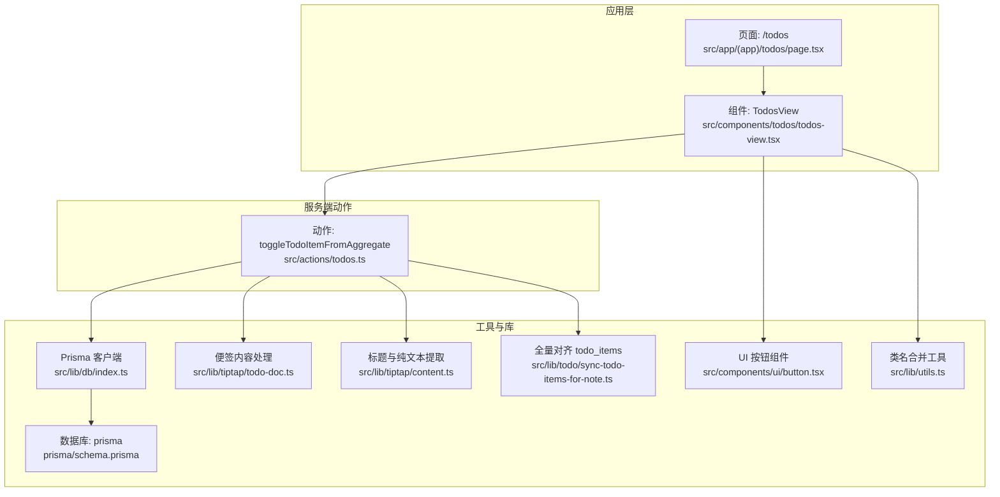
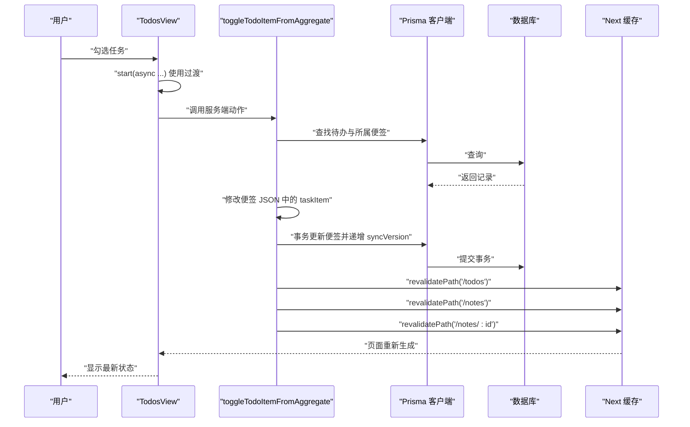
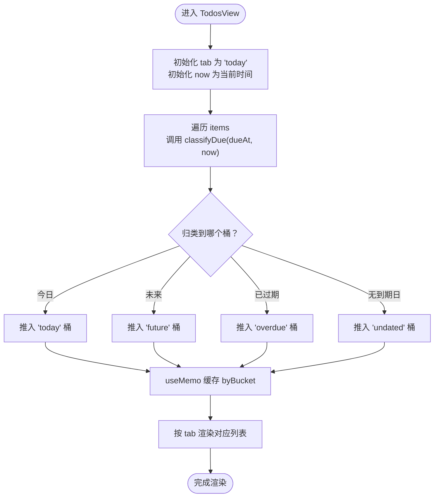
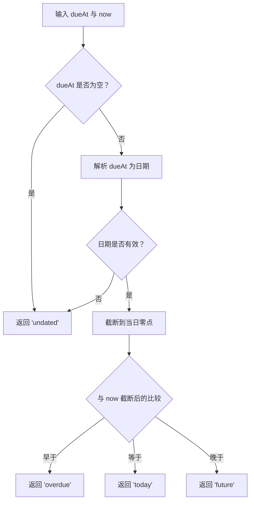
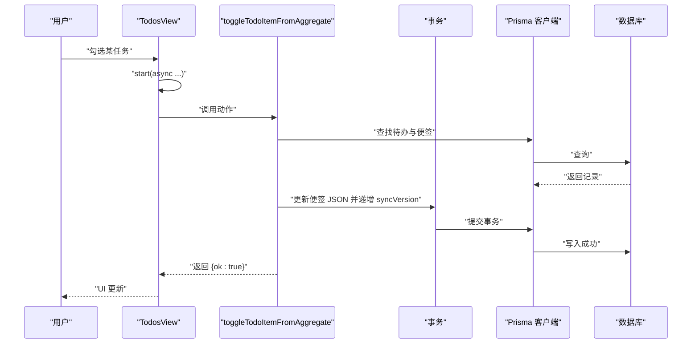
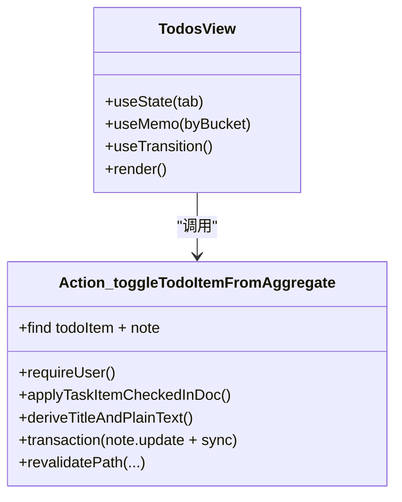
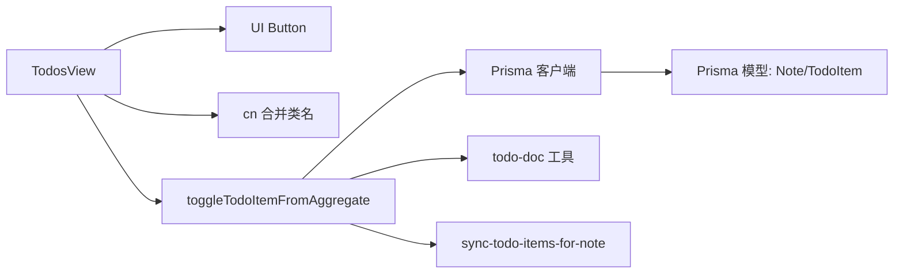

# 聚合视图系统

<cite>
**本文引用的文件**
- [src/components/todos/todos-view.tsx](file://src/components/todos/todos-view.tsx)
- [src/app/(app)/todos/page.tsx](file://src/app/(app)/todos/page.tsx)
- [src/actions/todos.ts](file://src/actions/todos.ts)
- [src/lib/db/index.ts](file://src/lib/db/index.ts)
- [src/lib/tiptap/todo-doc.ts](file://src/lib/tiptap/todo-doc.ts)
- [src/lib/tiptap/content.ts](file://src/lib/tiptap/content.ts)
- [src/lib/todo/sync-todo-items-for-note.ts](file://src/lib/todo/sync-todo-items-for-note.ts)
- [src/components/ui/button.tsx](file://src/components/ui/button.tsx)
- [src/lib/utils.ts](file://src/lib/utils.ts)
- [prisma/schema.prisma](file://prisma/schema.prisma)
</cite>

## 目录
1. [简介](#简介)
2. [项目结构](#项目结构)
3. [核心组件](#核心组件)
4. [架构总览](#架构总览)
5. [组件详解](#组件详解)
6. [依赖关系分析](#依赖关系分析)
7. [性能考量](#性能考量)
8. [故障排查指南](#故障排查指南)
9. [结论](#结论)
10. [附录](#附录)

## 简介
本文件面向“聚合视图系统”，聚焦 TodosView 组件的实现与使用，涵盖以下主题：
- 标签页切换与视图模式：今日、未来、已过期、无到期日
- 数据分类与列表渲染
- 视图数据的计算与缓存机制（含 useMemo 与 useTransition 的使用）
- 任务项完成状态切换（单个与批量完成思路）
- 视图间导航：跳转至具体便签与块位置
- 用户体验与交互优化建议
- 具体实现路径与使用示例

## 项目结构
聚合视图位于应用的“待办”页面，数据自数据库拉取并在服务端序列化传递给客户端组件。客户端组件负责视图渲染、标签页切换与交互。

图表来源
- [src/app/(app)/todos/page.tsx:1-32](file://src/app/(app)/todos/page.tsx#L1-L32)
- [src/components/todos/todos-view.tsx:1-149](file://src/components/todos/todos-view.tsx#L1-L149)
- [src/actions/todos.ts:1-70](file://src/actions/todos.ts#L1-L70)
- [src/lib/db/index.ts:1-16](file://src/lib/db/index.ts#L1-L16)
- [src/lib/tiptap/todo-doc.ts:1-101](file://src/lib/tiptap/todo-doc.ts#L1-L101)
- [src/lib/tiptap/content.ts:1-53](file://src/lib/tiptap/content.ts#L1-L53)
- [src/lib/todo/sync-todo-items-for-note.ts:1-59](file://src/lib/todo/sync-todo-items-for-note.ts#L1-L59)
- [src/components/ui/button.tsx:1-59](file://src/components/ui/button.tsx#L1-L59)
- [src/lib/utils.ts:1-7](file://src/lib/utils.ts#L1-L7)

章节来源
- [src/app/(app)/todos/page.tsx:1-32](file://src/app/(app)/todos/page.tsx#L1-L32)
- [src/components/todos/todos-view.tsx:1-149](file://src/components/todos/todos-view.tsx#L1-L149)

## 核心组件
- TodosView：负责渲染聚合待办列表、标签页切换、任务完成状态切换、跳转到便签等。
- 页面 TodosPage：负责拉取数据、序列化并传入 TodosView。
- 动作 toggleTodoItemFromAggregate：在聚合视图中将任务标记为完成，同步回便签 JSON，并对 todo_items 进行全量对齐。

章节来源
- [src/components/todos/todos-view.tsx:51-149](file://src/components/todos/todos-view.tsx#L51-L149)
- [src/app/(app)/todos/page.tsx:7-31](file://src/app/(app)/todos/page.tsx#L7-L31)
- [src/actions/todos.ts:11-70](file://src/actions/todos.ts#L11-L70)

## 架构总览
聚合视图的数据流如下：
- 页面从数据库查询未完成且未被删除的便签中的待办项，按到期时间与更新时间排序，序列化为 TodoListRow 数组。
- 将数据传递给 TodosView，在客户端进行分类、缓存与渲染。
- 用户点击完成时，触发服务端动作，更新便签 JSON 并同步 todo_items，随后触发路由缓存失效以刷新页面。

图表来源
- [src/components/todos/todos-view.tsx:114-118](file://src/components/todos/todos-view.tsx#L114-L118)
- [src/actions/todos.ts:12-69](file://src/actions/todos.ts#L12-L69)
- [src/lib/db/index.ts:7-11](file://src/lib/db/index.ts#L7-L11)

## 组件详解

### TodosView 组件
- 职责
  - 渲染聚合待办列表
  - 提供四种视图模式的标签页：今日、未来、已过期、无到期日
  - 支持任务完成状态切换（单个）
  - 导航到具体便签与块位置
- 关键实现点
  - 标签页与当前视图：使用 useState 管理 tab；TABS 定义四种模式及标签。
  - 分类函数 classifyDue：基于 dueAt 与当前日期，将任务归类到四个桶之一。
  - 计算与缓存：useMemo 将 items 按桶分组，避免每次渲染都重算；useMemo 依赖 items 与 now。
  - 列表渲染：按当前 tab 渲染对应桶内的任务列表。
  - 任务完成：使用 useTransition 包裹异步动作，防止阻塞 UI；禁用输入框直到过渡结束。
  - 导航：通过 Link 跳转到便签页面并携带块 ID 参数，实现快速定位。
  - UI：按钮样式来自 UI 组件库，类名合并工具保证样式正确叠加。

图表来源
- [src/components/todos/todos-view.tsx:51-97](file://src/components/todos/todos-view.tsx#L51-L97)
- [src/components/todos/todos-view.tsx:22-42](file://src/components/todos/todos-view.tsx#L22-L42)

章节来源
- [src/components/todos/todos-view.tsx:51-149](file://src/components/todos/todos-view.tsx#L51-L149)

### 视图模式与筛选逻辑
- 今日：到期日早于等于当天零点
- 未来：到期日在当天之后
- 已过期：到期日晚于当天零点
- 无到期日：dueAt 为空或无效

图表来源
- [src/components/todos/todos-view.tsx:22-42](file://src/components/todos/todos-view.tsx#L22-L42)

章节来源
- [src/components/todos/todos-view.tsx:22-42](file://src/components/todos/todos-view.tsx#L22-L42)

### 数据分类与缓存机制
- 分类：遍历 items，按 classifyDue 结果将每条记录放入对应桶。
- 缓存：useMemo(byBucket) 基于 items 与 now 缓存分组结果，避免重复计算。
- 性能优化：
  - 仅在 items 或 now 变化时重新分组。
  - 使用 useTransition 包裹动作，降低高优更新优先级，提升交互流畅性。
  - 列表渲染使用 key=row.id，确保 React 正确复用元素。

章节来源
- [src/components/todos/todos-view.tsx:56-67](file://src/components/todos/todos-view.tsx#L56-L67)
- [src/components/todos/todos-view.tsx:54](file://src/components/todos/todos-view.tsx#L54)
- [src/components/todos/todos-view.tsx:114-118](file://src/components/todos/todos-view.tsx#L114-L118)

### 任务完成状态切换
- 单个完成：用户勾选输入框，触发 useTransition 包裹的动作调用，服务端更新便签 JSON 并同步 todo_items。
- 批量完成：当前组件未提供批量操作入口。可在 UI 上增加“全选 + 批量完成”按钮，遍历当前列表项逐个调用相同动作。

图表来源
- [src/components/todos/todos-view.tsx:114-118](file://src/components/todos/todos-view.tsx#L114-L118)
- [src/actions/todos.ts:12-69](file://src/actions/todos.ts#L12-L69)

章节来源
- [src/components/todos/todos-view.tsx:110-120](file://src/components/todos/todos-view.tsx#L110-L120)
- [src/actions/todos.ts:12-69](file://src/actions/todos.ts#L12-L69)

### 视图间导航与跳转
- 导航目标：跳转到便签详情页，并定位到对应的块（taskItem）。
- 实现方式：使用 Next.js Link，路径包含 noteId，并附加 block 查询参数。
- 作用：提升用户效率，无需手动在便签中查找任务。

章节来源
- [src/components/todos/todos-view.tsx:132-141](file://src/components/todos/todos-view.tsx#L132-L141)

### 数据来源与序列化
- 页面 TodosPage 从数据库查询未完成且未删除的便签中的待办项，按到期时间升序、到期时间为空排末尾、更新时间降序排列。
- 将查询结果映射为 TodoListRow，包含任务 ID、文本、块 ID、到期时间、便签 ID 与标题，再传递给 TodosView。

章节来源
- [src/app/(app)/todos/page.tsx:9-28](file://src/app/(app)/todos/page.tsx#L9-L28)

### 服务端动作与同步机制
- 动作 toggleTodoItemFromAggregate：
  - 校验用户与待办存在性、便签未被删除
  - 在便签 JSON 中定位并更新对应 taskItem 的完成状态
  - 重新派生便签标题与纯文本内容
  - 使用事务原子性地更新便签并递增 syncVersion，随后对 todo_items 进行全量对齐
  - 触发多处路径缓存失效，确保聚合视图与便签视图同步刷新

图表来源
- [src/components/todos/todos-view.tsx:51-149](file://src/components/todos/todos-view.tsx#L51-L149)
- [src/actions/todos.ts:12-69](file://src/actions/todos.ts#L12-L69)

章节来源
- [src/actions/todos.ts:12-69](file://src/actions/todos.ts#L12-L69)

### 便签内容与任务项同步
- 从便签 JSON 中抽取任务项：extractTodosFromDocJson
- 应用任务项完成状态变更：applyTaskItemCheckedInDoc
- 全量对齐 todo_items：syncTodoItemsForNote（删除孤儿 + upsert）

章节来源
- [src/lib/tiptap/todo-doc.ts:50-100](file://src/lib/tiptap/todo-doc.ts#L50-L100)
- [src/lib/todo/sync-todo-items-for-note.ts:5-58](file://src/lib/todo/sync-todo-items-for-note.ts#L5-L58)

## 依赖关系分析
- 组件依赖
  - TodosView 依赖 UI 按钮组件与类名合并工具
  - 依赖日期工具库进行日期比较
  - 依赖 Link 进行导航
- 动作依赖
  - toggleTodoItemFromAggregate 依赖 Prisma 客户端、便签内容工具与同步工具
- 数据模型
  - TodoItem 与 Note 通过外键关联，支持按用户与状态查询

图表来源
- [src/components/todos/todos-view.tsx:8-9](file://src/components/todos/todos-view.tsx#L8-L9)
- [src/components/ui/button.tsx:43-58](file://src/components/ui/button.tsx#L43-L58)
- [src/lib/utils.ts:4-6](file://src/lib/utils.ts#L4-L6)
- [src/actions/todos.ts:12-69](file://src/actions/todos.ts#L12-L69)
- [src/lib/db/index.ts:7-11](file://src/lib/db/index.ts#L7-L11)
- [prisma/schema.prisma:78-100](file://prisma/schema.prisma#L78-L100)

章节来源
- [src/components/todos/todos-view.tsx:1-10](file://src/components/todos/todos-view.tsx#L1-L10)
- [src/actions/todos.ts:12-69](file://src/actions/todos.ts#L12-L69)
- [prisma/schema.prisma:78-100](file://prisma/schema.prisma#L78-L100)

## 性能考量
- useMemo 的使用
  - 对分组结果进行缓存，避免每次渲染都遍历 items
  - 依赖 items 与 now，当两者不变时不会重算
- useTransition 的使用
  - 将耗时的服务器动作包裹在过渡中，避免阻塞 UI
  - 在过渡期间禁用输入框，防止重复提交
- 列表渲染
  - 使用稳定的 key（任务 ID）提升重渲染性能
- 数据查询
  - 页面端查询已按到期时间与更新时间排序，减少前端排序成本

章节来源
- [src/components/todos/todos-view.tsx:54-67](file://src/components/todos/todos-view.tsx#L54-L67)
- [src/components/todos/todos-view.tsx:114-118](file://src/components/todos/todos-view.tsx#L114-L118)

## 故障排查指南
- 任务无法完成
  - 检查服务端动作返回的错误信息（如待办不存在、便签已在回收站、无法定位任务等）
  - 确认便签 JSON 中是否存在对应 blockId 的 taskItem
- 便签标题或内容未更新
  - 确认事务是否成功提交
  - 检查 syncVersion 是否递增以及对 todo_items 的全量对齐是否执行
- 聚合视图未刷新
  - 确认 revalidatePath 是否被调用（/todos、/notes、/notes/:id）
- 导航失败
  - 检查 noteId 与 blockId 是否正确传递
  - 确认便签未被删除

章节来源
- [src/actions/todos.ts:18-27](file://src/actions/todos.ts#L18-L27)
- [src/actions/todos.ts:58-67](file://src/actions/todos.ts#L58-L67)
- [src/components/todos/todos-view.tsx:132-141](file://src/components/todos/todos-view.tsx#L132-L141)

## 结论
TodosView 通过清晰的视图模式与高效的缓存策略，提供了流畅的聚合待办浏览体验。配合服务端动作的原子性更新与全量对齐，确保了数据一致性与界面实时性。建议后续可扩展批量操作与更丰富的筛选条件，进一步提升生产力。

## 附录

### 使用示例（步骤说明）
- 打开聚合视图页面：访问 /todos
- 切换视图：点击“今日/未来/已过期/无到期日”标签
- 完成任务：勾选任务前的复选框，等待过渡完成
- 跳转便签：点击“外部链接”图标，快速定位到对应块
- 批量完成（扩展建议）：在 UI 上增加“全选 + 批量完成”按钮，逐个调用服务端动作

章节来源
- [src/app/(app)/todos/page.tsx:7-31](file://src/app/(app)/todos/page.tsx#L7-L31)
- [src/components/todos/todos-view.tsx:84-96](file://src/components/todos/todos-view.tsx#L84-L96)
- [src/components/todos/todos-view.tsx:110-120](file://src/components/todos/todos-view.tsx#L110-L120)
- [src/components/todos/todos-view.tsx:132-141](file://src/components/todos/todos-view.tsx#L132-L141)