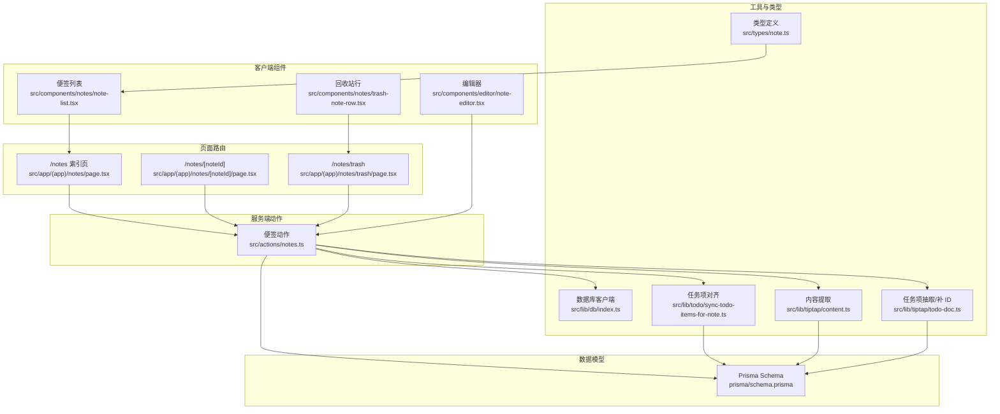
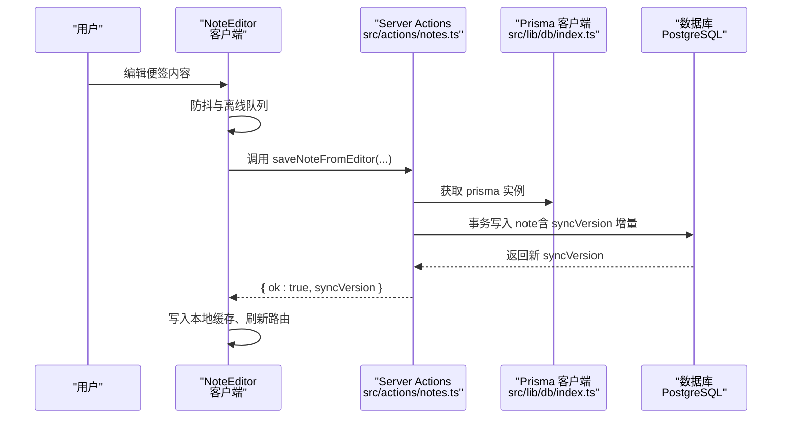
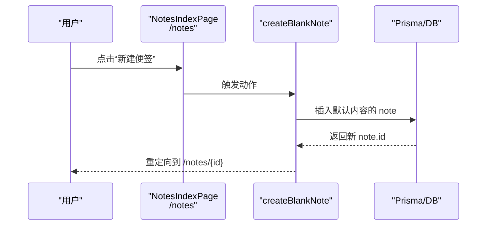
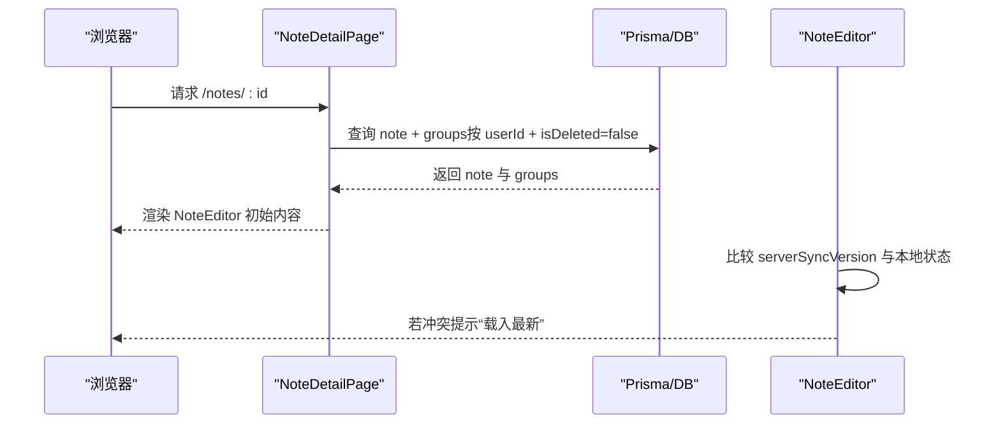
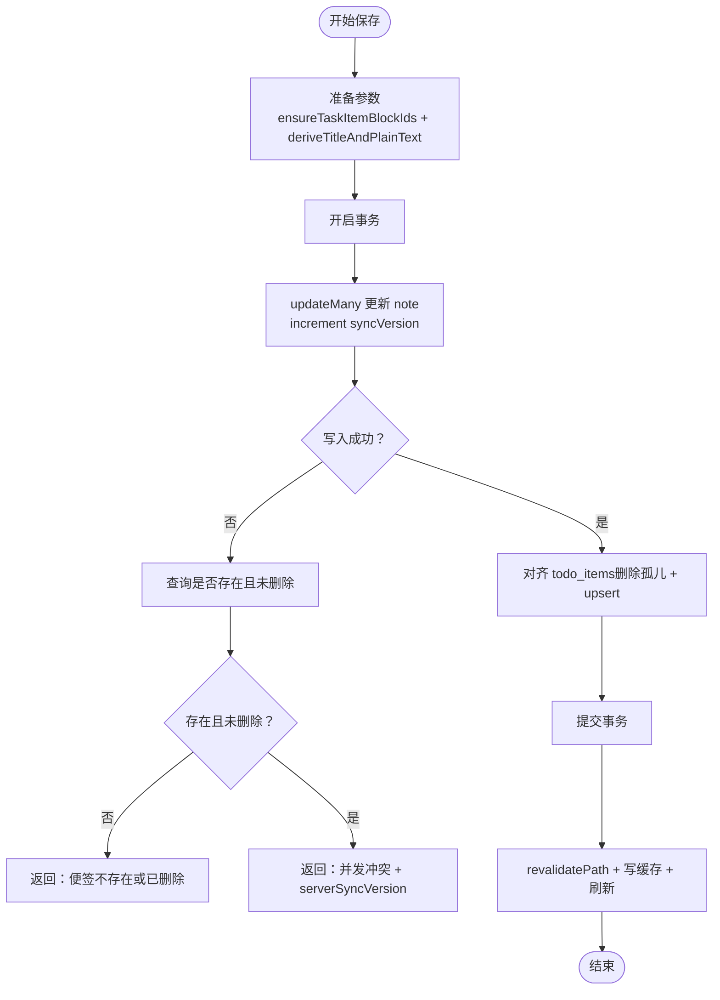
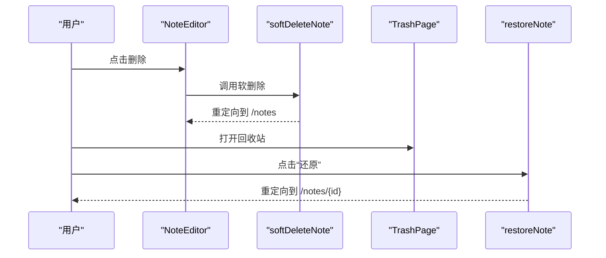
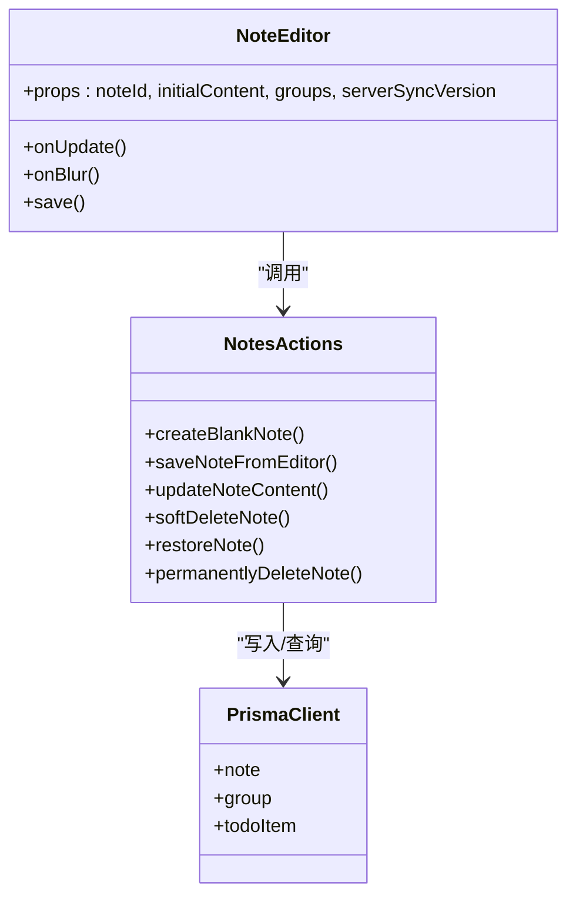

# 便签 CRUD 操作

<cite>
**本文引用的文件**
- [src/actions/notes.ts](file://src/actions/notes.ts)
- [src/app/(app)/notes/page.tsx](file://src/app/(app)/notes/page.tsx)
- [src/app/(app)/notes/[noteId]/page.tsx](file://src/app/(app)/notes/[noteId]/page.tsx)
- [src/app/(app)/notes/trash/page.tsx](file://src/app/(app)/notes/trash/page.tsx)
- [src/components/editor/note-editor.tsx](file://src/components/editor/note-editor.tsx)
- [src/components/notes/note-list.tsx](file://src/components/notes/note-list.tsx)
- [src/components/notes/trash-note-row.tsx](file://src/components/notes/trash-note-row.tsx)
- [src/lib/db/index.ts](file://src/lib/db/index.ts)
- [src/lib/tiptap/content.ts](file://src/lib/tiptap/content.ts)
- [src/lib/tiptap/todo-doc.ts](file://src/lib/tiptap/todo-doc.ts)
- [src/lib/todo/sync-todo-items-for-note.ts](file://src/lib/todo/sync-todo-items-for-note.ts)
- [src/types/note.ts](file://src/types/note.ts)
- [prisma/schema.prisma](file://prisma/schema.prisma)
</cite>

## 目录
1. [简介](#简介)
2. [项目结构](#项目结构)
3. [核心组件](#核心组件)
4. [架构总览](#架构总览)
5. [详细组件分析](#详细组件分析)
6. [依赖关系分析](#依赖关系分析)
7. [性能考量](#性能考量)
8. [故障排查指南](#故障排查指南)
9. [结论](#结论)
10. [附录](#附录)

## 简介
本文件系统化梳理 Smart-Todo 便签模块的 CRUD 实现，覆盖创建、读取、更新、删除与回收站恢复等全流程。重点说明：
- 创建：默认内容生成、初始状态设置、数据库写入与重定向
- 读取：内容获取、权限校验、实时刷新与离线缓存
- 更新：内容变更检测、版本控制与并发冲突处理
- 删除与软删除：回收站机制与数据恢复
- 列表展示：分页加载、搜索过滤与排序
- ID 生成与唯一性保障
- 错误处理策略与性能优化建议
- 实际代码示例路径与使用场景

## 项目结构
便签功能围绕“服务端动作（Server Actions）+ 客户端编辑器 + 页面路由 + 数据模型”组织，采用 Next.js App Router 的布局与流式渲染。

图表来源
- [src/app/(app)/notes/page.tsx:1-32](file://src/app/(app)/notes/page.tsx#L1-L32)
- [src/app/(app)/notes/[noteId]/page.tsx:1-56](file://src/app/(app)/notes/[noteId]/page.tsx#L1-L56)
- [src/app/(app)/notes/trash/page.tsx:1-39](file://src/app/(app)/notes/trash/page.tsx#L1-L39)
- [src/actions/notes.ts:1-230](file://src/actions/notes.ts#L1-L230)
- [src/components/editor/note-editor.tsx:1-586](file://src/components/editor/note-editor.tsx#L1-L586)
- [src/components/notes/note-list.tsx:1-54](file://src/components/notes/note-list.tsx#L1-L54)
- [src/components/notes/trash-note-row.tsx:1-65](file://src/components/notes/trash-note-row.tsx#L1-L65)
- [src/lib/db/index.ts:1-16](file://src/lib/db/index.ts#L1-L16)
- [src/lib/tiptap/content.ts:1-53](file://src/lib/tiptap/content.ts#L1-L53)
- [src/lib/tiptap/todo-doc.ts:1-101](file://src/lib/tiptap/todo-doc.ts#L1-L101)
- [src/lib/todo/sync-todo-items-for-note.ts:1-59](file://src/lib/todo/sync-todo-items-for-note.ts#L1-L59)
- [src/types/note.ts:1-13](file://src/types/note.ts#L1-L13)
- [prisma/schema.prisma:1-117](file://prisma/schema.prisma#L1-L117)

章节来源
- [src/app/(app)/notes/page.tsx:1-32](file://src/app/(app)/notes/page.tsx#L1-L32)
- [src/app/(app)/notes/[noteId]/page.tsx:1-56](file://src/app/(app)/notes/[noteId]/page.tsx#L1-L56)
- [src/app/(app)/notes/trash/page.tsx:1-39](file://src/app/(app)/notes/trash/page.tsx#L1-L39)
- [src/actions/notes.ts:1-230](file://src/actions/notes.ts#L1-L230)
- [src/components/editor/note-editor.tsx:1-586](file://src/components/editor/note-editor.tsx#L1-L586)
- [src/components/notes/note-list.tsx:1-54](file://src/components/notes/note-list.tsx#L1-L54)
- [src/components/notes/trash-note-row.tsx:1-65](file://src/components/notes/trash-note-row.tsx#L1-L65)
- [src/lib/db/index.ts:1-16](file://src/lib/db/index.ts#L1-L16)
- [src/lib/tiptap/content.ts:1-53](file://src/lib/tiptap/content.ts#L1-L53)
- [src/lib/tiptap/todo-doc.ts:1-101](file://src/lib/tiptap/todo-doc.ts#L1-L101)
- [src/lib/todo/sync-todo-items-for-note.ts:1-59](file://src/lib/todo/sync-todo-items-for-note.ts#L1-L59)
- [src/types/note.ts:1-13](file://src/types/note.ts#L1-L13)
- [prisma/schema.prisma:1-117](file://prisma/schema.prisma#L1-L117)

## 核心组件
- 服务端动作（Server Actions）
  - 创建便签：[createBlankNote:23-36](file://src/actions/notes.ts#L23-L36)、[createNoteInGroup:38-57](file://src/actions/notes.ts#L38-L57)
  - 更新便签：[updateNoteContent:59-138](file://src/actions/notes.ts#L59-L138)、[saveNoteFromEditor:141-152](file://src/actions/notes.ts#L141-L152)
  - 移动/置顶/着色：[moveNoteToGroup:154-173](file://src/actions/notes.ts#L154-L173)、[togglePinNote:199-207](file://src/actions/notes.ts#L199-L207)、[setNoteColor:209-218](file://src/actions/notes.ts#L209-L218)
  - 删除/恢复/永久删除：[softDeleteNote:175-185](file://src/actions/notes.ts#L175-L185)、[restoreNote:187-197](file://src/actions/notes.ts#L187-L197)、[permanentlyDeleteNote:220-229](file://src/actions/notes.ts#L220-L229)
- 客户端编辑器：[NoteEditor:86-586](file://src/components/editor/note-editor.tsx#L86-L586)，负责防抖保存、冲突提示、粘贴上传、锚点定位等
- 页面路由与列表展示：
  - 便签索引页：[NotesIndexPage](file://src/app/(app)/notes/page.tsx#L8-L31)
  - 便签详情页：[NoteDetailPage](file://src/app/(app)/notes/[noteId]/page.tsx#L6-L55)
  - 回收站页：[TrashPage](file://src/app/(app)/notes/trash/page.tsx#L10-L38)
  - 便签列表组件：[NoteList:14-53](file://src/components/notes/note-list.tsx#L14-L53)
  - 回收站行组件：[TrashNoteRow:14-64](file://src/components/notes/trash-note-row.tsx#L14-L64)
- 工具与类型：
  - 数据库客户端：[prisma:7-11](file://src/lib/db/index.ts#L7-L11)
  - 内容提取：[deriveTitleAndPlainText:13-52](file://src/lib/tiptap/content.ts#L13-L52)
  - 任务项抽取/补 ID：[ensureTaskItemBlockIds:5-21](file://src/lib/tiptap/todo-doc.ts#L5-L21)、[extractTodosFromDocJson:50-79](file://src/lib/tiptap/todo-doc.ts#L50-L79)
  - 任务项对齐：[syncTodoItemsForNote:5-58](file://src/lib/todo/sync-todo-items-for-note.ts#L5-L58)
  - 类型定义：[NoteListItem:1-7](file://src/types/note.ts#L1-L7)
- 数据模型：[Note:48-75](file://prisma/schema.prisma#L48-L75)、[Group:32-46](file://prisma/schema.prisma#L32-L46)、[TodoItem:77-100](file://prisma/schema.prisma#L77-L100)

章节来源
- [src/actions/notes.ts:1-230](file://src/actions/notes.ts#L1-L230)
- [src/components/editor/note-editor.tsx:1-586](file://src/components/editor/note-editor.tsx#L1-L586)
- [src/app/(app)/notes/page.tsx:1-32](file://src/app/(app)/notes/page.tsx#L1-L32)
- [src/app/(app)/notes/[noteId]/page.tsx:1-56](file://src/app/(app)/notes/[noteId]/page.tsx#L1-L56)
- [src/app/(app)/notes/trash/page.tsx:1-39](file://src/app/(app)/notes/trash/page.tsx#L1-L39)
- [src/components/notes/note-list.tsx:1-54](file://src/components/notes/note-list.tsx#L1-L54)
- [src/components/notes/trash-note-row.tsx:1-65](file://src/components/notes/trash-note-row.tsx#L1-L65)
- [src/lib/db/index.ts:1-16](file://src/lib/db/index.ts#L1-L16)
- [src/lib/tiptap/content.ts:1-53](file://src/lib/tiptap/content.ts#L1-L53)
- [src/lib/tiptap/todo-doc.ts:1-101](file://src/lib/tiptap/todo-doc.ts#L1-L101)
- [src/lib/todo/sync-todo-items-for-note.ts:1-59](file://src/lib/todo/sync-todo-items-for-note.ts#L1-L59)
- [src/types/note.ts:1-13](file://src/types/note.ts#L1-L13)
- [prisma/schema.prisma:1-117](file://prisma/schema.prisma#L1-L117)

## 架构总览
便签 CRUD 采用“服务端动作 + 客户端编辑器 + 路由页面”的分层设计，配合 Prisma 数据模型与数据库索引，实现高效的数据持久化与并发控制。

图表来源
- [src/components/editor/note-editor.tsx:138-189](file://src/components/editor/note-editor.tsx#L138-L189)
- [src/actions/notes.ts:141-152](file://src/actions/notes.ts#L141-L152)
- [src/lib/db/index.ts:7-11](file://src/lib/db/index.ts#L7-L11)
- [prisma/schema.prisma:48-75](file://prisma/schema.prisma#L48-L75)

## 详细组件分析

### 创建便签（Create）
- 默认内容生成
  - 使用默认空文档结构作为 contentJson 的初始值，确保编辑器可直接渲染。
  - 参考：[defaultDoc:17-20](file://src/actions/notes.ts#L17-L20)
- 初始状态设置
  - 新建便签默认 isPinned=false、color=null、groupId=null、isDeleted=false、syncVersion=0。
  - 参考：[Note 模型字段:48-75](file://prisma/schema.prisma#L48-L75)
- 数据库写入与重定向
  - 通过 prisma.note.create 写入，随后 revalidatePath 并重定向至新建便签详情页。
  - 参考：[createBlankNote:23-36](file://src/actions/notes.ts#L23-L36)、[createNoteInGroup:38-57](file://src/actions/notes.ts#L38-L57)
- 权限与可见性
  - 仅当前用户可见，且 isDeleted=false。
  - 参考：[NotesIndexPage 查询](file://src/app/(app)/notes/page.tsx#L10-L17)

图表来源
- [src/app/(app)/notes/page.tsx:26-28](file://src/app/(app)/notes/page.tsx#L26-L28)
- [src/actions/notes.ts:23-36](file://src/actions/notes.ts#L23-L36)

章节来源
- [src/actions/notes.ts:17-36](file://src/actions/notes.ts#L17-L36)
- [src/app/(app)/notes/page.tsx:8-31](file://src/app/(app)/notes/page.tsx#L8-L31)
- [prisma/schema.prisma:48-75](file://prisma/schema.prisma#L48-L75)

### 读取便签（Read）
- 内容获取与权限验证
  - 详情页同时查询 note 与 groups，并进行用户与 isDeleted 校验，不存在则 notFound。
  - 参考：[NoteDetailPage](file://src/app/(app)/notes/[noteId]/page.tsx#L16-L36)
- 实时数据同步
  - 客户端编辑器接收 serverSyncVersion，若服务器版本更高且存在未保存更改，则提示“已在其他端更新”，允许用户选择载入最新。
  - 参考：[NoteEditor 实时刷新逻辑:237-263](file://src/components/editor/note-editor.tsx#L237-L263)
- 列表展示
  - 列表组件消费 NoteListItem，渲染标题、置顶图标与预览。
  - 参考：[NoteList:14-53](file://src/components/notes/note-list.tsx#L14-L53)、[NoteListItem 类型:1-7](file://src/types/note.ts#L1-L7)

图表来源
- [src/app/(app)/notes/[noteId]/page.tsx:16-36](file://src/app/(app)/notes/[noteId]/page.tsx#L16-L36)
- [src/components/editor/note-editor.tsx:237-263](file://src/components/editor/note-editor.tsx#L237-L263)

章节来源
- [src/app/(app)/notes/[noteId]/page.tsx:1-56](file://src/app/(app)/notes/[noteId]/page.tsx#L1-L56)
- [src/components/notes/note-list.tsx:1-54](file://src/components/notes/note-list.tsx#L1-L54)
- [src/types/note.ts:1-13](file://src/types/note.ts#L1-L13)
- [src/components/editor/note-editor.tsx:1-586](file://src/components/editor/note-editor.tsx#L1-L586)

### 更新便签（Update）
- 内容变更检测与保存流程
  - 编辑器在编辑器更新或失焦时触发防抖保存，调用 saveNoteFromEditor，内部确保 taskItem 的 blockId 稳定并计算标题与纯文本。
  - 参考：[saveNoteFromEditor:141-152](file://src/actions/notes.ts#L141-L152)、[ensureTaskItemBlockIds:5-21](file://src/lib/tiptap/todo-doc.ts#L5-L21)、[deriveTitleAndPlainText:13-52](file://src/lib/tiptap/content.ts#L13-L52)
- 版本控制与并发冲突处理
  - 使用 updateMany + where 条件中的 syncVersion 字段实现乐观并发锁；若写入计数为 0，则区分“便签不存在/已删除”与“并发冲突”两种情形返回。
  - 参考：[updateNoteContent:59-138](file://src/actions/notes.ts#L59-L138)
- 任务项对齐
  - 在同一事务内全量对齐 todo_items，删除孤儿、upsert 新条目，保持与 contentJson 的一致性。
  - 参考：[syncTodoItemsForNote:5-58](file://src/lib/todo/sync-todo-items-for-note.ts#L5-L58)
- 成功后的缓存与刷新
  - 写入本地缓存、revalidatePath 并刷新路由，确保客户端状态与服务端一致。
  - 参考：[NoteEditor 成功分支:172-186](file://src/components/editor/note-editor.tsx#L172-L186)

图表来源
- [src/actions/notes.ts:59-138](file://src/actions/notes.ts#L59-L138)
- [src/lib/todo/sync-todo-items-for-note.ts:5-58](file://src/lib/todo/sync-todo-items-for-note.ts#L5-L58)
- [src/lib/tiptap/todo-doc.ts:5-21](file://src/lib/tiptap/todo-doc.ts#L5-L21)
- [src/lib/tiptap/content.ts:13-52](file://src/lib/tiptap/content.ts#L13-L52)
- [src/components/editor/note-editor.tsx:172-186](file://src/components/editor/note-editor.tsx#L172-L186)

章节来源
- [src/actions/notes.ts:59-152](file://src/actions/notes.ts#L59-L152)
- [src/lib/todo/sync-todo-items-for-note.ts:1-59](file://src/lib/todo/sync-todo-items-for-note.ts#L1-L59)
- [src/lib/tiptap/todo-doc.ts:1-101](file://src/lib/tiptap/todo-doc.ts#L1-L101)
- [src/lib/tiptap/content.ts:1-53](file://src/lib/tiptap/content.ts#L1-L53)
- [src/components/editor/note-editor.tsx:1-586](file://src/components/editor/note-editor.tsx#L1-L586)

### 删除与软删除（Delete/Soft Delete）
- 软删除
  - 将 isDeleted=true、deletedAt 设置为当前时间，同时重定向到列表页。
  - 参考：[softDeleteNote:175-185](file://src/actions/notes.ts#L175-L185)
- 回收站与恢复
  - 回收站页列出 isDeleted=true 的便签；恢复时将 isDeleted=false、deletedAt 置空并跳转回详情。
  - 参考：[TrashPage](file://src/app/(app)/notes/trash/page.tsx#L10-L38)、[restoreNote:187-197](file://src/actions/notes.ts#L187-L197)
- 永久删除
  - 仅删除标记为 isDeleted=true 的记录，防止误删。
  - 参考：[permanentlyDeleteNote:220-229](file://src/actions/notes.ts#L220-L229)
- 回收站行组件
  - 提供“还原”“彻底删除”按钮与二次确认对话框。
  - 参考：[TrashNoteRow:14-64](file://src/components/notes/trash-note-row.tsx#L14-L64)

图表来源
- [src/components/editor/note-editor.tsx:369-374](file://src/components/editor/note-editor.tsx#L369-L374)
- [src/actions/notes.ts:175-185](file://src/actions/notes.ts#L175-L185)
- [src/app/(app)/notes/trash/page.tsx:10-38](file://src/app/(app)/notes/trash/page.tsx#L10-L38)
- [src/actions/notes.ts:187-197](file://src/actions/notes.ts#L187-L197)

章节来源
- [src/actions/notes.ts:175-229](file://src/actions/notes.ts#L175-L229)
- [src/app/(app)/notes/trash/page.tsx:1-39](file://src/app/(app)/notes/trash/page.tsx#L1-L39)
- [src/components/notes/trash-note-row.tsx:1-65](file://src/components/notes/trash-note-row.tsx#L1-L65)

### 便签列表展示（List）
- 分页加载
  - 当前实现为一次性拉取用户所有未删除便签，按 isPinned 降序、updatedAt 降序排序，适合中小规模数据。
  - 参考：[NotesIndexPage 排序](file://src/app/(app)/notes/page.tsx#L12)
- 搜索过滤
  - 未实现全文搜索过滤；可通过 contentText 快照字段结合数据库检索扩展。
  - 参考：[contentText 字段](file://prisma/schema.prisma#L57)
- 排序
  - 以 isPinned 优先、updatedAt 降序排列，突出置顶便签。
  - 参考：[NoteList 渲染:26-51](file://src/components/notes/note-list.tsx#L26-L51)

章节来源
- [src/app/(app)/notes/page.tsx:1-32](file://src/app/(app)/notes/page.tsx#L1-L32)
- [src/components/notes/note-list.tsx:1-54](file://src/components/notes/note-list.tsx#L1-L54)
- [prisma/schema.prisma:57](file://prisma/schema.prisma#L57)

### ID 生成与唯一性保证
- 便签 ID
  - 使用数据库 UUID 默认值，确保全局唯一性。
  - 参考：[Note.id 默认值](file://prisma/schema.prisma#L50)
- 任务项 blockId
  - 缺失时自动生成稳定 ID，避免跨端编辑时的不一致。
  - 参考：[ensureTaskItemBlockIds:5-21](file://src/lib/tiptap/todo-doc.ts#L5-L21)

章节来源
- [prisma/schema.prisma:48-75](file://prisma/schema.prisma#L48-L75)
- [src/lib/tiptap/todo-doc.ts:1-101](file://src/lib/tiptap/todo-doc.ts#L1-L101)

## 依赖关系分析

图表来源
- [src/components/editor/note-editor.tsx:86-586](file://src/components/editor/note-editor.tsx#L86-L586)
- [src/actions/notes.ts:1-230](file://src/actions/notes.ts#L1-L230)
- [src/lib/db/index.ts:1-16](file://src/lib/db/index.ts#L1-L16)

章节来源
- [src/components/editor/note-editor.tsx:1-586](file://src/components/editor/note-editor.tsx#L1-L586)
- [src/actions/notes.ts:1-230](file://src/actions/notes.ts#L1-L230)
- [src/lib/db/index.ts:1-16](file://src/lib/db/index.ts#L1-L16)

## 性能考量
- 事务与批量写入
  - 更新便签与对齐任务项在同一事务内执行，减少锁竞争与不一致风险。
  - 参考：[updateNoteContent 事务块:81-120](file://src/actions/notes.ts#L81-L120)、[syncTodoItemsForNote:5-58](file://src/lib/todo/sync-todo-items-for-note.ts#L5-L58)
- 防抖与离线队列
  - 编辑器使用防抖降低网络请求频率；网络异常时写入本地队列，联网后自动重放。
  - 参考：[DEBOUNCE_MS](file://src/components/editor/note-editor.tsx#L46)、[enqueueNoteSave](file://src/components/editor/note-editor.tsx#L41)
- 索引与查询优化
  - Note 表对 (userId, isDeleted, isPinned, updatedAt) 建有复合索引，利于列表排序与筛选。
  - 参考：[Note 索引:72-73](file://prisma/schema.prisma#L72-L73)
- 缓存与增量刷新
  - 成功保存后写入本地缓存并 revalidatePath，避免全量刷新带来的性能损耗。
  - 参考：[writeNoteCache:176-183](file://src/components/editor/note-editor.tsx#L176-L183)

章节来源
- [src/actions/notes.ts:59-138](file://src/actions/notes.ts#L59-L138)
- [src/lib/todo/sync-todo-items-for-note.ts:1-59](file://src/lib/todo/sync-todo-items-for-note.ts#L1-L59)
- [src/components/editor/note-editor.tsx:46-189](file://src/components/editor/note-editor.tsx#L46-L189)
- [prisma/schema.prisma:72-75](file://prisma/schema.prisma#L72-L75)

## 故障排查指南
- 保存失败与网络异常
  - 现象：保存状态变为 error，提示“保存失败”或“网络不可用，内容已加入本地队列”。
  - 处理：检查网络连接，等待自动重放；必要时手动刷新页面。
  - 参考：[isLikelyNetworkError:48-59](file://src/components/editor/note-editor.tsx#L48-L59)、[flushSave 错误分支:146-156](file://src/components/editor/note-editor.tsx#L146-L156)
- 并发冲突
  - 现象：弹出“保存冲突：便签已在其他端更新”，提供“重新加载”选项。
  - 处理：选择“载入最新”以合并最新内容。
  - 参考：[冲突分支:157-166](file://src/components/editor/note-editor.tsx#L157-L166)
- 便签不存在或已删除
  - 现象：返回“便签不存在或已删除”错误。
  - 处理：导航至列表页重新选择便签。
  - 参考：[updateNoteContent 错误映射:122-124](file://src/actions/notes.ts#L122-L124)
- 回收站操作
  - 现象：彻底删除不可逆。
  - 处理：谨慎操作，使用“还原”恢复。
  - 参考：[TrashNoteRow:19-61](file://src/components/notes/trash-note-row.tsx#L19-L61)

章节来源
- [src/components/editor/note-editor.tsx:48-166](file://src/components/editor/note-editor.tsx#L48-L166)
- [src/actions/notes.ts:122-133](file://src/actions/notes.ts#L122-L133)
- [src/components/notes/trash-note-row.tsx:1-65](file://src/components/notes/trash-note-row.tsx#L1-L65)

## 结论
Smart-Todo 的便签 CRUD 以“服务端动作 + 客户端编辑器 + 路由页面”为核心，结合 Prisma 的乐观并发锁与事务一致性，实现了可靠的协同编辑体验。通过防抖、离线队列与缓存机制，兼顾了性能与可用性。未来可在列表页引入分页与全文检索、完善回收站批量操作与定时清理策略，进一步提升大规模场景下的稳定性与效率。

## 附录
- 使用场景示例（路径指引）
  - 新建便签：[NotesIndexPage 表单](file://src/app/(app)/notes/page.tsx#L26-L28) → [createBlankNote:23-36](file://src/actions/notes.ts#L23-L36)
  - 编辑并保存：[NoteEditor:86-586](file://src/components/editor/note-editor.tsx#L86-L586) → [saveNoteFromEditor:141-152](file://src/actions/notes.ts#L141-L152)
  - 软删除与恢复：[NoteEditor 删除按钮:369-374](file://src/components/editor/note-editor.tsx#L369-L374) → [softDeleteNote:175-185](file://src/actions/notes.ts#L175-L185) → [restoreNote:187-197](file://src/actions/notes.ts#L187-L197)
  - 回收站彻底删除：[TrashNoteRow:19-61](file://src/components/notes/trash-note-row.tsx#L19-L61) → [permanentlyDeleteNote:220-229](file://src/actions/notes.ts#L220-L229)
  - 任务项对齐：[syncTodoItemsForNote:5-58](file://src/lib/todo/sync-todo-items-for-note.ts#L5-L58)