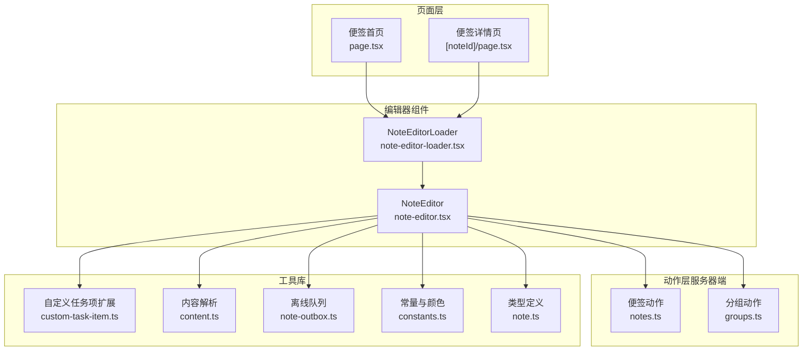
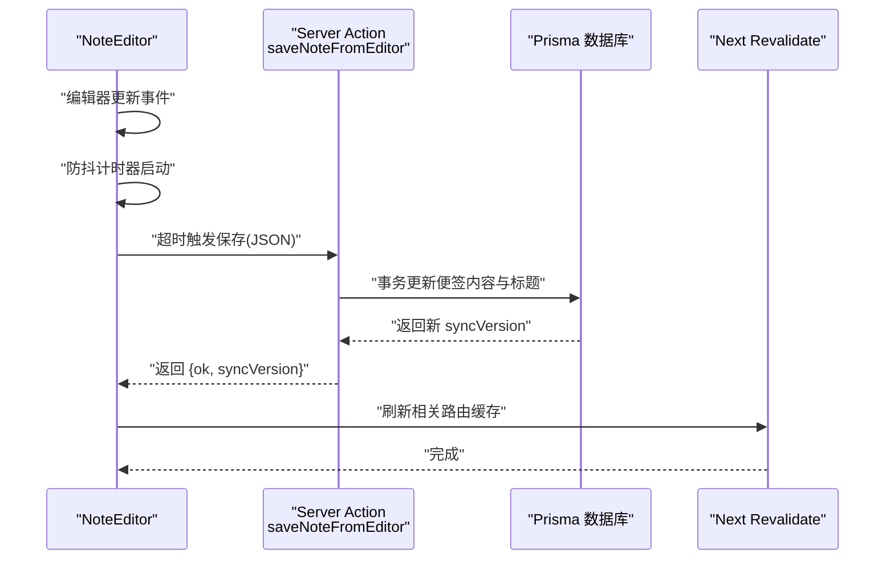
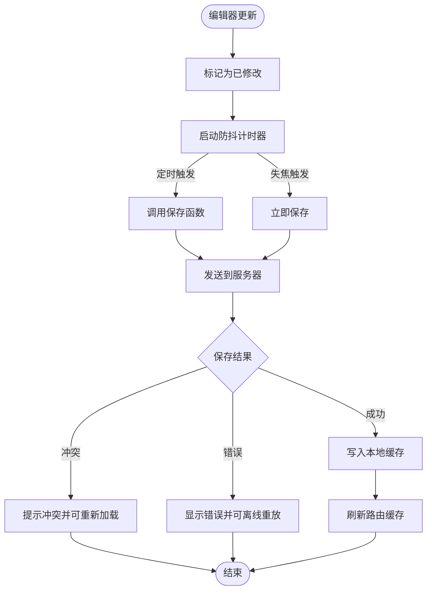
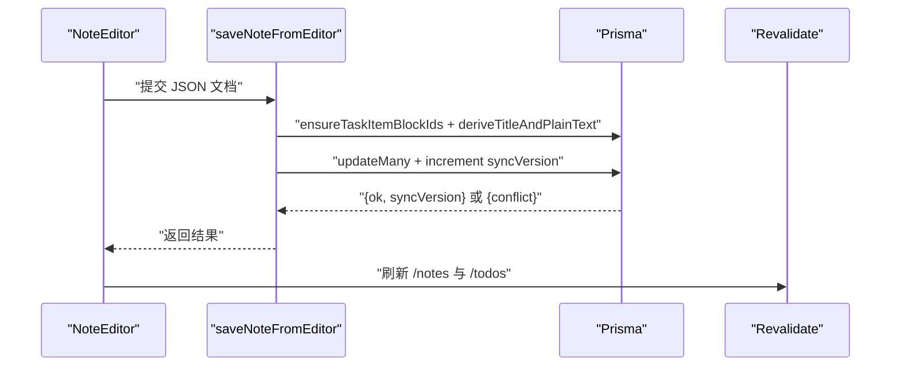
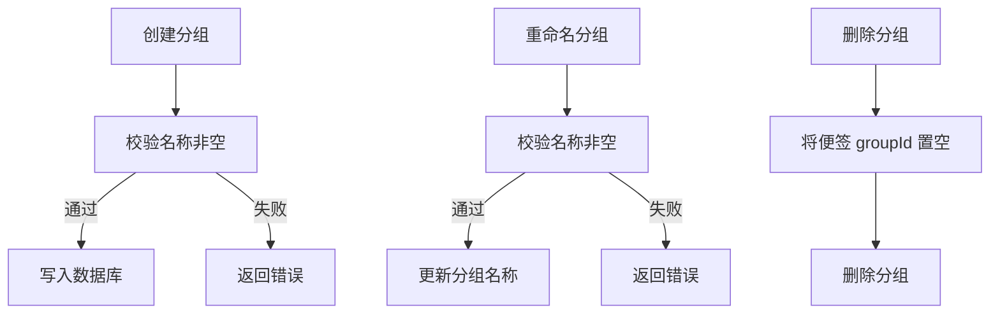
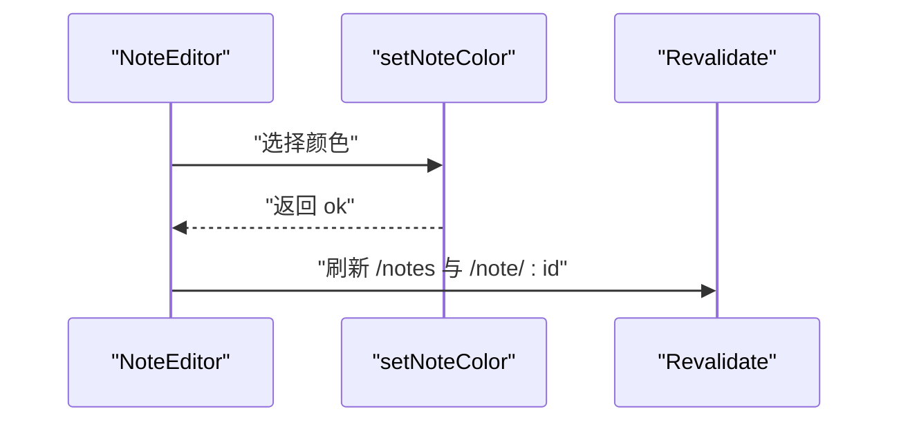
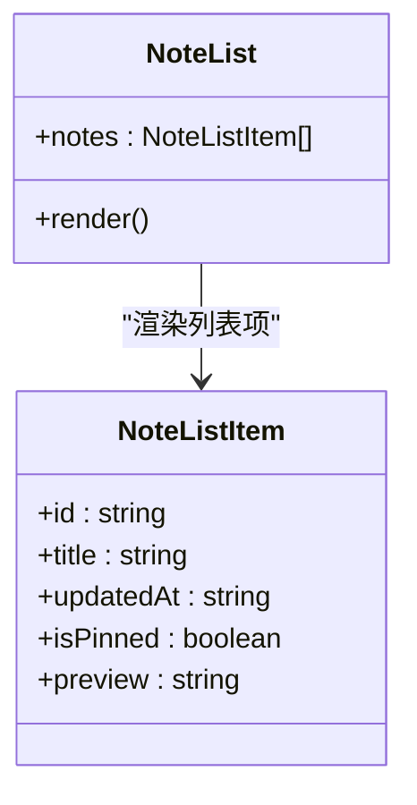
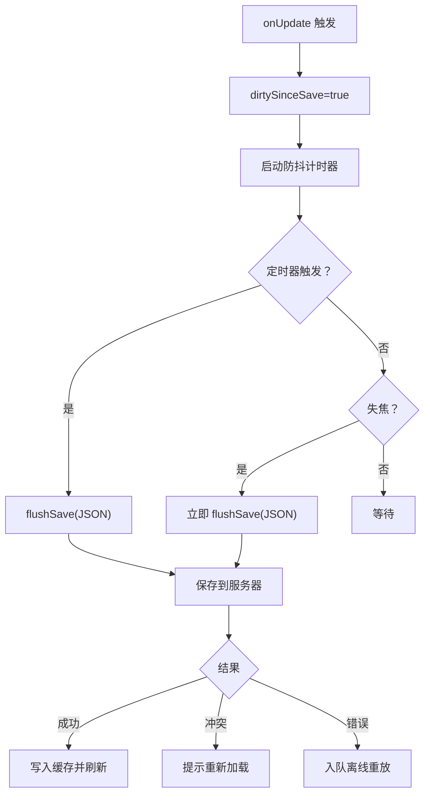
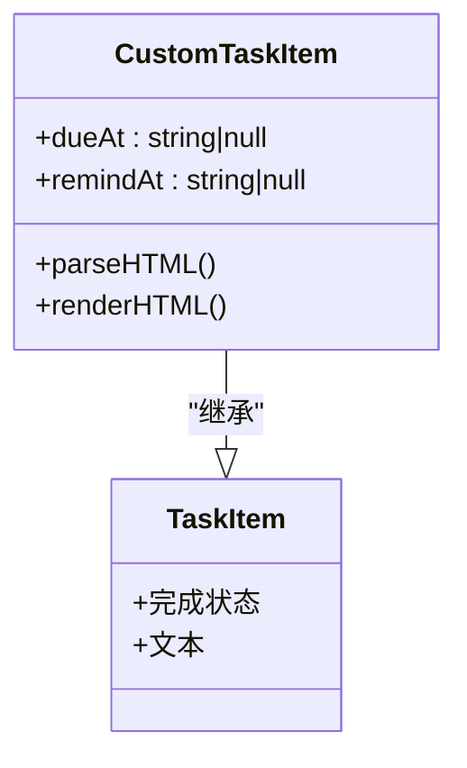
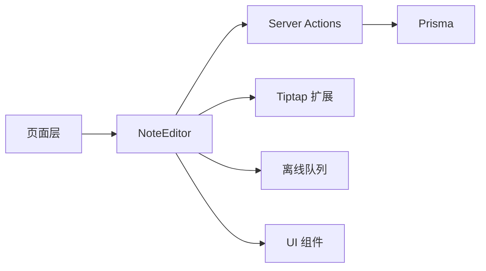

# 便签管理系统

<cite>
**本文引用的文件**
- [note-editor.tsx](file://src/components/editor/note-editor.tsx)
- [note-editor-loader.tsx](file://src/components/editor/note-editor-loader.tsx)
- [notes.ts](file://src/actions/notes.ts)
- [groups.ts](file://src/actions/groups.ts)
- [custom-task-item.ts](file://src/lib/tiptap/custom-task-item.ts)
- [constants.ts](file://src/lib/constants.ts)
- [note.ts](file://src/types/note.ts)
- [page.tsx](file://src/app/(app)/notes/page.tsx)
- [page.tsx](file://src/app/(app)/notes/[noteId]/page.tsx)
- [note-list.tsx](file://src/components/notes/note-list.tsx)
- [group-row.tsx](file://src/components/notes/group-row.tsx)
- [groups-panel.tsx](file://src/components/notes/groups-panel.tsx)
- [content.ts](file://src/lib/tiptap/content.ts)
- [note-outbox.ts](file://src/lib/offline/note-outbox.ts)
</cite>

## 目录
1. [简介](#简介)
2. [项目结构](#项目结构)
3. [核心组件](#核心组件)
4. [架构总览](#架构总览)
5. [详细组件分析](#详细组件分析)
6. [依赖关系分析](#依赖关系分析)
7. [性能考虑](#性能考虑)
8. [故障排查指南](#故障排查指南)
9. [结论](#结论)
10. [附录](#附录)

## 简介
本文件为 Smart-Todo 便签管理系统的全面技术文档，重点围绕基于 Tiptap 的富文本编辑器实现、便签 CRUD 与回收站、分组管理、颜色标记系统、便签列表展示与交互、编辑器防抖保存与实时预览、自定义扩展开发指南以及性能优化与用户体验改进进行系统化说明。

## 项目结构
便签系统由“页面层 → 编辑器组件 → 动作层（服务器端） → 工具库（Tiptap 扩展、离线队列、常量等）”构成，采用 Next.js App Router 的客户端与服务端协作模式：

- 页面层负责数据拉取与路由跳转
- 编辑器组件负责富文本渲染与交互
- 动作层负责数据库操作与并发控制
- 工具库提供内容解析、自定义扩展、离线队列等能力

**图表来源**
- [page.tsx](file://src/app/(app)/notes/page.tsx#L1-L32)
- [page.tsx](file://src/app/(app)/notes/[noteId]/page.tsx#L1-L56)
- [note-editor-loader.tsx:1-21](file://src/components/editor/note-editor-loader.tsx#L1-L21)
- [note-editor.tsx:1-586](file://src/components/editor/note-editor.tsx#L1-L586)
- [notes.ts:1-230](file://src/actions/notes.ts#L1-L230)
- [groups.ts:1-59](file://src/actions/groups.ts#L1-L59)
- [custom-task-item.ts:1-31](file://src/lib/tiptap/custom-task-item.ts#L1-L31)
- [content.ts:1-53](file://src/lib/tiptap/content.ts#L1-L53)
- [note-outbox.ts:1-87](file://src/lib/offline/note-outbox.ts#L1-L87)
- [constants.ts:1-16](file://src/lib/constants.ts#L1-L16)
- [note.ts:1-13](file://src/types/note.ts#L1-L13)

**章节来源**
- [page.tsx](file://src/app/(app)/notes/page.tsx#L1-L32)
- [page.tsx](file://src/app/(app)/notes/[noteId]/page.tsx#L1-L56)
- [note-editor-loader.tsx:1-21](file://src/components/editor/note-editor-loader.tsx#L1-L21)
- [note-editor.tsx:1-586](file://src/components/editor/note-editor.tsx#L1-L586)
- [notes.ts:1-230](file://src/actions/notes.ts#L1-L230)
- [groups.ts:1-59](file://src/actions/groups.ts#L1-L59)
- [custom-task-item.ts:1-31](file://src/lib/tiptap/custom-task-item.ts#L1-L31)
- [content.ts:1-53](file://src/lib/tiptap/content.ts#L1-L53)
- [note-outbox.ts:1-87](file://src/lib/offline/note-outbox.ts#L1-L87)
- [constants.ts:1-16](file://src/lib/constants.ts#L1-L16)
- [note.ts:1-13](file://src/types/note.ts#L1-L13)

## 核心组件
- 富文本编辑器组件：负责编辑器初始化、扩展配置、命令与快捷键、粘贴图片、防抖保存、并发冲突处理、实时预览与远程刷新提示。
- 便签动作层：提供创建、更新、移动分组、置顶、着色、软删除、恢复、永久删除等服务器端接口，并内置乐观并发控制。
- 分组管理组件：提供分组创建、重命名、删除（将组内便签移至未分组）。
- 内容解析与自定义扩展：从 Tiptap JSON 中提取标题与纯文本，自定义任务项扩展支持到期与提醒属性。
- 离线队列：在网络异常时将保存请求入队，联网后顺序重放。
- 常量与类型：颜色枚举、便签与分组类型定义。

**章节来源**
- [note-editor.tsx:1-586](file://src/components/editor/note-editor.tsx#L1-L586)
- [notes.ts:1-230](file://src/actions/notes.ts#L1-L230)
- [groups.ts:1-59](file://src/actions/groups.ts#L1-L59)
- [content.ts:1-53](file://src/lib/tiptap/content.ts#L1-L53)
- [custom-task-item.ts:1-31](file://src/lib/tiptap/custom-task-item.ts#L1-L31)
- [note-outbox.ts:1-87](file://src/lib/offline/note-outbox.ts#L1-L87)
- [constants.ts:1-16](file://src/lib/constants.ts#L1-L16)
- [note.ts:1-13](file://src/types/note.ts#L1-L13)

## 架构总览
编辑器与动作层通过 Next.js Server Actions 协作，前端负责 UI 与交互，后端负责持久化与并发一致性；内容变更通过防抖与离线队列保障可靠性。

**图表来源**
- [note-editor.tsx:138-189](file://src/components/editor/note-editor.tsx#L138-L189)
- [notes.ts:140-152](file://src/actions/notes.ts#L140-L152)

## 详细组件分析

### 富文本编辑器组件（NoteEditor）
- 编辑器初始化与扩展配置
  - 使用 StarterKit 并配置标题层级、列表保持样式与属性
  - 自定义任务项扩展启用嵌套任务列表
  - 启用唯一 ID 扩展，为任务项生成 data-id 属性
  - 链接与图片扩展开启自动链接、默认协议与禁用 base64
  - 占位符与排版扩展提升输入体验
- 命令与交互
  - 支持加粗、斜体、删除线、标题、列表、任务列表切换
  - 链接弹窗设置/移除链接
  - 图片插入：文件选择与剪贴板图片识别并插入
  - 撤销/重做、置顶、颜色选择、分组选择、删除（软删除）
- 防抖保存与并发控制
  - 编辑器更新触发防抖保存，失焦立即保存
  - 保存结果区分成功、错误、冲突三种情况
  - 冲突时提示用户重新加载或显示“已在其他端更新”
  - 成功后写入本地缓存并刷新路由
- 实时预览与远程刷新
  - 监听服务端 syncVersion，若本地有未保存更改则提示覆盖
  - 无本地更改时直接替换编辑器内容
- 锚点定位
  - 支持根据 UniqueID 的 data-id 定位到特定块并平滑滚动

**图表来源**
- [note-editor.tsx:195-225](file://src/components/editor/note-editor.tsx#L195-L225)
- [note-editor.tsx:138-189](file://src/components/editor/note-editor.tsx#L138-L189)
- [note-editor.tsx:236-263](file://src/components/editor/note-editor.tsx#L236-L263)

**章节来源**
- [note-editor.tsx:113-136](file://src/components/editor/note-editor.tsx#L113-L136)
- [note-editor.tsx:202-225](file://src/components/editor/note-editor.tsx#L202-L225)
- [note-editor.tsx:265-291](file://src/components/editor/note-editor.tsx#L265-L291)
- [note-editor.tsx:332-374](file://src/components/editor/note-editor.tsx#L332-L374)
- [note-editor.tsx:380-584](file://src/components/editor/note-editor.tsx#L380-L584)

### 便签 CRUD 与回收站
- 创建
  - 新建空白便签或在指定分组内创建
- 读取
  - 便签详情页按 noteId 查询并返回初始内容、置顶状态、颜色、分组与 syncVersion
- 更新
  - 保存时确保任务项块 ID、派生标题与纯文本，支持乐观并发版本锁
- 删除与回收站
  - 软删除：标记 isDeleted 并记录删除时间
  - 恢复：取消删除标记
  - 永久删除：清理已删除便签
- 并发控制
  - 通过 expectedSyncVersion 与数据库行级版本锁避免覆盖

**图表来源**
- [notes.ts:140-152](file://src/actions/notes.ts#L140-L152)
- [notes.ts:59-138](file://src/actions/notes.ts#L59-L138)
- [content.ts:1-53](file://src/lib/tiptap/content.ts#L1-L53)
- [custom-task-item.ts:1-31](file://src/lib/tiptap/custom-task-item.ts#L1-L31)

**章节来源**
- [notes.ts:22-57](file://src/actions/notes.ts#L22-L57)
- [notes.ts:140-152](file://src/actions/notes.ts#L140-L152)
- [notes.ts:175-185](file://src/actions/notes.ts#L175-L185)
- [notes.ts:187-197](file://src/actions/notes.ts#L187-L197)
- [notes.ts:220-229](file://src/actions/notes.ts#L220-L229)

### 分组管理系统
- 分组创建
  - 去除前后空格并校验非空
- 分组重命名
  - 校验非空并检查是否存在
- 分组删除
  - 将该分组下所有便签移至“未分组”，再删除分组
- 分组面板
  - 表单创建分组，列表展示分组并支持删除确认

**图表来源**
- [groups.ts:7-21](file://src/actions/groups.ts#L7-L21)
- [groups.ts:23-38](file://src/actions/groups.ts#L23-L38)
- [groups.ts:40-53](file://src/actions/groups.ts#L40-L53)

**章节来源**
- [groups.ts:1-59](file://src/actions/groups.ts#L1-L59)
- [group-row.tsx:1-53](file://src/components/notes/group-row.tsx#L1-L53)
- [groups-panel.tsx:1-25](file://src/components/notes/groups-panel.tsx#L1-L25)

### 颜色标记系统
- 颜色枚举与选择器
  - 提供多种预设颜色，编辑器顶部下拉选择
  - 选择后调用服务器端设置颜色动作并刷新
- 视觉反馈
  - 保存状态在工具栏显示“保存中/已保存/失败”

**图表来源**
- [constants.ts:4-11](file://src/lib/constants.ts#L4-L11)
- [note-editor.tsx:348-354](file://src/components/editor/note-editor.tsx#L348-L354)
- [notes.ts:209-218](file://src/actions/notes.ts#L209-L218)

**章节来源**
- [constants.ts:1-16](file://src/lib/constants.ts#L1-L16)
- [note-editor.tsx:529-542](file://src/components/editor/note-editor.tsx#L529-L542)
- [notes.ts:209-218](file://src/actions/notes.ts#L209-L218)

### 便签列表展示与交互
- 列表渲染
  - 支持置顶图标、标题、摘要预览
  - 当前激活项高亮
- 交互
  - 点击跳转至对应便签详情页

**图表来源**
- [note-list.tsx:1-54](file://src/components/notes/note-list.tsx#L1-L54)
- [note.ts:1-13](file://src/types/note.ts#L1-L13)

**章节来源**
- [note-list.tsx:1-54](file://src/components/notes/note-list.tsx#L1-L54)
- [note.ts:1-13](file://src/types/note.ts#L1-L13)

### 编辑器防抖保存与实时预览
- 防抖机制
  - 编辑器 onUpdate 触发后启动定时器，超时统一保存
  - 失焦时清空定时器并立即保存
- 离线保存
  - 网络错误时将保存请求入队，联网后顺序重放
- 远程刷新
  - 若服务器版本较新且本地未保存更改，则直接替换内容
  - 若本地有更改则提示“已在其他端更新”，允许用户选择覆盖

**图表来源**
- [note-editor.tsx:195-225](file://src/components/editor/note-editor.tsx#L195-L225)
- [note-editor.tsx:138-189](file://src/components/editor/note-editor.tsx#L138-L189)
- [note-outbox.ts:48-86](file://src/lib/offline/note-outbox.ts#L48-L86)

**章节来源**
- [note-editor.tsx:46-59](file://src/components/editor/note-editor.tsx#L46-L59)
- [note-editor.tsx:195-225](file://src/components/editor/note-editor.tsx#L195-L225)
- [note-editor.tsx:236-263](file://src/components/editor/note-editor.tsx#L236-L263)
- [note-outbox.ts:1-87](file://src/lib/offline/note-outbox.ts#L1-L87)

### 自定义扩展开发指南
- 自定义任务项扩展
  - 在默认 TaskItem 基础上新增 dueAt 与 remindAt 属性，用于到期与提醒
  - HTML 解析与渲染：通过 data-* 属性持久化与回显
- 开发步骤建议
  - 继承 @tiptap/extension-task-item
  - 在 addAttributes 中声明新属性及解析/渲染规则
  - 在编辑器扩展数组中注册该扩展
  - 在 UI 中提供到期与提醒的输入控件并与扩展属性绑定

**图表来源**
- [custom-task-item.ts:1-31](file://src/lib/tiptap/custom-task-item.ts#L1-L31)

**章节来源**
- [custom-task-item.ts:1-31](file://src/lib/tiptap/custom-task-item.ts#L1-L31)

## 依赖关系分析
- 组件耦合
  - NoteEditor 依赖 Server Actions、常量、离线队列与 UI 组件
  - 页面层仅负责数据拉取与路由跳转，低耦合
- 外部依赖
  - Tiptap 生态（StarterKit、TaskList、UniqueID、Image、Link、Placeholder、Typography）
  - Next.js Server Actions 与 revalidatePath
  - Prisma ORM 与数据库事务
- 潜在循环依赖
  - 未发现直接循环依赖；组件职责清晰

**图表来源**
- [note-editor.tsx:1-586](file://src/components/editor/note-editor.tsx#L1-L586)
- [notes.ts:1-230](file://src/actions/notes.ts#L1-L230)
- [note-outbox.ts:1-87](file://src/lib/offline/note-outbox.ts#L1-L87)

**章节来源**
- [note-editor.tsx:1-586](file://src/components/editor/note-editor.tsx#L1-L586)
- [notes.ts:1-230](file://src/actions/notes.ts#L1-L230)
- [note-outbox.ts:1-87](file://src/lib/offline/note-outbox.ts#L1-L87)

## 性能考虑
- 渲染与懒加载
  - 编辑器动态导入，SSR 关闭，减少首屏负载
- 编辑性能
  - 防抖保存降低网络请求频率
  - 失焦立即保存保证数据安全
- 并发与缓存
  - 乐观并发版本锁避免覆盖
  - 本地缓存写入忽略异常，不影响主流程
- 离线恢复
  - 离线队列顺序重放，失败项保留在队列中

**章节来源**
- [note-editor-loader.tsx:1-21](file://src/components/editor/note-editor-loader.tsx#L1-L21)
- [note-editor.tsx:46-59](file://src/components/editor/note-editor.tsx#L46-L59)
- [note-editor.tsx:175-184](file://src/components/editor/note-editor.tsx#L175-L184)
- [note-outbox.ts:48-86](file://src/lib/offline/note-outbox.ts#L48-L86)

## 故障排查指南
- 保存失败
  - 网络错误：内容进入离线队列，联网后自动重放
  - 服务器错误：显示错误提示，可在网络恢复后重试
- 冲突提示
  - “已在其他端更新”：存在并发修改，建议重新加载或手动合并
- 删除与恢复
  - 软删除后可在回收站查看，支持恢复或永久删除
- 图片插入
  - 剪贴板或文件选择需为图片类型，否则忽略

**章节来源**
- [note-editor.tsx:146-156](file://src/components/editor/note-editor.tsx#L146-L156)
- [note-editor.tsx:157-166](file://src/components/editor/note-editor.tsx#L157-L166)
- [notes.ts:175-185](file://src/actions/notes.ts#L175-L185)
- [notes.ts:187-197](file://src/actions/notes.ts#L187-L197)

## 结论
本系统以 Tiptap 为核心构建富文本编辑器，结合 Server Actions 实现可靠的 CRUD 与并发控制，辅以分组管理、颜色标记、离线队列与实时预览，形成完整的便签管理闭环。通过防抖保存与乐观并发策略，兼顾了性能与一致性；通过动态导入与懒加载，优化了首屏体验。建议在后续迭代中进一步完善搜索与排序、导出与导入、主题与无障碍等能力。

## 附录
- 快速入口
  - 新建便签：便签首页无便签时提供按钮直达
  - 便签详情：按 ID 路由访问，支持锚点定位
- 类型与常量
  - 便签与分组类型定义
  - 颜色枚举与保留天数常量

**章节来源**
- [page.tsx](file://src/app/(app)/notes/page.tsx#L1-L32)
- [page.tsx](file://src/app/(app)/notes/[noteId]/page.tsx#L1-L56)
- [note.ts:1-13](file://src/types/note.ts#L1-L13)
- [constants.ts:1-16](file://src/lib/constants.ts#L1-L16)