# 便签管理系统

<cite>
**本文引用的文件**
- [note-editor.tsx](file://src/components/editor/note-editor.tsx)
- [note-editor-loader.tsx](file://src/components/editor/note-editor-loader.tsx)
- [notes.ts](file://src/actions/notes.ts)
- [groups.ts](file://src/actions/groups.ts)
- [custom-task-item.ts](file://src/lib/tiptap/custom-task-item.ts)
- [constants.ts](file://src/lib/constants.ts)
- [note.ts](file://src/types/note.ts)
- [page.tsx](file://src/app/(app)/notes/page.tsx)
- [page.tsx](file://src/app/(app)/notes/[noteId]/page.tsx)
- [layout.tsx](file://src/app/(app)/notes/layout.tsx)
- [note-list.tsx](file://src/components/notes/note-list.tsx)
- [group-row.tsx](file://src/components/notes/group-row.tsx)
- [groups-panel.tsx](file://src/components/notes/groups-panel.tsx)
- [notes-resizable-layout.tsx](file://src/components/notes/notes-resizable-layout.tsx)
- [resizable.tsx](file://src/components/ui/resizable.tsx)
- [content.ts](file://src/lib/tiptap/content.ts)
- [note-outbox.ts](file://src/lib/offline/note-outbox.ts)
- [note-cache.ts](file://src/lib/offline/note-cache.ts)
- [README.md](file://README.md)
- [verify-pin-button-state.mjs](file://scripts/verify-pin-button-state.mjs)
</cite>

## 更新摘要
**变更内容**
- 便签编辑器固定功能的增强改进，包括视觉反馈、动画效果和用户体验优化
- 新增置顶按钮的状态验证脚本，确保可访问性和视觉一致性
- 改进置顶按钮的图标旋转动画和悬停提示效果
- 优化置顶状态的工具栏激活样式，使用更友好的配色方案

## 目录
1. [简介](#简介)
2. [项目结构](#项目结构)
3. [核心组件](#核心组件)
4. [架构总览](#架构总览)
5. [详细组件分析](#详细组件分析)
6. [依赖关系分析](#依赖关系分析)
7. [性能考虑](#性能考虑)
8. [故障排查指南](#故障排查指南)
9. [结论](#结论)
10. [附录](#附录)

## 简介
本文件为 Smart-Todo 便签管理系统的全面技术文档，重点围绕基于 Tiptap 的富文本编辑器实现、便签 CRUD 与回收站、分组管理、颜色标记系统、便签列表展示与交互、编辑器防抖保存与实时预览、**新增的可调整大小面板布局系统**、**增强的便签固定功能**、自定义扩展开发指南以及性能优化与用户体验改进进行系统化说明。

Smart-Todo 是一款便签 + 待办的多端同步轻量笔记应用，对标 WPS 便签，叠加个性化智能特性。系统采用 Next.js 16 + React 19 + TypeScript 构建，使用 Tiptap 作为富文本编辑器，Supabase 作为后端服务，提供完整的离线同步和实时预览功能。

## 项目结构
便签系统由"页面层 → 编辑器组件 → 动作层（服务器端） → 工具库（Tiptap 扩展、离线队列、常量等）"构成，采用 Next.js App Router 的客户端与服务端协作模式：

- 页面层负责数据拉取与路由跳转
- 编辑器组件负责富文本渲染与交互
- 动作层负责数据库操作与并发控制
- 工具库提供内容解析、自定义扩展、离线队列等能力
- **新增**：可调整大小的面板布局系统提供灵活的界面定制
- **新增**：完整的分组管理功能，支持便签的分类组织
- **新增**：增强的便签固定功能，提供更好的用户体验

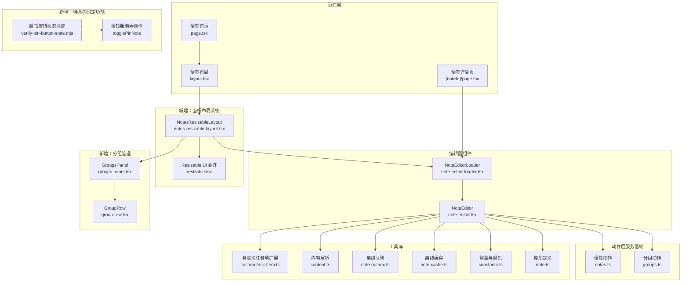

**图表来源**
- [page.tsx](file://src/app/(app)/notes/page.tsx#L1-L32)
- [page.tsx](file://src/app/(app)/notes/[noteId]/page.tsx#L1-L56)
- [layout.tsx](file://src/app/(app)/notes/layout.tsx#L1-L91)
- [notes-resizable-layout.tsx:1-324](file://src/components/notes/notes-resizable-layout.tsx#L1-L324)
- [resizable.tsx:1-57](file://src/components/ui/resizable.tsx#L1-L57)
- [note-editor-loader.tsx:1-21](file://src/components/editor/note-editor-loader.tsx#L1-L21)
- [note-editor.tsx:1-627](file://src/components/editor/note-editor.tsx#L1-L627)
- [notes.ts:1-230](file://src/actions/notes.ts#L1-L230)
- [groups.ts:1-59](file://src/actions/groups.ts#L1-L59)
- [groups-panel.tsx:1-50](file://src/components/notes/groups-panel.tsx#L1-L50)
- [group-row.tsx:1-76](file://src/components/notes/group-row.tsx#L1-L76)
- [verify-pin-button-state.mjs:1-55](file://scripts/verify-pin-button-state.mjs#L1-L55)

## 核心组件
- **可调整大小的面板布局系统**：提供桌面端三面板布局（分组、便签列表、编辑器），支持拖拽调整大小、折叠/展开、状态持久化
- 富文本编辑器组件：负责编辑器初始化、扩展配置、命令与快捷键、粘贴图片、防抖保存、并发冲突处理、实时预览与远程刷新提示
- 便签动作层：提供创建、更新、移动分组、置顶、着色、软删除、恢复、永久删除等服务器端接口，并内置乐观并发控制
- **新增**：分组管理组件：提供分组创建、重命名、删除（将组内便签移至未分组）
- **新增**：增强的便签固定功能：提供视觉反馈、动画效果和更好的用户体验
- 内容解析与自定义扩展：从 Tiptap JSON 中提取标题与纯文本，自定义任务项扩展支持到期与提醒属性
- 离线队列与缓存：在网络异常时将保存请求入队，联网后顺序重放，并提供本地缓存机制
- 常量与类型：颜色枚举、便签与分组类型定义

**章节来源**
- [notes-resizable-layout.tsx:1-324](file://src/components/notes/notes-resizable-layout.tsx#L1-L324)
- [resizable.tsx:1-57](file://src/components/ui/resizable.tsx#L1-L57)
- [note-editor.tsx:1-627](file://src/components/editor/note-editor.tsx#L1-L627)
- [notes.ts:1-230](file://src/actions/notes.ts#L1-L230)
- [groups.ts:1-59](file://src/actions/groups.ts#L1-L59)
- [groups-panel.tsx:1-50](file://src/components/notes/groups-panel.tsx#L1-L50)
- [group-row.tsx:1-76](file://src/components/notes/group-row.tsx#L1-L76)
- [verify-pin-button-state.mjs:1-55](file://scripts/verify-pin-button-state.mjs#L1-L55)

## 架构总览
编辑器与动作层通过 Next.js Server Actions 协作，前端负责 UI 与交互，后端负责持久化与并发一致性；内容变更通过防抖与离线队列保障可靠性。**新增的面板布局系统**提供灵活的界面定制能力，支持桌面端的三面板布局和移动端的响应式设计。**新增的分组管理功能**实现了便签的分类组织和筛选。**新增的增强固定功能**通过状态验证确保了良好的可访问性和视觉一致性。

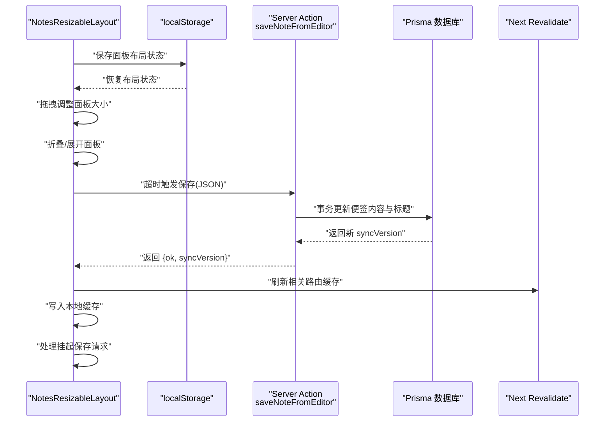

**图表来源**
- [notes-resizable-layout.tsx:114-130](file://src/components/notes/notes-resizable-layout.tsx#L114-L130)
- [notes-resizable-layout.tsx:132-147](file://src/components/notes/notes-resizable-layout.tsx#L132-L147)
- [note-editor.tsx:141-217](file://src/components/editor/note-editor.tsx#L141-L217)
- [notes.ts:140-152](file://src/actions/notes.ts#L140-L152)

## 详细组件分析

### 可调整大小的面板布局系统（NotesResizableLayout）
**新增功能**：完全替代之前的固定宽度桌面布局，提供灵活的用户界面定制能力

- **三面板布局设计**
  - 左侧面板：分组管理（15%，最小12%，最大25%）
  - 中间面板：便签列表（20%，最小15%，最大35%）
  - 右侧面板：编辑器（65%，最小40%）
- **拖拽调整大小**
  - 使用 ResizableHandle 提供可视化拖拽手柄
  - 支持像素值和百分比混合计算
  - 实时预览调整效果
- **折叠/展开功能**
  - 点击手柄按钮可折叠/展开面板
  - 折叠时显示折叠指示器
  - 支持局部折叠（仅分组或列表面板）
- **状态持久化**
  - 使用 localStorage 保存面板尺寸和折叠状态
  - 防抖保存（300ms延迟）避免频繁写入
  - 恢复时应用上次的布局配置
- **响应式设计**
  - 移动端：垂直堆叠布局，支持分组面板折叠
  - 桌面端：水平三面板布局，支持拖拽调整
  - 使用 CSS 媒体查询实现断点切换
- **无障碍支持**
  - 提供 aria-label 和 aria-expanded 属性
  - 支持键盘导航和屏幕阅读器
  - 焦点管理和可访问性标识

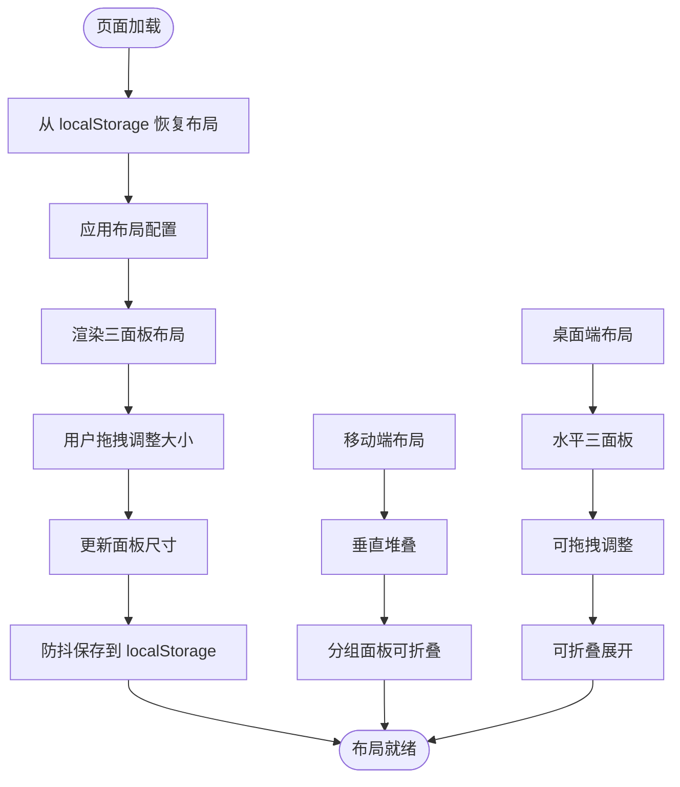

**图表来源**
- [notes-resizable-layout.tsx:86-112](file://src/components/notes/notes-resizable-layout.tsx#L86-L112)
- [notes-resizable-layout.tsx:114-130](file://src/components/notes/notes-resizable-layout.tsx#L114-L130)
- [notes-resizable-layout.tsx:132-147](file://src/components/notes/notes-resizable-layout.tsx#L132-L147)
- [notes-resizable-layout.tsx:149-187](file://src/components/notes/notes-resizable-layout.tsx#L149-L187)

**章节来源**
- [notes-resizable-layout.tsx:1-324](file://src/components/notes/notes-resizable-layout.tsx#L1-L324)
- [resizable.tsx:1-57](file://src/components/ui/resizable.tsx#L1-L57)

### 富文本编辑器组件（NoteEditor）
- 编辑器初始化与扩展配置
  - 使用 StarterKit 并配置标题层级、列表保持样式与属性
  - 自定义任务项扩展启用嵌套任务列表
  - 启用唯一 ID 扩展，为任务项生成 data-id 属性
  - 链接与图片扩展开启自动链接、默认协议与禁用 base64
  - 占位符与排版扩展提升输入体验
- 命令与交互
  - 支持加粗、斜体、删除线、标题、列表、任务列表切换
  - 链接弹窗设置/移除链接
  - 图片插入：文件选择与剪贴板图片识别并插入
  - 撤销/重做、置顶、颜色选择、分组选择、删除（软删除）
- **新的序列化保存机制**
  - **序列化保存**：确保同一时间只有一个保存请求在进行，避免并发冲突
  - **挂起保存**：如果在保存过程中又有新的编辑，会将新内容保存到 pendingJsonRef 中
  - **防抖优化**：防抖时间为650ms，平衡响应速度与保存频率
  - **失焦立即保存**：编辑器失焦时立即保存当前内容
- **增强的网络错误处理**
  - **网络错误检测**：改进的 isLikelyNetworkError 函数，准确识别网络相关错误
  - **离线保存**：网络错误时自动将内容加入离线队列，联网后自动重放
  - **用户提示**：提供清晰的网络状态提示和操作反馈
- **并发控制与冲突处理**
  - **乐观并发控制**：使用 expectedSyncVersion 实现乐观并发锁
  - **冲突检测**：当检测到并发冲突时，提示用户重新加载
  - **自回声抑制**：使用 ref 进行比较，避免自身保存导致的误判
- **实时预览与远程刷新**
  - 监听服务端 syncVersion，若本地有未保存更改则提示覆盖
  - 无本地更改时直接替换编辑器内容
- 锚点定位
  - 支持根据 UniqueID 的 data-id 定位到特定块并平滑滚动

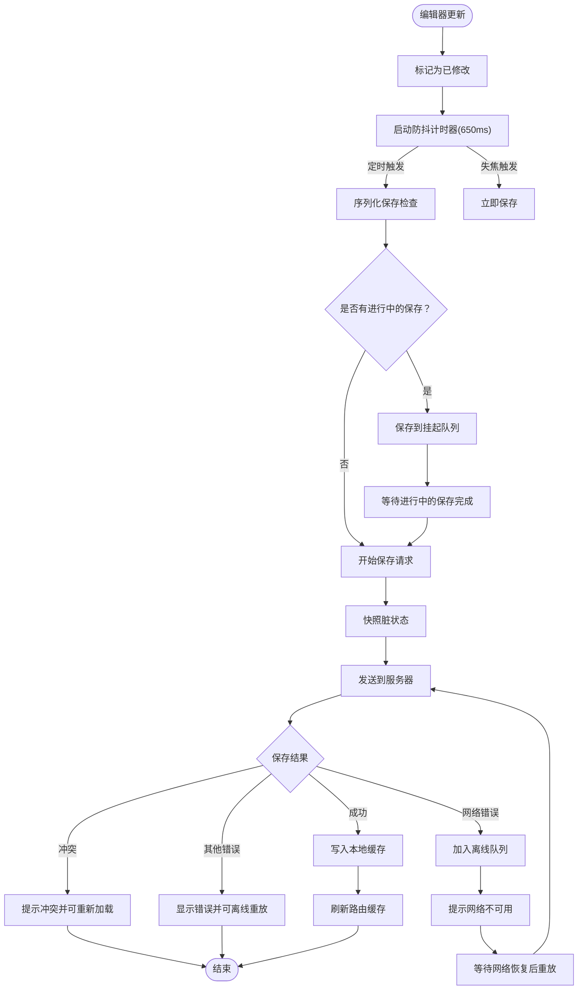

**图表来源**
- [note-editor.tsx:141-217](file://src/components/editor/note-editor.tsx#L141-L217)
- [note-editor.tsx:223-228](file://src/components/editor/note-editor.tsx#L223-L228)
- [note-editor.tsx:240-252](file://src/components/editor/note-editor.tsx#L240-L252)
- [note-outbox.ts:48-86](file://src/lib/offline/note-outbox.ts#L48-L86)

**章节来源**
- [note-editor.tsx:113-136](file://src/components/editor/note-editor.tsx#L113-L136)
- [note-editor.tsx:202-225](file://src/components/editor/note-editor.tsx#L202-L225)
- [note-editor.tsx:265-291](file://src/components/editor/note-editor.tsx#L265-L291)
- [note-editor.tsx:332-374](file://src/components/editor/note-editor.tsx#L332-L374)
- [note-editor.tsx:380-627](file://src/components/editor/note-editor.tsx#L380-L627)

### 便签固定功能增强（Toggle Pin）
**新增功能**：便签编辑器固定功能的增强改进，包括视觉反馈、动画效果和用户体验优化

- **置顶按钮状态管理**
  - 使用 useState 管理置顶状态，初始值来自 props
  - 切换时先更新本地状态，再异步调用服务器动作
  - 成功后触发路由刷新，确保 UI 同步
- **增强的视觉反馈**
  - **图标旋转动画**：置顶状态下图标向左旋转45度，提供明确的视觉区分
  - **悬停提示**：使用 group-hover 和 group-focus-visible 类实现统一的悬停和焦点提示
  - **工具栏激活样式**：置顶时使用 bg-muted 和 text-foreground，避免使用主色调
- **可访问性优化**
  - **动态 aria-label**：根据置顶状态动态显示"取消置顶"或"置顶"
  - **键盘导航**：支持 tab 键导航和键盘操作
  - **屏幕阅读器支持**：提供清晰的状态描述
- **状态验证**
  - **验证脚本**：通过 verify-pin-button-state.mjs 确保状态一致性
  - **测试覆盖**：包括可访问标签、提示样式、激活状态和图标差异
- **服务器交互**
  - **原子性操作**：使用 togglePinNote 服务器动作执行置顶切换
  - **缓存刷新**：成功后刷新 /notes 路由缓存
  - **错误处理**：网络错误时保持本地状态，等待重试

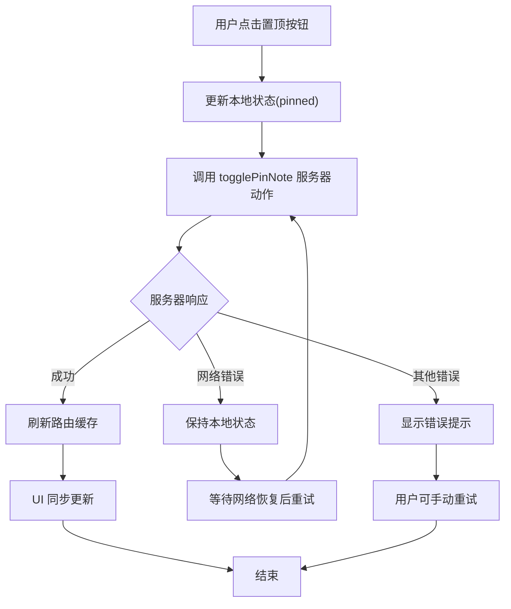

**图表来源**
- [note-editor.tsx:372-379](file://src/components/editor/note-editor.tsx#L372-L379)
- [notes.ts:199-207](file://src/actions/notes.ts#L199-L207)
- [verify-pin-button-state.mjs:8-42](file://scripts/verify-pin-button-state.mjs#L8-L42)

**章节来源**
- [note-editor.tsx:372-379](file://src/components/editor/note-editor.tsx#L372-L379)
- [note-editor.tsx:561-569](file://src/components/editor/note-editor.tsx#L561-L569)
- [notes.ts:199-207](file://src/actions/notes.ts#L199-L207)
- [verify-pin-button-state.mjs:1-55](file://scripts/verify-pin-button-state.mjs#L1-L55)

### 便签 CRUD 与回收站
- 创建
  - 新建空白便签或在指定分组内创建
- 读取
  - 便签详情页按 noteId 查询并返回初始内容、置顶状态、颜色、分组与 syncVersion
- 更新
  - 保存时确保任务项块 ID、派生标题与纯文本，支持乐观并发版本锁
- 删除与回收站
  - 软删除：标记 isDeleted 并记录删除时间
  - 恢复：取消删除标记
  - 永久删除：清理已删除便签
- 并发控制
  - 通过 expectedSyncVersion 与数据库行级版本锁避免覆盖

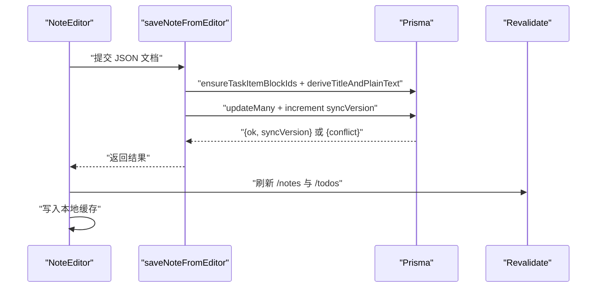

**图表来源**
- [notes.ts:140-152](file://src/actions/notes.ts#L140-L152)
- [notes.ts:59-138](file://src/actions/notes.ts#L59-L138)
- [content.ts:1-53](file://src/lib/tiptap/content.ts#L1-L53)
- [custom-task-item.ts:1-31](file://src/lib/tiptap/custom-task-item.ts#L1-L31)

**章节来源**
- [notes.ts:22-57](file://src/actions/notes.ts#L22-L57)
- [notes.ts:140-152](file://src/actions/notes.ts#L140-L152)
- [notes.ts:175-185](file://src/actions/notes.ts#L175-L185)
- [notes.ts:187-197](file://src/actions/notes.ts#L187-L197)
- [notes.ts:220-229](file://src/actions/notes.ts#L220-L229)

### 分组管理系统
**新增功能**：完整的分组管理功能，实现便签的分类组织

- **分组创建**
  - 去除前后空格并校验非空
  - 通过表单提交 createGroupFromForm 动作
  - 创建后自动刷新 /notes 路由缓存
- **分组重命名**
  - 校验非空并检查是否存在
  - 通过 renameGroup 动作更新分组名称
- **分组删除**
  - 将该分组下所有便签移至"未分组"，再删除分组
  - 使用事务确保数据一致性
  - 删除后自动刷新 /notes 路由缓存
- **分组面板**
  - 表单创建分组，列表展示分组并支持删除确认
  - 支持"全部便签"链接，清除 groupId 参数
  - 激活状态高亮显示
- **分组行组件**
  - 支持分组链接跳转，设置 groupId 参数
  - 删除确认对话框，防止误操作
  - 使用 useTransition 优化删除操作的用户体验

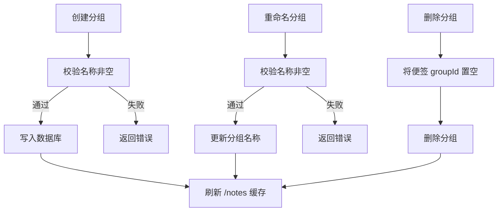

**图表来源**
- [groups.ts:7-21](file://src/actions/groups.ts#L7-L21)
- [groups.ts:23-38](file://src/actions/groups.ts#L23-L38)
- [groups.ts:40-53](file://src/actions/groups.ts#L40-L53)

**章节来源**
- [groups.ts:1-59](file://src/actions/groups.ts#L1-L59)
- [group-row.tsx:1-76](file://src/components/notes/group-row.tsx#L1-L76)
- [groups-panel.tsx:1-50](file://src/components/notes/groups-panel.tsx#L1-L50)

### 颜色标记系统
- 颜色枚举与选择器
  - 提供多种预设颜色，编辑器顶部下拉选择
  - 选择后调用服务器端设置颜色动作并刷新
- 视觉反馈
  - 保存状态在工具栏显示"保存中/已保存/失败"

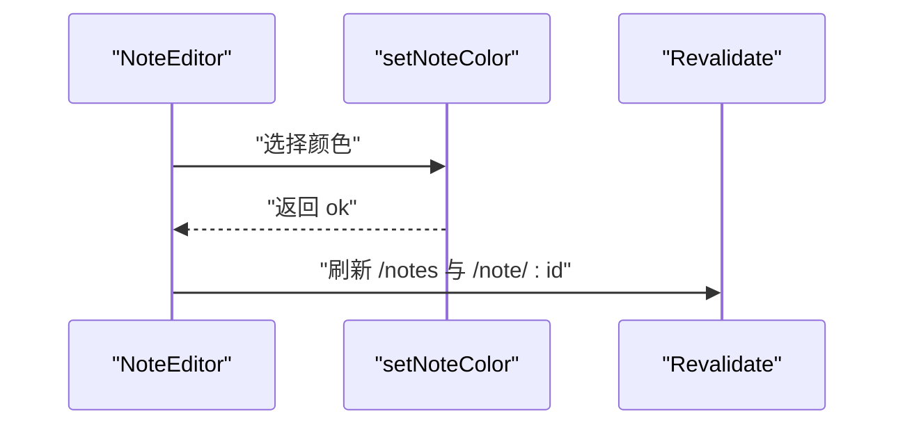

**图表来源**
- [constants.ts:4-11](file://src/lib/constants.ts#L4-L11)
- [note-editor.tsx:348-354](file://src/components/editor/note-editor.tsx#L348-L354)
- [notes.ts:209-218](file://src/actions/notes.ts#L209-L218)

**章节来源**
- [constants.ts:1-16](file://src/lib/constants.ts#L1-L16)
- [note-editor.tsx:529-542](file://src/components/editor/note-editor.tsx#L529-L542)
- [notes.ts:209-218](file://src/actions/notes.ts#L209-L218)

### 便签列表展示与交互
- **列表渲染**
  - 支持置顶图标、标题、摘要预览
  - 当前激活项高亮
  - 每个便签项包含 id、title、updatedAt、isPinned、groupId、preview 字段
- **交互**
  - 点击跳转至对应便签详情页
  - 支持分组筛选，通过 URL 参数 groupId 过滤
  - 滚动区域支持移动端触摸滚动
- **布局集成**
  - 与 NotesResizableLayout 集成，作为中间面板内容
  - 支持响应式设计，在移动端垂直堆叠
- **置顶排序**
  - 数据库层面按 isPinned 降序排序
  - 置顶便签始终显示在列表顶部

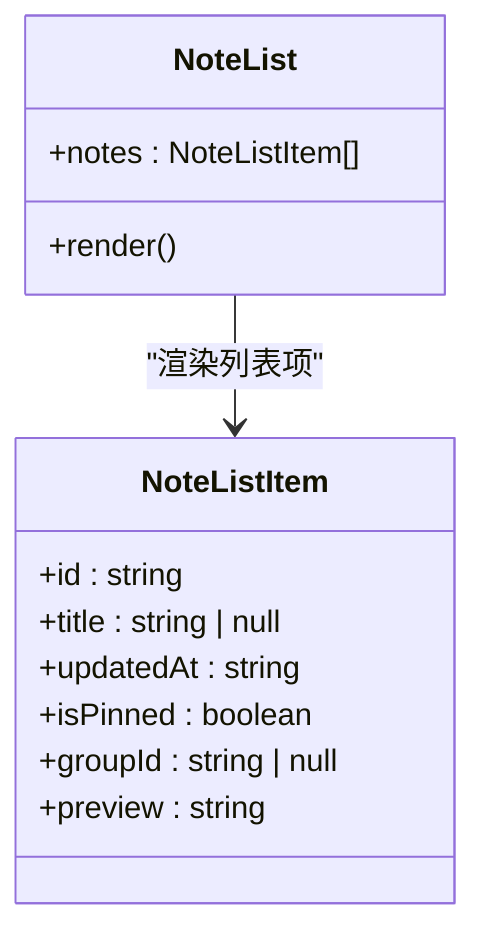

**图表来源**
- [note-list.tsx:1-68](file://src/components/notes/note-list.tsx#L1-L68)
- [note.ts:1-14](file://src/types/note.ts#L1-L14)
- [layout.tsx:25-36](file://src/app/(app)/notes/layout.tsx#L25-L36)

**章节来源**
- [note-list.tsx:1-68](file://src/components/notes/note-list.tsx#L1-L68)
- [note.ts:1-14](file://src/types/note.ts#L1-L14)
- [layout.tsx:25-36](file://src/app/(app)/notes/layout.tsx#L25-L36)

### 编辑器防抖保存与实时预览
- **新的序列化保存机制**
  - **串行化处理**：确保同一时间只有一个保存请求在进行，避免并发冲突
  - **挂起队列**：如果在保存过程中又有新的编辑，会将新内容保存到 pendingJsonRef 中
  - **智能重放**：保存完成后自动处理挂起的保存请求
- **增强的网络错误处理**
  - **网络错误检测**：改进的 isLikelyNetworkError 函数，准确识别网络相关错误
  - **离线保存**：网络错误时自动将保存请求加入离线队列
  - **自动重放**：联网后顺序重放离线队列中的保存请求
- **实时预览与远程刷新**
  - 若服务器版本较新且本地未保存更改，则直接替换内容
  - 若本地有更改则提示"已在其他端更新"，允许用户选择覆盖

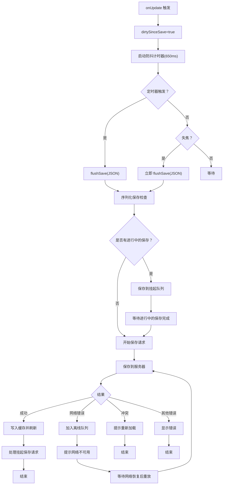

**图表来源**
- [note-editor.tsx:141-217](file://src/components/editor/note-editor.tsx#L141-L217)
- [note-editor.tsx:223-228](file://src/components/editor/note-editor.tsx#L223-L228)
- [note-editor.tsx:240-252](file://src/components/editor/note-editor.tsx#L240-L252)
- [note-outbox.ts:48-86](file://src/lib/offline/note-outbox.ts#L48-L86)

**章节来源**
- [note-editor.tsx:46-59](file://src/components/editor/note-editor.tsx#L46-L59)
- [note-editor.tsx:195-225](file://src/components/editor/note-editor.tsx#L195-L225)
- [note-editor.tsx:236-263](file://src/components/editor/note-editor.tsx#L236-L263)
- [note-outbox.ts:1-87](file://src/lib/offline/note-outbox.ts#L1-L87)

### 自定义扩展开发指南
- **自定义任务项扩展**
  - 在默认 TaskItem 基础上新增 dueAt 与 remindAt 属性，用于到期与提醒
  - HTML 解析与渲染：通过 data-* 属性持久化与回显
- **开发步骤建议**
  - 继承 @tiptap/extension-task-item
  - 在 addAttributes 中声明新属性及解析/渲染规则
  - 在编辑器扩展数组中注册该扩展
  - 在 UI 中提供到期与提醒的输入控件并与扩展属性绑定

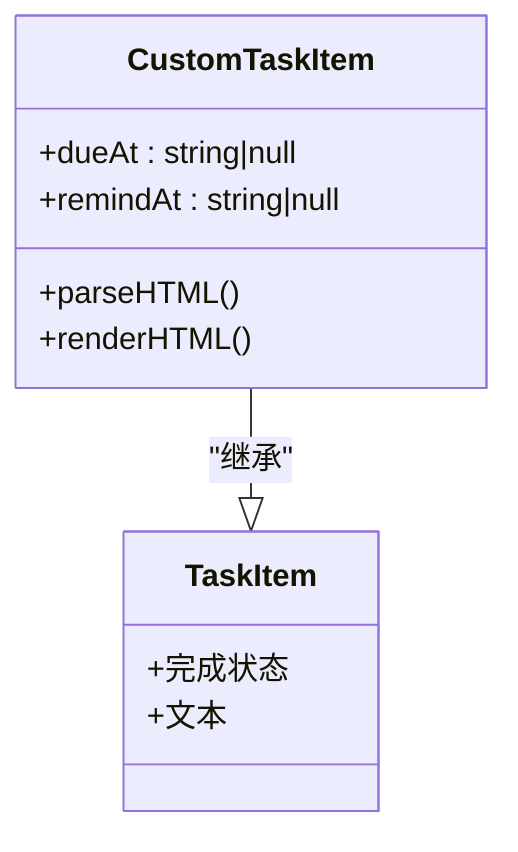

**图表来源**
- [custom-task-item.ts:1-31](file://src/lib/tiptap/custom-task-item.ts#L1-L31)

**章节来源**
- [custom-task-item.ts:1-31](file://src/lib/tiptap/custom-task-item.ts#L1-L31)

## 依赖关系分析
- **组件耦合**
  - NoteEditor 依赖 Server Actions、常量、离线队列与 UI 组件
  - **新增**：NotesResizableLayout 作为布局容器，协调三个子面板
  - **新增**：GroupsPanel 与 GroupRow 组件协同实现分组管理
  - **新增**：verify-pin-button-state.mjs 确保置顶功能状态一致性
  - 页面层仅负责数据拉取与路由跳转，低耦合
- **外部依赖**
  - Tiptap 生态（StarterKit、TaskList、UniqueID、Image、Link、Placeholder、Typography）
  - **新增**：react-resizable-panels v4 提供面板拖拽和调整功能
  - **新增**：Lucide React 图标库提供界面图标
  - Next.js Server Actions 与 revalidatePath
  - Prisma ORM 与数据库事务
- **潜在循环依赖**
  - 未发现直接循环依赖；组件职责清晰

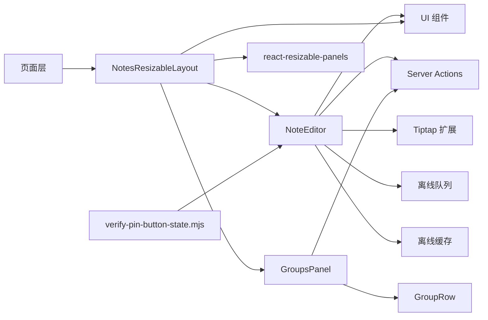

**图表来源**
- [note-editor.tsx:1-627](file://src/components/editor/note-editor.tsx#L1-L627)
- [notes.ts:1-230](file://src/actions/notes.ts#L1-L230)
- [note-outbox.ts:1-87](file://src/lib/offline/note-outbox.ts#L1-L87)
- [note-cache.ts:1-25](file://src/lib/offline/note-cache.ts#L1-L25)
- [notes-resizable-layout.tsx:1-324](file://src/components/notes/notes-resizable-layout.tsx#L1-L324)
- [resizable.tsx:1-57](file://src/components/ui/resizable.tsx#L1-L57)
- [groups-panel.tsx:1-50](file://src/components/notes/groups-panel.tsx#L1-L50)
- [group-row.tsx:1-76](file://src/components/notes/group-row.tsx#L1-L76)
- [verify-pin-button-state.mjs:1-55](file://scripts/verify-pin-button-state.mjs#L1-L55)

**章节来源**
- [note-editor.tsx:1-627](file://src/components/editor/note-editor.tsx#L1-L627)
- [notes.ts:1-230](file://src/actions/notes.ts#L1-L230)
- [note-outbox.ts:1-87](file://src/lib/offline/note-outbox.ts#L1-L87)
- [note-cache.ts:1-25](file://src/lib/offline/note-cache.ts#L1-L25)
- [notes-resizable-layout.tsx:1-324](file://src/components/notes/notes-resizable-layout.tsx#L1-L324)
- [resizable.tsx:1-57](file://src/components/ui/resizable.tsx#L1-L57)
- [groups-panel.tsx:1-50](file://src/components/notes/groups-panel.tsx#L1-L50)
- [group-row.tsx:1-76](file://src/components/notes/group-row.tsx#L1-L76)
- [verify-pin-button-state.mjs:1-55](file://scripts/verify-pin-button-state.mjs#L1-L55)

## 性能考虑
- **渲染与懒加载**
  - 编辑器动态导入，SSR 关闭，减少首屏负载
- **新的保存性能优化**
  - **序列化保存**：避免并发保存请求，减少数据库压力
  - **智能防抖**：650ms 防抖时间平衡响应速度与保存频率
  - **挂起队列**：避免重复保存相同内容
- **新增：面板布局性能优化**
  - **防抖保存**：300ms 防抖延迟避免频繁 localStorage 写入
  - **懒加载面板内容**：折叠时隐藏面板内容，减少内存占用
  - **CSS 媒体查询**：使用原生媒体查询实现响应式切换
  - **requestAnimationFrame**：在布局应用后延迟折叠操作
- **新增：分组管理性能优化**
  - **批量操作**：删除分组时使用事务一次性完成多个操作
  - **缓存刷新**：使用 revalidatePath 精确刷新相关路由缓存
  - **条件渲染**：活跃分组高亮显示，减少不必要的 DOM 操作
- **新增：置顶功能性能优化**
  - **状态验证**：通过 verify-pin-button-state.mjs 预防状态不一致
  - **动画优化**：使用 CSS transition 实现流畅的图标旋转动画
  - **内存管理**：及时清理事件监听器和定时器
- **并发与缓存**
  - 乐观并发版本锁避免覆盖
  - 本地缓存写入忽略异常，不影响主流程
- **离线恢复优化**
  - 离线队列顺序重放，失败项保留在队列中
  - 网络恢复后自动重放离线保存请求

**章节来源**
- [note-editor-loader.tsx:1-21](file://src/components/editor/note-editor-loader.tsx#L1-L21)
- [note-editor.tsx:46-59](file://src/components/editor/note-editor.tsx#L46-L59)
- [note-editor.tsx:175-184](file://src/components/editor/note-editor.tsx#L175-L184)
- [notes-resizable-layout.tsx:114-130](file://src/components/notes/notes-resizable-layout.tsx#L114-L130)
- [notes-resizable-layout.tsx:132-147](file://src/components/notes/notes-resizable-layout.tsx#L132-L147)
- [groups.ts:40-53](file://src/actions/groups.ts#L40-L53)
- [note-outbox.ts:48-86](file://src/lib/offline/note-outbox.ts#L48-L86)
- [verify-pin-button-state.mjs:1-55](file://scripts/verify-pin-button-state.mjs#L1-L55)

## 故障排查指南
- **保存失败**
  - **网络错误**：内容进入离线队列，联网后自动重放
  - **服务器错误**：显示错误提示，可在网络恢复后重试
  - **并发冲突**：出现"保存冲突：便签已在其他端更新"提示
- **序列化保存问题**
  - **挂起保存**：如果保存过程中有新的编辑，会自动排队等待
  - **保存阻塞**：如果前一个保存请求正在进行，新的保存会被挂起
- **面板布局问题**
  - **布局不生效**：检查 localStorage 是否可用，清除浏览器存储重试
  - **面板无法拖拽**：确认 react-resizable-panels 版本兼容性
  - **折叠状态异常**：检查面板引用是否正确初始化
- **分组管理问题**
  - **创建失败**：检查分组名称长度限制（64字符）和必填验证
  - **删除确认**：确认删除对话框的确认逻辑正常工作
  - **分组筛选**：检查 URL 参数 groupId 的传递和解析
- **置顶功能问题**
  - **状态不一致**：运行 verify-pin-button-state.mjs 验证状态
  - **图标不旋转**：检查 CSS transition 和 -rotate-45 类
  - **提示不显示**：确认 group-hover 和 group-focus-visible 类
  - **可访问性问题**：验证 aria-label 动态更新
- **删除与恢复**
  - 软删除后可在回收站查看，支持恢复或永久删除
- **图片插入**
  - 剪贴板或文件选择需为图片类型，否则忽略

**章节来源**
- [note-editor.tsx:146-156](file://src/components/editor/note-editor.tsx#L146-L156)
- [note-editor.tsx:157-166](file://src/components/editor/note-editor.tsx#L157-L166)
- [notes.ts:175-185](file://src/actions/notes.ts#L175-L185)
- [notes.ts:187-197](file://src/actions/notes.ts#L187-L197)
- [notes-resizable-layout.tsx:26-58](file://src/components/notes/notes-resizable-layout.tsx#L26-L58)
- [notes-resizable-layout.tsx:149-187](file://src/components/notes/notes-resizable-layout.tsx#L149-L187)
- [groups-panel.tsx:25-30](file://src/components/notes/groups-panel.tsx#L25-L30)
- [group-row.tsx:26-32](file://src/components/notes/group-row.tsx#L26-L32)
- [verify-pin-button-state.mjs:1-55](file://scripts/verify-pin-button-state.mjs#L1-L55)

## 结论
本系统以 Tiptap 为核心构建富文本编辑器，结合 Server Actions 实现可靠的 CRUD 与并发控制，辅以分组管理、颜色标记、离线队列与实时预览，形成完整的便签管理闭环。**新增的可调整大小面板布局系统**显著提升了桌面端用户体验，提供灵活的界面定制能力，支持拖拽调整、折叠展开和状态持久化。**新增的分组管理功能**实现了便签的分类组织，支持创建、编辑、删除和分组筛选。**新增的增强固定功能**通过状态验证和视觉优化，提供了更好的用户体验和可访问性。通过**新的序列化保存机制**、**增强的网络错误处理**、**智能防抖优化**、**响应式设计**和**状态验证机制**，系统在稳定性、灵活性、用户体验和可访问性方面都有显著提升。建议在后续迭代中进一步完善搜索与排序、导出与导入、主题与无障碍等能力。

## 附录
- **快速入口**
  - 新建便签：便签首页无便签时提供按钮直达
  - 便签详情：按 ID 路由访问，支持锚点定位
  - **新增**：拖拽调整面板大小，折叠/展开面板
  - **新增**：分组创建、编辑、删除操作
  - **新增**：置顶按钮的视觉反馈和动画效果
- **类型与常量**
  - 便签与分组类型定义
  - 颜色枚举与保留天数常量
- **新增：面板布局配置**
  - 默认比例：分组(15%) - 列表(20%) - 编辑器(65%)
  - 最小/最大限制：确保界面可用性
  - 状态持久化：自动保存用户偏好设置
- **新增：分组管理配置**
  - 分组名称长度限制：64字符
  - 分组筛选参数：groupId URL参数
  - 分组删除保护：软删除机制，避免数据丢失
- **新增：置顶功能配置**
  - 状态验证：verify-pin-button-state.mjs 确保状态一致性
  - 视觉反馈：图标旋转45度，工具栏激活样式
  - 可访问性：动态 aria-label，统一提示样式
  - 动画效果：CSS transition 实现流畅旋转

**章节来源**
- [page.tsx](file://src/app/(app)/notes/page.tsx#L1-L32)
- [page.tsx](file://src/app/(app)/notes/[noteId]/page.tsx#L1-L56)
- [layout.tsx](file://src/app/(app)/notes/layout.tsx#L1-L91)
- [note.ts:1-14](file://src/types/note.ts#L1-L14)
- [constants.ts:1-16](file://src/lib/constants.ts#L1-L16)
- [notes-resizable-layout.tsx:16-24](file://src/components/notes/notes-resizable-layout.tsx#L16-L24)
- [groups-panel.tsx:25-30](file://src/components/notes/groups-panel.tsx#L25-L30)
- [note-editor.tsx:561-569](file://src/components/editor/note-editor.tsx#L561-L569)
- [verify-pin-button-state.mjs:1-55](file://scripts/verify-pin-button-state.mjs#L1-L55)
- [README.md:1-216](file://README.md#L1-L216)