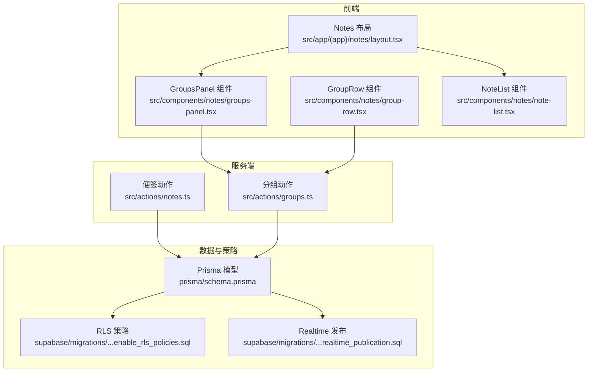
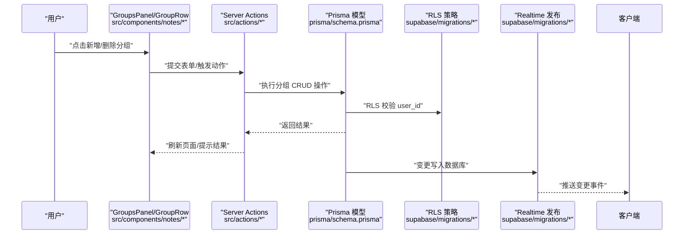
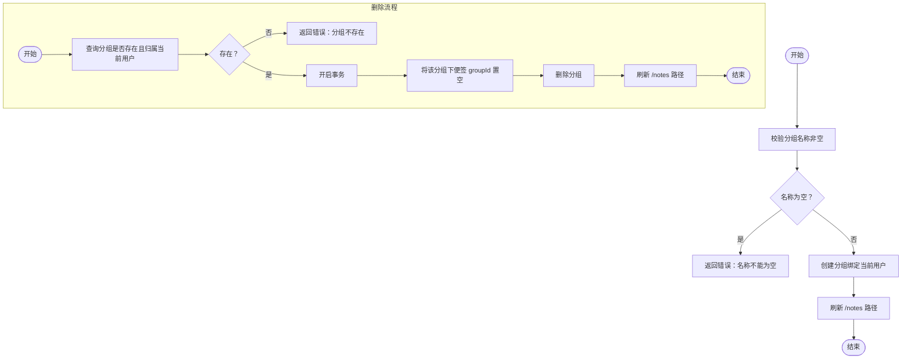
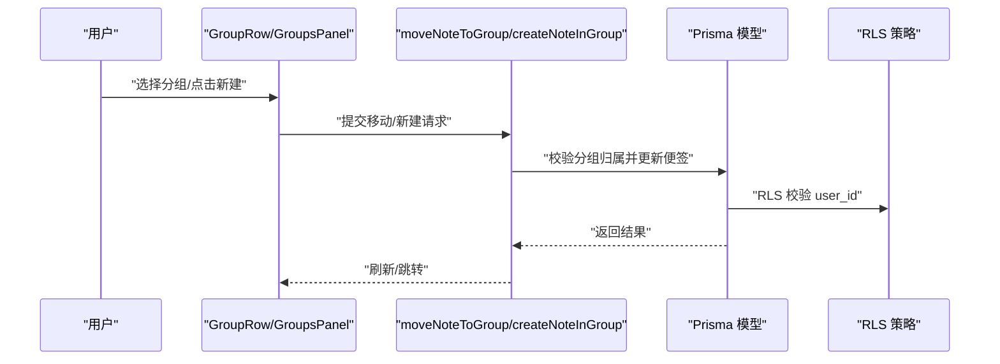
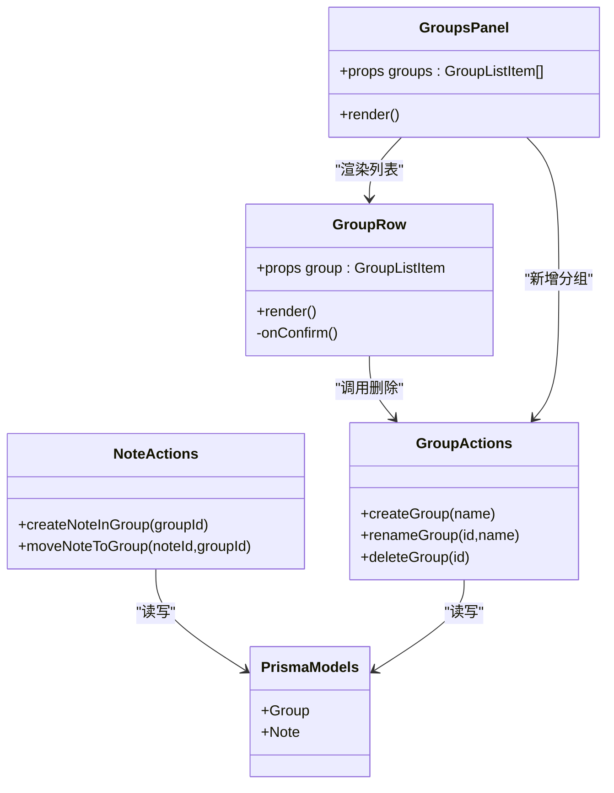
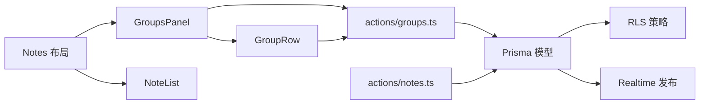
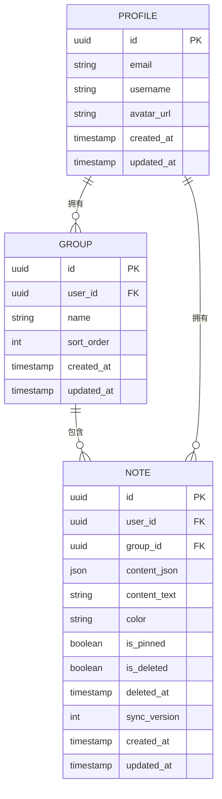

# 分组管理系统

<cite>
**本文引用的文件**
- [src/actions/groups.ts](file://src/actions/groups.ts)
- [src/components/notes/groups-panel.tsx](file://src/components/notes/groups-panel.tsx)
- [src/components/notes/group-row.tsx](file://src/components/notes/group-row.tsx)
- [src/app/(app)/notes/layout.tsx](file://src/app/(app)/notes/layout.tsx)
- [src/app/(app)/notes/page.tsx](file://src/app/(app)/notes/page.tsx)
- [src/actions/notes.ts](file://src/actions/notes.ts)
- [src/types/note.ts](file://src/types/note.ts)
- [prisma/schema.prisma](file://prisma/schema.prisma)
- [src/lib/constants.ts](file://src/lib/constants.ts)
- [supabase/migrations/20260513000000_enable_rls_policies.sql](file://supabase/migrations/20260513000000_enable_rls_policies.sql)
- [supabase/migrations/20260513140000_realtime_publication.sql](file://supabase/migrations/20260513140000_realtime_publication.sql)
- [需求文档.md](file://需求文档.md)
</cite>

## 目录
1. [简介](#简介)
2. [项目结构](#项目结构)
3. [核心组件](#核心组件)
4. [架构总览](#架构总览)
5. [详细组件分析](#详细组件分析)
6. [依赖关系分析](#依赖关系分析)
7. [性能考量](#性能考量)
8. [故障排查指南](#故障排查指南)
9. [结论](#结论)
10. [附录](#附录)

## 简介
本文件系统性梳理 Smart-Todo 的分组管理系统，覆盖分组的创建与管理流程、分组与便签的关联机制、分组面板的用户界面设计、搜索与过滤能力、统计信息展示、权限控制与访问限制、最佳实践与用户体验优化，并提供可直接定位到源码的路径指引，帮助开发者与产品人员高效理解与演进该系统。

## 项目结构
分组管理涉及前端组件、服务端动作、数据库模型与权限策略四大部分协同工作：
- 前端组件负责渲染分组面板与分组项，提供新增、删除等交互；
- 服务端动作封装了分组的增删改查与与便签的关联变更；
- 数据库模型定义了分组与便签的关系及索引；
- 权限策略确保数据隔离与访问控制。

图表来源
- [src/components/notes/groups-panel.tsx:1-24](file://src/components/notes/groups-panel.tsx#L1-L24)
- [src/components/notes/group-row.tsx:1-52](file://src/components/notes/group-row.tsx#L1-L52)
- [src/app/(app)/notes/layout.tsx:12-67](file://src/app/(app)/notes/layout.tsx#L12-L67)
- [src/actions/groups.ts:1-58](file://src/actions/groups.ts#L1-L58)
- [src/actions/notes.ts:1-230](file://src/actions/notes.ts#L1-L230)
- [prisma/schema.prisma:32-75](file://prisma/schema.prisma#L32-L75)
- [supabase/migrations/20260513000000_enable_rls_policies.sql:63-80](file://supabase/migrations/20260513000000_enable_rls_policies.sql#L63-L80)
- [supabase/migrations/20260513140000_realtime_publication.sql:4-6](file://supabase/migrations/20260513140000_realtime_publication.sql#L4-L6)

章节来源
- [src/app/(app)/notes/layout.tsx:12-67](file://src/app/(app)/notes/layout.tsx#L12-L67)
- [src/components/notes/groups-panel.tsx:1-24](file://src/components/notes/groups-panel.tsx#L1-L24)
- [src/components/notes/group-row.tsx:1-52](file://src/components/notes/group-row.tsx#L1-L52)
- [src/actions/groups.ts:1-58](file://src/actions/groups.ts#L1-L58)
- [src/actions/notes.ts:1-230](file://src/actions/notes.ts#L1-L230)
- [prisma/schema.prisma:32-75](file://prisma/schema.prisma#L32-L75)
- [supabase/migrations/20260513000000_enable_rls_policies.sql:63-80](file://supabase/migrations/20260513000000_enable_rls_policies.sql#L63-L80)
- [supabase/migrations/20260513140000_realtime_publication.sql:4-6](file://supabase/migrations/20260513140000_realtime_publication.sql#L4-L6)

## 核心组件
- 分组动作模块：封装创建、重命名、删除分组的业务逻辑与权限校验，返回标准化错误或成功响应。
- 分组面板组件：渲染“分组”标题、输入框与分组列表，支持新增分组与查看分组列表。
- 分组行组件：渲染单个分组项，提供删除入口与二次确认对话框。
- 便签动作模块：提供将便签移动到指定分组的能力，以及创建便签的辅助方法。
- 数据模型与权限：分组与便签通过外键关联，RLS 策略保障按用户隔离，实时发布支持订阅更新。

章节来源
- [src/actions/groups.ts:1-58](file://src/actions/groups.ts#L1-L58)
- [src/components/notes/groups-panel.tsx:1-24](file://src/components/notes/groups-panel.tsx#L1-L24)
- [src/components/notes/group-row.tsx:1-52](file://src/components/notes/group-row.tsx#L1-L52)
- [src/actions/notes.ts:38-57](file://src/actions/notes.ts#L38-L57)
- [prisma/schema.prisma:32-75](file://prisma/schema.prisma#L32-L75)
- [supabase/migrations/20260513000000_enable_rls_policies.sql:63-80](file://supabase/migrations/20260513000000_enable_rls_policies.sql#L63-L80)

## 架构总览
下图展示了从用户操作到数据库更新的端到端流程，以及与权限策略和实时订阅的协作关系。

图表来源
- [src/components/notes/groups-panel.tsx:1-24](file://src/components/notes/groups-panel.tsx#L1-L24)
- [src/components/notes/group-row.tsx:1-52](file://src/components/notes/group-row.tsx#L1-L52)
- [src/actions/groups.ts:1-58](file://src/actions/groups.ts#L1-L58)
- [prisma/schema.prisma:32-75](file://prisma/schema.prisma#L32-L75)
- [supabase/migrations/20260513000000_enable_rls_policies.sql:63-80](file://supabase/migrations/20260513000000_enable_rls_policies.sql#L63-L80)
- [supabase/migrations/20260513140000_realtime_publication.sql:4-6](file://supabase/migrations/20260513140000_realtime_publication.sql#L4-L6)

## 详细组件分析

### 分组创建与管理流程
- 输入验证：服务端动作对分组名称进行去空白处理，若为空则返回错误。
- 创建：为当前用户创建分组，随后触发路径重建以刷新布局。
- 重命名：校验分组存在性与归属，更新名称后刷新。
- 删除：事务中先将该分组下的便签 groupId 置空（转入“未分组”），再删除分组，最后刷新。

图表来源
- [src/actions/groups.ts:7-21](file://src/actions/groups.ts#L7-L21)
- [src/actions/groups.ts:23-38](file://src/actions/groups.ts#L23-L38)
- [src/actions/groups.ts:40-53](file://src/actions/groups.ts#L40-L53)

章节来源
- [src/actions/groups.ts:1-58](file://src/actions/groups.ts#L1-L58)

### 分组与便签的关联机制
- 移动便签到分组：当目标 groupId 存在时，先校验其归属，再更新便签的 groupId；置空表示移入“未分组”。
- 创建便签于分组：先校验分组归属，再创建便签并跳转至新便签页。
- 便签颜色：便签支持颜色标记，颜色常量定义在应用常量中，便于统一配色与主题一致性。

图表来源
- [src/actions/notes.ts:154-173](file://src/actions/notes.ts#L154-L173)
- [src/actions/notes.ts:38-57](file://src/actions/notes.ts#L38-L57)
- [prisma/schema.prisma:48-75](file://prisma/schema.prisma#L48-L75)
- [supabase/migrations/20260513000000_enable_rls_policies.sql:63-80](file://supabase/migrations/20260513000000_enable_rls_policies.sql#L63-L80)

章节来源
- [src/actions/notes.ts:154-173](file://src/actions/notes.ts#L154-L173)
- [src/actions/notes.ts:38-57](file://src/actions/notes.ts#L38-L57)
- [src/lib/constants.ts:4-11](file://src/lib/constants.ts#L4-L11)

### 分组面板的用户界面设计
- 分组列表展示：布局组件并行拉取分组与便签列表，按 sort_order 升序排列，便签列表按置顶与更新时间排序。
- 新增分组：表单提交至服务端动作，限制最大长度，提交后刷新。
- 删除分组：行组件弹出确认对话框，确认后触发删除动作并刷新页面。
- 交互反馈：删除按钮禁用状态随过渡状态变化，确认对话框提供明确文案与风险提示。

图表来源
- [src/components/notes/groups-panel.tsx:1-24](file://src/components/notes/groups-panel.tsx#L1-L24)
- [src/components/notes/group-row.tsx:1-52](file://src/components/notes/group-row.tsx#L1-L52)
- [src/actions/groups.ts:1-58](file://src/actions/groups.ts#L1-L58)
- [src/actions/notes.ts:38-57](file://src/actions/notes.ts#L38-L57)
- [prisma/schema.prisma:32-75](file://prisma/schema.prisma#L32-L75)

章节来源
- [src/app/(app)/notes/layout.tsx:12-67](file://src/app/(app)/notes/layout.tsx#L12-L67)
- [src/components/notes/groups-panel.tsx:1-24](file://src/components/notes/groups-panel.tsx#L1-L24)
- [src/components/notes/group-row.tsx:1-52](file://src/components/notes/group-row.tsx#L1-L52)

### 搜索与过滤功能
- 全局搜索：按标题与正文纯文本进行搜索，支持在当前分组或全部范围内检索。
- 搜索范围：分组视图支持在“全部便签”、“未分组”、“回收站”等默认分组间切换。
- 高级筛选：支持按颜色、是否含待办、是否过期等条件筛选（迭代特性）。
- 搜索高亮与历史：命中关键词高亮显示，保留最近搜索词（迭代特性）。

章节来源
- [需求文档.md:128-134](file://需求文档.md#L128-L134)
- [需求文档.md:116-126](file://需求文档.md#L116-L126)

### 统计信息显示
- 分组统计：分组面板应显示每个分组的便签数量，便于用户直观了解各分组负载。
- 活跃度指标：可结合便签更新时间、置顶状态等维度评估活跃度（建议在后续版本实现）。

章节来源
- [需求文档.md:125](file://需求文档.md#L125)

### 权限控制与访问限制
- RLS 策略：分组与便签均启用行级安全策略，仅允许用户访问自身数据。
- 实时订阅：将业务表加入 realtime publication，支持客户端订阅变更事件，提升多端同步体验。

章节来源
- [supabase/migrations/20260513000000_enable_rls_policies.sql:63-80](file://supabase/migrations/20260513000000_enable_rls_policies.sql#L63-L80)
- [supabase/migrations/20260513140000_realtime_publication.sql:4-6](file://supabase/migrations/20260513140000_realtime_publication.sql#L4-L6)

### 最佳实践与用户体验优化
- 输入约束：新增/重命名分组时进行非空校验与长度限制，避免无效数据。
- 删除保护：删除分组前弹出确认对话框，明确告知“便签将移入未分组”，降低误操作风险。
- 刷新策略：服务端动作完成后刷新相关路由，确保 UI 与数据一致。
- 默认分组：保留“全部便签”“未分组”“回收站”等默认分组，简化用户心智模型。
- 层级结构：当前不支持二级分组，避免过度复杂化；如需扩展，建议采用扁平+标签组合的方式。

章节来源
- [src/actions/groups.ts:7-21](file://src/actions/groups.ts#L7-L21)
- [src/components/notes/group-row.tsx:40-49](file://src/components/notes/group-row.tsx#L40-L49)
- [需求文档.md:116-126](file://需求文档.md#L116-L126)

## 依赖关系分析
- 组件依赖：GroupsPanel 依赖 GroupRow 与服务端动作；布局组件并行加载分组与便签数据。
- 动作依赖：分组动作与便签动作均依赖 Prisma 客户端与用户会话校验。
- 数据模型：分组与便签通过外键关联，分组包含 sort_order 字段，便于排序。
- 权限与实时：RLS 策略保证数据隔离；实时发布支持订阅更新。

图表来源
- [src/components/notes/groups-panel.tsx:1-24](file://src/components/notes/groups-panel.tsx#L1-L24)
- [src/components/notes/group-row.tsx:1-52](file://src/components/notes/group-row.tsx#L1-L52)
- [src/app/(app)/notes/layout.tsx:12-67](file://src/app/(app)/notes/layout.tsx#L12-L67)
- [src/actions/groups.ts:1-58](file://src/actions/groups.ts#L1-L58)
- [src/actions/notes.ts:1-230](file://src/actions/notes.ts#L1-L230)
- [prisma/schema.prisma:32-75](file://prisma/schema.prisma#L32-L75)
- [supabase/migrations/20260513000000_enable_rls_policies.sql:63-80](file://supabase/migrations/20260513000000_enable_rls_policies.sql#L63-L80)
- [supabase/migrations/20260513140000_realtime_publication.sql:4-6](file://supabase/migrations/20260513140000_realtime_publication.sql#L4-L6)

章节来源
- [src/app/(app)/notes/layout.tsx:12-67](file://src/app/(app)/notes/layout.tsx#L12-L67)
- [src/actions/groups.ts:1-58](file://src/actions/groups.ts#L1-L58)
- [src/actions/notes.ts:1-230](file://src/actions/notes.ts#L1-L230)
- [prisma/schema.prisma:32-75](file://prisma/schema.prisma#L32-L75)

## 性能考量
- 查询优化：分组列表按 sort_order 排序，便签列表按 isPinned 与 updatedAt 排序，减少前端排序成本。
- 并发控制：服务端动作使用事务保证删除分组时的数据一致性；便签内容保存采用乐观并发版本号控制。
- 缓存与刷新：动作完成后对相关路由进行 revalidate，平衡实时性与性能。

章节来源
- [src/app/(app)/notes/layout.tsx:18-29](file://src/app/(app)/notes/layout.tsx#L18-L29)
- [src/actions/notes.ts:59-138](file://src/actions/notes.ts#L59-L138)
- [src/actions/groups.ts:40-53](file://src/actions/groups.ts#L40-L53)

## 故障排查指南
- “分组名称不能为空”：检查前端表单是否正确传递 name 参数，服务端动作对空字符串与空白字符进行严格校验。
- “分组不存在”：确认当前用户是否拥有该分组，或分组是否已被删除；删除分组时会将便签移入“未分组”，请确认目标分组 ID 是否正确。
- “便签不存在”：移动便签时若便签已被删除或不属于当前用户，将返回该错误；请检查 noteId 与用户会话。
- “同步冲突”：便签内容保存时若检测到并发冲突，返回冲突信息；请根据服务器版本号重新合并。
- 权限问题：若无法看到或修改分组/便签，请检查 RLS 策略是否生效，以及当前会话是否正确绑定到用户。

章节来源
- [src/actions/groups.ts:10-12](file://src/actions/groups.ts#L10-L12)
- [src/actions/groups.ts:33-35](file://src/actions/groups.ts#L33-L35)
- [src/actions/notes.ts:168-170](file://src/actions/notes.ts#L168-L170)
- [src/actions/notes.ts:121-131](file://src/actions/notes.ts#L121-L131)
- [supabase/migrations/20260513000000_enable_rls_policies.sql:63-80](file://supabase/migrations/20260513000000_enable_rls_policies.sql#L63-L80)

## 结论
分组管理系统以简洁的 CRUD 能力为核心，配合严格的权限控制与实时订阅，实现了可靠的用户数据隔离与多端同步。通过默认分组、删除保护与输入约束等设计，兼顾易用性与稳定性。建议在后续版本中引入分组排序、高级筛选与统计指标，进一步提升组织效率与洞察力。

## 附录
- 数据模型关系图（分组与便签）

图表来源
- [prisma/schema.prisma:16-30](file://prisma/schema.prisma#L16-L30)
- [prisma/schema.prisma:32-46](file://prisma/schema.prisma#L32-L46)
- [prisma/schema.prisma:48-75](file://prisma/schema.prisma#L48-L75)