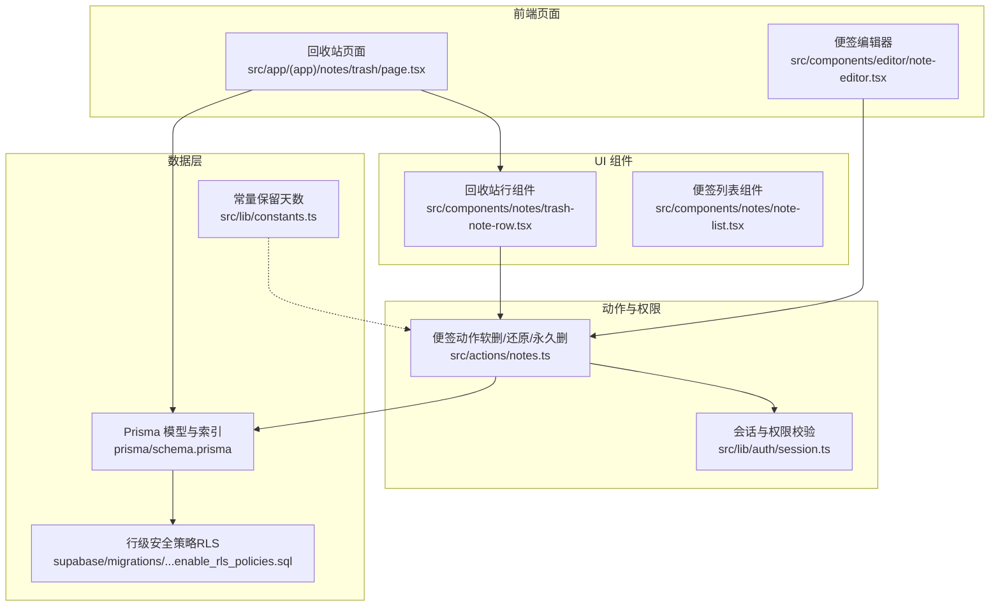
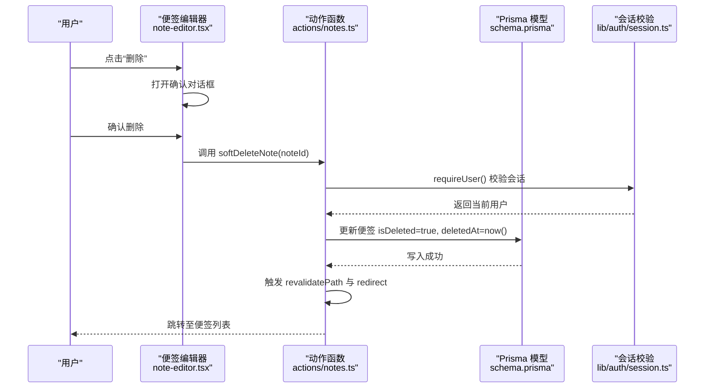
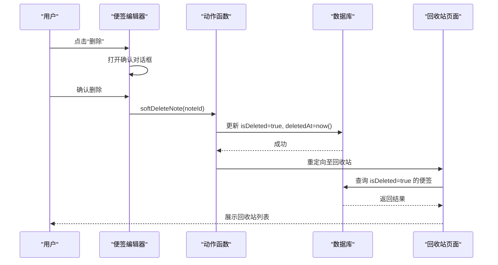
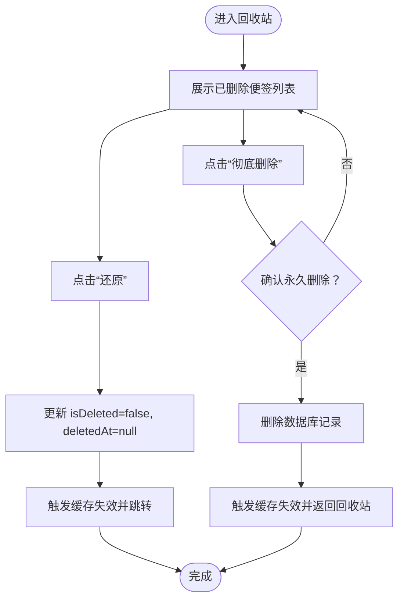
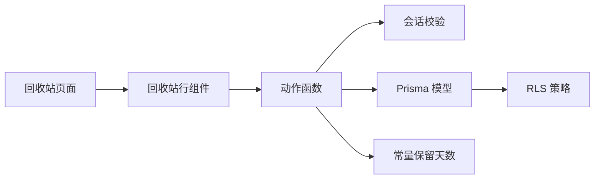
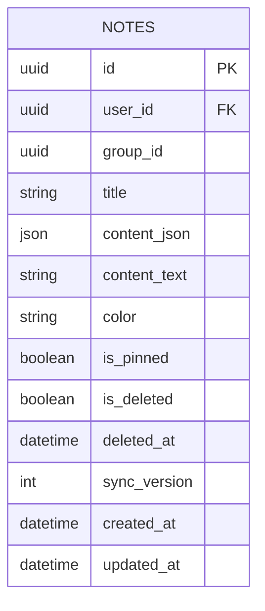

# 回收站系统

<cite>
**本文引用的文件**
- [src/app/(app)/notes/trash/page.tsx](file://src/app/(app)/notes/trash/page.tsx)
- [src/components/notes/trash-note-row.tsx](file://src/components/notes/trash-note-row.tsx)
- [src/actions/notes.ts](file://src/actions/notes.ts)
- [prisma/schema.prisma](file://prisma/schema.prisma)
- [src/lib/constants.ts](file://src/lib/constants.ts)
- [src/lib/auth/session.ts](file://src/lib/auth/session.ts)
- [supabase/migrations/20260513000000_enable_rls_policies.sql](file://supabase/migrations/20260513000000_enable_rls_policies.sql)
- [src/components/editor/note-editor.tsx](file://src/components/editor/note-editor.tsx)
- [src/types/note.ts](file://src/types/note.ts)
- [src/components/notes/note-list.tsx](file://src/components/notes/note-list.tsx)
</cite>

## 目录
1. [简介](#简介)
2. [项目结构](#项目结构)
3. [核心组件](#核心组件)
4. [架构总览](#架构总览)
5. [详细组件分析](#详细组件分析)
6. [依赖关系分析](#依赖关系分析)
7. [性能考量](#性能考量)
8. [故障排查指南](#故障排查指南)
9. [结论](#结论)
10. [附录](#附录)

## 简介
本文件为 Smart-Todo 的回收站系统提供完整实现文档。内容涵盖设计理念、数据结构、软删除机制、回收站页面与交互、与主数据的同步一致性、安全与权限控制、以及未来可扩展的定时清理策略与监控维护建议。当前仓库中已实现的功能包括：软删除、回收站列表展示、逐条还原与永久删除、基于会话的权限控制、以及基于 RLS 的数据隔离。

## 项目结构
回收站系统涉及前端页面、UI 组件、动作函数（Server Actions）、数据库模型与策略等模块。下图展示了与回收站直接相关的文件与职责划分：

图表来源
- [src/app/(app)/notes/trash/page.tsx](file://src/app/(app)/notes/trash/page.tsx#L1-L39)
- [src/components/notes/trash-note-row.tsx:1-65](file://src/components/notes/trash-note-row.tsx#L1-L65)
- [src/actions/notes.ts:175-229](file://src/actions/notes.ts#L175-L229)
- [prisma/schema.prisma:48-75](file://prisma/schema.prisma#L48-L75)
- [src/lib/auth/session.ts:12-18](file://src/lib/auth/session.ts#L12-L18)
- [supabase/migrations/20260513000000_enable_rls_policies.sql:84-122](file://supabase/migrations/20260513000000_enable_rls_policies.sql#L84-L122)
- [src/lib/constants.ts:15-15](file://src/lib/constants.ts#L15-L15)

章节来源
- [src/app/(app)/notes/trash/page.tsx](file://src/app/(app)/notes/trash/page.tsx#L1-L39)
- [src/components/notes/trash-note-row.tsx:1-65](file://src/components/notes/trash-note-row.tsx#L1-L65)
- [src/actions/notes.ts:175-229](file://src/actions/notes.ts#L175-L229)
- [prisma/schema.prisma:48-75](file://prisma/schema.prisma#L48-L75)
- [src/lib/auth/session.ts:12-18](file://src/lib/auth/session.ts#L12-L18)
- [supabase/migrations/20260513000000_enable_rls_policies.sql:84-122](file://supabase/migrations/20260513000000_enable_rls_policies.sql#L84-L122)
- [src/lib/constants.ts:15-15](file://src/lib/constants.ts#L15-L15)

## 核心组件
- 回收站页面：加载当前用户下所有已删除便签，按更新时间倒序展示，支持返回便签列表。
- 回收站行组件：每条记录提供“还原”和“彻底删除”两个操作入口，并包含二次确认对话框。
- 动作函数：封装软删除、还原、永久删除的数据库写入与缓存失效逻辑，并进行权限校验。
- 数据模型：便签模型包含软删除标志位与删除时间戳，配合索引优化查询。
- 权限与安全：通过会话校验确保仅能操作当前用户的数据；数据库启用 RLS 策略，防止越权访问。
- 常量：定义回收站保留天数（30 天），为后续自动清理策略提供依据。

章节来源
- [src/app/(app)/notes/trash/page.tsx](file://src/app/(app)/notes/trash/page.tsx#L10-L38)
- [src/components/notes/trash-note-row.tsx:14-64](file://src/components/notes/trash-note-row.tsx#L14-L64)
- [src/actions/notes.ts:175-229](file://src/actions/notes.ts#L175-L229)
- [prisma/schema.prisma:48-75](file://prisma/schema.prisma#L48-L75)
- [src/lib/auth/session.ts:12-18](file://src/lib/auth/session.ts#L12-L18)
- [src/lib/constants.ts:15-15](file://src/lib/constants.ts#L15-L15)

## 架构总览
回收站系统采用“页面 + 组件 + 动作 + 数据模型 + 权限策略”的分层架构。页面负责渲染与导航，组件负责用户交互与二次确认，动作函数负责数据库写入与缓存失效，数据模型承载软删除字段，权限策略保障数据隔离。

图表来源
- [src/components/editor/note-editor.tsx:365-374](file://src/components/editor/note-editor.tsx#L365-L374)
- [src/actions/notes.ts:175-185](file://src/actions/notes.ts#L175-L185)
- [prisma/schema.prisma:48-75](file://prisma/schema.prisma#L48-L75)
- [src/lib/auth/session.ts:12-18](file://src/lib/auth/session.ts#L12-L18)

## 详细组件分析

### 回收站页面（TrashPage）
- 职责：加载当前用户下所有 isDeleted=true 的便签，按 updatedAt 倒序排列，渲染为列表。
- 权限：通过 requireUser() 获取当前用户，保证只查询自己的数据。
- 展示：若无数据则提示“回收站为空”，否则遍历渲染每个回收站行组件。
- 导航：提供返回便签列表的链接。

章节来源
- [src/app/(app)/notes/trash/page.tsx](file://src/app/(app)/notes/trash/page.tsx#L10-L38)

### 回收站行组件（TrashNoteRow）
- 职责：展示单个已删除便签的标题与正文摘要，并提供“还原”和“彻底删除”按钮。
- 交互：使用 useTransition 与禁用态避免并发操作；使用 ConfirmDialog 进行二次确认。
- 动作：调用 restoreNote 与 permanentlyDeleteNote，分别完成还原与永久删除。

章节来源
- [src/components/notes/trash-note-row.tsx:14-64](file://src/components/notes/trash-note-row.tsx#L14-L64)

### 动作函数（Notes Actions）
- 软删除（softDeleteNote）：将便签标记为已删除并记录删除时间，触发缓存失效与跳转。
- 还原（restoreNote）：取消软删除标记，触发缓存失效并跳转回对应便签详情。
- 永久删除（permanentlyDeleteNote）：删除数据库中 isDeleted=true 的记录，触发缓存失效并跳转回收站。
- 权限：均通过 requireUser() 校验当前用户，确保操作范围限定在当前用户。
- 缓存：调用 revalidatePath 对相关路由进行缓存失效，保证 UI 与数据一致性。

章节来源
- [src/actions/notes.ts:175-229](file://src/actions/notes.ts#L175-L229)
- [src/lib/auth/session.ts:12-18](file://src/lib/auth/session.ts#L12-L18)

### 数据模型与索引（Prisma Schema）
- 便签模型包含软删除字段与删除时间戳，便于快速筛选与排序。
- 索引覆盖用户维度、是否删除、是否置顶、更新时间等，有利于回收站查询与便签列表性能。
- TodoItem 与便签存在外键关系，软删除便签不会影响待办项的独立性。

章节来源
- [prisma/schema.prisma:48-75](file://prisma/schema.prisma#L48-L75)

### 权限与安全（RLS 与会话）
- 会话校验：requireUser() 在服务端强制要求已登录用户，未登录则重定向至登录页。
- RLS 策略：数据库启用行级安全策略，确保 SELECT/INSERT/UPDATE/DELETE 均以 user_id 作为过滤条件，防止跨用户访问。
- 安全边界：动作函数与页面均依赖会话校验，Prisma 查询也受 Supabase RLS 保护。

章节来源
- [src/lib/auth/session.ts:12-18](file://src/lib/auth/session.ts#L12-L18)
- [supabase/migrations/20260513000000_enable_rls_policies.sql:84-122](file://supabase/migrations/20260513000000_enable_rls_policies.sql#L84-L122)

### 与主数据的同步逻辑
- 软删除不影响主数据一致性：isDeleted 字段仅用于逻辑隔离，不改变便签内容与关联的待办项。
- 缓存失效：动作函数在成功写入后调用 revalidatePath，确保 Next.js 缓存与数据库状态一致。
- 冲突处理：主数据保存流程采用乐观并发控制（syncVersion），回收站操作不参与该冲突检测路径。

章节来源
- [src/actions/notes.ts:175-229](file://src/actions/notes.ts#L175-L229)
- [src/types/note.ts:1-13](file://src/types/note.ts#L1-L13)

### 用户界面设计
- 回收站列表：简洁的列表卡片，显示标题与正文摘要，支持“还原”和“彻底删除”两键操作。
- 交互反馈：使用禁用态与过渡状态避免重复提交；二次确认对话框降低误操作风险。
- 与便签列表的关系：回收站页面与便签列表共享统一的导航与样式风格，保持一致的用户体验。

章节来源
- [src/components/notes/trash-note-row.tsx:24-64](file://src/components/notes/trash-note-row.tsx#L24-L64)
- [src/components/notes/note-list.tsx:14-53](file://src/components/notes/note-list.tsx#L14-L53)

### 删除流程与交互时序

图表来源
- [src/components/editor/note-editor.tsx:365-374](file://src/components/editor/note-editor.tsx#L365-L374)
- [src/actions/notes.ts:175-185](file://src/actions/notes.ts#L175-L185)
- [src/app/(app)/notes/trash/page.tsx](file://src/app/(app)/notes/trash/page.tsx#L10-L38)

### 还原与永久删除流程

图表来源
- [src/components/notes/trash-note-row.tsx:19-61](file://src/components/notes/trash-note-row.tsx#L19-L61)
- [src/actions/notes.ts:187-229](file://src/actions/notes.ts#L187-L229)

## 依赖关系分析
- 页面依赖动作函数与数据库模型；动作函数依赖会话校验与 Prisma 客户端。
- 回收站行组件依赖动作函数与确认对话框组件。
- 数据模型与 RLS 策略共同构成数据安全边界。
- 常量（保留天数）为未来自动清理策略提供配置基础。

图表来源
- [src/app/(app)/notes/trash/page.tsx](file://src/app/(app)/notes/trash/page.tsx#L1-L39)
- [src/components/notes/trash-note-row.tsx:1-65](file://src/components/notes/trash-note-row.tsx#L1-L65)
- [src/actions/notes.ts:175-229](file://src/actions/notes.ts#L175-L229)
- [prisma/schema.prisma:48-75](file://prisma/schema.prisma#L48-L75)
- [src/lib/auth/session.ts:12-18](file://src/lib/auth/session.ts#L12-L18)
- [src/lib/constants.ts:15-15](file://src/lib/constants.ts#L15-L15)

章节来源
- [src/app/(app)/notes/trash/page.tsx](file://src/app/(app)/notes/trash/page.tsx#L1-L39)
- [src/components/notes/trash-note-row.tsx:1-65](file://src/components/notes/trash-note-row.tsx#L1-L65)
- [src/actions/notes.ts:175-229](file://src/actions/notes.ts#L175-L229)
- [prisma/schema.prisma:48-75](file://prisma/schema.prisma#L48-L75)
- [src/lib/auth/session.ts:12-18](file://src/lib/auth/session.ts#L12-L18)
- [src/lib/constants.ts:15-15](file://src/lib/constants.ts#L15-L15)

## 性能考量
- 查询性能：回收站页面按 updatedAt 倒序查询 isDeleted=true 的便签，建议在用户维度与删除状态上建立合适索引（当前模型已具备相关索引）。
- 缓存失效：动作函数在成功写入后调用 revalidatePath，确保 UI 与数据一致，避免陈旧数据导致的额外查询。
- 并发控制：回收站操作不涉及主数据的乐观并发版本号，因此不会引入额外的冲突检测成本。
- 建议：若回收站规模较大，可在前端增加分页或虚拟滚动以提升列表渲染性能。

## 故障排查指南
- 无法看到回收站内容
  - 检查是否已登录，未登录会被重定向至登录页。
  - 确认当前用户是否存在已删除便签。
- 还原/永久删除无效
  - 确认操作对象是否属于当前用户。
  - 检查动作函数是否抛出异常（如权限不足或记录不存在）。
- 页面跳转异常
  - 确认动作函数中的 revalidatePath 是否正确，以及 Next.js 路由是否生效。
- 数据越权访问
  - 确认 Supabase RLS 策略是否启用且未被意外覆盖。

章节来源
- [src/lib/auth/session.ts:12-18](file://src/lib/auth/session.ts#L12-L18)
- [src/actions/notes.ts:175-229](file://src/actions/notes.ts#L175-L229)
- [supabase/migrations/20260513000000_enable_rls_policies.sql:84-122](file://supabase/migrations/20260513000000_enable_rls_policies.sql#L84-L122)

## 结论
当前回收站系统以软删除为核心，结合严格的权限控制与数据库 RLS 策略，实现了安全可靠的逻辑删除能力。页面与组件提供了清晰的操作入口与二次确认机制，动作函数负责数据写入与缓存失效，整体架构清晰、职责明确。未来可在此基础上扩展自动清理策略与监控告警，进一步完善回收站的生命周期管理。

## 附录

### 数据模型概览（便签）

图表来源
- [prisma/schema.prisma:48-75](file://prisma/schema.prisma#L48-L75)

### 回收站保留策略（建议）
- 当前仓库定义了保留天数常量，可用于后续实现定时清理任务。
- 建议：在后台任务中定期扫描 deletedAt 超过保留期限的记录并执行永久删除，同时记录清理日志以便审计。

章节来源
- [src/lib/constants.ts:15-15](file://src/lib/constants.ts#L15-L15)