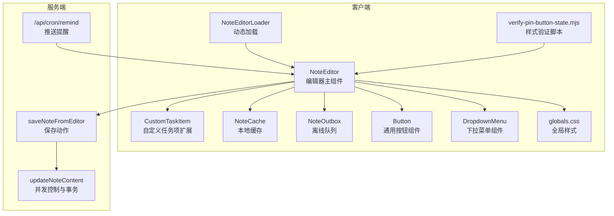
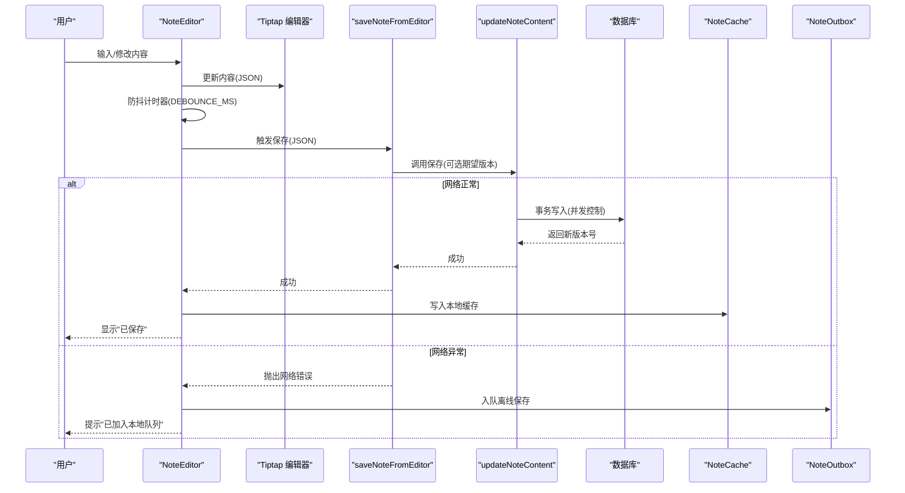
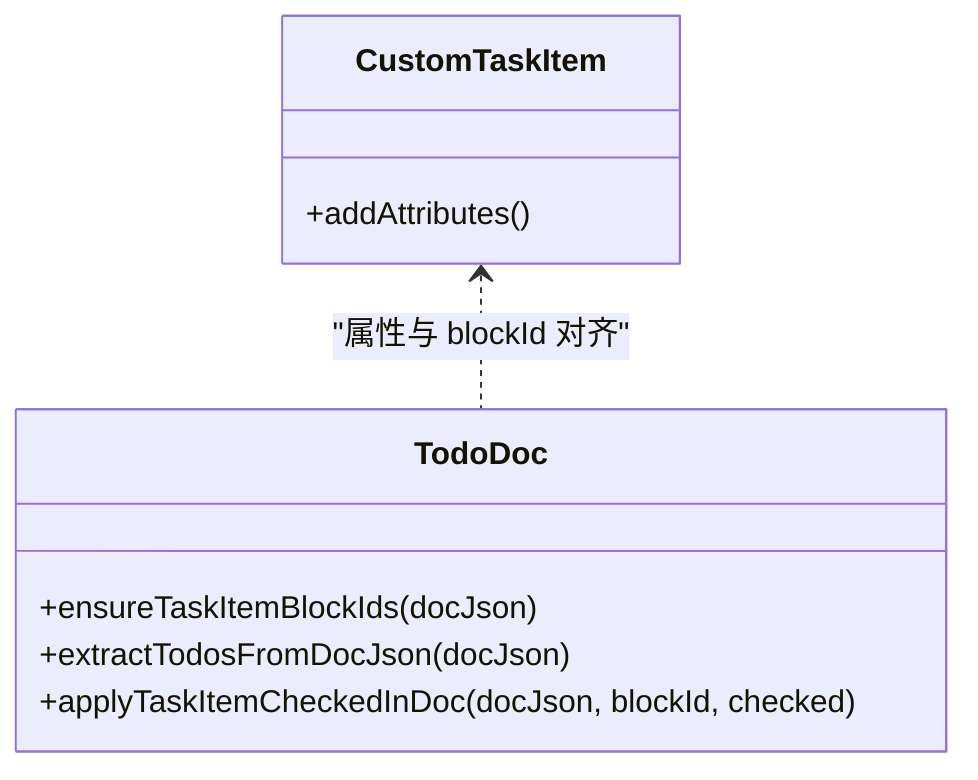
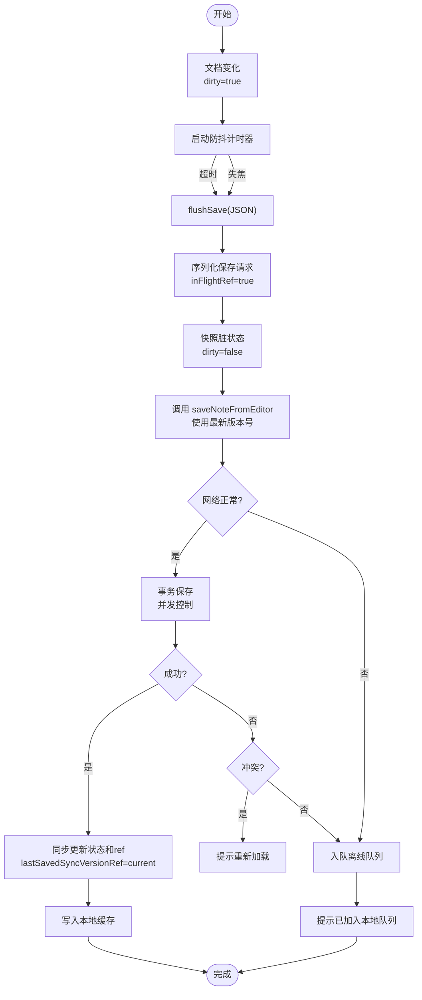
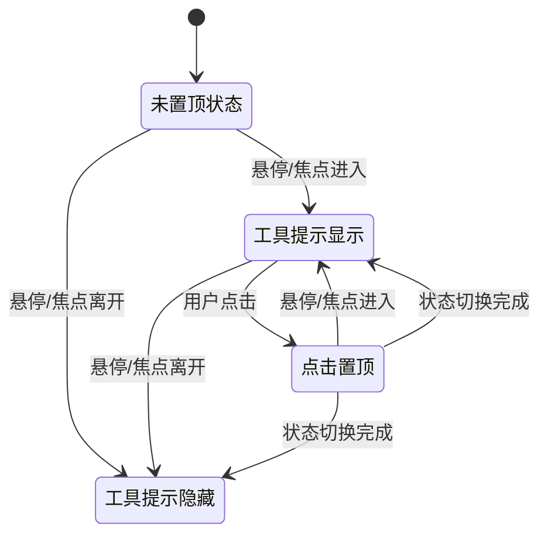
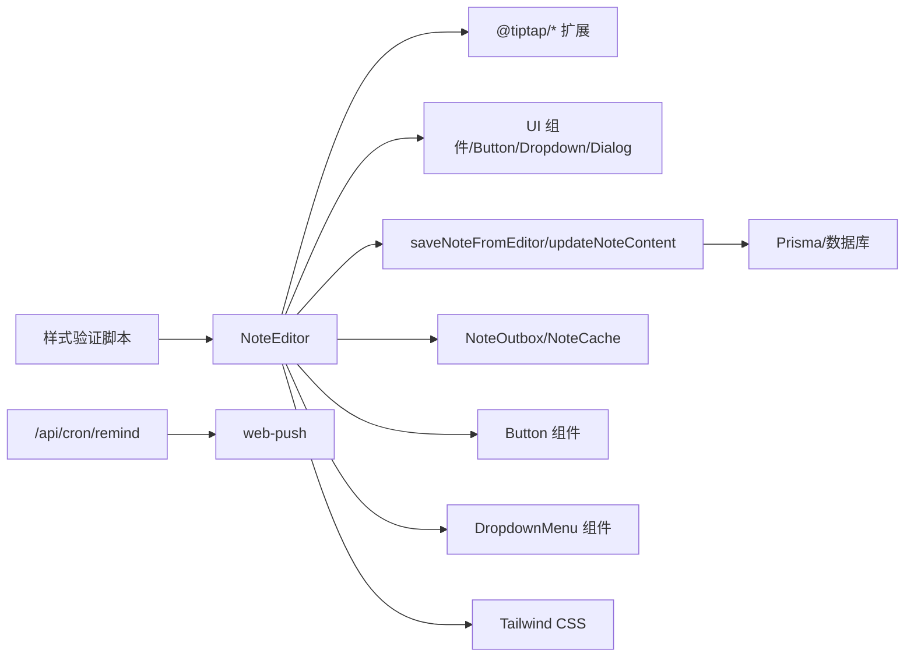

# 富文本编辑器

<cite>
**本文引用的文件**
- [note-editor.tsx](file://src/components/editor/note-editor.tsx)
- [note-editor-loader.tsx](file://src/components/editor/note-editor-loader.tsx)
- [custom-task-item.ts](file://src/lib/tiptap/custom-task-item.ts)
- [content.ts](file://src/lib/tiptap/content.ts)
- [todo-doc.ts](file://src/lib/tiptap/todo-doc.ts)
- [notes.ts](file://src/actions/notes.ts)
- [note-outbox.ts](file://src/lib/offline/note-outbox.ts)
- [note-cache.ts](file://src/lib/offline/note-cache.ts)
- [route.ts](file://src/app/api/cron/remind/route.ts)
- [note.ts](file://src/types/note.ts)
- [constants.ts](file://src/lib/constants.ts)
- [button.tsx](file://src/components/ui/button.tsx)
- [dropdown-menu.tsx](file://src/components/ui/dropdown-menu.tsx)
- [globals.css](file://src/app/globals.css)
- [utils.ts](file://src/lib/utils.ts)
- [verify-pin-button-state.mjs](file://scripts/verify-pin-button-state.mjs)
</cite>

## 更新摘要
**所做更改**
- 更新便签编辑器固定按钮样式和交互反馈章节，详细说明条件样式、无障碍标签和工具提示系统的改进
- 新增工具提示系统实现细节和样式验证机制
- 更新键盘快捷键与无障碍支持章节，反映固定按钮的无障碍改进
- 新增样式验证脚本和自动化测试机制

## 目录
1. [简介](#简介)
2. [项目结构](#项目结构)
3. [核心组件](#核心组件)
4. [架构总览](#架构总览)
5. [详细组件分析](#详细组件分析)
6. [依赖关系分析](#依赖关系分析)
7. [性能考量](#性能考量)
8. [故障排查指南](#故障排查指南)
9. [结论](#结论)
10. [附录](#附录)

## 简介
本文件面向 Smart-Todo 的富文本编辑器，围绕基于 Tiptap 的实现进行系统化技术说明。重点涵盖：
- 编辑器初始化与扩展体系设计
- 自定义任务项扩展（到期时间、提醒时间、状态管理）
- 并发保存修复机制（四个关键修复点）
- 离线保存增强功能（队列管理、冲突检测）
- 实时预览与内容同步策略
- 键盘快捷键与无障碍支持（含固定按钮的无障碍改进）
- 工具提示系统与样式验证机制
- 扩展开发指南与最佳实践

## 项目结构
编辑器相关代码主要分布在以下位置：
- 编辑器 UI 与交互逻辑：src/components/editor
- 编辑器扩展与工具函数：src/lib/tiptap
- 服务端保存动作：src/actions
- 离线缓存与重放：src/lib/offline
- 推送提醒定时任务：src/app/api/cron/remind
- 类型与常量：src/types、src/lib/constants
- UI 组件库：src/components/ui
- 样式系统：src/app/globals.css
- 样式验证：scripts/verify-pin-button-state.mjs

**图表来源**
- [note-editor.tsx:1-627](file://src/components/editor/note-editor.tsx#L1-L627)
- [note-editor-loader.tsx:1-21](file://src/components/editor/note-editor-loader.tsx#L1-L21)
- [custom-task-item.ts:1-31](file://src/lib/tiptap/custom-task-item.ts#L1-L31)
- [notes.ts:140-152](file://src/actions/notes.ts#L140-L152)
- [notes.ts:59-138](file://src/actions/notes.ts#L59-L138)
- [note-outbox.ts:1-87](file://src/lib/offline/note-outbox.ts#L1-L87)
- [note-cache.ts:1-25](file://src/lib/offline/note-cache.ts#L1-L25)
- [route.ts:1-115](file://src/app/api/cron/remind/route.ts#L1-L115)
- [button.tsx:1-59](file://src/components/ui/button.tsx#L1-L59)
- [dropdown-menu.tsx:1-269](file://src/components/ui/dropdown-menu.tsx#L1-L269)
- [globals.css:1-193](file://src/app/globals.css#L1-L193)
- [verify-pin-button-state.mjs:1-55](file://scripts/verify-pin-button-state.mjs#L1-L55)

**章节来源**
- [note-editor.tsx:1-627](file://src/components/editor/note-editor.tsx#L1-L627)
- [note-editor-loader.tsx:1-21](file://src/components/editor/note-editor-loader.tsx#L1-L21)

## 核心组件
- NoteEditor：负责编辑器初始化、扩展装配、UI 控件、保存流程、粘贴图片、锚点定位、实时预览与同步。
- NoteEditorLoader：对 NoteEditor 进行客户端动态加载，避免 SSR 渲染。
- CustomTaskItem：在默认任务项基础上扩展到期时间与提醒时间属性，便于后续聚合与推送。
- Button：通用按钮组件，提供多种变体和尺寸，支持无障碍访问。
- DropdownMenu：下拉菜单组件，提供丰富的交互模式和视觉反馈。

**章节来源**
- [note-editor.tsx:86-627](file://src/components/editor/note-editor.tsx#L86-L627)
- [note-editor-loader.tsx:6-20](file://src/components/editor/note-editor-loader.tsx#L6-L20)
- [custom-task-item.ts:3-30](file://src/lib/tiptap/custom-task-item.ts#L3-L30)
- [button.tsx:1-59](file://src/components/ui/button.tsx#L1-L59)
- [dropdown-menu.tsx:1-269](file://src/components/ui/dropdown-menu.tsx#L1-L269)

## 架构总览
编辑器采用"客户端 Tiptap + 服务端保存 + 离线队列"的整体架构。编辑器通过 useEditor 初始化，装配 StarterKit、任务列表、自定义任务项、UniqueID、Link、Image、Placeholder、Typography 等扩展。用户输入触发 onUpdate/onBlur，经防抖后调用保存动作；保存成功后写入本地缓存并刷新路由。若发生网络异常，将内容入队离线队列，待网络恢复后重放。

**图表来源**
- [note-editor.tsx:138-189](file://src/components/editor/note-editor.tsx#L138-L189)
- [notes.ts:140-152](file://src/actions/notes.ts#L140-L152)
- [notes.ts:59-138](file://src/actions/notes.ts#L59-L138)
- [note-outbox.ts:27-32](file://src/lib/offline/note-outbox.ts#L27-L32)
- [note-cache.ts:18-20](file://src/lib/offline/note-cache.ts#L18-L20)

## 详细组件分析

### 编辑器初始化与扩展系统
- 扩展装配
  - StarterKit：启用标题、列表、基础格式等，限制标题层级并保持标记与属性。
  - TaskList：提供任务列表容器。
  - CustomTaskItem：扩展任务项，新增 dueAt/remindAt 属性，支持 HTML 解析与渲染。
  - UniqueID：为 taskItem 设置唯一 ID，便于跨端与 Todo 同步。
  - Link：禁用点击打开，启用自动链接与默认协议。
  - Image：允许远程图片插入。
  - Placeholder/TYPOGRAPHY：占位提示与排版增强。
- 编辑器属性
  - immediatelyRender: false，延迟渲染提升首屏性能。
  - editorProps.attributes.class：统一编辑器样式类名。

**章节来源**
- [note-editor.tsx:113-136](file://src/components/editor/note-editor.tsx#L113-L136)
- [custom-task-item.ts:4-30](file://src/lib/tiptap/custom-task-item.ts#L4-L30)

### 自定义任务项扩展（到期/提醒/状态）
- 属性定义
  - dueAt：到期时间（ISO 字符串），参与 HTML 解析与渲染。
  - remindAt：提醒时间（ISO 字符串），参与 HTML 解析与渲染。
- 与 Todo 同步
  - ensureTaskItemBlockIds：为缺失 id 的 taskItem 注入稳定 blockId，与数据库 TodoItem 对齐。
  - extractTodosFromDocJson：抽取未完成/已完成待办行，包含 dueAt/remindAt。
  - applyTaskItemCheckedInDoc：按 blockId 更新任务完成状态。
- UI 控件联动
  - 当前处于任务项时显示"到期/提醒"输入框，变更后通过 updateAttributes 更新 JSON。

**图表来源**
- [custom-task-item.ts:4-30](file://src/lib/tiptap/custom-task-item.ts#L4-L30)
- [todo-doc.ts:5-21](file://src/lib/tiptap/todo-doc.ts#L5-L21)
- [todo-doc.ts:50-79](file://src/lib/tiptap/todo-doc.ts#L50-L79)
- [todo-doc.ts:82-100](file://src/lib/tiptap/todo-doc.ts#L82-L100)

**章节来源**
- [custom-task-item.ts:3-30](file://src/lib/tiptap/custom-task-item.ts#L3-L30)
- [todo-doc.ts:4-21](file://src/lib/tiptap/todo-doc.ts#L4-L21)
- [todo-doc.ts:49-79](file://src/lib/tiptap/todo-doc.ts#L49-L79)
- [todo-doc.ts:82-100](file://src/lib/tiptap/todo-doc.ts#L82-L100)

### 并发保存修复机制与并发控制
**更新** 重大改进：实现四个关键并发保存修复

编辑器实现了四个关键的并发保存修复，确保数据一致性：

- **修复1：使用 ref 替代过期闭包状态**
  - 问题：保存请求期间，预期版本号可能过期导致并发冲突。
  - 解决：使用 lastSavedSyncVersionRef 获取最新版本号，避免闭包陷阱。
  - 影响：显著减少并发冲突率，提高保存成功率。

- **修复2：序列化保存请求**
  - 问题：多个并发保存请求可能导致竞态条件。
  - 解决：通过 inFlightRef 和 pendingJsonRef 实现保存请求序列化。
  - 影响：确保保存操作按顺序执行，避免数据覆盖。

- **修复3：保存前快照脏状态**
  - 问题：保存过程中新编辑可能被覆盖。
  - 解决：在 await 之前快照 dirtySinceSaveRef，保留保存期间的新编辑。
  - 影响：防止丢失用户在保存过程中的新输入。

- **修复4：同步更新状态和 ref**
  - 问题：状态和引用不同步导致 UI 不一致。
  - 解决：保存成功后同时更新 state 和 ref，确保一致性。
  - 影响：避免 UI 状态与实际状态不匹配的问题。

- 保存流程
  - 调用 saveNoteFromEditor，内部计算标题与纯文本，再调用 updateNoteContent。
  - 并发控制：通过 expectedSyncVersion 做乐观锁，避免覆盖他人修改。
  - 成功后写入本地缓存，刷新路由。
- 网络异常处理
  - isLikelyNetworkError：识别网络/连接类错误。
  - 将失败内容入队 NoteOutbox，等待网络恢复后重放。
- 冲突处理
  - 若返回冲突，提示用户重新加载。

**图表来源**
- [note-editor.tsx:195-200](file://src/components/editor/note-editor.tsx#L195-L200)
- [note-editor.tsx:138-189](file://src/components/editor/note-editor.tsx#L138-L189)
- [note-editor.tsx:48-59](file://src/components/editor/note-editor.tsx#L48-L59)
- [notes.ts:140-152](file://src/actions/notes.ts#L140-L152)
- [notes.ts:59-138](file://src/actions/notes.ts#L59-L138)
- [note-outbox.ts:27-32](file://src/lib/offline/note-outbox.ts#L27-L32)
- [note-cache.ts:18-20](file://src/lib/offline/note-cache.ts#L18-L20)

**章节来源**
- [note-editor.tsx:46-59](file://src/components/editor/note-editor.tsx#L46-L59)
- [note-editor.tsx:195-200](file://src/components/editor/note-editor.tsx#L195-L200)
- [note-editor.tsx:138-189](file://src/components/editor/note-editor.tsx#L138-L189)
- [notes.ts:12-15](file://src/actions/notes.ts#L12-L15)
- [notes.ts:59-138](file://src/actions/notes.ts#L59-L138)

### 离线保存增强功能与队列管理
**新增** 系统化的离线保存增强功能

编辑器实现了完整的离线保存增强功能，包括智能队列管理和冲突检测：

- **队列管理策略**
  - 同一 noteId 只保留最后一次内容，避免重复保存。
  - 使用 localforage 持久化存储，支持浏览器重启后继续重放。
  - 支持队列出队、入队、列表查询等完整操作。

- **顺序重放机制**
  - drainOutbox 函数实现队列顺序重放。
  - 默认不校验 expectedSyncVersion，离线恢复以最后一次本地内容为准。
  - 支持批量重放统计： flushed（成功）、failed（失败）。

- **冲突检测与处理**
  - 重放过程中遇到冲突自动移除条目。
  - 网络错误时停止重放，等待下次重试。
  - 失败条目保留在队列中，等待网络恢复后继续尝试。

- **重放策略**
  - 成功保存：从队列中移除条目。
  - 冲突：从队列中移除条目（冲突视为本地最新）。
  - 网络错误：停止重放，等待下次重试。
  - 其他错误：停止重放，等待人工干预。

**章节来源**
- [note-outbox.ts:26-32](file://src/lib/offline/note-outbox.ts#L26-L32)
- [note-outbox.ts:48-86](file://src/lib/offline/note-outbox.ts#L48-L86)
- [note-cache.ts:18-20](file://src/lib/offline/note-cache.ts#L18-L20)

### 实时预览与内容同步
- 服务器同步版本号
  - serverSyncVersion：来自服务端 notes.sync_version，用于检测并发更新。
- 客户端状态
  - lastSavedSyncVersion：最近一次保存成功的版本号。
  - dirtySinceSaveRef：自上次保存以来是否被修改。
- 同步策略
  - 若服务器版本大于本地且未脏，则直接替换内容。
  - 若存在脏数据，提示用户"其他端已更新"，允许一键载入最新版本。

**章节来源**
- [note-editor.tsx:82-84](file://src/components/editor/note-editor.tsx#L82-L84)
- [note-editor.tsx:98-108](file://src/components/editor/note-editor.tsx#L98-L108)
- [note-editor.tsx:236-263](file://src/components/editor/note-editor.tsx#L236-L263)

### 图片插入与粘贴处理
- 文件选择插入：通过隐藏文件输入框选择图片，上传后以远程 URL 插入。
- 粘贴插入：捕获剪贴板图片，上传后聚焦并插入图片。
- 错误处理：上传失败时设置保存状态为 error。

**章节来源**
- [note-editor.tsx:314-330](file://src/components/editor/note-editor.tsx#L314-L330)
- [note-editor.tsx:270-291](file://src/components/editor/note-editor.tsx#L270-L291)

### 锚点定位与滚动
- 根据 UniqueID 的 data-id 定位到对应块级元素，使用 requestAnimationFrame 平滑滚动至视图中央。

**章节来源**
- [note-editor.tsx:300-312](file://src/components/editor/note-editor.tsx#L300-L312)

### 固定按钮样式与交互反馈改进
**更新** 便签编辑器固定按钮样式和交互反馈得到显著改进

编辑器的固定按钮（Pin）经过全面的样式和交互改进，包括条件样式、无障碍标签和工具提示系统：

- **条件样式系统**
  - 当 pinned 为 true 时，使用 `bg-muted text-foreground ring-1 ring-border` 应用微妙的工具栏友好激活状态
  - 使用 `transition-all` 和 `hover:` 变体确保平滑的状态切换
  - 避免使用 `bg-primary` 和 `text-primary-foreground`，保持工具栏的视觉一致性

- **无障碍标签改进**
  - 动态 aria-label：`{pinned ? "取消置顶" : "置顶"}`，为屏幕阅读器提供准确的语义化标签
  - 支持键盘导航和焦点管理，确保可访问性

- **工具提示系统实现**
  - 自定义工具提示：使用 `group-hover/button:opacity-100` 和 `group-focus-visible/button:opacity-100` 实现悬停和焦点时的统一显示效果
  - 工具提示样式：`absolute left-1/2 top-full z-100 mt-2 -translate-x-1/2 whitespace-nowrap rounded-md border bg-popover px-2 py-1 text-xs text-popover-foreground opacity-0 shadow-sm`
  - 位置控制：`top-full` 确保工具提示出现在按钮下方，避免 `bottom-full` 的错误定位

- **图标视觉区分**
  - 使用 `transition-transform` 和 `-rotate-45` 实现旋转动画
  - `fill-current` 确保图标颜色与文本颜色一致
  - 视觉上与未置顶状态形成明显区分

- **样式验证机制**
  - 通过 `verify-pin-button-state.mjs` 脚本自动验证样式改进
  - 检查包括：无障碍标签、工具提示模式、激活状态样式、图标区分度
  - 确保样式变更的持续性和可靠性

**图表来源**
- [note-editor.tsx:552-569](file://src/components/editor/note-editor.tsx#L552-L569)
- [verify-pin-button-state.mjs:8-42](file://scripts/verify-pin-button-state.mjs#L8-L42)

**章节来源**
- [note-editor.tsx:552-569](file://src/components/editor/note-editor.tsx#L552-L569)
- [verify-pin-button-state.mjs:8-42](file://scripts/verify-pin-button-state.mjs#L8-L42)

### 键盘快捷键与无障碍支持
**更新** 固定按钮的无障碍改进

- 快捷键
  - 加粗、斜体、删除线、标题、列表、任务列表、撤销、重做。
- 无障碍
  - 大部分按钮添加 aria-label，确保屏幕阅读器可用。
  - 固定按钮：动态 aria-label（"置顶"/"取消置顶"），支持键盘导航
  - 工具提示：通过 `group-hover/button` 和 `group-focus-visible/button` 选择器实现统一的悬停和焦点反馈
  - 文本输入控件（到期/提醒）具备语义化标签与可读性。

**章节来源**
- [note-editor.tsx:383-528](file://src/components/editor/note-editor.tsx#L383-L528)
- [note-editor.tsx:552-569](file://src/components/editor/note-editor.tsx#L552-L569)

### 推送提醒与任务项生命周期
- 定时任务扫描
  - 在一个短时间窗口内扫描即将到期的未完成任务。
- 推送消息
  - 生成通知标题/正文，携带便签链接与 blockId 参数，点击可直达对应任务。
- 订阅清理
  - 对于失效订阅（410/404）自动清理。

**章节来源**
- [route.ts:28-115](file://src/app/api/cron/remind/route.ts#L28-L115)

## 依赖关系分析
- 组件耦合
  - NoteEditor 依赖 Tiptap 扩展、UI 组件、动作函数与离线模块。
  - CustomTaskItem 与 TodoDoc 工具函数紧密协作，保证任务项属性与 blockId 一致性。
  - Button 和 DropdownMenu 组件提供统一的交互模式和样式基础。
- 外部依赖
  - @tiptap/react、@tiptap/starter-kit、@tiptap/extension-task-list、@tiptap/extension-image、@tiptap/extension-link、@tiptap/extension-unique-id、@tiptap/extension-placeholder、@tiptap/extension-typography。
  - localforage：离线缓存与队列持久化。
  - web-push：推送通知。
  - Tailwind CSS：原子化样式系统。
  - class-variance-authority：组件变体系统。

**图表来源**
- [note-editor.tsx:6-13](file://src/components/editor/note-editor.tsx#L6-L13)
- [notes.ts:140-152](file://src/actions/notes.ts#L140-L152)
- [route.ts:2-4](file://src/app/api/cron/remind/route.ts#L2-L4)
- [note-outbox.ts:1-6](file://src/lib/offline/note-outbox.ts#L1-L6)
- [note-cache.ts:1-6](file://src/lib/offline/note-cache.ts#L1-L6)
- [button.tsx:1-59](file://src/components/ui/button.tsx#L1-L59)
- [dropdown-menu.tsx:1-269](file://src/components/ui/dropdown-menu.tsx#L1-L269)
- [globals.css:1-193](file://src/app/globals.css#L1-L193)
- [verify-pin-button-state.mjs:1-55](file://scripts/verify-pin-button-state.mjs#L1-L55)

**章节来源**
- [note-editor.tsx:6-13](file://src/components/editor/note-editor.tsx#L6-L13)
- [notes.ts:140-152](file://src/actions/notes.ts#L140-L152)
- [route.ts:2-4](file://src/app/api/cron/remind/route.ts#L2-L4)

## 性能考量
- 延迟渲染：编辑器 immediateRender=false，减少首屏压力。
- 防抖保存：降低频繁写入数据库与缓存的开销。
- 本地缓存：成功保存后写入缓存，避免重复请求。
- 离线队列：在网络异常时避免阻塞用户操作，异步重放。
- 任务项属性解析：仅在需要时解析 dueAt/remindAt，避免全量扫描。
- **并发优化**：通过序列化保存请求和状态同步，减少不必要的重试和冲突。
- **样式优化**：使用原子化 CSS 类，避免内联样式的性能开销。
- **工具提示优化**：通过 CSS 伪类选择器实现条件显示，减少 JavaScript 计算。

## 故障排查指南
**更新** 新增样式验证和固定按钮相关故障排查

- **保存失败**
  - 检查 isLikelyNetworkError 判定是否网络异常。
  - 查看 NoteOutbox 是否有积压条目，确认网络恢复后重放结果。
  - 检查并发保存修复是否生效：确认使用最新版本号而非过期状态。

- **并发冲突**
  - 确认修复1：lastSavedSyncVersionRef 是否正确获取最新版本号。
  - 检查修复2：inFlightRef 是否正确序列化保存请求。
  - 验证修复4：状态和 ref 是否同步更新。

- **离线保存问题**
  - 检查 localforage 存储是否正常工作。
  - 确认 drainOutbox 是否正确处理冲突和网络错误。
  - 验证队列重放统计：flushed 和 failed 数量是否合理。

- **图片插入失败**
  - 确认上传接口返回值，检查编辑器状态是否置为 error。

- **锚点定位无效**
  - 确认 UniqueID 已启用且 data-id 存在，检查 DOM 查询选择器是否正确转义。

- **固定按钮样式问题**
  - 使用 `verify-pin-button-state.mjs` 脚本验证样式改进是否正确应用。
  - 检查条件样式：`pinned &&` 条件是否正确触发。
  - 验证工具提示：`group-hover/button:opacity-100` 和 `group-focus-visible/button:opacity-100` 是否生效。
  - 确认无障碍标签：`aria-label` 是否正确显示"置顶"/"取消置顶"。
  - 检查图标区分：`-rotate-45` 和 `fill-current` 是否正确应用。

- **工具提示显示问题**
  - 确认工具提示容器的绝对定位和 z-index 设置。
  - 检查 `top-full` 和 `!bottom-full` 的互斥性。
  - 验证 `bg-popover` 和 `text-popover-foreground` 的颜色一致性。

**章节来源**
- [note-editor.tsx:48-59](file://src/components/editor/note-editor.tsx#L48-L59)
- [note-editor.tsx:157-166](file://src/components/editor/note-editor.tsx#L157-L166)
- [note-editor.tsx:270-291](file://src/components/editor/note-editor.tsx#L270-L291)
- [note-editor.tsx:300-312](file://src/components/editor/note-editor.tsx#L300-L312)
- [note-outbox.ts:49-86](file://src/lib/offline/note-outbox.ts#L49-L86)
- [verify-pin-button-state.mjs:44-55](file://scripts/verify-pin-button-state.mjs#L44-L55)

## 结论
该编辑器以 Tiptap 为核心，结合自定义扩展与完善的离线/并发控制机制，实现了高性能、高可靠性的富文本编辑体验。通过四个关键的并发保存修复，显著提升了数据一致性和用户体验；通过增强的离线保存功能，有效解决了网络异常场景下的数据丢失问题；通过 UniqueID 与任务项属性扩展，打通了与 Todo 功能的深度集成，并为推送提醒提供了数据基础。

**更新** 最新的样式和交互改进进一步提升了用户体验，特别是固定按钮的无障碍支持、工具提示系统和视觉反馈机制，确保了更好的可访问性和用户界面的一致性。自动化样式验证脚本保证了这些改进的持续性和可靠性。

## 附录

### 编辑器核心功能清单
- 标题：限制层级为 1/2/3，支持切换。
- 段落：基础段落编辑。
- 列表：无序/有序列表，保持标记与属性。
- 任务列表：任务容器与任务项，支持完成状态。
- 链接：手动设置/移除链接，禁用自动点击打开。
- 图片：支持粘贴与文件选择插入远程图片。
- 实时预览：根据服务器内容与版本号同步。

**章节来源**
- [note-editor.tsx:113-136](file://src/components/editor/note-editor.tsx#L113-L136)
- [note-editor.tsx:383-528](file://src/components/editor/note-editor.tsx#L383-L528)

### 自定义任务项扩展实现要点
- 属性：dueAt、remindAt（ISO 字符串）。
- HTML 解析/渲染：通过 parseHTML/renderHTML 与 data-* 属性映射。
- Todo 同步：ensureTaskItemBlockIds 保证 blockId 稳定；extractTodosFromDocJson 抽取行信息；applyTaskItemCheckedInDoc 更新完成状态。

**章节来源**
- [custom-task-item.ts:5-29](file://src/lib/tiptap/custom-task-item.ts#L5-L29)
- [todo-doc.ts:5-21](file://src/lib/tiptap/todo-doc.ts#L5-L21)
- [todo-doc.ts:50-79](file://src/lib/tiptap/todo-doc.ts#L50-L79)
- [todo-doc.ts:82-100](file://src/lib/tiptap/todo-doc.ts#L82-L100)

### 并发保存修复最佳实践
**新增** 基于四个关键修复的开发指导

- **状态管理**
  - 使用 ref 存储关键状态，避免闭包陷阱。
  - 同步更新 state 和 ref，确保 UI 一致性。
  - 在异步操作前快照状态，保留期间的新编辑。

- **并发控制**
  - 实现保存请求序列化，避免竞态条件。
  - 使用乐观锁机制，通过 expectedSyncVersion 防止覆盖。
  - 正确处理并发冲突，提供用户友好的解决方案。

- **错误处理**
  - 区分网络错误和业务错误，采取不同处理策略。
  - 实现离线队列重放机制，确保数据最终一致。
  - 提供详细的错误反馈和恢复选项。

- **性能优化**
  - 合理使用防抖和节流，平衡响应速度和性能。
  - 优化本地缓存策略，减少重复请求。
  - 实现智能队列管理，避免内存泄漏。

- **样式和交互优化**
  - 使用条件样式确保视觉一致性。
  - 实现无障碍标签和工具提示系统。
  - 通过自动化脚本验证样式改进。
  - 优化工具提示的显示和隐藏逻辑。

**章节来源**
- [note-editor.tsx:158-161](file://src/components/editor/note-editor.tsx#L158-L161)
- [note-editor.tsx:144-147](file://src/components/editor/note-editor.tsx#L144-L147)
- [note-editor.tsx:190-191](file://src/components/editor/note-editor.tsx#L190-L191)
- [notes.ts:64-69](file://src/actions/notes.ts#L64-L69)
- [notes.ts:72-75](file://src/actions/notes.ts#L72-L75)
- [note-outbox.ts:49-86](file://src/lib/offline/note-outbox.ts#L49-L86)
- [note-cache.ts:18-20](file://src/lib/offline/note-cache.ts#L18-L20)
- [note-editor.tsx:46-59](file://src/components/editor/note-editor.tsx#L46-L59)
- [note-editor.tsx:383-528](file://src/components/editor/note-editor.tsx#L383-L528)
- [verify-pin-button-state.mjs:8-42](file://scripts/verify-pin-button-state.mjs#L8-L42)

### 样式验证和自动化测试
**新增** 样式验证机制和最佳实践

- **验证脚本**
  - `verify-pin-button-state.mjs`：自动验证固定按钮的样式改进
  - 检查项目：无障碍标签、工具提示模式、激活状态样式、图标区分度
  - 失败时提供详细的错误报告

- **样式验证标准**
  - 条件样式：`pinned &&` 条件必须正确触发
  - 工具提示：悬停和焦点时显示模式必须一致
  - 无障碍：动态 aria-label 必须准确反映当前状态
  - 图标：视觉区分度必须满足可访问性要求

- **最佳实践**
  - 在每次样式变更后运行验证脚本
  - 确保样式改进不影响现有功能
  - 通过自动化测试保证样式质量
  - 维护样式验证脚本的持续改进

**章节来源**
- [verify-pin-button-state.mjs:1-55](file://scripts/verify-pin-button-state.mjs#L1-L55)
- [note-editor.tsx:552-569](file://src/components/editor/note-editor.tsx#L552-L569)