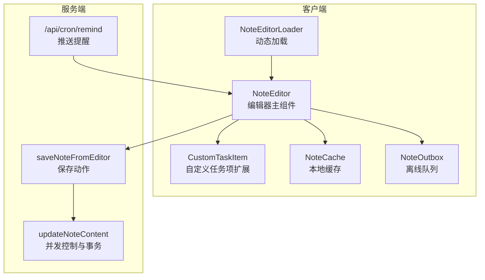
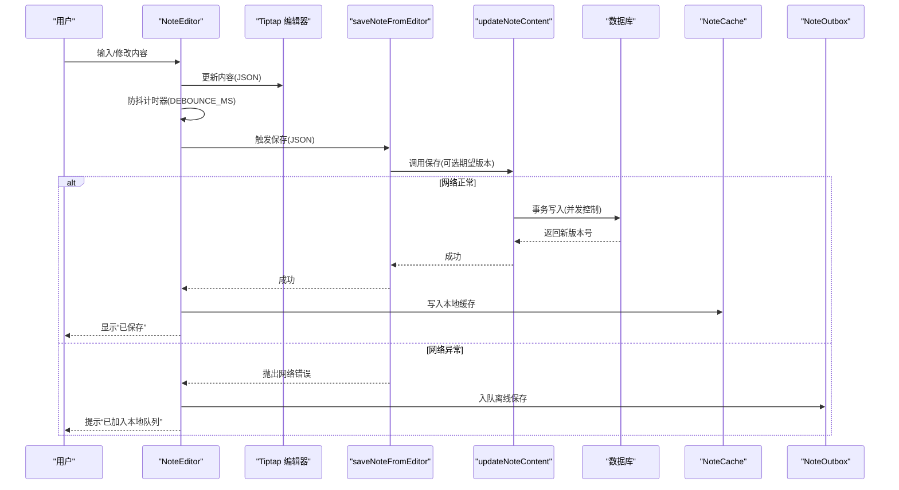
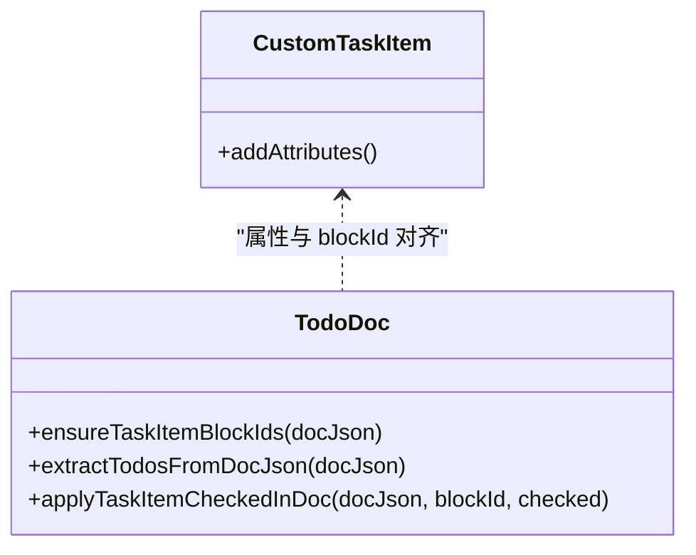
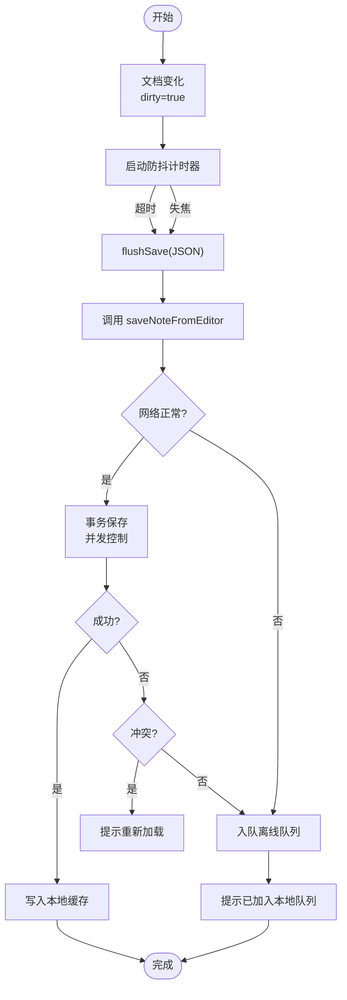
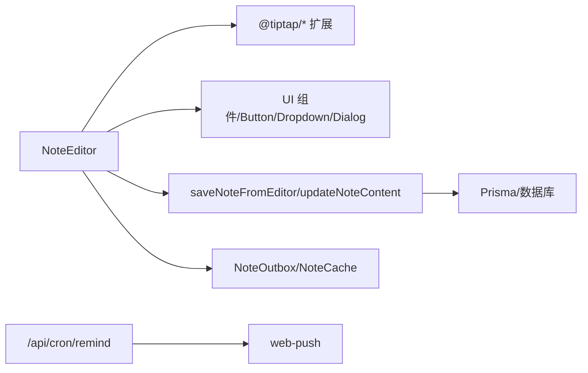

# 富文本编辑器

<cite>
**本文引用的文件**
- [note-editor.tsx](file://src/components/editor/note-editor.tsx)
- [note-editor-loader.tsx](file://src/components/editor/note-editor-loader.tsx)
- [custom-task-item.ts](file://src/lib/tiptap/custom-task-item.ts)
- [content.ts](file://src/lib/tiptap/content.ts)
- [todo-doc.ts](file://src/lib/tiptap/todo-doc.ts)
- [notes.ts](file://src/actions/notes.ts)
- [note-outbox.ts](file://src/lib/offline/note-outbox.ts)
- [note-cache.ts](file://src/lib/offline/note-cache.ts)
- [route.ts](file://src/app/api/cron/remind/route.ts)
- [note.ts](file://src/types/note.ts)
- [constants.ts](file://src/lib/constants.ts)
</cite>

## 目录
1. [简介](#简介)
2. [项目结构](#项目结构)
3. [核心组件](#核心组件)
4. [架构总览](#架构总览)
5. [详细组件分析](#详细组件分析)
6. [依赖关系分析](#依赖关系分析)
7. [性能考量](#性能考量)
8. [故障排查指南](#故障排查指南)
9. [结论](#结论)
10. [附录](#附录)

## 简介
本文件面向 Smart-Todo 的富文本编辑器，围绕基于 Tiptap 的实现进行系统化技术说明。重点涵盖：
- 编辑器初始化与扩展体系设计
- 自定义任务项扩展（到期时间、提醒时间、状态管理）
- 防抖保存机制（状态管理、错误与网络异常处理）
- 实时预览与内容同步策略
- 键盘快捷键与无障碍支持
- 扩展开发指南与最佳实践

## 项目结构
编辑器相关代码主要分布在以下位置：
- 编辑器 UI 与交互逻辑：src/components/editor
- 编辑器扩展与工具函数：src/lib/tiptap
- 服务端保存动作：src/actions
- 离线缓存与重放：src/lib/offline
- 推送提醒定时任务：src/app/api/cron/remind
- 类型与常量：src/types、src/lib/constants

图表来源
- [note-editor.tsx:1-586](file://src/components/editor/note-editor.tsx#L1-L586)
- [note-editor-loader.tsx:1-21](file://src/components/editor/note-editor-loader.tsx#L1-L21)
- [custom-task-item.ts:1-31](file://src/lib/tiptap/custom-task-item.ts#L1-L31)
- [notes.ts:140-152](file://src/actions/notes.ts#L140-L152)
- [notes.ts:59-138](file://src/actions/notes.ts#L59-L138)
- [note-outbox.ts:1-87](file://src/lib/offline/note-outbox.ts#L1-L87)
- [note-cache.ts:1-25](file://src/lib/offline/note-cache.ts#L1-L25)
- [route.ts:1-115](file://src/app/api/cron/remind/route.ts#L1-L115)

章节来源
- [note-editor.tsx:1-586](file://src/components/editor/note-editor.tsx#L1-L586)
- [note-editor-loader.tsx:1-21](file://src/components/editor/note-editor-loader.tsx#L1-L21)

## 核心组件
- NoteEditor：负责编辑器初始化、扩展装配、UI 控件、保存流程、粘贴图片、锚点定位、实时预览与同步。
- NoteEditorLoader：对 NoteEditor 进行客户端动态加载，避免 SSR 渲染。
- CustomTaskItem：在默认任务项基础上扩展到期时间与提醒时间属性，便于后续聚合与推送。

章节来源
- [note-editor.tsx:86-586](file://src/components/editor/note-editor.tsx#L86-L586)
- [note-editor-loader.tsx:6-20](file://src/components/editor/note-editor-loader.tsx#L6-L20)
- [custom-task-item.ts:3-30](file://src/lib/tiptap/custom-task-item.ts#L3-L30)

## 架构总览
编辑器采用“客户端 Tiptap + 服务端保存 + 离线队列”的整体架构。编辑器通过 useEditor 初始化，装配 StarterKit、任务列表、自定义任务项、UniqueID、Link、Image、Placeholder、Typography 等扩展。用户输入触发 onUpdate/onBlur，经防抖后调用保存动作；保存成功后写入本地缓存并刷新路由。若发生网络异常，将内容入队离线队列，待网络恢复后重放。

图表来源
- [note-editor.tsx:138-189](file://src/components/editor/note-editor.tsx#L138-L189)
- [notes.ts:140-152](file://src/actions/notes.ts#L140-L152)
- [notes.ts:59-138](file://src/actions/notes.ts#L59-L138)
- [note-outbox.ts:27-32](file://src/lib/offline/note-outbox.ts#L27-L32)
- [note-cache.ts:18-20](file://src/lib/offline/note-cache.ts#L18-L20)

## 详细组件分析

### 编辑器初始化与扩展系统
- 扩展装配
  - StarterKit：启用标题、列表、基础格式等，限制标题层级并保持标记与属性。
  - TaskList：提供任务列表容器。
  - CustomTaskItem：扩展任务项，新增 dueAt/remindAt 属性，支持 HTML 解析与渲染。
  - UniqueID：为 taskItem 设置唯一 ID，便于跨端与 Todo 同步。
  - Link：禁用点击打开，启用自动链接与默认协议。
  - Image：允许远程图片插入。
  - Placeholder/TYPOGRAPHY：占位提示与排版增强。
- 编辑器属性
  - immediatelyRender: false，延迟渲染提升首屏性能。
  - editorProps.attributes.class：统一编辑器样式类名。

章节来源
- [note-editor.tsx:113-136](file://src/components/editor/note-editor.tsx#L113-L136)
- [custom-task-item.ts:4-30](file://src/lib/tiptap/custom-task-item.ts#L4-L30)

### 自定义任务项扩展（到期/提醒/状态）
- 属性定义
  - dueAt：到期时间（ISO 字符串），参与 HTML 解析与渲染。
  - remindAt：提醒时间（ISO 字符串），参与 HTML 解析与渲染。
- 与 Todo 同步
  - ensureTaskItemBlockIds：为缺失 id 的 taskItem 注入稳定 blockId，与数据库 TodoItem 对齐。
  - extractTodosFromDocJson：抽取未完成/已完成待办行，包含 dueAt/remindAt。
  - applyTaskItemCheckedInDoc：按 blockId 更新任务完成状态。
- UI 控件联动
  - 当前处于任务项时显示“到期/提醒”输入框，变更后通过 updateAttributes 更新 JSON。

图表来源
- [custom-task-item.ts:4-30](file://src/lib/tiptap/custom-task-item.ts#L4-L30)
- [todo-doc.ts:5-21](file://src/lib/tiptap/todo-doc.ts#L5-L21)
- [todo-doc.ts:50-79](file://src/lib/tiptap/todo-doc.ts#L50-L79)
- [todo-doc.ts:82-100](file://src/lib/tiptap/todo-doc.ts#L82-L100)

章节来源
- [custom-task-item.ts:3-30](file://src/lib/tiptap/custom-task-item.ts#L3-L30)
- [todo-doc.ts:4-21](file://src/lib/tiptap/todo-doc.ts#L4-L21)
- [todo-doc.ts:49-79](file://src/lib/tiptap/todo-doc.ts#L49-L79)
- [todo-doc.ts:82-100](file://src/lib/tiptap/todo-doc.ts#L82-L100)

### 防抖保存机制与并发控制
- 防抖策略
  - DEBOUNCE_MS：650ms 防抖窗口。
  - onUpdate：当文档发生变化时，重置脏状态并启动计时器。
  - onBlur：失去焦点时立即执行保存。
- 保存流程
  - 调用 saveNoteFromEditor，内部计算标题与纯文本，再调用 updateNoteContent。
  - 并发控制：通过 expectedSyncVersion 做乐观锁，避免覆盖他人修改。
  - 成功后写入本地缓存，刷新路由。
- 网络异常处理
  - isLikelyNetworkError：识别网络/连接类错误。
  - 将失败内容入队 NoteOutbox，等待网络恢复后重放。
- 冲突处理
  - 若返回冲突，提示用户重新加载。

图表来源
- [note-editor.tsx:195-200](file://src/components/editor/note-editor.tsx#L195-L200)
- [note-editor.tsx:138-189](file://src/components/editor/note-editor.tsx#L138-L189)
- [note-editor.tsx:48-59](file://src/components/editor/note-editor.tsx#L48-L59)
- [notes.ts:140-152](file://src/actions/notes.ts#L140-L152)
- [notes.ts:59-138](file://src/actions/notes.ts#L59-L138)
- [note-outbox.ts:27-32](file://src/lib/offline/note-outbox.ts#L27-L32)
- [note-cache.ts:18-20](file://src/lib/offline/note-cache.ts#L18-L20)

章节来源
- [note-editor.tsx:46-59](file://src/components/editor/note-editor.tsx#L46-L59)
- [note-editor.tsx:195-200](file://src/components/editor/note-editor.tsx#L195-L200)
- [note-editor.tsx:138-189](file://src/components/editor/note-editor.tsx#L138-L189)
- [notes.ts:12-15](file://src/actions/notes.ts#L12-L15)
- [notes.ts:59-138](file://src/actions/notes.ts#L59-L138)

### 实时预览与内容同步
- 服务器同步版本号
  - serverSyncVersion：来自服务端 notes.sync_version，用于检测并发更新。
- 客户端状态
  - lastSavedSyncVersion：最近一次保存成功的版本号。
  - dirtySinceSaveRef：自上次保存以来是否被修改。
- 同步策略
  - 若服务器版本大于本地且未脏，则直接替换内容。
  - 若存在脏数据，提示用户“其他端已更新”，允许一键载入最新版本。

章节来源
- [note-editor.tsx:82-84](file://src/components/editor/note-editor.tsx#L82-L84)
- [note-editor.tsx:98-108](file://src/components/editor/note-editor.tsx#L98-L108)
- [note-editor.tsx:236-263](file://src/components/editor/note-editor.tsx#L236-L263)

### 图片插入与粘贴处理
- 文件选择插入：通过隐藏文件输入框选择图片，上传后以远程 URL 插入。
- 粘贴插入：捕获剪贴板图片，上传后聚焦并插入图片。
- 错误处理：上传失败时设置保存状态为 error。

章节来源
- [note-editor.tsx:314-330](file://src/components/editor/note-editor.tsx#L314-L330)
- [note-editor.tsx:270-291](file://src/components/editor/note-editor.tsx#L270-L291)

### 锚点定位与滚动
- 根据 UniqueID 的 data-id 定位到对应块级元素，使用 requestAnimationFrame 平滑滚动至视图中央。

章节来源
- [note-editor.tsx:300-312](file://src/components/editor/note-editor.tsx#L300-L312)

### 键盘快捷键与无障碍支持
- 快捷键
  - 加粗、斜体、删除线、标题、列表、任务列表、撤销、重做。
- 无障碍
  - 大部分按钮添加 aria-label，确保屏幕阅读器可用。
  - 文本输入控件（到期/提醒）具备语义化标签与可读性。

章节来源
- [note-editor.tsx:383-528](file://src/components/editor/note-editor.tsx#L383-L528)

### 推送提醒与任务项生命周期
- 定时任务扫描
  - 在一个短时间窗口内扫描即将到期的未完成任务。
- 推送消息
  - 生成通知标题/正文，携带便签链接与 blockId 参数，点击可直达对应任务。
- 订阅清理
  - 对于失效订阅（410/404）自动清理。

章节来源
- [route.ts:28-115](file://src/app/api/cron/remind/route.ts#L28-L115)

## 依赖关系分析
- 组件耦合
  - NoteEditor 依赖 Tiptap 扩展、UI 组件、动作函数与离线模块。
  - CustomTaskItem 与 TodoDoc 工具函数紧密协作，保证任务项属性与 blockId 一致性。
- 外部依赖
  - @tiptap/react、@tiptap/starter-kit、@tiptap/extension-task-list、@tiptap/extension-image、@tiptap/extension-link、@tiptap/extension-unique-id、@tiptap/extension-placeholder、@tiptap/extension-typography。
  - localforage：离线缓存与队列持久化。
  - web-push：推送通知。

图表来源
- [note-editor.tsx:6-13](file://src/components/editor/note-editor.tsx#L6-L13)
- [notes.ts:140-152](file://src/actions/notes.ts#L140-L152)
- [route.ts:2-4](file://src/app/api/cron/remind/route.ts#L2-L4)
- [note-outbox.ts:1-6](file://src/lib/offline/note-outbox.ts#L1-L6)
- [note-cache.ts:1-6](file://src/lib/offline/note-cache.ts#L1-L6)

章节来源
- [note-editor.tsx:6-13](file://src/components/editor/note-editor.tsx#L6-L13)
- [notes.ts:140-152](file://src/actions/notes.ts#L140-L152)
- [route.ts:2-4](file://src/app/api/cron/remind/route.ts#L2-L4)

## 性能考量
- 延迟渲染：编辑器 immediateRender=false，减少首屏压力。
- 防抖保存：降低频繁写入数据库与缓存的开销。
- 本地缓存：成功保存后写入缓存，避免重复请求。
- 离线队列：在网络异常时避免阻塞用户操作，异步重放。
- 任务项属性解析：仅在需要时解析 dueAt/remindAt，避免全量扫描。

## 故障排查指南
- 保存失败
  - 检查 isLikelyNetworkError 判定是否网络异常。
  - 查看 NoteOutbox 是否有积压条目，确认网络恢复后重放结果。
- 冲突提示
  - 服务器返回冲突时，按提示重新加载，避免覆盖他人修改。
- 图片插入失败
  - 确认上传接口返回值，检查编辑器状态是否置为 error。
- 锚点定位无效
  - 确认 UniqueID 已启用且 data-id 存在，检查 DOM 查询选择器是否正确转义。

章节来源
- [note-editor.tsx:48-59](file://src/components/editor/note-editor.tsx#L48-L59)
- [note-editor.tsx:157-166](file://src/components/editor/note-editor.tsx#L157-L166)
- [note-editor.tsx:270-291](file://src/components/editor/note-editor.tsx#L270-L291)
- [note-editor.tsx:300-312](file://src/components/editor/note-editor.tsx#L300-L312)
- [note-outbox.ts:49-86](file://src/lib/offline/note-outbox.ts#L49-L86)

## 结论
该编辑器以 Tiptap 为核心，结合自定义扩展与完善的离线/并发控制机制，实现了高性能、高可靠性的富文本编辑体验。通过防抖保存、本地缓存与离线队列，有效提升了弱网场景下的可用性；通过 UniqueID 与任务项属性扩展，打通了与 Todo 功能的深度集成，并为推送提醒提供了数据基础。

## 附录

### 编辑器核心功能清单
- 标题：限制层级为 1/2/3，支持切换。
- 段落：基础段落编辑。
- 列表：无序/有序列表，保持标记与属性。
- 任务列表：任务容器与任务项，支持完成状态。
- 链接：手动设置/移除链接，禁用自动点击打开。
- 图片：支持粘贴与文件选择插入远程图片。
- 实时预览：根据服务器内容与版本号同步。

章节来源
- [note-editor.tsx:113-136](file://src/components/editor/note-editor.tsx#L113-L136)
- [note-editor.tsx:383-528](file://src/components/editor/note-editor.tsx#L383-L528)

### 自定义任务项扩展实现要点
- 属性：dueAt、remindAt（ISO 字符串）。
- HTML 解析/渲染：通过 parseHTML/renderHTML 与 data-* 属性映射。
- Todo 同步：ensureTaskItemBlockIds 保证 blockId 稳定；extractTodosFromDocJson 抽取行信息；applyTaskItemCheckedInDoc 更新完成状态。

章节来源
- [custom-task-item.ts:5-29](file://src/lib/tiptap/custom-task-item.ts#L5-L29)
- [todo-doc.ts:5-21](file://src/lib/tiptap/todo-doc.ts#L5-L21)
- [todo-doc.ts:50-79](file://src/lib/tiptap/todo-doc.ts#L50-L79)
- [todo-doc.ts:82-100](file://src/lib/tiptap/todo-doc.ts#L82-L100)

### 扩展开发指南与最佳实践
- 扩展属性设计
  - 使用 addAttributes 定义默认值、parseHTML、renderHTML，确保序列化/反序列化一致。
  - 与业务字段对齐（如 dueAt/remindAt），便于后续聚合与推送。
- 并发控制
  - 保存时传入 expectedSyncVersion，服务端使用乐观锁，避免覆盖他人修改。
- 离线策略
  - 网络异常时入队离线队列，恢复后顺序重放；对冲突条目可选择丢弃或提示用户。
- 本地缓存
  - 成功保存后写入缓存，减少重复请求；注意忽略缓存写入错误以免影响主线程。
- UI 与无障碍
  - 为按钮添加 aria-label；输入控件提供清晰的标签与占位提示。
- 性能优化
  - 合理使用防抖；延迟渲染；仅在必要时解析复杂属性。

章节来源
- [custom-task-item.ts:5-29](file://src/lib/tiptap/custom-task-item.ts#L5-L29)
- [notes.ts:64-69](file://src/actions/notes.ts#L64-L69)
- [notes.ts:72-75](file://src/actions/notes.ts#L72-L75)
- [note-outbox.ts:49-86](file://src/lib/offline/note-outbox.ts#L49-L86)
- [note-cache.ts:18-20](file://src/lib/offline/note-cache.ts#L18-L20)
- [note-editor.tsx:46-59](file://src/components/editor/note-editor.tsx#L46-L59)
- [note-editor.tsx:383-528](file://src/components/editor/note-editor.tsx#L383-L528)