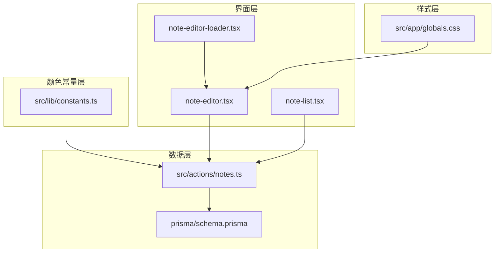
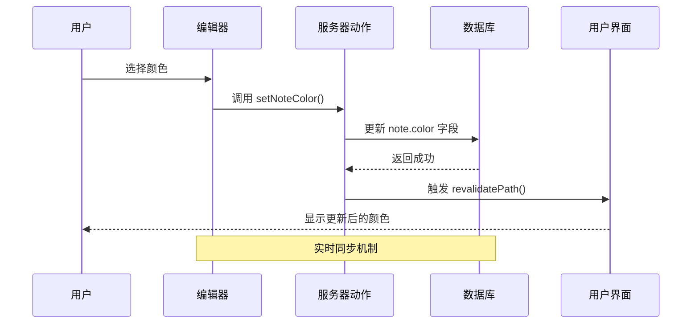
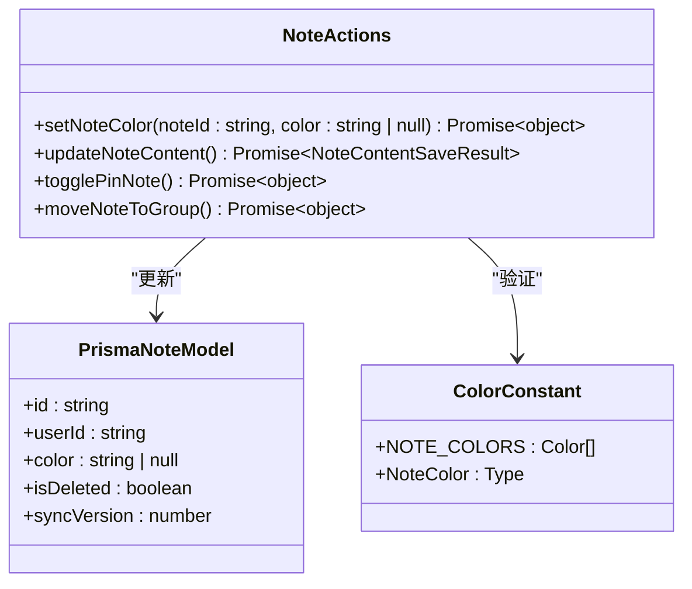
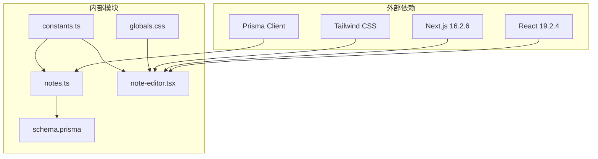
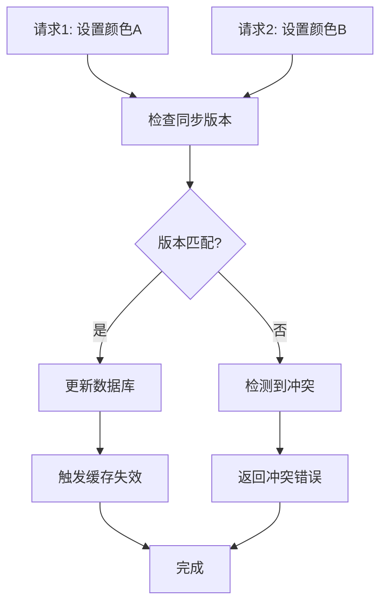

# 颜色标记系统

<cite>
**本文档引用的文件**
- [src/lib/constants.ts](file://src/lib/constants.ts)
- [src/actions/notes.ts](file://src/actions/notes.ts)
- [prisma/schema.prisma](file://prisma/schema.prisma)
- [src/components/editor/note-editor.tsx](file://src/components/editor/note-editor.tsx)
- [src/app/globals.css](file://src/app/globals.css)
- [src/components/notes/note-list.tsx](file://src/components/notes/note-list.tsx)
- [src/app/(app)/notes/page.tsx](file://src/app/(app)/notes/page.tsx)
- [src/components/editor/note-editor-loader.tsx](file://src/components/editor/note-editor-loader.tsx)
</cite>

## 目录
1. [简介](#简介)
2. [项目结构](#项目结构)
3. [核心组件](#核心组件)
4. [架构概览](#架构概览)
5. [详细组件分析](#详细组件分析)
6. [依赖关系分析](#依赖关系分析)
7. [性能考虑](#性能考虑)
8. [故障排除指南](#故障排除指南)
9. [结论](#结论)
10. [附录](#附录)

## 简介

Smart-Todo 的颜色标记系统是一个完整的便签颜色管理解决方案，为用户提供直观的颜色分类和视觉区分功能。该系统支持多种预定义颜色方案，包括柠檬黄、樱花粉、天空蓝、薄荷绿、薰衣紫和雾霭灰等六种颜色，每种颜色都配有对应的中文名称和十六进制颜色值。

颜色标记系统不仅提供了基础的颜色选择功能，还集成了完整的存储、同步和展示机制，确保用户在不同设备和会话之间能够保持一致的颜色标记体验。系统采用类型安全的设计，通过 TypeScript 类型系统确保颜色值的有效性和一致性。

## 项目结构

颜色标记系统在项目中的组织结构如下：



**图表来源**
- [src/lib/constants.ts:1-16](file://src/lib/constants.ts#L1-L16)
- [src/actions/notes.ts:209-218](file://src/actions/notes.ts#L209-L218)
- [prisma/schema.prisma:48-75](file://prisma/schema.prisma#L48-L75)
- [src/components/editor/note-editor.tsx:529-542](file://src/components/editor/note-editor.tsx#L529-L542)

**章节来源**
- [src/lib/constants.ts:1-16](file://src/lib/constants.ts#L1-L16)
- [prisma/schema.prisma:48-75](file://prisma/schema.prisma#L48-L75)

## 核心组件

### 颜色常量定义

颜色系统的核心是位于 `src/lib/constants.ts` 中的颜色常量定义。系统定义了六个预设颜色，每个颜色包含以下属性：

- **id**: 颜色的唯一标识符（如 "yellow", "pink" 等）
- **name**: 颜色的中文描述名称
- **hex**: 颜色的十六进制值

这些颜色常量通过 TypeScript 的 `as const` 语法确保类型安全，生成的类型系统会精确地反映可用的颜色选项。

### 数据模型设计

在数据库层面，颜色标记通过 `Note` 模型的 `color` 字段进行存储。该字段使用字符串类型，存储与颜色常量中定义的 `id` 值相对应的颜色标识符。

**章节来源**
- [src/lib/constants.ts:4-11](file://src/lib/constants.ts#L4-L11)
- [prisma/schema.prisma:58-59](file://prisma/schema.prisma#L58-L59)

## 架构概览

颜色标记系统的整体架构采用分层设计，确保各组件职责清晰且松耦合：



**图表来源**
- [src/components/editor/note-editor.tsx:348-354](file://src/components/editor/note-editor.tsx#L348-L354)
- [src/actions/notes.ts:209-218](file://src/actions/notes.ts#L209-L218)

系统采用以下关键设计原则：

1. **类型安全**: 使用 TypeScript 确保颜色值的类型正确性
2. **实时同步**: 通过 Next.js 的 revalidation 机制实现实时更新
3. **状态管理**: 在客户端组件中维护颜色状态，避免不必要的服务器通信
4. **错误处理**: 提供完善的错误处理和用户反馈机制

## 详细组件分析

### 颜色选择器实现

颜色选择器位于 `note-editor.tsx` 文件中，采用 HTML `<select>` 元素实现。选择器包含以下特性：

```mermaid
flowchart TD
Start([用户打开颜色选择器]) --> LoadColors[加载预定义颜色列表]
LoadColors --> RenderOptions[渲染颜色选项]
RenderOptions --> UserSelect{用户选择颜色?}
UserSelect --> |是| CallAction[调用 onColorChange()]
UserSelect --> |否| Wait[等待用户操作]
CallAction --> UpdateState[更新本地状态]
UpdateState --> CallServer[调用 setNoteColor()]
CallServer --> UpdateDB[更新数据库]
UpdateDB --> Revalidate[触发页面刷新]
Revalidate --> End([完成])
Wait --> UserSelect
```

**图表来源**
- [src/components/editor/note-editor.tsx:529-542](file://src/components/editor/note-editor.tsx#L529-L542)
- [src/components/editor/note-editor.tsx:348-354](file://src/components/editor/note-editor.tsx#L348-L354)

#### 交互模式

颜色选择器采用简洁的下拉菜单设计，提供以下交互特性：

- **无障碍支持**: 包含 `aria-label="颜色"` 属性，支持屏幕阅读器
- **禁用状态**: 在保存过程中自动禁用选择器，防止并发修改
- **即时反馈**: 用户选择后立即更新本地状态，提供即时视觉反馈
- **空值处理**: 支持清除颜色标记，通过空字符串表示无颜色

**章节来源**
- [src/components/editor/note-editor.tsx:529-542](file://src/components/editor/note-editor.tsx#L529-L542)
- [src/components/editor/note-editor.tsx:348-354](file://src/components/editor/note-editor.tsx#L348-L354)

### 服务器端动作处理

服务器端的动作处理位于 `src/actions/notes.ts` 文件中，主要的 `setNoteColor` 函数负责处理颜色变更请求：



**图表来源**
- [src/actions/notes.ts:209-218](file://src/actions/notes.ts#L209-L218)
- [src/lib/constants.ts:4-11](file://src/lib/constants.ts#L4-L11)

#### 处理流程

服务器端处理遵循以下流程：

1. **身份验证**: 验证当前用户会话的有效性
2. **数据验证**: 确保便签属于当前用户且未被删除
3. **数据库更新**: 使用 `updateMany` 方法更新颜色字段
4. **版本控制**: 通过 `syncVersion` 字段实现并发控制
5. **缓存失效**: 调用 `revalidatePath` 触发页面重新验证
6. **响应返回**: 返回操作结果给客户端

**章节来源**
- [src/actions/notes.ts:209-218](file://src/actions/notes.ts#L209-L218)

### 数据存储机制

颜色标记的数据存储采用以下设计：

#### 数据库字段设计

在 `prisma/schema.prisma` 中，`Note` 模型包含以下颜色相关字段：

- **color**: 字符串类型，存储颜色标识符
- **默认值**: `null`，表示未设置颜色
- **约束**: 无外键约束，允许任意字符串值

#### 存储策略

系统采用"标识符存储"策略，将颜色值存储为预定义颜色常量中的 `id` 值，而不是直接存储十六进制颜色值。这种设计的优势包括：

- **类型安全**: 通过 TypeScript 类型系统确保值的有效性
- **易于扩展**: 可以轻松添加新的颜色选项
- **国际化支持**: 颜色名称存储在常量中，便于本地化
- **性能优化**: 存储空间小，查询速度快

**章节来源**
- [prisma/schema.prisma:58-59](file://prisma/schema.prisma#L58-L59)
- [src/lib/constants.ts:4-11](file://src/lib/constants.ts#L4-L11)

### 用户界面展示

颜色标记在用户界面中的展示主要体现在便签列表中。虽然当前实现中便签列表没有直接显示颜色背景，但颜色信息存储在数据库中，为未来的界面扩展提供了基础。

#### 列表展示机制

便签列表组件 `note-list.tsx` 负责渲染便签项，虽然不直接显示颜色背景，但保留了未来集成颜色展示的空间。

**章节来源**
- [src/components/notes/note-list.tsx:14-52](file://src/components/notes/note-list.tsx#L14-L52)

## 依赖关系分析

颜色标记系统的依赖关系呈现清晰的层次结构：



**图表来源**
- [src/lib/constants.ts:1-16](file://src/lib/constants.ts#L1-L16)
- [src/actions/notes.ts:1-10](file://src/actions/notes.ts#L1-L10)
- [prisma/schema.prisma:1-16](file://prisma/schema.prisma#L1-L16)

### 组件耦合度分析

系统设计具有较低的组件耦合度：

- **颜色常量**与**服务器动作**之间通过类型系统耦合
- **服务器动作**与**数据库**之间通过 Prisma ORM 耦合
- **编辑器组件**与**服务器动作**之间通过异步函数耦合
- **样式系统**与**编辑器组件**之间通过 CSS 类名耦合

这种设计确保了各组件的独立性，便于单独测试和维护。

**章节来源**
- [src/lib/constants.ts:1-16](file://src/lib/constants.ts#L1-L16)
- [src/actions/notes.ts:1-10](file://src/actions/notes.ts#L1-L10)

## 性能考虑

### 渲染优化

颜色标记系统采用了多项性能优化策略：

#### 客户端状态管理
- 颜色选择器在客户端维护本地状态，避免不必要的服务器通信
- 使用 `useTransition` 优化状态更新的用户体验
- 条件渲染确保只在需要时重新渲染相关组件

#### 数据传输优化
- 颜色值仅传输标识符而非完整颜色对象
- 使用最小化的数据库字段存储颜色信息
- 通过 `revalidatePath` 精确控制页面刷新范围

#### 缓存策略
- 浏览器自动缓存静态资源
- Next.js 的页面缓存机制减少重复渲染
- 服务器端动作的结果可以被浏览器缓存

### 并发控制

系统实现了完善的并发控制机制：



**图表来源**
- [src/actions/notes.ts:72-137](file://src/actions/notes.ts#L72-L137)

**章节来源**
- [src/actions/notes.ts:72-137](file://src/actions/notes.ts#L72-L137)

## 故障排除指南

### 常见问题及解决方案

#### 颜色无法保存
**症状**: 用户选择颜色后，页面没有显示变化
**可能原因**:
- 网络连接问题导致服务器请求失败
- 并发修改导致的版本冲突
- 客户端状态同步问题

**解决方案**:
1. 检查网络连接状态
2. 刷新页面重新加载最新状态
3. 确认没有其他用户同时编辑同一便签

#### 颜色显示异常
**症状**: 便签颜色显示不正确或与其他便签混淆
**可能原因**:
- 颜色值存储格式错误
- 样式类名冲突
- 浏览器缓存问题

**解决方案**:
1. 清除浏览器缓存后重新加载
2. 检查颜色常量定义是否正确
3. 验证数据库中颜色字段的值

#### 性能问题
**症状**: 颜色切换响应缓慢
**可能原因**:
- 页面刷新过于频繁
- 数据库查询性能问题
- 客户端渲染性能瓶颈

**解决方案**:
1. 优化页面刷新策略，减少不必要的 revalidation
2. 检查数据库索引配置
3. 分析客户端渲染性能，识别瓶颈

**章节来源**
- [src/actions/notes.ts:121-137](file://src/actions/notes.ts#L121-L137)

## 结论

Smart-Todo 的颜色标记系统展现了现代前端应用的优秀实践，通过精心设计的架构实现了功能完整性、性能优化和用户体验的平衡。系统采用类型安全的设计、实时同步机制和清晰的分层架构，为用户提供了直观而可靠的颜色管理功能。

该系统的主要优势包括：
- **类型安全**: 通过 TypeScript 确保颜色值的正确性
- **实时同步**: 基于 Next.js 的 revalidation 机制实现实时更新
- **扩展性强**: 支持轻松添加新的颜色选项和自定义颜色方案
- **性能优化**: 采用多种优化策略确保良好的用户体验

未来可以在现有基础上进一步增强功能，如添加颜色分类展示、颜色对比度检查和更丰富的视觉反馈机制。

## 附录

### 颜色常量参考

系统支持的颜色选项及其属性：

| 颜色标识符 | 中文名称 | 十六进制值 |
|------------|----------|------------|
| yellow | 柠檬黄 | #FEF3C7 |
| pink | 樱花粉 | #FCE7F3 |
| blue | 天空蓝 | #DBEAFE |
| green | 薄荷绿 | #D1FAE5 |
| purple | 薰衣紫 | #E9D5FF |
| gray | 雾霭灰 | #E5E7EB |

### 扩展指南

#### 添加新颜色方案
1. 在 `src/lib/constants.ts` 中添加新的颜色对象
2. 更新 `NoteColor` 类型定义
3. 在数据库迁移中添加相应的颜色选项（如需要）

#### 自定义颜色主题
1. 修改 `src/app/globals.css` 中的 CSS 变量
2. 调整颜色对比度以满足可访问性要求
3. 测试不同颜色组合的视觉效果

#### 集成颜色分类展示
1. 在 `src/components/notes/note-list.tsx` 中添加颜色显示逻辑
2. 创建颜色分类的过滤功能
3. 实现颜色统计和汇总功能