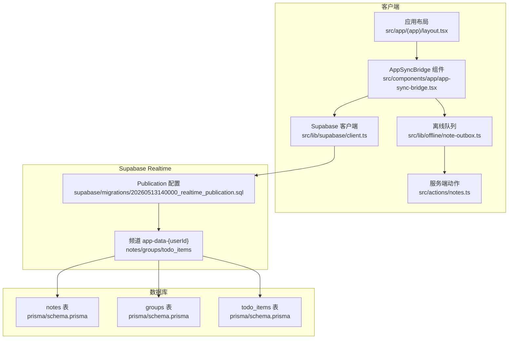
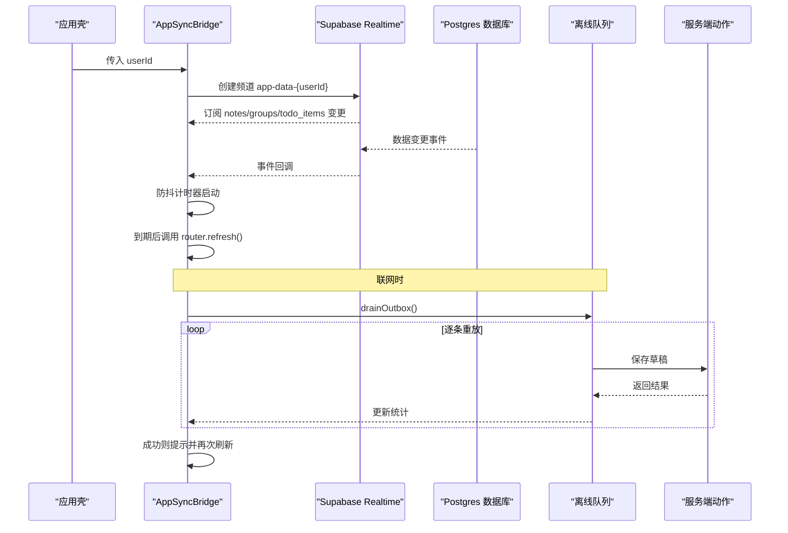
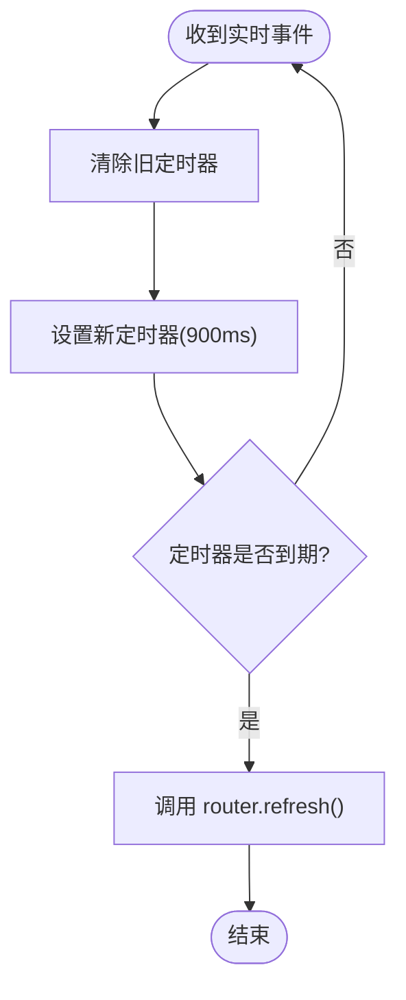
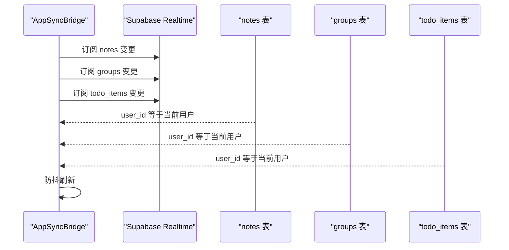
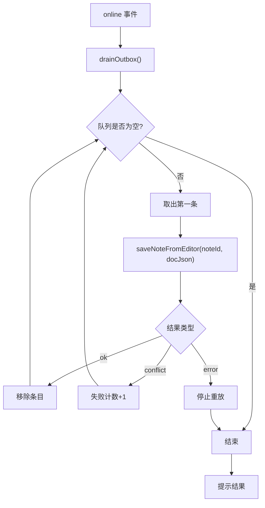
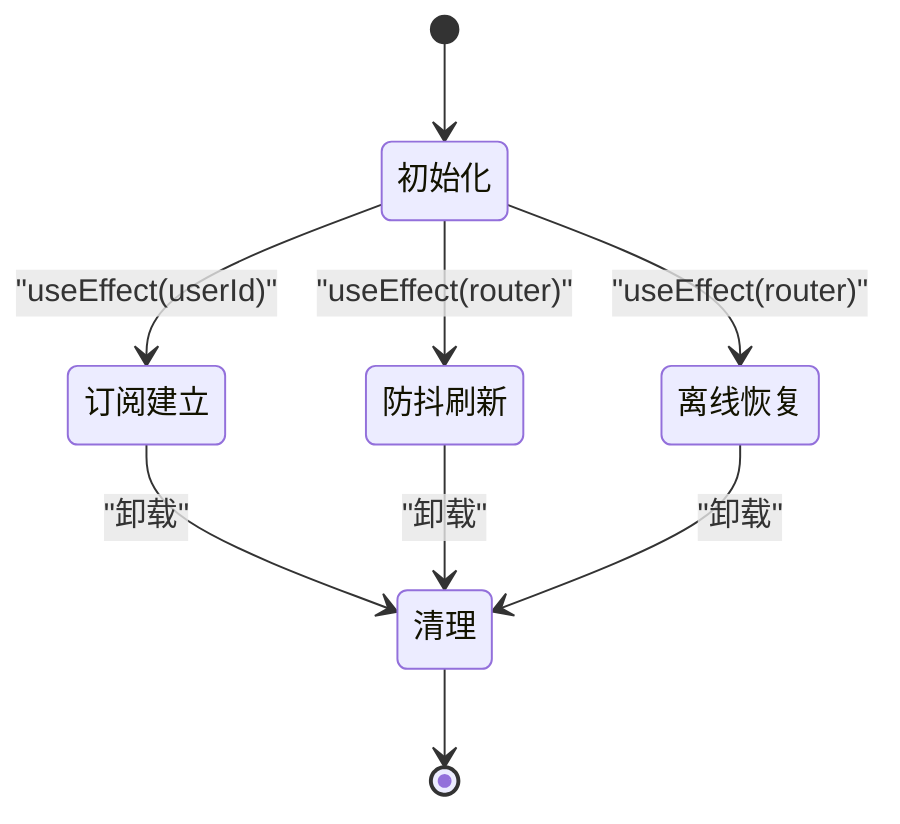
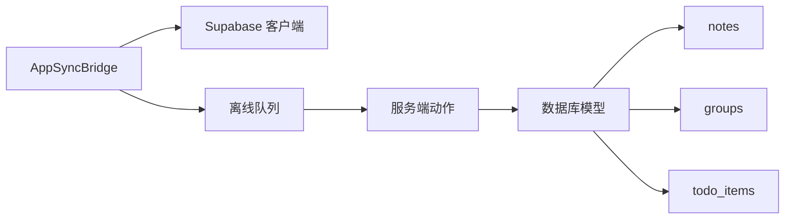

# AppSyncBridge 实时桥接组件

<cite>
**本文引用的文件**
- [app-sync-bridge.tsx](file://src/components/app/app-sync-bridge.tsx)
- [note-outbox.ts](file://src/lib/offline/note-outbox.ts)
- [notes.ts](file://src/actions/notes.ts)
- [client.ts](file://src/lib/supabase/client.ts)
- [layout.tsx](file://src/app/(app)/layout.tsx)
- [20260513140000_realtime_publication.sql](file://supabase/migrations/20260513140000_realtime_publication.sql)
- [schema.prisma](file://prisma/schema.prisma)
- [layout.tsx](file://src/app/layout.tsx)
- [proxy.ts](file://src/lib/supabase/proxy.ts)
- [server.ts](file://src/lib/supabase/server.ts)
- [sync-todo-items-for-note.ts](file://src/lib/todo/sync-todo-items-for-note.ts)
- [route.ts](file://src/app/api/cron/remind/route.ts)
</cite>

## 目录
1. [简介](#简介)
2. [项目结构](#项目结构)
3. [核心组件](#核心组件)
4. [架构总览](#架构总览)
5. [详细组件分析](#详细组件分析)
6. [依赖关系分析](#依赖关系分析)
7. [性能考量](#性能考量)
8. [故障排查指南](#故障排查指南)
9. [结论](#结论)
10. [附录](#附录)

## 简介
AppSyncBridge 是一个客户端实时桥接组件，负责在用户登录后的应用壳内建立 Supabase Realtime 订阅，监听 notes、groups、todo_items 三张业务表的变更，并通过防抖机制触发 Next.js 的路由刷新，确保 UI 与服务端数据保持一致。同时，它在设备联网时尝试刷出本地离线队列中的草稿，提升离线场景下的用户体验。

## 项目结构
AppSyncBridge 位于前端组件层，与 Next.js 应用布局紧密集成，通过 Supabase Realtime 与数据库变更事件对接，并结合本地 IndexedDB 离线队列实现离线恢复与冲突处理。



**图表来源**
- [app-sync-bridge.tsx:1-118](file://src/components/app/app-sync-bridge.tsx#L1-L118)
- [layout.tsx](file://src/app/(app)/layout.tsx#L1-L53)
- [client.ts:1-9](file://src/lib/supabase/client.ts#L1-L9)
- [20260513140000_realtime_publication.sql:1-7](file://supabase/migrations/20260513140000_realtime_publication.sql#L1-L7)
- [schema.prisma:48-100](file://prisma/schema.prisma#L48-L100)
- [note-outbox.ts:1-87](file://src/lib/offline/note-outbox.ts#L1-L87)
- [notes.ts:1-230](file://src/actions/notes.ts#L1-L230)

**章节来源**
- [app-sync-bridge.tsx:1-118](file://src/components/app/app-sync-bridge.tsx#L1-L118)
- [layout.tsx](file://src/app/(app)/layout.tsx#L1-L53)
- [client.ts:1-9](file://src/lib/supabase/client.ts#L1-L9)
- [20260513140000_realtime_publication.sql:1-7](file://supabase/migrations/20260513140000_realtime_publication.sql#L1-L7)
- [schema.prisma:48-100](file://prisma/schema.prisma#L48-L100)

## 核心组件
- 实时订阅与事件监听：在组件挂载时创建 Supabase Realtime 频道，订阅 notes、groups、todo_items 三张表的任意变更事件，过滤条件为 user_id 等于当前用户 ID。
- 防抖刷新策略：通过防抖定时器将多个连续事件合并为一次 Next.js 路由刷新，避免频繁刷新导致的性能问题。
- 离线队列处理：在设备联网时调用离线队列的 drainOutbox 方法，顺序重放本地草稿，成功则移除队列条目，失败则根据结果进行提示或继续重试。
- 生命周期管理：在组件卸载时清理防抖定时器并移除 Realtime 频道，防止内存泄漏和重复订阅。

**章节来源**
- [app-sync-bridge.tsx:20-118](file://src/components/app/app-sync-bridge.tsx#L20-L118)

## 架构总览
AppSyncBridge 的整体工作流如下：
- 初始化：在应用布局中注入组件并传入 userId。
- 订阅建立：创建 Supabase Realtime 频道，订阅三张业务表的变更事件。
- 事件处理：收到事件后触发防抖刷新，最终调用 Next.js 的 router.refresh。
- 离线恢复：在 online 事件触发时，顺序重放离线队列中的草稿，成功则提示并再次刷新 UI。
- 清理：组件卸载时清理定时器和频道。



**图表来源**
- [app-sync-bridge.tsx:25-114](file://src/components/app/app-sync-bridge.tsx#L25-L114)
- [note-outbox.ts:48-86](file://src/lib/offline/note-outbox.ts#L48-L86)
- [notes.ts:140-152](file://src/actions/notes.ts#L140-L152)

**章节来源**
- [app-sync-bridge.tsx:25-114](file://src/components/app/app-sync-bridge.tsx#L25-L114)
- [note-outbox.ts:48-86](file://src/lib/offline/note-outbox.ts#L48-L86)
- [notes.ts:140-152](file://src/actions/notes.ts#L140-L152)

## 详细组件分析

### 组件类图
```mermaid
classDiagram
class AppSyncBridge {
+userId : string
-router : NextRouter
-debounceTimer : TimeoutRef
-scheduleRefreshRef : Function
+useEffect(订阅建立)
+useEffect(离线恢复)
+useEffect(生命周期清理)
}
class SupabaseClient {
+createClient() : SupabaseClient
}
class Outbox {
+enqueueNoteSave(noteId, docJson)
+listOutbox() : OutboxEntry[]
+removeOutboxEntry(noteId)
+drainOutbox(saver) : {flushed, failed}
}
class SaveAction {
+saveNoteFromEditor(noteId, docJson, options)
+updateNoteContent(...)
}
AppSyncBridge --> SupabaseClient : "创建客户端"
AppSyncBridge --> Outbox : "离线队列"
Outbox --> SaveAction : "调用保存"
```

**图表来源**
- [app-sync-bridge.tsx:20-118](file://src/components/app/app-sync-bridge.tsx#L20-L118)
- [client.ts:3-8](file://src/lib/supabase/client.ts#L3-L8)
- [note-outbox.ts:26-86](file://src/lib/offline/note-outbox.ts#L26-L86)
- [notes.ts:140-152](file://src/actions/notes.ts#L140-L152)

**章节来源**
- [app-sync-bridge.tsx:20-118](file://src/components/app/app-sync-bridge.tsx#L20-L118)
- [client.ts:3-8](file://src/lib/supabase/client.ts#L3-L8)
- [note-outbox.ts:26-86](file://src/lib/offline/note-outbox.ts#L26-L86)
- [notes.ts:140-152](file://src/actions/notes.ts#L140-L152)

### 防抖机制与刷新策略
- 防抖定时器：每次收到实时事件时，先清除之前的定时器，再设置新的定时器，延迟时间为 900ms。到期后调用 router.refresh()。
- 设计目的：合并短时间内多次变更，减少不必要的 UI 刷新，降低网络与渲染压力。
- 性能影响：900ms 的延迟在保证体验流畅的同时，避免了高频刷新带来的卡顿；对于需要快速反馈的场景，可考虑缩短延迟但需权衡性能。



**图表来源**
- [app-sync-bridge.tsx:25-35](file://src/components/app/app-sync-bridge.tsx#L25-L35)

**章节来源**
- [app-sync-bridge.tsx:25-35](file://src/components/app/app-sync-bridge.tsx#L25-L35)

### 多表订阅的统一处理
- 订阅范围：notes、groups、todo_items 三张表均通过同一频道 app-data-{userId} 订阅，过滤条件为 user_id=eq.{userId}。
- 事件聚合：无论哪张表发生变更，都会触发相同的防抖刷新逻辑，确保所有相关页面的数据一致性。
- 响应策略：统一通过 router.refresh() 刷新当前路由，配合 Next.js 的缓存失效机制，保证数据同步。



**图表来源**
- [app-sync-bridge.tsx:37-83](file://src/components/app/app-sync-bridge.tsx#L37-L83)
- [20260513140000_realtime_publication.sql:4-6](file://supabase/migrations/20260513140000_realtime_publication.sql#L4-L6)

**章节来源**
- [app-sync-bridge.tsx:37-83](file://src/components/app/app-sync-bridge.tsx#L37-L83)
- [20260513140000_realtime_publication.sql:4-6](file://supabase/migrations/20260513140000_realtime_publication.sql#L4-L6)

### 在线状态检测与离线队列处理
- 在线事件：当浏览器发出 online 事件时，组件会调用 drainOutbox 方法顺序重放队列中的草稿。
- 重放策略：逐条调用 saveNoteFromEditor，根据返回结果更新统计：成功则移除队列条目，冲突则记录失败，其他错误则中断后续重放。
- 结果反馈：成功刷新后显示成功提示，失败则提示仍有草稿未能上传（可能与其他端冲突）。



**图表来源**
- [app-sync-bridge.tsx:93-114](file://src/components/app/app-sync-bridge.tsx#L93-L114)
- [note-outbox.ts:48-86](file://src/lib/offline/note-outbox.ts#L48-L86)
- [notes.ts:140-152](file://src/actions/notes.ts#L140-L152)

**章节来源**
- [app-sync-bridge.tsx:93-114](file://src/components/app/app-sync-bridge.tsx#L93-L114)
- [note-outbox.ts:48-86](file://src/lib/offline/note-outbox.ts#L48-L86)
- [notes.ts:140-152](file://src/actions/notes.ts#L140-L152)

### 组件生命周期管理
- 订阅建立：在第一个 useEffect 中创建 Supabase Realtime 频道并订阅三张表的变更事件。
- 防抖刷新：在第二个 useEffect 中设置 scheduleRefreshRef，用于统一处理刷新逻辑。
- 离线恢复：在第三个 useEffect 中监听 online 事件并执行离线队列重放。
- 清理：在所有 useEffect 的返回函数中清理定时器和频道，防止内存泄漏。



**图表来源**
- [app-sync-bridge.tsx:25-114](file://src/components/app/app-sync-bridge.tsx#L25-L114)

**章节来源**
- [app-sync-bridge.tsx:25-114](file://src/components/app/app-sync-bridge.tsx#L25-L114)

### 组件使用示例与集成指南
- 基本集成：在应用布局中引入 AppSyncBridge 并传入 userId。
- 错误处理：组件内部对 CHANNEL_ERROR 进行日志记录；离线重放失败时通过 toast 提示。
- 性能优化：合理设置防抖延迟，避免过度刷新；离线队列采用顺序重放，减少并发冲突。
- 依赖配置：确保 Supabase Realtime 的 publication 已包含 notes、groups、todo_items 表。

**章节来源**
- [layout.tsx](file://src/app/(app)/layout.tsx#L20-L22)
- [app-sync-bridge.tsx:79-83](file://src/components/app/app-sync-bridge.tsx#L79-L83)
- [20260513140000_realtime_publication.sql:4-6](file://supabase/migrations/20260513140000_realtime_publication.sql#L4-L6)

## 依赖关系分析
- 组件依赖 Supabase Realtime 客户端创建函数，用于建立频道与订阅事件。
- 离线队列依赖 localforage 存储，提供入队、出队与顺序重放能力。
- 服务端动作提供草稿保存接口，支持跳过版本校验用于离线恢复场景。
- 数据模型定义了 notes、groups、todo_items 的字段与索引，支撑实时订阅与查询。



**图表来源**
- [app-sync-bridge.tsx:3-8](file://src/components/app/app-sync-bridge.tsx#L3-L8)
- [client.ts:3-8](file://src/lib/supabase/client.ts#L3-L8)
- [note-outbox.ts:1-6](file://src/lib/offline/note-outbox.ts#L1-L6)
- [notes.ts:1-10](file://src/actions/notes.ts#L1-L10)
- [schema.prisma:48-100](file://prisma/schema.prisma#L48-L100)

**章节来源**
- [app-sync-bridge.tsx:3-8](file://src/components/app/app-sync-bridge.tsx#L3-L8)
- [client.ts:3-8](file://src/lib/supabase/client.ts#L3-L8)
- [note-outbox.ts:1-6](file://src/lib/offline/note-outbox.ts#L1-L6)
- [notes.ts:1-10](file://src/actions/notes.ts#L1-L10)
- [schema.prisma:48-100](file://prisma/schema.prisma#L48-L100)

## 性能考量
- 防抖延迟选择：900ms 的延迟在保证 UI 响应性的同时，有效减少频繁刷新带来的性能开销。对于高并发场景，可根据实际测试调整延迟值。
- 离线队列顺序重放：逐条处理避免并发冲突，但可能增加重放时间。建议在队列较大时分批处理或限制最大重放数量。
- Realtime 订阅粒度：通过 user_id 过滤减少无关事件，提高订阅效率。
- 缓存失效：Next.js 的 revalidatePath 与 router.refresh 协同工作，确保数据一致性与性能平衡。

[本节为通用性能讨论，无需特定文件来源]

## 故障排查指南
- Realtime 订阅失败：检查 Supabase Realtime publication 是否包含 notes、groups、todo_items 表；确认频道名称与过滤条件正确。
- 防抖刷新异常：确认 scheduleRefreshRef 的设置与定时器清理逻辑；检查 router.refresh 的调用时机。
- 离线队列重放失败：查看 drainOutbox 的返回结果，区分成功、冲突与错误；对冲突条目进行特殊处理或提示用户。
- 在线状态检测：确认 online 事件监听与 navigator.onLine 初始状态判断逻辑。

**章节来源**
- [app-sync-bridge.tsx:79-83](file://src/components/app/app-sync-bridge.tsx#L79-L83)
- [note-outbox.ts:48-86](file://src/lib/offline/note-outbox.ts#L48-L86)

## 结论
AppSyncBridge 通过 Supabase Realtime 实现对 notes、groups、todo_items 三张表的统一订阅，结合防抖刷新与离线队列重放，提供了稳定可靠的实时同步能力。其简洁的生命周期管理与清晰的错误处理策略，使其易于集成与维护。在实际部署中，建议根据业务场景调整防抖延迟与离线队列策略，以获得最佳的用户体验与性能表现。

[本节为总结性内容，无需特定文件来源]

## 附录
- Supabase Realtime publication 配置：确保 notes、groups、todo_items 表已加入 supabase_realtime publication。
- 数据模型索引：notes、groups、todo_items 表的关键字段已建立索引，有助于查询与同步性能。
- 会话刷新中间件：Next.js 代理中间件负责刷新 Supabase 会话，确保认证令牌的有效性。

**章节来源**
- [20260513140000_realtime_publication.sql:1-7](file://supabase/migrations/20260513140000_realtime_publication.sql#L1-L7)
- [schema.prisma:72-99](file://prisma/schema.prisma#L72-L99)
- [proxy.ts:15-51](file://src/lib/supabase/proxy.ts#L15-L51)
- [server.ts:4-28](file://src/lib/supabase/server.ts#L4-L28)