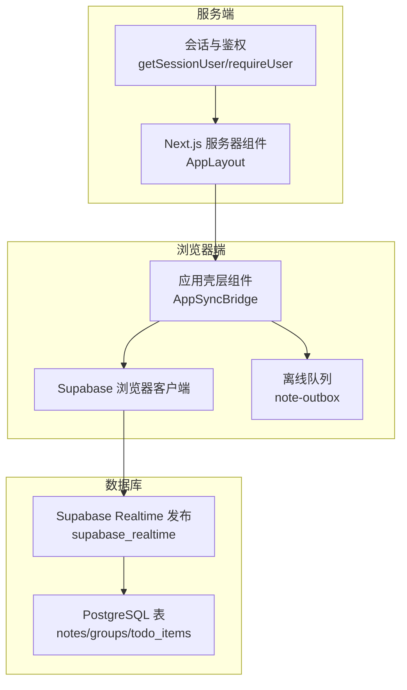
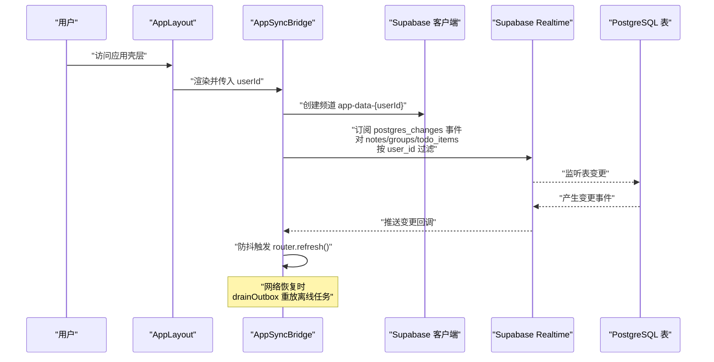
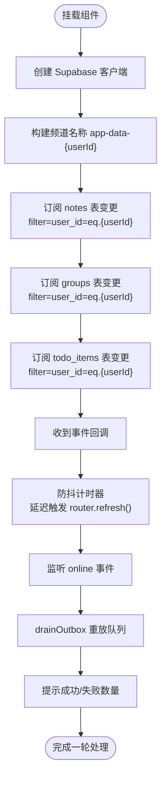
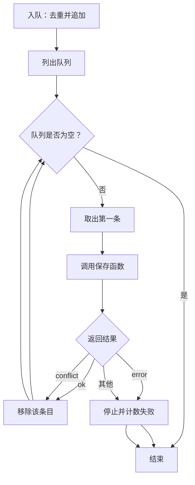
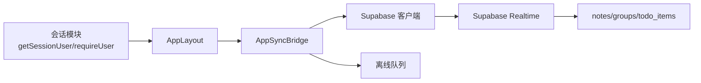

# Supabase Realtime 集成

<cite>
**本文引用的文件**
- [src/components/app/app-sync-bridge.tsx](file://src/components/app/app-sync-bridge.tsx)
- [src/lib/supabase/client.ts](file://src/lib/supabase/client.ts)
- [src/lib/supabase/server.ts](file://src/lib/supabase/server.ts)
- [src/app/(app)/layout.tsx](file://src/app/(app)/layout.tsx)
- [src/lib/offline/note-outbox.ts](file://src/lib/offline/note-outbox.ts)
- [src/actions/notes.ts](file://src/actions/notes.ts)
- [prisma/schema.prisma](file://prisma/schema.prisma)
- [supabase/migrations/20260513140000_realtime_publication.sql](file://supabase/migrations/20260513140000_realtime_publication.sql)
- [supabase/migrations/20260513000000_enable_rls_policies.sql](file://supabase/migrations/20260513000000_enable_rls_policies.sql)
- [src/lib/auth/session.ts](file://src/lib/auth/session.ts)
- [package.json](file://package.json)
</cite>

## 目录
1. [简介](#简介)
2. [项目结构](#项目结构)
3. [核心组件](#核心组件)
4. [架构总览](#架构总览)
5. [详细组件分析](#详细组件分析)
6. [依赖关系分析](#依赖关系分析)
7. [性能考虑](#性能考虑)
8. [故障排查指南](#故障排查指南)
9. [结论](#结论)
10. [附录](#附录)

## 简介
本文件系统性梳理本项目中的 Supabase Realtime 实时订阅集成方案，重点覆盖以下方面：
- 实时订阅建立流程：频道创建、事件过滤器配置、多表订阅策略
- postgres_changes 事件类型与过滤条件：user_id 过滤、表级订阅、事件类型监听
- 实时连接状态管理：连接建立、错误处理、断线重连机制
- 频道命名规范与用户隔离策略：app-data-{userId} 的设计原理
- 最佳实践：性能优化、内存管理、错误恢复
- 监控与调试方法

## 项目结构
本项目采用 Next.js 应用结构，Realtime 集成主要集中在应用壳层组件中，通过 Supabase 客户端在浏览器端订阅数据库变更，并结合离线队列与在线恢复机制实现健壮的数据一致性。

图表来源
- [src/components/app/app-sync-bridge.tsx:1-118](file://src/components/app/app-sync-bridge.tsx#L1-L118)
- [src/lib/supabase/client.ts:1-9](file://src/lib/supabase/client.ts#L1-L9)
- [src/app/(app)/layout.tsx](file://src/app/(app)/layout.tsx#L1-L53)
- [src/lib/offline/note-outbox.ts:1-87](file://src/lib/offline/note-outbox.ts#L1-L87)
- [prisma/schema.prisma:48-100](file://prisma/schema.prisma#L48-L100)
- [supabase/migrations/20260513140000_realtime_publication.sql:1-7](file://supabase/migrations/20260513140000_realtime_publication.sql#L1-L7)

章节来源
- [src/components/app/app-sync-bridge.tsx:1-118](file://src/components/app/app-sync-bridge.tsx#L1-L118)
- [src/app/(app)/layout.tsx](file://src/app/(app)/layout.tsx#L1-L53)

## 核心组件
- Supabase 浏览器客户端封装：负责在浏览器端创建 Supabase 客户端实例，暴露给订阅组件使用。
- 应用壳层实时桥接组件：在用户登录后创建实时频道，订阅多个业务表的变更事件，并通过防抖刷新页面数据。
- 离线队列与在线恢复：在网络恢复时将本地待提交的任务按序重放，提升用户体验与数据一致性。
- 会话与鉴权：确保只有登录用户才能获取实时订阅权限。

章节来源
- [src/lib/supabase/client.ts:1-9](file://src/lib/supabase/client.ts#L1-L9)
- [src/components/app/app-sync-bridge.tsx:1-118](file://src/components/app/app-sync-bridge.tsx#L1-L118)
- [src/lib/offline/note-outbox.ts:1-87](file://src/lib/offline/note-outbox.ts#L1-L87)
- [src/lib/auth/session.ts:1-19](file://src/lib/auth/session.ts#L1-L19)

## 架构总览
下图展示从用户登录到实时订阅建立、事件触发、页面刷新与离线恢复的整体流程。

图表来源
- [src/app/(app)/layout.tsx](file://src/app/(app)/layout.tsx#L12-L22)
- [src/components/app/app-sync-bridge.tsx:20-91](file://src/components/app/app-sync-bridge.tsx#L20-L91)
- [prisma/schema.prisma:48-100](file://prisma/schema.prisma#L48-L100)
- [supabase/migrations/20260513140000_realtime_publication.sql:1-7](file://supabase/migrations/20260513140000_realtime_publication.sql#L1-L7)

## 详细组件分析

### 组件一：实时订阅桥接 AppSyncBridge
- 职责
  - 在用户登录后创建实时频道 app-data-{userId}
  - 订阅 notes、groups、todo_items 三张表的 postgres_changes 事件
  - 使用 user_id 过滤器实现用户级隔离
  - 对收到的变更进行防抖刷新，避免频繁路由刷新
  - 在网络恢复时尝试将本地 outbox 队列重放并提示结果
- 关键点
  - 频道命名：app-data-{userId}，确保每个用户独立频道
  - 过滤条件：event="*"、schema="public"、table=业务表名、filter=`user_id=eq.{userId}`
  - 错误处理：订阅回调中捕获 CHANNEL_ERROR 并记录日志
  - 生命周期：组件卸载时移除频道，清理定时器

图表来源
- [src/components/app/app-sync-bridge.tsx:20-114](file://src/components/app/app-sync-bridge.tsx#L20-L114)

章节来源
- [src/components/app/app-sync-bridge.tsx:1-118](file://src/components/app/app-sync-bridge.tsx#L1-L118)

### 组件二：Supabase 客户端封装
- 浏览器端客户端：在浏览器中创建 Supabase 客户端，读取 NEXT_PUBLIC_* 环境变量
- 服务器端客户端：在服务器组件中创建客户端，通过 cookies 管理会话

章节来源
- [src/lib/supabase/client.ts:1-9](file://src/lib/supabase/client.ts#L1-L9)
- [src/lib/supabase/server.ts:1-29](file://src/lib/supabase/server.ts#L1-L29)

### 组件三：离线队列与在线恢复
- 队列模型：基于 localforage 的 IndexedDB 存储，队列条目包含 noteId 与文档 JSON
- 入队策略：同一 noteId 仅保留最后一次内容，去重并更新时间戳
- 出队与重放：按序取出第一条，调用保存函数，根据返回值决定移除或继续
- 结果统计：成功 flush 数量与失败数量，用于 UI 提示

图表来源
- [src/lib/offline/note-outbox.ts:26-86](file://src/lib/offline/note-outbox.ts#L26-L86)

章节来源
- [src/lib/offline/note-outbox.ts:1-87](file://src/lib/offline/note-outbox.ts#L1-L87)

### 组件四：会话与鉴权
- 获取当前用户：在服务器端通过 Supabase 客户端获取用户信息
- 强制登录：若未登录则重定向至登录页

章节来源
- [src/lib/auth/session.ts:1-19](file://src/lib/auth/session.ts#L1-L19)

## 依赖关系分析
- 应用壳层依赖会话模块获取 userId，再传递给实时桥接组件
- 实时桥接组件依赖 Supabase 浏览器客户端与离线队列
- 数据库层通过 RLS 策略与 Realtime 发布确保数据安全与可订阅性

图表来源
- [src/lib/auth/session.ts:1-19](file://src/lib/auth/session.ts#L1-L19)
- [src/app/(app)/layout.tsx](file://src/app/(app)/layout.tsx#L12-L22)
- [src/components/app/app-sync-bridge.tsx:20-91](file://src/components/app/app-sync-bridge.tsx#L20-L91)
- [prisma/schema.prisma:48-100](file://prisma/schema.prisma#L48-L100)

章节来源
- [src/app/(app)/layout.tsx](file://src/app/(app)/layout.tsx#L1-L53)
- [src/components/app/app-sync-bridge.tsx:1-118](file://src/components/app/app-sync-bridge.tsx#L1-L118)
- [prisma/schema.prisma:1-117](file://prisma/schema.prisma#L1-L117)

## 性能考虑
- 防抖刷新：对实时事件进行 900ms 防抖，减少不必要的 router.refresh 调用，降低前端渲染压力
- 单频道多表订阅：一个频道同时监听多张表，减少连接数与订阅开销
- 过滤器精准：通过 user_id 过滤缩小事件范围，避免无关数据处理
- 离线队列顺序重放：避免并发写入导致的冲突与回滚，提高吞吐与稳定性
- 环境变量与脚本：通过脚本统一启用 RLS 与 Realtime 发布，确保生产一致性

章节来源
- [src/components/app/app-sync-bridge.tsx:10-35](file://src/components/app/app-sync-bridge.tsx#L10-L35)
- [supabase/migrations/20260513140000_realtime_publication.sql:1-7](file://supabase/migrations/20260513140000_realtime_publication.sql#L1-L7)
- [supabase/migrations/20260513000000_enable_rls_policies.sql:1-203](file://supabase/migrations/20260513000000_enable_rls_policies.sql#L1-L203)
- [package.json:16-19](file://package.json#L16-L19)

## 故障排查指南
- 订阅错误处理
  - 当订阅状态为 CHANNEL_ERROR 时，组件会在控制台输出警告日志，便于定位问题
  - 建议检查 Supabase Realtime 是否启用、发布表是否包含目标表、过滤条件是否正确
- 网络异常与离线恢复
  - 监听 window.online 事件，在网络恢复时调用 drainOutbox 重放队列
  - 若出现冲突或错误，UI 会提示成功/失败数量，便于用户感知
- 数据一致性
  - 若发现某些用户能看到他人数据，请检查 RLS 策略是否生效以及发布表配置
- 环境变量
  - 确认 NEXT_PUBLIC_SUPABASE_URL 与 NEXT_PUBLIC_SUPABASE_ANON_KEY 已正确配置

章节来源
- [src/components/app/app-sync-bridge.tsx:79-114](file://src/components/app/app-sync-bridge.tsx#L79-L114)
- [supabase/migrations/20260513140000_realtime_publication.sql:1-7](file://supabase/migrations/20260513140000_realtime_publication.sql#L1-L7)
- [supabase/migrations/20260513000000_enable_rls_policies.sql:1-203](file://supabase/migrations/20260513000000_enable_rls_policies.sql#L1-L203)

## 结论
本项目的 Supabase Realtime 集成以“单频道多表订阅 + 精准过滤 + 防抖刷新 + 离线队列重放”为核心设计，既保证了用户级隔离与数据安全，又兼顾了性能与用户体验。通过 RLS 与 Realtime 发布的配合，系统实现了稳定可靠的实时同步能力。

## 附录

### postgres_changes 事件类型与过滤条件详解
- 事件类型：postgres_changes
- 过滤条件
  - event: "*"（监听所有事件类型）
  - schema: "public"（指定模式）
  - table: "notes"|"groups"|"todo_items"（指定表）
  - filter: "user_id=eq.{userId}"（按用户 ID 过滤）

章节来源
- [src/components/app/app-sync-bridge.tsx:44-78](file://src/components/app/app-sync-bridge.tsx#L44-L78)

### 频道命名规范与用户隔离策略
- 频道命名：app-data-{userId}
- 设计原理
  - 每个用户拥有独立频道，天然实现用户隔离
  - 便于扩展：可在频道上叠加更多用户维度的过滤条件
  - 易于监控：通过频道名可快速定位用户会话

章节来源
- [src/components/app/app-sync-bridge.tsx:39-40](file://src/components/app/app-sync-bridge.tsx#L39-L40)

### 多表订阅策略
- 订阅对象：notes、groups、todo_items
- 目的：统一监听用户相关数据变更，触发页面刷新
- 优势：减少连接数、简化逻辑、提升一致性

章节来源
- [src/components/app/app-sync-bridge.tsx:41-78](file://src/components/app/app-sync-bridge.tsx#L41-L78)
- [prisma/schema.prisma:48-100](file://prisma/schema.prisma#L48-L100)

### 数据库与发布配置
- RLS 策略：为 profiles、groups、notes、todo_items、push_subscriptions 启用行级安全策略，确保数据隔离
- Realtime 发布：将 notes、groups、todo_items 加入 supabase_realtime 发布，供客户端订阅

章节来源
- [supabase/migrations/20260513000000_enable_rls_policies.sql:1-203](file://supabase/migrations/20260513000000_enable_rls_policies.sql#L1-L203)
- [supabase/migrations/20260513140000_realtime_publication.sql:1-7](file://supabase/migrations/20260513140000_realtime_publication.sql#L1-L7)