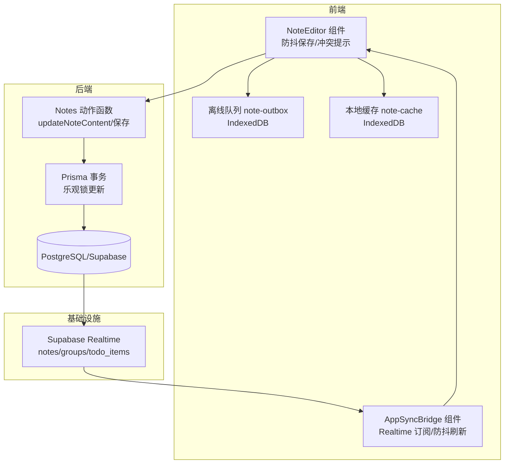
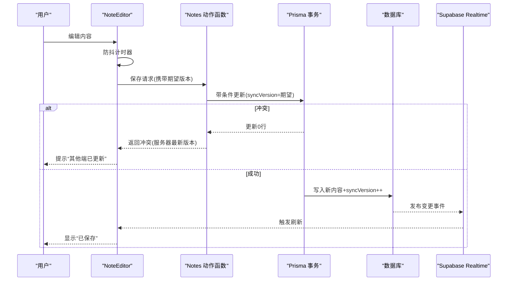
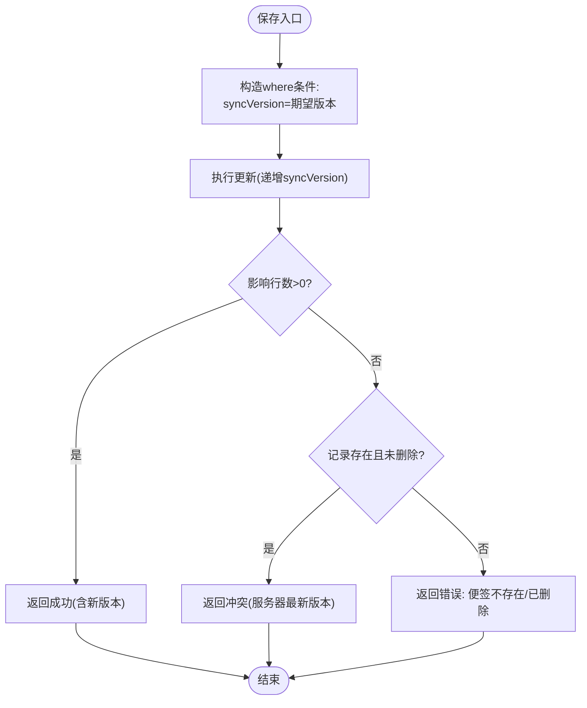
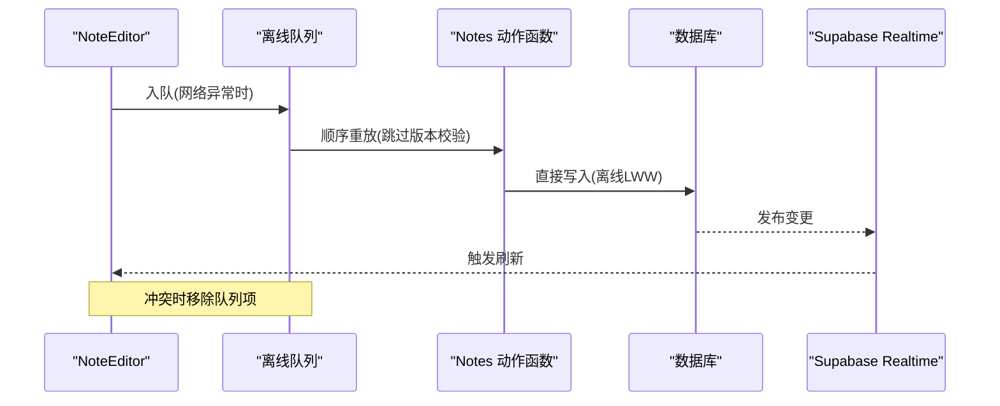
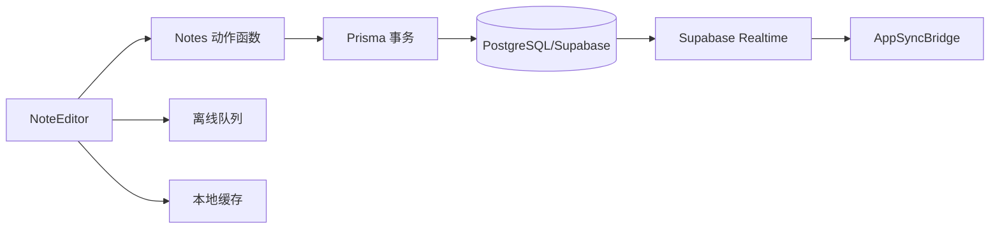
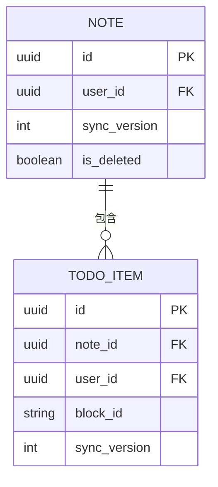

# 冲突检测与解决

<cite>
**本文引用的文件**
- [app-sync-bridge.tsx](file://src/components/app/app-sync-bridge.tsx)
- [notes.ts](file://src/actions/notes.ts)
- [note-outbox.ts](file://src/lib/offline/note-outbox.ts)
- [note-cache.ts](file://src/lib/offline/note-cache.ts)
- [note-editor.tsx](file://src/components/editor/note-editor.tsx)
- [schema.prisma](file://prisma/schema.prisma)
- [20260513140000_realtime_publication.sql](file://supabase/migrations/20260513140000_realtime_publication.sql)
- [20260513000000_enable_rls_policies.sql](file://supabase/migrations/20260513000000_enable_rls_policies.sql)
- [proxy.ts](file://src/lib/supabase/proxy.ts)
- [需求文档.md](file://需求文档.md)
</cite>

## 目录
1. [简介](#简介)
2. [项目结构](#项目结构)
3. [核心组件](#核心组件)
4. [架构总览](#架构总览)
5. [详细组件分析](#详细组件分析)
6. [依赖关系分析](#依赖关系分析)
7. [性能考量](#性能考量)
8. [故障排查指南](#故障排查指南)
9. [结论](#结论)
10. [附录](#附录)

## 简介
本文件围绕“冲突检测与解决”主题，系统性梳理本项目的同步与并发控制机制。项目采用“乐观锁 + 实时订阅 + 离线队列”的组合方案，以 syncVersion 字段作为版本号实现最后写入者获胜（LWW）策略，并通过 Supabase Realtime 实现实时刷新与远程更新提示。同时，针对多设备并发编辑场景，提供冲突检测、离线重放、用户提示与手动刷新等综合能力。

## 项目结构
本项目围绕“便签”与“待办”两大实体构建，其中便签内容以 Tiptap JSON 存储，配合 syncVersion 字段进行乐观锁控制。前端通过编辑器组件进行防抖保存，后端通过动作函数执行带版本条件的更新，数据库层通过 Prisma 事务保证一致性。实时订阅与离线队列分别负责远端变更感知与网络异常时的持久化重试。

图表来源
- [note-editor.tsx:138-189](file://src/components/editor/note-editor.tsx#L138-L189)
- [notes.ts:59-138](file://src/actions/notes.ts#L59-L138)
- [app-sync-bridge.tsx:37-83](file://src/components/app/app-sync-bridge.tsx#L37-L83)
- [note-outbox.ts:49-86](file://src/lib/offline/note-outbox.ts#L49-L86)
- [note-cache.ts:18-24](file://src/lib/offline/note-cache.ts#L18-L24)

章节来源
- [需求文档.md:25-26](file://需求文档.md#L25-L26)

## 核心组件
- 乐观锁与版本号
  - 数据模型：便签与待办项均包含 syncVersion 字段，用于乐观锁控制与冲突检测。
  - 更新策略：每次成功保存时递增 syncVersion；若目标记录的 syncVersion 与期望值不一致，则判定为冲突。
- 编辑器与防抖保存
  - 编辑器组件在内容变化时进行防抖保存，携带 lastSavedSyncVersion 作为期望版本，避免覆盖他人修改。
- 实时订阅与刷新
  - 应用壳组件订阅 notes/groups/todo_items 的实时变更，统一进行防抖刷新，确保页面与远端保持一致。
- 离线队列与重放
  - 网络异常时将保存任务入队，联网后顺序重放；离线重放默认跳过版本校验，采用 LWW 策略以本地最新为准。
- 本地缓存
  - 成功保存后写入本地缓存，记录 contentJson、syncVersion 与 savedAt，用于快速恢复与去重。

章节来源
- [schema.prisma:49-75](file://prisma/schema.prisma#L49-L75)
- [notes.ts:59-138](file://src/actions/notes.ts#L59-L138)
- [note-editor.tsx:138-189](file://src/components/editor/note-editor.tsx#L138-L189)
- [app-sync-bridge.tsx:37-83](file://src/components/app/app-sync-bridge.tsx#L37-L83)
- [note-outbox.ts:49-86](file://src/lib/offline/note-outbox.ts#L49-L86)
- [note-cache.ts:18-24](file://src/lib/offline/note-cache.ts#L18-L24)

## 架构总览
下图展示从编辑器发起保存到数据库更新、实时广播、远端感知与离线重放的整体流程。

图表来源
- [note-editor.tsx:138-189](file://src/components/editor/note-editor.tsx#L138-L189)
- [notes.ts:59-138](file://src/actions/notes.ts#L59-L138)
- [app-sync-bridge.tsx:37-83](file://src/components/app/app-sync-bridge.tsx#L37-L83)

## 详细组件分析

### 乐观锁与版本号设计
- 设计要点
  - syncVersion 作为全局递增版本号，用于标识记录的最新状态。
  - 保存时以“期望版本=当前本地版本”作为 where 条件，成功则递增版本；失败则判定为冲突。
- 冲突检测算法
  - 若更新影响行数为0，且目标记录存在且未删除，则返回冲突，并告知服务器最新版本。
- 并发控制策略
  - 在线保存严格遵循乐观锁；离线重放默认跳过版本校验，采用 LWW 以本地最新为准，避免因网络抖动导致的反复冲突。

图表来源
- [notes.ts:70-138](file://src/actions/notes.ts#L70-L138)

章节来源
- [notes.ts:59-138](file://src/actions/notes.ts#L59-L138)
- [schema.prisma:49-75](file://prisma/schema.prisma#L49-L75)

### 多设备并发编辑与冲突场景
- 场景一：编辑器在线保存
  - 当服务器返回冲突时，编辑器提示“其他端已更新”，引导用户刷新或手动处理。
- 场景二：离线重放
  - 离线队列按顺序重放保存请求；若重放过程中发生冲突，视为失败并移除队列项，避免无限循环。
- 场景三：实时订阅
  - 当服务器收到新版本时，Realtime 推送变更；AppSyncBridge 防抖刷新页面，编辑器检测到服务器版本较新时提示“载入最新”。

图表来源
- [note-editor.tsx:138-189](file://src/components/editor/note-editor.tsx#L138-L189)
- [note-outbox.ts:49-86](file://src/lib/offline/note-outbox.ts#L49-L86)
- [app-sync-bridge.tsx:37-83](file://src/components/app/app-sync-bridge.tsx#L37-L83)

章节来源
- [note-editor.tsx:138-189](file://src/components/editor/note-editor.tsx#L138-L189)
- [note-outbox.ts:49-86](file://src/lib/offline/note-outbox.ts#L49-L86)
- [app-sync-bridge.tsx:37-83](file://src/components/app/app-sync-bridge.tsx#L37-L83)

### 版本比较与冲突标识
- 版本比较
  - 编辑器保存时携带 lastSavedSyncVersion 作为期望版本；服务器对比数据库中当前 syncVersion，一致则允许更新。
- 冲突标识
  - 服务器返回结构中包含 conflict 标志与 serverSyncVersion，前端据此判断是否提示冲突。
- 区分本地修改与远程更新
  - 本地修改：编辑器在本地维护 lastSavedSyncVersion；当服务器版本大于本地版本且存在本地未提交修改时，提示“其他端已更新”。
  - 远程更新：通过 Realtime 推送触发刷新，编辑器根据 initialContent 与服务器版本决定是否覆盖本地内容。

章节来源
- [note-editor.tsx:236-263](file://src/components/editor/note-editor.tsx#L236-L263)
- [notes.ts:125-131](file://src/actions/notes.ts#L125-L131)

### 用户体验设计
- 冲突提示
  - 保存冲突时显示提示并提供“重新加载”操作；离线保存失败时提示加入本地队列并在联网后自动重放。
- 手动解决选项
  - 提供“载入最新”按钮，允许用户强制以服务器内容为准。
- 自动合并策略
  - 离线重放默认采用 LWW，以本地最新为准；对于需要精细合并的场景，可在上层扩展合并算法（例如基于内容差异的增量合并）。

章节来源
- [note-editor.tsx:157-165](file://src/components/editor/note-editor.tsx#L157-L165)
- [note-editor.tsx:249-262](file://src/components/editor/note-editor.tsx#L249-L262)
- [note-outbox.ts:49-86](file://src/lib/offline/note-outbox.ts#L49-L86)

### 冲突预防与最佳实践
- 编辑锁定
  - 可在 UI 层增加“正在编辑”状态提示，减少多人同时编辑的概率。
- 实时反馈
  - 使用 Realtime 订阅与防抖刷新，确保用户能及时感知远端变更。
- 用户协作
  - 在团队场景下，建议通过分组或标签隔离不同作者的内容，降低冲突频率。
- 离线策略
  - 优先使用离线队列进行重放，避免频繁网络抖动引发的冲突风暴。

章节来源
- [app-sync-bridge.tsx:37-83](file://src/components/app/app-sync-bridge.tsx#L37-L83)
- [note-outbox.ts:49-86](file://src/lib/offline/note-outbox.ts#L49-L86)

### 监控与统计
- 建议指标
  - 冲突次数、离线队列重放成功率、平均保存延迟、实时刷新频率。
- 收集方式
  - 在动作函数返回结果处埋点；在 AppSyncBridge 刷新与离线重放完成后记录统计。
- 报告维度
  - 按用户、设备、时间窗口统计，辅助优化保存策略与网络策略。

（本节为通用指导，无需特定文件引用）

## 依赖关系分析
- 组件耦合
  - NoteEditor 依赖 Notes 动作函数与离线队列；AppSyncBridge 依赖 Supabase Realtime；离线队列与本地缓存独立于主流程但提升可用性。
- 外部依赖
  - Supabase Realtime 用于远端变更通知；IndexedDB 用于离线队列与缓存；Prisma 用于数据库访问与事务控制。
- 安全与策略
  - 数据库启用 RLS 策略，确保用户只能访问自己的数据；Realtime publication 需要显式添加业务表。

图表来源
- [note-editor.tsx:138-189](file://src/components/editor/note-editor.tsx#L138-L189)
- [notes.ts:59-138](file://src/actions/notes.ts#L59-L138)
- [app-sync-bridge.tsx:37-83](file://src/components/app/app-sync-bridge.tsx#L37-L83)
- [note-outbox.ts:49-86](file://src/lib/offline/note-outbox.ts#L49-L86)
- [note-cache.ts:18-24](file://src/lib/offline/note-cache.ts#L18-L24)

章节来源
- [20260513140000_realtime_publication.sql:4-6](file://supabase/migrations/20260513140000_realtime_publication.sql#L4-L6)
- [20260513000000_enable_rls_policies.sql:36-41](file://supabase/migrations/20260513000000_enable_rls_policies.sql#L36-L41)
- [proxy.ts:15-51](file://src/lib/supabase/proxy.ts#L15-L51)

## 性能考量
- 防抖与批处理
  - 编辑器与 AppSyncBridge 均采用防抖策略，降低频繁刷新与数据库写入压力。
- 乐观锁成本
  - 乐观锁在高并发下可能增加冲突概率，可通过合理的保存间隔与 UI 反馈缓解。
- 离线队列
  - IndexedDB 写入与顺序重放可能成为瓶颈，建议限制队列长度并定期清理失败项。

（本节为通用指导，无需特定文件引用）

## 故障排查指南
- 常见问题
  - 保存冲突：检查期望版本是否与服务器最新版本一致；确认网络稳定后再试。
  - 离线重放失败：查看离线队列中对应笔记条目是否被移除；检查网络连接与服务端状态。
  - 实时刷新无响应：确认 Supabase Realtime 已启用且 publication 中包含 notes/groups/todo_items。
- 定位手段
  - 在动作函数与 AppSyncBridge 中增加日志输出；利用浏览器开发者工具观察网络与 IndexedDB 状态。
- 修复建议
  - 对于持续冲突的笔记，建议用户选择“载入最新”并重新编辑；必要时拆分编辑范围或延长保存间隔。

章节来源
- [notes.ts:121-133](file://src/actions/notes.ts#L121-L133)
- [app-sync-bridge.tsx:79-83](file://src/components/app/app-sync-bridge.tsx#L79-L83)
- [20260513140000_realtime_publication.sql:4-6](file://supabase/migrations/20260513140000_realtime_publication.sql#L4-L6)

## 结论
本项目通过 syncVersion 乐观锁、Supabase Realtime 实时订阅与 IndexedDB 离线队列，实现了稳健的多设备并发编辑支持。在线场景采用严格乐观锁，离线场景采用 LWW 降级策略，结合用户提示与手动刷新，形成完整的冲突检测与解决闭环。建议在实际部署中结合监控指标持续优化保存策略与网络容错能力。

## 附录
- 数据模型概览（与同步相关的关键字段）
  - 便签：id、userId、contentJson、contentText、syncVersion、isDeleted
  - 待办项：id、noteId、userId、blockId、syncVersion
- 实时订阅表清单
  - notes、groups、todo_items

图表来源
- [schema.prisma:49-75](file://prisma/schema.prisma#L49-L75)
- [schema.prisma:78-100](file://prisma/schema.prisma#L78-L100)