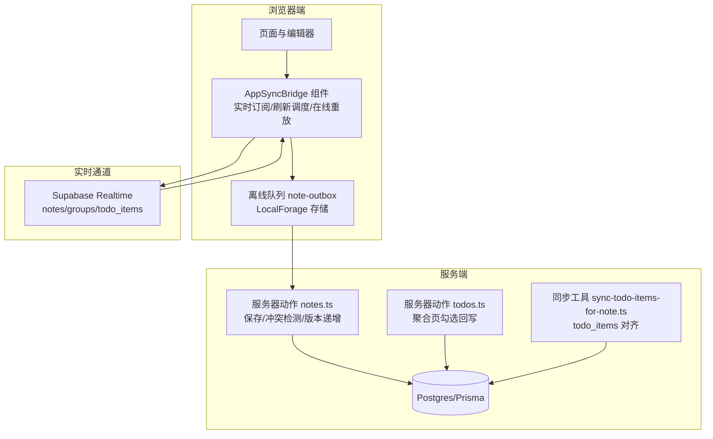
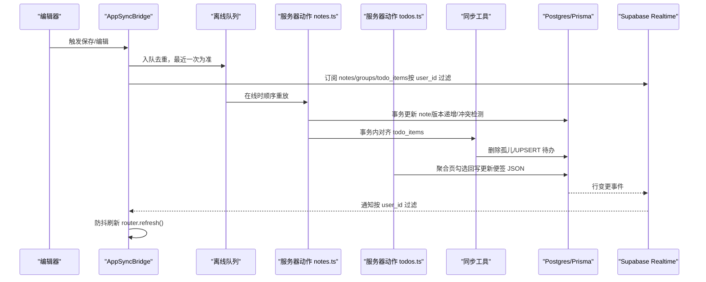
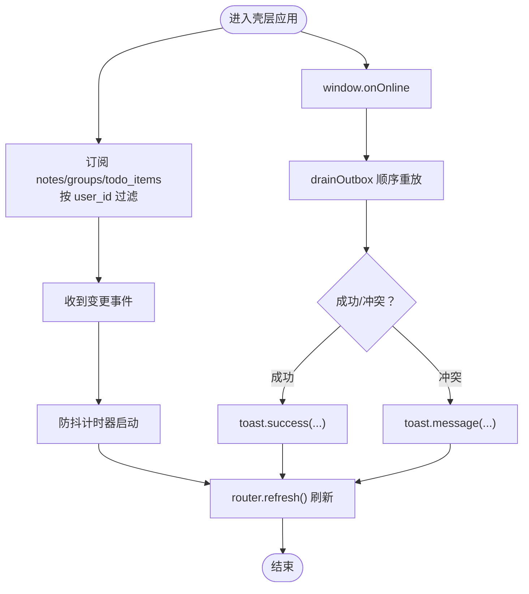
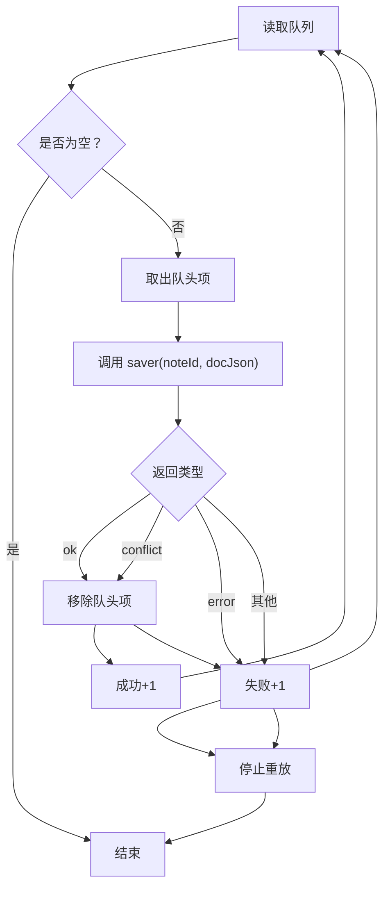
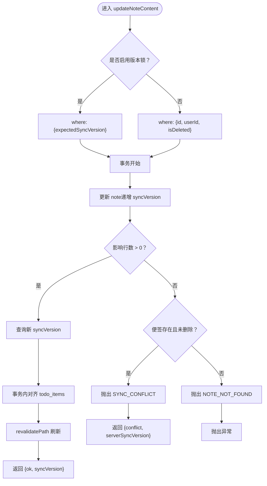
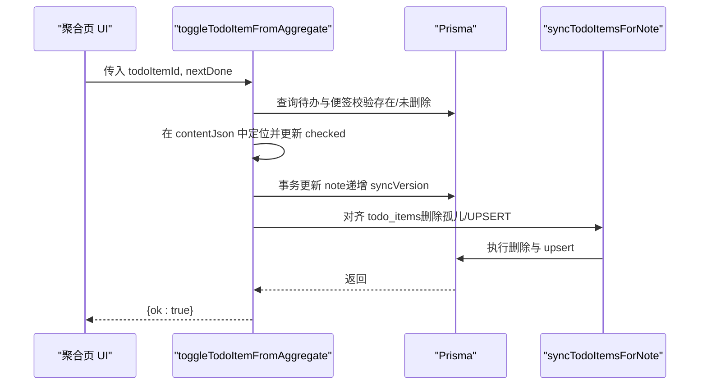
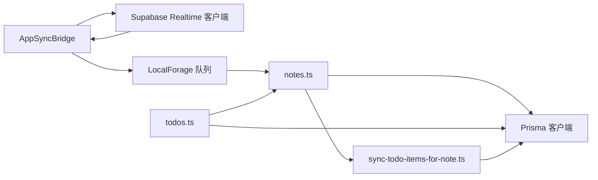

# 多设备同步策略

<cite>
**本文引用的文件**
- [src/components/app/app-sync-bridge.tsx](file://src/components/app/app-sync-bridge.tsx)
- [src/lib/offline/note-outbox.ts](file://src/lib/offline/note-outbox.ts)
- [src/actions/notes.ts](file://src/actions/notes.ts)
- [src/actions/todos.ts](file://src/actions/todos.ts)
- [src/lib/todo/sync-todo-items-for-note.ts](file://src/lib/todo/sync-todo-items-for-note.ts)
- [src/lib/tiptap/todo-doc.ts](file://src/lib/tiptap/todo-doc.ts)
- [src/lib/tiptap/content.ts](file://src/lib/tiptap/content.ts)
- [src/lib/auth/session.ts](file://src/lib/auth/session.ts)
- [src/lib/supabase/client.ts](file://src/lib/supabase/client.ts)
- [src/lib/db/index.ts](file://src/lib/db/index.ts)
- [prisma/schema.prisma](file://prisma/schema.prisma)
- [supabase/migrations/20260513140000_realtime_publication.sql](file://supabase/migrations/20260513140000_realtime_publication.sql)
</cite>

## 目录
1. [引言](#引言)
2. [项目结构](#项目结构)
3. [核心组件](#核心组件)
4. [架构总览](#架构总览)
5. [详细组件分析](#详细组件分析)
6. [依赖关系分析](#依赖关系分析)
7. [性能考量](#性能考量)
8. [故障排查指南](#故障排查指南)
9. [结论](#结论)
10. [附录](#附录)

## 引言
本文件面向多设备同步场景，系统性梳理本项目的同步策略与实现要点，覆盖以下主题：
- 跨设备挑战与对策：网络延迟、并发编辑、数据一致性
- 用户隔离与权限控制：基于用户维度的数据边界
- 同步频率与性能优化：增量同步、批量处理、网络状态感知
- 设备间协调：编辑独占、冲突避免、状态同步
- 离线同步：本地缓存、队列管理、重试机制
- 监控与诊断：同步状态跟踪、性能指标、错误日志
- 配置与调优：可调整参数与最佳实践

## 项目结构
本项目采用 Next.js 应用，数据库为 Supabase Postgres + Prisma，前端通过 Supabase Realtime 实时订阅业务表变更，配合本地离线队列实现跨设备同步。

图表来源
- [src/components/app/app-sync-bridge.tsx:1-118](file://src/components/app/app-sync-bridge.tsx#L1-L118)
- [src/lib/offline/note-outbox.ts:1-87](file://src/lib/offline/note-outbox.ts#L1-L87)
- [src/actions/notes.ts:1-230](file://src/actions/notes.ts#L1-L230)
- [src/actions/todos.ts:1-70](file://src/actions/todos.ts#L1-L70)
- [src/lib/todo/sync-todo-items-for-note.ts:1-59](file://src/lib/todo/sync-todo-items-for-note.ts#L1-L59)
- [prisma/schema.prisma:1-117](file://prisma/schema.prisma#L1-L117)
- [supabase/migrations/20260513140000_realtime_publication.sql:1-7](file://supabase/migrations/20260513140000_realtime_publication.sql#L1-L7)

章节来源
- [src/components/app/app-sync-bridge.tsx:1-118](file://src/components/app/app-sync-bridge.tsx#L1-L118)
- [src/lib/offline/note-outbox.ts:1-87](file://src/lib/offline/note-outbox.ts#L1-L87)
- [src/actions/notes.ts:1-230](file://src/actions/notes.ts#L1-L230)
- [src/actions/todos.ts:1-70](file://src/actions/todos.ts#L1-L70)
- [src/lib/todo/sync-todo-items-for-note.ts:1-59](file://src/lib/todo/sync-todo-items-for-note.ts#L1-L59)
- [prisma/schema.prisma:1-117](file://prisma/schema.prisma#L1-L117)
- [supabase/migrations/20260513140000_realtime_publication.sql:1-7](file://supabase/migrations/20260513140000_realtime_publication.sql#L1-L7)

## 核心组件
- AppSyncBridge：负责实时订阅、防抖刷新、在线重放离线队列
- 离线队列 note-outbox：本地持久化待上传任务，支持去重与顺序重放
- 服务器动作 notes.ts：保存便签内容、版本递增、冲突检测、路径失效
- 服务器动作 todos.ts：聚合页勾选回写，触发便签内容更新与待办对齐
- 同步工具 sync-todo-items-for-note.ts：事务内全量对齐 todo_items
- Tiptap 工具：ensureTaskItemBlockIds、extractTodosFromDocJson、applyTaskItemCheckedInDoc、deriveTitleAndPlainText
- 认证与数据库：requireUser、Prisma 客户端、Supabase Realtime 发布表

章节来源
- [src/components/app/app-sync-bridge.tsx:1-118](file://src/components/app/app-sync-bridge.tsx#L1-L118)
- [src/lib/offline/note-outbox.ts:1-87](file://src/lib/offline/note-outbox.ts#L1-L87)
- [src/actions/notes.ts:1-230](file://src/actions/notes.ts#L1-L230)
- [src/actions/todos.ts:1-70](file://src/actions/todos.ts#L1-L70)
- [src/lib/todo/sync-todo-items-for-note.ts:1-59](file://src/lib/todo/sync-todo-items-for-note.ts#L1-L59)
- [src/lib/tiptap/todo-doc.ts:1-101](file://src/lib/tiptap/todo-doc.ts#L1-L101)
- [src/lib/tiptap/content.ts:1-53](file://src/lib/tiptap/content.ts#L1-L53)
- [src/lib/auth/session.ts:1-19](file://src/lib/auth/session.ts#L1-L19)
- [src/lib/db/index.ts:1-16](file://src/lib/db/index.ts#L1-L16)

## 架构总览
下图展示从编辑器到数据库与实时通道的整体流程，以及离线队列的重放路径。

图表来源
- [src/components/app/app-sync-bridge.tsx:1-118](file://src/components/app/app-sync-bridge.tsx#L1-L118)
- [src/lib/offline/note-outbox.ts:1-87](file://src/lib/offline/note-outbox.ts#L1-L87)
- [src/actions/notes.ts:1-230](file://src/actions/notes.ts#L1-L230)
- [src/actions/todos.ts:1-70](file://src/actions/todos.ts#L1-L70)
- [src/lib/todo/sync-todo-items-for-note.ts:1-59](file://src/lib/todo/sync-todo-items-for-note.ts#L1-L59)
- [prisma/schema.prisma:1-117](file://prisma/schema.prisma#L1-L117)
- [supabase/migrations/20260513140000_realtime_publication.sql:1-7](file://supabase/migrations/20260513140000_realtime_publication.sql#L1-L7)

## 详细组件分析

### AppSyncBridge：实时订阅与离线重放
- 实时订阅
  - 使用 Supabase Realtime 订阅 notes、groups、todo_items 三张业务表
  - 通过 channel 名称与过滤条件实现 per-user 隔离（按 user_id 过滤）
- 刷新调度
  - 对收到的变更事件进行防抖（固定延迟），减少频繁刷新
- 在线重放
  - 监听 online 事件，调用离线队列 drainOutbox 顺序重放
  - 成功/失败统计并通过 toast 告知用户

图表来源
- [src/components/app/app-sync-bridge.tsx:1-118](file://src/components/app/app-sync-bridge.tsx#L1-L118)
- [src/lib/offline/note-outbox.ts:1-87](file://src/lib/offline/note-outbox.ts#L1-L87)

章节来源
- [src/components/app/app-sync-bridge.tsx:1-118](file://src/components/app/app-sync-bridge.tsx#L1-L118)

### 离线队列：本地持久化与顺序重放
- 存储介质：LocalForage 分区存储，键名为待保存列表
- 去重策略：同一 noteId 仅保留最新一次入队内容
- 顺序重放：按队列头元素逐个执行，支持三种结果分支
- 结果处理：
  - 成功：移除队列项，计数 +1
  - 冲突：视为“已处理”，移除队列项，失败计数 +1
  - 错误：停止后续重放，失败计数 +1

图表来源
- [src/lib/offline/note-outbox.ts:1-87](file://src/lib/offline/note-outbox.ts#L1-L87)

章节来源
- [src/lib/offline/note-outbox.ts:1-87](file://src/lib/offline/note-outbox.ts#L1-L87)

### 服务器动作 notes.ts：保存与冲突检测
- 输入：noteId、Tiptap JSON、期望版本/跳过版本校验标志
- 版本锁：当未显式跳过时，使用 expectedSyncVersion 作为 where 条件
- 写入：更新 contentJson、contentText、title，并递增 syncVersion
- 冲突检测：若更新影响行数为 0，则判定为冲突，返回服务器当前 syncVersion
- 事务内对齐：调用 syncTodoItemsForNote，保证便签与待办子集一致
- 路径失效：刷新相关路由，驱动 Next.js 重新拉取数据

图表来源
- [src/actions/notes.ts:1-230](file://src/actions/notes.ts#L1-L230)
- [src/lib/todo/sync-todo-items-for-note.ts:1-59](file://src/lib/todo/sync-todo-items-for-note.ts#L1-L59)

章节来源
- [src/actions/notes.ts:1-230](file://src/actions/notes.ts#L1-L230)
- [src/lib/todo/sync-todo-items-for-note.ts:1-59](file://src/lib/todo/sync-todo-items-for-note.ts#L1-L59)

### 服务器动作 todos.ts：聚合页勾选回写
- 场景：在“待办聚合”页勾选完成，需要回写到便签 JSON 并同步 todo_items
- 步骤：
  - 校验待办存在且所属便签未被删除
  - 在便签 contentJson 中定位对应 blockId 的 taskItem 并更新 checked
  - 重新派生 contentText 与 title
  - 事务内更新便签并递增 syncVersion，随后对齐 todo_items
  - 刷新相关路由

图表来源
- [src/actions/todos.ts:1-70](file://src/actions/todos.ts#L1-L70)
- [src/lib/todo/sync-todo-items-for-note.ts:1-59](file://src/lib/todo/sync-todo-items-for-note.ts#L1-L59)

章节来源
- [src/actions/todos.ts:1-70](file://src/actions/todos.ts#L1-L70)
- [src/lib/todo/sync-todo-items-for-note.ts:1-59](file://src/lib/todo/sync-todo-items-for-note.ts#L1-L59)

### Tiptap 工具：文档解析与块 ID 确保
- ensureTaskItemBlockIds：为缺失稳定 blockId 的 taskItem 注入稳定标识，便于跨端对齐
- extractTodosFromDocJson：从 contentJson 抽取待办行（含 blockId、文本、完成状态、到期/提醒时间）
- applyTaskItemCheckedInDoc：按 blockId 更新指定 taskItem 的 checked 状态
- deriveTitleAndPlainText：从 JSON 派生纯文本与标题（首行非空文本，截断至长度限制）

章节来源
- [src/lib/tiptap/todo-doc.ts:1-101](file://src/lib/tiptap/todo-doc.ts#L1-L101)
- [src/lib/tiptap/content.ts:1-53](file://src/lib/tiptap/content.ts#L1-L53)

### 数据模型与用户隔离
- 用户隔离：所有业务表均通过 userId 字段关联用户；实时订阅与数据库查询均按 userId 过滤
- 关键字段：
  - Note.syncVersion：用于 LWW 冲突解决
  - TodoItem.blockId：与 Tiptap taskItem 的 attrs.id 对齐
  - TodoItem.syncVersion：随 note.syncVersion 递增，用于对齐一致性
- 索引与约束：为常用查询建立索引，唯一约束保证 blockId 唯一

章节来源
- [prisma/schema.prisma:1-117](file://prisma/schema.prisma#L1-L117)
- [supabase/migrations/20260513140000_realtime_publication.sql:1-7](file://supabase/migrations/20260513140000_realtime_publication.sql#L1-L7)

## 依赖关系分析
- 组件耦合
  - AppSyncBridge 依赖 Supabase Realtime 客户端与离线队列
  - 服务器动作依赖 Prisma 客户端与认证上下文
  - 同步工具依赖 Tiptap 解析能力
- 外部依赖
  - Supabase Realtime：实时订阅业务表变更
  - LocalForage：本地持久化离线队列
  - Prisma：数据库访问与事务

图表来源
- [src/components/app/app-sync-bridge.tsx:1-118](file://src/components/app/app-sync-bridge.tsx#L1-L118)
- [src/lib/offline/note-outbox.ts:1-87](file://src/lib/offline/note-outbox.ts#L1-L87)
- [src/actions/notes.ts:1-230](file://src/actions/notes.ts#L1-L230)
- [src/actions/todos.ts:1-70](file://src/actions/todos.ts#L1-L70)
- [src/lib/todo/sync-todo-items-for-note.ts:1-59](file://src/lib/todo/sync-todo-items-for-note.ts#L1-L59)
- [src/lib/db/index.ts:1-16](file://src/lib/db/index.ts#L1-L16)

章节来源
- [src/components/app/app-sync-bridge.tsx:1-118](file://src/components/app/app-sync-bridge.tsx#L1-L118)
- [src/lib/offline/note-outbox.ts:1-87](file://src/lib/offline/note-outbox.ts#L1-L87)
- [src/actions/notes.ts:1-230](file://src/actions/notes.ts#L1-L230)
- [src/actions/todos.ts:1-70](file://src/actions/todos.ts#L1-L70)
- [src/lib/todo/sync-todo-items-for-note.ts:1-59](file://src/lib/todo/sync-todo-items-for-note.ts#L1-L59)
- [src/lib/db/index.ts:1-16](file://src/lib/db/index.ts#L1-L16)

## 性能考量
- 同步频率
  - 防抖刷新：固定延迟降低频繁刷新带来的资源消耗
  - 在线重放：仅在网络恢复时批量重放，避免高频网络请求
- 增量同步
  - 通过 Note.syncVersion 实现 LWW 冲突解决，避免全量比对
  - TodoItem 与 Note 的同步在事务内完成，减少中间态
- 批量处理
  - 离线队列顺序重放，减少并发写入冲突
- 网络状态感知
  - 监听 online 事件，自动触发重放
  - 无网状态下仅入队，不阻塞用户操作
- 数据库层面
  - 为常用查询建立索引，减少查询开销
  - 事务内完成便签与待办的对齐，保证一致性

## 故障排查指南
- 冲突与版本问题
  - 现象：保存返回冲突，提示服务器当前版本
  - 排查：确认 expectedSyncVersion 是否正确传递；检查 AppSyncBridge 是否及时刷新
  - 参考
    - [src/actions/notes.ts:120-133](file://src/actions/notes.ts#L120-L133)
- 离线重放失败
  - 现象：部分草稿未能上传，提示冲突或错误
  - 排查：查看离线队列剩余条目；检查 saver 返回值；确认网络状态
  - 参考
    - [src/components/app/app-sync-bridge.tsx:93-114](file://src/components/app/app-sync-bridge.tsx#L93-L114)
    - [src/lib/offline/note-outbox.ts:48-86](file://src/lib/offline/note-outbox.ts#L48-L86)
- 实时订阅异常
  - 现象：收到 CHANNEL_ERROR 或无更新
  - 排查：确认 Supabase Realtime 已启用；检查 publication 是否包含业务表；核对 channelName 与过滤条件
  - 参考
    - [supabase/migrations/20260513140000_realtime_publication.sql:1-7](file://supabase/migrations/20260513140000_realtime_publication.sql#L1-L7)
    - [src/components/app/app-sync-bridge.tsx:79-83](file://src/components/app/app-sync-bridge.tsx#L79-L83)
- 权限与用户隔离
  - 现象：看到他人数据或无法看到自己的数据
  - 排查：确认 requireUser 是否正确；检查数据库查询与实时订阅是否按 userId 过滤
  - 参考
    - [src/lib/auth/session.ts:12-18](file://src/lib/auth/session.ts#L12-L18)
    - [src/actions/notes.ts:72-75](file://src/actions/notes.ts#L72-L75)
    - [src/components/app/app-sync-bridge.tsx:38-91](file://src/components/app/app-sync-bridge.tsx#L38-L91)

章节来源
- [src/actions/notes.ts:120-133](file://src/actions/notes.ts#L120-L133)
- [src/components/app/app-sync-bridge.tsx:93-114](file://src/components/app/app-sync-bridge.tsx#L93-L114)
- [src/lib/offline/note-outbox.ts:48-86](file://src/lib/offline/note-outbox.ts#L48-L86)
- [supabase/migrations/20260513140000_realtime_publication.sql:1-7](file://supabase/migrations/20260513140000_realtime_publication.sql#L1-L7)
- [src/components/app/app-sync-bridge.tsx:79-83](file://src/components/app/app-sync-bridge.tsx#L79-L83)
- [src/lib/auth/session.ts:12-18](file://src/lib/auth/session.ts#L12-L18)
- [src/actions/notes.ts:72-75](file://src/actions/notes.ts#L72-L75)

## 结论
本项目通过“实时订阅 + 防抖刷新 + 离线队列 + 事务对齐”的组合策略，实现了可靠的多设备同步：
- 用户隔离与权限控制：以 userId 为边界贯穿前端订阅与后端查询
- 冲突解决：基于 Note.syncVersion 的 LWW 策略，结合离线队列的“最后本地胜”
- 协调机制：实时通道仅推送变更，前端统一刷新，避免并发写入竞争
- 离线能力：本地持久化队列保障无网场景下的数据不丢失
- 可观测性：通过 toast 与日志记录关键状态，便于排障

## 附录

### 配置与调优建议
- 实时订阅
  - 确保 Supabase Realtime 已启用，业务表已加入 publication
  - 订阅频道命名与过滤条件保持 per-user 隔离
- 冲突与版本
  - 前端保存时传递 expectedSyncVersion，避免无谓冲突
  - 离线重放时可选择跳过版本校验（谨慎使用）
- 刷新策略
  - 根据网络状况调整防抖延迟，平衡实时性与性能
- 离线队列
  - 控制队列大小与重放速率，避免一次性大量重放导致抖动
- 数据库
  - 为高频查询字段添加索引，定期审查慢查询日志