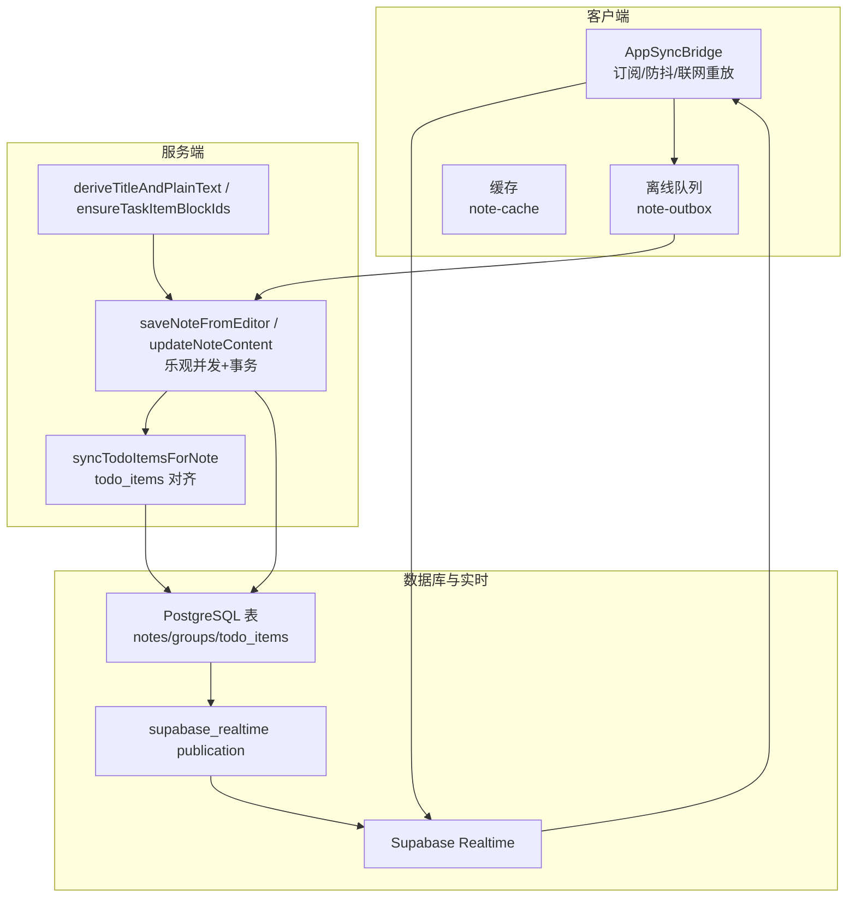
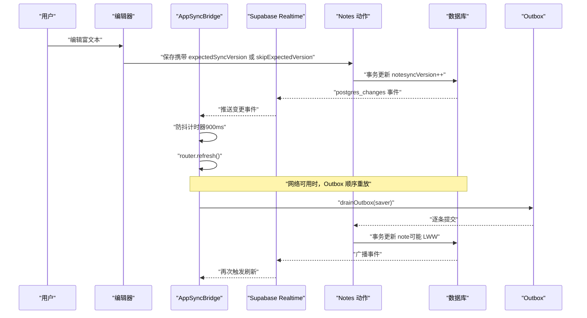
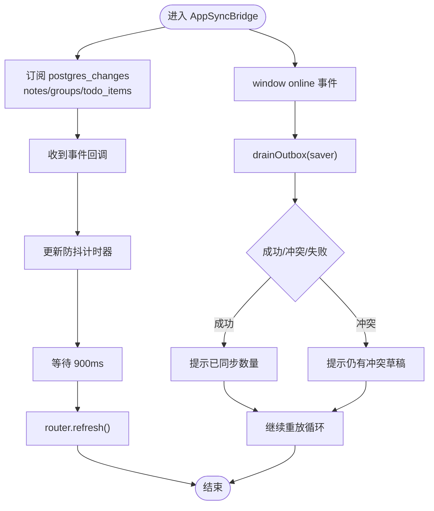
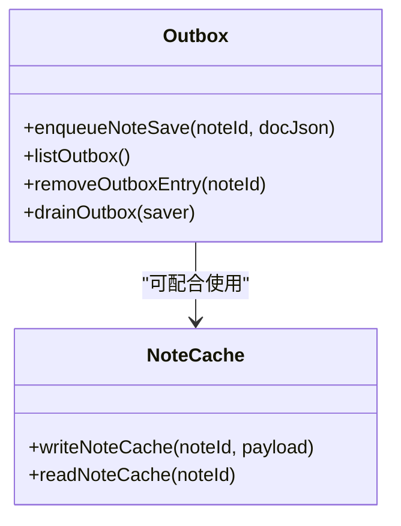
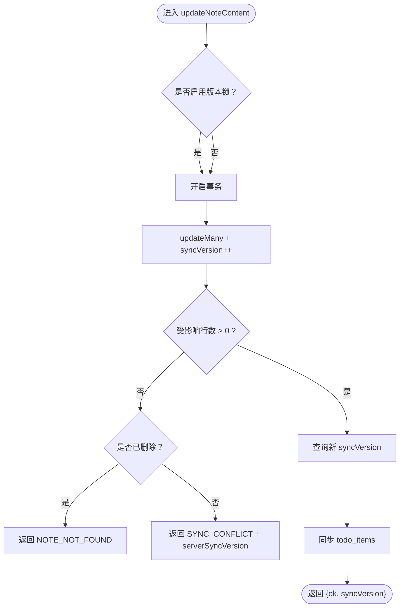
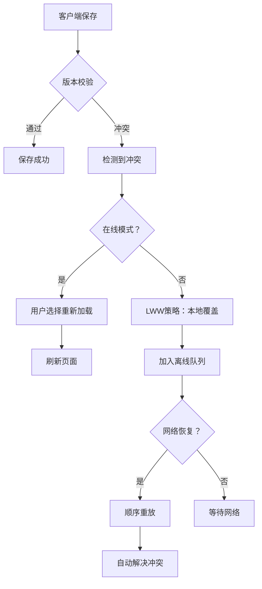
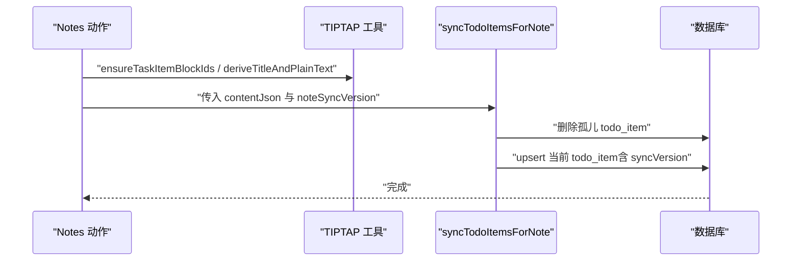
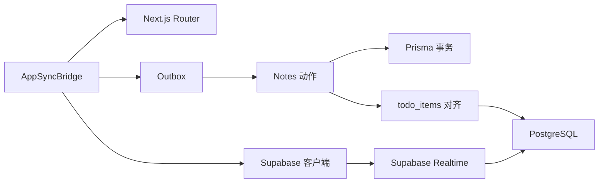

# 实时同步系统

<cite>
**本文引用的文件**
- [src/components/app/app-sync-bridge.tsx](file://src/components/app/app-sync-bridge.tsx)
- [src/lib/supabase/client.ts](file://src/lib/supabase/client.ts)
- [src/lib/offline/note-outbox.ts](file://src/lib/offline/note-outbox.ts)
- [src/actions/notes.ts](file://src/actions/notes.ts)
- [src/lib/offline/note-cache.ts](file://src/lib/offline/note-cache.ts)
- [src/lib/todo/sync-todo-items-for-note.ts](file://src/lib/todo/sync-todo-items-for-note.ts)
- [src/lib/tiptap/content.ts](file://src/lib/tiptap/content.ts)
- [src/lib/tiptap/todo-doc.ts](file://src/lib/tiptap/todo-doc.ts)
- [supabase/migrations/20260513140000_realtime_publication.sql](file://supabase/migrations/20260513140000_realtime_publication.sql)
- [src/lib/supabase/proxy.ts](file://src/lib/supabase/proxy.ts)
- [src/proxy.ts](file://src/proxy.ts)
- [需求文档.md](file://需求文档.md)
- [README.md](file://README.md)
</cite>

## 目录
1. [简介](#简介)
2. [项目结构](#项目结构)
3. [核心组件](#核心组件)
4. [架构总览](#架构总览)
5. [详细组件分析](#详细组件分析)
6. [依赖关系分析](#依赖关系分析)
7. [性能考量](#性能考量)
8. [故障排除指南](#故障排除指南)
9. [结论](#结论)
10. [附录](#附录)

## 简介
本文件面向 Smart-Todo 的实时同步系统，围绕 Supabase Realtime 集成、冲突检测与解决（基于 syncVersion 乐观锁）、AppSyncBridge 实时桥接组件、多设备同步策略、防抖优化、以及监控与调试方法进行系统化技术说明。文档同时给出序列图、类图与流程图，帮助读者快速理解端到端的数据流与控制流。

## 项目结构
本项目的实时同步涉及以下关键目录与文件：
- 组件层：实时桥接组件位于 app 层，负责订阅与刷新
- 客户端库：Supabase 浏览器客户端封装
- 离线存储：IndexedDB 封装（localforage）的 outbox 与 cache
- 业务动作：服务端动作封装了富文本与待办项的双向同步
- 数据迁移：启用 Supabase Realtime publication
- 代理层：Next.js 16 中间件刷新 Supabase 会话

**图表来源**
- [src/components/app/app-sync-bridge.tsx:1-118](file://src/components/app/app-sync-bridge.tsx#L1-L118)
- [src/lib/offline/note-outbox.ts:1-87](file://src/lib/offline/note-outbox.ts#L1-L87)
- [src/actions/notes.ts:59-138](file://src/actions/notes.ts#L59-L138)
- [src/lib/todo/sync-todo-items-for-note.ts:1-59](file://src/lib/todo/sync-todo-items-for-note.ts#L1-L59)
- [supabase/migrations/20260513140000_realtime_publication.sql:1-7](file://supabase/migrations/20260513140000_realtime_publication.sql#L1-L7)

**章节来源**
- [src/components/app/app-sync-bridge.tsx:1-118](file://src/components/app/app-sync-bridge.tsx#L1-L118)
- [src/lib/supabase/client.ts:1-9](file://src/lib/supabase/client.ts#L1-L9)
- [src/lib/offline/note-outbox.ts:1-87](file://src/lib/offline/note-outbox.ts#L1-L87)
- [src/actions/notes.ts:59-138](file://src/actions/notes.ts#L59-L138)
- [src/lib/todo/sync-todo-items-for-note.ts:1-59](file://src/lib/todo/sync-todo-items-for-note.ts#L1-L59)
- [supabase/migrations/20260513140000_realtime_publication.sql:1-7](file://supabase/migrations/20260513140000_realtime_publication.sql#L1-L7)

## 核心组件
- AppSyncBridge：在客户端订阅 Supabase Realtime，对 notes/groups/todo_items 的变更进行防抖刷新，并在网络恢复时重放离线队列
- 离线队列（Outbox）：以 IndexedDB 为基础的本地队列，按 noteId 去重，顺序重放
- 服务端动作（Notes Actions）：基于 syncVersion 的乐观并发控制，事务内更新便签与对齐 todo_items
- TIPTAP 工具：从富文本 JSON 派生纯文本与标题，确保待办块 ID 稳定
- Supabase Realtime 发布：将业务表加入 supabase_realtime publication，支持 postgres_changes 订阅
- 代理层（Next.js 16）：在每次请求刷新 Supabase 会话，保障 access_token 续期

**章节来源**
- [src/components/app/app-sync-bridge.tsx:16-118](file://src/components/app/app-sync-bridge.tsx#L16-L118)
- [src/lib/offline/note-outbox.ts:10-87](file://src/lib/offline/note-outbox.ts#L10-L87)
- [src/actions/notes.ts:59-138](file://src/actions/notes.ts#L59-L138)
- [src/lib/tiptap/content.ts:12-53](file://src/lib/tiptap/content.ts#L12-L53)
- [src/lib/tiptap/todo-doc.ts:4-101](file://src/lib/tiptap/todo-doc.ts#L4-L101)
- [supabase/migrations/20260513140000_realtime_publication.sql:1-7](file://supabase/migrations/20260513140000_realtime_publication.sql#L1-L7)
- [src/lib/supabase/proxy.ts:10-51](file://src/lib/supabase/proxy.ts#L10-L51)
- [src/proxy.ts:1-23](file://src/proxy.ts#L1-L23)

## 架构总览
下图展示了从用户编辑到实时广播再到多设备刷新的整体流程：

**图表来源**
- [src/components/app/app-sync-bridge.tsx:20-118](file://src/components/app/app-sync-bridge.tsx#L20-L118)
- [src/actions/notes.ts:59-138](file://src/actions/notes.ts#L59-L138)
- [src/lib/offline/note-outbox.ts:48-87](file://src/lib/offline/note-outbox.ts#L48-L87)
- [supabase/migrations/20260513140000_realtime_publication.sql:1-7](file://supabase/migrations/20260513140000_realtime_publication.sql#L1-L7)

## 详细组件分析

### AppSyncBridge：实时桥接与防抖刷新
- 订阅范围：notes、groups、todo_items，按 user_id 过滤
- 事件类型：*（所有事件）
- 防抖策略：900ms 内多次事件合并为一次 router.refresh
- 网络恢复：联网时触发 drainOutbox，优先本地最新内容（LWW）

**图表来源**
- [src/components/app/app-sync-bridge.tsx:20-118](file://src/components/app/app-sync-bridge.tsx#L20-L118)

**章节来源**
- [src/components/app/app-sync-bridge.tsx:16-118](file://src/components/app/app-sync-bridge.tsx#L16-L118)

### 离线队列与缓存：Outbox 与 Note Cache
- Outbox：按 noteId 去重，保留最后一次内容；顺序重放；支持 LWW（离线重放时跳过版本校验）
- Note Cache：持久化最近一次服务端返回的 contentJson/syncVersion/savedAt，用于冲突检测与 UI 优化

**图表来源**
- [src/lib/offline/note-outbox.ts:10-87](file://src/lib/offline/note-outbox.ts#L10-L87)
- [src/lib/offline/note-cache.ts:8-25](file://src/lib/offline/note-cache.ts#L8-L25)

**章节来源**
- [src/lib/offline/note-outbox.ts:1-87](file://src/lib/offline/note-outbox.ts#L1-L87)
- [src/lib/offline/note-cache.ts:1-25](file://src/lib/offline/note-cache.ts#L1-L25)

### 乐观并发与冲突检测：syncVersion 设计
- 服务端动作在事务中更新 note，并将 syncVersion 自增 1
- 若 updateMany 返回 0，则判定为冲突（或资源不存在）
- 返回冲突时携带 serverSyncVersion，前端据此决定是否提示或重试
- 离线重放时可选择跳过版本校验（LWW），以本地最新为准

**图表来源**
- [src/actions/notes.ts:59-138](file://src/actions/notes.ts#L59-L138)

**章节来源**
- [src/actions/notes.ts:59-138](file://src/actions/notes.ts#L59-L138)

### 冲突检测与解决机制详解
系统实现了完整的冲突检测与解决机制，包括以下关键特性：

#### 乐观并发控制
- 使用 syncVersion 字段作为乐观锁标识
- 通过 expectedSyncVersion 参数验证客户端版本一致性
- 事务内原子性更新，确保数据一致性

#### 冲突类型识别
- **版本冲突**：当 expectedSyncVersion 与数据库不匹配时触发
- **资源不存在**：便签已被删除或不存在的情况
- **网络错误**：保存失败时自动进入离线队列

#### 冲突解决策略
- **在线冲突**：提示用户重新加载，强制同步最新版本
- **离线冲突**：采用 LWW（最后写入获胜）策略，以本地最新内容为准
- **离线队列重放**：网络恢复时顺序重放，自动处理冲突

**图表来源**
- [src/actions/notes.ts:64-69](file://src/actions/notes.ts#L64-L69)
- [src/components/editor/note-editor.tsx:173-182](file://src/components/editor/note-editor.tsx#L173-L182)
- [src/components/app/app-sync-bridge.tsx:94-105](file://src/components/app/app-sync-bridge.tsx#L94-L105)

**章节来源**
- [src/actions/notes.ts:64-69](file://src/actions/notes.ts#L64-L69)
- [src/components/editor/note-editor.tsx:173-182](file://src/components/editor/note-editor.tsx#L173-L182)
- [src/components/app/app-sync-bridge.tsx:94-105](file://src/components/app/app-sync-bridge.tsx#L94-L105)

### 富文本与待办项的双向同步
- 从富文本 JSON 派生纯文本与标题，用于检索与预览
- 确保 taskItem 的 blockId 稳定，便于跨端对齐与增量更新
- 事务内全量对齐 todo_items：删除孤儿、upsert 新项，保持与富文本一致

**图表来源**
- [src/actions/notes.ts:140-152](file://src/actions/notes.ts#L140-L152)
- [src/lib/todo/sync-todo-items-for-note.ts:1-59](file://src/lib/todo/sync-todo-items-for-note.ts#L1-L59)
- [src/lib/tiptap/content.ts:12-53](file://src/lib/tiptap/content.ts#L12-L53)
- [src/lib/tiptap/todo-doc.ts:4-101](file://src/lib/tiptap/todo-doc.ts#L4-L101)

**章节来源**
- [src/lib/todo/sync-todo-items-for-note.ts:1-59](file://src/lib/todo/sync-todo-items-for-note.ts#L1-L59)
- [src/lib/tiptap/content.ts:12-53](file://src/lib/tiptap/content.ts#L12-L53)
- [src/lib/tiptap/todo-doc.ts:4-101](file://src/lib/tiptap/todo-doc.ts#L4-L101)

### Supabase Realtime 集成与发布配置
- 在 Supabase Dashboard 中确保已创建并启用 supabase_realtime publication
- 将 notes/groups/todo_items 加入 publication，以便客户端通过 postgres_changes 订阅
- 客户端使用 createClient() 获取浏览器端 Supabase 客户端实例

**章节来源**
- [supabase/migrations/20260513140000_realtime_publication.sql:1-7](file://supabase/migrations/20260513140000_realtime_publication.sql#L1-L7)
- [src/lib/supabase/client.ts:1-9](file://src/lib/supabase/client.ts#L1-L9)

### 多设备同步策略与并发控制
- 事件驱动：数据库变更通过 Realtime 广播到同一用户的其他在线设备
- 防抖刷新：避免频繁 router.refresh 引发的重复渲染与请求
- LWW（最后写入获胜）：离线重放时跳过版本校验，以本地最新为准，降低"无意义"冲突
- RLS 与过滤：按 user_id 过滤，确保数据隔离

**章节来源**
- [src/components/app/app-sync-bridge.tsx:16-118](file://src/components/app/app-sync-bridge.tsx#L16-L118)
- [需求文档.md:302-322](file://需求文档.md#L302-L322)

### 网络异常处理与重连
- online 事件触发：联网时主动 drainOutbox，减少延迟
- CHANNEL_ERROR：记录警告日志，不影响后续订阅
- 会话续期：Next.js 16 中间件在每次请求刷新 Supabase 会话，避免 access_token 过期导致连接中断

**章节来源**
- [src/components/app/app-sync-bridge.tsx:79-83](file://src/components/app/app-sync-bridge.tsx#L79-L83)
- [src/lib/supabase/proxy.ts:10-51](file://src/lib/supabase/proxy.ts#L10-L51)
- [src/proxy.ts:1-23](file://src/proxy.ts#L1-L23)

## 依赖关系分析
- AppSyncBridge 依赖 Supabase Realtime 客户端与 Next.js router.refresh
- Notes 动作依赖 Prisma 事务、todo_items 对齐工具与 TIPTAP 工具
- Outbox 与 Cache 依赖 localforage（IndexedDB）
- Supabase Realtime 依赖数据库 publication 配置

**图表来源**
- [src/components/app/app-sync-bridge.tsx:1-118](file://src/components/app/app-sync-bridge.tsx#L1-L118)
- [src/lib/offline/note-outbox.ts:1-87](file://src/lib/offline/note-outbox.ts#L1-L87)
- [src/actions/notes.ts:1-230](file://src/actions/notes.ts#L1-L230)
- [src/lib/todo/sync-todo-items-for-note.ts:1-59](file://src/lib/todo/sync-todo-items-for-note.ts#L1-L59)
- [src/lib/supabase/client.ts:1-9](file://src/lib/supabase/client.ts#L1-L9)

**章节来源**
- [src/components/app/app-sync-bridge.tsx:1-118](file://src/components/app/app-sync-bridge.tsx#L1-L118)
- [src/lib/offline/note-outbox.ts:1-87](file://src/lib/offline/note-outbox.ts#L1-L87)
- [src/actions/notes.ts:1-230](file://src/actions/notes.ts#L1-L230)
- [src/lib/todo/sync-todo-items-for-note.ts:1-59](file://src/lib/todo/sync-todo-items-for-note.ts#L1-L59)
- [src/lib/supabase/client.ts:1-9](file://src/lib/supabase/client.ts#L1-L9)

## 性能考量
- 防抖阈值：900ms 的防抖可显著减少不必要的 router.refresh，建议结合实际场景调整
- 顺序重放：Outbox 逐条重放，避免并发写入带来的复杂性
- LWW 策略：离线重放时跳过版本校验，降低冲突概率，但需注意与远端最新内容的差异提示
- 事务原子性：服务端动作在单事务中完成 note 更新与 todo_items 对齐，减少中间态
- 会话续期：中间件确保 access_token 始终有效，避免频繁重连

## 故障排除指南
- Realtime 无法接收事件
  - 检查 publication 是否包含 notes/groups/todo_items
  - 确认 Supabase Realtime 已启用
  - 查看 CHANNEL_ERROR 日志
- 冲突频繁发生
  - 检查 expectedSyncVersion 传递是否正确
  - 离线重放时可考虑保留版本校验，避免 LWW 导致的数据漂移
- 离线草稿无法上传
  - drainOutbox 返回 failed 数量，检查 saver 的错误路径
  - 确认网络恢复后 online 事件被触发
- 会话过期导致连接中断
  - 确认 Next.js 16 中间件已生效
  - 检查 Supabase 配置是否完整

**章节来源**
- [src/components/app/app-sync-bridge.tsx:79-83](file://src/components/app/app-sync-bridge.tsx#L79-L83)
- [src/lib/offline/note-outbox.ts:48-87](file://src/lib/offline/note-outbox.ts#L48-L87)
- [src/lib/supabase/proxy.ts:10-51](file://src/lib/supabase/proxy.ts#L10-L51)
- [README.md:104-113](file://README.md#L104-L113)

## 结论
Smart-Todo 的实时同步系统以 Supabase Realtime 为核心，结合本地 Outbox 与缓存、服务端事务与 syncVersion 乐观锁，实现了多设备间的高效、一致的数据同步。AppSyncBridge 通过防抖与在线重放进一步优化用户体验。系统实现了完整的冲突检测与解决机制，包括乐观并发控制、LWW 策略、离线队列重放等特性，能够在各种网络环境下保证数据一致性。建议在生产环境中持续关注冲突率、网络异常与会话续期策略，并根据业务需要调整防抖阈值与 LWW 策略。

## 附录
- 部署与初始化步骤参考 README 的 Supabase 集成与 Realtime 配置章节
- 同步流程与数据模型参考需求文档

**章节来源**
- [README.md:63-140](file://README.md#L63-L140)
- [需求文档.md:274-322](file://需求文档.md#L274-L322)