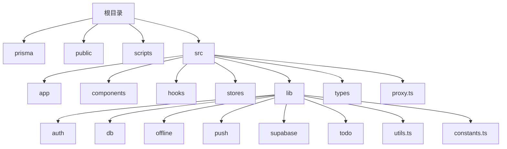
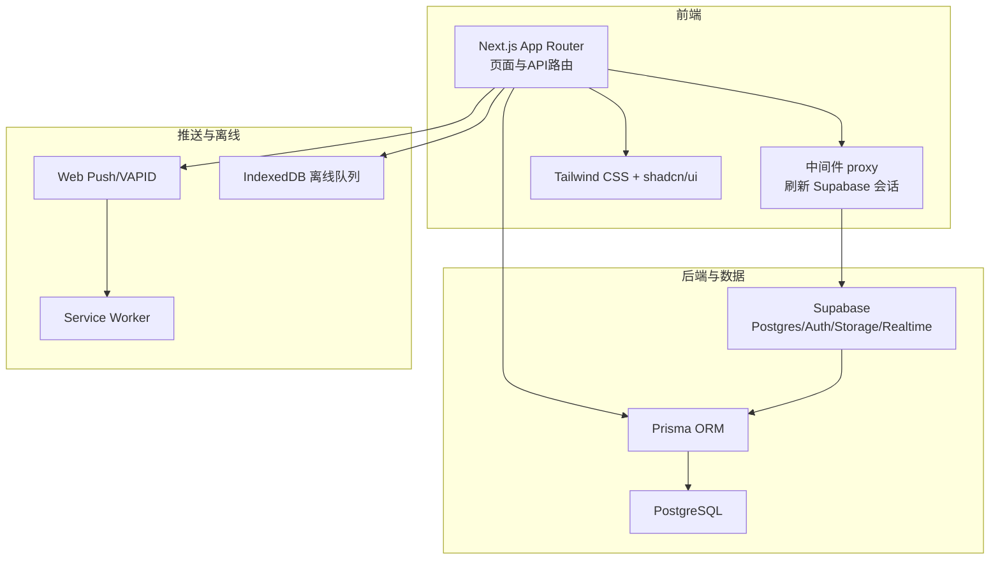
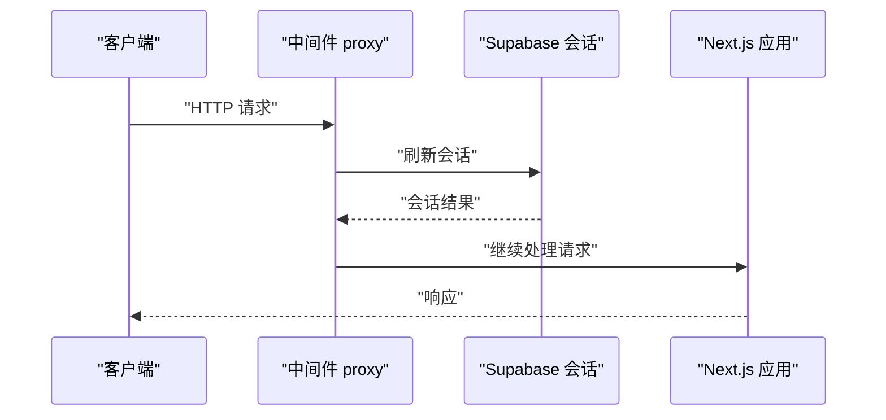
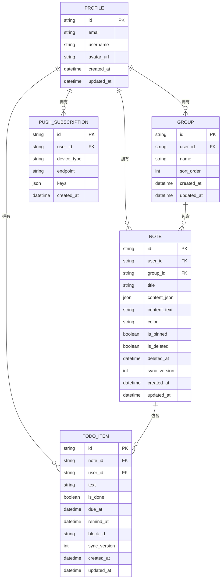
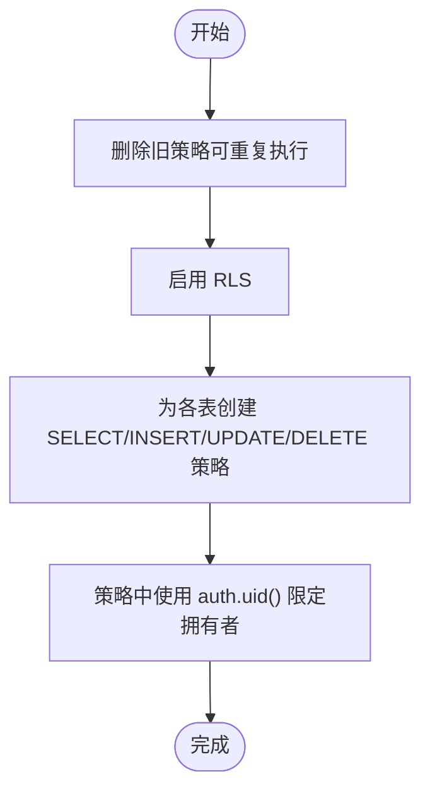
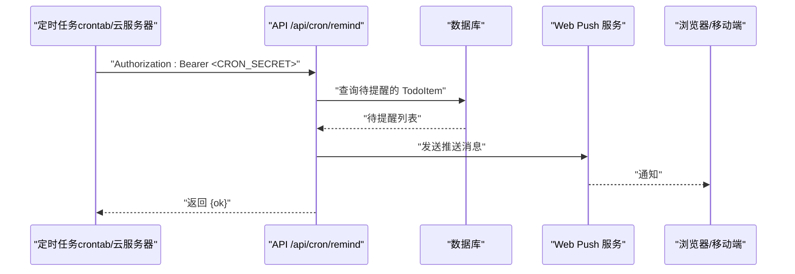
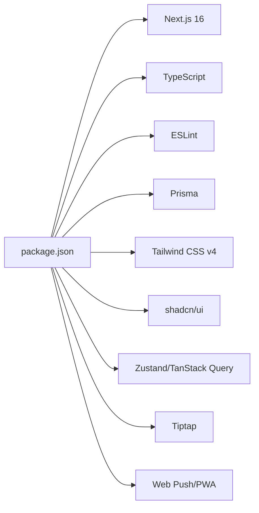

# 开发指南

<cite>
**本文引用的文件**
- [README.md](file://README.md)
- [package.json](file://package.json)
- [next.config.ts](file://next.config.ts)
- [tsconfig.json](file://tsconfig.json)
- [eslint.config.mjs](file://eslint.config.mjs)
- [components.json](file://components.json)
- [postcss.config.mjs](file://postcss.config.mjs)
- [prisma/schema.prisma](file://prisma/schema.prisma)
- [src/lib/constants.ts](file://src/lib/constants.ts)
- [src/lib/utils.ts](file://src/lib/utils.ts)
- [src/proxy.ts](file://src/proxy.ts)
- [supabase/migrations/20260513000000_enable_rls_policies.sql](file://supabase/migrations/20260513000000_enable_rls_policies.sql)
- [supabase/migrations/20260513120000_storage_note_images.sql](file://supabase/migrations/20260513120000_storage_note_images.sql)
- [supabase/migrations/20260513140000_realtime_publication.sql](file://supabase/migrations/20260513140000_realtime_publication.sql)
- [scripts/verify-m4-cron.mjs](file://scripts/verify-m4-cron.mjs)
</cite>

## 目录
1. [简介](#简介)
2. [项目结构](#项目结构)
3. [核心组件](#核心组件)
4. [架构总览](#架构总览)
5. [详细组件分析](#详细组件分析)
6. [依赖关系分析](#依赖关系分析)
7. [性能考虑](#性能考虑)
8. [故障排查指南](#故障排查指南)
9. [结论](#结论)
10. [附录](#附录)

## 简介
Smart-Todo 是一款“便签 + 待办”的多端同步轻量笔记应用，采用 Next.js 16 App Router + React 19 + TypeScript 构建，UI 采用 Tailwind CSS v4 + shadcn/ui，数据层基于 Supabase（Postgres + Auth + Storage + Realtime），ORM 使用 Prisma 6，前端状态管理结合 Zustand 与 TanStack Query，编辑器采用 Tiptap（ProseMirror），支持 PWA 与 Web Push 提醒。项目提供完整的本地开发流程、数据库初始化、实时订阅、离线同步、Web Push 提醒等能力。

本开发指南面向开发者，覆盖本地环境搭建、项目结构与规范、开发工具使用、调试与性能优化、测试策略、常见问题与团队协作最佳实践。

章节来源
- [README.md:1-216](file://README.md#L1-L216)

## 项目结构
项目采用 Next.js 16 App Router 的目录组织方式，核心目录如下：
- prisma：数据模型与 Prisma 配置
- public：静态资源与 PWA 相关（manifest.json、Service Worker）
- scripts：辅助脚本（如 M4 Cron 校验）
- src/app：页面路由与 API 路由（App Router）
- src/components：业务组件与 UI 组件（含 editor、notes、todos、push、layout 等）
- src/hooks：自定义 React Hooks
- src/stores：Zustand 状态管理
- src/lib：通用库（auth、db、offline、push、supabase、todo、utils、constants）
- src/types：全局类型定义
- src/proxy.ts：Next.js 16 中间件（旧名 middleware，16 起统一为 proxy）

图表来源
- [README.md:161-202](file://README.md#L161-L202)
- [src/proxy.ts:1-24](file://src/proxy.ts#L1-L24)

章节来源
- [README.md:161-202](file://README.md#L161-L202)
- [src/proxy.ts:1-24](file://src/proxy.ts#L1-L24)

## 核心组件
- Next.js 16 中间件（proxy）：负责刷新 Supabase 会话，匹配除静态资源与公共资产外的所有请求路径。
- 数据模型（Prisma）：包含 Profile、Group、Note、TodoItem、PushSubscription 等模型，定义字段、索引与唯一约束。
- Supabase 集成：通过 Supabase JS 客户端与 SSR 辅助，提供认证、数据库、存储与实时订阅能力。
- 实时与离线：通过 Supabase Realtime 订阅业务表变更，结合 IndexedDB 离线队列与 syncVersion 乐观锁实现多端同步。
- Web Push：VAPID 密钥配置，Service Worker 注册与订阅，定时扫描提醒并通过通知推送。
- UI 体系：Tailwind CSS v4 + shadcn/ui，组件别名与样式配置在 components.json 中集中管理。

章节来源
- [src/proxy.ts:1-24](file://src/proxy.ts#L1-L24)
- [prisma/schema.prisma:1-117](file://prisma/schema.prisma#L1-L117)
- [components.json:1-26](file://components.json#L1-L26)
- [README.md:9-31](file://README.md#L9-L31)

## 架构总览
整体架构围绕“前端（Next.js App Router）—中间件（proxy）—Supabase（Auth/DB/Storage/Realtime）—Prisma ORM—前端状态与离线”展开。开发服务器固定端口 3005，中间件在每次请求上刷新会话；数据库通过 Prisma 管理，Supabase 提供 RLS、Storage 与 Realtime；Web Push 依赖 VAPID 与 Service Worker。

图表来源
- [src/proxy.ts:1-24](file://src/proxy.ts#L1-L24)
- [prisma/schema.prisma:1-117](file://prisma/schema.prisma#L1-L117)
- [README.md:9-31](file://README.md#L9-L31)

## 详细组件分析

### 中间件（proxy）工作流
中间件在每个匹配请求上调用 Supabase 会话刷新逻辑，确保后续请求能正确读取用户上下文。匹配规则排除静态资源与公共资产，减少不必要的处理。

图表来源
- [src/proxy.ts:8-10](file://src/proxy.ts#L8-L10)

章节来源
- [src/proxy.ts:1-24](file://src/proxy.ts#L1-L24)

### 数据模型与索引设计
Prisma 数据模型涵盖用户资料、分组、便签、待办项与推送订阅，定义了字段映射、索引与唯一约束，支撑查询性能与业务一致性。

图表来源
- [prisma/schema.prisma:16-116](file://prisma/schema.prisma#L16-L116)

章节来源
- [prisma/schema.prisma:1-117](file://prisma/schema.prisma#L1-L117)

### Supabase RLS 与策略
项目通过手写 SQL 为各业务表启用 RLS 并创建“拥有者”策略，确保数据隔离与安全性。策略覆盖 profiles、groups、notes、todo_items、push_subscriptions。

图表来源
- [supabase/migrations/20260513000000_enable_rls_policies.sql:1-203](file://supabase/migrations/20260513000000_enable_rls_policies.sql#L1-L203)

章节来源
- [supabase/migrations/20260513000000_enable_rls_policies.sql:1-203](file://supabase/migrations/20260513000000_enable_rls_policies.sql#L1-L203)

### Web Push 与定时提醒（M4）
- VAPID 密钥生成与配置：公钥与私钥分别配置到环境变量，用于推送签名与验证。
- 定时扫描：通过 /api/cron/remind 接口扫描待办提醒，生产环境建议使用云服务器 crontab 每分钟调用。
- 本地校验：提供 verify:m4-cron 脚本，自动校验必要环境变量并请求接口，返回 JSON 含 ok 即为成功。

图表来源
- [README.md:115-140](file://README.md#L115-L140)
- [scripts/verify-m4-cron.mjs:1-83](file://scripts/verify-m4-cron.mjs#L1-L83)

章节来源
- [README.md:115-140](file://README.md#L115-L140)
- [scripts/verify-m4-cron.mjs:1-83](file://scripts/verify-m4-cron.mjs#L1-L83)

## 依赖关系分析
- 包管理器：pnpm（版本在 package.json 中声明）
- 运行时与打包：Next.js 16（默认 Turbopack），最小 Node.js 版本要求 20.9+
- 类型与校验：TypeScript（tsconfig.json）、ESLint（eslint.config.mjs）
- UI 与样式：Tailwind CSS v4（postcss.config.mjs）、shadcn/ui（components.json）
- ORM 与数据库：Prisma 6（prisma/schema.prisma）
- 状态与查询：Zustand、TanStack Query
- 编辑器：Tiptap（React + Core/Extensions）
- 推送与 PWA：web-push、Service Worker、manifest.json

图表来源
- [package.json:1-86](file://package.json#L1-L86)
- [tsconfig.json:1-35](file://tsconfig.json#L1-L35)
- [eslint.config.mjs:1-19](file://eslint.config.mjs#L1-L19)
- [postcss.config.mjs:1-8](file://postcss.config.mjs#L1-L8)
- [components.json:1-26](file://components.json#L1-L26)

章节来源
- [package.json:1-86](file://package.json#L1-L86)
- [tsconfig.json:1-35](file://tsconfig.json#L1-L35)
- [eslint.config.mjs:1-19](file://eslint.config.mjs#L1-L19)
- [postcss.config.mjs:1-8](file://postcss.config.mjs#L1-L8)
- [components.json:1-26](file://components.json#L1-L26)

## 性能考虑
- 代码分割与懒加载：利用 Next.js App Router 的路由层级与动态导入，按需加载页面与组件，减少首屏体积。
- 状态与缓存：TanStack Query 管理远端数据缓存与失效策略；Zustand 管理轻量前端状态；IndexedDB 离线队列与成功快照缓存提升离线体验。
- 查询优化：根据 Prisma 模型建立的索引（如用户维度、到期时间、便签 ID 等）提升查询效率。
- 打包与编译：使用 Next.js 16 的默认打包器（Turbopack）与严格 TypeScript 配置，减少运行时错误与体积膨胀。
- PWA 与推送：Service Worker 与 Web Push 减少网络往返，提升交互即时性。

章节来源
- [prisma/schema.prisma:72-99](file://prisma/schema.prisma#L72-L99)
- [README.md:9-21](file://README.md#L9-L21)

## 故障排查指南
- 开发服务器端口：固定端口 3005，避免与其他 Next 项目冲突；若使用其他端口，需在 Supabase Redirect URLs 中补充回调地址。
- Supabase 回调与白名单：开发环境至少添加 http://localhost:3005/auth/callback；可按范围补齐至 http://localhost:3000–3005。
- 数据库初始化：首次接入 Supabase 后，执行 db:push、db:rls、db:storage、db:realtime，确保 RLS、Storage 策略与 Realtime publication 正常。
- Web Push 与定时提醒：使用 verify:m4-cron 校验 CRON_SECRET、VAPID 公钥/私钥、NEXT_PUBLIC_APP_URL 等环境变量；本地可通过 curl 或脚本触发 /api/cron/remind。
- 健康检查：访问 http://localhost:3005/api/health 确认服务可用。
- Next.js 16 注意事项：中间件文件名/导出为 proxy；cookies()/headers()/params/searchParams 必须 await；默认打包器为 Turbopack；最低 Node.js 版本 20.9+。

章节来源
- [README.md:51-140](file://README.md#L51-L140)
- [scripts/verify-m4-cron.mjs:1-83](file://scripts/verify-m4-cron.mjs#L1-L83)

## 结论
Smart-Todo 提供从认证、笔记与待办 CRUD、实时同步、离线队列到 Web Push 提醒的完整能力。通过明确的目录组织、严格的类型与代码规范、完善的数据库初始化与策略、以及可复用的中间件与工具库，开发者可以快速迭代功能并保持高质量交付。建议在开发过程中持续关注性能指标与用户体验，配合调试与测试策略，保障系统的稳定性与扩展性。

## 附录

### 本地开发环境搭建与配置
- Node.js：满足最小版本要求（20.9+）
- 包管理器：pnpm（版本在 package.json 中声明）
- 初始化依赖：安装项目依赖
- 环境变量：复制 .env.example 为 .env.local 并按需填写
- 启动开发服务器：固定端口 3005
- 健康检查：访问 /api/health
- Supabase 接入：复制 API 与连接字符串，启用 RLS 与策略，创建 Storage 桶，注册 Realtime publication
- Web Push：生成 VAPID 密钥，配置 CRON_SECRET 与 NEXT_PUBLIC_APP_URL，使用 verify:m4-cron 校验

章节来源
- [README.md:33-140](file://README.md#L33-L140)
- [package.json:1-86](file://package.json#L1-L86)

### 项目结构与开发规范
- 目录组织：遵循 Next.js 16 App Router 结构，src 下按功能域划分 app、components、hooks、stores、lib、types
- 路径别名：tsconfig.json 中 @/* 映射到 ./src/*
- UI 规范：shadcn/ui 组件库，components.json 统一配置样式与别名
- 类型与校验：TypeScript 严格模式，ESLint 配置基于 eslint-config-next
- 中间件：proxy 文件名与导出，匹配规则排除静态资源与公共资产

章节来源
- [README.md:161-202](file://README.md#L161-L202)
- [tsconfig.json:21-23](file://tsconfig.json#L21-L23)
- [components.json:6-21](file://components.json#L6-L21)
- [eslint.config.mjs:1-19](file://eslint.config.mjs#L1-L19)
- [src/proxy.ts:12-23](file://src/proxy.ts#L12-L23)

### 开发工具使用
- Prisma：db:generate 生成客户端，db:push 同步 schema，db:studio 打开可视化界面，db:reset 重置开发库
- ESLint：npm run lint 执行检查
- TypeScript：npm run typecheck 进行类型检查
- Next.js：dev/build/start 脚本，next.config.ts 作为配置出口
- Tailwind CSS：postcss.config.mjs 集成 @tailwindcss/postcss 插件
- shadcn/ui：components.json 统一配置与别名

章节来源
- [package.json:6-21](file://package.json#L6-L21)
- [next.config.ts:1-8](file://next.config.ts#L1-L8)
- [postcss.config.mjs:1-8](file://postcss.config.mjs#L1-L8)
- [components.json:1-26](file://components.json#L1-L26)

### 调试技巧与最佳实践
- 断点调试：在浏览器 DevTools 与 VS Code 中设置断点，结合 Next.js 16 的 async/await 语法定位 cookies()/headers()/params/searchParams 的使用
- 日志记录：在中间件与 API 路由中输出关键上下文（如用户 ID、请求路径），便于排查会话与权限问题
- 性能分析：利用 Next.js Profiler 与浏览器性能面板，识别慢查询与渲染瓶颈；结合 TanStack Query 缓存策略优化网络请求
- 离线与同步：通过 IndexedDB 离线队列与 syncVersion 乐观锁验证冲突处理逻辑

章节来源
- [src/proxy.ts:8-10](file://src/proxy.ts#L8-L10)
- [README.md:204-212](file://README.md#L204-L212)

### 测试策略与实现方法
- 单元测试：针对工具函数与纯函数（如 utils/cn、constants）编写测试，确保样式合并与颜色枚举正确
- 集成测试：对页面与组件进行集成测试，覆盖登录、便签 CRUD、待办聚合、实时订阅与离线队列
- 端到端测试：使用端到端测试框架（如 Playwright/Cypress）模拟真实用户流程，验证登录、编辑器、推送与 PWA 功能
- 数据一致性：通过 Supabase RLS 策略与 Prisma 约束，结合测试用例验证数据隔离与唯一性约束

章节来源
- [src/lib/utils.ts:1-7](file://src/lib/utils.ts#L1-L7)
- [src/lib/constants.ts:1-16](file://src/lib/constants.ts#L1-L16)
- [prisma/schema.prisma:95-96](file://prisma/schema.prisma#L95-L96)
- [supabase/migrations/20260513000000_enable_rls_policies.sql:45-60](file://supabase/migrations/20260513000000_enable_rls_policies.sql#L45-L60)

### 性能优化指南
- 代码分割：按路由与组件拆分，使用动态导入减少初始包体
- 懒加载：编辑器与富文本组件采用懒加载，降低首屏渲染压力
- 缓存策略：TanStack Query 缓存策略与失效机制，IndexedDB 成功快照缓存
- 查询优化：为高频查询字段建立索引，避免 N+1 查询
- 打包优化：使用 Next.js 16 默认打包器与严格 TypeScript 配置，减少运行时错误与体积

章节来源
- [prisma/schema.prisma:72-99](file://prisma/schema.prisma#L72-L99)
- [README.md:9-21](file://README.md#L9-L21)

### 常见问题与解决方案
- 端口冲突：固定端口 3005，若使用其他端口需在 Supabase 中补充 Redirect URLs
- OAuth 回调失败：确认回调 URL 与端口匹配，必要时补充多个端口白名单
- 数据库初始化：执行 db:push、db:rls、db:storage、db:realtime，确保策略与 publication 正常
- Web Push：使用 verify:m4-cron 校验环境变量，生产环境配置 crontab 每分钟扫描
- 健康检查：访问 /api/health 确认服务可用

章节来源
- [README.md:51-140](file://README.md#L51-L140)
- [scripts/verify-m4-cron.mjs:1-83](file://scripts/verify-m4-cron.mjs#L1-L83)

### 团队协作最佳实践
- 分支策略：主分支保护，功能开发在特性分支，通过 Pull Request 合并
- 提交规范：使用语义化提交信息，关联 Issue 编号
- 代码审查：强制审查，重点关注类型安全、性能与可维护性
- 文档同步：更新 README 与需求文档，确保开发与产品一致
- 环境一致性：统一 pnpm 版本与 Node.js 版本，避免本地差异

章节来源
- [package.json:5,75-84](file://package.json#L5,L75-L84)
- [README.md:1-216](file://README.md#L1-L216)