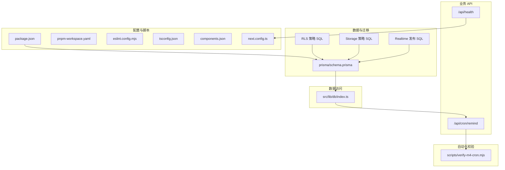
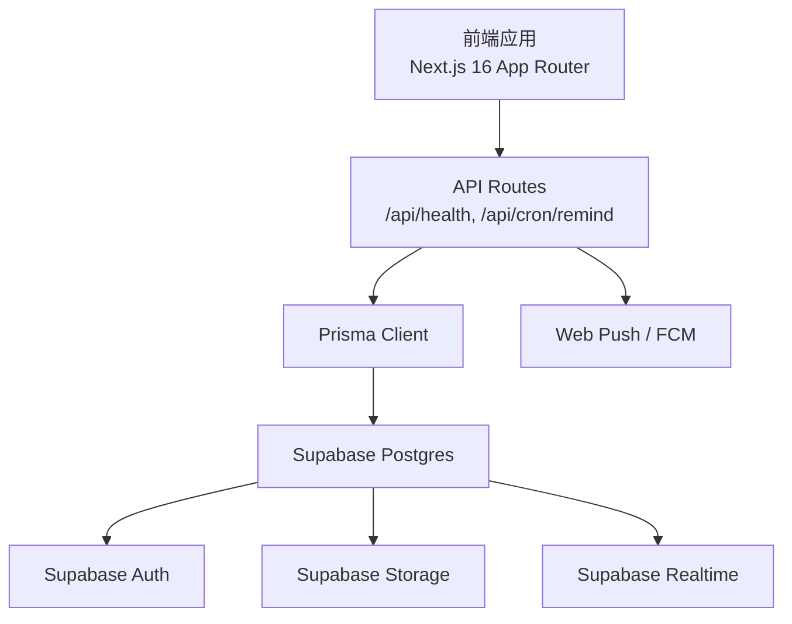
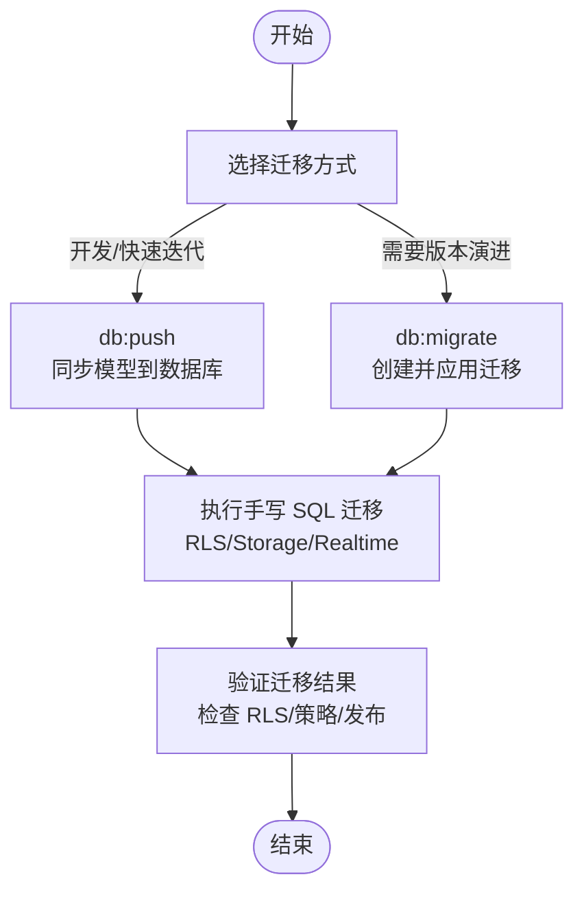
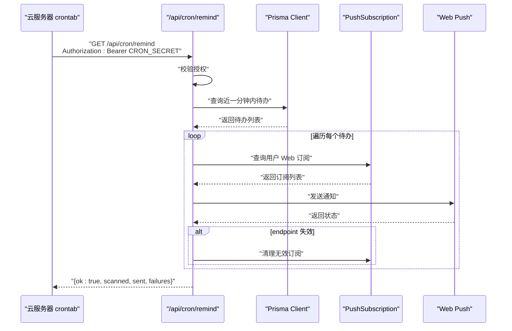
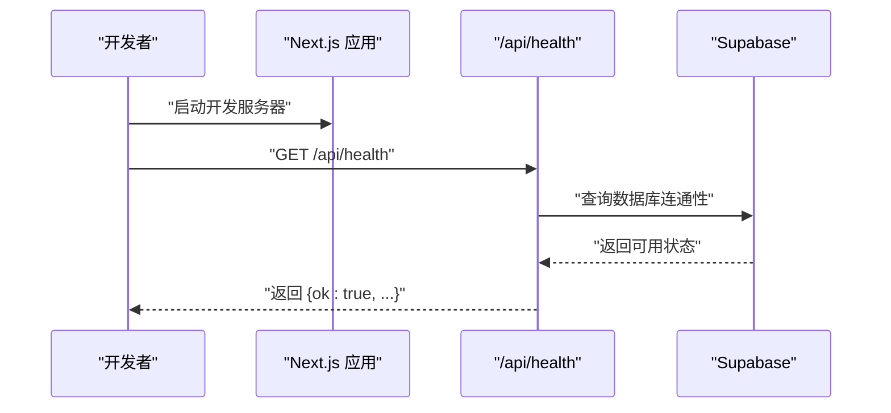
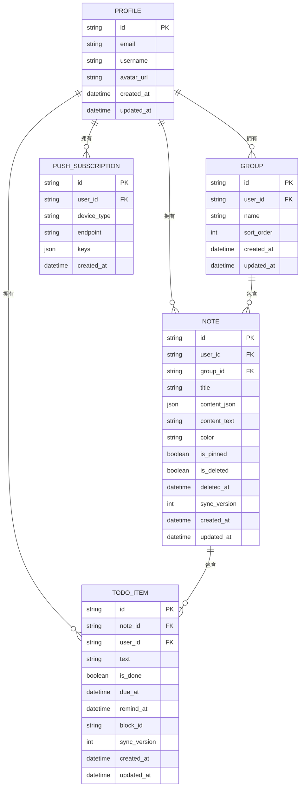
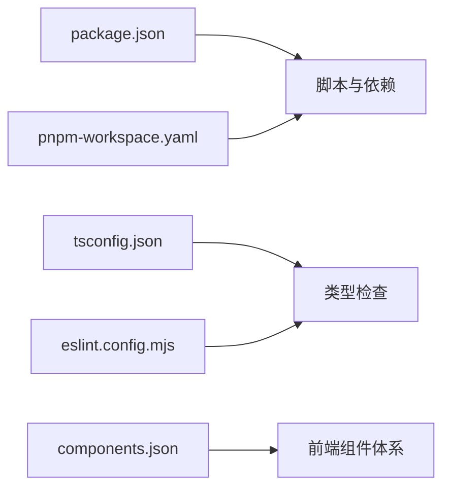

# 开发流程

<cite>
**本文引用的文件**
- [README.md](file://README.md)
- [package.json](file://package.json)
- [pnpm-workspace.yaml](file://pnpm-workspace.yaml)
- [prisma/schema.prisma](file://prisma/schema.prisma)
- [supabase/migrations/20260513000000_enable_rls_policies.sql](file://supabase/migrations/20260513000000_enable_rls_policies.sql)
- [supabase/migrations/20260513120000_storage_note_images.sql](file://supabase/migrations/20260513120000_storage_note_images.sql)
- [supabase/migrations/20260513140000_realtime_publication.sql](file://supabase/migrations/20260513140000_realtime_publication.sql)
- [scripts/verify-m4-cron.mjs](file://scripts/verify-m4-cron.mjs)
- [src/lib/db/index.ts](file://src/lib/db/index.ts)
- [src/app/api/cron/remind/route.ts](file://src/app/api/cron/remind/route.ts)
- [src/app/api/health/route.ts](file://src/app/api/health/route.ts)
- [AGENTS.md](file://AGENTS.md)
- [CLAUDE.md](file://CLAUDE.md)
- [需求文档.md](file://需求文档.md)
- [eslint.config.mjs](file://eslint.config.mjs)
- [tsconfig.json](file://tsconfig.json)
- [components.json](file://components.json)
- [next.config.ts](file://next.config.ts)
</cite>

## 目录
1. [简介](#简介)
2. [项目结构](#项目结构)
3. [核心组件](#核心组件)
4. [架构总览](#架构总览)
5. [详细组件分析](#详细组件分析)
6. [依赖关系分析](#依赖关系分析)
7. [性能考量](#性能考量)
8. [故障排查指南](#故障排查指南)
9. [结论](#结论)
10. [附录](#附录)

## 简介
本指南面向 Smart-Todo 项目的日常开发与协作，覆盖功能开发、代码提交、测试验证、代码审查、数据库迁移、版本发布、团队协作规范、自动化工具使用、问题跟踪与需求管理、沟通协作建议与最佳实践。文档严格依据仓库现有文件进行梳理与总结，确保流程可落地、可追溯。

## 项目结构
项目采用 Next.js 16 App Router 架构，前端与后端 API 融合在同一仓库中，数据库通过 Prisma 管理，Supabase 提供认证、存储与实时订阅能力。关键目录与职责概览如下：
- 配置与脚本：根目录提供包管理、脚本与工作区配置
- 数据模型与迁移：prisma/schema.prisma 定义模型；supabase/migrations 下存放 SQL 迁移
- 业务 API：src/app/api 下的路由处理业务逻辑（如健康检查、定时提醒）
- 数据访问：src/lib/db/index.ts 提供 Prisma 客户端
- 自动化校验：scripts/verify-m4-cron.mjs 用于 M4 推送与定时任务自检
- 文档与规范：README.md、AGENTS.md、CLAUDE.md、需求文档.md 提供开发与协作约定

**图表来源**
- [package.json:1-86](file://package.json#L1-L86)
- [pnpm-workspace.yaml:1-8](file://pnpm-workspace.yaml#L1-L8)
- [prisma/schema.prisma:1-117](file://prisma/schema.prisma#L1-L117)
- [supabase/migrations/20260513000000_enable_rls_policies.sql:1-203](file://supabase/migrations/20260513000000_enable_rls_policies.sql#L1-L203)
- [supabase/migrations/20260513120000_storage_note_images.sql:1-51](file://supabase/migrations/20260513120000_storage_note_images.sql#L1-L51)
- [supabase/migrations/20260513140000_realtime_publication.sql:1-7](file://supabase/migrations/20260513140000_realtime_publication.sql#L1-L7)
- [src/lib/db/index.ts:1-16](file://src/lib/db/index.ts#L1-L16)
- [src/app/api/health/route.ts:1-13](file://src/app/api/health/route.ts#L1-L13)
- [src/app/api/cron/remind/route.ts:1-115](file://src/app/api/cron/remind/route.ts#L1-L115)
- [scripts/verify-m4-cron.mjs:1-83](file://scripts/verify-m4-cron.mjs#L1-L83)

**章节来源**
- [README.md:161-202](file://README.md#L161-L202)
- [需求文档.md:223-272](file://需求文档.md#L223-L272)

## 核心组件
- 数据库与 ORM：Prisma Client 通过 src/lib/db/index.ts 注入，开发环境按需启用日志；Supabase 提供 RLS、Storage、Realtime 等能力
- 业务 API：
  - 健康检查：/api/health 返回服务状态
  - 定时提醒：/api/cron/remind 扫描待办并推送通知，受 CRON_SECRET 保护
- 自动化校验：verify-m4-cron.mjs 校验必要环境变量并请求 /api/cron/remind
- 脚本与工作流：package.json 中定义常用脚本，如 db:push、db:migrate、db:rls、db:storage、db:realtime、verify:m4-cron 等

**章节来源**
- [src/lib/db/index.ts:1-16](file://src/lib/db/index.ts#L1-L16)
- [src/app/api/health/route.ts:1-13](file://src/app/api/health/route.ts#L1-L13)
- [src/app/api/cron/remind/route.ts:1-115](file://src/app/api/cron/remind/route.ts#L1-L115)
- [scripts/verify-m4-cron.mjs:1-83](file://scripts/verify-m4-cron.mjs#L1-L83)
- [package.json:6-21](file://package.json#L6-L21)

## 架构总览
整体架构围绕 Next.js 16 App Router 与 Supabase 一体化后端展开，前端负责 UI 与交互，后端通过 API Routes 处理推送与批处理逻辑，Prisma 作为 ORM 连接 Supabase Postgres。

**图表来源**
- [需求文档.md:251-264](file://需求文档.md#L251-L264)
- [src/app/api/cron/remind/route.ts:1-115](file://src/app/api/cron/remind/route.ts#L1-L115)
- [src/app/api/health/route.ts:1-13](file://src/app/api/health/route.ts#L1-L13)
- [prisma/schema.prisma:1-117](file://prisma/schema.prisma#L1-L117)

## 详细组件分析

### 数据库迁移与版本管理
- 模型定义：prisma/schema.prisma 定义了 Profile、Group、Note、TodoItem、PushSubscription 等模型及其索引与唯一约束
- 手写 SQL 迁移：
  - RLS 策略：启用行级安全与各表策略，保障数据隔离
  - Storage 策略：创建 note-images 桶与相关策略
  - Realtime 发布：将业务表加入 supabase_realtime publication，供客户端订阅
- 迁移脚本：
  - db:push：将 Prisma 模型直接同步到数据库（无迁移文件）
  - db:migrate：创建并应用迁移（适用于需要版本演进的场景）
  - db:rls、db:storage、db:realtime：执行对应 SQL 文件，可重复执行

**图表来源**
- [package.json:13-19](file://package.json#L13-L19)
- [prisma/schema.prisma:1-117](file://prisma/schema.prisma#L1-L117)
- [supabase/migrations/20260513000000_enable_rls_policies.sql:1-203](file://supabase/migrations/20260513000000_enable_rls_policies.sql#L1-L203)
- [supabase/migrations/20260513120000_storage_note_images.sql:1-51](file://supabase/migrations/20260513120000_storage_note_images.sql#L1-L51)
- [supabase/migrations/20260513140000_realtime_publication.sql:1-7](file://supabase/migrations/20260513140000_realtime_publication.sql#L1-L7)

**章节来源**
- [README.md:142-160](file://README.md#L142-L160)
- [需求文档.md:274-321](file://需求文档.md#L274-L321)

### 定时提醒与推送流程
- 授权校验：/api/cron/remind 通过 Authorization: Bearer <CRON_SECRET> 校验
- 扫描范围：近一分钟内即将到期的待办项（remindAt）
- 推送目标：按用户订阅的 Web Push endpoint 发送通知
- 错误处理：对 410/404 endpoint 清理无效订阅
- 自检工具：verify-m4-cron.mjs 校验环境变量并请求 /api/cron/remind

**图表来源**
- [src/app/api/cron/remind/route.ts:19-114](file://src/app/api/cron/remind/route.ts#L19-L114)
- [scripts/verify-m4-cron.mjs:1-83](file://scripts/verify-m4-cron.mjs#L1-L83)

**章节来源**
- [需求文档.md:309-315](file://需求文档.md#L309-L315)
- [README.md:115-141](file://README.md#L115-L141)

### 健康检查与本地联调
- 健康检查：/api/health 返回服务状态与版本信息，便于部署与运维监控
- 本地联调：README 提供了接入 Supabase 的完整步骤，包括环境变量配置、OAuth 回调、RLS 策略、Storage、Realtime 与推送

**图表来源**
- [src/app/api/health/route.ts:1-12](file://src/app/api/health/route.ts#L1-L12)
- [README.md:59-102](file://README.md#L59-L102)

**章节来源**
- [README.md:59-102](file://README.md#L59-L102)

### 数据模型与关系

**图表来源**
- [prisma/schema.prisma:16-116](file://prisma/schema.prisma#L16-L116)

**章节来源**
- [prisma/schema.prisma:1-117](file://prisma/schema.prisma#L1-L117)

## 依赖关系分析
- 包管理与脚本：package.json 定义了开发与数据库相关脚本，配合 dotenv-cli 在执行时注入 .env.local
- 工作区配置：pnpm-workspace.yaml 允许特定依赖在构建时被允许
- 类型与规范：tsconfig.json 与 eslint.config.mjs 提供类型检查与代码风格约束
- UI 组件：components.json 定义了 shadcn/ui 的路径别名与 Tailwind 配置

**图表来源**
- [package.json:6-84](file://package.json#L6-L84)
- [pnpm-workspace.yaml:1-8](file://pnpm-workspace.yaml#L1-L8)
- [tsconfig.json:1-35](file://tsconfig.json#L1-L35)
- [eslint.config.mjs:1-19](file://eslint.config.mjs#L1-L19)
- [components.json:1-26](file://components.json#L1-L26)

**章节来源**
- [package.json:6-84](file://package.json#L6-L84)
- [pnpm-workspace.yaml:1-8](file://pnpm-workspace.yaml#L1-L8)
- [tsconfig.json:1-35](file://tsconfig.json#L1-L35)
- [eslint.config.mjs:1-19](file://eslint.config.mjs#L1-L19)
- [components.json:1-26](file://components.json#L1-L26)

## 性能考量
- 开发体验：Next.js 16 默认使用 Turbopack，开发服务器固定端口 3005，提升热重载与启动速度
- 数据库日志：开发环境开启 Prisma 查询日志，便于定位慢查询与异常
- API 超时与动态：/api/cron/remind 设置最大执行时长，/api/health 使用动态响应以避免缓存
- 推送 TTL：Web Push 设置较短 TTL，降低过期通知带来的资源浪费

**章节来源**
- [README.md:204-212](file://README.md#L204-L212)
- [src/lib/db/index.ts:9-11](file://src/lib/db/index.ts#L9-L11)
- [src/app/api/cron/remind/route.ts:5-6](file://src/app/api/cron/remind/route.ts#L5-L6)

## 故障排查指南
- 健康检查失败：确认 /api/health 可访问，检查服务版本与时间戳字段
- 推送定时任务失败：
  - 确认 CRON_SECRET、VAPID 公私钥、NEXT_PUBLIC_APP_URL 等环境变量
  - 使用 verify-m4-cron.mjs 自检，或手动 curl /api/cron/remind 并携带正确 Authorization
  - 如遇 500 且非 JSON，检查数据库连接与 Prisma 配置
- OAuth 回调失败：确认 Supabase Redirect URLs 中包含开发端口 3005 的回调地址
- Realtime 订阅：确认 supabase_realtime publication 已包含 notes/groups/todo_items

**章节来源**
- [src/app/api/health/route.ts:1-12](file://src/app/api/health/route.ts#L1-L12)
- [scripts/verify-m4-cron.mjs:11-30](file://scripts/verify-m4-cron.mjs#L11-L30)
- [README.md:115-141](file://README.md#L115-L141)
- [supabase/migrations/20260513140000_realtime_publication.sql:1-7](file://supabase/migrations/20260513140000_realtime_publication.sql#L1-L7)

## 结论
本指南基于仓库现有文件，给出了从功能开发到数据库迁移、从测试验证到版本发布的全流程建议，并结合项目的技术栈与协作规范，形成可执行的开发流程。建议团队在实践中持续完善自动化校验与文档，确保每次变更均可追溯、可验证、可回滚。

## 附录

### 日常开发工作流程
- 功能开发：在 src/components 与 src/app 下新增页面/组件与 API 路由，遵循 Next.js 16 的 async API 约定
- 代码提交：遵循 AGENTS.md 的协作与版本控制约定，避免未经明确授权的自动提交
- 测试验证：使用 /api/health 与 verify-m4-cron.mjs 进行基础自检，结合类型检查与 ESLint
- 代码审查：在本地完成自审后，通过 PR 进行代码审查与讨论

**章节来源**
- [AGENTS.md:7-19](file://AGENTS.md#L7-L19)
- [README.md:142-160](file://README.md#L142-L160)
- [eslint.config.mjs:1-19](file://eslint.config.mjs#L1-L19)
- [tsconfig.json:1-35](file://tsconfig.json#L1-L35)

### 数据库迁移流程（Schema 修改、数据迁移、版本管理）
- 开发阶段：使用 db:push 快速同步模型；如需版本演进，使用 db:migrate
- 策略与发布：执行 db:rls、db:storage、db:realtime，确保 RLS、Storage 策略与 Realtime 发布生效
- 验证：在 Supabase Dashboard 检查策略与发布状态，或在 SQL Editor 中重复执行对应 SQL

**章节来源**
- [package.json:13-19](file://package.json#L13-L19)
- [README.md:72-114](file://README.md#L72-L114)

### 版本发布流程（构建打包、部署准备、上线检查）
- 构建打包：使用 npm run build 生成生产包
- 部署准备：在 Vercel 配置环境变量（CRON_SECRET、VAPID、NEXT_PUBLIC_APP_URL 等）
- 上线检查：使用 /api/health 与 verify-m4-cron.mjs 进行端到端自检，确认推送与定时任务正常

**章节来源**
- [README.md:147-141](file://README.md#L147-L141)
- [src/app/api/health/route.ts:1-12](file://src/app/api/health/route.ts#L1-L12)
- [scripts/verify-m4-cron.mjs:1-83](file://scripts/verify-m4-cron.mjs#L1-L83)

### 团队协作规范（分支策略、合并流程、冲突解决）
- 分支策略：建议采用 Feature 分支 + Pull Request 的方式，主分支保持稳定
- 合并流程：PR 需通过代码审查与自检，合并后进行回归验证
- 冲突解决：优先通过 rebase 解决冲突，保持提交历史清晰

**章节来源**
- [AGENTS.md:7-19](file://AGENTS.md#L7-L19)

### 自动化工具使用（CI/CD、自动化测试、部署脚本）
- 自动化测试：结合 ESLint 与类型检查，确保代码质量
- 部署脚本：使用 verify-m4-cron.mjs 与 /api/health 进行自动化自检
- 部署平台：Vercel（免费额度足够自用），云服务器 crontab 定时调用 /api/cron/remind

**章节来源**
- [eslint.config.mjs:1-19](file://eslint.config.mjs#L1-L19)
- [tsconfig.json:1-35](file://tsconfig.json#L1-L35)
- [scripts/verify-m4-cron.mjs:1-83](file://scripts/verify-m4-cron.mjs#L1-L83)
- [需求文档.md:261-264](file://需求文档.md#L261-L264)

### 问题跟踪与需求管理（Issue 创建、任务分配、进度跟踪）
- 需求文档：需求文档.md 作为单一事实来源，变更需同步更新
- Issue 创建：建议在仓库 Issue 中登记功能与缺陷，关联需求文档章节
- 任务分配：通过 PR 与评论进行任务分配与进度跟踪

**章节来源**
- [需求文档.md:350-362](file://需求文档.md#L350-L362)

### 沟通协作建议与最佳实践
- 严格遵守 AGENTS.md 的协作与版本控制约定，避免未经授权的自动提交
- 在 PR 中充分说明变更动机与影响，结合自检结果与截图进行评审
- 对关键流程（推送、定时任务、数据库迁移）建立自检清单，确保可重复验证

**章节来源**
- [AGENTS.md:7-19](file://AGENTS.md#L7-L19)
- [CLAUDE.md:1-6](file://CLAUDE.md#L1-L6)