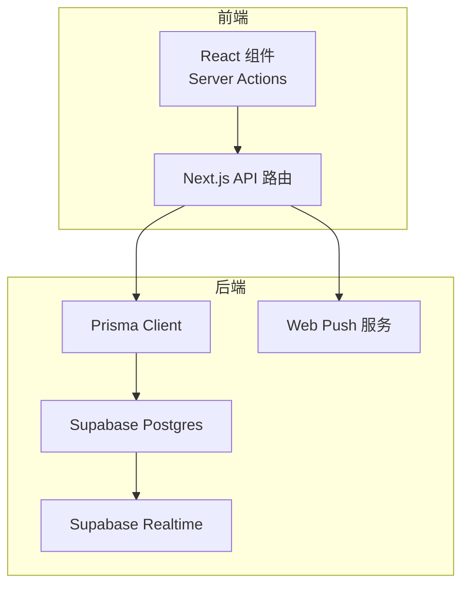
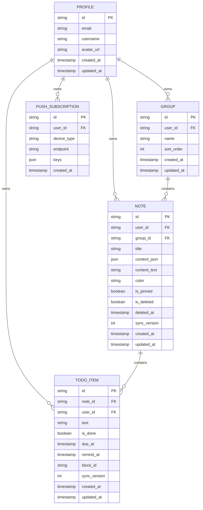
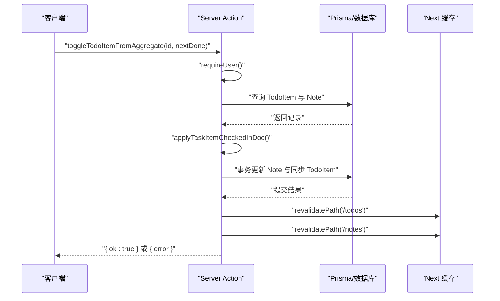
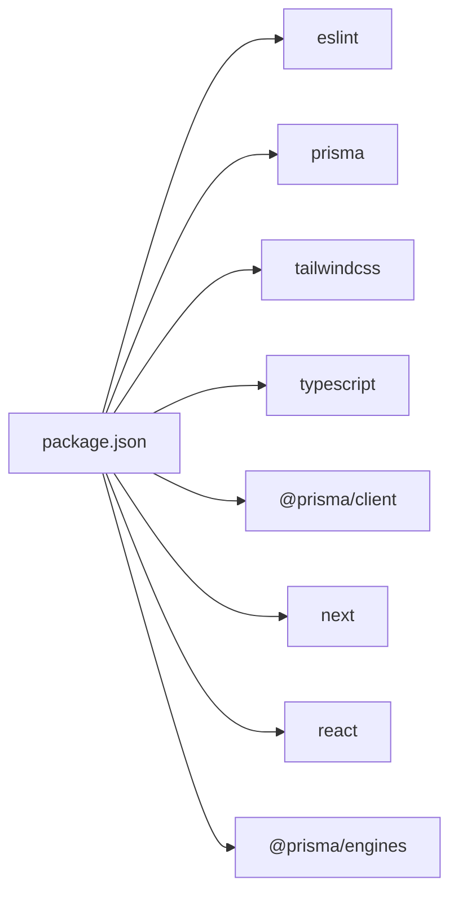

# 开发规范

<cite>
**本文引用的文件**
- [eslint.config.mjs](file://eslint.config.mjs)
- [tsconfig.json](file://tsconfig.json)
- [package.json](file://package.json)
- [prisma/schema.prisma](file://prisma/schema.prisma)
- [next.config.ts](file://next.config.ts)
- [src/lib/constants.ts](file://src/lib/constants.ts)
- [src/types/note.ts](file://src/types/note.ts)
- [src/components/ui/button.tsx](file://src/components/ui/button.tsx)
- [src/actions/todos.ts](file://src/actions/todos.ts)
- [src/app/api/cron/remind/route.ts](file://src/app/api/cron/remind/route.ts)
- [src/lib/utils.ts](file://src/lib/utils.ts)
- [src/app/layout.tsx](file://src/app/layout.tsx)
- [README.md](file://README.md)
</cite>

## 目录
1. [简介](#简介)
2. [项目结构](#项目结构)
3. [核心组件](#核心组件)
4. [架构总览](#架构总览)
5. [详细组件分析](#详细组件分析)
6. [依赖分析](#依赖分析)
7. [性能考虑](#性能考虑)
8. [故障排查指南](#故障排查指南)
9. [结论](#结论)
10. [附录](#附录)

## 简介
本规范面向 Smart-Todo 项目的开发团队，旨在统一代码风格、组件设计、数据库模型、API 设计与质量保障流程，确保跨模块协作的一致性与可维护性。内容基于当前仓库中的配置与实现进行提炼，并结合 Next.js App Router、TypeScript、Prisma、Supabase 与 Web Push 等技术栈的实际使用情况制定。

## 项目结构
项目采用 Next.js App Router 的分层组织方式，核心目录职责如下：
- src/app：页面与路由（含 API 路由）
- src/components：UI 组件与业务组件
- src/lib：通用库（数据库、认证、工具、常量等）
- src/types：全局类型定义
- prisma：数据模型与 Prisma Client 生成
- public：静态资源与 PWA 相关文件
- scripts：辅助脚本（如定时任务校验）

```mermaid
graph TB
A["src/app"] --> A1["(auth)/login/page.tsx"]
A --> A2["(app)/notes/*"]
A --> A3["(app)/todos/page.tsx"]
A --> A4["api/cron/remind/route.ts"]
A --> A5["api/health/route.ts"]
B["src/components"] --> B1["ui/*"]
B --> B2["editor/*"]
B --> B3["notes/*"]
B --> B4["todos/*"]
B --> B5["push/*"]
C["src/lib"] --> C1["db"]
C --> C2["auth"]
C --> C3["supabase"]
C --> C4["utils.ts"]
C --> C5["constants.ts"]
D["prisma/schema.prisma"] --> D1["Profile/Group/Note/TodoItem/PushSubscription"]
E["public"] --> E1["manifest.json"]
E --> E2["sw.js"]
```

图表来源
- [src/app/layout.tsx:1-54](file://src/app/layout.tsx#L1-L54)
- [src/app/api/cron/remind/route.ts:1-115](file://src/app/api/cron/remind/route.ts#L1-L115)
- [prisma/schema.prisma:1-117](file://prisma/schema.prisma#L1-L117)

章节来源
- [README.md:161-202](file://README.md#L161-L202)

## 核心组件
- 代码风格与类型系统
  - ESLint：基于 eslint-config-next 的 core-web-vitals 与 typescript 配置，覆盖现代 Web 性能指标与 TS 规则；通过 globalIgnores 覆盖默认忽略路径。
  - TypeScript：严格模式、ESNext 目标、Bundler 解析、路径别名 @/* 指向 src/*。
- 构建与运行
  - Next 配置为空对象（默认行为），使用 Turbopack 作为默认打包器。
  - 包管理器为 pnpm，提供数据库与脚本命令集合。
- 常量与类型
  - 常量：应用名称、颜色枚举与回收站保留天数。
  - 类型：便签列表项与分组列表项类型定义。
- UI 组件
  - 按钮组件：基于 class-variance-authority 的变体与尺寸体系，统一交互态与视觉反馈。
- 工具函数
  - cn：clsx 与 tailwind-merge 的组合，用于安全合并类名。
- 数据模型
  - 用户资料、分组、便签、待办项、推送订阅，含索引与唯一约束，映射到 Supabase Postgres。

章节来源
- [eslint.config.mjs:1-19](file://eslint.config.mjs#L1-L19)
- [tsconfig.json:1-35](file://tsconfig.json#L1-L35)
- [next.config.ts:1-8](file://next.config.ts#L1-L8)
- [package.json:1-86](file://package.json#L1-L86)
- [src/lib/constants.ts:1-16](file://src/lib/constants.ts#L1-L16)
- [src/types/note.ts:1-13](file://src/types/note.ts#L1-L13)
- [src/components/ui/button.tsx:1-59](file://src/components/ui/button.tsx#L1-L59)
- [src/lib/utils.ts:1-7](file://src/lib/utils.ts#L1-L7)
- [prisma/schema.prisma:1-117](file://prisma/schema.prisma#L1-L117)

## 架构总览
整体架构围绕 Next.js App Router 与 Server Actions 展开，数据层通过 Prisma 访问 Supabase Postgres，实时更新通过 Supabase Realtime 实现，定时任务负责 Web Push 提醒。

图表来源
- [src/actions/todos.ts:1-70](file://src/actions/todos.ts#L1-L70)
- [src/app/api/cron/remind/route.ts:1-115](file://src/app/api/cron/remind/route.ts#L1-L115)
- [prisma/schema.prisma:1-117](file://prisma/schema.prisma#L1-L117)

## 详细组件分析

### 代码风格与类型约束
- ESLint 规则
  - 继承 eslint-config-next 的 core-web-vitals 与 typescript 配置，确保性能指标与 TS 规范一致性。
  - 通过 globalIgnores 显式覆盖默认忽略目录，便于在构建产物与 Next 类型目录中进行检查。
- TypeScript 配置
  - 严格模式开启，禁止输出 JS，使用 Bundler 解析，启用 isolatedModules，路径别名 @/*。
  - JSX 使用 react-jsx，包含 Next 类型与 mts 文件。
- 命名约定
  - 文件命名：页面与组件采用小驼峰或目录分层，API 路由以 route.ts 结尾。
  - 类型导出：使用明确的类型别名与只读数组，如 NOTE_COLORS 使用 as const 与类型推断。
  - 变量与函数：遵循语义化命名，如 toggleTodoItemFromAggregate、assertCronAuthorized。

章节来源
- [eslint.config.mjs:1-19](file://eslint.config.mjs#L1-L19)
- [tsconfig.json:1-35](file://tsconfig.json#L1-L35)
- [src/lib/constants.ts:1-16](file://src/lib/constants.ts#L1-L16)
- [src/actions/todos.ts:1-70](file://src/actions/todos.ts#L1-L70)

### 目录结构组织原则与文件命名规范
- 目录组织
  - src/app：按功能域划分（如 (auth)/login、(app)/notes、(app)/todos），API 路由集中于 api 目录。
  - src/components：按领域拆分（ui、editor、notes、todos、push、layout）。
  - src/lib：按职责拆分（db、auth、supabase、offline、push、todo、utils、constants）。
  - prisma：schema.prisma 为核心模型定义。
  - public：PWA 清单与 Service Worker。
- 文件命名
  - 页面与布局：page.tsx、layout.tsx。
  - API 路由：route.ts。
  - 组件：采用语义化名词，如 button.tsx、note-editor.tsx。
  - 类型：*.ts，如 note.ts。
  - 常量：constants.ts。

章节来源
- [README.md:161-202](file://README.md#L161-L202)

### 组件开发规范
- 设计模式
  - 变体与尺寸：按钮组件通过 cva 定义变体与尺寸，统一视觉与交互态。
  - 数据槽：使用 data-slot 标记内部元素，便于主题与样式系统识别。
- Props 规范
  - 透传原生属性：Button 组件透传原生 props，保持与底层组件的兼容性。
  - 变体与尺寸：显式声明 variant 与 size 的默认值，避免未定义状态。
- Hook 使用准则
  - 仅在客户端组件中使用客户端 Hook；服务端组件中避免副作用。
  - 在 Server Actions 中进行数据变更与 revalidate，确保 UI 一致性。

章节来源
- [src/components/ui/button.tsx:1-59](file://src/components/ui/button.tsx#L1-L59)
- [src/lib/utils.ts:1-7](file://src/lib/utils.ts#L1-L7)

### 数据库设计规范（Prisma）
- 模型定义
  - 主键：统一使用 String 类型 UUID。
  - 外键：通过 relation 字段与 onDelete 约束建立关系。
  - 时间戳：createdAt、updatedAt 使用默认值与更新时间。
- 字段命名
  - 下划线命名映射至数据库（如 avatar_url、sort_order），保持与 Supabase 约定一致。
- 索引策略
  - 复合索引：notes(userId, isDeleted, isPinned, updatedAt)、todo_items(userId, remindAt)、todo_items(userId, isDone, dueAt)。
  - 唯一约束：todo_items(noteId, blockId)。
- 模型关系
  - Profile 与 Group/Note/TodoItem/PushSubscription 一对多。
  - Note 与 Group 多对一，与 TodoItem 一对多。
  - TodoItem 与 Note/Profile 多对一。

图表来源
- [prisma/schema.prisma:1-117](file://prisma/schema.prisma#L1-L117)

章节来源
- [prisma/schema.prisma:1-117](file://prisma/schema.prisma#L1-L117)

### API 设计规范（Server Actions 与 API 路由）
- Server Actions 命名
  - 动作函数采用语义化动词短语，如 toggleTodoItemFromAggregate，明确操作意图与作用域。
- 参数传递
  - 严格校验用户身份与数据归属（userId），避免越权访问。
  - 对外部输入进行必要校验（如便签内容 JSON 的有效性）。
- 错误处理
  - 明确返回结构（ok/error），在事务失败时区分具体错误类型并返回用户可理解的信息。
  - API 路由中对鉴权头进行校验，未授权返回 401。
- 缓存与失效
  - Server Actions 中使用 revalidatePath 对相关路由进行缓存失效，确保视图一致性。

图表来源
- [src/actions/todos.ts:1-70](file://src/actions/todos.ts#L1-L70)

章节来源
- [src/actions/todos.ts:1-70](file://src/actions/todos.ts#L1-L70)
- [src/app/api/cron/remind/route.ts:1-115](file://src/app/api/cron/remind/route.ts#L1-L115)

### 代码审查清单与质量保证标准
- 代码风格
  - 通过 npm run lint 与 npm run typecheck 保证 ESLint 与 TypeScript 检查通过。
  - 遵循文件命名与目录组织规范，避免跨域耦合。
- 组件质量
  - UI 组件统一使用变体与尺寸体系，避免硬编码样式。
  - 服务端组件中不直接产生副作用，所有变更通过 Server Actions。
- 数据层质量
  - 模型字段映射与索引策略符合查询场景，避免 N+1 查询。
  - 事务包裹关键写入逻辑，失败时回滚并返回明确错误。
- API 质量
  - 鉴权与参数校验前置，错误响应统一结构。
  - 对外部服务（如 Web Push）调用增加异常捕获与清理逻辑（如 410/404 删除无效订阅）。

章节来源
- [package.json:6-21](file://package.json#L6-L21)
- [src/app/api/cron/remind/route.ts:1-115](file://src/app/api/cron/remind/route.ts#L1-L115)

### Git 提交规范与分支管理策略
- 提交信息
  - 采用类型/范围: 描述 的格式，如 feat(actions): 添加待办切换逻辑。
  - 简洁明了，避免冗余描述，必要时在正文补充动机与影响。
- 分支策略
  - develop：主开发分支，合并来自 feature/* 的功能。
  - feature/*：功能开发分支，完成后合并至 develop。
  - hotfix/*：紧急修复分支，修复后同时合并至 develop 与 main。
  - main：发布分支，按里程碑打标签并发布。
- 合并与审查
  - Pull Request 必须通过 ESLint 与类型检查，关键改动需附带测试或自测清单。
  - 合并前确保数据库迁移与 Supabase 配置已同步。

## 依赖分析
- 外部依赖
  - Next.js 16、React 19、TypeScript、Tailwind CSS v4、shadcn/ui、Prisma 6、Supabase、TanStack Query、Zustand、Tiptap、web-push、Zod 等。
- 开发依赖
  - ESLint、Prisma、TailwindCSS、TypeScript 等。
- 仅构建依赖
  - 通过 onlyBuiltDependencies 精简安装体积，减少 CI 与部署时间。

图表来源
- [package.json:62-84](file://package.json#L62-L84)

章节来源
- [package.json:1-86](file://package.json#L1-L86)

## 性能考虑
- 构建与打包
  - 使用 Turbopack 作为默认打包器，提升开发体验与增量编译速度。
  - TypeScript 严格模式与 isolatedModules 减少运行时错误与内存占用。
- 数据访问
  - 为高频查询字段建立复合索引（如 notes 与 todo_items 的索引），避免全表扫描。
  - 事务包裹写入操作，减少并发冲突与回滚成本。
- API 与网络
  - API 路由设置 maxDuration 与 force-dynamic，满足定时任务场景。
  - Web Push 发送设置 TTL，失败时清理无效订阅，降低无效调用成本。

## 故障排查指南
- ESLint/TypeScript 检查失败
  - 使用 npm run lint 与 npm run typecheck 定位问题，逐条修复。
- 数据库同步问题
  - 使用 npm run db:push 或 npm run db:migrate，确保 schema 与数据库一致。
  - 如需启用 RLS 与 Storage/Realtime，请执行相应脚本。
- 定时提醒（M4）问题
  - 确认 CRON_SECRET、VAPID 公私钥、NEXT_PUBLIC_APP_URL 配置正确。
  - 使用 npm run verify:m4-cron 或 curl 手动验证接口返回。
- Web Push 订阅无效
  - 检查订阅记录是否被清理（410/404 场景），确认 keys 字段完整。

章节来源
- [README.md:115-141](file://README.md#L115-L141)
- [src/app/api/cron/remind/route.ts:1-115](file://src/app/api/cron/remind/route.ts#L1-L115)

## 结论
本规范总结了 Smart-Todo 项目在代码风格、组件设计、数据库模型、API 设计与质量保障方面的实践要点。建议团队在日常开发中严格执行上述规范，并在迭代过程中持续优化索引与事务边界，确保系统在多端同步与实时更新场景下的稳定性与可维护性。

## 附录
- 常用脚本
  - 开发：npm run dev（固定端口 3005）
  - 构建：npm run build
  - 类型检查：npm run typecheck
  - 数据库：db:generate、db:push、db:migrate、db:studio、db:reset、db:rls、db:storage、db:realtime
  - 定时任务校验：verify:m4-cron

章节来源
- [README.md:142-159](file://README.md#L142-L159)
- [package.json:6-21](file://package.json#L6-L21)