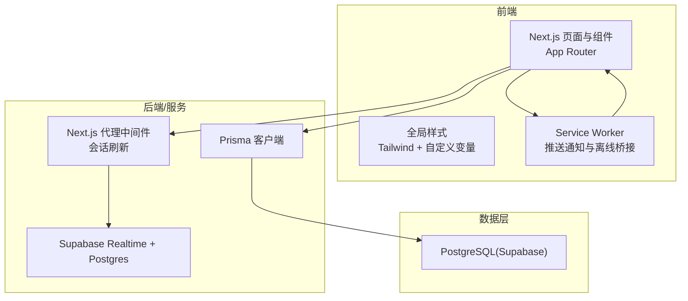
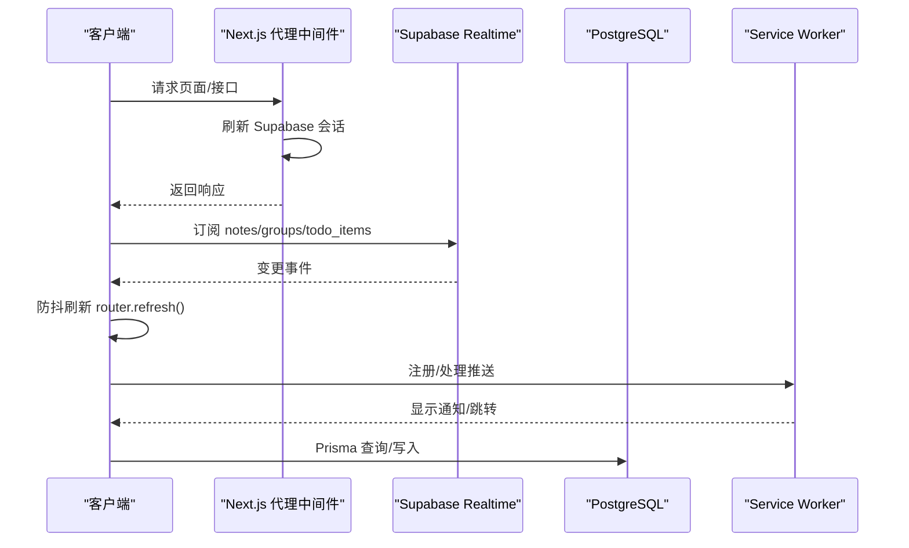
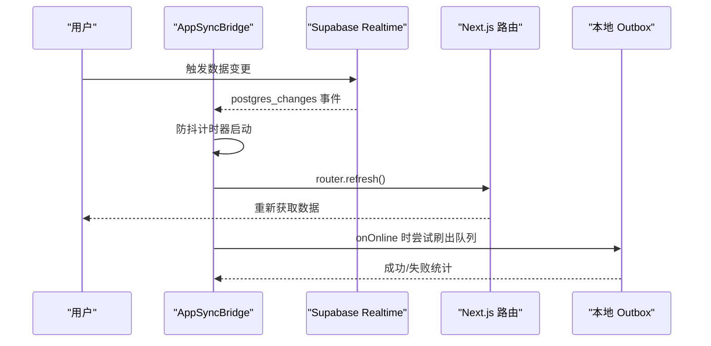
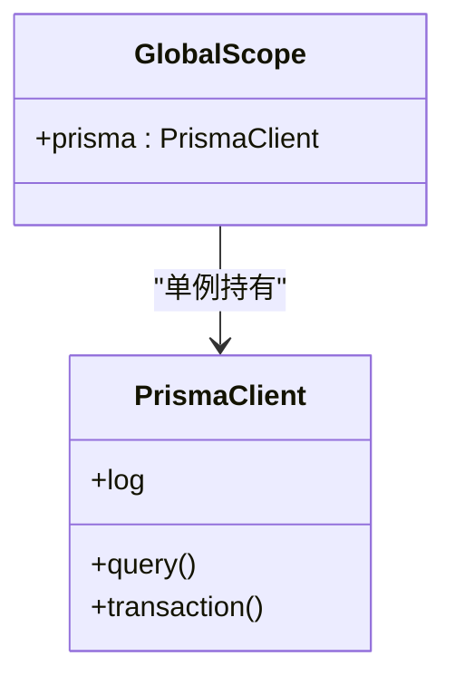
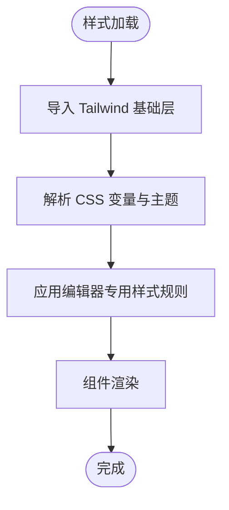
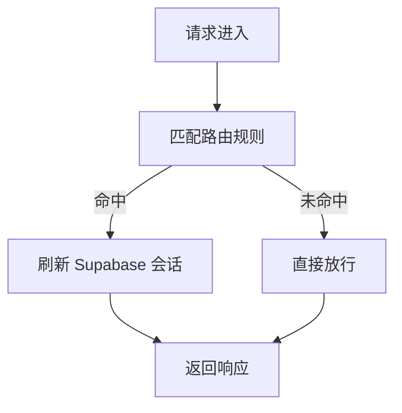
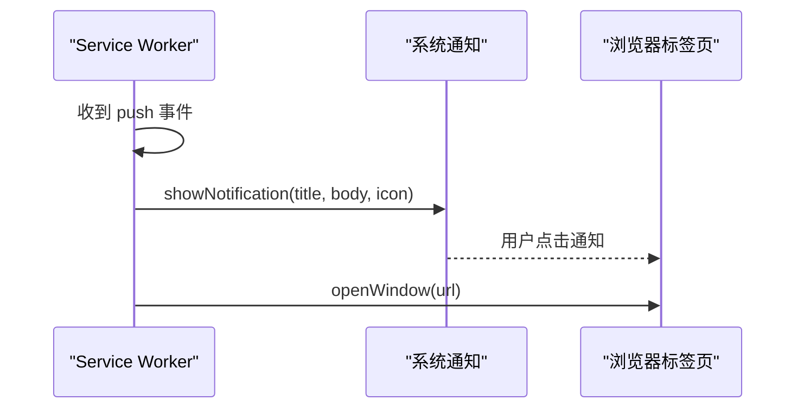
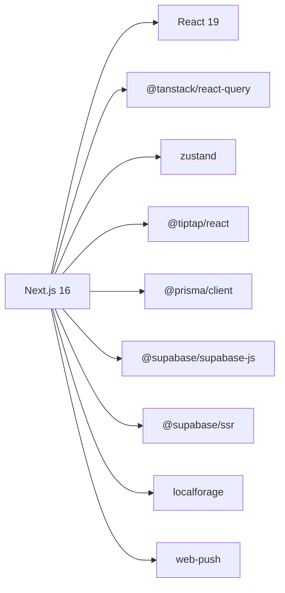

# 性能优化

<cite>
**本文引用的文件**
- [package.json](file://package.json)
- [next.config.ts](file://next.config.ts)
- [prisma/schema.prisma](file://prisma/schema.prisma)
- [public/sw.js](file://public/sw.js)
- [src/lib/db/index.ts](file://src/lib/db/index.ts)
- [src/app/globals.css](file://src/app/globals.css)
- [src/components/app/app-sync-bridge.tsx](file://src/components/app/app-sync-bridge.tsx)
- [src/lib/constants.ts](file://src/lib/constants.ts)
- [src/lib/utils.ts](file://src/lib/utils.ts)
- [src/types/note.ts](file://src/types/note.ts)
- [src/proxy.ts](file://src/proxy.ts)
</cite>

## 目录
1. [简介](#简介)
2. [项目结构](#项目结构)
3. [核心组件](#核心组件)
4. [架构总览](#架构总览)
5. [详细组件分析](#详细组件分析)
6. [依赖分析](#依赖分析)
7. [性能考虑](#性能考虑)
8. [故障排查指南](#故障排查指南)
9. [结论](#结论)
10. [附录](#附录)

## 简介
本指南面向 Smart-Todo（智能待办）项目的性能优化，覆盖前端性能优化、数据库查询优化、缓存策略、实时同步性能、内存管理、监控与分析以及生产环境调优与告警配置。文档基于仓库现有实现进行分析，并提出可落地的优化建议。

## 项目结构
Smart-Todo 基于 Next.js 16 应用，采用 App Router；数据访问通过 Prisma 客户端；实时同步基于 Supabase Realtime；离线能力通过 Service Worker 与本地队列实现；UI 使用 Tailwind CSS 与 shadcn 组件库。

图表来源
- [src/proxy.ts:1-24](file://src/proxy.ts#L1-L24)
- [src/lib/db/index.ts:1-16](file://src/lib/db/index.ts#L1-L16)
- [prisma/schema.prisma:1-117](file://prisma/schema.prisma#L1-L117)
- [public/sw.js:1-29](file://public/sw.js#L1-L29)

章节来源
- [package.json:1-86](file://package.json#L1-L86)
- [next.config.ts:1-8](file://next.config.ts#L1-L8)
- [src/proxy.ts:1-24](file://src/proxy.ts#L1-L24)

## 核心组件
- 实时同步桥：订阅 Supabase Realtime，对变更进行防抖刷新，同时在联网时尝试刷出本地离线队列。
- 数据访问层：全局单例 Prisma 客户端，按需日志输出。
- 全局样式：Tailwind 与自定义 CSS 变量，包含编辑器相关样式规则。
- 代理中间件：统一刷新 Supabase 会话，匹配除静态资源外的所有请求路径。
- Service Worker：最小化推送通知与点击跳转处理。

章节来源
- [src/components/app/app-sync-bridge.tsx:1-118](file://src/components/app/app-sync-bridge.tsx#L1-L118)
- [src/lib/db/index.ts:1-16](file://src/lib/db/index.ts#L1-L16)
- [src/app/globals.css:1-193](file://src/app/globals.css#L1-L193)
- [src/proxy.ts:1-24](file://src/proxy.ts#L1-L24)
- [public/sw.js:1-29](file://public/sw.js#L1-L29)

## 架构总览
前端通过 Next.js 访问 Supabase Realtime 与数据库；代理中间件确保会话一致性；Service Worker 提供推送与离线体验；Prisma 客户端负责 ORM 访问。

图表来源
- [src/proxy.ts:1-24](file://src/proxy.ts#L1-L24)
- [src/components/app/app-sync-bridge.tsx:1-118](file://src/components/app/app-sync-bridge.tsx#L1-L118)
- [public/sw.js:1-29](file://public/sw.js#L1-L29)
- [src/lib/db/index.ts:1-16](file://src/lib/db/index.ts#L1-L16)

## 详细组件分析

### 实时同步桥（AppSyncBridge）
- 功能要点
  - 为每个用户建立独立频道，订阅 notes、groups、todo_items 的所有变更事件。
  - 使用防抖定时器减少频繁刷新带来的性能压力。
  - 在网络恢复时尝试刷出本地 outbox 队列，提升离线场景下的数据一致性。
- 性能影响
  - 频繁的 router.refresh 会触发服务端渲染与客户端水合，需谨慎控制刷新频率。
  - 防抖阈值可按业务复杂度调整，避免过度延迟。
- 优化建议
  - 将不同实体的刷新合并为更细粒度的局部刷新，减少全量刷新。
  - 引入增量更新策略，仅拉取变更时间窗口内的记录，降低查询与渲染成本。
  - 对 outbox 刷出失败的条目进行重试与冲突检测，避免重复提交。

图表来源
- [src/components/app/app-sync-bridge.tsx:20-118](file://src/components/app/app-sync-bridge.tsx#L20-L118)

章节来源
- [src/components/app/app-sync-bridge.tsx:1-118](file://src/components/app/app-sync-bridge.tsx#L1-L118)

### 数据访问层（Prisma 客户端）
- 全局单例模式避免重复初始化，开发环境下开启查询日志便于定位慢查询。
- 建议结合数据库迁移脚本启用 RLS 策略与实时发布，保障安全与同步。

图表来源
- [src/lib/db/index.ts:1-16](file://src/lib/db/index.ts#L1-L16)

章节来源
- [src/lib/db/index.ts:1-16](file://src/lib/db/index.ts#L1-L16)
- [prisma/schema.prisma:1-117](file://prisma/schema.prisma#L1-L117)

### 全局样式与 UI 渲染
- Tailwind 与自定义 CSS 变量集中管理主题与尺寸，减少重复计算。
- 编辑器相关样式针对图片、任务列表、占位符等做了针对性优化，有助于提升渲染效率。

图表来源
- [src/app/globals.css:1-193](file://src/app/globals.css#L1-L193)

章节来源
- [src/app/globals.css:1-193](file://src/app/globals.css#L1-L193)

### 代理中间件（会话刷新）
- 统一在代理层刷新 Supabase 会话，减少各路由重复逻辑。
- 匹配规则排除静态资源与图标，降低不必要的中间件开销。

图表来源
- [src/proxy.ts:1-24](file://src/proxy.ts#L1-L24)

章节来源
- [src/proxy.ts:1-24](file://src/proxy.ts#L1-L24)

### Service Worker（推送与离线）
- 处理 push 事件显示通知，点击后打开指定 URL。
- 作为离线桥接的一环，配合本地 outbox 与 router.refresh 实现最终一致。

图表来源
- [public/sw.js:1-29](file://public/sw.js#L1-L29)

章节来源
- [public/sw.js:1-29](file://public/sw.js#L1-L29)

## 依赖分析
- 前端框架与运行时：Next.js 16、React 19、React DOM。
- 状态与查询：@tanstack/react-query、zustand。
- 富文本编辑：@tiptap/react、@tiptap/core。
- 数据库与认证：@prisma/client、@supabase/supabase-js、@supabase/ssr。
- UI 组件与样式：shadcn、lucide-react、tailwind-merge、clsx。
- 离线与推送：localforage、web-push。

图表来源
- [package.json:22-60](file://package.json#L22-L60)

章节来源
- [package.json:1-86](file://package.json#L1-L86)

## 性能考虑

### 前端性能优化
- 代码分割与懒加载
  - 利用 Next.js 的 App Router 自动按路由拆分包；对重型组件（如富文本编辑器）采用动态导入，减少首屏体积。
  - 将非关键路径的页面或功能模块延迟加载，缩短 TTI。
- 图片与媒体
  - 使用 Next.js 图像优化（_next/image）处理静态资源；对动态图片采用懒加载与合适的尺寸裁剪。
  - 对编辑器中的图片设置最大宽度与高度，避免布局抖动。
- CSS 优化
  - 合理使用 Tailwind 工具类，避免生成冗余样式；将常用样式抽离为组件样式，减少重复计算。
  - 保持 CSS 变量集中管理，减少主题切换时的重排重绘。
- 交互与动画
  - 控制动画数量与复杂度，优先使用 transform 与 opacity；避免在关键路径中执行昂贵的布局计算。

### 数据库查询优化
- 索引设计
  - 用户维度查询（如 notes.userId、groups.userId、todo_items.userId）已建立索引，建议对高频过滤字段（如 isDeleted、isPinned、updatedAt）组合索引进行评估。
  - 对提醒与到期时间字段（remindAt、dueAt）建立复合索引，优化聚合视图与提醒查询。
- 查询优化
  - 使用分页与投影字段，避免 SELECT *；对大结果集使用 LIMIT 与 OFFSET 或基于游标的分页。
  - 将复杂查询拆分为多个简单查询，必要时引入物化视图或预聚合表。
- 连接池配置
  - 在生产环境配置数据库连接池大小与超时参数，避免连接争用导致的排队。
  - 使用只读副本处理报表类查询，减轻主库压力。

### 缓存策略
- 浏览器缓存
  - 对静态资源与构建产物设置强缓存策略；对动态内容设置合理的协商缓存。
  - 使用 ETag/Last-Modified 实现条件请求，减少带宽消耗。
- 服务器缓存
  - 对热点查询结果进行缓存（如用户列表、分组聚合），结合失效策略与并发一致性。
  - 使用 CDN 加速静态资源与图片，降低源站负载。
- 离线缓存
  - 结合 localforage 与 Service Worker，将关键数据与操作队列持久化，提升弱网与断网体验。
  - 对 outbox 队列进行幂等与冲突检测，保证最终一致性。

### 实时同步性能优化
- 增量更新
  - 仅拉取变更时间窗口内的记录，减少全量刷新；对列表页采用“最近修改优先”的排序策略。
- 冲突检测优化
  - 基于 syncVersion 字段进行 LWW（最后写入获胜）冲突解决，减少回滚与重试成本。
- 网络重试策略
  - 对临时性错误（网络抖动、超时）采用指数退避与最大重试次数限制，避免雪崩效应。
  - 对 outbox 刷出失败的条目进行分类处理（网络错误 vs 业务冲突），分别采取重试或人工干预。

### 内存管理最佳实践
- 对象释放
  - 在组件卸载时清理定时器、防抖函数与订阅回调，避免悬挂引用。
- 事件监听器清理
  - 移除 window online/offline、Realtime channel、DOM 事件监听器，防止内存泄漏。
- 内存泄漏预防
  - 使用 React DevTools Profiler 与浏览器内存快照定期检查异常增长。
  - 对长列表采用虚拟滚动，减少 DOM 节点数量。

### 监控与分析
- 指标采集
  - 前端：测量 FCP/LCP/FID/CLS/TBT 等 Core Web Vitals；记录路由切换耗时与关键 API 延迟。
  - 后端：记录数据库查询耗时、慢查询比例、连接池利用率与错误率。
- 瓶颈识别
  - 使用性能剖析工具定位渲染热点与阻塞任务；结合数据库 EXPLAIN 分析慢查询。
- 效果评估
  - 以 A/B 实验对比优化前后的用户体验指标与业务指标，持续迭代。

### 生产环境调优与告警
- 调优建议
  - 启用压缩与 Gzip/Brotli；开启 HTTP/2/3；合理配置缓存头与预加载策略。
  - 对 Supabase Realtime 进行连接数与消息速率限制，避免风暴。
- 监控告警
  - 设置关键阈值：页面加载时间、API 延迟、错误率、数据库慢查询、连接池饱和、推送失败率。
  - 建立多级告警（通知、升级、值班），确保问题及时处置。

## 故障排查指南
- 实时同步不生效
  - 检查 Supabase Realtime 是否正常连接；确认频道名称与用户 ID 正确；查看防抖是否过短导致频繁刷新。
- 离线草稿无法同步
  - 检查 outbox 队列状态与网络状态；对冲突条目进行重试或人工处理；关注 toast 提示中的失败数量。
- 页面卡顿或白屏
  - 使用浏览器性能面板分析主线程占用；检查是否存在大量重排重绘；优化组件渲染与事件绑定。
- 数据库慢查询
  - 查看 Prisma 日志与数据库 EXPLAIN；为高频查询字段添加合适索引；拆分复杂查询为多个简单查询。

章节来源
- [src/components/app/app-sync-bridge.tsx:1-118](file://src/components/app/app-sync-bridge.tsx#L1-L118)
- [src/lib/db/index.ts:1-16](file://src/lib/db/index.ts#L1-L16)

## 结论
Smart-Todo 的性能优化应围绕“前端渲染优化、数据库查询优化、缓存与离线策略、实时同步与内存管理”五个方面展开。通过合理的索引设计、增量更新、缓存与重试策略、以及完善的监控与告警体系，可在保证用户体验的同时提升系统的稳定性与可扩展性。

## 附录
- 类型与常量
  - Note 预览与分组类型定义，便于前端按需渲染与排序。
  - 应用名称、颜色枚举与回收站保留天数等常量，统一管理业务配置。

章节来源
- [src/types/note.ts:1-13](file://src/types/note.ts#L1-L13)
- [src/lib/constants.ts:1-16](file://src/lib/constants.ts#L1-L16)
- [src/lib/utils.ts:1-7](file://src/lib/utils.ts#L1-L7)