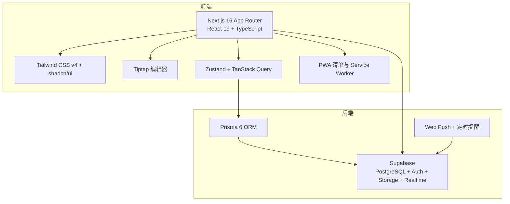
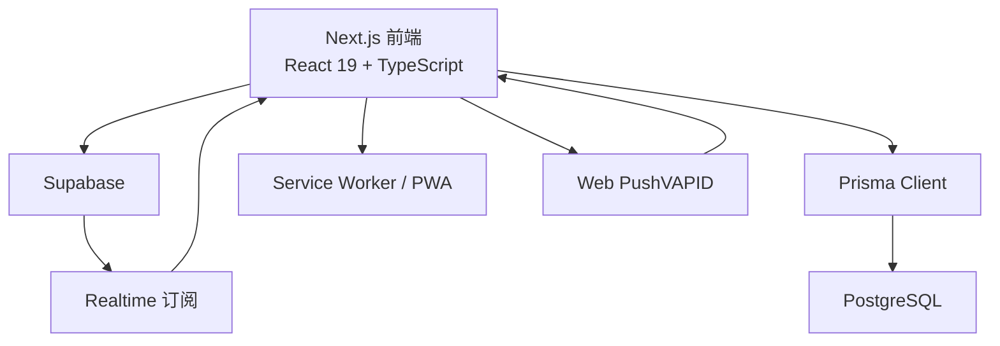
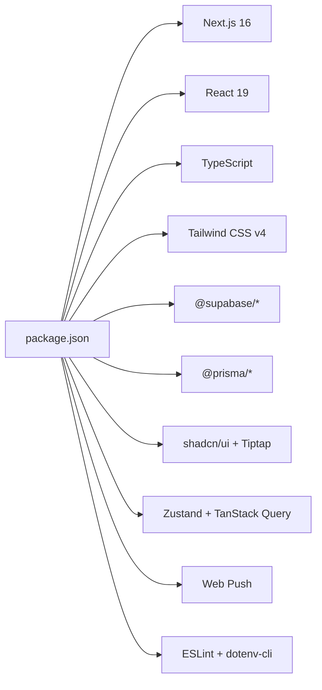

# 环境搭建

<cite>
**本文引用的文件**
- [package.json](file://package.json)
- [pnpm-workspace.yaml](file://pnpm-workspace.yaml)
- [README.md](file://README.md)
- [next.config.ts](file://next.config.ts)
- [tsconfig.json](file://tsconfig.json)
- [components.json](file://components.json)
- [eslint.config.mjs](file://eslint.config.mjs)
- [postcss.config.mjs](file://postcss.config.mjs)
- [prisma/schema.prisma](file://prisma/schema.prisma)
- [supabase/migrations/20260513000000_enable_rls_policies.sql](file://supabase/migrations/20260513000000_enable_rls_policies.sql)
- [supabase/migrations/20260513120000_storage_note_images.sql](file://supabase/migrations/20260513120000_storage_note_images.sql)
- [supabase/migrations/20260513140000_realtime_publication.sql](file://supabase/migrations/20260513140000_realtime_publication.sql)
- [src/lib/supabase/client.ts](file://src/lib/supabase/client.ts)
- [src/lib/db/index.ts](file://src/lib/db/index.ts)
- [src/app/layout.tsx](file://src/app/layout.tsx)
</cite>

## 目录
1. [简介](#简介)
2. [项目结构](#项目结构)
3. [核心组件](#核心组件)
4. [架构总览](#架构总览)
5. [详细组件分析](#详细组件分析)
6. [依赖关系分析](#依赖关系分析)
7. [性能考虑](#性能考虑)
8. [故障排查指南](#故障排查指南)
9. [结论](#结论)
10. [附录](#附录)

## 简介
本指南面向首次搭建 Smart-Todo 开发环境的开发者，覆盖以下内容：
- Node.js 版本要求与安装方法
- pnpm 包管理器的安装与配置
- 项目依赖安装流程（含开发依赖与生产依赖）
- 环境变量配置（Supabase、数据库、Web Push 等）
- 开发服务器启动步骤与常用命令
- 常见环境问题排查（端口占用、权限问题等）
- IDE 配置建议（VS Code 扩展与调试）

## 项目结构
Smart-Todo 是基于 Next.js 16 App Router 的全栈应用，前端使用 React 19、TypeScript、Tailwind CSS v4 与 shadcn/ui，后端采用 Supabase（PostgreSQL + Auth + Storage + Realtime），ORM 使用 Prisma 6，并集成 Web Push、PWA 与离线同步能力。

**章节来源**
- [README.md: 第9-21节:9-21](file://README.md#L9-L21)
- [package.json: 第22-61节:22-61](file://package.json#L22-L61)
- [prisma/schema.prisma: 第1-14节:1-14](file://prisma/schema.prisma#L1-L14)

## 核心组件
- 包管理与脚本
  - 使用 pnpm 作为包管理器，指定版本与工作区配置。
  - 提供开发、构建、类型检查、ESLint、Prisma 相关脚本。
- TypeScript 与工具链
  - TypeScript、ESLint、Tailwind CSS v4、PostCSS。
- 前端框架与 UI
  - Next.js 16 App Router、React 19、shadcn/ui 组件库。
- 数据层
  - Supabase PostgreSQL 作为主数据库；Prisma 6 生成客户端与迁移。
- 实时与推送
  - Supabase Realtime 订阅；Web Push（VAPID）与定时提醒。
- PWA
  - Service Worker 与 manifest.json 支持。

**章节来源**
- [package.json: 第5-21节:5-21](file://package.json#L5-L21)
- [tsconfig.json: 第1-35节:1-35](file://tsconfig.json#L1-L35)
- [eslint.config.mjs: 第1-19节:1-19](file://eslint.config.mjs#L1-L19)
- [postcss.config.mjs: 第1-8节:1-8](file://postcss.config.mjs#L1-L8)
- [components.json: 第1-26节:1-26](file://components.json#L1-L26)
- [README.md: 第9-21节:9-21](file://README.md#L9-L21)

## 架构总览
下图展示前端、数据库与第三方服务之间的交互关系。

**图表来源**
- [src/lib/supabase/client.ts: 第1-9节:1-9](file://src/lib/supabase/client.ts#L1-L9)
- [src/lib/db/index.ts: 第1-16节:1-16](file://src/lib/db/index.ts#L1-L16)
- [prisma/schema.prisma: 第1-14节:1-14](file://prisma/schema.prisma#L1-L14)
- [src/app/layout.tsx: 第17-35节:17-35](file://src/app/layout.tsx#L17-L35)

**章节来源**
- [src/lib/supabase/client.ts: 第1-9节:1-9](file://src/lib/supabase/client.ts#L1-L9)
- [src/lib/db/index.ts: 第1-16节:1-16](file://src/lib/db/index.ts#L1-L16)
- [prisma/schema.prisma: 第1-14节:1-14](file://prisma/schema.prisma#L1-L14)
- [src/app/layout.tsx: 第17-35节:17-35](file://src/app/layout.tsx#L17-L35)

## 详细组件分析

### Node.js 与 pnpm 环境准备
- Node.js 版本要求
  - 最低版本：20.9+
  - 建议使用长期支持（LTS）版本，确保与 Next.js 16 兼容。
- pnpm 安装与配置
  - 项目声明了使用的 pnpm 版本与工作区策略，建议直接使用项目自带的 pnpm。
  - 工作区允许对特定依赖进行构建控制，保证 Prisma、sharp 等二进制依赖正确安装。
- 安装依赖
  - 使用 pnpm 安装所有依赖（包含开发与生产依赖）。
  - 如需切换包管理器，需注意 pnpm 的独有行为与工作区配置。

**章节来源**
- [README.md: 第204-211节:204-211](file://README.md#L204-L211)
- [package.json: 第5节](file://package.json#L5)
- [pnpm-workspace.yaml: 第1-8节:1-8](file://pnpm-workspace.yaml#L1-L8)

### Supabase 与数据库配置
- Supabase 项目初始化
  - 在 Supabase Dashboard 创建项目，获取 API URL、匿名密钥与服务端密钥。
  - 配置数据库连接字符串（Pooler 与 Direct URL）。
- 认证提供商
  - 启用 GitHub 与 Email/Password，回调地址需与开发端口一致（3005）。
- 数据库同步与策略
  - 推送 schema：执行 db:push。
  - 启用 RLS 与策略：执行 db:rls。
  - 创建 Storage 图片桶与策略：执行 db:storage。
  - 注册 Realtime publication：执行 db:realtime。
- 环境变量
  - NEXT_PUBLIC_SUPABASE_URL、NEXT_PUBLIC_SUPABASE_ANON_KEY、SUPABASE_SERVICE_ROLE_KEY。
  - DATABASE_URL、DIRECT_URL。
  - 可选：NEXT_PUBLIC_APP_URL、CRON_SECRET、VAPID 相关变量。

**章节来源**
- [README.md: 第63-114节:63-114](file://README.md#L63-L114)
- [src/lib/supabase/client.ts: 第1-9节:1-9](file://src/lib/supabase/client.ts#L1-L9)
- [prisma/schema.prisma: 第9-13节:9-13](file://prisma/schema.prisma#L9-L13)
- [supabase/migrations/20260513000000_enable_rls_policies.sql: 第1-203节:1-203](file://supabase/migrations/20260513000000_enable_rls_policies.sql#L1-L203)
- [supabase/migrations/20260513120000_storage_note_images.sql: 第1-51节:1-51](file://supabase/migrations/20260513120000_storage_note_images.sql#L1-L51)
- [supabase/migrations/20260513140000_realtime_publication.sql: 第1-7节:1-7](file://supabase/migrations/20260513140000_realtime_publication.sql#L1-L7)

### Prisma 与本地数据库
- 数据模型
  - 包含 Profile、Group、Note、TodoItem、PushSubscription 等模型。
  - 数据源通过 DATABASE_URL 与 DIRECT_URL 环境变量注入。
- 常用操作
  - 生成 Prisma Client：db:generate。
  - 推送 schema：db:push。
  - 创建并应用迁移：db:migrate。
  - 打开 Prisma Studio：db:studio。
  - 重置数据库（开发环境）：db:reset。

**章节来源**
- [prisma/schema.prisma: 第15-117节:15-117](file://prisma/schema.prisma#L15-L117)
- [package.json: 第12-19节:12-19](file://package.json#L12-L19)

### Web Push 与定时提醒（M4）
- VAPID 密钥生成与配置
  - 生成公私钥，分别填入 NEXT_PUBLIC_VAPID_PUBLIC_KEY 与 VAPID_PRIVATE_KEY。
  - 设置 VAPID_SUBJECT（如 mailto）。
- 定时任务
  - 本地开发：通过 /api/cron/remind 接口触发扫描。
  - 生产环境：使用云服务器 crontab 每分钟调用该接口，需携带 Authorization: Bearer <CRON_SECRET>。
- 自检工具
  - 使用 verify:m4-cron 脚本进行自检，支持覆盖测试端口。

**章节来源**
- [README.md: 第115-141节:115-141](file://README.md#L115-L141)
- [package.json: 第20节](file://package.json#L20)

### 开发服务器与常用命令
- 启动开发服务器
  - 固定端口 3005，避免与其他 Next 项目冲突。
  - 健康检查：/api/health。
- 常用命令
  - dev、build、start、lint、typecheck、db:generate、db:push、db:migrate、db:studio、db:reset、db:rls、db:storage、db:realtime、verify:m4-cron。

**章节来源**
- [README.md: 第33-62节:33-62](file://README.md#L33-L62)
- [README.md: 第142-160节:142-160](file://README.md#L142-L160)
- [package.json: 第6-21节:6-21](file://package.json#L6-L21)

### IDE 配置建议（VS Code）
- 推荐扩展
  - ESLint、TypeScript TSServer、Tailwind CSS IntelliSense、Prisma。
- 调试配置
  - 使用 VS Code 的调试面板，选择“Attach to Node”或“Edge”等配置，结合 Next.js 16 的中间件与异步 API。
  - 建议在 launch.json 中设置断点于页面入口与 API 路由，便于观察数据流与状态更新。

**章节来源**
- [eslint.config.mjs: 第1-19节:1-19](file://eslint.config.mjs#L1-L19)
- [tsconfig.json: 第1-35节:1-35](file://tsconfig.json#L1-L35)
- [components.json: 第1-26节:1-26](file://components.json#L1-L26)

## 依赖关系分析
- 包管理器与工作区
  - pnpm 声明版本与 onlyBuiltDependencies，确保二进制依赖正确构建。
  - pnpm-workspace.yaml 控制允许构建的依赖集合。
- 前端依赖
  - Next.js 16、React 19、TypeScript、Tailwind CSS v4、shadcn/ui、Tiptap、Zustand、TanStack Query、Web Push 等。
- 后端依赖
  - @supabase/supabase-js、@supabase/ssr、@prisma/client、Prisma CLI。
- 开发工具
  - ESLint、TypeScript、Tailwind CSS v4、dotenv-cli。

**图表来源**
- [package.json: 第22-84节:22-84](file://package.json#L22-L84)

**章节来源**
- [package.json: 第22-84节:22-84](file://package.json#L22-L84)
- [pnpm-workspace.yaml: 第1-8节:1-8](file://pnpm-workspace.yaml#L1-L8)

## 性能考虑
- 开发体验
  - 使用 Turbopack（Next.js 16 默认）提升热重载与构建速度。
  - 仅在开发环境打印数据库日志，减少生产噪音。
- 数据库与实时
  - 合理使用 Prisma 查询与索引，避免 N+1。
  - 使用 Supabase Realtime 减少轮询，提高多端同步效率。
- 前端优化
  - Tailwind CSS v4 与 shadcn/ui 组件按需引入，避免打包冗余。
  - PWA 与 Service Worker 提升离线体验与加载性能。

**章节来源**
- [README.md: 第204-211节:204-211](file://README.md#L204-L211)
- [src/lib/db/index.ts: 第10-11节:10-11](file://src/lib/db/index.ts#L10-L11)
- [next.config.ts: 第1-8节:1-8](file://next.config.ts#L1-L8)

## 故障排查指南
- 端口占用
  - 开发端口固定为 3005，若被占用请释放或修改端口。
  - 修改后需同步更新 Supabase 的 Redirect URLs 白名单。
- 权限问题
  - 数据库直连与池化连接字符串需正确配置，避免连接失败。
  - RLS 策略需使用有效 JWT（用户会话或服务端密钥）执行。
- 环境变量缺失
  - 缺少 Supabase 或 VAPID 相关变量会导致认证与推送功能异常。
  - 使用 dotenv-cli 在执行 Prisma 命令时加载 .env.local。
- Web Push 与定时提醒
  - 确认 VAPID 公私钥配对正确，CRON_SECRET 一致。
  - 本地验证可通过 /api/cron/remind 或 verify:m4-cron 脚本。
- Next.js 16 特性
  - cookies() / headers() / params / searchParams 必须 await。
  - 中间件文件名为 proxy，而非 middleware。

**章节来源**
- [README.md: 第33-62节:33-62](file://README.md#L33-L62)
- [README.md: 第115-141节:115-141](file://README.md#L115-L141)
- [prisma/schema.prisma: 第9-13节:9-13](file://prisma/schema.prisma#L9-L13)
- [package.json: 第13-20节:13-20](file://package.json#L13-L20)

## 结论
按照本指南完成 Node.js 与 pnpm 安装、依赖安装、Supabase 与数据库配置、环境变量设置以及开发服务器启动后，即可进入日常开发。遇到问题时，优先检查端口、环境变量与 Next.js 16 的特殊要求，并利用项目提供的脚本快速定位与修复。

## 附录
- 常用命令清单
  - 开发：npm run dev
  - 构建：npm run build
  - 启动生产：npm run start
  - ESLint：npm run lint
  - 类型检查：npm run typecheck
  - Prisma：db:generate、db:push、db:migrate、db:studio、db:reset、db:rls、db:storage、db:realtime
  - M4 自检：verify:m4-cron

**章节来源**
- [README.md: 第142-160节:142-160](file://README.md#L142-L160)
- [package.json: 第6-21节:6-21](file://package.json#L6-L21)