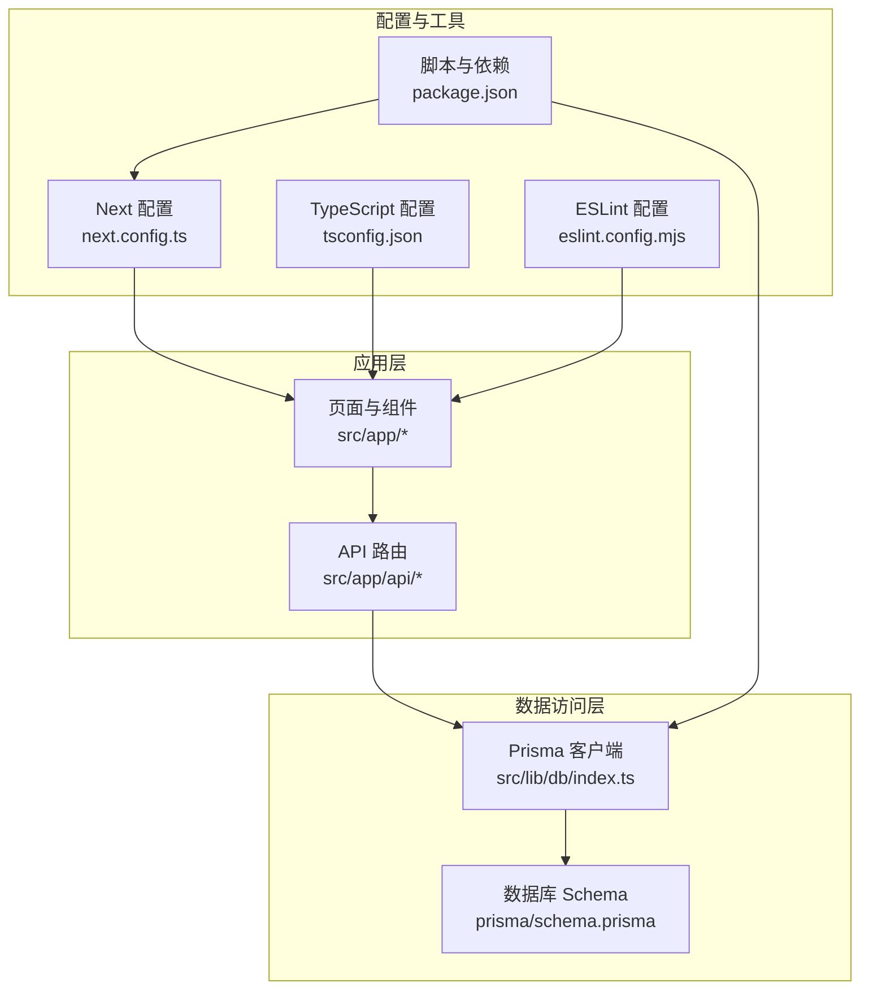
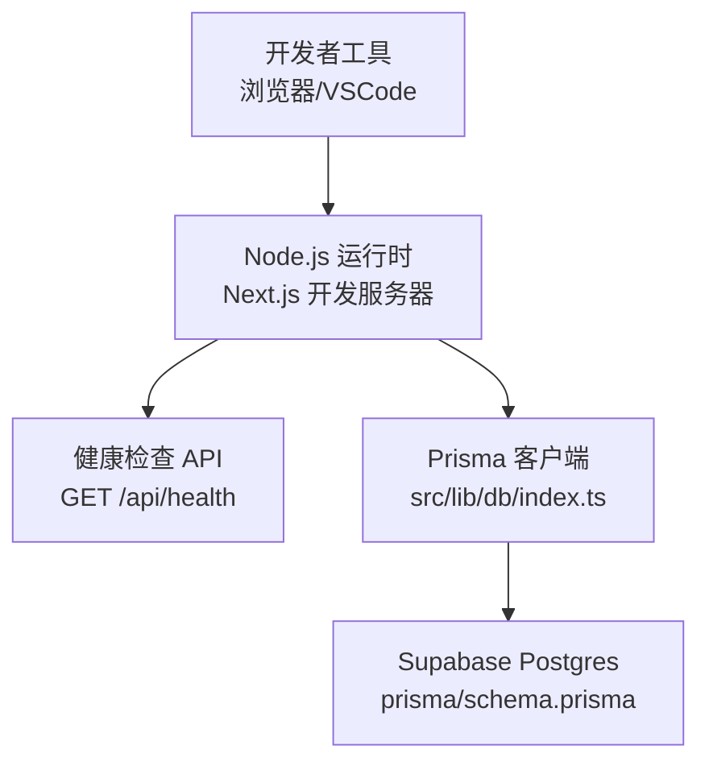
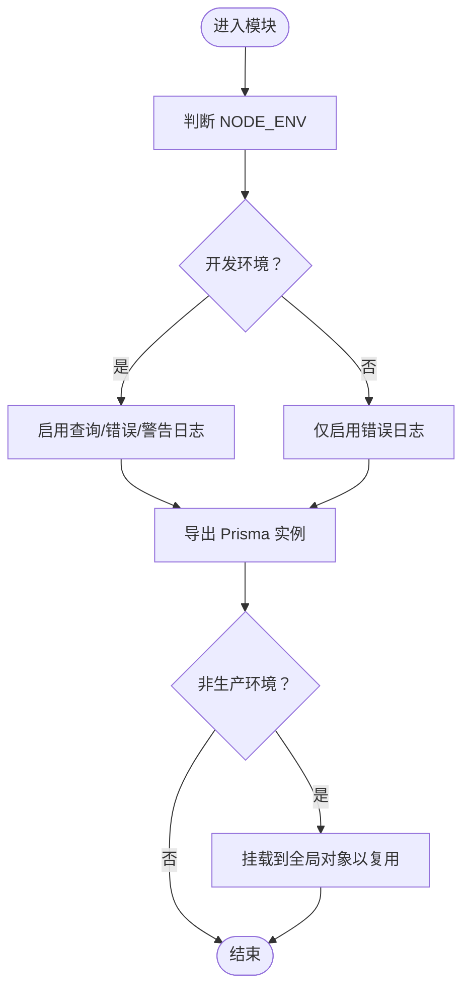
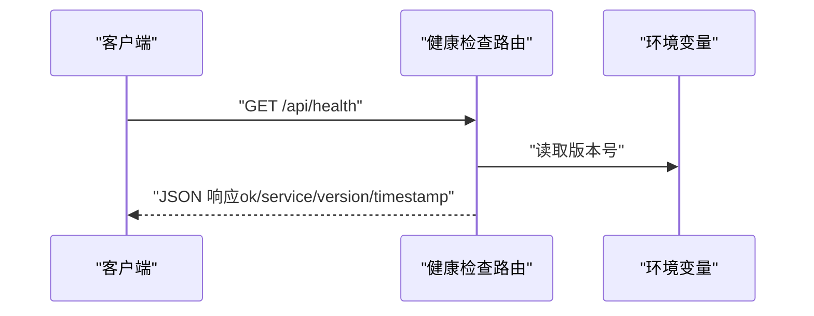
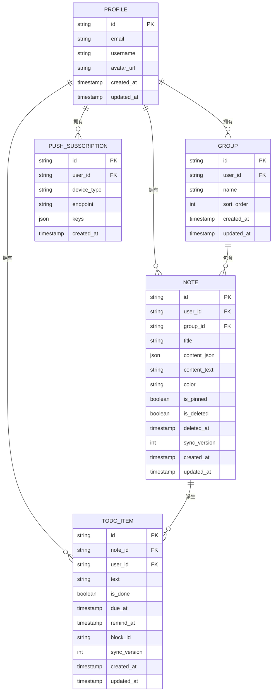
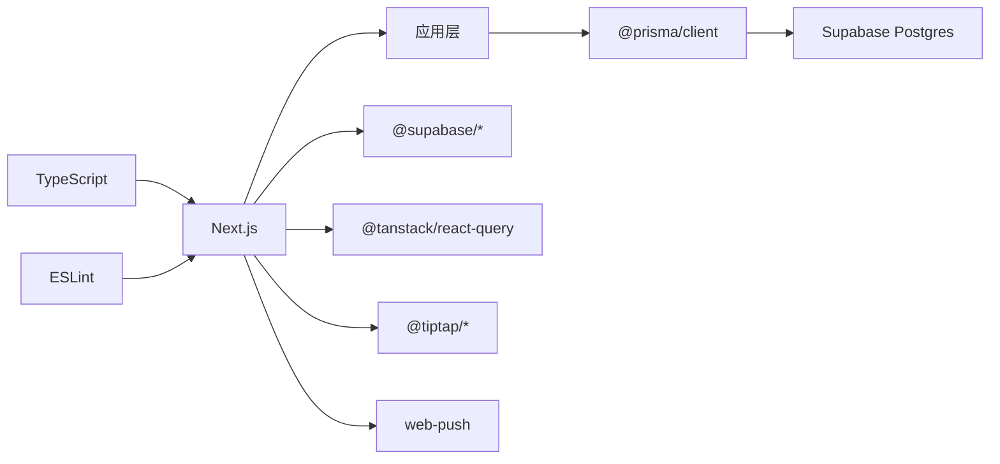

# 调试与测试

<cite>
**本文引用的文件**
- [package.json](file://package.json)
- [next.config.ts](file://next.config.ts)
- [tsconfig.json](file://tsconfig.json)
- [eslint.config.mjs](file://eslint.config.mjs)
- [prisma/schema.prisma](file://prisma/schema.prisma)
- [src/lib/db/index.ts](file://src/lib/db/index.ts)
- [src/app/api/health/route.ts](file://src/app/api/health/route.ts)
</cite>

## 目录
1. [简介](#简介)
2. [项目结构](#项目结构)
3. [核心组件](#核心组件)
4. [架构总览](#架构总览)
5. [详细组件分析](#详细组件分析)
6. [依赖分析](#依赖分析)
7. [性能考虑](#性能考虑)
8. [故障排查指南](#故障排查指南)
9. [结论](#结论)
10. [附录](#附录)

## 简介
本指南面向 Smart-Todo 项目的开发者与测试工程师，系统性地提供调试与测试方法论与实操建议。内容覆盖：
- 开发环境调试：浏览器开发者工具、Node.js 调试、断点设置
- 数据库调试：Prisma 查询日志、数据库连接、Schema 验证
- 单元测试与集成测试：Jest 配置、Mock 设定、测试用例设计
- 性能分析：内存泄漏检测、渲染性能分析
- 常见问题诊断：网络请求失败、数据库连接异常等

## 项目结构
Smart-Todo 采用 Next.js App Router 架构，数据库使用 Prisma + Supabase Postgres。测试与调试相关的关键位置如下：
- 应用入口与路由：Next.js App Router 页面与 API 路由
- 数据访问层：Prisma 客户端封装与日志配置
- 工具与配置：TypeScript、ESLint、Next 配置
- 数据库 Schema：Prisma Schema 描述业务模型与索引

图表来源
- [src/app/api/health/route.ts:1-13](file://src/app/api/health/route.ts#L1-L13)
- [src/lib/db/index.ts:1-16](file://src/lib/db/index.ts#L1-L16)
- [prisma/schema.prisma:1-117](file://prisma/schema.prisma#L1-L117)
- [next.config.ts:1-8](file://next.config.ts#L1-L8)
- [tsconfig.json:1-35](file://tsconfig.json#L1-L35)
- [eslint.config.mjs:1-19](file://eslint.config.mjs#L1-L19)
- [package.json:1-86](file://package.json#L1-L86)

章节来源
- [package.json:1-86](file://package.json#L1-L86)
- [next.config.ts:1-8](file://next.config.ts#L1-L8)
- [tsconfig.json:1-35](file://tsconfig.json#L1-L35)
- [eslint.config.mjs:1-19](file://eslint.config.mjs#L1-L19)
- [prisma/schema.prisma:1-117](file://prisma/schema.prisma#L1-L117)
- [src/lib/db/index.ts:1-16](file://src/lib/db/index.ts#L1-L16)
- [src/app/api/health/route.ts:1-13](file://src/app/api/health/route.ts#L1-L13)

## 核心组件
- 数据库客户端与日志
  - 在开发环境启用 Prisma 查询日志，便于定位慢查询与错误
  - 使用全局单例避免重复实例化，减少资源占用
- API 健康检查
  - 提供只读健康检查端点，验证服务可用性与版本信息
- 配置与脚本
  - 通过 package.json 的脚本统一管理数据库迁移、Studio、RLS/Storage/Realtime 初始化等
  - TypeScript 严格模式与路径别名提升开发体验与可维护性
  - ESLint 集成 Next 规范，确保代码质量

章节来源
- [src/lib/db/index.ts:1-16](file://src/lib/db/index.ts#L1-L16)
- [src/app/api/health/route.ts:1-13](file://src/app/api/health/route.ts#L1-L13)
- [package.json:6-21](file://package.json#L6-L21)
- [tsconfig.json:21-23](file://tsconfig.json#L21-L23)
- [eslint.config.mjs:1-19](file://eslint.config.mjs#L1-L19)

## 架构总览
下图展示调试与测试在系统中的位置与交互关系。

图表来源
- [src/app/api/health/route.ts:1-13](file://src/app/api/health/route.ts#L1-L13)
- [src/lib/db/index.ts:1-16](file://src/lib/db/index.ts#L1-L16)
- [prisma/schema.prisma:1-117](file://prisma/schema.prisma#L1-L117)

## 详细组件分析

### 组件一：数据库客户端与日志配置
- 设计要点
  - 开发环境开启查询日志，生产环境仅记录错误，降低噪声
  - 全局单例避免重复初始化，减少内存与连接压力
- 调试建议
  - 在本地启动后观察终端输出的 Prisma 查询日志，定位异常 SQL
  - 结合数据库慢查询日志与索引使用情况，优化查询
- 复杂度与性能
  - 单例初始化为 O(1)，查询复杂度取决于 Schema 索引与 SQL 设计

图表来源
- [src/lib/db/index.ts:7-15](file://src/lib/db/index.ts#L7-L15)

章节来源
- [src/lib/db/index.ts:1-16](file://src/lib/db/index.ts#L1-L16)

### 组件二：健康检查 API
- 设计要点
  - 强制动态响应，避免缓存影响健康状态
  - 返回服务名称、版本与时间戳，便于监控与排障
- 调试建议
  - 在本地或 CI 中调用该端点，确认服务可用性
  - 若返回异常，结合 Prisma 日志与数据库连接字符串排查

图表来源
- [src/app/api/health/route.ts:3-12](file://src/app/api/health/route.ts#L3-L12)

章节来源
- [src/app/api/health/route.ts:1-13](file://src/app/api/health/route.ts#L1-L13)

### 组件三：数据库 Schema 与索引
- 设计要点
  - 模型映射到 Supabase 表，包含用户资料、分组、便签、待办项、推送订阅等
  - 为高频查询建立复合索引，如用户维度的待办项、便签删除/置顶/更新索引
- 调试建议
  - 使用 Prisma Studio 或数据库客户端查看数据与索引
  - 对慢查询进行 EXPLAIN 分析，必要时调整索引或拆分查询

图表来源
- [prisma/schema.prisma:16-116](file://prisma/schema.prisma#L16-L116)

章节来源
- [prisma/schema.prisma:1-117](file://prisma/schema.prisma#L1-L117)

## 依赖分析
- 语言与构建
  - TypeScript 严格模式与路径别名，提升类型安全与导入一致性
  - ESLint 集成 Next 规范，统一风格与最佳实践
- 运行时与框架
  - Next.js App Router 提供页面与 API 路由能力
  - React 19 与 React Hooks 支持函数式组件与状态管理
- 数据与存储
  - Prisma 客户端负责数据库访问；Supabase 提供认证与实时发布
  - Zod 用于数据校验；React Query 用于数据获取与缓存

图表来源
- [package.json:22-60](file://package.json#L22-L60)
- [tsconfig.json:2-23](file://tsconfig.json#L2-L23)
- [eslint.config.mjs:1-19](file://eslint.config.mjs#L1-L19)

章节来源
- [package.json:22-60](file://package.json#L22-L60)
- [tsconfig.json:2-23](file://tsconfig.json#L2-L23)
- [eslint.config.mjs:1-19](file://eslint.config.mjs#L1-L19)

## 性能考虑
- 渲染性能
  - 使用 React DevTools Profiler 分析组件渲染耗时与重渲染热点
  - 利用 React Query Devtools 观察缓存命中率与无效请求
- 数据库性能
  - 开启 Prisma 查询日志，识别慢查询与缺失索引
  - 使用数据库 EXPLAIN 分析执行计划，按需补充索引
- 内存与连接
  - 通过全局单例复用 Prisma 实例，避免频繁创建连接
  - 监控 Node.js 堆内存与连接池使用，防止泄漏与抖动

## 故障排查指南
- 网络请求失败
  - 步骤
    - 使用浏览器 Network 面板检查请求/响应状态码与错误信息
    - 在 API 路由中添加最小化日志，确认入参与返回值
    - 调用健康检查端点验证服务可用性
  - 参考
    - 健康检查路由实现与强制动态响应
- 数据库连接异常
  - 步骤
    - 检查 DATABASE_URL/DIRECT_URL 是否正确
    - 查看 Prisma 查询日志中的错误堆栈
    - 使用 Prisma Studio 或数据库客户端验证连接与权限
    - 执行一次 Schema 验证与迁移
  - 参考
    - 数据库客户端日志级别与全局单例
    - 数据库 Schema 定义与索引
- 权限与 RLS
  - 步骤
    - 通过脚本启用 RLS 策略与存储策略
    - 验证 Supabase Auth 会话与用户 ID 关联
- 缓存与同步
  - 步骤
    - 使用 React Query Devtools 检查缓存键与失效策略
    - 核对便签/待办项的同步版本号与冲突处理逻辑

章节来源
- [src/app/api/health/route.ts:3-12](file://src/app/api/health/route.ts#L3-L12)
- [src/lib/db/index.ts:7-15](file://src/lib/db/index.ts#L7-L15)
- [prisma/schema.prisma:1-117](file://prisma/schema.prisma#L1-L117)
- [package.json:12-20](file://package.json#L12-L20)

## 结论
本指南提供了从浏览器到 Node.js、从前端到数据库的全链路调试与测试方法。建议在日常开发中：
- 开启 Prisma 查询日志，配合数据库 EXPLAIN 与索引优化
- 使用健康检查端点与 Devtools 快速定位问题
- 通过脚本化命令完成数据库初始化与迁移
- 将性能分析纳入常规回归流程，持续优化用户体验

## 附录
- 开发环境调试清单
  - 浏览器：Network 面板、Console 错误、React DevTools Profiler
  - Node.js：VSCode 断点、环境变量、日志级别
  - 数据库：Prisma Studio、慢查询日志、索引分析
- 测试策略建议
  - 单元测试：针对纯函数与 Hook 的边界条件
  - 集成测试：API 路由与数据库交互，使用 Mock 或临时测试库
  - E2E：端到端场景验证，关注网络与数据库异常分支