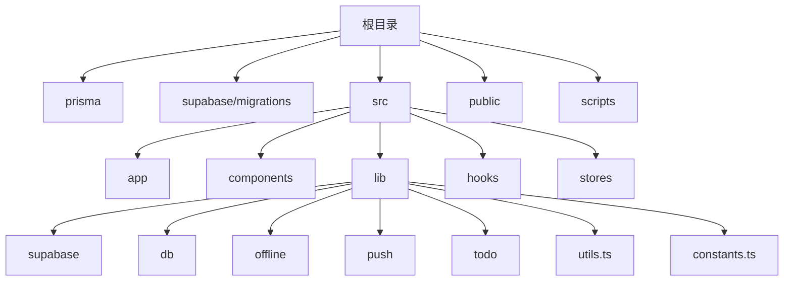
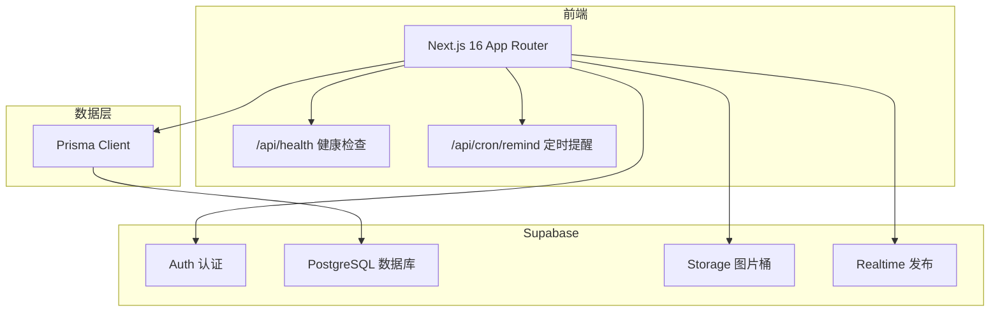
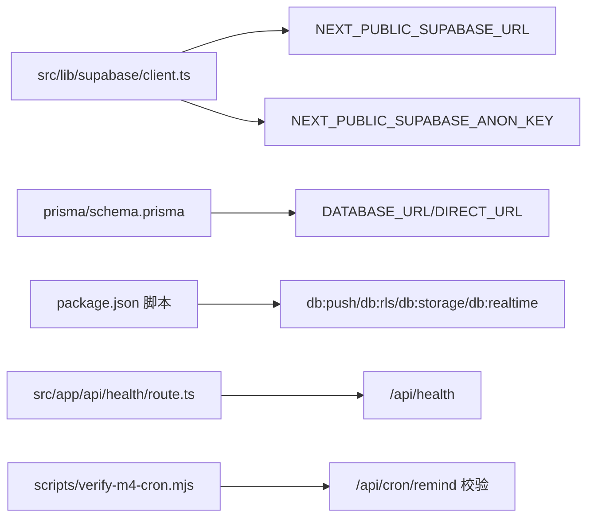

# 快速开始

<cite>
**本文引用的文件**
- [README.md](file://README.md)
- [package.json](file://package.json)
- [.env.example](file://.env.example)
- [prisma/schema.prisma](file://prisma/schema.prisma)
- [supabase/migrations/20260513000000_enable_rls_policies.sql](file://supabase/migrations/20260513000000_enable_rls_policies.sql)
- [supabase/migrations/20260513120000_storage_note_images.sql](file://supabase/migrations/20260513120000_storage_note_images.sql)
- [supabase/migrations/20260513140000_realtime_publication.sql](file://supabase/migrations/20260513140000_realtime_publication.sql)
- [src/lib/supabase/client.ts](file://src/lib/supabase/client.ts)
- [src/app/api/health/route.ts](file://src/app/api/health/route.ts)
- [scripts/verify-m4-cron.mjs](file://scripts/verify-m4-cron.mjs)
- [src/app/layout.tsx](file://src/app/layout.tsx)
- [src/lib/constants.ts](file://src/lib/constants.ts)
</cite>

## 目录
1. [简介](#简介)
2. [项目结构](#项目结构)
3. [核心组件](#核心组件)
4. [架构总览](#架构总览)
5. [详细组件分析](#详细组件分析)
6. [依赖关系分析](#依赖关系分析)
7. [性能注意事项](#性能注意事项)
8. [故障排查指南](#故障排查指南)
9. [结论](#结论)
10. [附录](#附录)

## 简介
本指南面向首次接触 Smart-Todo 的开发者，帮助你在最短时间内完成环境准备、依赖安装、Supabase 集成配置与开发服务器启动，并进行健康检查与基础功能验证。项目基于 Next.js 16（App Router）、TypeScript、Supabase（Postgres/Auth/Storage/Realtime）、Prisma 6，采用固定 3005 端口的开发模式，确保与其他 Next 项目不冲突。

## 项目结构
- 核心目录与职责概览
  - prisma：数据模型与数据库交互
  - supabase/migrations：手写 SQL（RLS、Storage、Realtime 发布）
  - src：应用源码（App Router、组件、lib、hooks、stores 等）
  - public：静态资源（PWA 清单、Service Worker）
  - scripts：辅助脚本（如 M4 Cron 校验）

章节来源
- [README.md:161-202](file://README.md#L161-L202)

## 核心组件
- 开发服务器与端口
  - 固定端口 3005，避免与其他 Next 项目抢占默认 3000 端口
  - 启动命令：npm run dev
- 健康检查
  - 路由：/api/health
  - 返回字段：ok、service、version、timestamp
- Supabase 客户端
  - 浏览器端通过 NEXT_PUBLIC_SUPABASE_URL 与 NEXT_PUBLIC_SUPABASE_ANON_KEY 初始化
- 数据模型（Prisma）
  - 包含 Profile、Group、Note、TodoItem、PushSubscription 等核心实体
- RLS 策略与 Storage/Realtime 配置
  - 通过脚本执行 SQL，启用 RLS 并创建策略
  - 创建 note-images 存储桶与策略
  - 将 notes/groups/todo_items 注册到 supabase_realtime publication

章节来源
- [README.md:33-62](file://README.md#L33-L62)
- [README.md:63-114](file://README.md#L63-L114)
- [src/app/api/health/route.ts:1-13](file://src/app/api/health/route.ts#L1-L13)
- [src/lib/supabase/client.ts:1-9](file://src/lib/supabase/client.ts#L1-L9)
- [prisma/schema.prisma:1-117](file://prisma/schema.prisma#L1-L117)

## 架构总览
Smart-Todo 的前端通过 Next.js 16 App Router 提供页面与 API 路由，Supabase 提供认证、数据库、存储与实时订阅能力，Prisma 作为 ORM 与数据库交互。开发服务器固定 3005 端口，健康检查与 Cron 提醒通过 API 路由提供。

图表来源
- [src/app/api/health/route.ts:1-13](file://src/app/api/health/route.ts#L1-L13)
- [prisma/schema.prisma:1-117](file://prisma/schema.prisma#L1-L117)
- [supabase/migrations/20260513000000_enable_rls_policies.sql:1-203](file://supabase/migrations/20260513000000_enable_rls_policies.sql#L1-L203)
- [supabase/migrations/20260513120000_storage_note_images.sql:1-51](file://supabase/migrations/20260513120000_storage_note_images.sql#L1-L51)
- [supabase/migrations/20260513140000_realtime_publication.sql:1-7](file://supabase/migrations/20260513140000_realtime_publication.sql#L1-L7)

## 详细组件分析

### 环境准备与依赖安装
- Node.js 版本要求
  - 最低版本：20.9+
- 包管理器选择
  - 项目声明使用 pnpm（版本在 package.json 中指定）
- 安装依赖
  - 执行 npm install（或 pnpm install，取决于你选择的包管理器）
- 可能遇到的问题
  - Node 版本过低：升级至 20.9+ 后重试
  - pnpm 版本不匹配：根据 package.json 的 pnpm 版本要求安装对应版本
  - 权限问题：在某些系统上需要使用 sudo 或调整权限

章节来源
- [README.md:204-211](file://README.md#L204-L211)
- [package.json:5](file://package.json#L5)
- [package.json:7](file://package.json#L7)

### Supabase 集成配置（完整流程）
- 步骤概览
  1) 在 Supabase Dashboard 创建项目
  2) 复制 API 配置到 .env.local
  3) 配置数据库连接字符串（DATABASE_URL/DIRECT_URL）
  4) 启用认证提供商（GitHub 与 Email）
  5) 推送 schema 到数据库（db:push）
  6) 启用 RLS 与策略（db:rls）
  7) 配置 Storage 图片桶（db:storage）
  8) 配置 Redirect URLs（至少包含 http://localhost:3005/auth/callback）
  9) 重启开发服务器，验证登录与便签功能
  10) 配置 Realtime 发布（db:realtime）
  11) 配置 Web Push 与定时提醒（VAPID、CRON_SECRET、NEXT_PUBLIC_APP_URL）
- 关键配置项
  - .env.local 中的 NEXT_PUBLIC_SUPABASE_URL、NEXT_PUBLIC_SUPABASE_ANON_KEY、SUPABASE_SERVICE_ROLE_KEY
  - DATABASE_URL（池化连接，带 sslmode=require）、DIRECT_URL（直连）
  - NEXT_PUBLIC_APP_URL（用于通知点击链接）
  - CRON_SECRET（用于 /api/cron/remind 的鉴权）
  - VAPID_PUBLIC_KEY、VAPID_PRIVATE_KEY、VAPID_SUBJECT（用于 Web Push）
- 数据库推送与策略
  - db:push：将 Prisma 模型同步到数据库
  - db:rls：执行 RLS 与策略 SQL，可重复执行
  - db:storage：创建 note-images 桶与策略
  - db:realtime：将业务表加入 supabase_realtime 发布
- 认证回调与 Redirect URLs
  - 至少添加 http://localhost:3005/auth/callback
  - 可选：添加一系列连续端口（如 3000–3005）以兼容不同启动方式

章节来源
- [README.md:63-114](file://README.md#L63-L114)
- [.env.example:6-37](file://.env.example#L6-L37)
- [package.json:13-19](file://package.json#L13-L19)
- [supabase/migrations/20260513000000_enable_rls_policies.sql:1-203](file://supabase/migrations/20260513000000_enable_rls_policies.sql#L1-L203)
- [supabase/migrations/20260513120000_storage_note_images.sql:1-51](file://supabase/migrations/20260513120000_storage_note_images.sql#L1-L51)
- [supabase/migrations/20260513140000_realtime_publication.sql:1-7](file://supabase/migrations/20260513140000_realtime_publication.sql#L1-L7)

### 开发服务器启动与端口配置
- 启动命令
  - npm run dev
- 端口说明
  - 固定使用 3005 端口，避免与其他 Next 项目冲突
  - 如使用 npx next dev 等未带 -p 3005 的方式启动，实际端口可能变化，需在 Supabase Redirect URLs 中补充对应端口的 /auth/callback
- 访问地址
  - http://localhost:3005
- 健康检查
  - http://localhost:3005/api/health

章节来源
- [README.md:49-62](file://README.md#L49-L62)
- [src/app/api/health/route.ts:1-13](file://src/app/api/health/route.ts#L1-L13)

### 健康检查与基本功能验证
- 健康检查
  - 请求 /api/health，返回 JSON 包含 ok、service、version、timestamp
- 基本功能验证
  - 登录（GitHub 或 Email）
  - 创建/编辑便签
  - 创建/编辑待办项
  - 图片上传（Storage）
  - 实时同步（Realtime）
  - Web Push 订阅与提醒（M4）

章节来源
- [src/app/api/health/route.ts:1-13](file://src/app/api/health/route.ts#L1-L13)
- [README.md:115-141](file://README.md#L115-L141)

### M4 Cron 与 Web Push 校验
- 校验脚本
  - npm run verify:m4-cron
  - 作用：检查 CRON_SECRET、VAPID_PUBLIC_KEY、VAPID_PRIVATE_KEY 是否配置，请求 /api/cron/remind 并验证返回 JSON 含 ok
- 手动触发
  - curl -s -H "Authorization: Bearer <你的CRON_SECRET>" http://localhost:3005/api/cron/remind
- 生产环境
  - 在云服务器 crontab 中定时 curl 生产站点的 /api/cron/remind，Bearer 与 Vercel 环境变量 CRON_SECRET 保持一致

章节来源
- [README.md:115-141](file://README.md#L115-L141)
- [scripts/verify-m4-cron.mjs:1-83](file://scripts/verify-m4-cron.mjs#L1-L83)

## 依赖关系分析
- 前端与 Supabase
  - 浏览器端通过 createBrowserClient 初始化 Supabase 客户端，使用 NEXT_PUBLIC_SUPABASE_URL 与 NEXT_PUBLIC_SUPABASE_ANON_KEY
- 数据层
  - Prisma 通过 DATABASE_URL/DIRECT_URL 连接 Supabase PostgreSQL
  - 模型定义位于 prisma/schema.prisma
- 运行时与脚本
  - package.json 中定义了 db:push、db:rls、db:storage、db:realtime、verify:m4-cron 等脚本
- 健康检查与 Cron
  - /api/health 与 /api/cron/remind 由 Next.js API 路由提供

图表来源
- [src/lib/supabase/client.ts:1-9](file://src/lib/supabase/client.ts#L1-L9)
- [prisma/schema.prisma:9-13](file://prisma/schema.prisma#L9-L13)
- [package.json:13-20](file://package.json#L13-L20)
- [src/app/api/health/route.ts:1-13](file://src/app/api/health/route.ts#L1-L13)
- [scripts/verify-m4-cron.mjs:1-83](file://scripts/verify-m4-cron.mjs#L1-L83)

章节来源
- [src/lib/supabase/client.ts:1-9](file://src/lib/supabase/client.ts#L1-L9)
- [prisma/schema.prisma:9-13](file://prisma/schema.prisma#L9-L13)
- [package.json:13-20](file://package.json#L13-L20)
- [src/app/api/health/route.ts:1-13](file://src/app/api/health/route.ts#L1-L13)
- [scripts/verify-m4-cron.mjs:1-83](file://scripts/verify-m4-cron.mjs#L1-L83)

## 性能注意事项
- 固定端口 3005：避免端口冲突，减少启动失败概率
- Turbopack：默认打包器，提升开发体验
- 数据库连接：优先使用池化连接（DATABASE_URL），直连仅用于迁移与推送
- Realtime 发布：仅注册必要业务表，避免不必要的订阅开销
- Storage 限制：合理设置文件大小与 MIME 类型，避免超限

章节来源
- [README.md:204-211](file://README.md#L204-L211)
- [package.json:7](file://package.json#L7)
- [.env.example:14-19](file://.env.example#L14-L19)
- [supabase/migrations/20260513120000_storage_note_images.sql:4-16](file://supabase/migrations/20260513120000_storage_note_images.sql#L4-L16)

## 故障排查指南
- Node 版本过低
  - 症状：安装或启动时报错
  - 解决：升级 Node.js 至 20.9+
- 端口冲突或回调失败
  - 症状：登录后无法回调或端口变化导致回调失败
  - 解决：固定使用 3005 端口；在 Supabase Redirect URLs 中添加 http://localhost:3005/auth/callback
- 数据库连接失败
  - 症状：/api/health 返回 500 或非 JSON
  - 解决：检查 DATABASE_URL/DIRECT_URL 是否正确；确认池化连接参数（sslmode=require）；查看开发服务器终端日志
- RLS 策略未生效
  - 症状：Dashboard 显示“RLS Disabled in Public”
  - 解决：执行 npm run db:rls 或在 SQL Editor 中执行 RLS 策略 SQL
- Storage 桶不存在或策略错误
  - 症状：图片上传失败
  - 解决：执行 npm run db:storage 或在 SQL Editor 中执行 Storage 相关 SQL
- Realtime 订阅无效
  - 症状：多设备/多标签页不同步
  - 解决：确认 supabase_realtime 发布存在；执行 npm run db:realtime；检查表是否已在发布中
- Cron 提醒未触发
  - 症状：/api/cron/remind 返回非 200 或非 ok
  - 解决：检查 CRON_SECRET 是否正确；使用 npm run verify:m4-cron 自检；生产环境在云服务器 crontab 中定时 curl

章节来源
- [README.md:49-62](file://README.md#L49-L62)
- [README.md:115-141](file://README.md#L115-L141)
- [scripts/verify-m4-cron.mjs:32-82](file://scripts/verify-m4-cron.mjs#L32-L82)

## 结论
按照本指南完成环境准备、依赖安装与 Supabase 集成配置后，你可以在 3005 端口启动开发服务器并进行健康检查与基础功能验证。如需进一步实现 Web Push 与定时提醒，可参考 M4 相关步骤与脚本。遇到问题时，优先检查端口、数据库连接、RLS 策略与 Cron 配置。

## 附录
- 常用脚本
  - npm run dev：启动开发服务器（固定端口 3005）
  - npm run build：生产构建
  - npm run start：启动生产服务
  - npm run db:push：推送 Prisma 模型到数据库
  - npm run db:rls：启用 RLS 与策略
  - npm run db:storage：创建 Storage 桶与策略
  - npm run db:realtime：将业务表加入 Realtime 发布
  - npm run verify:m4-cron：校验 Cron 相关环境变量并请求 /api/cron/remind

章节来源
- [README.md:142-160](file://README.md#L142-L160)
- [package.json:6-21](file://package.json#L6-L21)