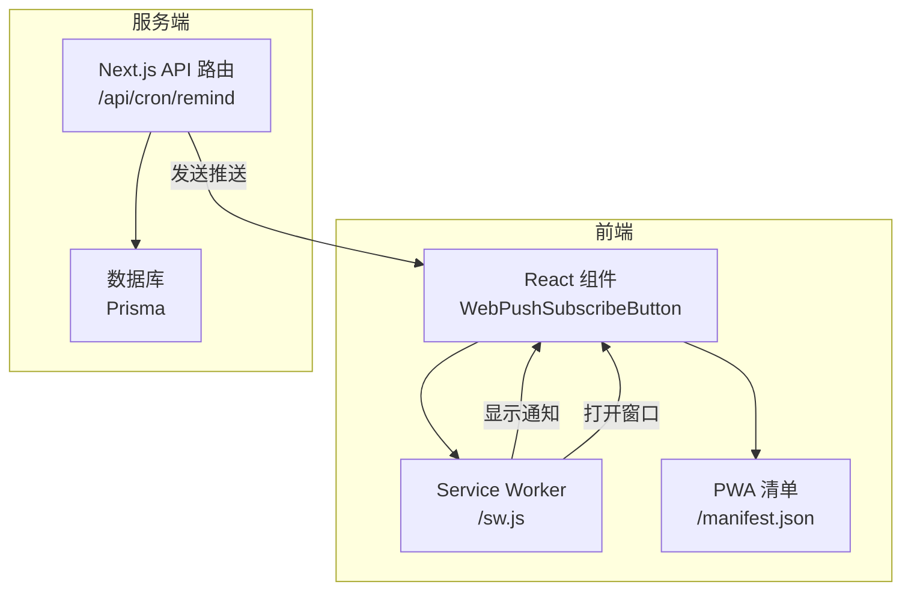
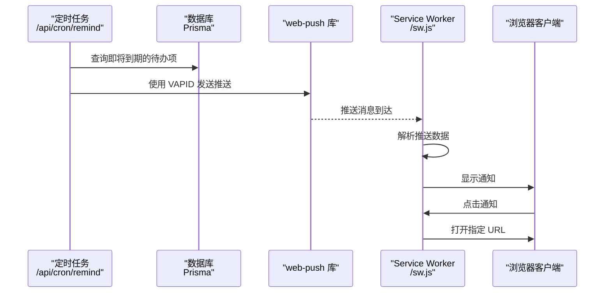
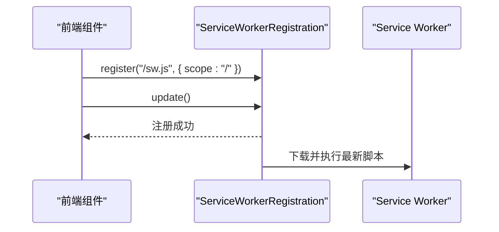
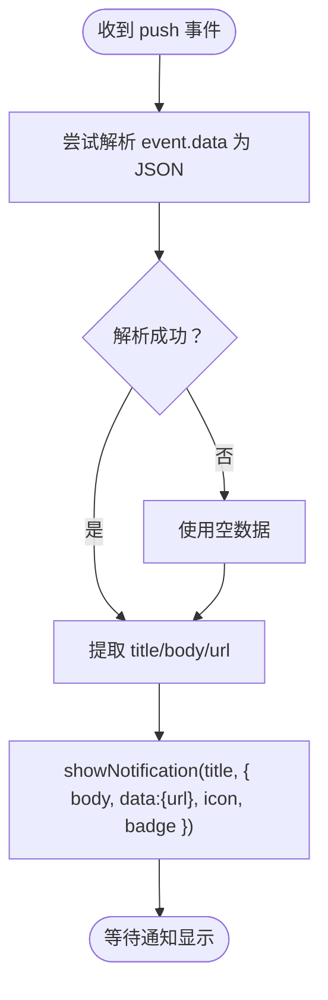
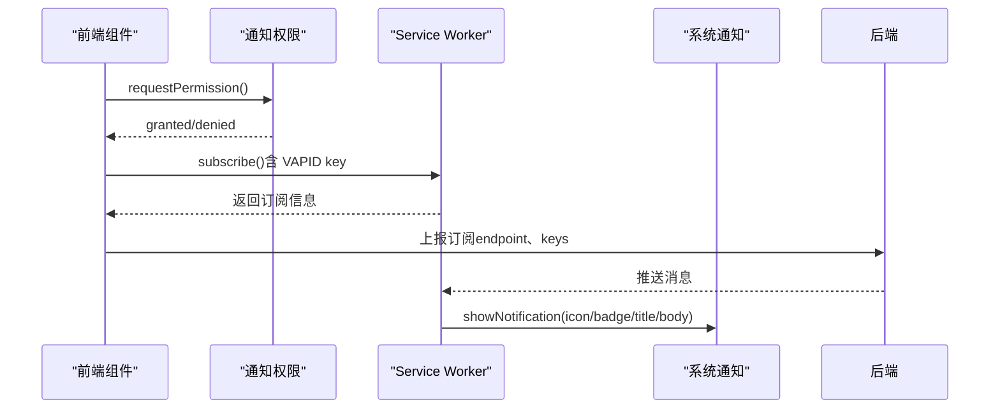
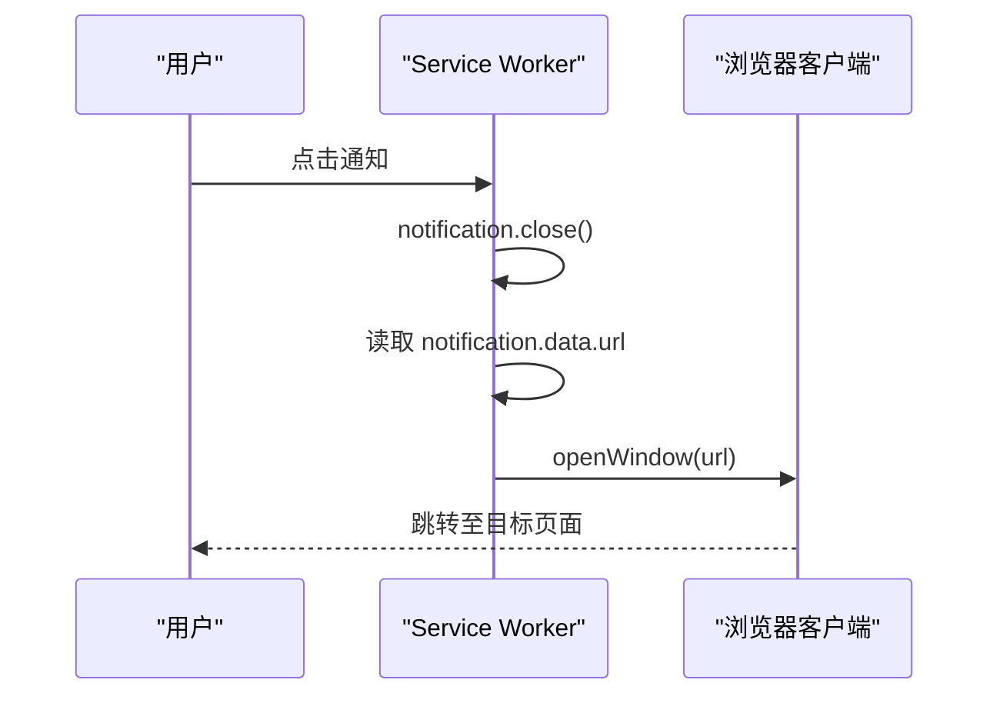
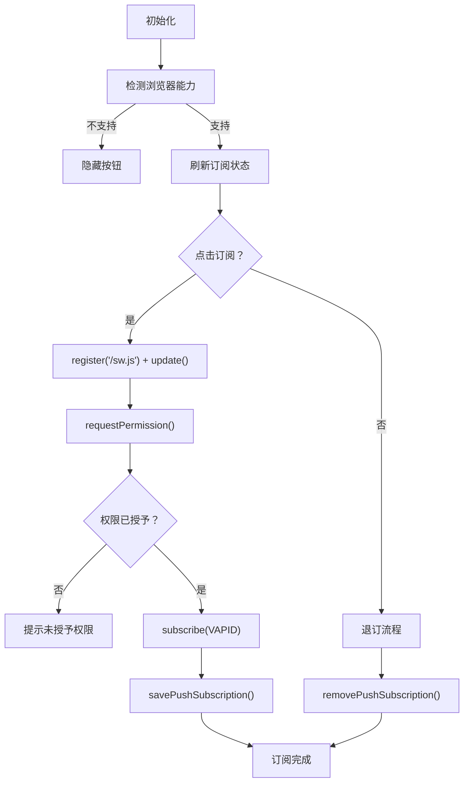
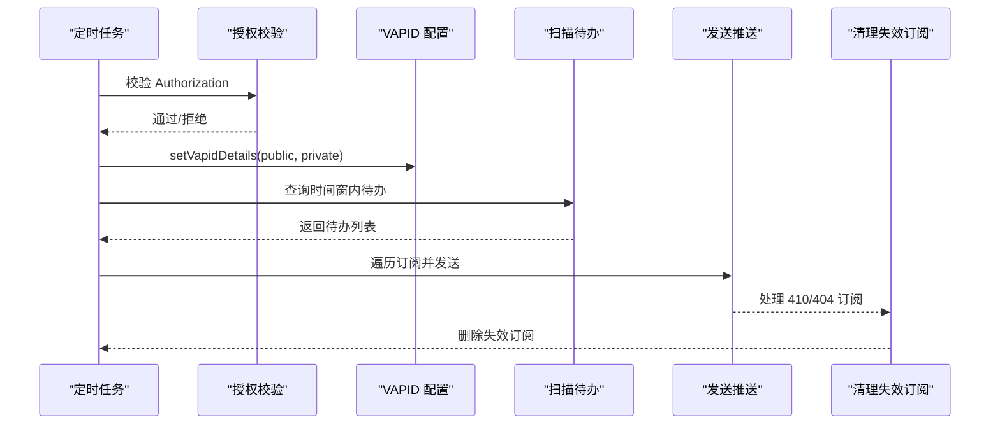
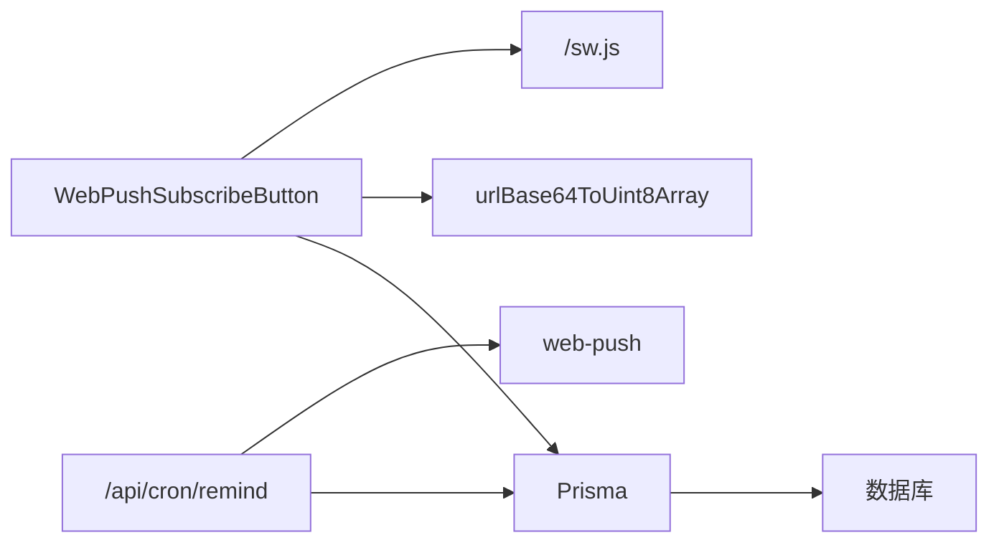

# Service Worker 实现

<cite>
**本文档引用的文件**
- [public/sw.js](file://public/sw.js)
- [public/manifest.json](file://public/manifest.json)
- [src/components/push/web-push-subscribe-button.tsx](file://src/components/push/web-push-subscribe-button.tsx)
- [src/actions/push.ts](file://src/actions/push.ts)
- [src/lib/push/url-base64.ts](file://src/lib/push/url-base64.ts)
- [src/app/layout.tsx](file://src/app/layout.tsx)
- [src/app/api/cron/remind/route.ts](file://src/app/api/cron/remind/route.ts)
- [src/lib/db/index.ts](file://src/lib/db/index.ts)
- [src/lib/auth/session.ts](file://src/lib/auth/session.ts)
- [package.json](file://package.json)
</cite>

## 目录
1. [简介](#简介)
2. [项目结构](#项目结构)
3. [核心组件](#核心组件)
4. [架构总览](#架构总览)
5. [详细组件分析](#详细组件分析)
6. [依赖关系分析](#依赖关系分析)
7. [性能考量](#性能考量)
8. [故障排查指南](#故障排查指南)
9. [结论](#结论)
10. [附录](#附录)

## 简介
本文件系统性梳理该项目中 Service Worker 的实现与集成方案，覆盖以下方面：
- Service Worker 的注册与初始化流程（文件位置、加载时机、版本管理）
- 后台消息处理机制（推送消息接收、数据解析、事件分发）
- 通知显示流程（创建、样式定制、权限检查）
- 点击事件处理（链接跳转、页面激活、参数传递）
- 调试与监控方法（开发工具、日志输出、错误捕获）
- 安全与最佳实践（HTTPS 要求、缓存策略、更新机制）

## 项目结构
该项目采用 Next.js 前端框架，Service Worker 以静态资源形式放置于 public 目录，并通过前端组件完成注册与订阅流程；服务端通过定时任务生成并发送 Web Push 推送。

图表来源
- [public/sw.js:1-29](file://public/sw.js#L1-L29)
- [public/manifest.json:1-27](file://public/manifest.json#L1-L27)
- [src/components/push/web-push-subscribe-button.tsx:1-127](file://src/components/push/web-push-subscribe-button.tsx#L1-L127)
- [src/app/api/cron/remind/route.ts:1-115](file://src/app/api/cron/remind/route.ts#L1-L115)

章节来源
- [public/sw.js:1-29](file://public/sw.js#L1-L29)
- [public/manifest.json:1-27](file://public/manifest.json#L1-L27)
- [src/components/push/web-push-subscribe-button.tsx:1-127](file://src/components/push/web-push-subscribe-button.tsx#L1-L127)
- [src/app/api/cron/remind/route.ts:1-115](file://src/app/api/cron/remind/route.ts#L1-L115)

## 核心组件
- Service Worker 主体：负责接收推送消息、显示通知、处理点击事件并打开目标页面。
- PWA 清单：定义应用名称、图标、启动路径、作用域等，确保 PWA 能力与 Service Worker 协同工作。
- 前端订阅按钮：封装注册 Service Worker、申请通知权限、订阅/退订 Web Push、上报订阅信息到后端。
- 服务端定时任务：按时间窗口扫描待办事项，构造推送负载，使用 VAPID 密钥发送推送，并清理失效订阅。
- 数据层与鉴权：使用 Prisma 进行订阅持久化，配合 Supabase 会话鉴权限制操作范围。

章节来源
- [public/sw.js:1-29](file://public/sw.js#L1-L29)
- [public/manifest.json:1-27](file://public/manifest.json#L1-L27)
- [src/components/push/web-push-subscribe-button.tsx:1-127](file://src/components/push/web-push-subscribe-button.tsx#L1-L127)
- [src/app/api/cron/remind/route.ts:1-115](file://src/app/api/cron/remind/route.ts#L1-L115)
- [src/lib/db/index.ts:1-16](file://src/lib/db/index.ts#L1-L16)
- [src/lib/auth/session.ts:1-19](file://src/lib/auth/session.ts#L1-L19)

## 架构总览
下图展示从“定时任务扫描”到“客户端显示通知”的完整链路，以及前端组件如何参与订阅生命周期。

图表来源
- [src/app/api/cron/remind/route.ts:28-115](file://src/app/api/cron/remind/route.ts#L28-L115)
- [public/sw.js:3-28](file://public/sw.js#L3-L28)

## 详细组件分析

### Service Worker 注册与初始化
- 文件位置：public/sw.js
- 加载时机：前端组件在用户交互或页面加载时调用 navigator.serviceWorker.register 注册，随后主动触发 reg.update() 以确保加载最新版本。
- 版本管理：通过 reg.update() 强制更新已注册的 Service Worker，避免陈旧脚本影响推送与通知行为。

图表来源
- [src/components/push/web-push-subscribe-button.tsx:46-47](file://src/components/push/web-push-subscribe-button.tsx#L46-L47)
- [public/sw.js:1-29](file://public/sw.js#L1-L29)

章节来源
- [src/components/push/web-push-subscribe-button.tsx:13-77](file://src/components/push/web-push-subscribe-button.tsx#L13-L77)
- [public/sw.js:1-29](file://public/sw.js#L1-L29)

### 后台消息处理机制（推送）
- 事件监听：Service Worker 监听 push 事件，尝试解析 event.data 为 JSON，若失败则回退为空对象。
- 标题/正文/链接：从 payload 中提取 title、body、url，缺失时使用默认值。
- 通知显示：调用 showNotification 创建通知，同时将 url 存入 notification.data，供点击事件使用。

图表来源
- [public/sw.js:3-22](file://public/sw.js#L3-L22)

章节来源
- [public/sw.js:3-22](file://public/sw.js#L3-L22)

### 通知显示流程（创建、样式、权限）
- 权限检查：前端在订阅前请求 Notification.permission，仅当 granted 时才进行订阅。
- 图标与徽章：Service Worker 在通知选项中设置 icon 与 badge，指向 public/icons/icon-192.png。
- PWA 清单：public/manifest.json 提供应用图标与启动路径，确保 PWA 能力与通知体验一致。

图表来源
- [src/components/push/web-push-subscribe-button.tsx:48-53](file://src/components/push/web-push-subscribe-button.tsx#L48-L53)
- [public/sw.js:15-21](file://public/sw.js#L15-L21)
- [public/manifest.json:12-25](file://public/manifest.json#L12-L25)

章节来源
- [src/components/push/web-push-subscribe-button.tsx:18-77](file://src/components/push/web-push-subscribe-button.tsx#L18-L77)
- [public/sw.js:15-21](file://public/sw.js#L15-L21)
- [public/manifest.json:1-27](file://public/manifest.json#L1-L27)

### 点击事件处理（跳转、激活、参数）
- 事件监听：Service Worker 监听 notificationclick 事件。
- 关闭通知：收到点击后立即关闭通知。
- 打开窗口：从 notification.data.url 取出目标地址，调用 clients.openWindow 打开新窗口或激活已有窗口。
- 参数传递：服务端在 payload 中拼接 URL 并附加查询参数（如 block），确保点击后能定位到具体内容。

图表来源
- [public/sw.js:24-28](file://public/sw.js#L24-L28)
- [src/app/api/cron/remind/route.ts:75-81](file://src/app/api/cron/remind/route.ts#L75-L81)

章节来源
- [public/sw.js:24-28](file://public/sw.js#L24-L28)
- [src/app/api/cron/remind/route.ts:75-81](file://src/app/api/cron/remind/route.ts#L75-L81)

### 前端订阅与退订流程
- 能力检测：在浏览器支持 serviceWorker 与 PushManager 的前提下渲染订阅按钮。
- 注册与更新：注册 /sw.js 并调用 reg.update() 保证脚本最新。
- 订阅：使用 VAPID 公钥转换为 Uint8Array 后发起 subscribe，保存订阅信息到后端。
- 退订：取消订阅并删除后端对应记录。
- 错误处理：对未配置 VAPID、权限未授予、HTTPS/localhost 要求等场景给出明确提示。

图表来源
- [src/components/push/web-push-subscribe-button.tsx:20-96](file://src/components/push/web-push-subscribe-button.tsx#L20-L96)

章节来源
- [src/components/push/web-push-subscribe-button.tsx:1-127](file://src/components/push/web-push-subscribe-button.tsx#L1-L127)

### 服务端推送发送与清理
- 授权校验：通过请求头 Authorization 校验定时任务访问权限。
- VAPID 配置：使用 NEXT_PUBLIC_VAPID_PUBLIC_KEY 与 VAPID_PRIVATE_KEY 设置 web-push。
- 时间窗口扫描：查询即将提醒的待办项，构造 payload（title/body/url），并为每个用户的所有 web 设备订阅发送。
- 失效清理：对返回 410/404 的订阅执行删除，保持订阅表整洁。

图表来源
- [src/app/api/cron/remind/route.ts:28-115](file://src/app/api/cron/remind/route.ts#L28-L115)

章节来源
- [src/app/api/cron/remind/route.ts:1-115](file://src/app/api/cron/remind/route.ts#L1-L115)

## 依赖关系分析
- 前端依赖
  - React 组件依赖 Next.js 的客户端运行时与 UI 组件库。
  - Service Worker 依赖浏览器原生 Push API 与 Notification API。
  - VAPID 公钥转换依赖自定义工具函数。
- 后端依赖
  - web-push 库用于发送推送。
  - Prisma 作为 ORM 访问数据库。
  - Supabase 会话用于鉴权与用户上下文。

图表来源
- [src/components/push/web-push-subscribe-button.tsx:7-8](file://src/components/push/web-push-subscribe-button.tsx#L7-L8)
- [src/lib/push/url-base64.ts:4-13](file://src/lib/push/url-base64.ts#L4-L13)
- [src/app/api/cron/remind/route.ts:2-3](file://src/app/api/cron/remind/route.ts#L2-L3)
- [src/lib/db/index.ts:1-16](file://src/lib/db/index.ts#L1-L16)

章节来源
- [package.json:22-60](file://package.json#L22-L60)
- [src/components/push/web-push-subscribe-button.tsx:1-127](file://src/components/push/web-push-subscribe-button.tsx#L1-L127)
- [src/app/api/cron/remind/route.ts:1-115](file://src/app/api/cron/remind/route.ts#L1-L115)
- [src/lib/db/index.ts:1-16](file://src/lib/db/index.ts#L1-L16)

## 性能考量
- 推送 TTL：服务端设置 TTL 为 120 秒，避免过期消息占用带宽与服务器资源。
- 扫描上限：单次扫描限制返回条目数量，防止一次性处理过多数据导致超时。
- 通知延迟：Service Worker 使用 event.waitUntil 确保通知创建与窗口打开在后台线程中完成，提升响应速度。
- 缓存策略：当前 Service Worker 未实现自定义缓存策略，建议结合实际需求在生产环境中引入合适的缓存策略以优化离线与加载性能。

## 故障排查指南
- 订阅失败
  - 确认已配置 NEXT_PUBLIC_VAPID_PUBLIC_KEY 与 VAPID_PRIVATE_KEY。
  - 确认部署在 HTTPS 或本地 localhost。
  - 查看前端控制台错误与 toast 提示。
- 通知未显示
  - 检查浏览器通知权限是否为 granted。
  - 确认 Service Worker 已成功注册并处于活跃状态。
- 点击无响应
  - 检查 payload 中的 url 是否正确拼接并包含必要参数。
  - 确认 Service Worker 的 notificationclick 事件已正确处理。
- 推送发送异常
  - 关注服务端返回的状态码，410/404 会触发自动清理订阅。
  - 核对 VAPID 配置与 subject 字段。

章节来源
- [src/components/push/web-push-subscribe-button.tsx:40-77](file://src/components/push/web-push-subscribe-button.tsx#L40-L77)
- [src/app/api/cron/remind/route.ts:98-105](file://src/app/api/cron/remind/route.ts#L98-L105)

## 结论
该实现以最小可用为目标，完整覆盖了 Service Worker 的注册、推送接收、通知显示与点击跳转等核心功能，并通过前端组件与服务端定时任务形成闭环。后续可在缓存策略、错误重试、通知样式定制等方面进一步增强用户体验与稳定性。

## 附录

### 安全与最佳实践
- HTTPS 要求：Web Push 与 Service Worker 在生产环境必须部署在 HTTPS。
- VAPID 配置：前后端均需配置公私钥与 subject，确保推送签名有效。
- 权限与隐私：仅在用户明确授权后发起订阅，避免滥用通知。
- 更新机制：前端通过 reg.update() 强制更新 Service Worker，确保推送与通知逻辑及时生效。
- 缓存策略：建议在生产环境中为 /sw.js 与静态资源配置合理的缓存策略，平衡性能与更新频率。

章节来源
- [src/components/push/web-push-subscribe-button.tsx:40-77](file://src/components/push/web-push-subscribe-button.tsx#L40-L77)
- [src/app/api/cron/remind/route.ts:33-43](file://src/app/api/cron/remind/route.ts#L33-L43)
- [public/sw.js:1-29](file://public/sw.js#L1-L29)