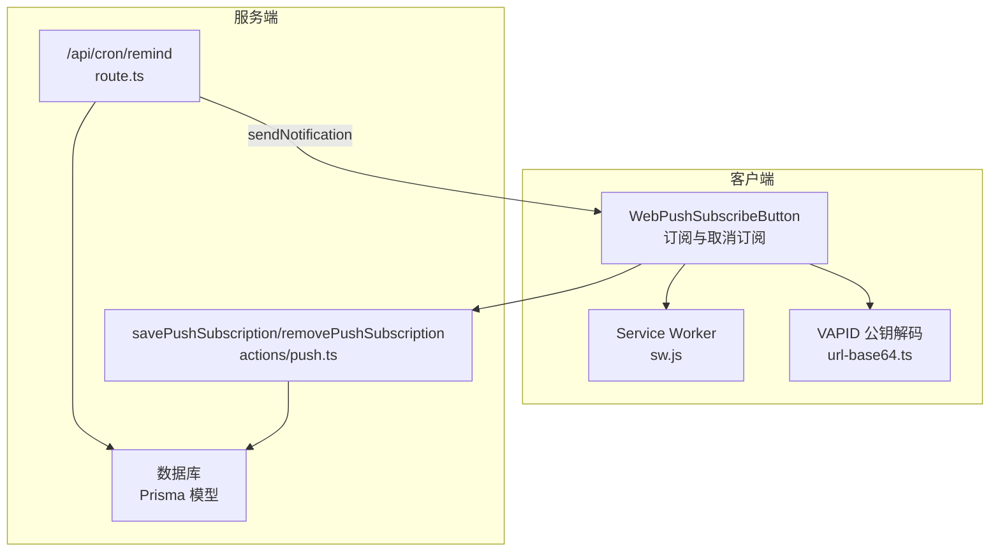
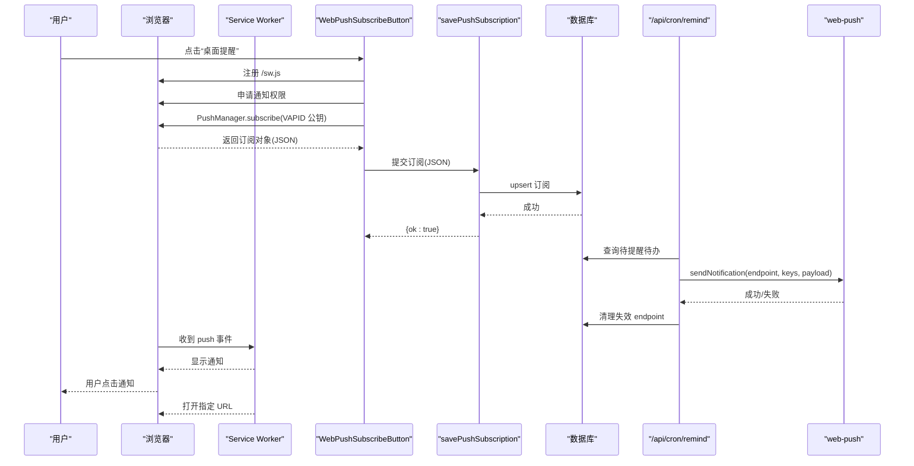
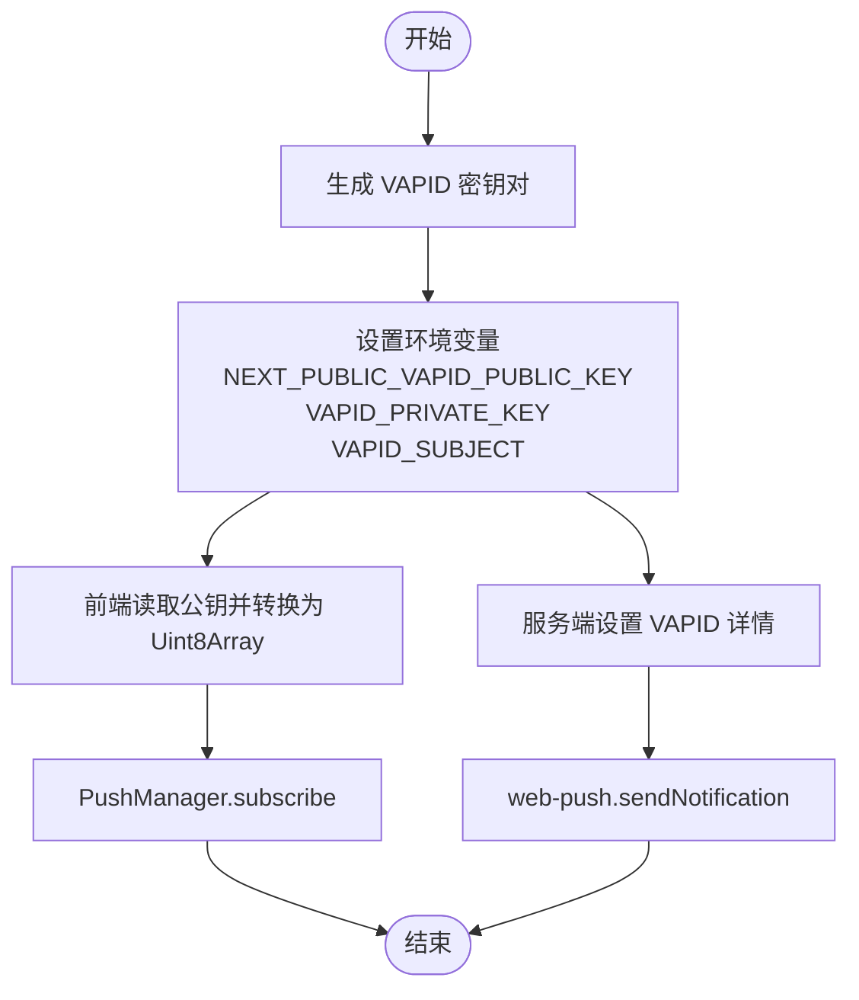
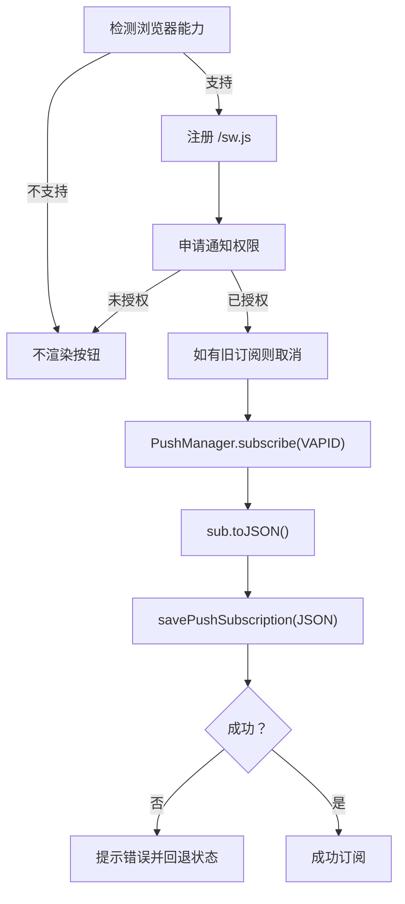
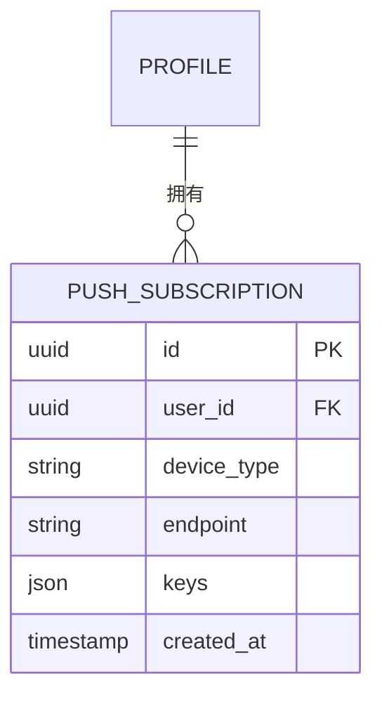
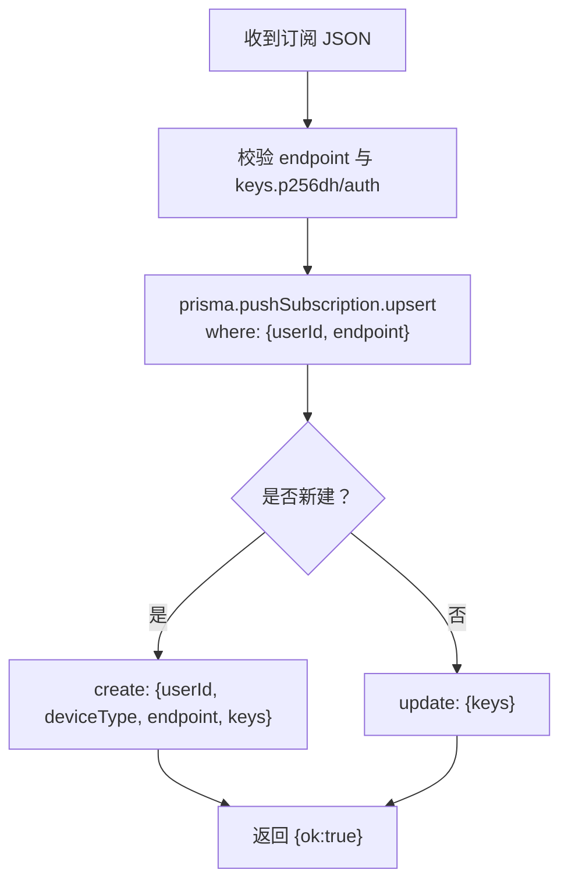
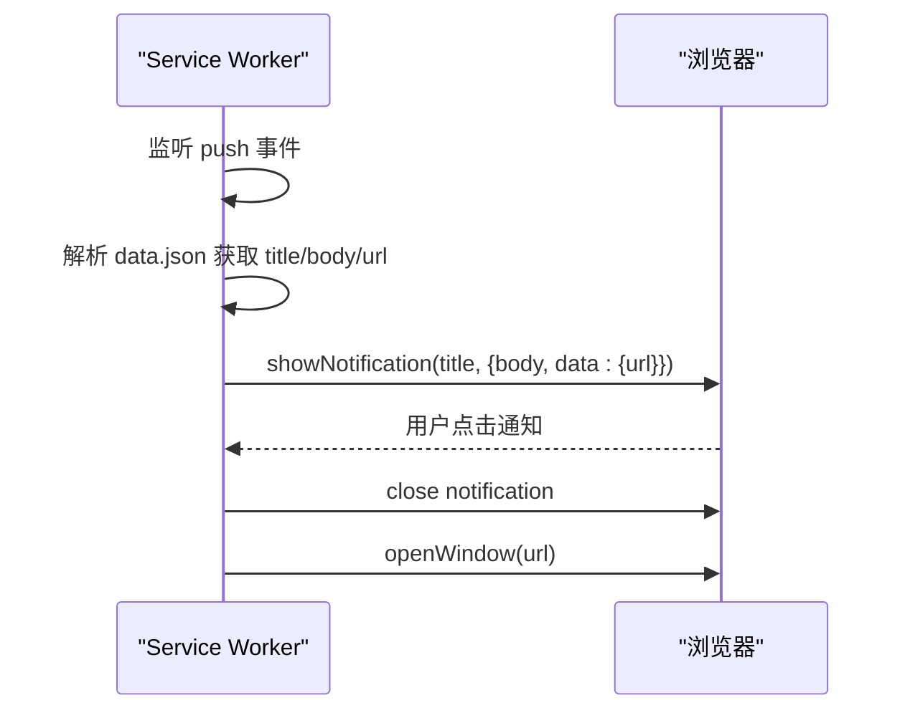
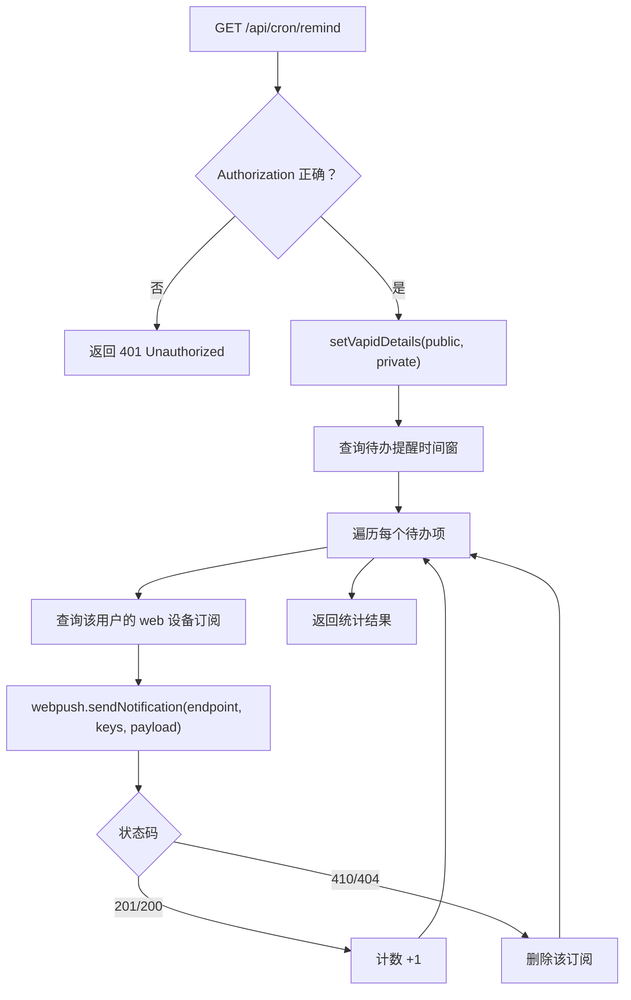
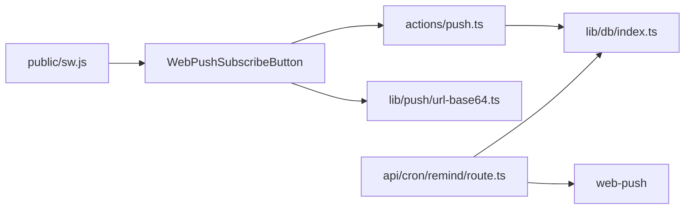

# Web Push API 集成

<cite>
**本文引用的文件**
- [src/components/push/web-push-subscribe-button.tsx](file://src/components/push/web-push-subscribe-button.tsx)
- [src/actions/push.ts](file://src/actions/push.ts)
- [src/lib/push/url-base64.ts](file://src/lib/push/url-base64.ts)
- [public/sw.js](file://public/sw.js)
- [prisma/schema.prisma](file://prisma/schema.prisma)
- [src/app/api/cron/remind/route.ts](file://src/app/api/cron/remind/route.ts)
- [src/lib/db/index.ts](file://src/lib/db/index.ts)
- [src/lib/auth/session.ts](file://src/lib/auth/session.ts)
- [scripts/verify-m4-cron.mjs](file://scripts/verify-m4-cron.mjs)
- [package.json](file://package.json)
- [README.md](file://README.md)
</cite>

## 目录
1. [简介](#简介)
2. [项目结构](#项目结构)
3. [核心组件](#核心组件)
4. [架构总览](#架构总览)
5. [详细组件分析](#详细组件分析)
6. [依赖关系分析](#依赖关系分析)
7. [性能考量](#性能考量)
8. [故障排查指南](#故障排查指南)
9. [结论](#结论)
10. [附录](#附录)

## 简介
本文件面向需要在 Next.js 应用中集成 Web Push 的开发者，基于现有代码库完整梳理了从 VAPID 密钥配置、浏览器订阅流程、订阅数据结构、数据库持久化，到服务端定时扫描与推送发送的全链路实现。文档同时提供可视化图示、关键流程时序图与排障建议，帮助快速理解与落地。

## 项目结构
与 Web Push 相关的关键目录与文件如下：
- 客户端订阅与 Service Worker：src/components/push/web-push-subscribe-button.tsx、public/sw.js
- 订阅数据转换：src/lib/push/url-base64.ts
- 服务端订阅持久化：src/actions/push.ts
- 数据库模型：prisma/schema.prisma
- 定时提醒与推送发送：src/app/api/cron/remind/route.ts
- 数据库连接：src/lib/db/index.ts
- 会话鉴权：src/lib/auth/session.ts
- 环境变量与集成指引：README.md、scripts/verify-m4-cron.mjs、package.json

图表来源
- [src/components/push/web-push-subscribe-button.tsx:1-127](file://src/components/push/web-push-subscribe-button.tsx#L1-L127)
- [src/lib/push/url-base64.ts:1-14](file://src/lib/push/url-base64.ts#L1-L14)
- [public/sw.js:1-29](file://public/sw.js#L1-L29)
- [src/actions/push.ts:1-62](file://src/actions/push.ts#L1-L62)
- [prisma/schema.prisma:102-116](file://prisma/schema.prisma#L102-L116)
- [src/app/api/cron/remind/route.ts:1-115](file://src/app/api/cron/remind/route.ts#L1-L115)

章节来源
- [README.md:115-141](file://README.md#L115-L141)

## 核心组件
- 订阅按钮组件：负责浏览器能力检测、Service Worker 注册、通知权限申请、VAPID 公钥转换、PushManager 订阅、并将订阅数据提交至服务端持久化。
- VAPID 公钥转换工具：将前端环境变量中的 URL-safe Base64 公钥转换为 PushManager subscribe 所需的 Uint8Array。
- 订阅动作：服务端 Action，校验订阅数据结构，使用 Prisma upsert 幂等写入数据库。
- Service Worker：接收 push 事件并展示通知，处理通知点击跳转。
- 定时提醒 API：扫描待办提醒，构造通知负载，使用 web-push 发送，处理失效 endpoint 并清理。
- 数据库模型：PushSubscription 表，包含 endpoint、deviceType、keys 等字段。
- 数据库连接与鉴权：Prisma 单例与会话鉴权工具。

章节来源
- [src/components/push/web-push-subscribe-button.tsx:1-127](file://src/components/push/web-push-subscribe-button.tsx#L1-L127)
- [src/lib/push/url-base64.ts:1-14](file://src/lib/push/url-base64.ts#L1-L14)
- [src/actions/push.ts:1-62](file://src/actions/push.ts#L1-L62)
- [public/sw.js:1-29](file://public/sw.js#L1-L29)
- [src/app/api/cron/remind/route.ts:1-115](file://src/app/api/cron/remind/route.ts#L1-L115)
- [prisma/schema.prisma:102-116](file://prisma/schema.prisma#L102-L116)
- [src/lib/db/index.ts:1-16](file://src/lib/db/index.ts#L1-L16)
- [src/lib/auth/session.ts:1-19](file://src/lib/auth/session.ts#L1-L19)

## 架构总览
Web Push 集成由“客户端订阅 + 服务端持久化 + 定时扫描 + 推送发送 + Service Worker 展示”构成闭环。下图展示了端到端的数据流与交互：

图表来源
- [src/components/push/web-push-subscribe-button.tsx:39-77](file://src/components/push/web-push-subscribe-button.tsx#L39-L77)
- [src/actions/push.ts:12-49](file://src/actions/push.ts#L12-L49)
- [src/app/api/cron/remind/route.ts:28-114](file://src/app/api/cron/remind/route.ts#L28-L114)
- [public/sw.js:3-28](file://public/sw.js#L3-L28)

## 详细组件分析

### VAPID 密钥配置与使用
- 公钥与私钥生成：使用 web-push 工具生成 VAPID 密钥对，公钥放入前端环境变量 NEXT_PUBLIC_VAPID_PUBLIC_KEY，私钥放入服务端环境变量 VAPID_PRIVATE_KEY，同时设置 VAPID_SUBJECT。
- 前端使用：WebPushSubscribeButton 读取 NEXT_PUBLIC_VAPID_PUBLIC_KEY，通过 url-base64.ts 转换为 Uint8Array 传给 PushManager.subscribe。
- 服务端使用：/api/cron/remind/route.ts 在运行时设置 web-push 的 VAPID 详情，用于发送通知。

图表来源
- [README.md:115-118](file://README.md#L115-L118)
- [src/components/push/web-push-subscribe-button.tsx:18](file://src/components/push/web-push-subscribe-button.tsx#L18)
- [src/lib/push/url-base64.ts:4-13](file://src/lib/push/url-base64.ts#L4-L13)
- [src/app/api/cron/remind/route.ts:39-43](file://src/app/api/cron/remind/route.ts#L39-L43)

章节来源
- [README.md:115-118](file://README.md#L115-L118)
- [src/lib/push/url-base64.ts:1-14](file://src/lib/push/url-base64.ts#L1-L14)
- [src/app/api/cron/remind/route.ts:33-43](file://src/app/api/cron/remind/route.ts#L33-L43)

### 推送订阅创建流程
- 浏览器兼容性检查：检测 navigator.serviceWorker 与 window.PushManager。
- Service Worker 注册与更新：注册 /sw.js 并调用 update。
- 通知权限申请：调用 Notification.requestPermission，仅当 granted 时继续。
- 旧订阅清理：若存在旧订阅则先 unsubscribe。
- 订阅创建：PushManager.subscribe，传入 userVisibleOnly 与 applicationServerKey（VAPID 公钥转换后的 Uint8Array）。
- 订阅数据上报：将 sub.toJSON() 结果提交至服务端 savePushSubscription。
- 错误处理：捕获异常并提示用户使用 HTTPS 或 localhost。

图表来源
- [src/components/push/web-push-subscribe-button.tsx:26-77](file://src/components/push/web-push-subscribe-button.tsx#L26-L77)
- [src/actions/push.ts:13-49](file://src/actions/push.ts#L13-L49)

章节来源
- [src/components/push/web-push-subscribe-button.tsx:26-77](file://src/components/push/web-push-subscribe-button.tsx#L26-L77)
- [src/actions/push.ts:13-49](file://src/actions/push.ts#L13-L49)

### 订阅数据结构与字段含义
- endpoint：推送目标的端点 URL，唯一标识一个订阅。
- keys.p256dh：椭圆曲线密钥，用于加密推送内容。
- keys.auth：认证密钥，用于签名推送消息。
- deviceType：设备类型，此处固定为 web。
- userId：关联用户 ID，用于按用户维度查询与清理。

图表来源
- [prisma/schema.prisma:102-116](file://prisma/schema.prisma#L102-L116)

章节来源
- [prisma/schema.prisma:102-116](file://prisma/schema.prisma#L102-L116)
- [src/actions/push.ts:7-10](file://src/actions/push.ts#L7-L10)

### 订阅持久化机制
- 幂等 upsert：根据 userId 与 endpoint 组合唯一键进行 upsert，确保同一设备同一 endpoint 的重复提交不会产生重复记录。
- 更新策略：当 endpoint 已存在时，仅更新 keys 字段。
- 删除策略：removePushSubscription 按 endpoint 删除，用于用户取消订阅或清理失效订阅。

图表来源
- [src/actions/push.ts:13-49](file://src/actions/push.ts#L13-L49)
- [prisma/schema.prisma:113-114](file://prisma/schema.prisma#L113-L114)

章节来源
- [src/actions/push.ts:13-49](file://src/actions/push.ts#L13-L49)
- [prisma/schema.prisma:113-114](file://prisma/schema.prisma#L113-L114)

### Service Worker 通知展示与点击跳转
- push 事件：解析 event.data.json，提取 title/body/url，调用 showNotification 显示通知。
- notificationclick 事件：关闭通知并打开通知中携带的 URL。

图表来源
- [public/sw.js:3-28](file://public/sw.js#L3-L28)

章节来源
- [public/sw.js:1-29](file://public/sw.js#L1-L29)

### 定时扫描与推送发送
- 授权校验：要求请求头 Authorization: Bearer <CRON_SECRET>。
- VAPID 设置：读取 NEXT_PUBLIC_VAPID_PUBLIC_KEY 与 VAPID_PRIVATE_KEY 设置 web-push。
- 扫描范围：查询即将到达提醒时间的待办项，限制扫描窗口与数量。
- 通知负载：构造包含 title/body/url 的 JSON，其中 url 携带 block 参数定位具体任务。
- 发送与清理：逐条发送，遇到 410/404 状态码删除对应订阅记录。

图表来源
- [src/app/api/cron/remind/route.ts:28-114](file://src/app/api/cron/remind/route.ts#L28-L114)

章节来源
- [src/app/api/cron/remind/route.ts:28-114](file://src/app/api/cron/remind/route.ts#L28-L114)

## 依赖关系分析
- 外部依赖：web-push（用于发送通知）、Prisma Client（数据库访问）。
- 内部模块：组件层（UI 与交互）、动作层（服务端逻辑）、工具层（VAPID 转换）、API 层（定时任务）、数据层（Prisma 模型）。

图表来源
- [package.json:58](file://package.json#L58)
- [src/components/push/web-push-subscribe-button.tsx:1-127](file://src/components/push/web-push-subscribe-button.tsx#L1-L127)
- [src/actions/push.ts:1-62](file://src/actions/push.ts#L1-L62)
- [src/lib/push/url-base64.ts:1-14](file://src/lib/push/url-base64.ts#L1-L14)
- [src/lib/db/index.ts:1-16](file://src/lib/db/index.ts#L1-L16)
- [src/app/api/cron/remind/route.ts:1-115](file://src/app/api/cron/remind/route.ts#L1-L115)

章节来源
- [package.json:22-60](file://package.json#L22-L60)

## 性能考量
- 定时任务窗口：扫描时间窗与最大条数限制，避免一次性处理过多数据导致超时。
- TTL 设置：发送通知时设置较短 TTL，减少过期消息占用资源。
- 幂等 upsert：避免重复订阅带来的写放大与索引膨胀。
- 410/404 清理：及时移除失效 endpoint，降低后续发送失败率与网络开销。

## 故障排查指南
- 订阅失败（HTTPS/localhost）：前端会在异常时提示使用 HTTPS 或 localhost 并重试。
- 未配置 VAPID 公钥：前端按钮会提示未配置 NEXT_PUBLIC_VAPID_PUBLIC_KEY。
- 未授予通知权限：前端会提示未授予通知权限并回退状态。
- 定时任务未授权：/api/cron/remind 返回 401，检查 CRON_SECRET 是否正确。
- VAPID 未配置：服务端返回 500，检查 NEXT_PUBLIC_VAPID_PUBLIC_KEY 与 VAPID_PRIVATE_KEY。
- 通知点击链接为空：检查 NEXT_PUBLIC_APP_URL 是否设置，未设置时会回退到 VERCEL_URL 或 localhost。
- 自检脚本：使用 scripts/verify-m4-cron.mjs 校验环境变量并请求 /api/cron/remind。

章节来源
- [src/components/push/web-push-subscribe-button.tsx:40-75](file://src/components/push/web-push-subscribe-button.tsx#L40-L75)
- [src/app/api/cron/remind/route.ts:29-37](file://src/app/api/cron/remind/route.ts#L29-L37)
- [scripts/verify-m4-cron.mjs:11-30](file://scripts/verify-m4-cron.mjs#L11-L30)
- [README.md:126-133](file://README.md#L126-L133)

## 结论
本项目实现了从浏览器端订阅、VAPID 配置、订阅持久化，到服务端定时扫描与推送发送的完整 Web Push 能力。通过幂等 upsert、失效订阅清理与严格的授权校验，系统具备良好的稳定性与可维护性。建议在生产环境中配合自建云服务器 crontab 定时触发 /api/cron/remind，并完善监控与日志以便持续优化。

## 附录
- 环境变量清单与用途参考 README 的“M4：推送与定时提醒”部分。
- 一键自检命令与使用方法见 README 的“verify:m4-cron”。

章节来源
- [README.md:115-141](file://README.md#L115-L141)