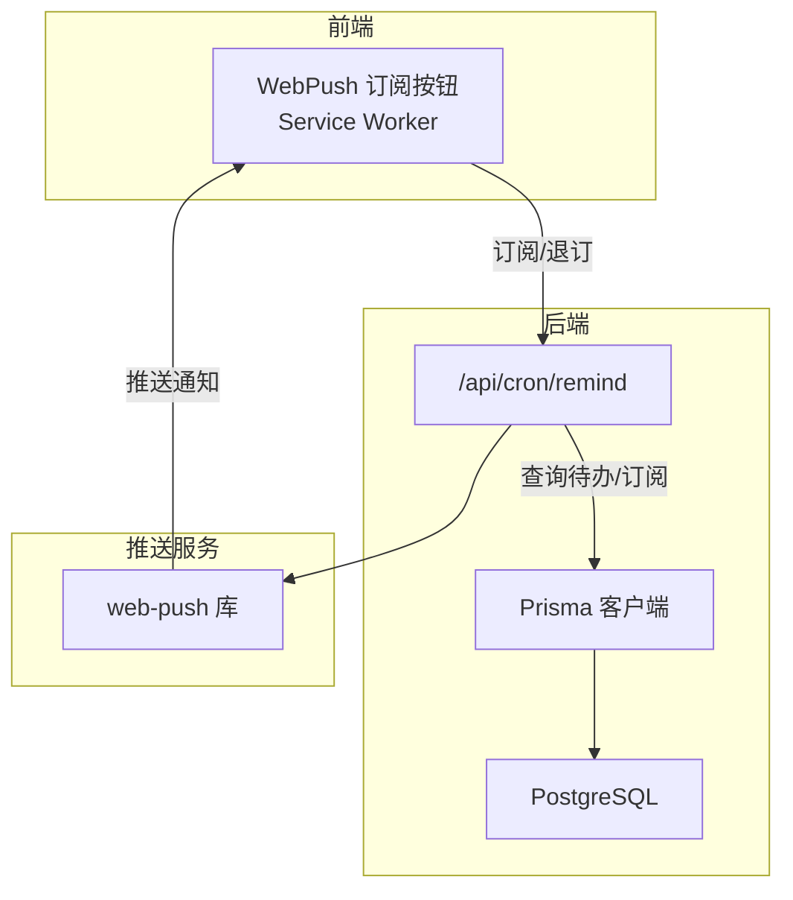
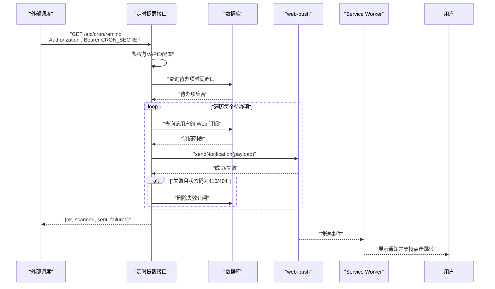
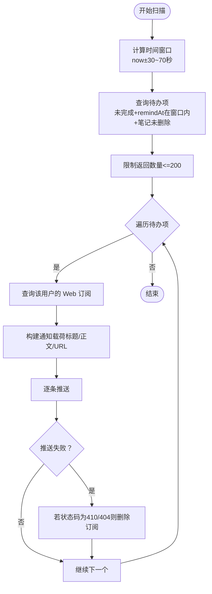
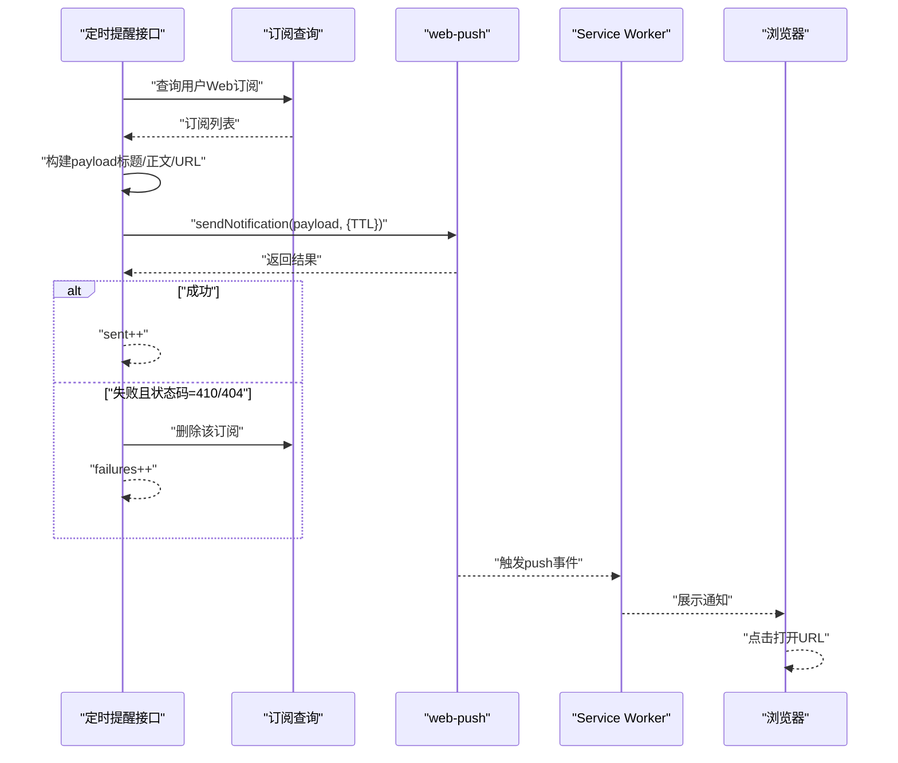
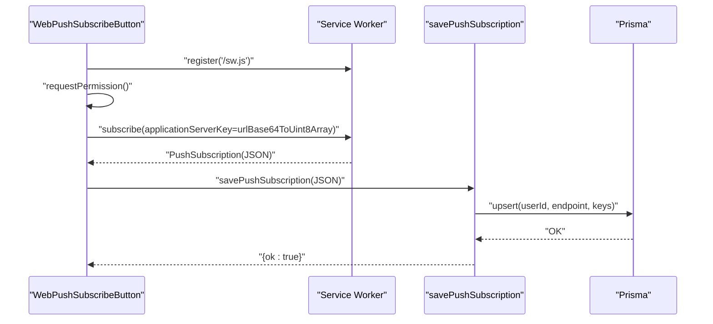
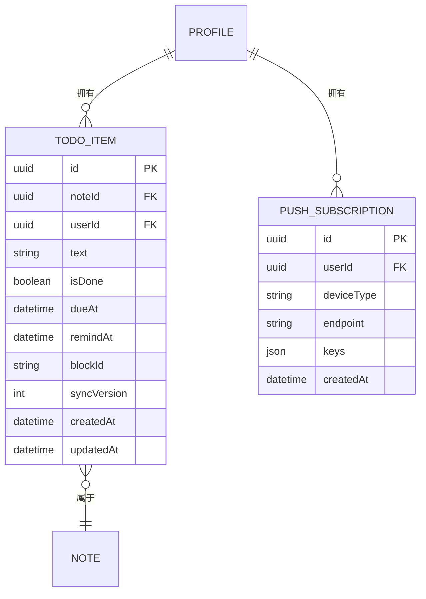
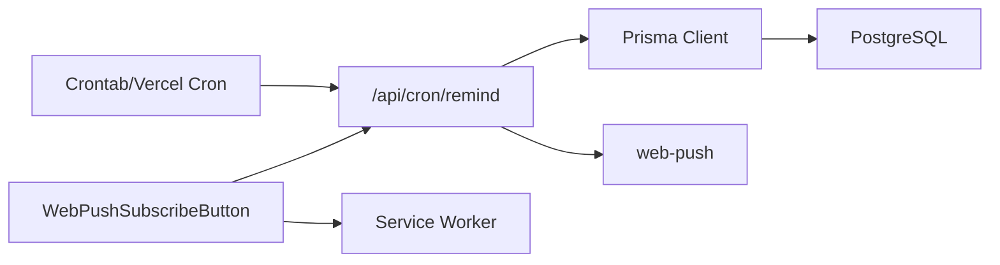

# 定时提醒系统

<cite>
**本文引用的文件**
- [src/app/api/cron/remind/route.ts](file://src/app/api/cron/remind/route.ts)
- [src/actions/push.ts](file://src/actions/push.ts)
- [src/components/push/web-push-subscribe-button.tsx](file://src/components/push/web-push-subscribe-button.tsx)
- [public/sw.js](file://public/sw.js)
- [src/lib/push/url-base64.ts](file://src/lib/push/url-base64.ts)
- [prisma/schema.prisma](file://prisma/schema.prisma)
- [scripts/verify-m4-cron.mjs](file://scripts/verify-m4-cron.mjs)
- [src/lib/db/index.ts](file://src/lib/db/index.ts)
- [src/lib/todo/sync-todo-items-for-note.ts](file://src/lib/todo/sync-todo-items-for-note.ts)
- [src/lib/tiptap/custom-task-item.ts](file://src/lib/tiptap/custom-task-item.ts)
- [package.json](file://package.json)
- [README.md](file://README.md)
</cite>

## 目录
1. [引言](#引言)
2. [项目结构](#项目结构)
3. [核心组件](#核心组件)
4. [架构总览](#架构总览)
5. [详细组件分析](#详细组件分析)
6. [依赖关系分析](#依赖关系分析)
7. [性能考虑](#性能考虑)
8. [故障排查指南](#故障排查指南)
9. [结论](#结论)
10. [附录](#附录)

## 引言
本文件面向“定时提醒系统”的实现与运维，围绕 Cron 作业的配置与调度、任务扫描与筛选、通知发送流程、性能优化、监控与调试以及配置与扩展进行系统性说明。系统通过定时扫描数据库中即将到期的待办项，向已订阅的 Web Push 设备推送桌面通知，支持跨设备、跨浏览器的统一提醒体验。

## 项目结构
- API 层：定时提醒接口位于 Next.js App Router 的 API 路由中，负责鉴权、扫描、推送与统计。
- 业务层：待办项与订阅管理通过 Prisma 模型与数据库交互。
- 前端层：提供 Web Push 订阅/退订按钮、Service Worker 处理通知展示与点击跳转。
- 工具层：提供一键自检脚本，验证环境变量与接口连通性。

图表来源
- [src/app/api/cron/remind/route.ts:1-115](file://src/app/api/cron/remind/route.ts#L1-L115)
- [src/actions/push.ts:1-62](file://src/actions/push.ts#L1-L62)
- [public/sw.js:1-29](file://public/sw.js#L1-L29)
- [src/lib/db/index.ts:1-16](file://src/lib/db/index.ts#L1-L16)
- [prisma/schema.prisma:77-116](file://prisma/schema.prisma#L77-L116)

章节来源
- [README.md:161-202](file://README.md#L161-L202)

## 核心组件
- 定时扫描接口：负责鉴权、时间窗口扫描、消息构建、逐条推送与失败清理。
- 订阅管理：前端注册/退订 Web Push 订阅，后端持久化/删除订阅。
- Service Worker：接收推送、展示通知、处理点击跳转。
- 数据模型：待办项与推送订阅的结构与索引设计。
- 自检脚本：校验环境变量并请求定时接口，辅助上线与回归测试。

章节来源
- [src/app/api/cron/remind/route.ts:1-115](file://src/app/api/cron/remind/route.ts#L1-L115)
- [src/actions/push.ts:1-62](file://src/actions/push.ts#L1-L62)
- [public/sw.js:1-29](file://public/sw.js#L1-L29)
- [prisma/schema.prisma:77-116](file://prisma/schema.prisma#L77-L116)
- [scripts/verify-m4-cron.mjs:1-83](file://scripts/verify-m4-cron.mjs#L1-L83)

## 架构总览
定时提醒系统采用“外部调度 + 服务端扫描 + Web Push 推送”的模式：
- 外部调度：云服务器 crontab 或平台 Cron（如 Vercel Pro）按分钟触发。
- 服务端扫描：接口在限定时间窗口内查询待办项，构建通知内容，逐条推送。
- 推送与反馈：web-push 发送通知，捕获 410/404 状态并清理失效订阅。

图表来源
- [src/app/api/cron/remind/route.ts:19-114](file://src/app/api/cron/remind/route.ts#L19-L114)
- [public/sw.js:3-28](file://public/sw.js#L3-L28)

## 详细组件分析

### Cron 作业与调度机制
- 触发方式
  - 云服务器 crontab：每分钟扫描一次，携带 Bearer Token。
  - Vercel Hobby：每日最多一次；如需更频繁，建议升级至 Vercel Pro。
- 时间窗口与频率
  - 接口以当前时间为基准，向前 30 秒、向后 70 秒作为扫描窗口，避免漏扫与抖动。
  - 扫描上限为 200 条，防止突发高峰导致超时或资源占用过高。
- 安全与鉴权
  - 通过请求头 Authorization: Bearer <CRON_SECRET> 鉴权，未授权直接拒绝。
  - VAPID 公私钥与主题必需，否则返回服务端错误。
- 超时与并发
  - 接口声明最大执行时长为 60 秒，适配平台限制。
  - 采用顺序扫描与逐条推送，降低并发复杂度。

章节来源
- [README.md:115-134](file://README.md#L115-L134)
- [src/app/api/cron/remind/route.ts:5-6](file://src/app/api/cron/remind/route.ts#L5-L6)
- [src/app/api/cron/remind/route.ts:28-47](file://src/app/api/cron/remind/route.ts#L28-L47)
- [src/app/api/cron/remind/route.ts:49-62](file://src/app/api/cron/remind/route.ts#L49-L62)

### 任务扫描与筛选逻辑
- 查询条件
  - 待办未完成、所属笔记未删除。
  - remindAt 在时间窗口内（±约 1 分钟）。
- 结果集与限制
  - 返回结果包含待办项与笔记标题，限制数量为 200。
- 同步与一致性
  - 便签内容变更会通过同步逻辑对齐 todo_items，确保提醒基于最新数据。
- 重复提醒处理
  - 当前实现按时间窗口扫描并推送，未见显式的“去重/防抖”逻辑；可通过调整窗口或在上游编辑器中规范 dueAt/remindAt 写入来减少重复。

图表来源
- [src/app/api/cron/remind/route.ts:49-106](file://src/app/api/cron/remind/route.ts#L49-L106)
- [prisma/schema.prisma:77-100](file://prisma/schema.prisma#L77-L100)

章节来源
- [src/app/api/cron/remind/route.ts:49-62](file://src/app/api/cron/remind/route.ts#L49-L62)
- [src/lib/todo/sync-todo-items-for-note.ts:1-59](file://src/lib/todo/sync-todo-items-for-note.ts#L1-L59)

### 通知发送流程
- 消息构建
  - 标题固定为“待办提醒”，正文截断至 120 字，URL 指向笔记详情并附带 block 参数。
  - 应用根地址优先使用 NEXT_PUBLIC_APP_URL，其次回退到 VERCEL_URL，最后本地端口。
- 推送 API 调用
  - 使用 web-push 库，设置 VAPID 凭据，发送通知，TTL 为 120 秒。
- 结果跟踪与失败重试
  - 统计成功数与失败数；对 410/404 错误删除失效订阅，避免后续重复失败。
- 前端展示与跳转
  - Service Worker 接收推送，展示通知；点击后打开指定 URL。

图表来源
- [src/app/api/cron/remind/route.ts:68-106](file://src/app/api/cron/remind/route.ts#L68-L106)
- [public/sw.js:3-28](file://public/sw.js#L3-L28)

章节来源
- [src/app/api/cron/remind/route.ts:68-106](file://src/app/api/cron/remind/route.ts#L68-L106)
- [public/sw.js:1-29](file://public/sw.js#L1-L29)

### 订阅管理与前端集成
- 前端订阅流程
  - 检测浏览器能力，注册 Service Worker，申请通知权限，使用 VAPID 公钥订阅。
  - 将订阅信息上报后端持久化，支持退订并同步删除订阅。
- 后端订阅流程
  - 幂等 upsert 订阅，按 userId+endpoint 唯一约束；删除时按 endpoint 清理。
- VAPID 公钥转换
  - 将 URL-safe Base64 的 VAPID 公钥转换为 Uint8Array 传给 PushManager。

图表来源
- [src/components/push/web-push-subscribe-button.tsx:13-96](file://src/components/push/web-push-subscribe-button.tsx#L13-L96)
- [src/actions/push.ts:13-49](file://src/actions/push.ts#L13-L49)
- [src/lib/push/url-base64.ts:4-13](file://src/lib/push/url-base64.ts#L4-L13)

章节来源
- [src/components/push/web-push-subscribe-button.tsx:1-127](file://src/components/push/web-push-subscribe-button.tsx#L1-L127)
- [src/actions/push.ts:1-62](file://src/actions/push.ts#L1-L62)
- [src/lib/push/url-base64.ts:1-14](file://src/lib/push/url-base64.ts#L1-L14)

### 数据模型与索引
- TodoItem
  - 关键字段：noteId、userId、text、isDone、dueAt、remindAt、blockId、syncVersion。
  - 索引：(userId, remindAt)、(userId, isDone, dueAt) 等，支撑定时扫描与聚合查询。
- PushSubscription
  - 关键字段：userId、deviceType、endpoint、keys。
  - 索引：(userId)、(userId, endpoint) 唯一，支撑按用户与端点查询。

图表来源
- [prisma/schema.prisma:77-116](file://prisma/schema.prisma#L77-L116)

章节来源
- [prisma/schema.prisma:77-116](file://prisma/schema.prisma#L77-L116)

### 待办编辑器与提醒字段
- 自定义任务项扩展
  - 在默认任务项基础上增加 dueAt/remindAt HTML 属性，便于渲染与后续提醒。
- 提醒字段来源
  - 编辑器日期输入框设置 dueAt；提醒时间输入框设置 remindAt。
- 同步机制
  - 便签内容变更后，通过同步逻辑对齐 todo_items，确保数据库与文档一致。

章节来源
- [src/lib/tiptap/custom-task-item.ts:1-30](file://src/lib/tiptap/custom-task-item.ts#L1-L30)
- [src/lib/todo/sync-todo-items-for-note.ts:1-59](file://src/lib/todo/sync-todo-items-for-note.ts#L1-L59)

## 依赖关系分析
- 外部依赖
  - web-push：用于发送 Web Push 通知。
  - Prisma Client：数据库访问与事务。
  - Next.js App Router：API 路由与中间件。
- 内部模块
  - 定时接口依赖 Prisma 客户端与 web-push。
  - 订阅按钮依赖 Service Worker 与后端动作。
  - 数据模型定义了查询与索引策略，直接影响扫描性能。

图表来源
- [package.json:58-58](file://package.json#L58-L58)
- [src/lib/db/index.ts:1-16](file://src/lib/db/index.ts#L1-L16)
- [src/app/api/cron/remind/route.ts:1-3](file://src/app/api/cron/remind/route.ts#L1-L3)

章节来源
- [package.json:22-60](file://package.json#L22-L60)
- [src/lib/db/index.ts:1-16](file://src/lib/db/index.ts#L1-L16)

## 性能考虑
- 扫描窗口与限流
  - 时间窗口 ±1 分钟，扫描上限 200 条，避免高峰抖动与资源耗尽。
- 并发与超时
  - 接口最大执行时长 60 秒；逐条推送降低并发复杂度。
- 索引与查询
  - (userId, remindAt) 索引支撑高效扫描；(userId) 索引支撑按用户查询订阅。
- 资源限制
  - TTL 120 秒避免过期消息堆积；失败清理 410/404 订阅，减少无效推送。
- 扩展建议
  - 批量推送：在满足平台限制前提下合并推送，减少网络往返。
  - 异步化：将推送放入后台队列或使用平台提供的异步任务服务。
  - 负载均衡：多实例部署时，通过外部调度均匀分布扫描时间，避免热点。

章节来源
- [src/app/api/cron/remind/route.ts:5-6](file://src/app/api/cron/remind/route.ts#L5-L6)
- [src/app/api/cron/remind/route.ts:49-62](file://src/app/api/cron/remind/route.ts#L49-L62)
- [prisma/schema.prisma:96-97](file://prisma/schema.prisma#L96-L97)

## 故障排查指南
- 环境变量缺失
  - CRON_SECRET、NEXT_PUBLIC_VAPID_PUBLIC_KEY、VAPID_PRIVATE_KEY 必须配置。
  - NEXT_PUBLIC_APP_URL 为空时，链接可能回退到 VERCEL_URL 或本地端口。
- 接口鉴权失败
  - 请求头 Authorization 缺失或不匹配，返回 401。
- VAPID 配置错误
  - 公私钥缺失或格式不正确，返回 500。
- 数据库连接问题
  - Prisma/数据库异常可能导致 500 非 JSON 响应，检查数据库连接字符串与日志。
- 推送失败
  - 410/404：订阅失效，接口会自动清理；检查前端是否退订或浏览器撤销权限。
- 自检脚本
  - 使用 verify:m4-cron 脚本快速验证环境变量与接口连通性，失败时打印详细原因。

章节来源
- [scripts/verify-m4-cron.mjs:11-30](file://scripts/verify-m4-cron.mjs#L11-L30)
- [scripts/verify-m4-cron.mjs:42-82](file://scripts/verify-m4-cron.mjs#L42-L82)
- [src/app/api/cron/remind/route.ts:19-37](file://src/app/api/cron/remind/route.ts#L19-L37)
- [src/app/api/cron/remind/route.ts:98-104](file://src/app/api/cron/remind/route.ts#L98-L104)

## 结论
该定时提醒系统通过简洁的外部调度 + 服务端扫描 + Web Push 推送的组合，实现了跨设备、跨浏览器的可靠提醒。其关键优势在于：
- 明确的鉴权与 VAPID 配置，保障安全性与合规性；
- 基于时间窗口与数量限制的扫描策略，兼顾实时性与稳定性；
- 失败清理与 TTL 机制，降低无效推送成本；
- 前后端协同的订阅管理，提升用户体验。

建议在生产环境中结合平台能力（如 Vercel Pro Cron）与自建 crontab，配合监控与日志，持续优化扫描窗口与推送策略。

## 附录

### 配置选项与环境变量
- CRON_SECRET：定时扫描鉴权密钥，外部调度需携带。
- NEXT_PUBLIC_VAPID_PUBLIC_KEY / VAPID_PRIVATE_KEY：VAPID 公私钥，用于 web-push。
- VAPID_SUBJECT：VAPID 主题（如 mailto:）。
- NEXT_PUBLIC_APP_URL：应用根地址，用于通知点击链接。
- DATABASE_URL / DIRECT_URL：数据库连接字符串（Supabase）。

章节来源
- [README.md:115-118](file://README.md#L115-L118)
- [scripts/verify-m4-cron.mjs:11-15](file://scripts/verify-m4-cron.mjs#L11-L15)

### 自定义与扩展方法
- 扩展扫描条件：在查询处增加更多过滤（如分组、标签等）。
- 多通道推送：在现有 Web Push 基础上增加邮件/短信通道。
- 动态 TTL 与重试策略：根据平台限制与失败率动态调整。
- 周期性健康检查：定期扫描并修复异常订阅与过期数据。

章节来源
- [src/app/api/cron/remind/route.ts:49-62](file://src/app/api/cron/remind/route.ts#L49-L62)
- [src/actions/push.ts:52-61](file://src/actions/push.ts#L52-L61)