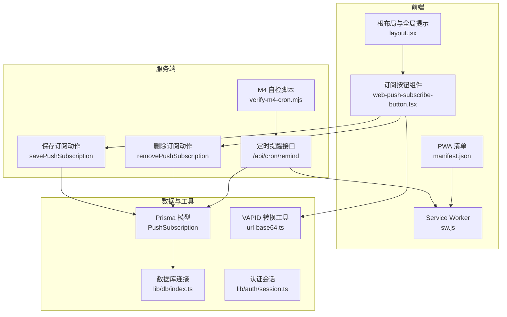
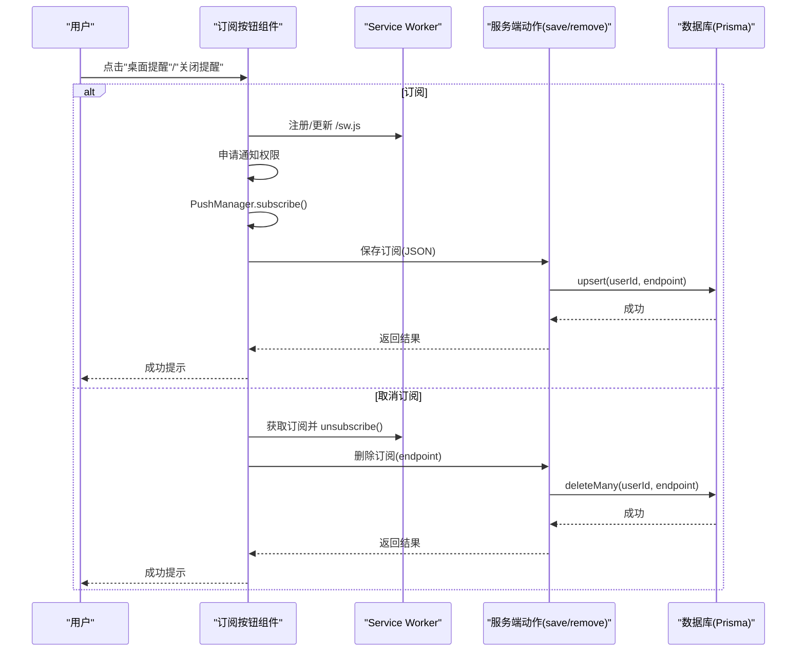
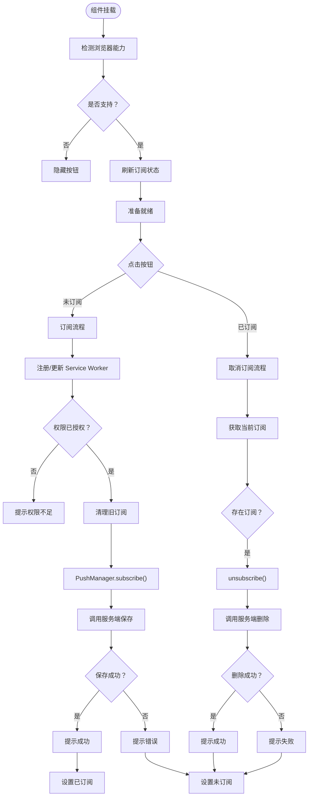
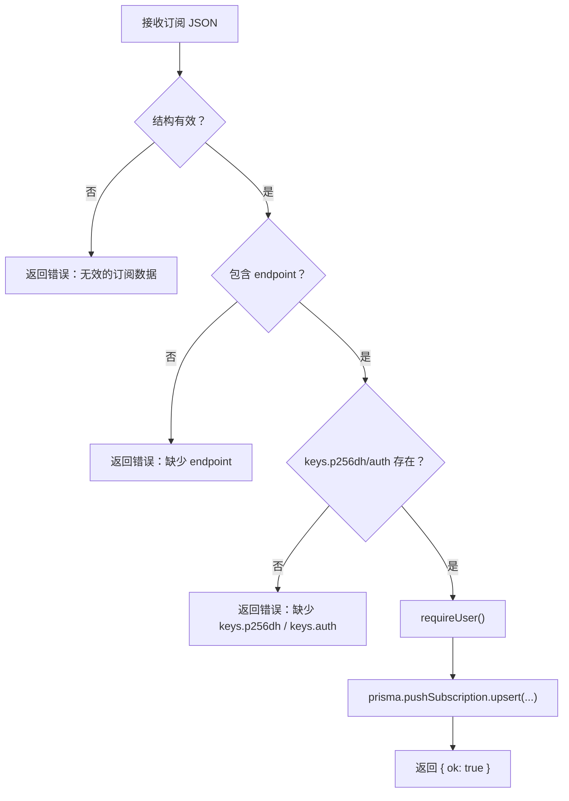
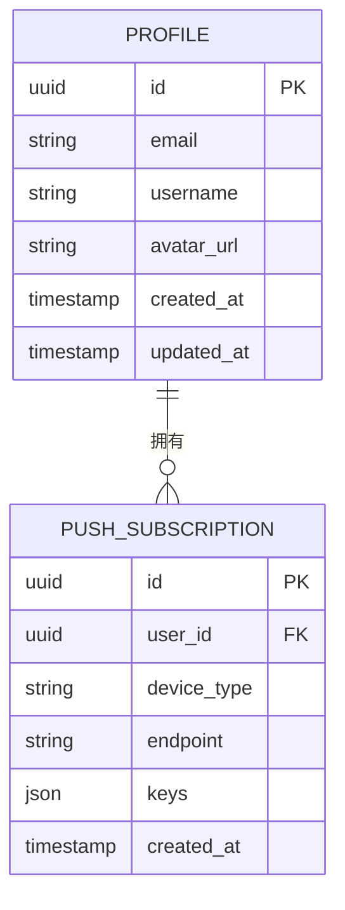
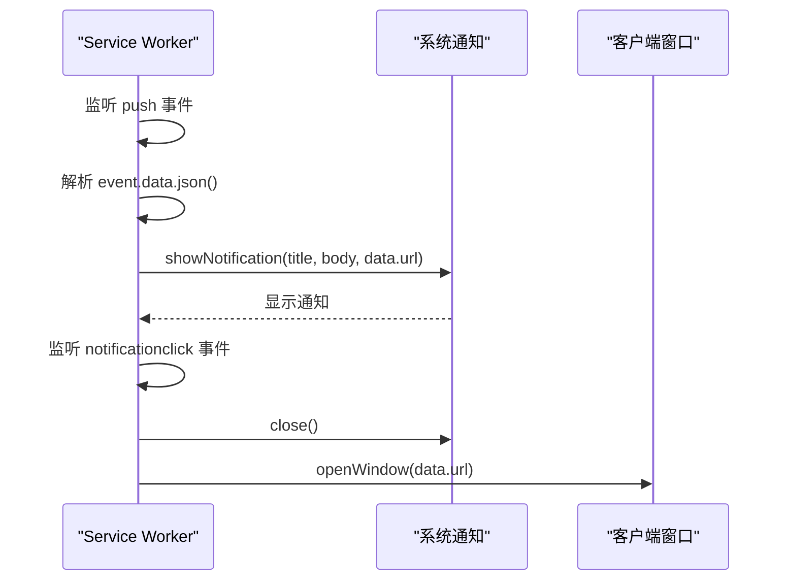
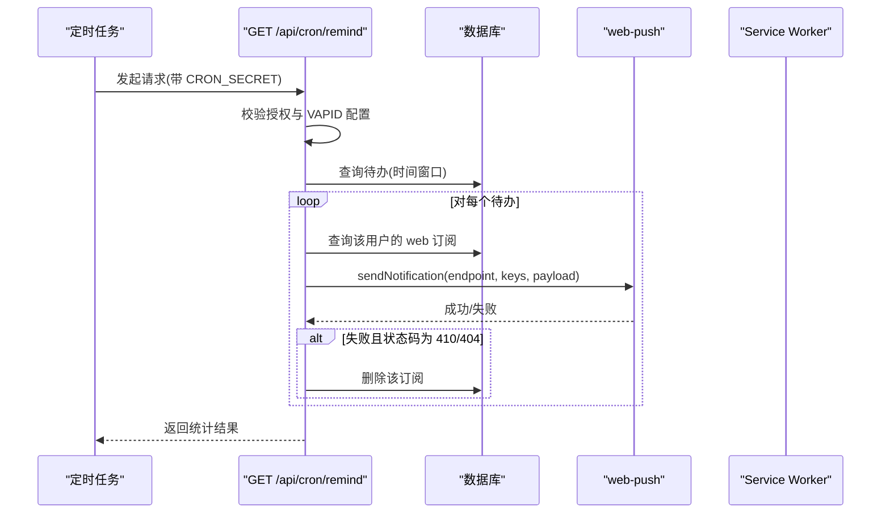
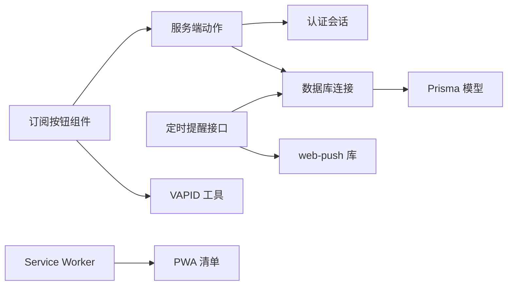

# 推送订阅管理

<cite>
**本文档引用的文件**
- [web-push-subscribe-button.tsx](file://src/components/push/web-push-subscribe-button.tsx)
- [push.ts](file://src/actions/push.ts)
- [schema.prisma](file://prisma/schema.prisma)
- [sw.js](file://public/sw.js)
- [url-base64.ts](file://src/lib/push/url-base64.ts)
- [index.ts](file://src/lib/db/index.ts)
- [session.ts](file://src/lib/auth/session.ts)
- [route.ts](file://src/app/api/cron/remind/route.ts)
- [layout.tsx](file://src/app/layout.tsx)
- [manifest.json](file://public/manifest.json)
- [README.md](file://README.md)
- [package.json](file://package.json)
- [verify-m4-cron.mjs](file://scripts/verify-m4-cron.mjs)
</cite>

## 目录
1. [简介](#简介)
2. [项目结构](#项目结构)
3. [核心组件](#核心组件)
4. [架构概览](#架构概览)
5. [详细组件分析](#详细组件分析)
6. [依赖关系分析](#依赖关系分析)
7. [性能考量](#性能考量)
8. [故障排除指南](#故障排除指南)
9. [结论](#结论)
10. [附录](#附录)

## 简介
本文件为推送订阅管理功能的完整实现文档，涵盖订阅按钮组件的设计与实现、订阅状态生命周期、数据存储与检索机制、订阅更新与删除操作、最佳实践以及使用示例与集成指南。系统基于 Next.js 16、React 19、Prisma、Supabase 与 Web Push 技术栈构建，支持桌面提醒与移动端 PWA 提醒。

## 项目结构
推送订阅相关的核心文件分布如下：
- 组件层：订阅按钮组件位于组件目录，负责用户交互与状态管理
- 动作层：服务端动作封装了订阅保存与删除逻辑
- 数据层：Prisma 模型定义了推送订阅的数据结构与索引
- 运行时：Service Worker 处理推送消息展示与点击跳转
- 配置与工具：VAPID 密钥转换工具、数据库连接、认证会话、定时提醒接口与验证脚本

**图表来源**
- [web-push-subscribe-button.tsx:1-127](file://src/components/push/web-push-subscribe-button.tsx#L1-L127)
- [push.ts:1-62](file://src/actions/push.ts#L1-L62)
- [schema.prisma:102-116](file://prisma/schema.prisma#L102-L116)
- [sw.js:1-29](file://public/sw.js#L1-L29)
- [url-base64.ts:1-14](file://src/lib/push/url-base64.ts#L1-L14)
- [index.ts:1-16](file://src/lib/db/index.ts#L1-L16)
- [session.ts:1-19](file://src/lib/auth/session.ts#L1-L19)
- [route.ts:1-115](file://src/app/api/cron/remind/route.ts#L1-L115)
- [layout.tsx:1-54](file://src/app/layout.tsx#L1-L54)
- [manifest.json:1-27](file://public/manifest.json#L1-L27)
- [verify-m4-cron.mjs:1-82](file://scripts/verify-m4-cron.mjs#L1-L82)

**章节来源**
- [web-push-subscribe-button.tsx:1-127](file://src/components/push/web-push-subscribe-button.tsx#L1-L127)
- [push.ts:1-62](file://src/actions/push.ts#L1-L62)
- [schema.prisma:102-116](file://prisma/schema.prisma#L102-L116)
- [sw.js:1-29](file://public/sw.js#L1-L29)
- [url-base64.ts:1-14](file://src/lib/push/url-base64.ts#L1-L14)
- [index.ts:1-16](file://src/lib/db/index.ts#L1-L16)
- [session.ts:1-19](file://src/lib/auth/session.ts#L1-L19)
- [route.ts:1-115](file://src/app/api/cron/remind/route.ts#L1-L115)
- [layout.tsx:1-54](file://src/app/layout.tsx#L1-L54)
- [manifest.json:1-27](file://public/manifest.json#L1-L27)
- [README.md:115-134](file://README.md#L115-L134)
- [package.json:1-86](file://package.json#L1-L86)
- [verify-m4-cron.mjs:1-82](file://scripts/verify-m4-cron.mjs#L1-L82)

## 核心组件
- 订阅按钮组件：负责浏览器能力检测、通知权限申请、Service Worker 注册、订阅创建与状态切换、错误提示与无障碍属性
- 服务端动作：封装订阅保存与删除，进行输入校验、用户鉴权与数据库 upsert/delete 操作
- 数据模型：定义推送订阅的字段、唯一约束与索引，确保按用户与 endpoint 唯一性
- Service Worker：接收推送消息并展示通知，处理点击事件跳转到指定 URL
- VAPID 工具：将 URL-safe Base64 的 VAPID 公钥转换为 PushManager 订阅所需的 Uint8Array
- 定时提醒接口：按时间窗口扫描待办事项，向用户订阅发送 Web Push 通知，并清理失效订阅
- 验证脚本：检查环境变量与接口可用性，辅助 M4 阶段自检

**章节来源**
- [web-push-subscribe-button.tsx:1-127](file://src/components/push/web-push-subscribe-button.tsx#L1-L127)
- [push.ts:1-62](file://src/actions/push.ts#L1-L62)
- [schema.prisma:102-116](file://prisma/schema.prisma#L102-L116)
- [sw.js:1-29](file://public/sw.js#L1-L29)
- [url-base64.ts:1-14](file://src/lib/push/url-base64.ts#L1-L14)
- [route.ts:1-115](file://src/app/api/cron/remind/route.ts#L1-L115)
- [verify-m4-cron.mjs:1-82](file://scripts/verify-m4-cron.mjs#L1-L82)

## 架构概览
推送订阅管理采用“前端交互 + 服务端动作 + 数据持久化 + 定时任务 + Service Worker”的分层架构。前端通过订阅按钮发起订阅流程，服务端动作完成鉴权与数据写入；定时任务扫描待办并发送通知，Service Worker 负责消息展示与跳转；数据库模型保障数据一致性与查询效率。

**图表来源**
- [web-push-subscribe-button.tsx:39-96](file://src/components/push/web-push-subscribe-button.tsx#L39-L96)
- [push.ts:13-61](file://src/actions/push.ts#L13-L61)
- [sw.js:1-29](file://public/sw.js#L1-L29)

## 详细组件分析

### 订阅按钮组件（WebPushSubscribeButton）
- 浏览器能力检测：在挂载后检测 Service Worker 与 PushManager 能力，不支持则隐藏按钮
- 通知权限申请：首次订阅前请求 Notification 权限，拒绝则提示并保持未订阅状态
- Service Worker 生命周期：注册 /sw.js 并主动 update，确保最新版本
- 订阅创建：清除旧订阅，使用 VAPID 公钥进行 subscribe，保存订阅 JSON 至服务端
- 订阅删除：取消订阅并删除服务端记录
- 状态管理：支持受控状态与 pending 状态，避免并发操作
- 错误处理：统一使用 toast 提示，区分环境变量缺失、HTTPS/localhost 要求、订阅失败等场景
- 无障碍与样式：提供 aria-label、title 与图标切换，响应式布局

**图表来源**
- [web-push-subscribe-button.tsx:26-96](file://src/components/push/web-push-subscribe-button.tsx#L26-L96)

**章节来源**
- [web-push-subscribe-button.tsx:1-127](file://src/components/push/web-push-subscribe-button.tsx#L1-L127)
- [url-base64.ts:1-14](file://src/lib/push/url-base64.ts#L1-L14)
- [layout.tsx:49-49](file://src/app/layout.tsx#L49-L49)

### 服务端动作（savePushSubscription / removePushSubscription）
- 输入校验：严格校验订阅 JSON 结构、endpoint 类型与 keys 字段完整性
- 用户鉴权：requireUser 确保已登录，防止匿名操作
- 数据持久化：使用 upsert 按 userId 与 endpoint 唯一性幂等更新；删除使用 deleteMany
- 返回格式：统一返回 { ok } 或 { error }，便于前端判断

**图表来源**
- [push.ts:13-49](file://src/actions/push.ts#L13-L49)

**章节来源**
- [push.ts:1-62](file://src/actions/push.ts#L1-L62)
- [session.ts:12-18](file://src/lib/auth/session.ts#L12-L18)
- [index.ts:1-16](file://src/lib/db/index.ts#L1-L16)

### 数据模型与存储机制（Prisma）
- 模型定义：PushSubscription 包含 userId、deviceType、endpoint、keys、createdAt 等字段
- 唯一约束：(userId, endpoint) 唯一，避免重复订阅
- 索引设计：对 userId 建立索引，加速按用户查询
- JSON 字段：keys 以 JSON 存储 p256dh 与 auth，便于直接传递给 web-push 库

**图表来源**
- [schema.prisma:102-116](file://prisma/schema.prisma#L102-L116)

**章节来源**
- [schema.prisma:102-116](file://prisma/schema.prisma#L102-L116)

### Service Worker 与通知展示
- 推送处理：接收 push 事件，解析 data.json，展示通知并携带跳转 URL
- 点击处理：关闭通知并打开指定 URL，支持相对路径与绝对路径
- 资源引用：使用清单中的图标资源作为通知图标与徽章

**图表来源**
- [sw.js:3-28](file://public/sw.js#L3-L28)
- [manifest.json:12-25](file://public/manifest.json#L12-L25)

**章节来源**
- [sw.js:1-29](file://public/sw.js#L1-L29)
- [manifest.json:1-27](file://public/manifest.json#L1-L27)

### 定时提醒与订阅失效处理
- 授权校验：通过 Authorization Bearer 校验 CRON_SECRET
- VAPID 配置：读取公钥与私钥，设置 web-push 参数
- 时间窗口扫描：查询即将到期的待办事项，限制扫描数量
- 通知发送：遍历用户 web 设备订阅，构造 payload 并发送
- 失效清理：对 410/404 状态的错误订阅进行删除清理
- 返回统计：返回扫描数、发送数与失败数

**图表来源**
- [route.ts:28-114](file://src/app/api/cron/remind/route.ts#L28-L114)

**章节来源**
- [route.ts:1-115](file://src/app/api/cron/remind/route.ts#L1-L115)
- [verify-m4-cron.mjs:1-82](file://scripts/verify-m4-cron.mjs#L1-L82)

## 依赖关系分析
- 组件依赖：订阅按钮组件依赖 UI Button、toast、服务端动作、VAPID 工具与浏览器原生 API
- 动作依赖：服务端动作依赖认证会话、数据库连接与 Prisma 模型
- 数据依赖：Prisma 模型依赖数据库连接与 Supabase Postgres
- 运行时依赖：Service Worker 依赖浏览器通知与 PWA 清单
- 定时任务依赖：web-push 库、VAPID 密钥与数据库

**图表来源**
- [web-push-subscribe-button.tsx:1-127](file://src/components/push/web-push-subscribe-button.tsx#L1-L127)
- [push.ts:1-62](file://src/actions/push.ts#L1-L62)
- [session.ts:1-19](file://src/lib/auth/session.ts#L1-L19)
- [index.ts:1-16](file://src/lib/db/index.ts#L1-L16)
- [schema.prisma:102-116](file://prisma/schema.prisma#L102-L116)
- [route.ts:1-115](file://src/app/api/cron/remind/route.ts#L1-L115)
- [url-base64.ts:1-14](file://src/lib/push/url-base64.ts#L1-L14)
- [sw.js:1-29](file://public/sw.js#L1-L29)
- [manifest.json:1-27](file://public/manifest.json#L1-L27)

**章节来源**
- [package.json:22-60](file://package.json#L22-L60)

## 性能考量
- 订阅状态刷新：使用浏览器原生 API 获取注册与订阅，避免不必要的网络请求
- 并发控制：使用 useTransition 与 pending 状态避免重复提交
- 数据库 upsert：按 (userId, endpoint) 唯一性更新，减少重复插入
- 定时任务扫描：限制扫描数量与时间窗口，降低数据库压力
- 失效订阅清理：自动删除 410/404 的失效订阅，避免后续发送失败
- 缓存策略：前端无显式缓存，但通过状态管理减少重复渲染；数据库层面依赖 Prisma 与索引优化

[本节为通用性能建议，无需特定文件来源]

## 故障排除指南
- 未配置 VAPID 公钥：订阅按钮会在缺少 NEXT_PUBLIC_VAPID_PUBLIC_KEY 时提示错误
- 非 HTTPS 环境：订阅失败时提示需使用 HTTPS 或 localhost
- 通知权限未授予：订阅流程会在权限拒绝时提示并保持未订阅状态
- Service Worker 注册失败：检查 /sw.js 是否可访问与作用域配置
- 定时任务未触发：确认 CRON_SECRET、VAPID 密钥与 NEXT_PUBLIC_APP_URL 配置正确
- 410/404 订阅失效：定时任务会自动清理失效订阅，可手动验证数据库记录
- M4 自检失败：使用 verify-m4-cron.mjs 脚本检查环境变量与接口返回

**章节来源**
- [web-push-subscribe-button.tsx:40-75](file://src/components/push/web-push-subscribe-button.tsx#L40-L75)
- [route.ts:29-37](file://src/app/api/cron/remind/route.ts#L29-L37)
- [verify-m4-cron.mjs:11-30](file://scripts/verify-m4-cron.mjs#L11-L30)

## 结论
推送订阅管理功能通过清晰的组件分层与严格的前后端协作，实现了从用户交互到数据持久化再到定时提醒的完整闭环。组件具备良好的错误处理与用户体验，数据模型与索引设计兼顾唯一性与查询效率，定时任务具备失效清理能力。建议在生产环境中完善监控与日志，持续优化扫描窗口与 TTL 参数，并加强安全防护与密钥轮换。

[本节为总结性内容，无需特定文件来源]

## 附录

### 订阅状态生命周期
- 未订阅：组件检测到无订阅，按钮显示“桌面提醒”
- 订阅中：成功保存订阅后，按钮显示“关闭提醒”，状态为已订阅
- 订阅失效：定时任务检测到 410/404，自动删除失效订阅，前端刷新状态为未订阅

**章节来源**
- [web-push-subscribe-button.tsx:20-24](file://src/components/push/web-push-subscribe-button.tsx#L20-L24)
- [route.ts:101-104](file://src/app/api/cron/remind/route.ts#L101-L104)

### 数据存储与检索机制
- 存储：savePushSubscription 使用 upsert 按 (userId, endpoint) 唯一性写入
- 检索：定时任务按 userId 与 deviceType 查询订阅，构造 payload 发送
- 索引：userId 建立索引，提升查询性能

**章节来源**
- [push.ts:30-46](file://src/actions/push.ts#L30-L46)
- [route.ts:69-71](file://src/app/api/cron/remind/route.ts#L69-L71)
- [schema.prisma:113-114](file://prisma/schema.prisma#L113-L114)

### 订阅更新与删除操作
- 更新：前端重新订阅时先 unsubscribe 再 subscribe，服务端 upsert 更新 keys
- 删除：前端取消订阅后删除数据库记录；定时任务失败时自动清理失效订阅

**章节来源**
- [web-push-subscribe-button.tsx:54-57](file://src/components/push/web-push-subscribe-button.tsx#L54-L57)
- [push.ts:52-61](file://src/actions/push.ts#L52-L61)
- [route.ts:101-104](file://src/app/api/cron/remind/route.ts#L101-L104)

### 最佳实践
- 用户体验：提供明确的权限提示与状态反馈，使用 toast 统一提示
- 性能：限制定时任务扫描范围与数量，合理设置 TTL
- 安全：严格校验订阅数据结构，使用 requireUser 防止匿名操作
- 兼容性：在非 HTTPS 环境下给出明确提示，优先使用 localhost 开发

**章节来源**
- [web-push-subscribe-button.tsx:48-75](file://src/components/push/web-push-subscribe-button.tsx#L48-L75)
- [push.ts:15-26](file://src/actions/push.ts#L15-L26)
- [route.ts:61-62](file://src/app/api/cron/remind/route.ts#L61-L62)

### 使用示例与集成指南
- 环境变量配置：NEXT_PUBLIC_VAPID_PUBLIC_KEY、VAPID_PRIVATE_KEY、VAPID_SUBJECT、CRON_SECRET、NEXT_PUBLIC_APP_URL
- 生成 VAPID：使用 web-push 工具生成密钥对并填入环境变量
- 部署与调度：在云服务器配置 crontab 每分钟调用 /api/cron/remind，或使用 Vercel Cron（Pro）
- 本地验证：使用 npm run verify:m4-cron 或 curl 手动触发接口
- 组件集成：在页面顶部导航栏引入 WebPushSubscribeButton，确保根布局包含 Toaster

**章节来源**
- [README.md:115-134](file://README.md#L115-L134)
- [package.json:20-20](file://package.json#L20-L20)
- [layout.tsx:49-49](file://src/app/layout.tsx#L49-L49)