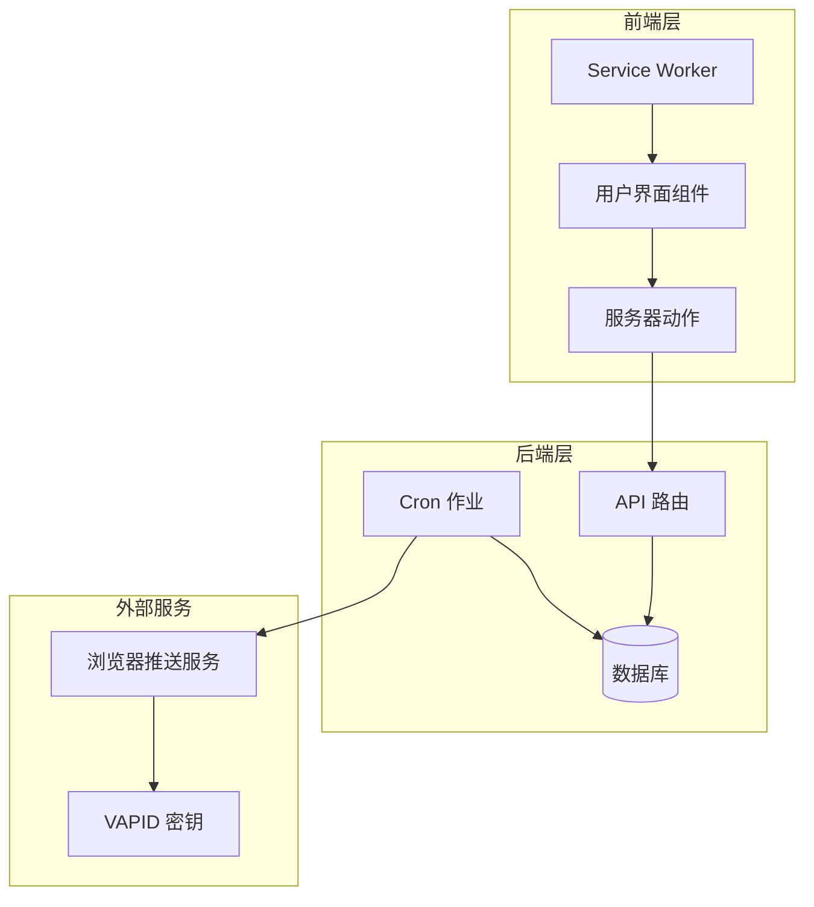
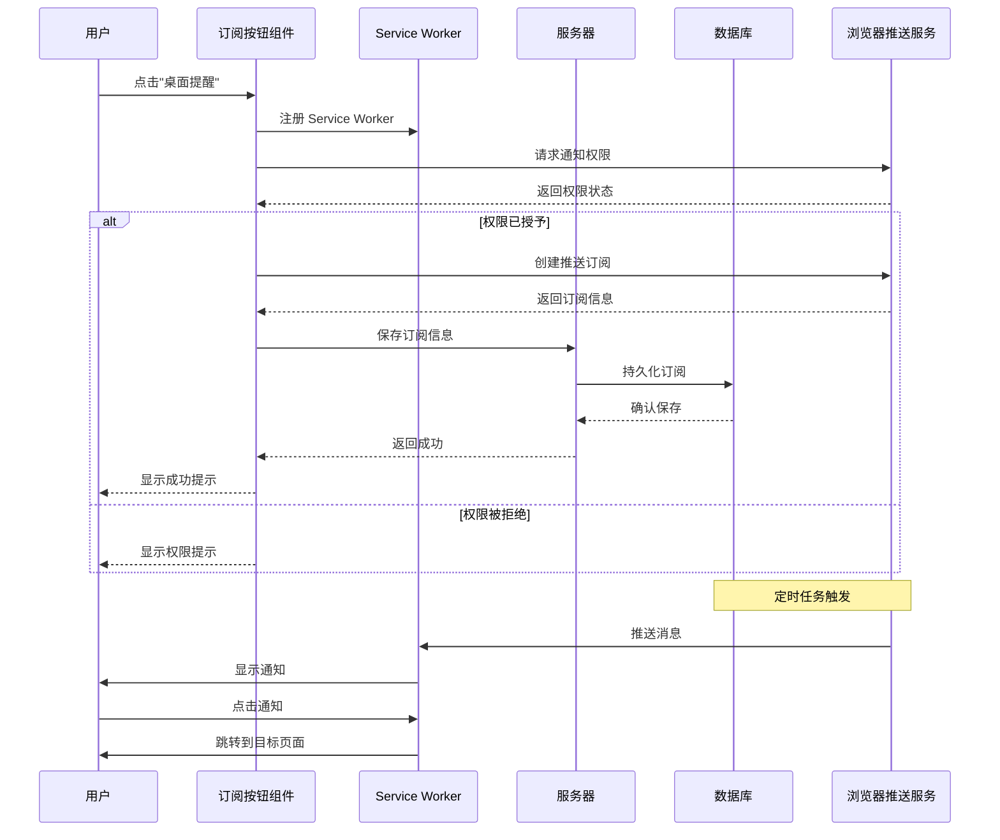
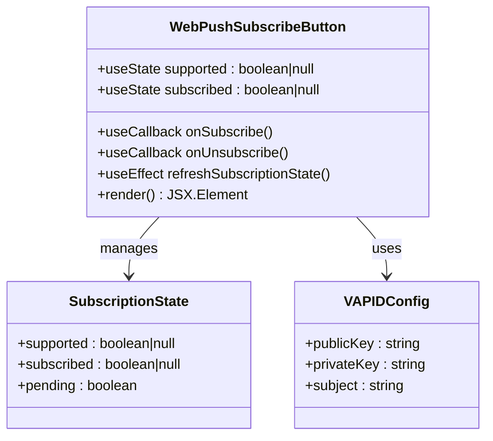
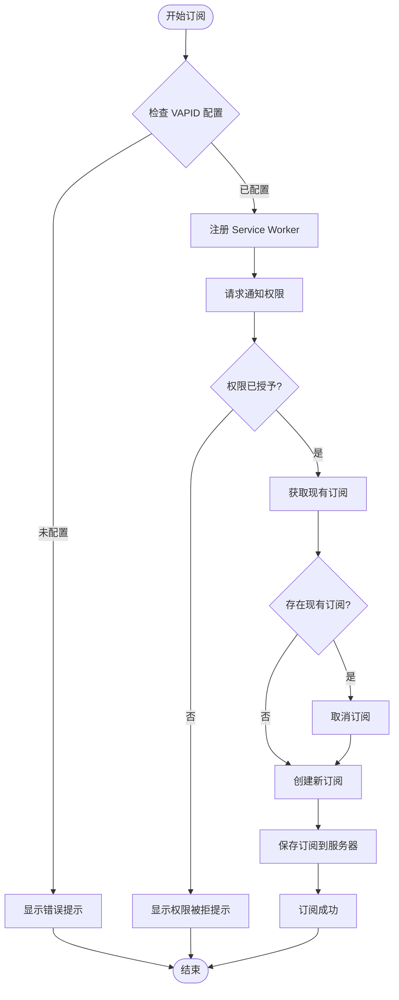
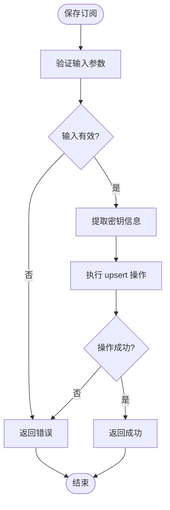
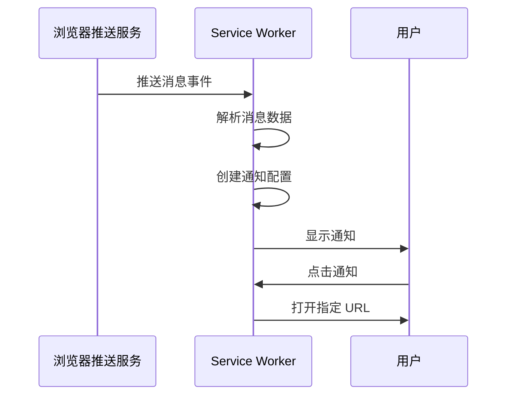
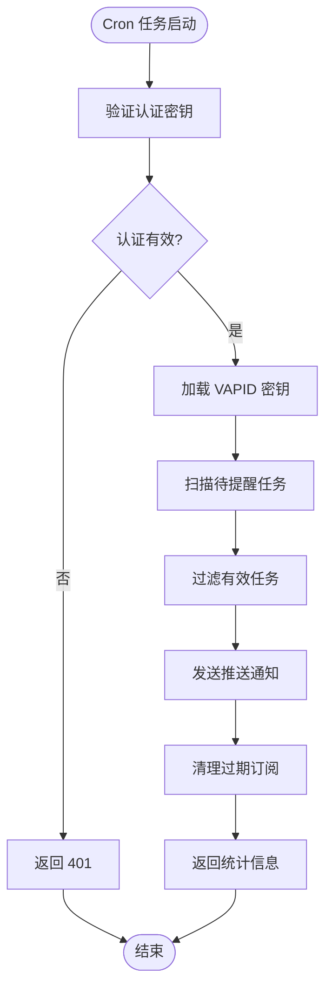
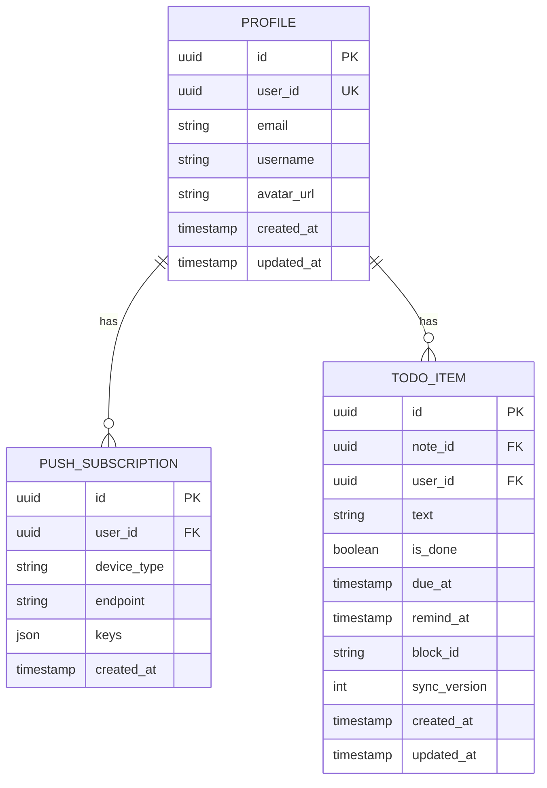
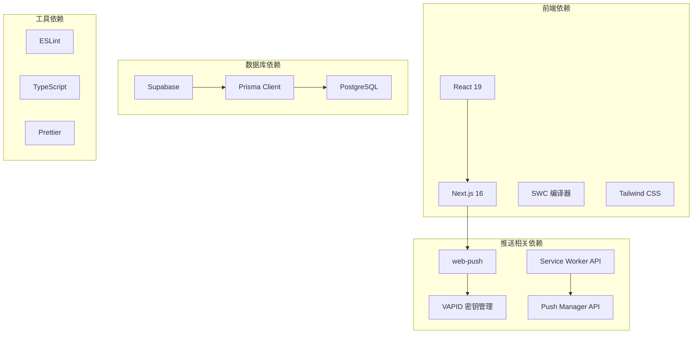

# 推送通知系统

<cite>
**本文档引用的文件**
- [src/actions/push.ts](file://src/actions/push.ts)
- [src/components/push/web-push-subscribe-button.tsx](file://src/components/push/web-push-subscribe-button.tsx)
- [public/sw.js](file://public/sw.js)
- [src/app/api/cron/remind/route.ts](file://src/app/api/cron/remind/route.ts)
- [src/lib/push/url-base64.ts](file://src/lib/push/url-base64.ts)
- [src/lib/db/index.ts](file://src/lib/db/index.ts)
- [prisma/schema.prisma](file://prisma/schema.prisma)
- [package.json](file://package.json)
- [scripts/verify-m4-cron.mjs](file://scripts/verify-m4-cron.mjs)
- [src/app/layout.tsx](file://src/app/layout.tsx)
</cite>

## 目录
1. [简介](#简介)
2. [项目结构](#项目结构)
3. [核心组件](#核心组件)
4. [架构概览](#架构概览)
5. [详细组件分析](#详细组件分析)
6. [依赖关系分析](#依赖关系分析)
7. [性能考量](#性能考量)
8. [故障排除指南](#故障排除指南)
9. [结论](#结论)
10. [附录](#附录)

## 简介

Smart-Todo 的推送通知系统是一个基于 Web Push API 的完整解决方案，实现了从订阅管理到定时提醒的全流程功能。该系统支持浏览器原生推送通知，提供桌面提醒功能，并通过 Service Worker 实现后台消息处理和通知显示。

系统采用现代前端技术栈，包括 Next.js 16、React 19、Prisma ORM 和 Supabase 数据库，确保了良好的开发体验和生产级稳定性。

## 项目结构

推送通知系统在项目中的组织结构如下：

**图表来源**
- [src/components/push/web-push-subscribe-button.tsx:1-127](file://src/components/push/web-push-subscribe-button.tsx#L1-L127)
- [src/app/api/cron/remind/route.ts:1-115](file://src/app/api/cron/remind/route.ts#L1-L115)

**章节来源**
- [src/components/push/web-push-subscribe-button.tsx:1-127](file://src/components/push/web-push-subscribe-button.tsx#L1-L127)
- [src/app/api/cron/remind/route.ts:1-115](file://src/app/api/cron/remind/route.ts#L1-L115)

## 核心组件

### 订阅管理组件

WebPushSubscribeButton 是推送订阅的核心 UI 组件，负责处理用户交互和订阅状态管理。

### 服务器动作

savePushSubscription 和 removePushSubscription 提供了服务器端的订阅持久化和清理功能。

### Service Worker

最小化的 Service Worker 实现了推送消息接收、通知显示和点击事件处理。

### 定时提醒 API

Cron Remind API 处理定时任务扫描和通知发送逻辑。

**章节来源**
- [src/components/push/web-push-subscribe-button.tsx:10-127](file://src/components/push/web-push-subscribe-button.tsx#L10-L127)
- [src/actions/push.ts:12-61](file://src/actions/push.ts#L12-L61)
- [public/sw.js:1-29](file://public/sw.js#L1-L29)
- [src/app/api/cron/remind/route.ts:28-114](file://src/app/api/cron/remind/route.ts#L28-L114)

## 架构概览

推送通知系统的整体架构采用分层设计，确保了功能模块的清晰分离和良好的可维护性。

**图表来源**
- [src/components/push/web-push-subscribe-button.tsx:39-96](file://src/components/push/web-push-subscribe-button.tsx#L39-L96)
- [public/sw.js:3-28](file://public/sw.js#L3-L28)

## 详细组件分析

### Web Push 订阅按钮组件

WebPushSubscribeButton 是整个推送系统的核心交互组件，实现了完整的订阅生命周期管理。

#### 组件架构

**图表来源**
- [src/components/push/web-push-subscribe-button.tsx:13-127](file://src/components/push/web-push-subscribe-button.tsx#L13-L127)

#### 功能特性

1. **浏览器兼容性检测**: 在组件挂载时检查 Service Worker 和 Push Manager 支持情况
2. **订阅状态管理**: 实时跟踪用户的订阅状态并更新 UI
3. **权限处理**: 优雅处理通知权限请求和拒绝场景
4. **VAPID 集成**: 支持 VAPID 公钥配置和转换
5. **错误处理**: 提供完善的错误捕获和用户反馈

#### 订阅流程

**图表来源**
- [src/components/push/web-push-subscribe-button.tsx:39-77](file://src/components/push/web-push-subscribe-button.tsx#L39-L77)

**章节来源**
- [src/components/push/web-push-subscribe-button.tsx:13-127](file://src/components/push/web-push-subscribe-button.tsx#L13-L127)

### 服务器动作层

服务器动作提供了安全的订阅管理和清理功能，确保只有经过身份验证的用户才能操作自己的订阅。

#### 订阅保存逻辑

**图表来源**
- [src/actions/push.ts:13-49](file://src/actions/push.ts#L13-L49)

#### 订阅移除逻辑

服务器动作还提供了订阅清理功能，允许用户主动移除不再使用的订阅。

**章节来源**
- [src/actions/push.ts:12-61](file://src/actions/push.ts#L12-L61)

### Service Worker 实现

Service Worker 是推送通知系统的核心后台组件，负责处理推送消息和用户交互。

#### 推送消息处理

Service Worker 实现了最小但完整的推送消息处理逻辑：

1. **消息解析**: 安全地解析推送消息数据
2. **通知创建**: 使用浏览器通知 API 显示通知
3. **点击处理**: 处理用户点击通知的导航行为

#### 通知显示流程

**图表来源**
- [public/sw.js:3-28](file://public/sw.js#L3-L28)

**章节来源**
- [public/sw.js:1-29](file://public/sw.js#L1-L29)

### 定时提醒 API

Cron Remind API 实现了定时任务扫描和通知发送的核心逻辑。

#### 任务扫描机制

**图表来源**
- [src/app/api/cron/remind/route.ts:28-114](file://src/app/api/cron/remind/route.ts#L28-L114)

#### 通知发送流程

定时任务实现了精确的时间窗口扫描和批量通知发送：

1. **时间窗口**: 每次扫描固定时间范围内的待提醒任务
2. **批量处理**: 支持最多 200 个任务的批量处理
3. **订阅匹配**: 为每个任务找到对应的用户订阅
4. **TTL 优化**: 设置合理的消息存活时间

**章节来源**
- [src/app/api/cron/remind/route.ts:28-114](file://src/app/api/cron/remind/route.ts#L28-L114)

### 数据模型设计

推送通知系统使用 Prisma ORM 管理订阅数据，确保了类型安全和数据库一致性。

#### 订阅数据模型

**图表来源**
- [prisma/schema.prisma:102-116](file://prisma/schema.prisma#L102-L116)

**章节来源**
- [prisma/schema.prisma:102-116](file://prisma/schema.prisma#L102-L116)

## 依赖关系分析

推送通知系统的依赖关系体现了清晰的分层架构设计。

**图表来源**
- [package.json:22-60](file://package.json#L22-L60)

**章节来源**
- [package.json:22-60](file://package.json#L22-L60)

## 性能考量

推送通知系统的性能优化主要体现在以下几个方面：

### 1. 订阅状态缓存
- 使用 React 状态管理避免频繁的浏览器 API 调用
- 通过 useEffect 机制延迟初始化，减少不必要的计算

### 2. 批量处理优化
- 定时任务每次最多处理 200 个任务，避免长时间阻塞
- 使用 upsert 操作替代多次查询，提高数据库效率

### 3. 内存管理
- Service Worker 生命周期管理，及时释放资源
- 错误处理中包含异常清理逻辑

### 4. 网络优化
- TTL 设置为 120 秒，平衡消息送达率和网络负载
- 异常情况下快速失败，避免长时间等待

## 故障排除指南

### 常见问题诊断

#### 1. 订阅失败
**症状**: 用户点击"桌面提醒"后收到错误提示
**可能原因**:
- VAPID 公钥未正确配置
- 浏览器不支持 Web Push API
- 用户拒绝了通知权限

**解决方案**:
- 检查环境变量 `NEXT_PUBLIC_VAPID_PUBLIC_KEY` 是否设置
- 确认网站使用 HTTPS 协议
- 清除浏览器缓存后重新尝试

#### 2. 通知不显示
**症状**: 订阅成功但收不到推送通知
**可能原因**:
- Service Worker 未正确注册
- 浏览器推送服务不可用
- 订阅已过期需要清理

**解决方案**:
- 检查浏览器开发者工具中的 Service Worker 状态
- 验证推送订阅是否仍然有效
- 重新创建订阅

#### 3. Cron 任务失败
**症状**: 定时提醒 API 返回错误
**可能原因**:
- 认证密钥配置错误
- VAPID 私钥未正确设置
- 数据库连接问题

**解决方案**:
- 使用验证脚本检查环境变量配置
- 检查数据库连接状态
- 查看服务器日志获取详细错误信息

### 调试工具

#### 1. 环境验证脚本
项目提供了专门的验证脚本用于测试推送配置：
- 检查必需的环境变量
- 验证 API 可访问性
- 输出详细的错误信息

#### 2. 开发者工具
- 浏览器开发者工具中的 Application 面板查看 Service Worker 状态
- Network 面板监控推送请求
- Console 面板查看错误日志

**章节来源**
- [scripts/verify-m4-cron.mjs:1-83](file://scripts/verify-m4-cron.mjs#L1-L83)

## 结论

Smart-Todo 的推送通知系统展现了现代 Web 应用推送功能的最佳实践。系统通过清晰的架构设计、完善的错误处理和性能优化，为用户提供了可靠的桌面提醒体验。

### 主要优势

1. **完整的生命周期管理**: 从订阅创建到清理的全流程覆盖
2. **安全的认证机制**: 基于 VAPID 的安全推送协议
3. **高效的定时处理**: 基于 Cron 的定时扫描和批量发送
4. **良好的用户体验**: 优雅的错误处理和状态反馈
5. **可扩展的架构**: 模块化设计便于功能扩展

### 技术亮点

- **最小化实现**: Service Worker 保持简洁，专注于核心功能
- **类型安全**: 完整的 TypeScript 类型定义
- **数据库优化**: 合理的索引设计和查询优化
- **错误恢复**: 自动清理过期订阅，提高系统可靠性

该系统为类似的应用提供了完整的参考实现，展示了如何在现代前端框架中集成 Web Push API 功能。

## 附录

### 环境变量配置

| 变量名 | 必需 | 描述 | 示例值 |
|--------|------|------|--------|
| NEXT_PUBLIC_VAPID_PUBLIC_KEY | 是 | VAPID 公钥（前端可见） | `BCJ...` |
| VAPID_PRIVATE_KEY | 是 | VAPID 私钥（后端可见） | `BCJ...` |
| VAPID_SUBJECT | 否 | VAPID 主题标识 | `mailto:user@example.com` |
| CRON_SECRET | 是 | Cron 任务认证密钥 | `secret` |
| NEXT_PUBLIC_APP_URL | 否 | 应用基础 URL | `https://app.example.com` |

### 安全最佳实践

1. **密钥管理**: VAPID 私钥必须妥善保管，定期轮换
2. **权限控制**: 严格验证用户身份，防止跨用户访问
3. **输入验证**: 对所有用户输入进行严格的验证和清理
4. **错误处理**: 隐藏敏感信息，只向用户显示必要的错误描述
5. **HTTPS 要求**: 生产环境必须使用 HTTPS 协议

### 监控和日志

系统建议实施以下监控措施：
- 订阅创建/删除的审计日志
- 推送发送的成功率统计
- Cron 任务执行时间监控
- 用户权限变更记录