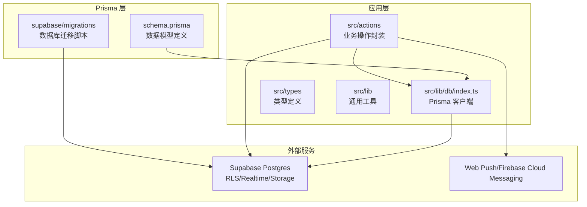
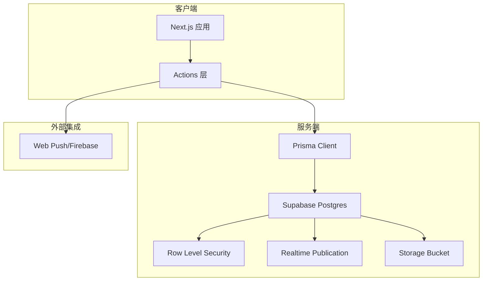
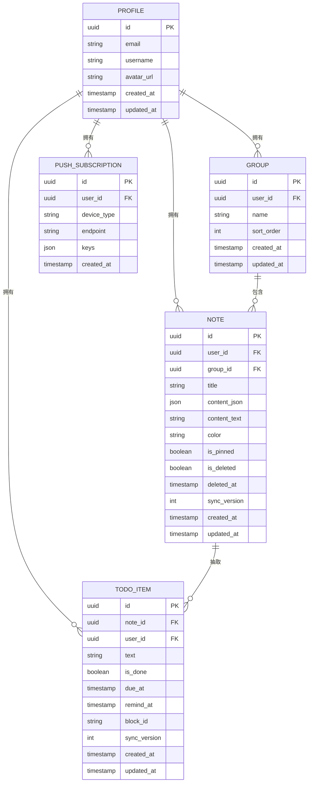
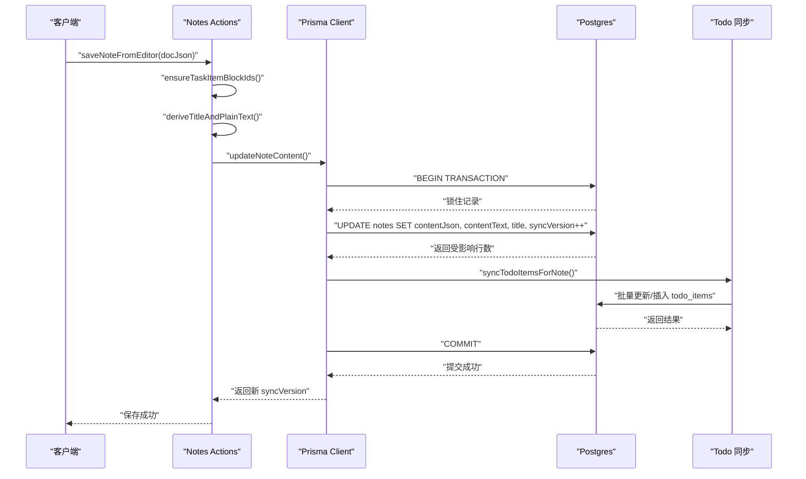
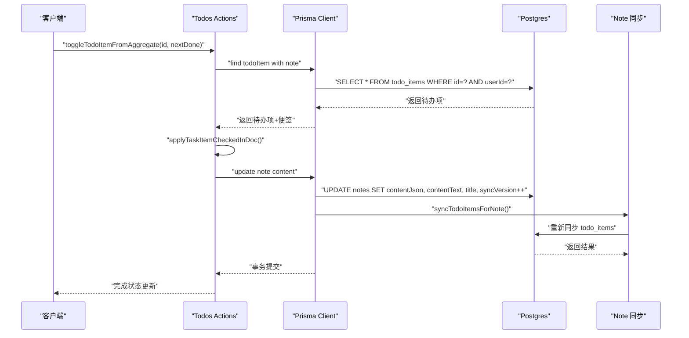
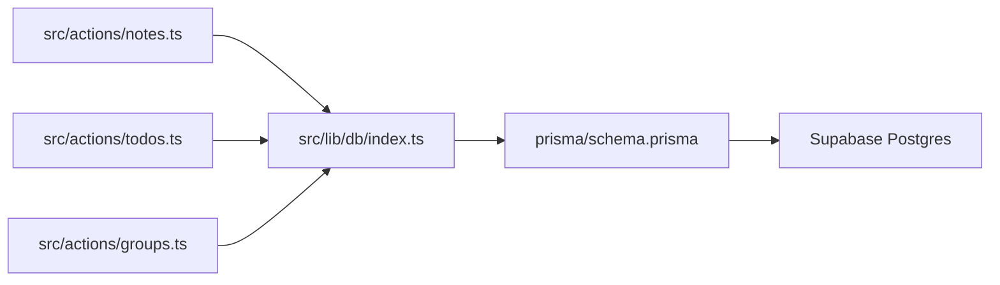
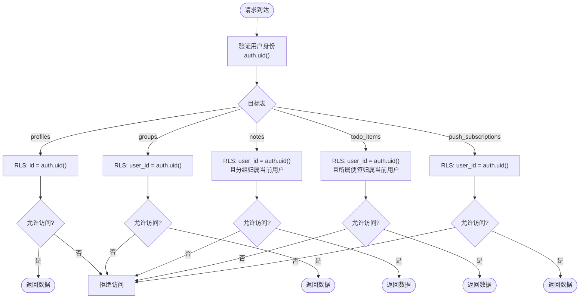
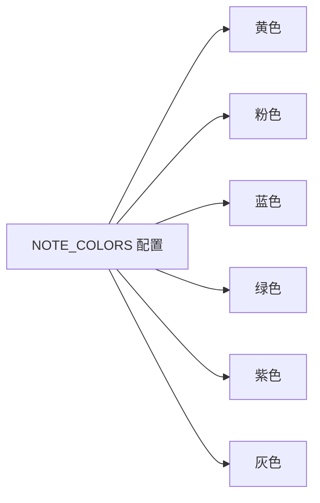

# Prisma 模型设计

<cite>
**本文引用的文件**
- [schema.prisma](file://prisma/schema.prisma)
- [20260513000000_enable_rls_policies.sql](file://supabase/migrations/20260513000000_enable_rls_policies.sql)
- [20260513120000_storage_note_images.sql](file://supabase/migrations/20260513120000_storage_note_images.sql)
- [20260513140000_realtime_publication.sql](file://supabase/migrations/20260513140000_realtime_publication.sql)
- [notes.ts](file://src/actions/notes.ts)
- [todos.ts](file://src/actions/todos.ts)
- [groups.ts](file://src/actions/groups.ts)
- [index.ts](file://src/lib/db/index.ts)
- [constants.ts](file://src/lib/constants.ts)
- [package.json](file://package.json)
</cite>

## 目录
1. [简介](#简介)
2. [项目结构](#项目结构)
3. [核心组件](#核心组件)
4. [架构概览](#架构概览)
5. [详细组件分析](#详细组件分析)
6. [依赖分析](#依赖分析)
7. [性能考量](#性能考量)
8. [故障排除指南](#故障排除指南)
9. [结论](#结论)
10. [附录](#附录)

## 简介
本文件为 Smart-Todo 项目的 Prisma 模型设计技术文档，深入解析核心数据模型的设计理念与实现细节。系统采用 Supabase Postgres 作为数据库，通过 Prisma ORM 进行数据建模与访问控制。核心实体包括 Profile（用户资料）、Group（分组）、Note（便签）、TodoItem（待办事项）、PushSubscription（推送订阅），涵盖一对一、一对多关系映射、外键约束与级联删除策略。文档还详细说明了特殊字段如 syncVersion（同步版本号）、contentJson（富文本存储）、deletedAt（软删除）的设计目的与使用场景，并提供模型扩展与修改的最佳实践建议。

## 项目结构
Smart-Todo 项目采用基于功能模块的组织方式，Prisma 模型位于 prisma/schema.prisma，数据库迁移脚本位于 supabase/migrations，业务逻辑通过 Next.js Actions 与 Prisma 客户端交互。

**图表来源**
- [schema.prisma:1-117](file://prisma/schema.prisma#L1-L117)
- [20260513000000_enable_rls_policies.sql:1-203](file://supabase/migrations/20260513000000_enable_rls_policies.sql#L1-L203)
- [20260513120000_storage_note_images.sql:1-51](file://supabase/migrations/20260513120000_storage_note_images.sql#L1-L51)
- [20260513140000_realtime_publication.sql:1-7](file://supabase/migrations/20260513140000_realtime_publication.sql#L1-L7)

**章节来源**
- [schema.prisma:1-117](file://prisma/schema.prisma#L1-L117)
- [package.json:1-86](file://package.json#L1-L86)

## 核心组件
本节概述五个核心数据模型及其职责边界：
- Profile：用户业务侧资料，与 Supabase Auth 的 auth.users 通过 UUID 主键保持一致，实现一对一关系
- Group：自定义分组，按用户维度组织便签
- Note：富文本便签，支持内容快照、颜色标记、置顶、软删除与多端同步
- TodoItem：从便签内容中抽取的待办事项，支持到期提醒与聚合视图
- PushSubscription：推送订阅信息，支持 FCM/Web Push

**章节来源**
- [schema.prisma:15-116](file://prisma/schema.prisma#L15-L116)

## 架构概览
系统采用分层架构：前端通过 Next.js Actions 调用 Prisma 客户端，Prisma 通过 DATABASE_URL/DIRECT_URL 连接 Supabase Postgres。RLS 策略确保数据隔离，Realtime publication 支持实时订阅，Storage bucket 提供便签图片存储。

**图表来源**
- [schema.prisma:9-13](file://prisma/schema.prisma#L9-L13)
- [20260513000000_enable_rls_policies.sql:34-40](file://supabase/migrations/20260513000000_enable_rls_policies.sql#L34-L40)
- [20260513140000_realtime_publication.sql:4-6](file://supabase/migrations/20260513140000_realtime_publication.sql#L4-L6)
- [20260513120000_storage_note_images.sql:4-16](file://supabase/migrations/20260513120000_storage_note_images.sql#L4-L16)

## 详细组件分析

### Profile（用户资料）模型
Profile 是用户业务侧资料表，与 Supabase Auth 的 auth.users 通过 UUID 主键保持一致，实现一对一关系。模型包含基础用户信息字段与反向关系，支持查询用户的所有分组、便签、待办事项和推送订阅。

- 字段定义与约束
  - id：String @id @db.Uuid，主键与 Supabase auth.users.id 对齐
  - email：String?，用户邮箱
  - username：String?，用户名
  - avatarUrl：String?，头像 URL
  - createdAt/updatedAt：DateTime，默认值与更新时间戳
- 关系映射
  - 与 Group、Note、TodoItem、PushSubscription 均为一对一关系
- 索引策略
  - 无显式索引，但通过主键 UUID 实现唯一性保证

**章节来源**
- [schema.prisma:15-30](file://prisma/schema.prisma#L15-L30)

### Group（分组）模型
Group 表示用户自定义的分组，用于对便签进行逻辑分类。模型通过 userId 外键关联到 Profile，并支持排序字段与软删除。

- 字段定义与约束
  - id：String @id @default(uuid()) @db.Uuid，UUID 主键
  - userId：String @map("user_id") @db.Uuid，外键关联 Profile.id
  - name：String，分组名称
  - sortOrder：Int @default(0)，排序权重
  - createdAt/updatedAt：DateTime，默认值与更新时间戳
- 关系映射
  - 与 Profile：一对一（用户拥有分组）
  - 与 Note：一对多（分组包含多个便签）
- 级联策略
  - 删除用户时级联删除分组（onDelete: Cascade）
- 索引策略
  - userId 字段建立索引，优化按用户查询性能

**章节来源**
- [schema.prisma:32-46](file://prisma/schema.prisma#L32-L46)

### Note（便签）模型
Note 是富文本便签的核心实体，支持内容 JSON 存储、全文搜索快照、颜色标记、置顶、软删除与多端同步。

- 字段定义与约束
  - id：String @id @default(uuid()) @db.Uuid，UUID 主键
  - userId：String @map("user_id") @db.Uuid，外键关联 Profile.id
  - groupId：String? @map("group_id") @db.Uuid，外键关联 Group.id
  - title：String?，便签标题
  - contentJson：Json @default("{}")，Tiptap JSON 文档
  - contentText：String @default(""), 全文搜索快照
  - color：String?，颜色标记，对应 NOTE_COLORS.id
  - isPinned：Boolean @default(false)，是否置顶
  - isDeleted：Boolean @default(false)，软删除标志
  - deletedAt：DateTime?，软删除时间
  - syncVersion：Int @default(0)，同步版本号，用于 LWW 冲突解决
  - createdAt/updatedAt：DateTime，默认值与更新时间戳
- 关系映射
  - 与 Profile：一对一（用户拥有便签）
  - 与 Group：一对多（可为空，SetNull 级联）
  - 与 TodoItem：一对多（从便签内容抽取的待办）
- 级联策略
  - 删除用户时级联删除便签（onDelete: Cascade）
  - 删除分组时将 groupId 设为 NULL（onDelete: SetNull）
- 索引策略
  - 组合索引：(userId, isDeleted, isPinned, updatedAt)，优化列表查询与排序
  - groupId 字段索引，优化分组过滤

**章节来源**
- [schema.prisma:48-75](file://prisma/schema.prisma#L48-L75)

### TodoItem（待办事项）模型
TodoItem 从便签 contentJson 中抽取的待办事项，支持到期提醒与聚合视图查询。

- 字段定义与约束
  - id：String @id @default(uuid()) @db.Uuid，UUID 主键
  - noteId：String @map("note_id") @db.Uuid，外键关联 Note.id
  - userId：String @map("user_id") @db.Uuid，外键关联 Profile.id
  - text：String，待办文本
  - isDone：Boolean @default(false)，完成状态
  - dueAt：DateTime?，到期时间
  - remindAt：DateTime?，提醒时间
  - blockId：String @map("block_id")，回链到 contentJson 中的节点 id
  - syncVersion：Int @default(0)，同步版本号
  - createdAt/updatedAt：DateTime，默认值与更新时间戳
- 关系映射
  - 与 Note：一对一（所属便签）
  - 与 Profile：一对一（所属用户）
- 级联策略
  - 删除便签时级联删除待办（onDelete: Cascade）
  - 删除用户时级联删除待办（onDelete: Cascade）
- 索引策略
  - 唯一索引：(noteId, blockId)，确保同一便签内块 ID 唯一
  - 组合索引：(userId, remindAt)，优化提醒查询
  - 组合索引：(userId, isDone, dueAt)，优化聚合视图
  - noteId 字段索引，优化按便签查询

**章节来源**
- [schema.prisma:77-100](file://prisma/schema.prisma#L77-L100)

### PushSubscription（推送订阅）模型
PushSubscription 存储用户的推送订阅信息，支持 FCM 与 Web Push。

- 字段定义与约束
  - id：String @id @default(uuid()) @db.Uuid，UUID 主键
  - userId：String @map("user_id") @db.Uuid，外键关联 Profile.id
  - deviceType：String @map("device_type")，设备类型（'android' | 'web'）
  - endpoint：String，推送端点
  - keys：Json，密钥信息
  - createdAt：DateTime @default(now())，创建时间
- 关系映射
  - 与 Profile：一对一（用户拥有订阅）
- 级联策略
  - 删除用户时级联删除订阅（onDelete: Cascade）
- 索引策略
  - 唯一索引：(userId, endpoint)，确保同一用户下端点唯一
  - userId 字段索引，优化按用户查询

**章节来源**
- [schema.prisma:102-116](file://prisma/schema.prisma#L102-L116)

### 特殊字段设计详解

#### syncVersion（同步版本号）
- 设计目的：实现 Last-Write-Wins（LWW）冲突解决机制，支持多端并发编辑
- 使用场景：
  - 乐观并发控制：更新前检查期望版本，避免覆盖他人修改
  - 离线队列重放：跳过版本校验以允许 LWW 合并
- 实现要点：
  - 默认值为 0，每次成功更新后递增
  - 与 contentJson、contentText、title 等字段一起更新

**章节来源**
- [schema.prisma:63-64](file://prisma/schema.prisma#L63-L64)
- [notes.ts:64-75](file://src/actions/notes.ts#L64-L75)
- [notes.ts:77-105](file://src/actions/notes.ts#L77-L105)

#### contentJson（富文本存储）
- 设计目的：以 JSON 格式存储 Tiptap 编辑器文档，支持复杂富文本结构
- 使用场景：
  - 便签内容持久化
  - 待办项从富文本中抽取与回写
- 实现要点：
  - 默认空文档结构，确保客户端渲染一致性
  - 与 contentText 快照配合，支持全文搜索

**章节来源**
- [schema.prisma:54-55](file://prisma/schema.prisma#L54-L55)
- [notes.ts:17-20](file://src/actions/notes.ts#L17-L20)

#### deletedAt（软删除）
- 设计目的：实现软删除机制，保留数据以便后续恢复与审计
- 使用场景：
  - 便签回收站功能
  - 基于时间的自动清理策略
- 实现要点：
  - isDeleted 标志位与 deletedAt 时间戳配合
  - 查询时默认过滤已删除记录

**章节来源**
- [schema.prisma:61-62](file://prisma/schema.prisma#L61-L62)
- [notes.ts:175-184](file://src/actions/notes.ts#L175-L184)

### 关系映射与级联策略

**图表来源**
- [schema.prisma:15-116](file://prisma/schema.prisma#L15-L116)

**章节来源**
- [schema.prisma:41-42](file://prisma/schema.prisma#L41-L42)
- [schema.prisma:68-69](file://prisma/schema.prisma#L68-L69)
- [schema.prisma:92-93](file://prisma/schema.prisma#L92-L93)
- [schema.prisma](file://prisma/schema.prisma#L111)

### 数据流与业务流程

#### 便签内容更新流程

**图表来源**
- [notes.ts:141-152](file://src/actions/notes.ts#L141-L152)
- [notes.ts:59-138](file://src/actions/notes.ts#L59-L138)

#### 待办事项完成流程

**图表来源**
- [todos.ts:11-69](file://src/actions/todos.ts#L11-L69)

## 依赖分析

### 数据库访问层
应用通过统一的 Prisma 客户端访问数据库，客户端在开发环境启用详细日志，在生产环境仅记录错误日志。

**图表来源**
- [index.ts:1-16](file://src/lib/db/index.ts#L1-L16)
- [notes.ts:1-10](file://src/actions/notes.ts#L1-L10)
- [todos.ts:1-9](file://src/actions/todos.ts#L1-L9)
- [groups.ts:1-5](file://src/actions/groups.ts#L1-L5)

**章节来源**
- [index.ts:1-16](file://src/lib/db/index.ts#L1-L16)
- [package.json:12-19](file://package.json#L12-L19)

### 访问控制与安全
系统通过 Supabase 的 Row Level Security（RLS）策略实现数据隔离，每张业务表都启用了 RLS，并为 CRUD 操作定义了相应的策略。

**图表来源**
- [20260513000000_enable_rls_policies.sql:34-202](file://supabase/migrations/20260513000000_enable_rls_policies.sql#L34-L202)

**章节来源**
- [20260513000000_enable_rls_policies.sql:1-203](file://supabase/migrations/20260513000000_enable_rls_policies.sql#L1-L203)

### 实时订阅与存储
- Realtime：将 notes、groups、todo_items 表加入 supabase_realtime publication，支持客户端 postgres_changes 订阅
- Storage：配置 note-images 存储桶，限制文件大小与 MIME 类型，实现基于路径的访问控制

**章节来源**
- [20260513140000_realtime_publication.sql:1-7](file://supabase/migrations/20260513140000_realtime_publication.sql#L1-L7)
- [20260513120000_storage_note_images.sql:1-51](file://supabase/migrations/20260513120000_storage_note_images.sql#L1-L51)

## 性能考量
- 索引策略
  - Note 列表查询：组合索引(userId, isDeleted, isPinned, updatedAt) 支持高效排序与过滤
  - TodoItem 查询：组合索引(userId, remindAt) 和 (userId, isDone, dueAt) 优化提醒与聚合视图
  - 外键字段均建立索引，减少 JOIN 开销
- 查询模式
  - 优先使用组合索引进行过滤与排序，避免全表扫描
  - 通过软删除字段过滤已删除记录，减少无效数据传输
- 缓存与失效
  - Next.js revalidatePath 机制配合 Prisma 查询缓存，提升响应速度
- 并发控制
  - syncVersion 乐观锁避免多端并发写入冲突
  - 事务包裹关键操作，确保数据一致性

## 故障排除指南
- 同步冲突处理
  - 现象：更新失败，提示冲突
  - 处理：读取服务器最新 syncVersion，重新发起更新
  - 参考：[notes.ts:122-131](file://src/actions/notes.ts#L122-L131)
- 权限不足
  - 现象：RLS 拒绝访问
  - 处理：确认用户已登录且操作对象属于当前用户
  - 参考：[20260513000000_enable_rls_policies.sql:45-60](file://supabase/migrations/20260513000000_enable_rls_policies.sql#L45-L60)
- 外键约束错误
  - 现象：关联数据不存在
  - 处理：检查关联 ID 是否有效且属于当前用户
  - 参考：[groups.ts:13-18](file://src/actions/groups.ts#L13-L18), [notes.ts:154-173](file://src/actions/notes.ts#L154-L173)
- 软删除数据
  - 现象：查询不到已删除数据
  - 处理：确认 isDeleted 标志位与查询条件
  - 参考：[notes.ts:175-184](file://src/actions/notes.ts#L175-L184)

**章节来源**
- [notes.ts:122-131](file://src/actions/notes.ts#L122-L131)
- [20260513000000_enable_rls_policies.sql:85-122](file://supabase/migrations/20260513000000_enable_rls_policies.sql#L85-L122)
- [groups.ts:13-18](file://src/actions/groups.ts#L13-L18)
- [notes.ts:175-184](file://src/actions/notes.ts#L175-L184)

## 结论
Smart-Todo 的 Prisma 模型设计体现了清晰的数据分层与严格的访问控制。通过 UUID 主键、RLS 策略与组合索引，系统实现了高性能、安全可靠的数据管理。syncVersion 机制有效解决了多端并发冲突，contentJson 与 contentText 的配合提供了强大的富文本能力。整体设计既满足当前业务需求，又为未来的扩展预留了空间。

## 附录

### 模型扩展与修改最佳实践
- 向后兼容性
  - 新增字段时提供默认值，避免影响现有记录
  - 修改字段类型时确保兼容性，必要时添加迁移脚本
- 索引策略
  - 新增查询频繁的字段时，评估是否需要建立索引
  - 定期审查组合索引的使用情况，移除冗余索引
- 迁移策略
  - 使用 Prisma Migrate 进行结构变更，避免直接修改数据库
  - 在生产环境执行迁移前，先在测试环境验证
- 性能监控
  - 监控慢查询日志，识别需要优化的索引
  - 定期分析查询计划，调整索引策略

### 颜色配置
便签颜色通过常量定义，与 Note.color 字段保持一致：

**图表来源**
- [constants.ts:4-11](file://src/lib/constants.ts#L4-L11)

**章节来源**
- [constants.ts:1-16](file://src/lib/constants.ts#L1-L16)