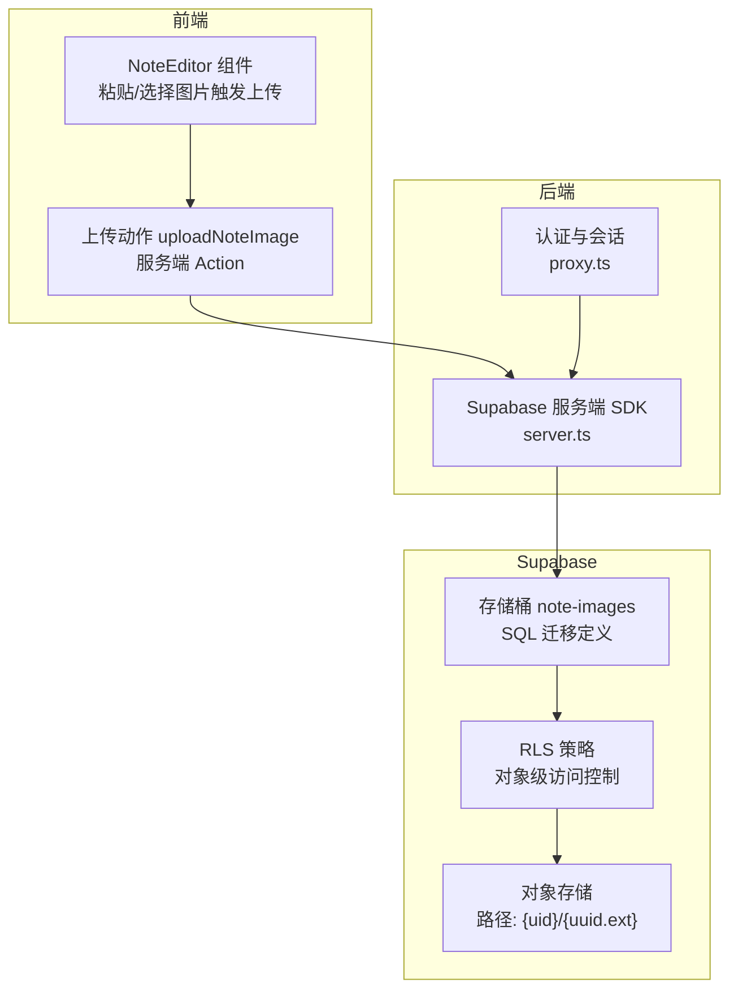
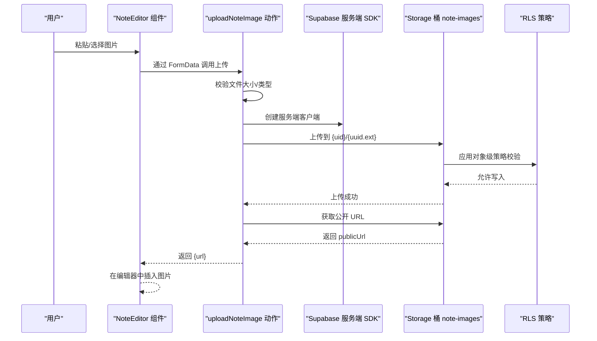
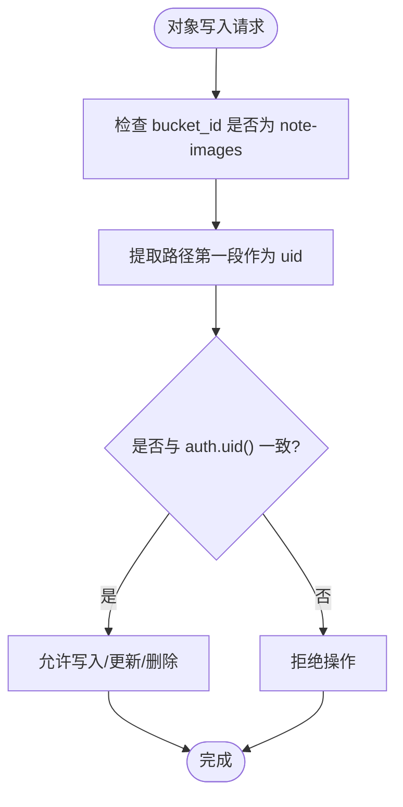
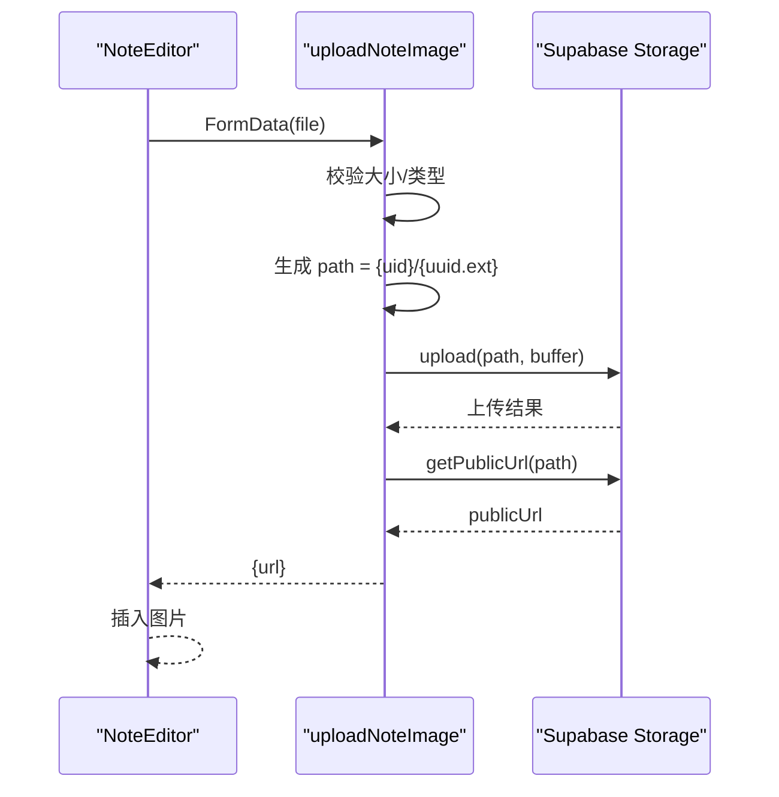
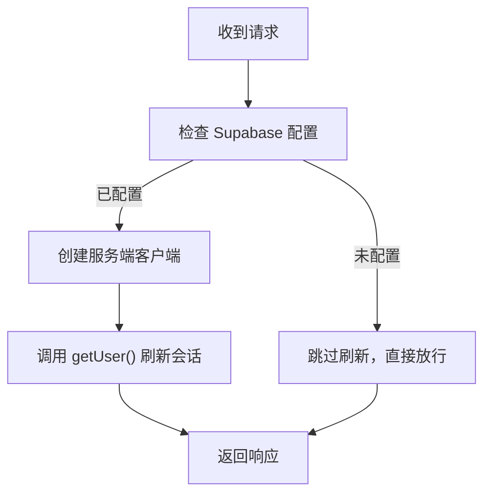
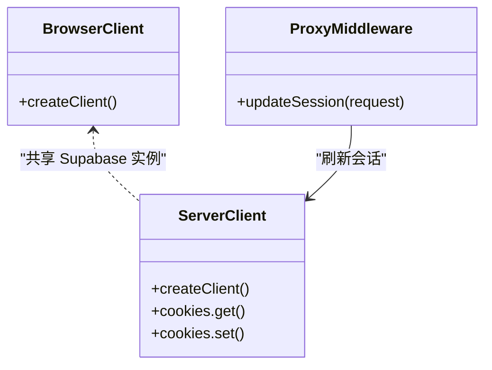
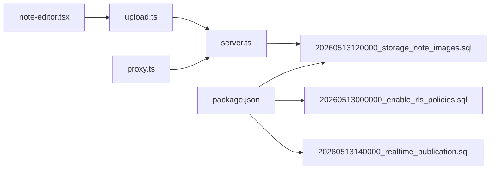

# Storage 配置与管理

<cite>
**本文引用的文件**
- [20260513120000_storage_note_images.sql](file://supabase/migrations/20260513120000_storage_note_images.sql)
- [20260513000000_enable_rls_policies.sql](file://supabase/migrations/20260513000000_enable_rls_policies.sql)
- [20260513140000_realtime_publication.sql](file://supabase/migrations/20260513140000_realtime_publication.sql)
- [upload.ts](file://src/actions/upload.ts)
- [note-editor.tsx](file://src/components/editor/note-editor.tsx)
- [client.ts](file://src/lib/supabase/client.ts)
- [server.ts](file://src/lib/supabase/server.ts)
- [proxy.ts](file://src/lib/supabase/proxy.ts)
- [package.json](file://package.json)
- [constants.ts](file://src/lib/constants.ts)
</cite>

## 目录
1. [简介](#简介)
2. [项目结构](#项目结构)
3. [核心组件](#核心组件)
4. [架构总览](#架构总览)
5. [详细组件分析](#详细组件分析)
6. [依赖关系分析](#依赖关系分析)
7. [性能考虑](#性能考虑)
8. [故障排查指南](#故障排查指南)
9. [结论](#结论)
10. [附录](#附录)

## 简介
本文件面向 Smart-Todo 的 Supabase Storage 配置与管理，系统性阐述存储桶（Bucket）的创建与策略、权限与访问控制、图片上传流程、URL 生成、生命周期管理、性能优化、错误处理与重试、监控与维护等主题。文档以仓库中的迁移脚本、上传动作与编辑器组件为依据，结合前端与服务端 SDK 的使用方式，给出可操作的配置建议与最佳实践。

## 项目结构
围绕 Storage 的关键文件分布如下：
- 存储桶与策略定义：位于 supabase/migrations 下的 SQL 迁移文件
- 上传动作与前端集成：src/actions/upload.ts 与 src/components/editor/note-editor.tsx
- Supabase 客户端封装：src/lib/supabase/client.ts、server.ts、proxy.ts
- 项目脚本与依赖：package.json
- 应用常量：src/lib/constants.ts

**图表来源**
- [20260513120000_storage_note_images.sql:4-16](file://supabase/migrations/20260513120000_storage_note_images.sql#L4-L16)
- [upload.ts:6-37](file://src/actions/upload.ts#L6-L37)
- [server.ts:4-28](file://src/lib/supabase/server.ts#L4-L28)
- [note-editor.tsx:270-330](file://src/components/editor/note-editor.tsx#L270-L330)
- [proxy.ts:15-51](file://src/lib/supabase/proxy.ts#L15-L51)

**章节来源**
- [20260513120000_storage_note_images.sql:1-51](file://supabase/migrations/20260513120000_storage_note_images.sql#L1-L51)
- [20260513000000_enable_rls_policies.sql:1-203](file://supabase/migrations/20260513000000_enable_rls_policies.sql#L1-L203)
- [20260513140000_realtime_publication.sql:1-7](file://supabase/migrations/20260513140000_realtime_publication.sql#L1-L7)
- [upload.ts:1-38](file://src/actions/upload.ts#L1-L38)
- [note-editor.tsx:1-586](file://src/components/editor/note-editor.tsx#L1-L586)
- [client.ts:1-9](file://src/lib/supabase/client.ts#L1-L9)
- [server.ts:1-29](file://src/lib/supabase/server.ts#L1-L29)
- [proxy.ts:1-51](file://src/lib/supabase/proxy.ts#L1-L51)
- [package.json:1-86](file://package.json#L1-L86)
- [constants.ts:1-16](file://src/lib/constants.ts#L1-L16)

## 核心组件
- 存储桶与策略
  - 存储桶：note-images，公开可读，大小限制 5MB，允许 MIME 类型为常见图片格式
  - 对象级策略：SELECT 公开，INSERT/UPDATE/DELETE 仅限路径第一段为当前用户 ID 的记录
- 上传动作
  - 服务端 Action 校验文件大小与类型，生成“用户ID/随机UUID.扩展名”的路径，上传并返回公开 URL
- 前端集成
  - 编辑器支持粘贴图片或选择文件，调用上传动作并将返回的 URL 插入编辑器
- 客户端 SDK
  - 浏览器端与服务端分别封装了 Supabase 客户端，确保在 SSR 场景下正确传递 Cookie 与会话

**章节来源**
- [20260513120000_storage_note_images.sql:4-16](file://supabase/migrations/20260513120000_storage_note_images.sql#L4-L16)
- [20260513120000_storage_note_images.sql:23-50](file://supabase/migrations/20260513120000_storage_note_images.sql#L23-L50)
- [upload.ts:6-37](file://src/actions/upload.ts#L6-L37)
- [note-editor.tsx:270-330](file://src/components/editor/note-editor.tsx#L270-L330)
- [client.ts:1-9](file://src/lib/supabase/client.ts#L1-L9)
- [server.ts:1-29](file://src/lib/supabase/server.ts#L1-L29)

## 架构总览
下图展示了从用户在编辑器中粘贴/选择图片，到 Supabase Storage 的完整链路，包括认证刷新、服务端上传与 URL 返回。

**图表来源**
- [note-editor.tsx:270-330](file://src/components/editor/note-editor.tsx#L270-L330)
- [upload.ts:6-37](file://src/actions/upload.ts#L6-L37)
- [server.ts:4-28](file://src/lib/supabase/server.ts#L4-L28)
- [20260513120000_storage_note_images.sql:23-50](file://supabase/migrations/20260513120000_storage_note_images.sql#L23-L50)

## 详细组件分析

### 存储桶与访问控制策略
- 存储桶配置要点
  - 名称与 ID：note-images
  - 公开属性：公开可读（SELECT）
  - 文件大小限制：5MB
  - 允许的 MIME 类型：JPEG/PNG/GIF/WEBP/SVG
- 对象级策略
  - SELECT：对桶内所有对象开放
  - INSERT：仅允许写入路径第一段为当前用户 ID 的对象，并禁止 upsert
  - UPDATE/DELETE：仅允许修改/删除路径第一段为当前用户 ID 的对象

**图表来源**
- [20260513120000_storage_note_images.sql:27-50](file://supabase/migrations/20260513120000_storage_note_images.sql#L27-L50)

**章节来源**
- [20260513120000_storage_note_images.sql:4-16](file://supabase/migrations/20260513120000_storage_note_images.sql#L4-L16)
- [20260513120000_storage_note_images.sql:23-50](file://supabase/migrations/20260513120000_storage_note_images.sql#L23-L50)

### 图片上传实现流程
- 前端触发
  - 编辑器监听粘贴事件或文件选择，构造 FormData 并调用 uploadNoteImage
- 服务端校验与生成路径
  - 校验文件存在与大小（≤5MB）
  - 生成扩展名与唯一文件名，路径格式为 {uid}/{uuid.ext}
- 上传与 URL 生成
  - 使用服务端 SDK 上传至 note-images 桶
  - 成功后调用 getPublicUrl 获取公开 URL
- 编辑器渲染
  - 将返回的 URL 注入编辑器，显示图片

**图表来源**
- [note-editor.tsx:270-330](file://src/components/editor/note-editor.tsx#L270-L330)
- [upload.ts:6-37](file://src/actions/upload.ts#L6-L37)

**章节来源**
- [note-editor.tsx:270-330](file://src/components/editor/note-editor.tsx#L270-L330)
- [upload.ts:6-37](file://src/actions/upload.ts#L6-L37)

### 认证与会话刷新（中间件）
- 在代理中间件中，每次请求都会调用 getUser() 以刷新 access_token，避免过期导致的鉴权失败
- 当环境变量未配置时，跳过刷新逻辑，保证开发阶段可用

**图表来源**
- [proxy.ts:15-51](file://src/lib/supabase/proxy.ts#L15-L51)

**章节来源**
- [proxy.ts:1-51](file://src/lib/supabase/proxy.ts#L1-L51)

### 客户端 SDK 封装
- 浏览器端：通过 createBrowserClient 初始化，适用于客户端组件与路由组件
- 服务端：通过 createServerClient 初始化，注入 cookies 读写接口，确保 SSR 期间会话同步

**图表来源**
- [client.ts:1-9](file://src/lib/supabase/client.ts#L1-L9)
- [server.ts:1-29](file://src/lib/supabase/server.ts#L1-L29)
- [proxy.ts:15-51](file://src/lib/supabase/proxy.ts#L15-L51)

**章节来源**
- [client.ts:1-9](file://src/lib/supabase/client.ts#L1-L9)
- [server.ts:1-29](file://src/lib/supabase/server.ts#L1-L29)
- [proxy.ts:1-51](file://src/lib/supabase/proxy.ts#L1-L51)

### 文件生命周期管理
- 上传限制
  - 单文件大小上限：5MB
  - 允许的 MIME 类型：JPEG/PNG/GIF/WEBP/SVG
- 路径组织
  - 采用“用户ID/随机UUID.扩展名”结构，便于按用户隔离与快速定位
- 自动清理
  - 代码库未见自动清理策略；如需清理可结合业务规则在服务端定期扫描并删除过期对象

**章节来源**
- [20260513120000_storage_note_images.sql:4-16](file://supabase/migrations/20260513120000_storage_note_images.sql#L4-L16)
- [upload.ts:16-17](file://src/actions/upload.ts#L16-L17)

### 权限与访问模式
- 公开访问
  - note-images 桶为公开可读，SELECT 策略允许任何人读取
- 私有访问
  - 可通过将桶设为私有并调整策略，使仅拥有者可访问
- 临时签名 URL
  - 可使用 Supabase Storage 的签名 URL 功能生成带时效的下载链接，适合分享或导出场景

[本节为通用实践说明，不直接分析具体文件，故无“章节来源”]

## 依赖关系分析
- 上传动作依赖 Supabase 服务端 SDK 与 note-images 桶策略
- 编辑器组件依赖上传动作与编辑器扩展
- 中间件依赖 Supabase 服务端 SDK 以刷新会话
- 项目脚本提供一键执行迁移的能力

**图表来源**
- [note-editor.tsx:270-330](file://src/components/editor/note-editor.tsx#L270-L330)
- [upload.ts:6-37](file://src/actions/upload.ts#L6-L37)
- [server.ts:4-28](file://src/lib/supabase/server.ts#L4-L28)
- [20260513120000_storage_note_images.sql:4-16](file://supabase/migrations/20260513120000_storage_note_images.sql#L4-L16)
- [20260513000000_enable_rls_policies.sql:1-203](file://supabase/migrations/20260513000000_enable_rls_policies.sql#L1-L203)
- [20260513140000_realtime_publication.sql:1-7](file://supabase/migrations/20260513140000_realtime_publication.sql#L1-L7)
- [proxy.ts:15-51](file://src/lib/supabase/proxy.ts#L15-L51)
- [package.json:17-19](file://package.json#L17-L19)

**章节来源**
- [package.json:17-19](file://package.json#L17-L19)
- [20260513000000_enable_rls_policies.sql:1-203](file://supabase/migrations/20260513000000_enable_rls_policies.sql#L1-L203)
- [20260513120000_storage_note_images.sql:1-51](file://supabase/migrations/20260513120000_storage_note_images.sql#L1-L51)
- [20260513140000_realtime_publication.sql:1-7](file://supabase/migrations/20260513140000_realtime_publication.sql#L1-L7)

## 性能考虑
- CDN 加速
  - 通过 Supabase 的 CDN 分发能力提升静态资源访问速度
- 缓存策略
  - 在边缘网络启用缓存头，减少重复请求
- 压缩处理
  - 建议在上传前进行图片压缩与格式优化（如 WebP），降低体积与带宽占用
- 多版本与懒加载
  - 对于长文档中的图片，可采用懒加载与缩略图策略

[本节为通用性能建议，不直接分析具体文件，故无“章节来源”]

## 故障排查指南
- 上传失败
  - 常见原因：文件过大、MIME 不被允许、路径不符合策略（非当前用户目录）、网络异常
  - 排查步骤：检查前端校验（大小/类型）、确认服务端返回的错误信息、核对桶策略与路径
- 权限问题
  - 确认中间件已正确刷新会话；检查代理中间件是否处于配置状态
- URL 无法访问
  - 若桶为私有，请改用签名 URL 或调整策略；确认路径与扩展名生成逻辑

**章节来源**
- [upload.ts:9-14](file://src/actions/upload.ts#L9-L14)
- [20260513120000_storage_note_images.sql:23-50](file://supabase/migrations/20260513120000_storage_note_images.sql#L23-L50)
- [proxy.ts:15-51](file://src/lib/supabase/proxy.ts#L15-L51)

## 结论
Smart-Todo 的 Storage 配置以“公开可读 + 对象级策略”为核心，结合严格的路径与大小限制，实现了安全可控的图片上传与访问。通过服务端 Action 与中间件会话刷新，保障了在 SSR 环境下的稳定运行。建议在生产环境中进一步引入 CDN、缓存与压缩策略，并根据业务需要评估私有化与签名 URL 的使用场景。

## 附录
- 项目脚本
  - 数据库迁移与执行命令集中在 package.json 的 scripts 字段，便于统一管理
- 应用常量
  - 包含应用名称、描述与回收站保留天数等常量，便于统一维护

**章节来源**
- [package.json:17-19](file://package.json#L17-L19)
- [constants.ts:1-16](file://src/lib/constants.ts#L1-L16)