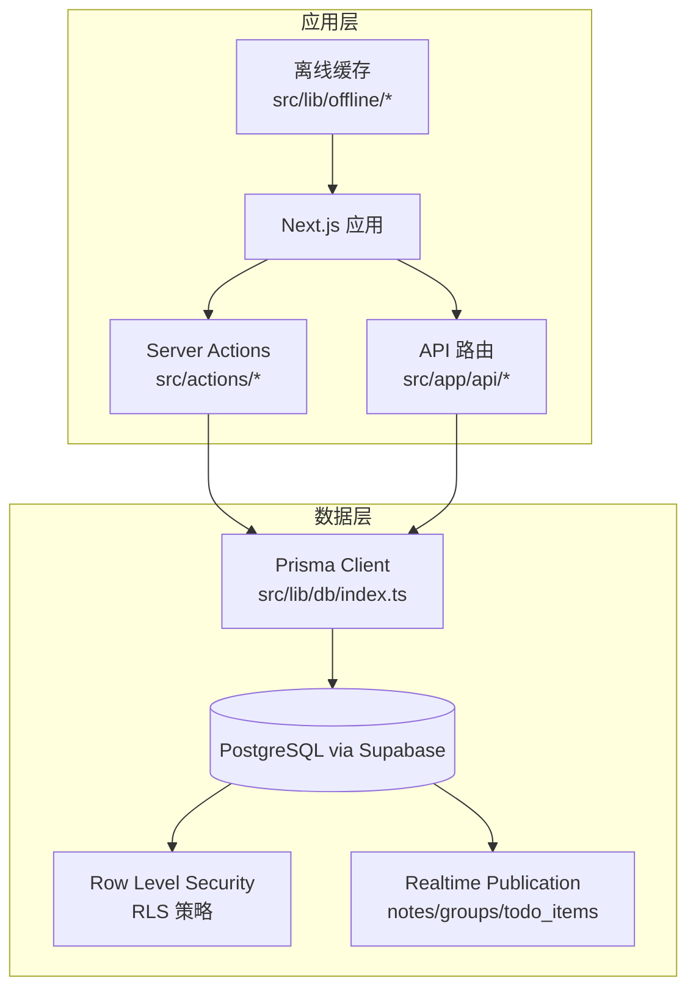
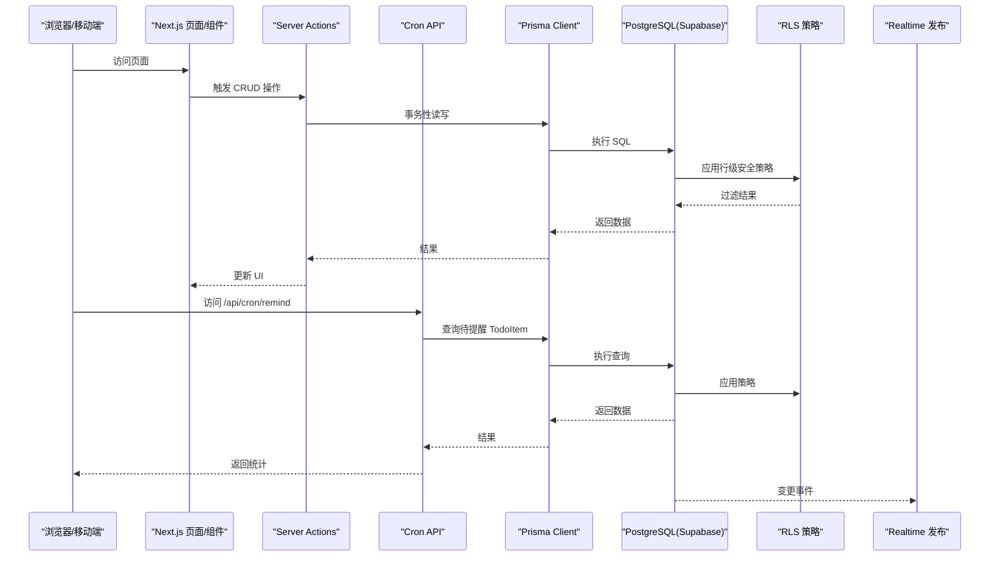
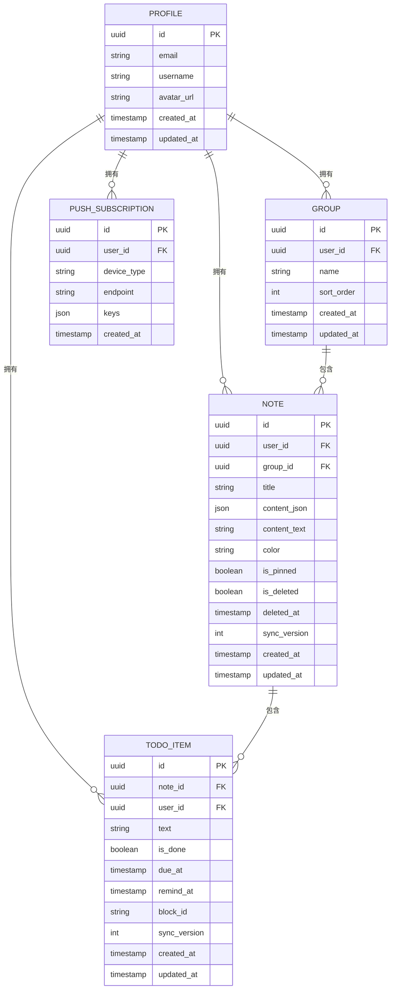
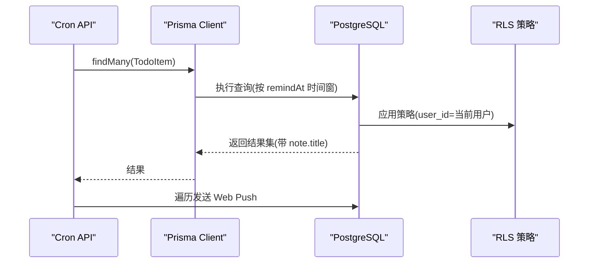
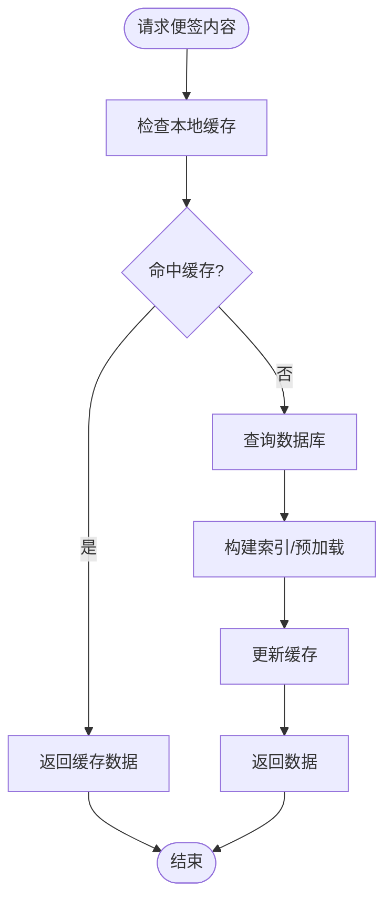
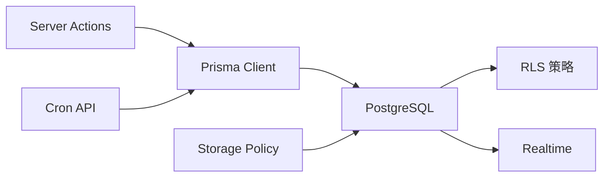

# 性能优化与索引策略

<cite>
**本文引用的文件**
- [prisma/schema.prisma](file://prisma/schema.prisma)
- [src/lib/db/index.ts](file://src/lib/db/index.ts)
- [supabase/migrations/20260513000000_enable_rls_policies.sql](file://supabase/migrations/20260513000000_enable_rls_policies.sql)
- [supabase/migrations/20260513120000_storage_note_images.sql](file://supabase/migrations/20260513120000_storage_note_images.sql)
- [supabase/migrations/20260513140000_realtime_publication.sql](file://supabase/migrations/20260513140000_realtime_publication.sql)
- [src/app/api/cron/remind/route.ts](file://src/app/api/cron/remind/route.ts)
- [src/actions/todos.ts](file://src/actions/todos.ts)
- [src/actions/notes.ts](file://src/actions/notes.ts)
- [src/actions/groups.ts](file://src/actions/groups.ts)
- [src/lib/toto/sync-todo-items-for-note.ts](file://src/lib/toto/sync-todo-items-for-note.ts)
- [src/lib/offline/note-cache.ts](file://src/lib/offline/note-cache.ts)
- [package.json](file://package.json)
</cite>

## 目录
1. [简介](#简介)
2. [项目结构](#项目结构)
3. [核心组件](#核心组件)
4. [架构总览](#架构总览)
5. [详细组件分析](#详细组件分析)
6. [依赖关系分析](#依赖关系分析)
7. [性能考量](#性能考量)
8. [故障排查指南](#故障排查指南)
9. [结论](#结论)
10. [附录](#附录)

## 简介
本文件面向 Smart-Todo 的数据库性能优化与索引策略，结合现有 Prisma Schema、RLS 策略、迁移脚本与关键查询路径，系统性阐述以下主题：
- 数据库查询性能分析方法：慢查询识别、执行计划分析、索引使用情况监控
- 关键索引设计原则与实现策略：复合索引、部分索引、函数索引等
- 查询优化技巧：查询重写、连接优化、分页策略、预加载机制
- 缓存策略：应用层缓存、数据库查询缓存、结果集缓存
- 数据库连接池配置与管理：连接数优化、超时设置、连接复用
- 监控指标：查询响应时间、吞吐量、连接利用率等
- 性能瓶颈识别与解决方案：硬件升级建议、架构优化、数据分片策略

## 项目结构
Smart-Todo 基于 Next.js 16 + Prisma + Supabase Postgres，采用 Prisma Client 作为 ORM，通过 RLS 实现行级访问控制，并在迁移脚本中启用实时发布与存储桶策略。

图表来源
- [src/lib/db/index.ts:1-16](file://src/lib/db/index.ts#L1-L16)
- [prisma/schema.prisma:1-117](file://prisma/schema.prisma#L1-L117)
- [supabase/migrations/20260513000000_enable_rls_policies.sql:1-203](file://supabase/migrations/20260513000000_enable_rls_policies.sql#L1-L203)
- [supabase/migrations/20260513140000_realtime_publication.sql:1-6](file://supabase/migrations/20260513140000_realtime_publication.sql#L1-L6)

章节来源
- [prisma/schema.prisma:1-117](file://prisma/schema.prisma#L1-L117)
- [src/lib/db/index.ts:1-16](file://src/lib/db/index.ts#L1-L16)
- [supabase/migrations/20260513000000_enable_rls_policies.sql:1-203](file://supabase/migrations/20260513000000_enable_rls_policies.sql#L1-L203)
- [supabase/migrations/20260513140000_realtime_publication.sql:1-6](file://supabase/migrations/20260513140000_realtime_publication.sql#L1-L6)

## 核心组件
- 数据模型与索引
  - Profile、Group、Note、TodoItem、PushSubscription 等模型均通过 Prisma 定义主键、外键与索引。
  - 关键索引包括：Group(userId)、Note(userId, isDeleted, isPinned, updatedAt)、Note(groupId)、TodoItem(userId, remindAt)、TodoItem(userId, isDone, dueAt)、TodoItem(noteId)、PushSubscription(userId)、TodoItem 唯一索引(todo_items_note_id_block_id_key)。
- 数据库连接与日志
  - Prisma Client 在开发环境开启 query 日志，生产环境仅记录错误，便于慢查询识别与分析。
- 访问控制
  - RLS 策略确保每张业务表仅返回当前用户的数据，避免跨用户数据泄露。
- 实时发布
  - 将 notes、groups、todo_items 加入 supabase_realtime publication，支持前端订阅变更。
- 关键查询路径
  - Cron 提醒任务按时间窗口扫描 TodoItem 并推送 Web Push。
  - Server Actions 执行事务性更新与对齐 todo_items。

章节来源
- [prisma/schema.prisma:1-117](file://prisma/schema.prisma#L1-L117)
- [src/lib/db/index.ts:1-16](file://src/lib/db/index.ts#L1-L16)
- [supabase/migrations/20260513000000_enable_rls_policies.sql:1-203](file://supabase/migrations/20260513000000_enable_rls_policies.sql#L1-L203)
- [supabase/migrations/20260513140000_realtime_publication.sql:1-6](file://supabase/migrations/20260513140000_realtime_publication.sql#L1-L6)
- [src/app/api/cron/remind/route.ts:1-115](file://src/app/api/cron/remind/route.ts#L1-L115)

## 架构总览
下图展示应用层与数据库层交互的关键路径，以及与 RLS 和实时发布的集成。

图表来源
- [src/actions/todos.ts:1-70](file://src/actions/todos.ts#L1-L70)
- [src/actions/notes.ts:1-230](file://src/actions/notes.ts#L1-L230)
- [src/app/api/cron/remind/route.ts:1-115](file://src/app/api/cron/remind/route.ts#L1-L115)
- [prisma/schema.prisma:1-117](file://prisma/schema.prisma#L1-L117)
- [supabase/migrations/20260513000000_enable_rls_policies.sql:1-203](file://supabase/migrations/20260513000000_enable_rls_policies.sql#L1-L203)
- [supabase/migrations/20260513140000_realtime_publication.sql:1-6](file://supabase/migrations/20260513140000_realtime_publication.sql#L1-L6)

## 详细组件分析

### 数据模型与索引策略
- 模型关系
  - Profile 与 Group/Note/TodoItem/PushSubscription 为一对多关系，均通过 userId 外键关联。
  - Note 与 TodoItem 为一对多关系，通过 noteId 关联。
- 现有索引与覆盖
  - Group(userId)：用于按用户筛选分组。
  - Note(userId, isDeleted, isPinned, updatedAt)：复合索引覆盖“我的便签”列表、置顶排序与时间倒序。
  - Note(groupId)：用于按分组筛选便签。
  - TodoItem(userId, remindAt)：用于定时提醒扫描。
  - TodoItem(userId, isDone, dueAt)：用于待办状态与截止日期查询。
  - TodoItem(noteId)：用于按便签聚合待办。
  - PushSubscription(userId)：用于按用户查找推送订阅。
  - TodoItem 唯一索引(todo_items_note_id_block_id_key)：保证同一便签内 blockId 唯一。
- 设计原则与建议
  - 前缀匹配与选择性：优先将高选择性的列放在前缀位置（如 userId 放在复合索引前）。
  - 聚合查询覆盖：针对高频聚合视图（如“待办聚合”）建立覆盖索引，减少回表。
  - 时间范围扫描：对时间字段建立索引并配合 LIMIT 控制扫描规模。
  - 部分索引：对 isDeleted、isDone 等布尔字段可考虑基于条件的部分索引以减小索引体积。
  - 函数索引：若存在对列进行函数转换的查询（如日期截断），可考虑函数索引提升性能。

图表来源
- [prisma/schema.prisma:1-117](file://prisma/schema.prisma#L1-L117)

章节来源
- [prisma/schema.prisma:1-117](file://prisma/schema.prisma#L1-L117)

### 查询性能分析与执行计划
- 慢查询识别
  - 开发环境启用 Prisma query 日志，观察慢查询与高耗时 SQL。
  - 生产环境关闭 query 日志，通过外部数据库监控工具采集慢查询日志。
- 执行计划分析
  - 使用 EXPLAIN/EXPLAIN ANALYZE 分析关键查询的执行计划，确认是否命中预期索引、是否存在全表扫描或隐式函数转换。
- 索引使用情况监控
  - 通过数据库统计信息与 pg_stat_user_indexes 观察索引使用率，定期清理低效索引。
- 关键查询示例
  - Cron 提醒扫描：按 isDone=false、remindAt 在时间窗口内、note.isDeleted=false 条件查询 TodoItem，并预加载 note 信息，限制数量。
  - 便签内容保存：事务内更新 note 并对齐 todo_items，涉及 deleteMany + upsert 循环。

图表来源
- [src/app/api/cron/remind/route.ts:1-115](file://src/app/api/cron/remind/route.ts#L1-L115)
- [prisma/schema.prisma:1-117](file://prisma/schema.prisma#L1-L117)
- [supabase/migrations/20260513000000_enable_rls_policies.sql:1-203](file://supabase/migrations/20260513000000_enable_rls_policies.sql#L1-L203)

章节来源
- [src/app/api/cron/remind/route.ts:1-115](file://src/app/api/cron/remind/route.ts#L1-L115)
- [src/lib/db/index.ts:1-16](file://src/lib/db/index.ts#L1-L16)

### 查询优化技巧
- 查询重写
  - 将 OR 条件拆分为 UNION，避免隐式函数转换导致索引失效。
  - 对日期范围查询统一使用边界闭合策略，减少索引回表。
- 连接优化
  - 明确指定 JOIN 字段，避免笛卡尔积；对大表先过滤再 JOIN。
  - 使用 exists 子查询替代不必要的 join，降低中间结果集大小。
- 分页策略
  - 使用游标分页（基于唯一且有序列）替代 offset 分页，避免深度偏移带来的性能问题。
- 预加载机制
  - 对需要的关联字段使用 include/select，避免 N+1 查询。
- 事务与批量操作
  - 将多个写操作放入事务，减少锁竞争与提交开销；批量 upsert 使用数据库原生能力。

章节来源
- [src/actions/todos.ts:1-70](file://src/actions/todos.ts#L1-L70)
- [src/actions/notes.ts:1-230](file://src/actions/notes.ts#L1-L230)
- [src/lib/toto/sync-todo-items-for-note.ts:1-59](file://src/lib/toto/sync-todo-items-for-note.ts#L1-L59)

### 缓存策略
- 应用层缓存
  - 使用 localforage 实现离线缓存，存储便签内容与同步版本，减少网络往返与数据库压力。
- 数据库查询缓存
  - 对只读、稳定数据（如颜色枚举、静态字典）可在应用层缓存，避免频繁查询。
- 结果集缓存
  - 对高频聚合视图（如“我的便签”、“待办聚合”）进行短期缓存，结合 revalidatePath 实现一致性。
- 缓存失效策略
  - 基于 syncVersion 或时间戳的版本化缓存，写操作触发失效。

图表来源
- [src/lib/offline/note-cache.ts:1-24](file://src/lib/offline/note-cache.ts#L1-L24)
- [src/actions/notes.ts:1-230](file://src/actions/notes.ts#L1-L230)

章节来源
- [src/lib/offline/note-cache.ts:1-24](file://src/lib/offline/note-cache.ts#L1-L24)
- [src/actions/notes.ts:1-230](file://src/actions/notes.ts#L1-L230)

### 数据库连接池配置与管理
- 连接池参数建议
  - 连接数：根据并发请求数与数据库最大连接数上限设置；生产环境建议与数据库供应商推荐值对齐。
  - 超时：设置合理的连接超时与查询超时，避免长事务占用连接。
  - 连接复用：保持连接生命周期合理，避免频繁创建销毁。
- Prisma 与数据库驱动
  - Prisma Client 默认使用数据库驱动连接池；可通过环境变量调整底层驱动行为。
- 监控与告警
  - 监控连接池利用率、等待时间、活跃连接数，异常时自动扩容或限流。

章节来源
- [src/lib/db/index.ts:1-16](file://src/lib/db/index.ts#L1-L16)
- [package.json:1-86](file://package.json#L1-L86)

### 监控指标与分析
- 查询响应时间
  - 统计 95/99 分位查询耗时，识别慢查询热点。
- 吞吐量
  - QPS/RPS 指标，区分读写比例与峰值时段。
- 连接利用率
  - 连接池使用率、排队等待时间、连接泄漏检测。
- 索引使用率
  - 索引扫描次数、索引选择性、无效索引识别。
- RLS 影响
  - RLS 策略对查询性能的影响评估，必要时通过物化视图或分区表优化。

章节来源
- [src/lib/db/index.ts:1-16](file://src/lib/db/index.ts#L1-L16)
- [supabase/migrations/20260513000000_enable_rls_policies.sql:1-203](file://supabase/migrations/20260513000000_enable_rls_policies.sql#L1-L203)

## 依赖关系分析
- 组件耦合
  - Server Actions 依赖 Prisma Client；Cron API 直接依赖 Prisma Client。
  - RLS 策略影响所有业务查询的可见性与性能。
- 外部依赖
  - Supabase 提供 PostgreSQL、RLS、Realtime 与 Storage。
  - web-push 用于推送通知。
- 潜在循环依赖
  - 当前结构清晰，无明显循环依赖。

图表来源
- [src/actions/todos.ts:1-70](file://src/actions/todos.ts#L1-L70)
- [src/actions/notes.ts:1-230](file://src/actions/notes.ts#L1-L230)
- [src/app/api/cron/remind/route.ts:1-115](file://src/app/api/cron/remind/route.ts#L1-L115)
- [prisma/schema.prisma:1-117](file://prisma/schema.prisma#L1-L117)
- [supabase/migrations/20260513000000_enable_rls_policies.sql:1-203](file://supabase/migrations/20260513000000_enable_rls_policies.sql#L1-L203)
- [supabase/migrations/20260513120000_storage_note_images.sql:1-51](file://supabase/migrations/20260513120000_storage_note_images.sql#L1-L51)
- [supabase/migrations/20260513140000_realtime_publication.sql:1-6](file://supabase/migrations/20260513140000_realtime_publication.sql#L1-L6)

章节来源
- [src/actions/todos.ts:1-70](file://src/actions/todos.ts#L1-L70)
- [src/actions/notes.ts:1-230](file://src/actions/notes.ts#L1-L230)
- [src/app/api/cron/remind/route.ts:1-115](file://src/app/api/cron/remind/route.ts#L1-L115)
- [prisma/schema.prisma:1-117](file://prisma/schema.prisma#L1-L117)
- [supabase/migrations/20260513000000_enable_rls_policies.sql:1-203](file://supabase/migrations/20260513000000_enable_rls_policies.sql#L1-L203)
- [supabase/migrations/20260513120000_storage_note_images.sql:1-51](file://supabase/migrations/20260513120000_storage_note_images.sql#L1-L51)
- [supabase/migrations/20260513140000_realtime_publication.sql:1-6](file://supabase/migrations/20260513140000_realtime_publication.sql#L1-L6)

## 性能考量
- 硬件与实例规格
  - 根据 QPS 与数据库负载选择更高规格的数据库实例，关注 IOPS 与内存。
- 架构优化
  - 引入只读副本或读写分离，将报表类查询路由至只读实例。
  - 使用缓存层（Redis/Cloudflare Workers KV）承载高频只读数据。
- 数据分片策略
  - 按用户 ID 哈希分片，或按时间维度分表，降低单表数据量。
- 索引维护
  - 定期重建碎片化索引，清理未使用索引，平衡写入与查询成本。

## 故障排查指南
- 慢查询定位
  - 开启 Prisma query 日志，结合数据库慢查询日志定位热点 SQL。
- 索引缺失
  - 使用 EXPLAIN 分析执行计划，确认缺少必要索引；补充复合索引或部分索引。
- RLS 影响
  - 若查询变慢，检查 RLS 策略是否引入额外子查询；必要时调整策略或引入物化列。
- 连接池问题
  - 观察连接池饱和与等待时间，调整最大连接数与超时参数。
- Cron 提醒异常
  - 检查时间窗口与 LIMIT 设置，确保索引命中；处理推送失败并清理无效订阅。

章节来源
- [src/lib/db/index.ts:1-16](file://src/lib/db/index.ts#L1-L16)
- [src/app/api/cron/remind/route.ts:1-115](file://src/app/api/cron/remind/route.ts#L1-L115)
- [supabase/migrations/20260513000000_enable_rls_policies.sql:1-203](file://supabase/migrations/20260513000000_enable_rls_policies.sql#L1-L203)

## 结论
Smart-Todo 的数据库层通过 Prisma 与 Supabase Postgres 实现，RLS 确保数据隔离，迁移脚本完善了实时发布与存储策略。围绕现有索引与查询路径，建议重点优化以下方面：
- 针对高频查询补充复合索引与部分索引，减少回表与全表扫描。
- 采用缓存与预加载策略降低数据库压力，结合版本化缓存保证一致性。
- 通过连接池参数与监控指标持续优化数据库资源利用。
- 在高并发场景引入只读副本、缓存层与分片策略，保障系统稳定性与扩展性。

## 附录
- 相关脚本与命令
  - 数据库生成与迁移：见 package.json 中 db:* 脚本。
  - RLS 策略执行：db:rls
  - Storage 策略执行：db:storage
  - Realtime 发布：db:realtime

章节来源
- [package.json:1-86](file://package.json#L1-L86)
- [supabase/migrations/20260513000000_enable_rls_policies.sql:1-203](file://supabase/migrations/20260513000000_enable_rls_policies.sql#L1-L203)
- [supabase/migrations/20260513120000_storage_note_images.sql:1-51](file://supabase/migrations/20260513120000_storage_note_images.sql#L1-L51)
- [supabase/migrations/20260513140000_realtime_publication.sql:1-6](file://supabase/migrations/20260513140000_realtime_publication.sql#L1-L6)