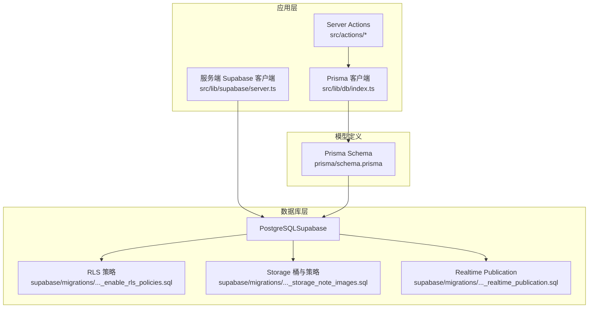
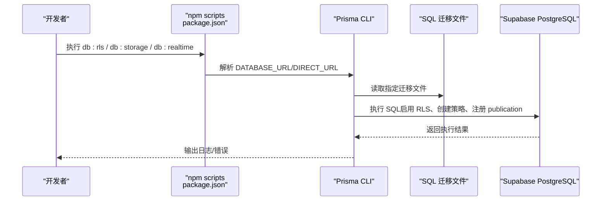
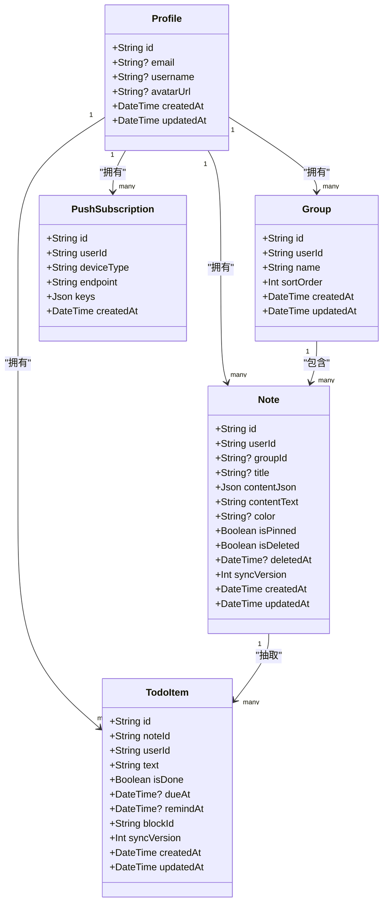
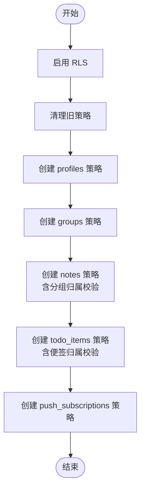
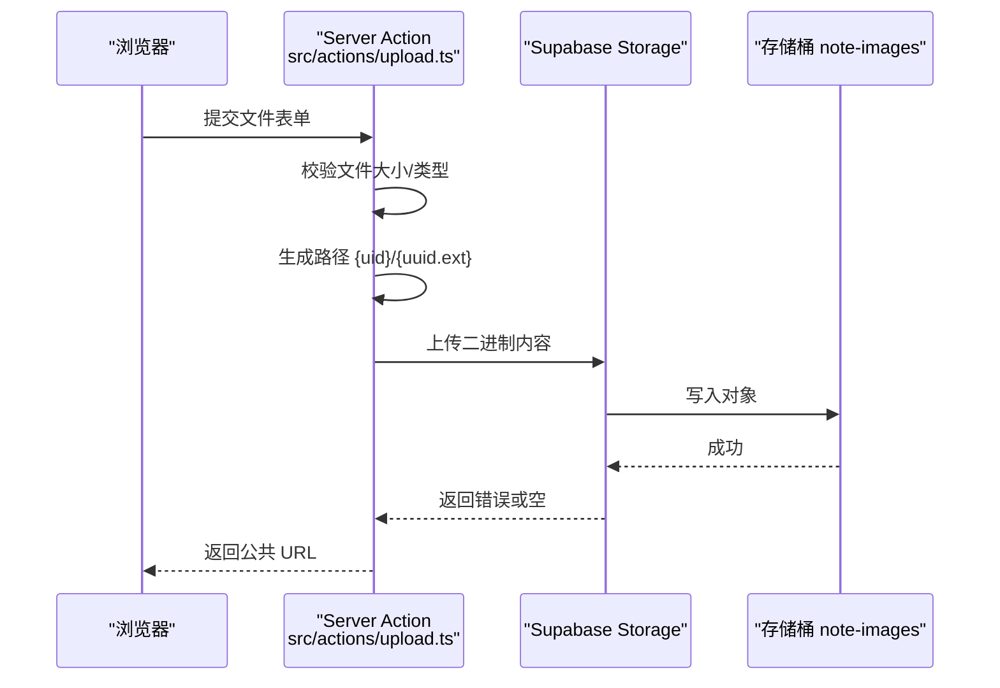
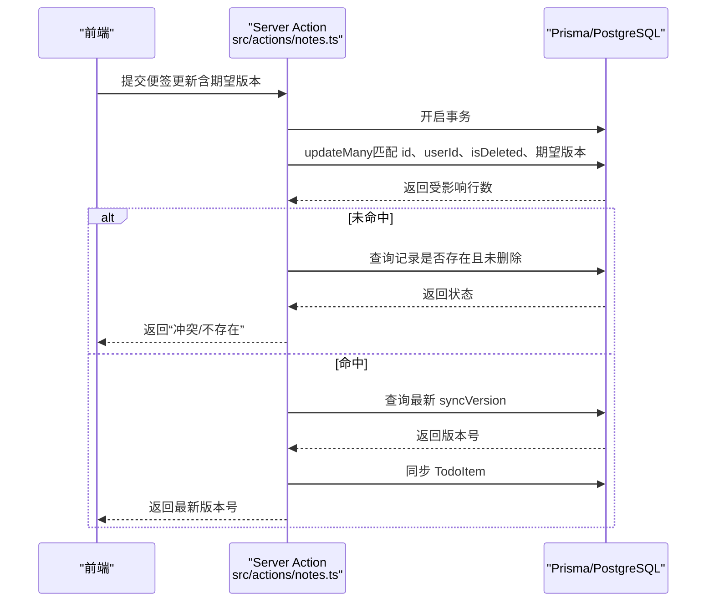
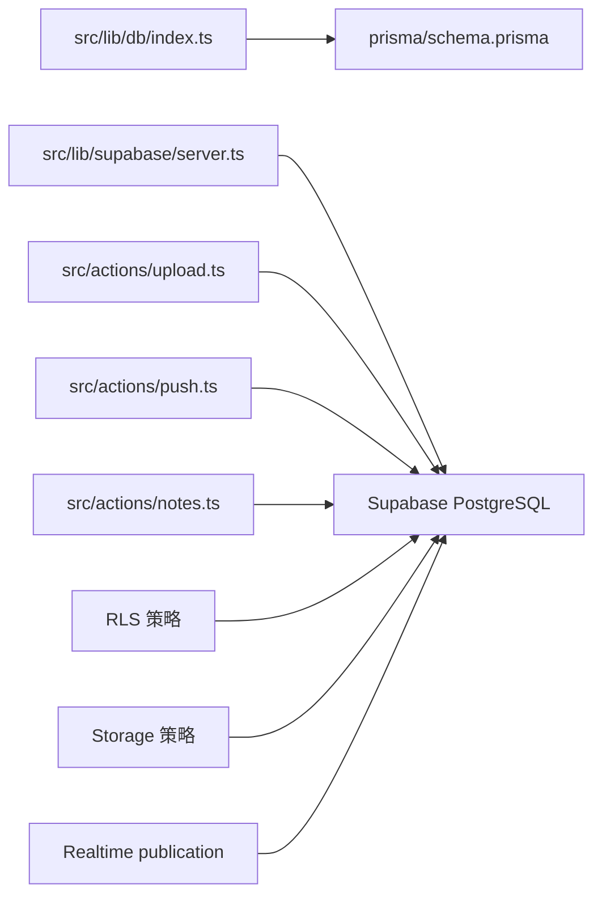

# 数据库设计

<cite>
**本文引用的文件**
- [prisma/schema.prisma](file://prisma/schema.prisma)
- [supabase/migrations/20260513000000_enable_rls_policies.sql](file://supabase/migrations/20260513000000_enable_rls_policies.sql)
- [supabase/migrations/20260513120000_storage_note_images.sql](file://supabase/migrations/20260513120000_storage_note_images.sql)
- [supabase/migrations/20260513140000_realtime_publication.sql](file://supabase/migrations/20260513140000_realtime_publication.sql)
- [src/lib/db/index.ts](file://src/lib/db/index.ts)
- [src/lib/supabase/server.ts](file://src/lib/supabase/server.ts)
- [src/actions/upload.ts](file://src/actions/upload.ts)
- [src/actions/push.ts](file://src/actions/push.ts)
- [src/lib/auth/profile.ts](file://src/lib/auth/profile.ts)
- [src/lib/offline/note-outbox.ts](file://src/lib/offline/note-outbox.ts)
- [src/actions/notes.ts](file://src/actions/notes.ts)
- [package.json](file://package.json)
- [README.md](file://README.md)
</cite>

## 目录
1. [简介](#简介)
2. [项目结构](#项目结构)
3. [核心组件](#核心组件)
4. [架构总览](#架构总览)
5. [详细组件分析](#详细组件分析)
6. [依赖关系分析](#依赖关系分析)
7. [性能考虑](#性能考虑)
8. [故障排查指南](#故障排查指南)
9. [结论](#结论)
10. [附录](#附录)

## 简介
本文件面向 Smart-Todo 的数据库设计，围绕 Prisma 模型、Supabase 行级安全（RLS）、Storage 配置、迁移策略与版本控制、索引与查询优化、监控与维护等方面进行系统化说明。文档同时给出可视化图示与最佳实践建议，帮助开发者在保证数据隔离与性能的前提下高效迭代。

## 项目结构
Smart-Todo 的数据库层由以下部分组成：
- Prisma 模型定义：统一描述用户、分组、便签、待办事项、推送订阅等核心实体及其关系。
- Supabase 迁移：RLS 策略、Storage 桶与策略、Realtime publication 注册等。
- 应用侧数据库访问：Prisma 客户端封装、服务端 Supabase 客户端、Server Actions。
- 运维脚本：通过 npm scripts 统一执行 Prisma 与 SQL 迁移。

图表来源
- [src/lib/db/index.ts:1-16](file://src/lib/db/index.ts#L1-L16)
- [src/lib/supabase/server.ts:1-29](file://src/lib/supabase/server.ts#L1-L29)
- [prisma/schema.prisma:1-117](file://prisma/schema.prisma#L1-L117)
- [supabase/migrations/20260513000000_enable_rls_policies.sql:1-203](file://supabase/migrations/20260513000000_enable_rls_policies.sql#L1-L203)
- [supabase/migrations/20260513120000_storage_note_images.sql:1-51](file://supabase/migrations/20260513120000_storage_note_images.sql#L1-L51)
- [supabase/migrations/20260513140000_realtime_publication.sql:1-7](file://supabase/migrations/20260513140000_realtime_publication.sql#L1-L7)

章节来源
- [prisma/schema.prisma:1-117](file://prisma/schema.prisma#L1-L117)
- [package.json:6-21](file://package.json#L6-L21)

## 核心组件
本节聚焦于数据库模型与关系，以及与之配套的索引与约束。

- 用户档案（Profile）
  - 与 Supabase Auth 的用户主键一对一关联，承载业务侧头像、用户名等信息。
  - 外键关联：groups、notes、todoItems、pushSubscriptions。
- 分组（Group）
  - 属于单个用户，支持排序字段；软删除/归档可通过外键级联处理。
  - 索引：按 userId 建立索引，支撑用户维度查询。
- 便签（Note）
  - 内容采用 Tiptap JSON 结构，同时维护纯文本快照用于全文检索。
  - 支持置顶、删除标记、同步版本号（LWW 冲突解决）。
  - 索引：复合索引覆盖用户+状态+更新时间，以及按分组索引。
- 待办项（TodoItem）
  - 从便签 JSON 抽取，便于聚合视图与提醒查询。
  - 约束：noteId+blockId 唯一，确保同一便签内块级唯一。
  - 索引：用户+提醒时间、用户+完成状态+截止时间、按 noteId。
- 推送订阅（PushSubscription）
  - 支持 Web Push 与移动端（Android）订阅，按 endpoint 去重。
  - 索引：按 userId。

章节来源
- [prisma/schema.prisma:15-117](file://prisma/schema.prisma#L15-L117)

## 架构总览
下图展示数据库层与应用层交互，以及迁移脚本如何将策略与配置注入数据库。

图表来源
- [package.json:13-19](file://package.json#L13-L19)
- [supabase/migrations/20260513000000_enable_rls_policies.sql:1-203](file://supabase/migrations/20260513000000_enable_rls_policies.sql#L1-L203)
- [supabase/migrations/20260513120000_storage_note_images.sql:1-51](file://supabase/migrations/20260513120000_storage_note_images.sql#L1-L51)
- [supabase/migrations/20260513140000_realtime_publication.sql:1-7](file://supabase/migrations/20260513140000_realtime_publication.sql#L1-L7)

## 详细组件分析

### 数据模型类图

图表来源
- [prisma/schema.prisma:15-117](file://prisma/schema.prisma#L15-L117)

章节来源
- [prisma/schema.prisma:15-117](file://prisma/schema.prisma#L15-L117)

### 行级安全（RLS）策略
- 启用范围：public.* 中与业务相关的表均启用 RLS。
- 策略原则：所有操作均基于 auth.uid() 与表中的 user_id 字段进行访问控制。
- 特殊约束：
  - notes.insert/update：当 group_id 非空时，要求该分组必须属于当前用户。
  - todo_items：插入/更新时，要求所属 note 也必须属于当前用户。
- 可重复执行：迁移脚本先清理旧策略，再创建新策略，便于回滚与重试。

图表来源
- [supabase/migrations/20260513000000_enable_rls_policies.sql:34-203](file://supabase/migrations/20260513000000_enable_rls_policies.sql#L34-L203)

章节来源
- [supabase/migrations/20260513000000_enable_rls_policies.sql:1-203](file://supabase/migrations/20260513000000_enable_rls_policies.sql#L1-L203)

### Supabase Storage 配置与使用
- 存储桶：note-images，公开访问，限制单文件大小与 MIME 类型。
- 路径约定：{auth.uid()}/{uuid}.{ext}，确保用户隔离。
- 策略：select 公开可见，insert/update/delete 仅限路径第一段为当前用户 uid。
- 应用集成：Server Action 读取用户会话，构造路径并上传，随后生成公开 URL。

图表来源
- [src/actions/upload.ts:1-38](file://src/actions/upload.ts#L1-L38)
- [supabase/migrations/20260513120000_storage_note_images.sql:4-50](file://supabase/migrations/20260513120000_storage_note_images.sql#L4-L50)

章节来源
- [src/actions/upload.ts:1-38](file://src/actions/upload.ts#L1-L38)
- [supabase/migrations/20260513120000_storage_note_images.sql:1-51](file://supabase/migrations/20260513120000_storage_note_images.sql#L1-L51)

### 实时发布（Realtime）与订阅
- 将 notes、groups、todo_items 表加入 supabase_realtime publication，以便客户端通过 postgres_changes 订阅变更。
- 若表已在 publication 中，ALTER 会报错，可忽略并在 Dashboard 校验勾选状态。

章节来源
- [supabase/migrations/20260513140000_realtime_publication.sql:1-7](file://supabase/migrations/20260513140000_realtime_publication.sql#L1-L7)

### 数据库迁移与版本控制
- Prisma 迁移：通过 schema.prisma 描述模型，使用 migrate dev 箉生迁移文件；db:generate 生成客户端。
- 手写 SQL 迁移：RLS、Storage、Realtime 等通过独立 SQL 文件管理，配合 npm scripts 统一执行。
- 环境变量：DATABASE_URL、DIRECT_URL 由 Supabase 提供，用于连接与直连角色。
- 执行流程：npm run db:rls / db:storage / db:realtime 分别执行对应 SQL 文件。

章节来源
- [package.json:12-19](file://package.json#L12-L19)
- [README.md:63-114](file://README.md#L63-L114)

### 同步与冲突处理
- 便签同步版本号（syncVersion）用于 LWW 冲突解决；Server Action 在事务中更新并返回最新版本号。
- 离线重放队列：note-outbox 顺序重放本地待提交变更，遇到冲突或错误时分别处理。

图表来源
- [src/actions/notes.ts:79-126](file://src/actions/notes.ts#L79-L126)

章节来源
- [src/actions/notes.ts:79-126](file://src/actions/notes.ts#L79-L126)
- [src/lib/offline/note-outbox.ts:43-86](file://src/lib/offline/note-outbox.ts#L43-L86)

### 推送订阅持久化
- Web Push 订阅以 endpoint 为幂等键 upsert，keys 字段保存 p256dh 与 auth。
- 删除订阅时按 userId+endpoint 删除。

章节来源
- [src/actions/push.ts:12-61](file://src/actions/push.ts#L12-L61)
- [prisma/schema.prisma:102-116](file://prisma/schema.prisma#L102-L116)

## 依赖关系分析
- 应用对数据库的依赖
  - Prisma 客户端：集中于 src/lib/db/index.ts，全局单例避免重复实例化。
  - 服务端 Supabase 客户端：封装 cookie 会话刷新与认证上下文。
  - Server Actions：封装业务操作（上传、推送订阅、便签同步）。
- 数据库对策略的依赖
  - RLS 策略依赖 auth.uid() 与表字段一致性。
  - Storage 策略依赖路径约定与 bucket_id。
  - Realtime 依赖 publication 中的表注册。

图表来源
- [src/lib/db/index.ts:1-16](file://src/lib/db/index.ts#L1-L16)
- [src/lib/supabase/server.ts:1-29](file://src/lib/supabase/server.ts#L1-L29)
- [src/actions/upload.ts:1-38](file://src/actions/upload.ts#L1-L38)
- [src/actions/push.ts:12-61](file://src/actions/push.ts#L12-L61)
- [src/actions/notes.ts:79-126](file://src/actions/notes.ts#L79-L126)
- [supabase/migrations/20260513000000_enable_rls_policies.sql:34-203](file://supabase/migrations/20260513000000_enable_rls_policies.sql#L34-L203)
- [supabase/migrations/20260513120000_storage_note_images.sql:4-50](file://supabase/migrations/20260513120000_storage_note_images.sql#L4-L50)
- [supabase/migrations/20260513140000_realtime_publication.sql:4-6](file://supabase/migrations/20260513140000_realtime_publication.sql#L4-L6)

章节来源
- [src/lib/db/index.ts:1-16](file://src/lib/db/index.ts#L1-L16)
- [src/lib/supabase/server.ts:1-29](file://src/lib/supabase/server.ts#L1-L29)
- [src/actions/upload.ts:1-38](file://src/actions/upload.ts#L1-L38)
- [src/actions/push.ts:12-61](file://src/actions/push.ts#L12-L61)
- [src/actions/notes.ts:79-126](file://src/actions/notes.ts#L79-L126)
- [supabase/migrations/20260513000000_enable_rls_policies.sql:1-203](file://supabase/migrations/20260513000000_enable_rls_policies.sql#L1-L203)
- [supabase/migrations/20260513120000_storage_note_images.sql:1-51](file://supabase/migrations/20260513120000_storage_note_images.sql#L1-L51)
- [supabase/migrations/20260513140000_realtime_publication.sql:1-7](file://supabase/migrations/20260513140000_realtime_publication.sql#L1-L7)

## 性能考虑
- 索引设计
  - Notes：复合索引覆盖用户+删除标记+置顶+更新时间，适合按用户拉取列表与排序。
  - Notes：按 groupId 建立索引，支持分组筛选。
  - TodoItems：用户+提醒时间、用户+完成状态+截止时间、按 noteId，满足提醒扫描与聚合视图。
  - Groups：按 userId 建立索引，支撑用户维度查询。
  - PushSubscriptions：按 userId 建立索引，支撑订阅管理。
- 查询优化
  - 优先使用带用户过滤的条件，避免全表扫描。
  - 对高频查询（如便签列表、待办提醒）尽量利用现有复合索引。
- 缓存策略
  - 前端可结合 React Query 缓存与乐观更新，减少数据库压力。
  - Storage 对象 URL 可短期缓存于 CDN，降低重复访问成本。
- 直连与代理
  - 服务端 Prisma 使用 DIRECT_URL，绕过 RLS 限制，适合后台任务与批量操作。
- 离线与冲突
  - 利用 syncVersion 与 outbox 重放机制，降低并发写入冲突概率。

章节来源
- [prisma/schema.prisma:44-46](file://prisma/schema.prisma#L44-L46)
- [prisma/schema.prisma:72-75](file://prisma/schema.prisma#L72-L75)
- [prisma/schema.prisma:95-99](file://prisma/schema.prisma#L95-L99)
- [prisma/schema.prisma:113-115](file://prisma/schema.prisma#L113-L115)

## 故障排查指南
- RLS 策略问题
  - 症状：匿名/跨用户访问被拒绝。
  - 排查：确认使用已登录用户的 JWT；检查 auth.uid() 是否与表 user_id 匹配；确认策略是否已创建。
- Storage 上传失败
  - 症状：上传报错或无法生成公开 URL。
  - 排查：确认 bucket 名称与策略；检查路径是否为 {uid}/{uuid.ext}；验证文件大小与 MIME 类型限制。
- Realtime 不生效
  - 症状：客户端无法收到 postgres_changes 事件。
  - 排查：确认 publication 中已注册相应表；确认 Realtime 已启用；检查客户端连接参数。
- 同步冲突
  - 症状：更新返回“冲突”或“便签不存在/已删除”。
  - 排查：核对期望 syncVersion；确认笔记未被删除；必要时重放 outbox。
- 会话与 Cookie
  - 症状：access_token 过期导致鉴权失败。
  - 排查：确认中间件已刷新 Supabase 会话；检查环境变量配置。

章节来源
- [supabase/migrations/20260513000000_enable_rls_policies.sql:34-203](file://supabase/migrations/20260513000000_enable_rls_policies.sql#L34-L203)
- [supabase/migrations/20260513120000_storage_note_images.sql:4-50](file://supabase/migrations/20260513120000_storage_note_images.sql#L4-L50)
- [supabase/migrations/20260513140000_realtime_publication.sql:1-7](file://supabase/migrations/20260513140000_realtime_publication.sql#L1-L7)
- [src/lib/supabase/server.ts:15-51](file://src/lib/supabase/server.ts#L15-L51)
- [src/actions/notes.ts:79-126](file://src/actions/notes.ts#L79-L126)
- [src/lib/offline/note-outbox.ts:43-86](file://src/lib/offline/note-outbox.ts#L43-L86)

## 结论
Smart-Todo 的数据库设计以 Prisma 模型为核心，结合 Supabase 的 RLS、Storage 与 Realtime 能力，实现了用户隔离、文件管理与实时同步。通过明确的索引策略与迁移脚本，项目在开发与运维层面具备良好的可维护性与扩展性。建议在后续迭代中持续关注查询模式与热点数据，进一步完善缓存与批处理策略。

## 附录
- 运维命令速查
  - 生成 Prisma 客户端：npm run db:generate
  - 推送 Prisma 模型到数据库：npm run db:push
  - 应用 RLS 策略：npm run db:rls
  - 初始化 Storage 桶与策略：npm run db:storage
  - 注册 Realtime publication：npm run db:realtime
- 最佳实践
  - 保持 schema.prisma 与 SQL 迁移文件的版本一致性。
  - 在生产环境使用 DIRECT_URL 进行后台任务，避免 RLS 干扰。
  - 对高频查询建立复合索引，并定期审查执行计划。
  - 使用 outbox 与 syncVersion 保障离线与并发场景下的数据一致性。

章节来源
- [package.json:12-19](file://package.json#L12-L19)
- [README.md:63-114](file://README.md#L63-L114)