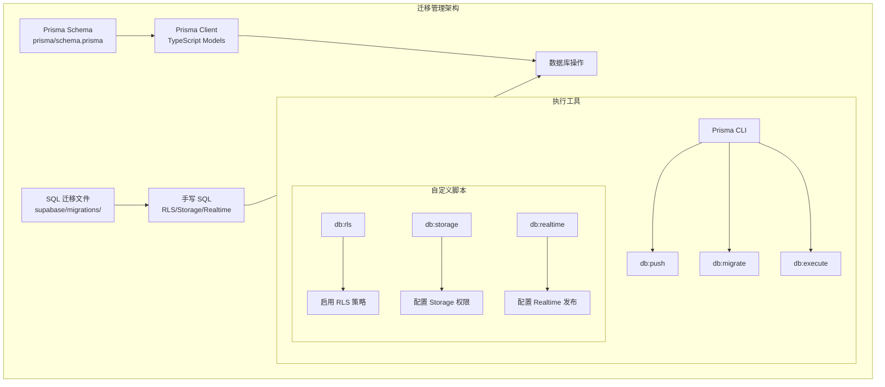
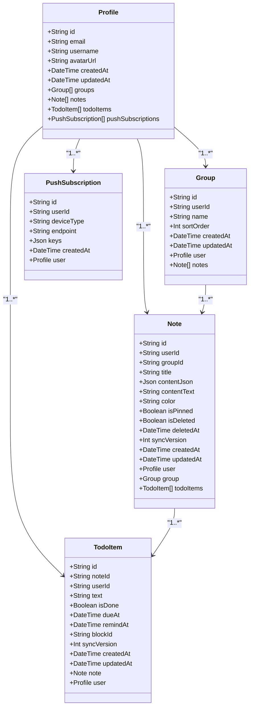
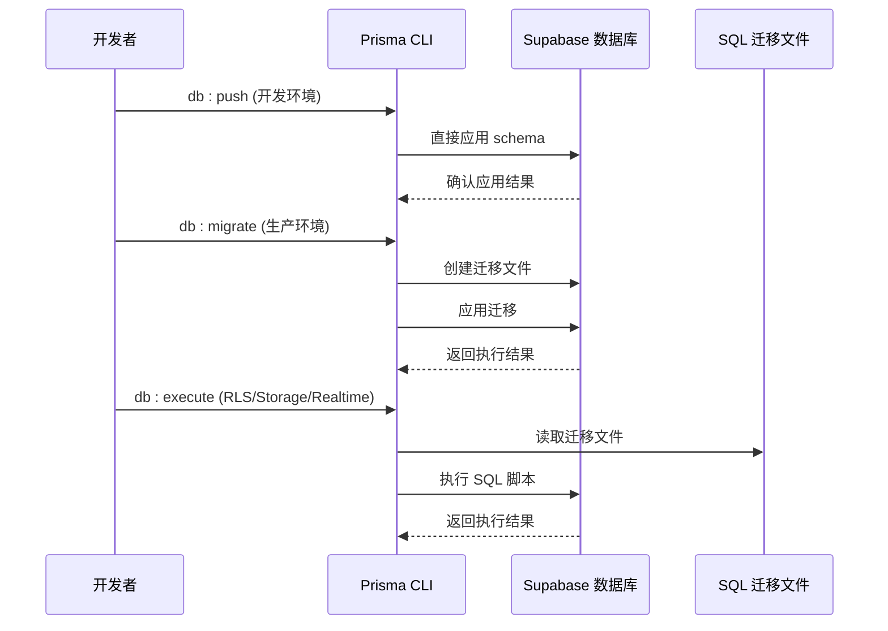
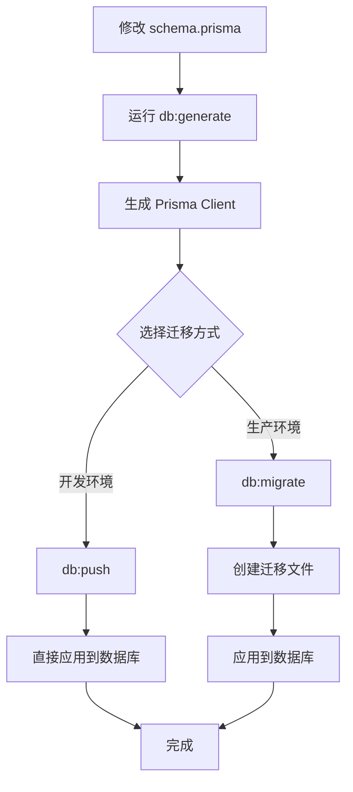
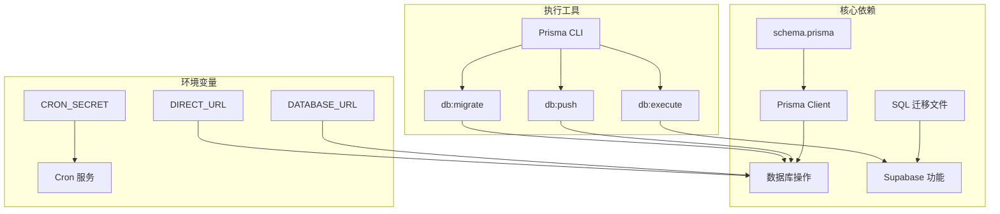
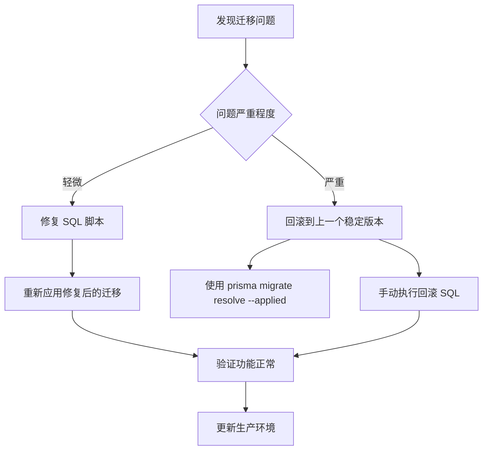

# 数据库迁移管理

<cite>
**本文档引用的文件**
- [schema.prisma](file://prisma/schema.prisma)
- [20260513000000_enable_rls_policies.sql](file://supabase/migrations/20260513000000_enable_rls_policies.sql)
- [20260513120000_storage_note_images.sql](file://supabase/migrations/20260513120000_storage_note_images.sql)
- [20260513140000_realtime_publication.sql](file://supabase/migrations/20260513140000_realtime_publication.sql)
- [package.json](file://package.json)
- [README.md](file://README.md)
- [index.ts](file://src/lib/db/index.ts)
</cite>

## 目录
1. [简介](#简介)
2. [项目结构](#项目结构)
3. [核心组件](#核心组件)
4. [架构概览](#架构概览)
5. [详细组件分析](#详细组件分析)
6. [依赖关系分析](#依赖关系分析)
7. [性能考虑](#性能考虑)
8. [故障排除指南](#故障排除指南)
9. [结论](#结论)

## 简介

Smart-Todo 是一个基于 Next.js 16 和 Supabase 的便签 + 待办应用，采用 Prisma 作为 ORM 工具进行数据库操作。该项目实现了两种主要的数据库迁移管理策略：

1. **Prisma 迁移管理**：使用 Prisma Migrate 工具进行数据库结构变更
2. **Supabase 手写 SQL 迁移**：针对 RLS 策略、Storage 权限和 Realtime 发布配置的专用 SQL 迁移

本文档深入解释了这两种迁移管理方式的工作原理、最佳实践和执行流程。

## 项目结构

Smart-Todo 项目的数据库迁移管理采用分层架构，清晰分离了不同类型的迁移策略：



**图表来源**
- [schema.prisma:1-117](file://prisma/schema.prisma#L1-L117)
- [package.json:6-21](file://package.json#L6-L21)

**章节来源**
- [schema.prisma:1-117](file://prisma/schema.prisma#L1-L117)
- [package.json:6-21](file://package.json#L6-L21)

## 核心组件

### Prisma 数据模型

项目使用 Prisma 定义了完整的数据模型，包括用户资料、分组、便签、待办项和推送订阅等核心实体。



**图表来源**
- [schema.prisma:16-116](file://prisma/schema.prisma#L16-L116)

### 数据库连接管理

项目使用全局单例模式管理 Prisma 客户端连接，确保在开发和生产环境中的一致性。

**章节来源**
- [schema.prisma:16-116](file://prisma/schema.prisma#L16-L116)
- [index.ts:1-16](file://src/lib/db/index.ts#L1-L16)

## 架构概览

Smart-Todo 的数据库迁移管理架构采用了混合策略，结合了 Prisma 的现代化迁移工具和 Supabase 的原生功能配置：



**图表来源**
- [package.json:12-19](file://package.json#L12-L19)
- [README.md:72-113](file://README.md#L72-L113)

## 详细组件分析

### Prisma 迁移管理

#### 数据模型设计

项目的数据模型遵循以下设计原则：

1. **UUID 主键**：所有表都使用 UUID 作为主键，避免序列号暴露业务信息
2. **软删除支持**：便签表支持软删除，通过 `is_deleted` 和 `deleted_at` 字段实现
3. **同步版本控制**：通过 `sync_version` 字段支持并发冲突解决
4. **索引优化**：为常用查询字段建立复合索引，提升查询性能

#### 迁移文件生成流程



**图表来源**
- [package.json:12-14](file://package.json#L12-L14)
- [README.md:72-76](file://README.md#L72-L76)

#### 索引策略分析

项目为关键查询建立了优化的索引策略：

| 表名 | 索引字段 | 查询用途 | 性能影响 |
|------|----------|----------|----------|
| groups | userId | 用户分组查询 | O(log n) |
| notes | userId, isDeleted, isPinned, updatedAt | 便签列表查询 | O(log n) |
| notes | groupId | 分组内便签查询 | O(log n) |
| todo_items | userId, remindAt | 提醒查询 | O(log n) |
| todo_items | userId, isDone, dueAt | 待办统计查询 | O(log n) |
| todo_items | noteId | 便签关联查询 | O(log n) |
| push_subscriptions | userId | 用户推送查询 | O(log n) |

**章节来源**
- [schema.prisma:44-98](file://prisma/schema.prisma#L44-L98)

### Supabase 手写 SQL 迁移

#### RLS 策略配置

项目实现了完整的行级安全（RLS）策略，确保每个用户只能访问自己的数据：

```mermaid
flowchart TD
A[启用 RLS] --> B[为每个表创建策略]
B --> C[profiles 表策略]
C --> D[SELECT: id = auth.uid()]
C --> E[INSERT: id = auth.uid()]
C --> F[UPDATE: id = auth.uid()]
C --> G[DELETE: id = auth.uid()]
B --> H[groups 表策略]
H --> I[SELECT: user_id = auth.uid()]
H --> J[INSERT: user_id = auth.uid()]
H --> K[UPDATE: user_id = auth.uid()]
H --> L[DELETE: user_id = auth.uid()]
B --> M[notes 表策略]
M --> N[SELECT: user_id = auth.uid()]
M --> O[INSERT: user_id = auth.uid() AND group_id IS NULL OR EXISTS]
M --> P[UPDATE: user_id = auth.uid() AND group_id IS NULL OR EXISTS]
M --> Q[DELETE: user_id = auth.uid()]
B --> R[todo_items 表策略]
R --> S[SELECT: user_id = auth.uid() AND EXISTS(n.user_id = auth.uid())]
R --> T[INSERT: user_id = auth.uid() AND EXISTS(n.user_id = auth.uid())]
R --> U[UPDATE: user_id = auth.uid() AND EXISTS(n.user_id = auth.uid())]
R --> V[DELETE: user_id = auth.uid() AND EXISTS(n.user_id = auth.uid())]
B --> W[push_subscriptions 表策略]
W --> X[SELECT: user_id = auth.uid()]
W --> Y[INSERT: user_id = auth.uid()]
W --> Z[UPDATE: user_id = auth.uid()]
W --> AA[DELETE: user_id = auth.uid()]
```

**图表来源**
- [20260513000000_enable_rls_policies.sql:36-203](file://supabase/migrations/20260513000000_enable_rls_policies.sql#L36-L203)

#### Storage 权限设置

项目配置了专门的便签图片存储桶，支持用户私有文件存储：

```mermaid
sequenceDiagram
participant Admin as 管理员
participant SQL as SQL 脚本
participant Storage as Storage 服务
participant Bucket as note-images 桶
Admin->>SQL : 执行 storage 迁移
SQL->>Storage : INSERT/UPDATE 桶配置
SQL->>Storage : DROP 旧策略
SQL->>Storage : CREATE 新策略
Storage->>Bucket : 创建存储桶
Bucket-->>Storage : 返回配置结果
Note[路径约定：<auth.uid()>/<filename>]
```

**图表来源**
- [20260513120000_storage_note_images.sql:4-51](file://supabase/migrations/20260513120000_storage_note_images.sql#L4-L51)

#### Realtime 发布配置

项目将核心业务表加入 Supabase Realtime 的发布配置，支持实时数据同步：

**章节来源**
- [20260513140000_realtime_publication.sql:1-7](file://supabase/migrations/20260513140000_realtime_publication.sql#L1-L7)

### 迁移执行脚本

项目提供了完整的迁移执行脚本，支持不同的环境和场景：

| 脚本名称 | 功能描述 | 使用场景 | 参数 |
|----------|----------|----------|------|
| db:generate | 生成 Prisma Client | 开发环境 | 无 |
| db:push | 直接应用 schema | 开发环境 | 无 |
| db:migrate | 创建并应用迁移 | 生产环境 | 无 |
| db:studio | 打开 Prisma Studio | 开发调试 | 无 |
| db:reset | 重置数据库 | 开发环境 | 无 |
| db:rls | 启用 RLS 策略 | 初始化/重置 | 无 |
| db:storage | 配置 Storage 权限 | 初始化/重置 | 无 |
| db:realtime | 配置 Realtime 发布 | 初始化/重置 | 无 |

**章节来源**
- [package.json:12-19](file://package.json#L12-L19)
- [README.md:142-159](file://README.md#L142-L159)

## 依赖关系分析

### 组件耦合度分析



**图表来源**
- [schema.prisma:9-13](file://prisma/schema.prisma#L9-L13)
- [package.json:12-19](file://package.json#L12-L19)

### 外部依赖管理

项目对外部依赖的管理遵循以下原则：

1. **Prisma 版本控制**：固定使用特定版本的 Prisma CLI
2. **Supabase 集成**：通过环境变量配置数据库连接
3. **TypeScript 支持**：Prisma 作为开发依赖，确保类型安全

**章节来源**
- [package.json:22-85](file://package.json#L22-L85)

## 性能考虑

### 查询性能优化

项目通过以下策略优化数据库查询性能：

1. **索引策略**：为高频查询字段建立复合索引
2. **查询优化**：使用适当的 WHERE 条件和 JOIN 操作
3. **缓存策略**：结合前端缓存减少数据库查询次数

### 迁移性能考虑

1. **增量迁移**：生产环境使用增量迁移，避免全量重建
2. **批处理操作**：对于大量数据的迁移，考虑分批处理
3. **监控指标**：监控迁移过程中的数据库性能指标

## 故障排除指南

### 常见迁移问题

#### RLS 策略冲突

**问题描述**：RLS 策略配置冲突导致数据访问异常

**解决方案**：
1. 检查用户 ID 与 auth.uid() 的匹配关系
2. 验证外键约束是否正确
3. 确认策略的优先级顺序

#### Storage 权限问题

**问题描述**：用户无法访问自己的文件或上传失败

**解决方案**：
1. 验证存储桶路径格式：`{auth.uid()}/{filename}`
2. 检查 MIME 类型限制
3. 确认文件大小限制设置

#### Realtime 同步问题

**问题描述**：实时数据同步不生效

**解决方案**：
1. 确认 Supabase Realtime 服务已启用
2. 验证表是否已加入 `supabase_realtime` 发布
3. 检查客户端连接状态

### 迁移回滚策略



### 备份策略

1. **定期备份**：生产环境应定期备份数据库
2. **版本控制**：所有迁移文件纳入版本控制
3. **测试环境验证**：在测试环境充分验证后再部署到生产

**章节来源**
- [README.md:78-113](file://README.md#L78-L113)

## 结论

Smart-Todo 项目的数据库迁移管理采用了现代化的混合策略，结合了 Prisma 的自动化迁移工具和 Supabase 的原生功能配置。这种设计既保证了开发效率，又确保了生产环境的稳定性。

### 主要优势

1. **灵活性**：支持多种迁移策略，适应不同场景需求
2. **安全性**：完善的 RLS 策略确保数据安全
3. **可维护性**：清晰的脚本组织和文档说明
4. **性能优化**：合理的索引策略和查询优化

### 最佳实践建议

1. **开发环境**：使用 `db:push` 进行快速迭代
2. **生产环境**：使用 `db:migrate` 进行受控部署
3. **安全配置**：定期审查和更新 RLS 策略
4. **监控告警**：建立迁移过程的监控和告警机制

通过遵循这些实践，可以确保数据库迁移管理的高效性和可靠性，为 Smart-Todo 应用的长期发展奠定坚实基础。