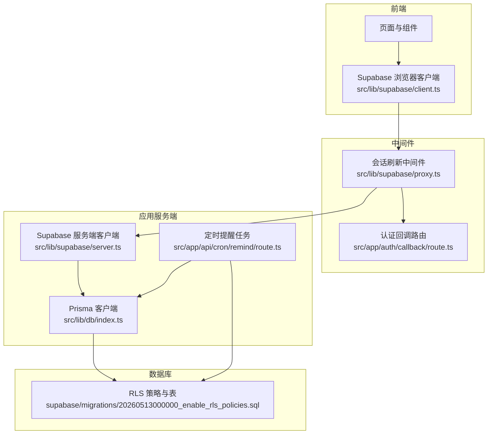
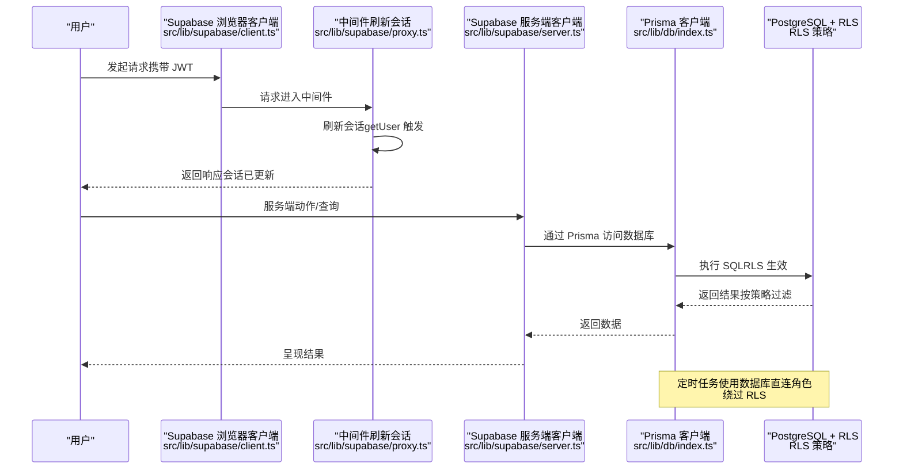
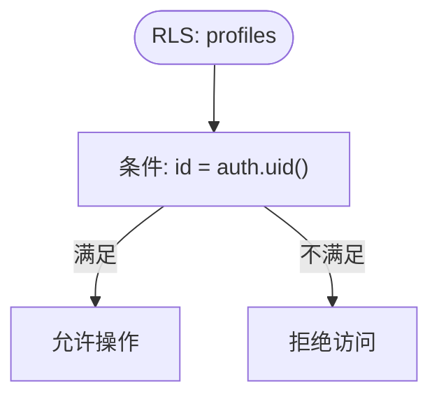
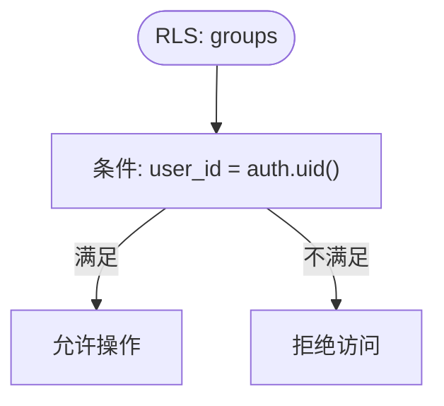
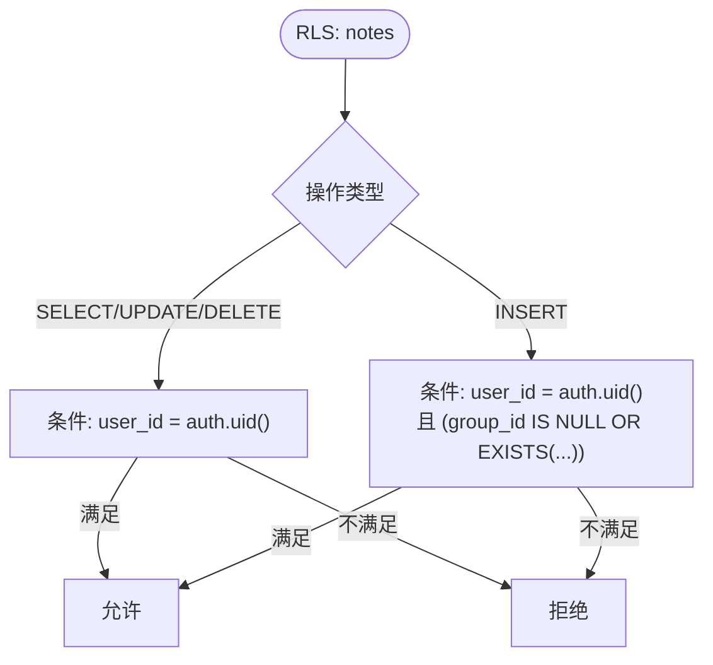
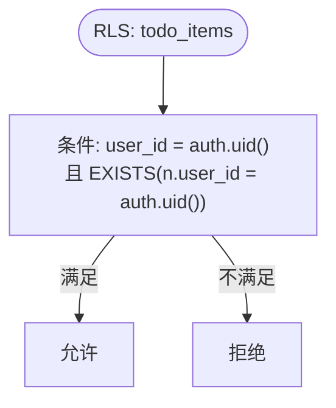
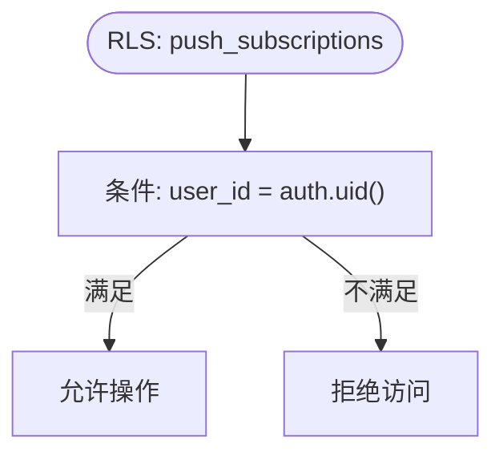
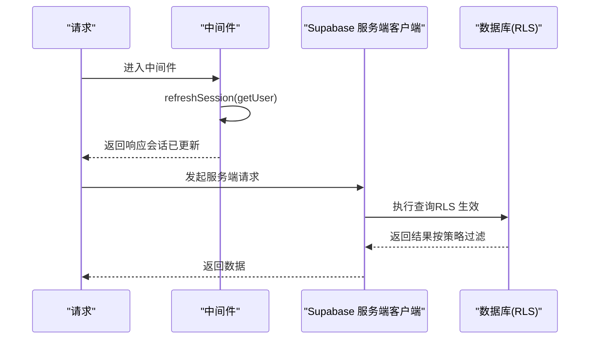
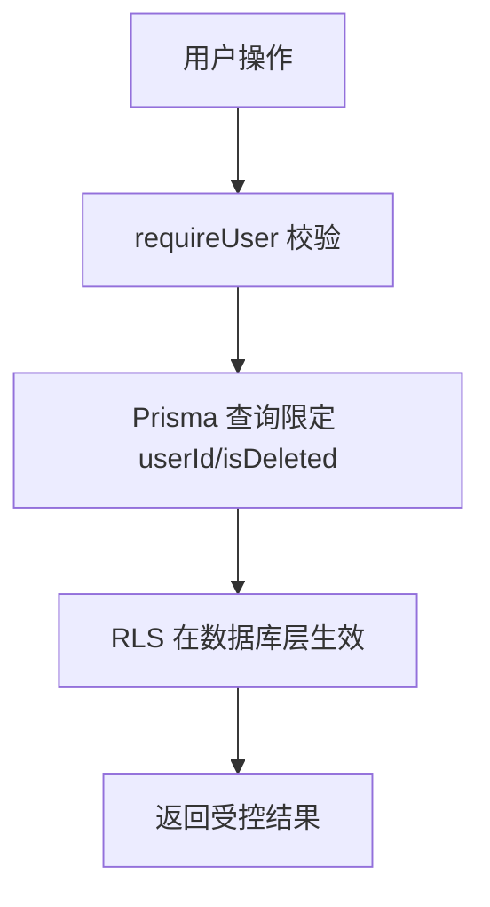
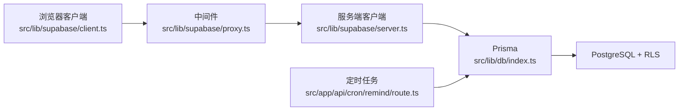

# 行级安全策略

<cite>
**本文引用的文件**
- [20260513000000_enable_rls_policies.sql](file://supabase/migrations/20260513000000_enable_rls_policies.sql)
- [schema.prisma](file://prisma/schema.prisma)
- [client.ts](file://src/lib/supabase/client.ts)
- [server.ts](file://src/lib/supabase/server.ts)
- [proxy.ts](file://src/lib/supabase/proxy.ts)
- [route.ts](file://src/app/auth/callback/route.ts)
- [index.ts](file://src/lib/db/index.ts)
- [route.ts](file://src/app/api/cron/remind/route.ts)
- [profile.ts](file://src/lib/auth/profile.ts)
- [groups.ts](file://src/actions/groups.ts)
- [notes.ts](file://src/actions/notes.ts)
- [todos.ts](file://src/actions/todos.ts)
</cite>

## 目录
1. [简介](#简介)
2. [项目结构](#项目结构)
3. [核心组件](#核心组件)
4. [架构总览](#架构总览)
5. [详细组件分析](#详细组件分析)
6. [依赖关系分析](#依赖关系分析)
7. [性能考量](#性能考量)
8. [故障排查指南](#故障排查指南)
9. [结论](#结论)
10. [附录](#附录)

## 简介
本文件系统性阐述 Smart-Todo 的行级安全（Row Level Security, RLS）策略设计与实现，重点围绕 Supabase 的 RLS 机制，解释如何通过策略实现数据访问控制与用户隔离，并覆盖以下主题：
- 每个业务表的 RLS 策略配置与权限边界
- 用户身份验证与数据访问的关系（基于 Supabase Auth 的用户 ID）
- 复杂权限场景（如分组共享、协作编辑、数据继承）的处理思路
- RLS 策略的调试、监控与安全审计方法
- 维护与更新策略的最佳实践及常见安全问题预防

## 项目结构
Smart-Todo 的 RLS 策略主要由两部分构成：
- 数据库层：通过 Supabase 的 RLS 策略对业务表进行访问控制
- 应用层：通过 Supabase 客户端与中间件确保每次请求携带正确的用户上下文（JWT），并在服务端以数据库直连角色绕过 RLS 执行后台任务

图表来源
- [client.ts:1-9](file://src/lib/supabase/client.ts#L1-L9)
- [server.ts:1-29](file://src/lib/supabase/server.ts#L1-L29)
- [proxy.ts:1-51](file://src/lib/supabase/proxy.ts#L1-L51)
- [route.ts:1-48](file://src/app/auth/callback/route.ts#L1-L48)
- [index.ts:1-16](file://src/lib/db/index.ts#L1-L16)
- [route.ts:1-115](file://src/app/api/cron/remind/route.ts#L1-L115)
- [20260513000000_enable_rls_policies.sql:1-203](file://supabase/migrations/20260513000000_enable_rls_policies.sql#L1-L203)

章节来源
- [client.ts:1-9](file://src/lib/supabase/client.ts#L1-L9)
- [server.ts:1-29](file://src/lib/supabase/server.ts#L1-L29)
- [proxy.ts:1-51](file://src/lib/supabase/proxy.ts#L1-L51)
- [route.ts:1-48](file://src/app/auth/callback/route.ts#L1-L48)
- [index.ts:1-16](file://src/lib/db/index.ts#L1-L16)
- [route.ts:1-115](file://src/app/api/cron/remind/route.ts#L1-L115)
- [20260513000000_enable_rls_policies.sql:1-203](file://supabase/migrations/20260513000000_enable_rls_policies.sql#L1-L203)

## 核心组件
- Supabase RLS 策略：在业务表上启用 RLS，并为每张表定义 SELECT/INSERT/UPDATE/DELETE 的访问规则，核心依据是 auth.uid() 与表中的 user_id/group_id/note_id 等字段匹配
- Supabase 客户端与中间件：浏览器端使用匿名密钥连接，但每次请求都会携带用户 JWT；中间件在每次请求时刷新会话，保证 access_token 有效
- 服务端直连 Prisma：服务端后台任务（如定时提醒）使用数据库直连角色，绕过 RLS，直接读取所需数据
- 应用层动作与查询：所有面向用户的 CRUD 操作均通过 Supabase 客户端发起，RLS 在数据库层生效

章节来源
- [20260513000000_enable_rls_policies.sql:34-203](file://supabase/migrations/20260513000000_enable_rls_policies.sql#L34-L203)
- [client.ts:1-9](file://src/lib/supabase/client.ts#L1-L9)
- [server.ts:1-29](file://src/lib/supabase/server.ts#L1-L29)
- [proxy.ts:15-51](file://src/lib/supabase/proxy.ts#L15-L51)
- [index.ts:1-16](file://src/lib/db/index.ts#L1-L16)

## 架构总览
下图展示用户操作与数据库访问的关键路径，强调 RLS 在数据库层的生效点与服务端直连的例外场景。

图表来源
- [client.ts:1-9](file://src/lib/supabase/client.ts#L1-L9)
- [proxy.ts:15-51](file://src/lib/supabase/proxy.ts#L15-L51)
- [server.ts:1-29](file://src/lib/supabase/server.ts#L1-L29)
- [index.ts:1-16](file://src/lib/db/index.ts#L1-L16)
- [20260513000000_enable_rls_policies.sql:34-203](file://supabase/migrations/20260513000000_enable_rls_policies.sql#L34-L203)

## 详细组件分析

### 表与策略概览
- profiles：一对一关联 auth.users，RLS 仅允许用户访问自己的档案
- groups：按 user_id 隔离，RLS 仅允许用户管理自己的分组
- notes：按 user_id 隔离；若设置 group_id，则必须属于当前用户
- todo_items：RLS 要求 user_id 匹配，且所属 note 必须也属于当前用户
- push_subscriptions：按 user_id 隔离

章节来源
- [20260513000000_enable_rls_policies.sql:36-203](file://supabase/migrations/20260513000000_enable_rls_policies.sql#L36-L203)
- [schema.prisma:16-116](file://prisma/schema.prisma#L16-L116)

### profiles 表策略
- 允许用户 SELECT/INSERT/UPDATE/DELETE 自己的档案记录
- 基于 id = auth.uid()

图表来源
- [20260513000000_enable_rls_policies.sql:45-60](file://supabase/migrations/20260513000000_enable_rls_policies.sql#L45-L60)

章节来源
- [20260513000000_enable_rls_policies.sql:45-60](file://supabase/migrations/20260513000000_enable_rls_policies.sql#L45-L60)

### groups 表策略
- 允许用户 SELECT/INSERT/UPDATE/DELETE 自己创建的分组
- 基于 user_id = auth.uid()

图表来源
- [20260513000000_enable_rls_policies.sql:65-80](file://supabase/migrations/20260513000000_enable_rls_policies.sql#L65-L80)

章节来源
- [20260513000000_enable_rls_policies.sql:65-80](file://supabase/migrations/20260513000000_enable_rls_policies.sql#L65-L80)

### notes 表策略
- 允许用户 SELECT/UPDATE/DELETE 自己的便签
- INSERT/UPDATE 的 WITH CHECK 会校验：user_id = auth.uid()，且 group_id（如有）必须属于当前用户
- 通过 EXISTS 子查询确保 group 属于当前用户

图表来源
- [20260513000000_enable_rls_policies.sql:85-122](file://supabase/migrations/20260513000000_enable_rls_policies.sql#L85-L122)

章节来源
- [20260513000000_enable_rls_policies.sql:85-122](file://supabase/migrations/20260513000000_enable_rls_policies.sql#L85-L122)

### todo_items 表策略
- 允许用户 SELECT/INSERT/UPDATE/DELETE 自己的待办项
- 且要求所属 note 的 user_id 必须等于 auth.uid()
- 通过 EXISTS 子查询确保 note 属于当前用户

图表来源
- [20260513000000_enable_rls_policies.sql:127-182](file://supabase/migrations/20260513000000_enable_rls_policies.sql#L127-L182)

章节来源
- [20260513000000_enable_rls_policies.sql:127-182](file://supabase/migrations/20260513000000_enable_rls_policies.sql#L127-L182)

### push_subscriptions 表策略
- 允许用户 SELECT/INSERT/UPDATE/DELETE 自己的推送订阅
- 基于 user_id = auth.uid()

图表来源
- [20260513000000_enable_rls_policies.sql:187-202](file://supabase/migrations/20260513000000_enable_rls_policies.sql#L187-L202)

章节来源
- [20260513000000_enable_rls_policies.sql:187-202](file://supabase/migrations/20260513000000_enable_rls_policies.sql#L187-L202)

### 用户身份验证与数据访问关系
- 中间件在每次请求时调用 getUser()，触发 access_token 刷新，确保 JWT 始终有效
- Supabase 浏览器客户端使用匿名密钥，但会随请求携带用户 JWT；RLS 在数据库层生效
- 服务端动作与查询通过 Supabase 服务端客户端发起，RLS 同样生效
- 定时任务使用数据库直连角色，绕过 RLS，直接查询需要的数据

图表来源
- [proxy.ts:15-51](file://src/lib/supabase/proxy.ts#L15-L51)
- [server.ts:1-29](file://src/lib/supabase/server.ts#L1-L29)
- [20260513000000_enable_rls_policies.sql:34-203](file://supabase/migrations/20260513000000_enable_rls_policies.sql#L34-L203)

章节来源
- [proxy.ts:15-51](file://src/lib/supabase/proxy.ts#L15-L51)
- [server.ts:1-29](file://src/lib/supabase/server.ts#L1-L29)
- [route.ts:1-48](file://src/app/auth/callback/route.ts#L1-L48)

### 复杂权限场景处理
- 分组共享与协作编辑：当前 RLS 严格按 user_id 隔离，不支持跨用户共享。若需实现“分组共享”，建议引入额外的“共享关系”表，并在策略中增加“成员资格”判断，或在应用层对查询结果进行二次过滤
- 数据继承：notes 与 todo_items 的层级关系通过外键约束保证；RLS 通过 EXISTS 子查询确保子对象归属正确
- 删除与回收站：软删除字段 isDeleted 仅影响应用层可见性，RLS 仍按 user_id 控制访问；硬删除仅限 deleted 的记录

章节来源
- [20260513000000_enable_rls_policies.sql:85-122](file://supabase/migrations/20260513000000_enable_rls_policies.sql#L85-L122)
- [20260513000000_enable_rls_policies.sql:127-182](file://supabase/migrations/20260513000000_enable_rls_policies.sql#L127-L182)
- [notes.ts:175-229](file://src/actions/notes.ts#L175-L229)

### 应用层动作与 RLS 的交互
- 分组管理：create/rename/delete 均带 requireUser 校验，且在 Prisma 查询中显式限定 userId，确保不会越权
- 便签内容：save/update/移动/置顶/着色/软删/恢复/永久删除等操作均带 userId 限定与 isDeleted 过滤
- 待办项：toggleTodoItemFromAggregate 会检查 todo_item 与 note 的归属一致性

图表来源
- [groups.ts:7-53](file://src/actions/groups.ts#L7-L53)
- [notes.ts:23-229](file://src/actions/notes.ts#L23-L229)
- [todos.ts:12-69](file://src/actions/todos.ts#L12-L69)
- [20260513000000_enable_rls_policies.sql:65-80](file://supabase/migrations/20260513000000_enable_rls_policies.sql#L65-L80)
- [20260513000000_enable_rls_policies.sql:85-122](file://supabase/migrations/20260513000000_enable_rls_policies.sql#L85-L122)
- [20260513000000_enable_rls_policies.sql:127-182](file://supabase/migrations/20260513000000_enable_rls_policies.sql#L127-L182)

章节来源
- [groups.ts:7-53](file://src/actions/groups.ts#L7-L53)
- [notes.ts:23-229](file://src/actions/notes.ts#L23-L229)
- [todos.ts:12-69](file://src/actions/todos.ts#L12-L69)

## 依赖关系分析
- Supabase 客户端与中间件：负责会话刷新与 JWT 传递
- 服务端客户端：在服务端动作中使用，RLS 生效
- Prisma：应用层 ORM，所有用户侧操作均通过它访问数据库
- 数据库直连：定时任务使用直连角色绕过 RLS，直接查询所需数据

图表来源
- [client.ts:1-9](file://src/lib/supabase/client.ts#L1-L9)
- [proxy.ts:1-51](file://src/lib/supabase/proxy.ts#L1-L51)
- [server.ts:1-29](file://src/lib/supabase/server.ts#L1-L29)
- [index.ts:1-16](file://src/lib/db/index.ts#L1-L16)
- [route.ts:1-115](file://src/app/api/cron/remind/route.ts#L1-L115)
- [20260513000000_enable_rls_policies.sql:34-203](file://supabase/migrations/20260513000000_enable_rls_policies.sql#L34-L203)

章节来源
- [client.ts:1-9](file://src/lib/supabase/client.ts#L1-L9)
- [proxy.ts:1-51](file://src/lib/supabase/proxy.ts#L1-L51)
- [server.ts:1-29](file://src/lib/supabase/server.ts#L1-L29)
- [index.ts:1-16](file://src/lib/db/index.ts#L1-L16)
- [route.ts:1-115](file://src/app/api/cron/remind/route.ts#L1-L115)
- [20260513000000_enable_rls_policies.sql:34-203](file://supabase/migrations/20260513000000_enable_rls_policies.sql#L34-L203)

## 性能考量
- RLS 条件通常为简单相等比较（如 user_id = auth.uid()），开销较低
- notes/todos 的策略包含 EXISTS 子查询，建议确保相关索引存在（如 notes(userId)/todo_items(userId)），以减少子查询成本
- 定时任务使用数据库直连角色，避免 RLS 影响查询性能
- 中间件每次请求刷新会话，建议保持合理的缓存与最小化刷新频率

## 故障排查指南
- 权限被拒（403/无数据）
  - 检查当前会话是否正确（中间件是否生效、JWT 是否过期）
  - 确认操作涉及的记录确实属于当前用户（user_id/group_id/note_id）
  - 核对策略是否被正确创建（可参考迁移脚本）
- 插入/更新失败
  - notes 的 group_id 必须属于当前用户；否则 WITH CHECK 会拒绝
  - todo_items 的 note 必须属于当前用户；否则策略拒绝
- 定时任务未发送通知
  - 确认定时任务使用数据库直连角色查询到目标用户与订阅
  - 检查 VAPID 密钥配置与 web-push 设置
- 日志与审计
  - 开启 Prisma 日志（开发环境）观察 SQL 生成与执行
  - 在 Supabase Dashboard 的 SQL Editor 中手动执行策略相关的查询，验证条件是否符合预期
  - 对于生产环境，可通过 Supabase 的审计日志与数据库日志进行追踪

章节来源
- [proxy.ts:15-51](file://src/lib/supabase/proxy.ts#L15-L51)
- [20260513000000_enable_rls_policies.sql:85-122](file://supabase/migrations/20260513000000_enable_rls_policies.sql#L85-L122)
- [20260513000000_enable_rls_policies.sql:127-182](file://supabase/migrations/20260513000000_enable_rls_policies.sql#L127-L182)
- [route.ts:19-115](file://src/app/api/cron/remind/route.ts#L19-L115)
- [index.ts:9-11](file://src/lib/db/index.ts#L9-L11)

## 结论
Smart-Todo 的 RLS 策略以“用户 ID”为核心隔离维度，配合 Supabase 的会话刷新与中间件机制，在数据库层实现了可靠的用户隔离。应用层的动作与查询均遵循严格的 userId 限定，确保不会发生越权访问。对于未来可能的“分组共享”等协作需求，可在现有策略基础上扩展“成员资格”判断或在应用层进行二次过滤，同时注意索引优化与性能监控。

## 附录
- 维护与更新指南
  - 更新策略时，先在 SQL Editor 中执行完整的迁移脚本（包含 DROP POLICY 与 CREATE）
  - 重复执行脚本应安全，因为脚本包含清理旧策略的步骤
  - 更新前备份当前策略，以便回滚
- 常见安全问题预防
  - 不要在应用层信任前端传入的 user_id
  - 确保所有用户侧操作都通过 Supabase 客户端发起，RLS 生效
  - 对于敏感后台任务，使用数据库直连角色并限制查询范围
  - 定期审查策略与索引，防止因复杂子查询导致的性能退化