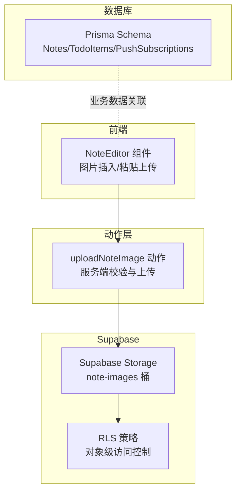
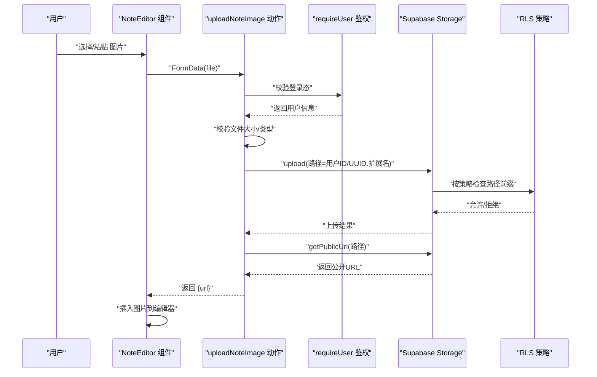
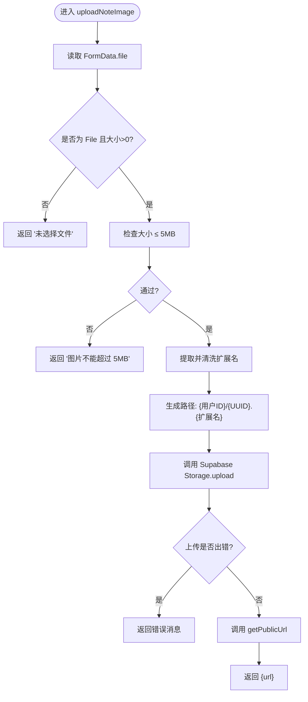
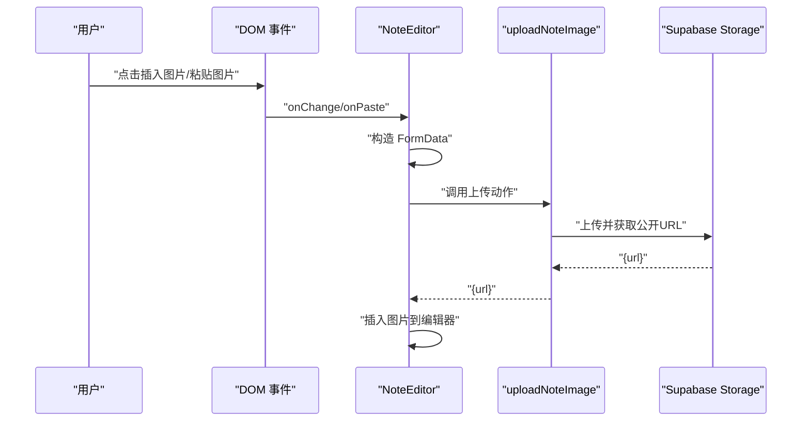
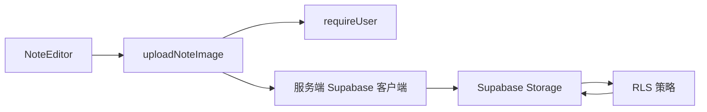

# 文件上传系统

<cite>
**本文引用的文件**
- [src/actions/upload.ts](file://src/actions/upload.ts)
- [src/components/editor/note-editor.tsx](file://src/components/editor/note-editor.tsx)
- [src/lib/supabase/client.ts](file://src/lib/supabase/client.ts)
- [src/lib/supabase/server.ts](file://src/lib/supabase/server.ts)
- [src/lib/auth/session.ts](file://src/lib/auth/session.ts)
- [supabase/migrations/20260513120000_storage_note_images.sql](file://supabase/migrations/20260513120000_storage_note_images.sql)
- [supabase/migrations/20260513000000_enable_rls_policies.sql](file://supabase/migrations/20260513000000_enable_rls_policies.sql)
- [prisma/schema.prisma](file://prisma/schema.prisma)
- [package.json](file://package.json)
- [src/lib/constants.ts](file://src/lib/constants.ts)
- [src/lib/offline/note-cache.ts](file://src/lib/offline/note-cache.ts)
- [src/lib/offline/note-outbox.ts](file://src/lib/offline/note-outbox.ts)
- [src/app/api/cron/remind/route.ts](file://src/app/api/cron/remind/route.ts)
</cite>

## 目录
1. [简介](#简介)
2. [项目结构](#项目结构)
3. [核心组件](#核心组件)
4. [架构总览](#架构总览)
5. [详细组件分析](#详细组件分析)
6. [依赖关系分析](#依赖关系分析)
7. [性能考虑](#性能考虑)
8. [故障排查指南](#故障排查指南)
9. [结论](#结论)
10. [附录](#附录)

## 简介
本文件上传系统围绕 Supabase Storage 构建，专注于“便签图片”上传能力。系统通过严格的存储桶配置与行级安全策略（RLS）实现访问控制，前端编辑器支持粘贴与文件选择两种图片上传方式，并在服务端完成文件类型与大小校验、生成唯一路径与返回公开访问链接。同时，系统具备基础的离线缓存与重放机制，确保在网络异常场景下的可用性。

## 项目结构
与文件上传直接相关的模块分布如下：
- 动作层：负责服务端上传动作与鉴权
- 客户端封装：提供浏览器端与服务端 Supabase 客户端
- 编辑器组件：提供图片插入入口与粘贴上传
- 存储桶与策略：通过迁移脚本定义存储桶、大小限制与 RLS 策略
- 离线机制：提供本地缓存与保存队列，保障网络异常时的可靠性

图表来源
- [src/components/editor/note-editor.tsx:314-330](file://src/components/editor/note-editor.tsx#L314-L330)
- [src/actions/upload.ts:6-37](file://src/actions/upload.ts#L6-L37)
- [supabase/migrations/20260513120000_storage_note_images.sql:4-16](file://supabase/migrations/20260513120000_storage_note_images.sql#L4-L16)
- [supabase/migrations/20260513000000_enable_rls_policies.sql:34-41](file://supabase/migrations/20260513000000_enable_rls_policies.sql#L34-L41)

章节来源
- [src/components/editor/note-editor.tsx:314-330](file://src/components/editor/note-editor.tsx#L314-L330)
- [src/actions/upload.ts:6-37](file://src/actions/upload.ts#L6-L37)
- [supabase/migrations/20260513120000_storage_note_images.sql:4-16](file://supabase/migrations/20260513120000_storage_note_images.sql#L4-L16)
- [supabase/migrations/20260513000000_enable_rls_policies.sql:34-41](file://supabase/migrations/20260513000000_enable_rls_policies.sql#L34-L41)

## 核心组件
- 上传动作 uploadNoteImage
  - 服务端执行，要求已登录用户
  - 校验文件实例与大小（≤5MB）
  - 生成基于用户 ID 的唯一路径（UUID.扩展名）
  - 通过 Supabase Storage 上传并返回公开 URL
- 编辑器 NoteEditor
  - 支持点击按钮选择图片或粘贴图片触发上传
  - 将返回的公开 URL 插入编辑器内容
- Supabase 客户端封装
  - 浏览器端：createClient
  - 服务端：createClient（携带 Cookie）
- 存储桶与策略
  - note-images 桶：公开、大小限制、允许 MIME 类型
  - RLS 策略：按路径第一段（用户 ID）进行访问控制

章节来源
- [src/actions/upload.ts:6-37](file://src/actions/upload.ts#L6-L37)
- [src/components/editor/note-editor.tsx:314-330](file://src/components/editor/note-editor.tsx#L314-L330)
- [src/lib/supabase/client.ts:3-8](file://src/lib/supabase/client.ts#L3-L8)
- [src/lib/supabase/server.ts:4-28](file://src/lib/supabase/server.ts#L4-L28)
- [supabase/migrations/20260513120000_storage_note_images.sql:4-16](file://supabase/migrations/20260513120000_storage_note_images.sql#L4-L16)

## 架构总览
下图展示了从编辑器到存储的完整调用链路与鉴权控制点：

图表来源
- [src/components/editor/note-editor.tsx:314-330](file://src/components/editor/note-editor.tsx#L314-L330)
- [src/actions/upload.ts:6-37](file://src/actions/upload.ts#L6-L37)
- [src/lib/auth/session.ts:12-18](file://src/lib/auth/session.ts#L12-L18)
- [supabase/migrations/20260513120000_storage_note_images.sql:27-32](file://supabase/migrations/20260513120000_storage_note_images.sql#L27-L32)

## 详细组件分析

### 上传动作 uploadNoteImage
- 输入：FormData，字段名为 file
- 校验：
  - 必须为 File 实例且大小大于 0
  - 大小上限 5MB
- 路径生成：
  - 规则：用户 ID 作为目录，文件名为 UUID.原扩展名
  - 扩展名清洗：仅保留字母数字字符
- 上传：
  - 使用服务端 Supabase 客户端
  - 二进制 Buffer 上传
  - 指定 Content-Type，upsert=false
- 返回：
  - 成功：公开 URL
  - 失败：错误消息

图表来源
- [src/actions/upload.ts:6-37](file://src/actions/upload.ts#L6-L37)

章节来源
- [src/actions/upload.ts:6-37](file://src/actions/upload.ts#L6-L37)

### 编辑器组件 NoteEditor
- 图片插入入口：
  - 点击按钮触发隐藏文件输入框
  - 选择文件后构造 FormData 并调用上传动作
- 粘贴上传：
  - 监听剪贴板图片事件
  - 过滤剪贴板中的图片文件
  - 调用上传动作并将返回 URL 插入编辑器
- 错误处理：
  - 上传失败时设置保存状态为 error
  - 通过全局提示反馈错误

图表来源
- [src/components/editor/note-editor.tsx:314-330](file://src/components/editor/note-editor.tsx#L314-L330)
- [src/components/editor/note-editor.tsx:270-291](file://src/components/editor/note-editor.tsx#L270-L291)

章节来源
- [src/components/editor/note-editor.tsx:314-330](file://src/components/editor/note-editor.tsx#L314-L330)
- [src/components/editor/note-editor.tsx:270-291](file://src/components/editor/note-editor.tsx#L270-L291)

### Supabase 客户端封装
- 浏览器端客户端：createClient
  - 使用 NEXT_PUBLIC_SUPABASE_URL 与 NEXT_PUBLIC_SUPABASE_ANON_KEY
- 服务端客户端：createClient
  - 使用 NEXT_PUBLIC_SUPABASE_URL 与 NEXT_PUBLIC_SUPABASE_ANON_KEY
  - 通过 Cookie 传递会话信息，确保鉴权上下文

章节来源
- [src/lib/supabase/client.ts:3-8](file://src/lib/supabase/client.ts#L3-L8)
- [src/lib/supabase/server.ts:4-28](file://src/lib/supabase/server.ts#L4-L28)

### 存储桶与访问控制
- note-images 存储桶
  - 公开可访问
  - 文件大小限制：5242880 字节（约 5MB）
  - 允许 MIME 类型：jpeg、png、gif、webp、svg+xml
- RLS 策略
  - 选择：仅允许访问 note-images 桶
  - 插入/更新/删除：要求路径第一段等于当前用户 ID
  - 路径约定：{auth.uid()}/{filename}

章节来源
- [supabase/migrations/20260513120000_storage_note_images.sql:4-16](file://supabase/migrations/20260513120000_storage_note_images.sql#L4-L16)
- [supabase/migrations/20260513120000_storage_note_images.sql:23-50](file://supabase/migrations/20260513120000_storage_note_images.sql#L23-L50)
- [supabase/migrations/20260513000000_enable_rls_policies.sql:34-41](file://supabase/migrations/20260513000000_enable_rls_policies.sql#L34-L41)

### 数据模型与关联
- Prisma Schema
  - Notes/TodoItems/PushSubscriptions 等业务表均通过 userId 关联用户
  - 与文件上传无直接字段关联，但编辑器内容中可嵌入图片 URL

章节来源
- [prisma/schema.prisma:48-100](file://prisma/schema.prisma#L48-L100)

## 依赖关系分析
- 组件耦合
  - NoteEditor 依赖 uploadNoteImage 动作
  - uploadNoteImage 依赖 requireUser 与服务端 Supabase 客户端
- 外部依赖
  - @supabase/ssr 与 @supabase/supabase-js
  - Next.js App Router 与 React 组件生态
- 数据流
  - 前端 -> 动作层 -> Supabase Storage -> RLS -> 返回公开 URL -> 前端渲染

图表来源
- [src/components/editor/note-editor.tsx:314-330](file://src/components/editor/note-editor.tsx#L314-L330)
- [src/actions/upload.ts:6-37](file://src/actions/upload.ts#L6-L37)
- [src/lib/auth/session.ts:12-18](file://src/lib/auth/session.ts#L12-L18)
- [src/lib/supabase/server.ts:4-28](file://src/lib/supabase/server.ts#L4-L28)

章节来源
- [src/components/editor/note-editor.tsx:314-330](file://src/components/editor/note-editor.tsx#L314-L330)
- [src/actions/upload.ts:6-37](file://src/actions/upload.ts#L6-L37)
- [src/lib/auth/session.ts:12-18](file://src/lib/auth/session.ts#L12-L18)
- [src/lib/supabase/server.ts:4-28](file://src/lib/supabase/server.ts#L4-L28)

## 性能考虑
- 传输优化
  - 前端上传采用二进制 Buffer，避免 Base64 带来的体积膨胀
  - 存储桶大小限制与 MIME 白名单减少无效请求
- 并发与重试
  - 当前实现未内置并发上传与自动重试逻辑
  - 可在编辑器层面增加并发控制与失败重试策略
- 缓存与离线
  - 编辑器保存采用去抖与本地缓存，上传图片可复用公开 URL
  - 离线保存队列支持网络恢复后重放

章节来源
- [src/actions/upload.ts:20-26](file://src/actions/upload.ts#L20-L26)
- [src/lib/offline/note-cache.ts:18-24](file://src/lib/offline/note-cache.ts#L18-L24)
- [src/lib/offline/note-outbox.ts:49-86](file://src/lib/offline/note-outbox.ts#L49-L86)

## 故障排查指南
- 常见错误与定位
  - 未选择文件：检查前端 FormData 是否正确构造
  - 文件过大：确认大小限制与前端提示
  - 上传失败：查看返回的错误消息，检查 Supabase 日志
- 鉴权问题
  - 未登录：requireUser 会重定向至登录页
  - 路径不匹配：RLS 要求路径第一段必须为当前用户 ID
- 网络异常
  - 编辑器保存阶段出现网络错误会进入本地队列，待网络恢复后重放

章节来源
- [src/actions/upload.ts:9-14](file://src/actions/upload.ts#L9-L14)
- [src/actions/upload.ts:28-30](file://src/actions/upload.ts#L28-L30)
- [src/lib/auth/session.ts:12-18](file://src/lib/auth/session.ts#L12-L18)
- [supabase/migrations/20260513120000_storage_note_images.sql:27-32](file://supabase/migrations/20260513120000_storage_note_images.sql#L27-L32)

## 结论
该文件上传系统以 Supabase Storage 为核心，结合严格的 RLS 策略与服务端校验，实现了安全可控的图片上传流程。前端编辑器提供了便捷的插入与粘贴上传体验，配合离线缓存与保存队列提升了稳定性。未来可在并发控制、自动重试与 CDN 集成等方面进一步优化。

## 附录
- 环境变量与脚本
  - NEXT_PUBLIC_SUPABASE_URL、NEXT_PUBLIC_SUPABASE_ANON_KEY
  - 数据库与存储桶初始化脚本：db:rls、db:storage、db:realtime
- 相关常量
  - TRASH_RETENTION_DAYS：回收站保留天数（与文件上传无直接关联）

章节来源
- [package.json:6-21](file://package.json#L6-L21)
- [src/lib/constants.ts:15](file://src/lib/constants.ts#L15)