# 前端架构设计

<cite>
**本文引用的文件**
- [package.json](file://package.json)
- [next.config.ts](file://next.config.ts)
- [tsconfig.json](file://tsconfig.json)
- [postcss.config.mjs](file://postcss.config.mjs)
- [components.json](file://components.json)
- [src/app/layout.tsx](file://src/app/layout.tsx)
- [src/app/globals.css](file://src/app/globals.css)
- [src/app/page.tsx](file://src/app/page.tsx)
- [src/app/(app)/notes/[noteId]/page.tsx](file://src/app/(app)/notes/[noteId]/page.tsx)
- [src/app/(app)/notes/page.tsx](file://src/app/(app)/notes/page.tsx)
- [src/components/ui/button.tsx](file://src/components/ui/button.tsx)
- [src/components/editor/note-editor.tsx](file://src/components/editor/note-editor.tsx)
- [src/components/editor/note-editor-loader.tsx](file://src/components/editor/note-editor-loader.tsx)
- [src/components/editor/link-dialog.tsx](file://src/components/editor/link-dialog.tsx)
- [src/components/ui/confirm-dialog.tsx](file://src/components/ui/confirm-dialog.tsx)
- [src/lib/offline/note-outbox.ts](file://src/lib/offline/note-outbox.ts)
- [src/lib/offline/note-cache.ts](file://src/lib/offline/note-cache.ts)
- [src/lib/tiptap/custom-task-item.ts](file://src/lib/tiptap/custom-task-item.ts)
- [src/lib/constants.ts](file://src/lib/constants.ts)
- [src/actions/todos.ts](file://src/actions/todos.ts)
- [src/actions/notes.ts](file://src/actions/notes.ts)
- [src/proxy.ts](file://src/proxy.ts)
- [public/manifest.json](file://public/manifest.json)
- [public/sw.js](file://public/sw.js)
</cite>

## 目录
1. [简介](#简介)
2. [项目结构](#项目结构)
3. [核心组件](#核心组件)
4. [架构总览](#架构总览)
5. [详细组件分析](#详细组件分析)
6. [富文本编辑器架构改进](#富文本编辑器架构改进)
7. [状态管理模式变更](#状态管理模式变更)
8. [离线存储与同步机制](#离线存储与同步机制)
9. [依赖分析](#依赖分析)
10. [性能考虑](#性能考虑)
11. [故障排查指南](#故障排查指南)
12. [结论](#结论)
13. [附录](#附录)

## 简介
本文件系统性梳理 Smart-Todo 前端架构，聚焦 Next.js 16 App Router 的文件系统路由、Server Actions 集成、中间件机制与代理配置；同时阐述前端技术栈（React 19、shadcn/ui、Tailwind CSS v4）、组件架构（根布局到页面组件的层级关系）、PWA 与 Service Worker 实现、构建配置与性能优化策略，并提供具体代码示例路径以指导实践。

**更新** 本次更新重点反映了富文本编辑器组件的架构改进和状态管理模式变更，包括离线存储、并发控制和实时同步机制的增强。

## 项目结构
Smart-Todo 采用 Next.js 16 App Router 的 App 目录组织方式，核心目录与职责如下：
- src/app：页面、布局、路由、Server Actions、中间件代理等
- src/components：业务组件与 UI 组件（含 shadcn/ui）
- src/lib：工具函数、常量、数据库、认证、推送、富文本编辑器扩展等
- src/actions：服务端动作（Server Actions）
- src/stores：状态管理（可选，当前主要使用 React 状态）
- public：静态资源（图标、清单、Service Worker）
- 配置文件：next.config.ts、tsconfig.json、postcss.config.mjs、components.json

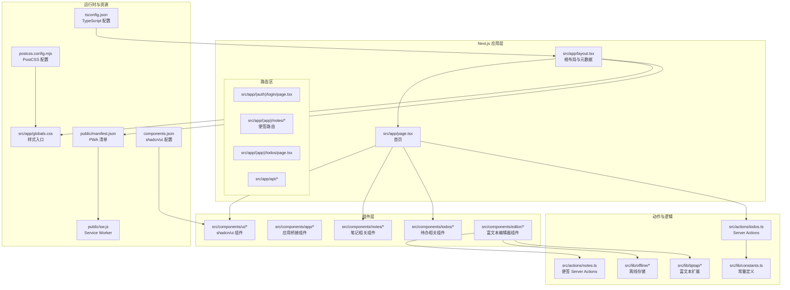

**图表来源**
- [src/app/layout.tsx:1-54](file://src/app/layout.tsx#L1-L54)
- [src/app/page.tsx:1-91](file://src/app/page.tsx#L1-L91)
- [src/components/ui/button.tsx:1-59](file://src/components/ui/button.tsx#L1-L59)
- [src/actions/todos.ts:1-70](file://src/actions/todos.ts#L1-L70)
- [src/actions/notes.ts:1-230](file://src/actions/notes.ts#L1-L230)
- [src/lib/constants.ts:1-16](file://src/lib/constants.ts#L1-L16)
- [public/manifest.json:1-27](file://public/manifest.json#L1-L27)
- [public/sw.js:1-29](file://public/sw.js#L1-L29)
- [src/app/globals.css:1-193](file://src/app/globals.css#L1-L193)
- [tsconfig.json:1-35](file://tsconfig.json#L1-L35)
- [postcss.config.mjs:1-8](file://postcss.config.mjs#L1-L8)
- [components.json:1-26](file://components.json#L1-L26)

**章节来源**
- [src/app/layout.tsx:1-54](file://src/app/layout.tsx#L1-L54)
- [src/app/page.tsx:1-91](file://src/app/page.tsx#L1-L91)
- [src/app/globals.css:1-193](file://src/app/globals.css#L1-L193)
- [public/manifest.json:1-27](file://public/manifest.json#L1-L27)
- [public/sw.js:1-29](file://public/sw.js#L1-L29)
- [tsconfig.json:1-35](file://tsconfig.json#L1-L35)
- [postcss.config.mjs:1-8](file://postcss.config.mjs#L1-L8)
- [components.json:1-26](file://components.json#L1-L26)

## 核心组件
- 根布局与元数据：定义站点标题、描述、Apple Web App 元信息、主题色、PWA 清单链接与字体加载。
- 全局样式：引入 Tailwind CSS v4、动画库与 shadcn/tailwind.css，通过 CSS 变量与自定义变体实现深浅色主题。
- 首页：异步渲染用户状态与环境变量检测，提供导航入口至登录、便签与待办。
- UI 组件：基于 Base UI 与 class-variance-authority 的 Button 组件，提供丰富的变体与尺寸。
- Server Actions：在"待办聚合"场景中，通过服务端动作更新便签内容并同步待办项，随后触发缓存失效。
- 中间件代理：统一在请求到达前刷新 Supabase 会话，匹配除静态资源外的所有路径。
- PWA 与 Service Worker：注册 PWA 清单，最小化 SW 接收推送并在通知点击时跳转。
- **富文本编辑器**：基于 Tiptap 的现代化编辑器，支持任务列表、链接、图片、占位符等扩展，具备离线存储和实时同步能力。

**章节来源**
- [src/app/layout.tsx:1-54](file://src/app/layout.tsx#L1-L54)
- [src/app/globals.css:1-193](file://src/app/globals.css#L1-L193)
- [src/app/page.tsx:1-91](file://src/app/page.tsx#L1-L91)
- [src/components/ui/button.tsx:1-59](file://src/components/ui/button.tsx#L1-L59)
- [src/actions/todos.ts:1-70](file://src/actions/todos.ts#L1-L70)
- [src/proxy.ts:1-24](file://src/proxy.ts#L1-L24)
- [public/manifest.json:1-27](file://public/manifest.json#L1-L27)
- [public/sw.js:1-29](file://public/sw.js#L1-L29)

## 架构总览
下图展示了从浏览器请求到页面渲染、Server Actions 执行与缓存失效的整体流程，以及 PWA 的 Service Worker 生命周期。

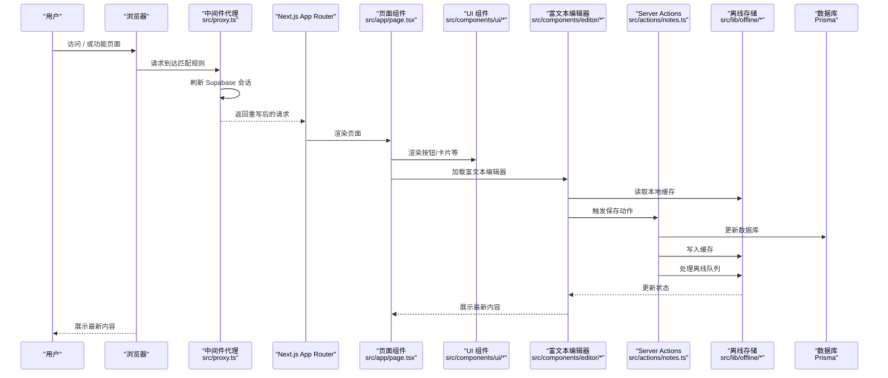

**图表来源**
- [src/proxy.ts:1-24](file://src/proxy.ts#L1-L24)
- [src/app/page.tsx:1-91](file://src/app/page.tsx#L1-L91)
- [src/components/ui/button.tsx:1-59](file://src/components/ui/button.tsx#L1-L59)
- [src/actions/todos.ts:1-70](file://src/actions/todos.ts#L1-L70)
- [src/actions/notes.ts:1-230](file://src/actions/notes.ts#L1-L230)
- [src/lib/offline/note-outbox.ts:1-87](file://src/lib/offline/note-outbox.ts#L1-L87)
- [src/lib/offline/note-cache.ts:1-25](file://src/lib/offline/note-cache.ts#L1-L25)

**章节来源**
- [src/proxy.ts:1-24](file://src/proxy.ts#L1-L24)
- [src/app/page.tsx:1-91](file://src/app/page.tsx#L1-L91)
- [src/components/ui/button.tsx:1-59](file://src/components/ui/button.tsx#L1-L59)
- [src/actions/todos.ts:1-70](file://src/actions/todos.ts#L1-L70)
- [src/actions/notes.ts:1-230](file://src/actions/notes.ts#L1-L230)
- [src/lib/offline/note-outbox.ts:1-87](file://src/lib/offline/note-outbox.ts#L1-L87)
- [src/lib/offline/note-cache.ts:1-25](file://src/lib/offline/note-cache.ts#L1-L25)

## 详细组件分析

### 文件系统路由与页面层级
- 根布局负责注入全局样式、字体与通知组件，提供顶层 HTML 结构与主题容器。
- 首页作为入口页面，根据用户会话与环境变量状态动态呈现导航与提示信息。
- App Router 通过目录结构自动映射路由，例如 `(auth)/login` 与 `(app)/notes`、`(app)/todos` 等。

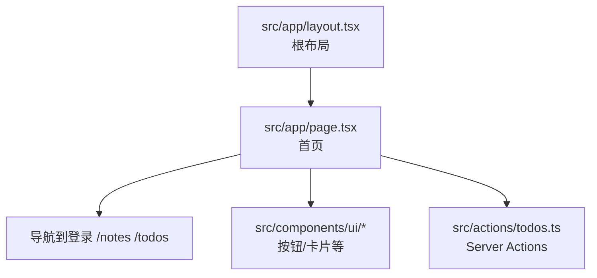

**图表来源**
- [src/app/layout.tsx:1-54](file://src/app/layout.tsx#L1-L54)
- [src/app/page.tsx:1-91](file://src/app/page.tsx#L1-L91)
- [src/components/ui/button.tsx:1-59](file://src/components/ui/button.tsx#L1-L59)
- [src/actions/todos.ts:1-70](file://src/actions/todos.ts#L1-L70)

**章节来源**
- [src/app/layout.tsx:1-54](file://src/app/layout.tsx#L1-L54)
- [src/app/page.tsx:1-91](file://src/app/page.tsx#L1-L91)

### Server Actions 集成与数据一致性
- 在"待办聚合"页勾选完成时，调用服务端动作以原子性地更新便签内容与待办项，并递增同步版本号。
- 动作执行成功后，对多个路径发起 revalidatePath，确保相关页面与布局重新拉取数据，维持视图一致性。

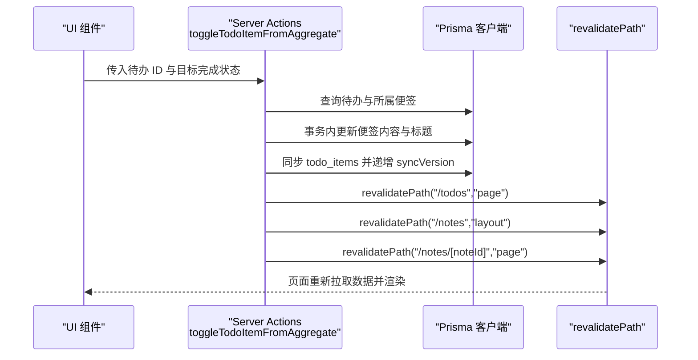

**图表来源**
- [src/actions/todos.ts:1-70](file://src/actions/todos.ts#L1-L70)

**章节来源**
- [src/actions/todos.ts:1-70](file://src/actions/todos.ts#L1-L70)

### 中间件机制与代理配置
- Next.js 16 引入新的代理入口，替代传统 middleware 名称，统一在请求到达前刷新 Supabase 会话。
- 匹配规则排除静态资源与公共资产，减少不必要的中间件开销。

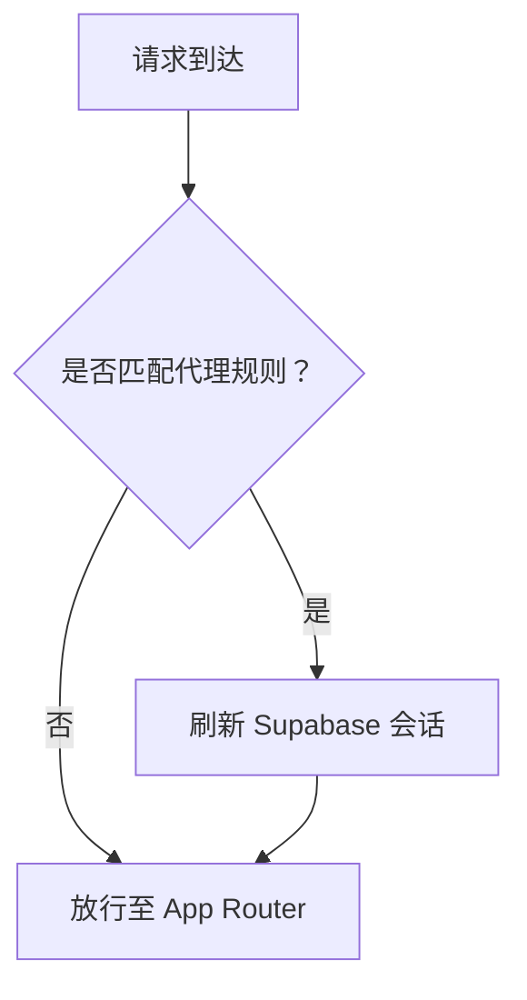

**图表来源**
- [src/proxy.ts:1-24](file://src/proxy.ts#L1-L24)

**章节来源**
- [src/proxy.ts:1-24](file://src/proxy.ts#L1-L24)

### PWA 配置、Service Worker 与离线支持
- PWA 清单定义了应用名称、启动路径、显示模式、主题色与图标集。
- Service Worker 接收推送消息并展示通知，点击通知后打开指定 URL，实现基础的离线与推送能力。

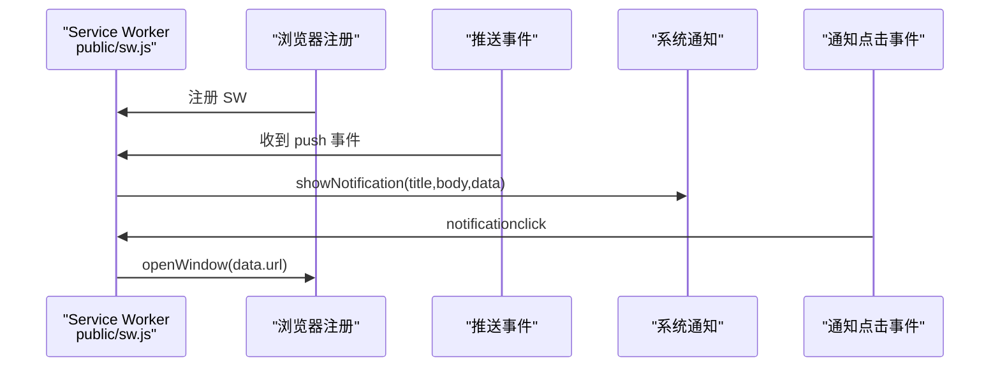

**图表来源**
- [public/manifest.json:1-27](file://public/manifest.json#L1-L27)
- [public/sw.js:1-29](file://public/sw.js#L1-L29)

**章节来源**
- [public/manifest.json:1-27](file://public/manifest.json#L1-L27)
- [public/sw.js:1-29](file://public/sw.js#L1-L29)

### 组件架构与 UI 设计系统
- UI 组件采用 Base UI 原子组件与 class-variance-authority 的变体系统，结合 shadcn 风格与 Tailwind v4 变量，实现一致的视觉与交互体验。
- 按钮组件通过变体与尺寸参数化，满足不同场景下的视觉与语义需求。

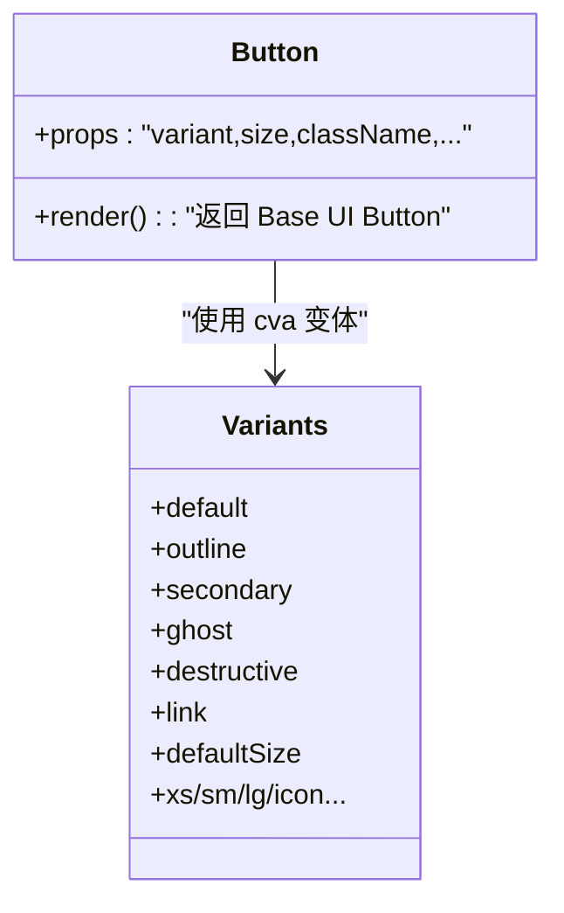

**图表来源**
- [src/components/ui/button.tsx:1-59](file://src/components/ui/button.tsx#L1-L59)
- [components.json:1-26](file://components.json#L1-L26)

**章节来源**
- [src/components/ui/button.tsx:1-59](file://src/components/ui/button.tsx#L1-L59)
- [components.json:1-26](file://components.json#L1-L26)

### 样式系统与主题
- 全局样式通过 Tailwind CSS v4 的 @theme inline 语法，将 CSS 变量映射到设计令牌，支持暗/亮两套主题。
- 使用自定义变体 dark，配合 shadcn/tailwind.css，确保组件在深色模式下正确渲染。

**章节来源**
- [src/app/globals.css:1-193](file://src/app/globals.css#L1-L193)

### TypeScript 与构建配置
- tsconfig.json 配置了严格模式、Bundler 解析、JSX 运行时与路径别名，确保类型安全与模块解析一致性。
- next.config.ts 保留扩展空间；postcss.config.mjs 引入 Tailwind PostCSS 插件；components.json 配置 shadcn/ui 的 Tailwind、颜色与别名。

**章节来源**
- [tsconfig.json:1-35](file://tsconfig.json#L1-L35)
- [next.config.ts:1-8](file://next.config.ts#L1-L8)
- [postcss.config.mjs:1-8](file://postcss.config.mjs#L1-L8)
- [components.json:1-26](file://components.json#L1-L26)

## 富文本编辑器架构改进

Smart-Todo 的富文本编辑器组件经过重大架构改进，采用了现代化的状态管理模式和离线存储机制：

### 组件层次结构
- **NoteEditorLoader**：使用 Next.js 的动态导入实现客户端渲染，避免 SSR 期间的富文本初始化问题
- **NoteEditor**：核心编辑器组件，集成 Tiptap 扩展和状态管理
- **LinkDialog**：独立的链接对话框组件，提供链接插入和编辑功能
- **ConfirmDialog**：通用确认对话框，用于删除等危险操作

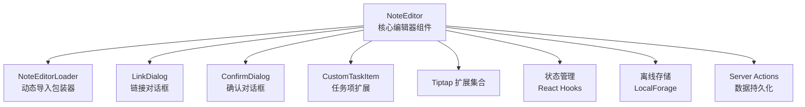

**图表来源**
- [src/components/editor/note-editor.tsx:1-618](file://src/components/editor/note-editor.tsx#L1-L618)
- [src/components/editor/note-editor-loader.tsx:1-21](file://src/components/editor/note-editor-loader.tsx#L1-L21)
- [src/components/editor/link-dialog.tsx:1-127](file://src/components/editor/link-dialog.tsx#L1-L127)
- [src/lib/tiptap/custom-task-item.ts:1-31](file://src/lib/tiptap/custom-task-item.ts#L1-L31)

### Tiptap 扩展集成
编辑器集成了多种 Tiptap 扩展以提供丰富的编辑功能：

- **StarterKit**：基础编辑功能（标题、列表、格式化等）
- **TaskList**：待办事项列表支持
- **CustomTaskItem**：自定义任务项，支持到期时间和提醒时间属性
- **UniqueID**：为任务项生成唯一标识符
- **Link**：链接功能，支持自动链接和协议配置
- **Image**：图片插入功能
- **Placeholder**：占位符文本
- **Typography**：排版增强

**章节来源**
- [src/components/editor/note-editor.tsx:116-139](file://src/components/editor/note-editor.tsx#L116-L139)
- [src/lib/tiptap/custom-task-item.ts:1-31](file://src/lib/tiptap/custom-task-item.ts#L1-L31)

## 状态管理模式变更

富文本编辑器的状态管理模式经历了重大改进，解决了并发保存、离线同步和状态一致性等问题：

### 核心状态管理改进

#### 1. 并发保存控制
- **序列化保存**：使用 `inFlightRef` 和 `pendingJsonRef` 确保同一时间只有一个保存请求在进行
- **脏状态跟踪**：通过 `dirtySinceSaveRef` 跟踪自上次保存以来的编辑变更
- **防抖机制**：使用 `DEBOUNCE_MS` 常量（650ms）延迟保存请求

#### 2. 离线存储集成
- **本地队列**：使用 `enqueueNoteSave` 将离线保存请求排队
- **缓存写入**：使用 `writeNoteCache` 缓存最近的编辑内容
- **队列重放**：通过 `drainOutbox` 顺序重放离线保存请求

#### 3. 版本控制与冲突检测
- **同步版本**：使用 `lastSavedSyncVersionRef` 跟踪服务器同步版本
- **冲突检测**：通过 `expectedSyncVersion` 参数防止并发编辑冲突
- **远程更新检测**：监听服务器版本变化，自动提示用户重新加载

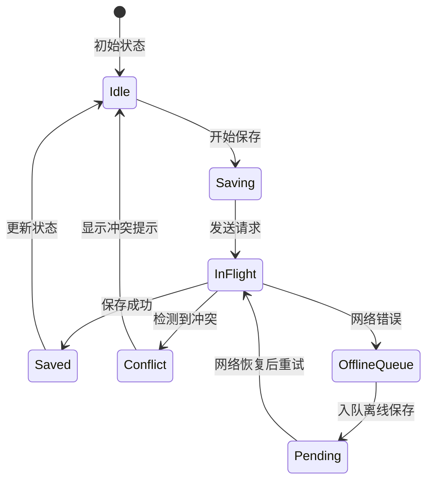

**图表来源**
- [src/components/editor/note-editor.tsx:141-217](file://src/components/editor/note-editor.tsx#L141-L217)
- [src/lib/offline/note-outbox.ts:48-86](file://src/lib/offline/note-outbox.ts#L48-L86)

### 关键状态管理特性

#### 保存状态管理
- **idle**：空闲状态，等待用户输入
- **saving**：正在保存，显示"保存中..."提示
- **saved**：保存成功，显示"已保存"提示
- **error**：保存失败，显示错误提示

#### 并发控制机制
- **防重复提交**：`inFlightRef` 确保同一时间只有一个保存请求
- **增量保存**：`pendingJsonRef` 存储最新的编辑内容，避免丢失
- **自回显抑制**：使用 `lastSavedSyncVersionRef` 抑制自身保存引起的回显

#### 离线处理策略
- **网络错误处理**：捕获网络错误，自动将保存请求加入离线队列
- **队列管理**：同一 `noteId` 只保留最后一次内容，避免重复保存
- **顺序重放**：按队列顺序重放保存请求，确保数据一致性

**章节来源**
- [src/components/editor/note-editor.tsx:98-295](file://src/components/editor/note-editor.tsx#L98-L295)
- [src/lib/offline/note-outbox.ts:26-41](file://src/lib/offline/note-outbox.ts#L26-L41)
- [src/lib/offline/note-cache.ts:18-24](file://src/lib/offline/note-cache.ts#L18-L24)

## 离线存储与同步机制

### 本地存储架构

Smart-Todo 实现了完整的离线存储解决方案，使用 LocalForage 作为底层存储引擎：

#### 存储实例配置
- **note_outbox**：保存队列，存储离线保存请求
- **note_cache**：缓存存储，存储最近的编辑内容和同步版本

#### 数据结构设计

**OutboxEntry 结构**：
```typescript
type OutboxEntry = {
  noteId: string;           // 便签 ID
  docJson: unknown;         // Tiptap JSON 文档
  enqueuedAt: number;       // 入队时间戳
};
```

**NoteCachePayload 结构**：
```typescript
type NoteCachePayload = {
  contentJson: unknown;     // 缓存的内容 JSON
  syncVersion: number;      // 同步版本号
  savedAt: number;          // 保存时间戳
};
```

### 同步机制设计

#### 1. 保存流程
1. **本地保存**：立即更新本地状态，显示"保存中..."
2. **网络保存**：异步发送保存请求到服务器
3. **成功处理**：更新同步版本，写入缓存，清理队列
4. **失败处理**：捕获错误，将请求加入离线队列

#### 2. 离线队列处理
- **顺序重放**：按队列顺序处理保存请求
- **冲突处理**：检测服务器版本冲突，提示用户重新加载
- **错误恢复**：网络恢复后自动重试失败的请求

#### 3. 缓存策略
- **LRU 缓存**：存储最近编辑的便签内容
- **版本跟踪**：跟踪每个便签的同步版本
- **自动清理**：定期清理过期缓存数据

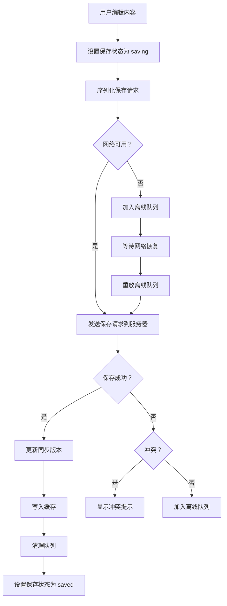

**图表来源**
- [src/components/editor/note-editor.tsx:141-217](file://src/components/editor/note-editor.tsx#L141-L217)
- [src/lib/offline/note-outbox.ts:48-86](file://src/lib/offline/note-outbox.ts#L48-L86)
- [src/lib/offline/note-cache.ts:18-24](file://src/lib/offline/note-cache.ts#L18-L24)

**章节来源**
- [src/lib/offline/note-outbox.ts:1-87](file://src/lib/offline/note-outbox.ts#L1-L87)
- [src/lib/offline/note-cache.ts:1-25](file://src/lib/offline/note-cache.ts#L1-L25)
- [src/components/editor/note-editor.tsx:141-217](file://src/components/editor/note-editor.tsx#L141-L217)

## 依赖分析
- React 19 与 Next.js 16：提供最新的并发渲染与 App Router 能力。
- shadcn/ui：提供可定制的 UI 组件库，配合 Tailwind v4 使用。
- @supabase/ssr：用于会话管理与 SSR 场景下的认证。
- @tanstack/react-query：用于客户端数据获取与缓存管理（在当前代码中未直接使用，但可作为扩展）。
- @tiptap/react：富文本编辑器，配合任务列表与占位符等扩展。
- web-push：用于 Web Push 通知的发送（与 Service Worker 协同）。
- **localforage**：离线存储解决方案，支持 IndexedDB、WebSQL 等存储后端。
- **sonner**：现代化的通知系统，提供更好的用户体验。

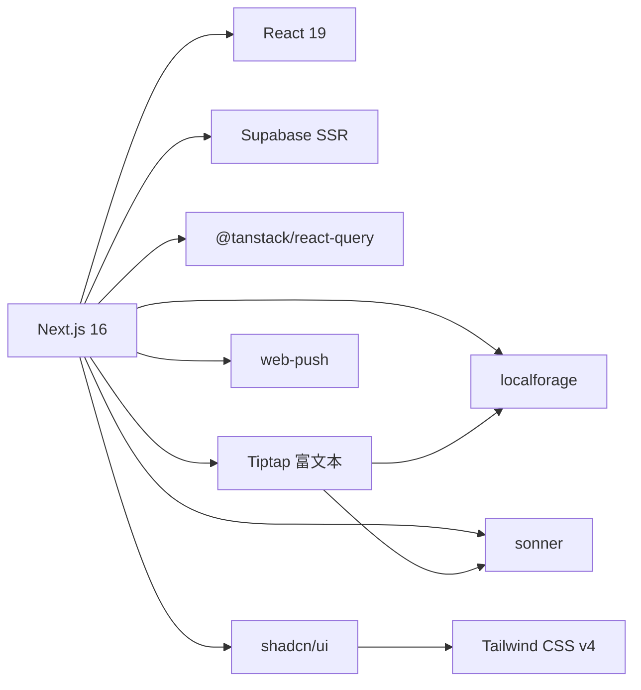

**图表来源**
- [package.json:1-87](file://package.json#L1-L87)

**章节来源**
- [package.json:1-87](file://package.json#L1-L87)

## 性能考虑
- 服务器端动作：将耗时或敏感操作移至服务端，减少客户端负担并提升安全性。
- 缓存失效：通过 revalidatePath 精准触发页面与布局的数据刷新，避免全站重建。
- 中间件匹配：仅对必要路径执行代理逻辑，降低请求处理成本。
- 样式体积：Tailwind v4 与 CSS 变量按需生成，建议在生产环境启用 Tree Shaking 与 CSS 压缩。
- 图标与字体：使用 next/font 加载字体，减少 FOIT/FOIC 并优化首屏渲染。
- **富文本编辑器性能**：使用动态导入避免 SSR 期间的富文本初始化，减少首屏包大小。
- **离线存储优化**：合理设置缓存大小和清理策略，避免本地存储过大影响性能。
- **并发控制**：通过序列化保存和防抖机制，减少不必要的网络请求。

## 故障排查指南
- 环境变量未配置：首页会检测 Supabase 与数据库连接状态，若未配置将显示占位提示，需复制 .env.example 并填写真实值。
- 会话异常：检查代理配置与 Supabase 会话刷新逻辑，确认匹配规则未误伤静态资源。
- PWA 不生效：核对清单文件路径与 Service Worker 注册路径，确保图标与主题色正确。
- 样式不生效：确认 Tailwind 与 shadcn 配置文件存在且路径正确，CSS 变量命名一致。
- **富文本编辑器问题**：检查 Tiptap 扩展是否正确加载，确认 LocalForage 存储权限。
- **离线同步问题**：检查离线队列状态，确认网络恢复后能够正常重放保存请求。
- **并发冲突**：检查同步版本控制机制，确认服务器版本更新及时。

**章节来源**
- [src/app/page.tsx:10-18](file://src/app/page.tsx#L10-L18)
- [src/proxy.ts:12-23](file://src/proxy.ts#L12-L23)
- [public/manifest.json:1-27](file://public/manifest.json#L1-L27)
- [components.json:1-26](file://components.json#L1-L26)
- [src/app/globals.css:1-193](file://src/app/globals.css#L1-L193)
- [src/components/editor/note-editor.tsx:48-59](file://src/components/editor/note-editor.tsx#L48-L59)

## 结论
Smart-Todo 前端以 Next.js 16 App Router 为核心，结合 Server Actions、中间件代理与 PWA 能力，构建出结构清晰、可扩展且具备良好用户体验的前端体系。通过 shadcn/ui 与 Tailwind CSS v4 的样式系统，组件化与主题化能力得到统一；通过 revalidatePath 与代理匹配规则，实现高效的数据一致性与性能控制。

**更新** 本次架构改进特别体现在富文本编辑器组件上，通过引入离线存储、并发控制和实时同步机制，显著提升了编辑器的稳定性和用户体验。新的状态管理模式确保了数据一致性，而离线存储机制则提供了可靠的离线编辑能力。这些改进使得 Smart-Todo 成为一个真正现代化的富文本编辑应用。

未来可在客户端缓存策略、图片优化与国际化等方面进一步完善，同时可以考虑引入 Zustand 等状态管理库来进一步优化复杂状态的管理。

## 附录
- 代码示例路径（不含具体代码内容）：
  - 根布局与元数据：[src/app/layout.tsx:1-54](file://src/app/layout.tsx#L1-L54)
  - 全局样式与主题：[src/app/globals.css:1-193](file://src/app/globals.css#L1-L193)
  - 首页与导航：[src/app/page.tsx:1-91](file://src/app/page.tsx#L1-L91)
  - UI 组件（按钮）：[src/components/ui/button.tsx:1-59](file://src/components/ui/button.tsx#L1-L59)
  - Server Actions（待办切换）：[src/actions/todos.ts:1-70](file://src/actions/todos.ts#L1-L70)
  - **富文本编辑器核心**：[src/components/editor/note-editor.tsx:1-618](file://src/components/editor/note-editor.tsx#L1-L618)
  - **富文本编辑器加载器**：[src/components/editor/note-editor-loader.tsx:1-21](file://src/components/editor/note-editor-loader.tsx#L1-L21)
  - **链接对话框**：[src/components/editor/link-dialog.tsx:1-127](file://src/components/editor/link-dialog.tsx#L1-L127)
  - **便签动作**：[src/actions/notes.ts:1-230](file://src/actions/notes.ts#L1-L230)
  - **离线队列**：[src/lib/offline/note-outbox.ts:1-87](file://src/lib/offline/note-outbox.ts#L1-L87)
  - **离线缓存**：[src/lib/offline/note-cache.ts:1-25](file://src/lib/offline/note-cache.ts#L1-L25)
  - **自定义任务项**：[src/lib/tiptap/custom-task-item.ts:1-31](file://src/lib/tiptap/custom-task-item.ts#L1-L31)
  - 中间件代理：[src/proxy.ts:1-24](file://src/proxy.ts#L1-L24)
  - PWA 清单：[public/manifest.json:1-27](file://public/manifest.json#L1-L27)
  - Service Worker：[public/sw.js:1-29](file://public/sw.js#L1-L29)
  - TypeScript 配置：[tsconfig.json:1-35](file://tsconfig.json#L1-L35)
  - PostCSS 配置：[postcss.config.mjs:1-8](file://postcss.config.mjs#L1-L8)
  - shadcn/ui 配置：[components.json:1-26](file://components.json#L1-L26)