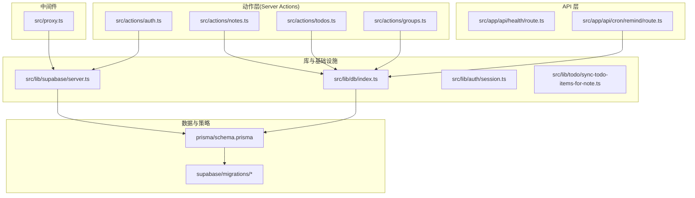
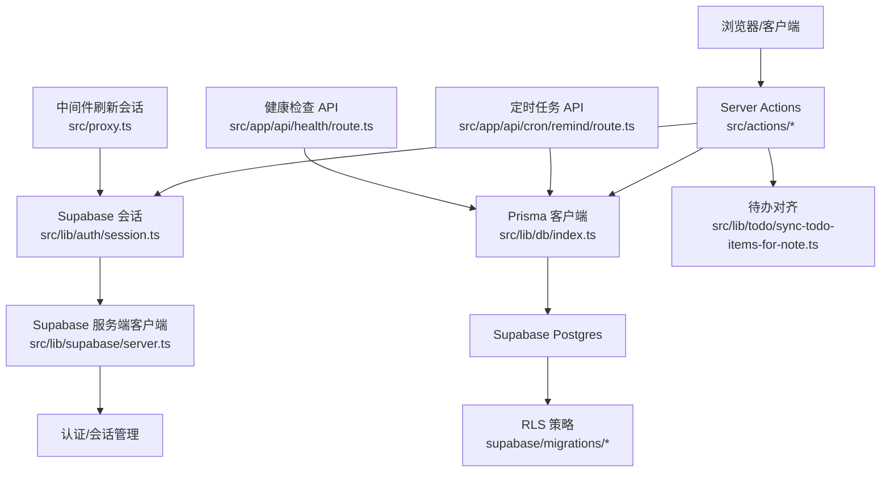
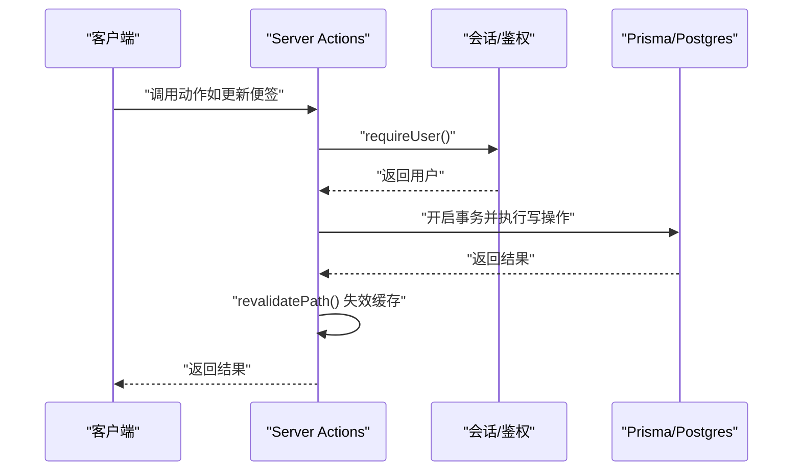
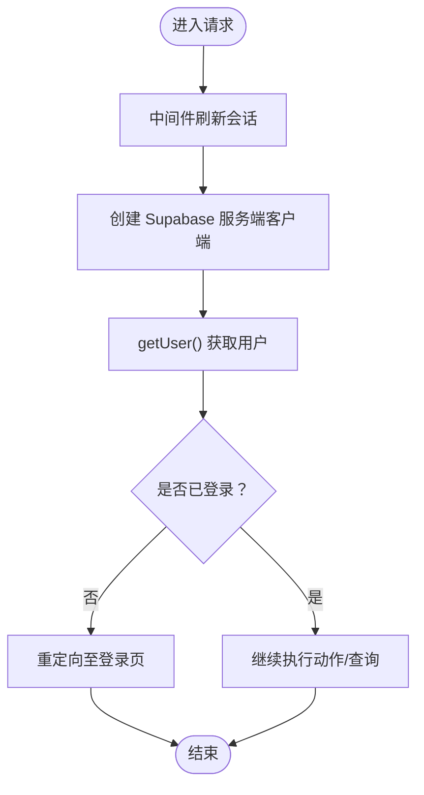
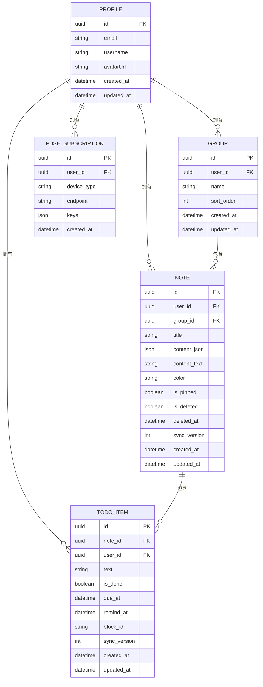
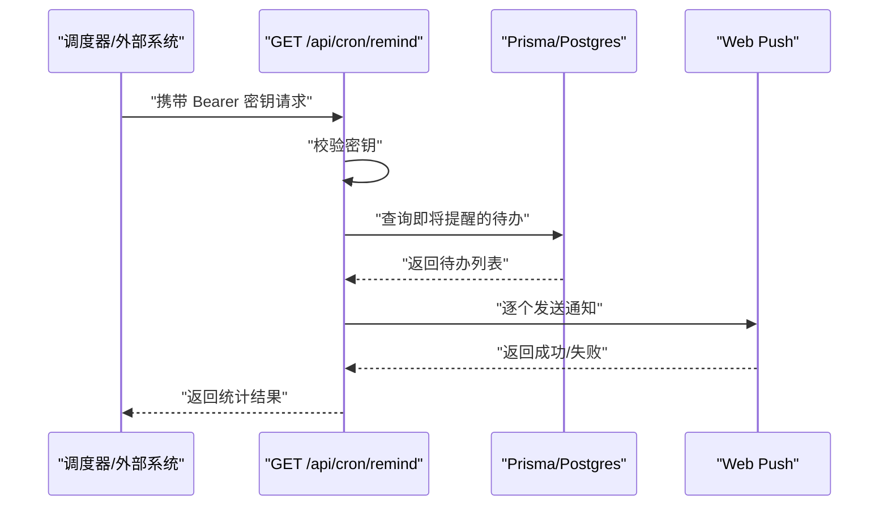
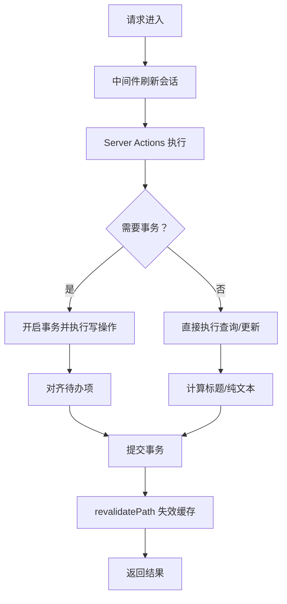
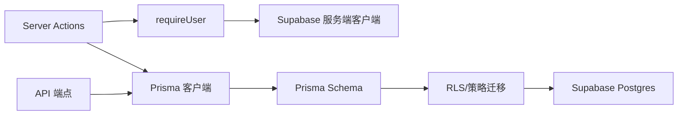

# 后端架构设计

<cite>
**本文引用的文件**
- [src/actions/auth.ts](file://src/actions/auth.ts)
- [src/actions/todos.ts](file://src/actions/todos.ts)
- [src/actions/groups.ts](file://src/actions/groups.ts)
- [src/actions/notes.ts](file://src/actions/notes.ts)
- [src/app/api/cron/remind/route.ts](file://src/app/api/cron/remind/route.ts)
- [src/app/api/health/route.ts](file://src/app/api/health/route.ts)
- [src/lib/supabase/server.ts](file://src/lib/supabase/server.ts)
- [src/lib/db/index.ts](file://src/lib/db/index.ts)
- [src/lib/auth/session.ts](file://src/lib/auth/session.ts)
- [prisma/schema.prisma](file://prisma/schema.prisma)
- [supabase/migrations/20260513000000_enable_rls_policies.sql](file://supabase/migrations/20260513000000_enable_rls_policies.sql)
- [supabase/migrations/20260513120000_storage_note_images.sql](file://supabase/migrations/20260513120000_storage_note_images.sql)
- [src/lib/todo/sync-todo-items-for-note.ts](file://src/lib/todo/sync-todo-items-for-note.ts)
- [src/app/auth/callback/route.ts](file://src/app/auth/callback/route.ts)
- [package.json](file://package.json)
- [src/proxy.ts](file://src/proxy.ts)
- [next.config.ts](file://next.config.ts)
</cite>

## 目录
1. [引言](#引言)
2. [项目结构](#项目结构)
3. [核心组件](#核心组件)
4. [架构总览](#架构总览)
5. [详细组件分析](#详细组件分析)
6. [依赖关系分析](#依赖关系分析)
7. [性能考量](#性能考量)
8. [故障排查指南](#故障排查指南)
9. [结论](#结论)
10. [附录](#附录)

## 引言
本文件系统性梳理 Smart-Todo 的后端架构，重点覆盖以下方面：
- Server Actions 模式：客户端到服务器的直接调用机制、安全边界与性能特征
- Supabase 后端集成：认证、实时发布、存储与数据库访问
- 后端 API 设计：RESTful 端点、定时任务与健康检查
- 数据流架构：从请求处理到数据库操作的完整流程
- 错误处理、日志与监控
- 配置与部署最佳实践

## 项目结构
后端相关代码主要分布在以下区域：
- 动作层（Server Actions）：src/actions 下按功能模块划分，如认证、分组、便签、待办、推送、上传等
- API 层：src/app/api 下提供定时任务与健康检查端点
- 库与基础设施：src/lib 下包含 Supabase 客户端、数据库连接、认证会话、工具函数等
- 数据模型与迁移：prisma/schema.prisma 与 supabase/migrations 下的策略与存储桶配置
- 中间件：src/proxy.ts 统一刷新 Supabase 会话
- 构建与脚本：package.json 提供数据库与迁移脚本

图表来源
- [src/actions/auth.ts:1-13](file://src/actions/auth.ts#L1-L13)
- [src/actions/notes.ts:1-230](file://src/actions/notes.ts#L1-L230)
- [src/actions/todos.ts:1-70](file://src/actions/todos.ts#L1-L70)
- [src/actions/groups.ts:1-59](file://src/actions/groups.ts#L1-L59)
- [src/app/api/health/route.ts:1-13](file://src/app/api/health/route.ts#L1-L13)
- [src/app/api/cron/remind/route.ts:1-115](file://src/app/api/cron/remind/route.ts#L1-L115)
- [src/lib/supabase/server.ts:1-29](file://src/lib/supabase/server.ts#L1-L29)
- [src/lib/db/index.ts:1-16](file://src/lib/db/index.ts#L1-L16)
- [src/lib/auth/session.ts:1-19](file://src/lib/auth/session.ts#L1-L19)
- [src/lib/todo/sync-todo-items-for-note.ts:1-59](file://src/lib/todo/sync-todo-items-for-note.ts#L1-L59)
- [prisma/schema.prisma:1-117](file://prisma/schema.prisma#L1-L117)
- [supabase/migrations/20260513000000_enable_rls_policies.sql:1-203](file://supabase/migrations/20260513000000_enable_rls_policies.sql#L1-L203)
- [supabase/migrations/20260513120000_storage_note_images.sql:1-51](file://supabase/migrations/20260513120000_storage_note_images.sql#L1-L51)
- [src/proxy.ts:1-24](file://src/proxy.ts#L1-L24)

章节来源
- [src/actions/auth.ts:1-13](file://src/actions/auth.ts#L1-L13)
- [src/actions/notes.ts:1-230](file://src/actions/notes.ts#L1-L230)
- [src/actions/todos.ts:1-70](file://src/actions/todos.ts#L1-L70)
- [src/actions/groups.ts:1-59](file://src/actions/groups.ts#L1-L59)
- [src/app/api/health/route.ts:1-13](file://src/app/api/health/route.ts#L1-L13)
- [src/app/api/cron/remind/route.ts:1-115](file://src/app/api/cron/remind/route.ts#L1-L115)
- [src/lib/supabase/server.ts:1-29](file://src/lib/supabase/server.ts#L1-L29)
- [src/lib/db/index.ts:1-16](file://src/lib/db/index.ts#L1-L16)
- [src/lib/auth/session.ts:1-19](file://src/lib/auth/session.ts#L1-L19)
- [src/lib/todo/sync-todo-items-for-note.ts:1-59](file://src/lib/todo/sync-todo-items-for-note.ts#L1-L59)
- [prisma/schema.prisma:1-117](file://prisma/schema.prisma#L1-L117)
- [supabase/migrations/20260513000000_enable_rls_policies.sql:1-203](file://supabase/migrations/20260513000000_enable_rls_policies.sql#L1-L203)
- [supabase/migrations/20260513120000_storage_note_images.sql:1-51](file://supabase/migrations/20260513120000_storage_note_images.sql#L1-L51)
- [src/proxy.ts:1-24](file://src/proxy.ts#L1-L24)

## 核心组件
- Server Actions 动作模块：封装用户态业务逻辑，统一进行鉴权、参数校验、数据库事务与缓存失效
- Supabase 服务：提供认证会话与 Cookie 同步、服务端客户端实例
- 数据库层：Prisma 客户端，配合 Supabase Postgres 与 RLS 策略
- API 层：健康检查与定时任务端点，负责外部触发与系统状态上报
- 中间件：统一刷新 Supabase 会话，确保服务端读取最新用户态

章节来源
- [src/actions/auth.ts:1-13](file://src/actions/auth.ts#L1-L13)
- [src/actions/notes.ts:1-230](file://src/actions/notes.ts#L1-L230)
- [src/actions/todos.ts:1-70](file://src/actions/todos.ts#L1-L70)
- [src/actions/groups.ts:1-59](file://src/actions/groups.ts#L1-L59)
- [src/lib/supabase/server.ts:1-29](file://src/lib/supabase/server.ts#L1-L29)
- [src/lib/db/index.ts:1-16](file://src/lib/db/index.ts#L1-L16)
- [src/lib/auth/session.ts:1-19](file://src/lib/auth/session.ts#L1-L19)
- [src/app/api/health/route.ts:1-13](file://src/app/api/health/route.ts#L1-L13)
- [src/app/api/cron/remind/route.ts:1-115](file://src/app/api/cron/remind/route.ts#L1-L115)
- [src/proxy.ts:1-24](file://src/proxy.ts#L1-L24)

## 架构总览
Smart-Todo 后端采用“Next.js 16 Server Actions + Supabase”组合：
- 客户端通过 Server Actions 直接调用服务端，避免显式 API 路由
- 服务端通过 Supabase 服务端客户端获取用户会话与认证状态
- 数据持久化基于 Prisma + Supabase Postgres，并启用 RLS 策略
- 实时能力通过 Supabase Realtime 与存储桶策略配合
- 外部定时任务通过受控 API 触发，负责推送提醒

图表来源
- [src/actions/notes.ts:1-230](file://src/actions/notes.ts#L1-L230)
- [src/actions/todos.ts:1-70](file://src/actions/todos.ts#L1-L70)
- [src/actions/groups.ts:1-59](file://src/actions/groups.ts#L1-L59)
- [src/lib/auth/session.ts:1-19](file://src/lib/auth/session.ts#L1-L19)
- [src/lib/db/index.ts:1-16](file://src/lib/db/index.ts#L1-L16)
- [src/lib/todo/sync-todo-items-for-note.ts:1-59](file://src/lib/todo/sync-todo-items-for-note.ts#L1-L59)
- [src/app/api/cron/remind/route.ts:1-115](file://src/app/api/cron/remind/route.ts#L1-L115)
- [src/app/api/health/route.ts:1-13](file://src/app/api/health/route.ts#L1-L13)
- [src/proxy.ts:1-24](file://src/proxy.ts#L1-L24)
- [src/lib/supabase/server.ts:1-29](file://src/lib/supabase/server.ts#L1-L29)
- [supabase/migrations/20260513000000_enable_rls_policies.sql:1-203](file://supabase/migrations/20260513000000_enable_rls_policies.sql#L1-L203)

## 详细组件分析

### Server Actions 模式与优势
- 直接调用机制：客户端在 Server Actions 中直接调用服务端逻辑，无需额外路由
- 安全性：统一通过 requireUser 获取当前用户，所有写操作均以用户维度约束
- 性能：减少网络往返，结合 revalidatePath 进行增量缓存失效
- 事务一致性：批量写入与对齐逻辑在 Prisma 事务中执行，保证一致性

图表来源
- [src/actions/notes.ts:59-138](file://src/actions/notes.ts#L59-L138)
- [src/lib/auth/session.ts:12-18](file://src/lib/auth/session.ts#L12-L18)
- [src/lib/db/index.ts:1-16](file://src/lib/db/index.ts#L1-L16)

章节来源
- [src/actions/notes.ts:1-230](file://src/actions/notes.ts#L1-L230)
- [src/actions/todos.ts:1-70](file://src/actions/todos.ts#L1-L70)
- [src/actions/groups.ts:1-59](file://src/actions/groups.ts#L1-L59)
- [src/lib/auth/session.ts:1-19](file://src/lib/auth/session.ts#L1-L19)

### Supabase 集成
- 会话与 Cookie：服务端客户端通过 cookies 同步，确保跨请求保持会话
- 认证回调：OAuth 成功后交换授权码并确保用户资料存在
- 存储策略：便签图片存储桶与 RLS 策略，路径按用户隔离
- RLS 策略：为 profiles、groups、notes、todo_items、push_subscriptions 建立“仅本人”策略

图表来源
- [src/proxy.ts:1-24](file://src/proxy.ts#L1-L24)
- [src/lib/supabase/server.ts:1-29](file://src/lib/supabase/server.ts#L1-L29)
- [src/lib/auth/session.ts:12-18](file://src/lib/auth/session.ts#L12-L18)
- [src/app/auth/callback/route.ts:1-49](file://src/app/auth/callback/route.ts#L1-L49)
- [supabase/migrations/20260513000000_enable_rls_policies.sql:1-203](file://supabase/migrations/20260513000000_enable_rls_policies.sql#L1-L203)
- [supabase/migrations/20260513120000_storage_note_images.sql:1-51](file://supabase/migrations/20260513120000_storage_note_images.sql#L1-L51)

章节来源
- [src/lib/supabase/server.ts:1-29](file://src/lib/supabase/server.ts#L1-L29)
- [src/lib/auth/session.ts:1-19](file://src/lib/auth/session.ts#L1-L19)
- [src/app/auth/callback/route.ts:1-49](file://src/app/auth/callback/route.ts#L1-L49)
- [supabase/migrations/20260513000000_enable_rls_policies.sql:1-203](file://supabase/migrations/20260513000000_enable_rls_policies.sql#L1-L203)
- [supabase/migrations/20260513120000_storage_note_images.sql:1-51](file://supabase/migrations/20260513120000_storage_note_images.sql#L1-L51)

### 数据模型与对齐逻辑
- 数据模型：用户资料、分组、便签、待办项、推送订阅
- 对齐逻辑：根据便签内容 JSON 抽取待办项，删除孤儿并 upsert 新条目，保持与便签内容一致
- 并发控制：通过 syncVersion 与条件更新实现乐观并发冲突检测

图表来源
- [prisma/schema.prisma:15-117](file://prisma/schema.prisma#L15-L117)
- [src/lib/todo/sync-todo-items-for-note.ts:1-59](file://src/lib/todo/sync-todo-items-for-note.ts#L1-L59)

章节来源
- [prisma/schema.prisma:1-117](file://prisma/schema.prisma#L1-L117)
- [src/lib/todo/sync-todo-items-for-note.ts:1-59](file://src/lib/todo/sync-todo-items-for-note.ts#L1-L59)

### API 设计模式
- 健康检查：返回服务名、版本与时间戳，便于运维监控
- 定时任务：受密钥保护的提醒推送端点，扫描即将到期的待办并发送 Web Push 通知，自动清理无效订阅

图表来源
- [src/app/api/cron/remind/route.ts:19-114](file://src/app/api/cron/remind/route.ts#L19-L114)
- [src/lib/db/index.ts:1-16](file://src/lib/db/index.ts#L1-L16)

章节来源
- [src/app/api/health/route.ts:1-13](file://src/app/api/health/route.ts#L1-L13)
- [src/app/api/cron/remind/route.ts:1-115](file://src/app/api/cron/remind/route.ts#L1-L115)

### 数据流架构
从请求到数据库的完整流程：
- 中间件刷新 Supabase 会话
- Server Actions 获取用户并执行业务逻辑
- 事务内写入与对齐，必要时抛出特定错误
- 返回结果并失效相关页面缓存

图表来源
- [src/proxy.ts:1-24](file://src/proxy.ts#L1-L24)
- [src/actions/notes.ts:59-138](file://src/actions/notes.ts#L59-L138)
- [src/actions/todos.ts:30-63](file://src/actions/todos.ts#L30-L63)
- [src/lib/todo/sync-todo-items-for-note.ts:1-59](file://src/lib/todo/sync-todo-items-for-note.ts#L1-L59)

章节来源
- [src/proxy.ts:1-24](file://src/proxy.ts#L1-L24)
- [src/actions/notes.ts:1-230](file://src/actions/notes.ts#L1-L230)
- [src/actions/todos.ts:1-70](file://src/actions/todos.ts#L1-L70)
- [src/lib/todo/sync-todo-items-for-note.ts:1-59](file://src/lib/todo/sync-todo-items-for-note.ts#L1-L59)

## 依赖关系分析
- 动作层依赖会话与数据库：所有写操作均通过 requireUser 与 Prisma
- API 层独立于前端 UI，仅依赖数据库与推送库
- Supabase 作为认证与会话中心，贯穿中间件与服务端客户端
- 数据模型与策略通过 Prisma 与迁移脚本落地

图表来源
- [src/actions/notes.ts:1-230](file://src/actions/notes.ts#L1-L230)
- [src/lib/auth/session.ts:1-19](file://src/lib/auth/session.ts#L1-L19)
- [src/lib/db/index.ts:1-16](file://src/lib/db/index.ts#L1-L16)
- [prisma/schema.prisma:1-117](file://prisma/schema.prisma#L1-L117)
- [supabase/migrations/20260513000000_enable_rls_policies.sql:1-203](file://supabase/migrations/20260513000000_enable_rls_policies.sql#L1-L203)
- [src/app/api/cron/remind/route.ts:1-115](file://src/app/api/cron/remind/route.ts#L1-L115)

章节来源
- [src/actions/notes.ts:1-230](file://src/actions/notes.ts#L1-L230)
- [src/lib/auth/session.ts:1-19](file://src/lib/auth/session.ts#L1-L19)
- [src/lib/db/index.ts:1-16](file://src/lib/db/index.ts#L1-L16)
- [prisma/schema.prisma:1-117](file://prisma/schema.prisma#L1-L117)
- [supabase/migrations/20260513000000_enable_rls_policies.sql:1-203](file://supabase/migrations/20260513000000_enable_rls_policies.sql#L1-L203)
- [src/app/api/cron/remind/route.ts:1-115](file://src/app/api/cron/remind/route.ts#L1-L115)

## 性能考量
- Server Actions 减少网络开销，适合高频交互
- 事务批处理与一次性对齐待办项，降低后续查询成本
- 缓存失效粒度精确到页面/布局，避免全局重建
- 定时任务端点设置最大执行时长与超时控制，防止长时间占用

## 故障排查指南
- 认证失败：确认中间件是否正确刷新会话，Supabase 服务端客户端初始化参数是否正确
- 数据不一致：检查事务内对齐逻辑与并发冲突处理分支
- 推送失败：关注 410/404 状态并清理无效订阅
- 健康检查：通过健康端点确认服务可用性与版本信息

章节来源
- [src/lib/supabase/server.ts:1-29](file://src/lib/supabase/server.ts#L1-L29)
- [src/actions/notes.ts:70-138](file://src/actions/notes.ts#L70-L138)
- [src/app/api/cron/remind/route.ts:88-105](file://src/app/api/cron/remind/route.ts#L88-L105)
- [src/app/api/health/route.ts:1-13](file://src/app/api/health/route.ts#L1-L13)

## 结论
Smart-Todo 后端以 Server Actions 为核心，结合 Supabase 的认证、存储与实时能力，构建了安全、可扩展且易于维护的服务端架构。通过 RLS 策略与严格的用户维度约束，确保数据隔离；通过定时任务与健康检查完善运维可观测性；通过事务与对齐逻辑保障数据一致性。

## 附录
- 部署建议
  - 使用受控密钥保护定时任务端点，避免未授权触发
  - 在生产环境启用严格日志级别，结合数据库慢查询与错误追踪
  - 使用 CDN 与边缘缓存优化静态资源与部分 API 响应
  - 为 VAPID 密钥与应用 URL 设置环境变量，确保推送功能稳定
- 开发与运维脚本
  - 数据库生成与迁移：通过 package.json 中的脚本执行
  - RLS 与存储策略：通过迁移脚本在 Supabase 上应用

章节来源
- [package.json:6-20](file://package.json#L6-L20)
- [src/app/api/cron/remind/route.ts:8-17](file://src/app/api/cron/remind/route.ts#L8-L17)
- [src/app/api/cron/remind/route.ts:19-26](file://src/app/api/cron/remind/route.ts#L19-L26)
- [src/app/api/cron/remind/route.ts:33-43](file://src/app/api/cron/remind/route.ts#L33-L43)
- [src/app/api/health/route.ts:5-12](file://src/app/api/health/route.ts#L5-L12)
- [src/lib/db/index.ts:9-11](file://src/lib/db/index.ts#L9-L11)