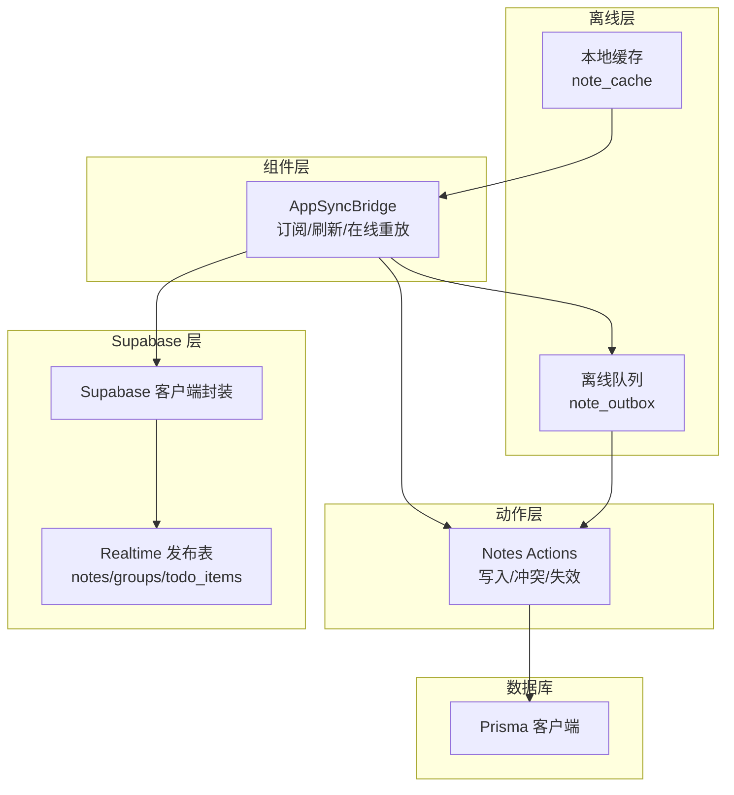
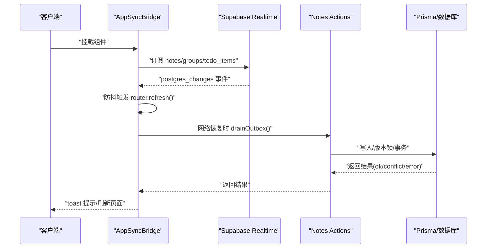
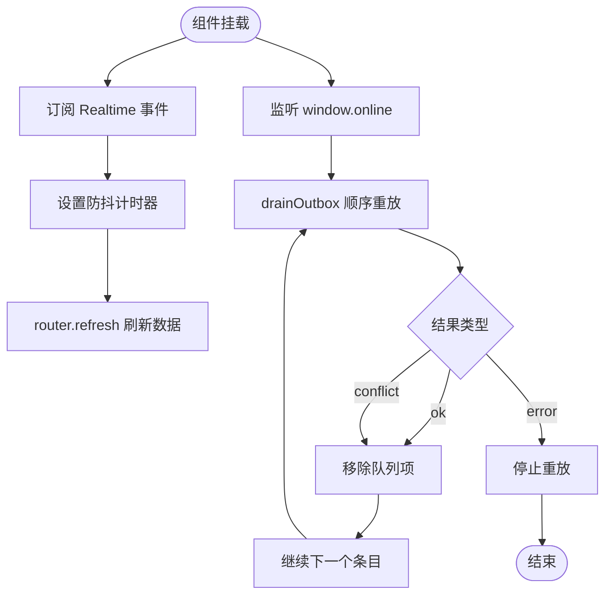
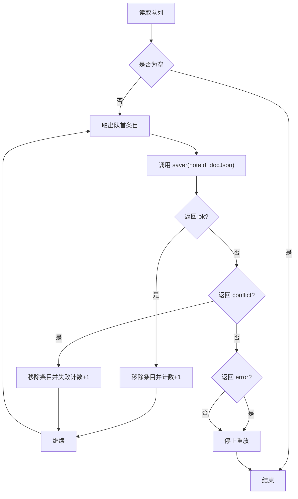
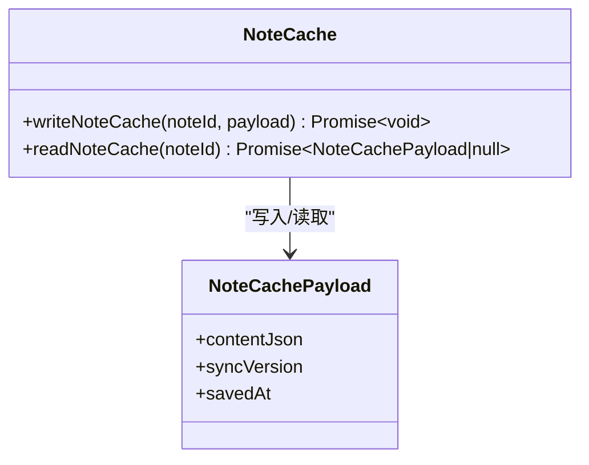
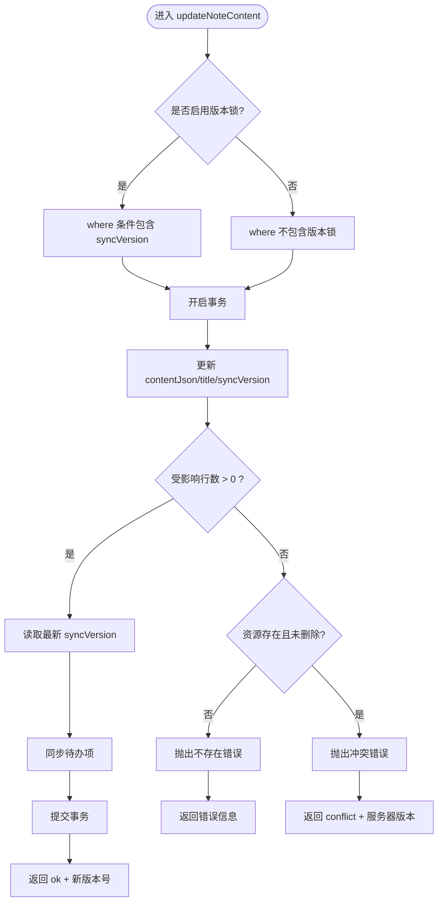
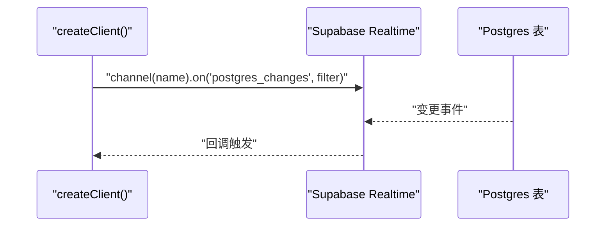
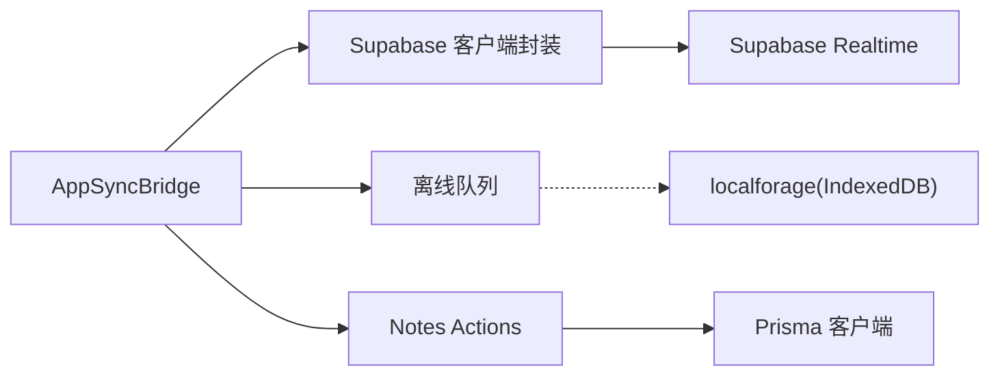

# 实时同步架构

<cite>
**本文引用的文件**
- [src/components/app/app-sync-bridge.tsx](file://src/components/app/app-sync-bridge.tsx)
- [src/lib/offline/note-outbox.ts](file://src/lib/offline/note-outbox.ts)
- [src/lib/offline/note-cache.ts](file://src/lib/offline/note-cache.ts)
- [src/actions/notes.ts](file://src/actions/notes.ts)
- [src/lib/supabase/client.ts](file://src/lib/supabase/client.ts)
- [supabase/migrations/20260513140000_realtime_publication.sql](file://supabase/migrations/20260513140000_realtime_publication.sql)
- [package.json](file://package.json)
- [src/lib/db/index.ts](file://src/lib/db/index.ts)
</cite>

## 目录
1. [简介](#简介)
2. [项目结构](#项目结构)
3. [核心组件](#核心组件)
4. [架构总览](#架构总览)
5. [详细组件分析](#详细组件分析)
6. [依赖关系分析](#依赖关系分析)
7. [性能考量](#性能考量)
8. [故障排查指南](#故障排查指南)
9. [结论](#结论)
10. [附录](#附录)

## 简介
本文件面向 Smart-Todo 的实时同步架构，系统性阐述以下主题：
- Supabase Realtime 的集成方式：订阅机制、事件监听与数据更新触发流程
- 离线优先设计：本地存储策略、队列管理与网络恢复机制
- 同步桥接组件工作原理：冲突检测、版本控制与一致性保障
- 离线队列系统：IndexedDB（localforage）存储、消息序列化与顺序重放策略
- 性能优化、错误处理与重试机制
- 同步架构的监控与调试方法

## 项目结构
Smart-Todo 采用 Next.js App Router 架构，实时同步相关代码主要分布在以下模块：
- 组件层：应用壳内的同步桥接组件，负责订阅与网络状态监听
- 动作层：服务端动作，承载数据库写入、并发控制与缓存失效
- 离线层：基于 localforage 的 IndexedDB 存储，实现离线队列与缓存
- Supabase 层：客户端封装与数据库迁移配置

图表来源
- [src/components/app/app-sync-bridge.tsx:16-117](file://src/components/app/app-sync-bridge.tsx#L16-L117)
- [src/lib/offline/note-outbox.ts:1-87](file://src/lib/offline/note-outbox.ts#L1-L87)
- [src/lib/offline/note-cache.ts:1-25](file://src/lib/offline/note-cache.ts#L1-L25)
- [src/actions/notes.ts:59-138](file://src/actions/notes.ts#L59-L138)
- [src/lib/supabase/client.ts:1-9](file://src/lib/supabase/client.ts#L1-L9)
- [supabase/migrations/20260513140000_realtime_publication.sql:1-6](file://supabase/migrations/20260513140000_realtime_publication.sql#L1-L6)

章节来源
- [src/components/app/app-sync-bridge.tsx:16-117](file://src/components/app/app-sync-bridge.tsx#L16-L117)
- [src/lib/offline/note-outbox.ts:1-87](file://src/lib/offline/note-outbox.ts#L1-L87)
- [src/lib/offline/note-cache.ts:1-25](file://src/lib/offline/note-cache.ts#L1-L25)
- [src/actions/notes.ts:59-138](file://src/actions/notes.ts#L59-L138)
- [src/lib/supabase/client.ts:1-9](file://src/lib/supabase/client.ts#L1-L9)
- [supabase/migrations/20260513140000_realtime_publication.sql:1-6](file://supabase/migrations/20260513140000_realtime_publication.sql#L1-L6)

## 核心组件
- 同步桥接组件（AppSyncBridge）
  - 订阅 Supabase Realtime 的 notes/groups/todo_items 表变更
  - 使用防抖触发路由刷新，确保 UI 与数据一致
  - 监听 online 事件，在网络恢复时顺序重放离线队列
- 离线队列（note-outbox）
  - 基于 localforage 的 IndexedDB 存储
  - 以“最后一次编辑为准”的 LWW（Last Writer Wins）策略
  - 提供入队、列表查询、移除与顺序重放能力
- 本地缓存（note-cache）
  - 存储便签的 contentJson、syncVersion 与 savedAt 时间戳
  - 支持读取与写入，便于快速回放与一致性判断
- 服务端动作（Notes Actions）
  - 负责并发写入、版本锁与冲突检测
  - 返回统一的结果类型，支持成功、冲突与错误
- Supabase 客户端封装
  - 提供 createClient 方法，注入环境变量中的 Supabase URL 与匿名密钥
- 数据库客户端（Prisma）
  - 提供全局单例 PrismaClient，开发模式下输出日志

章节来源
- [src/components/app/app-sync-bridge.tsx:16-117](file://src/components/app/app-sync-bridge.tsx#L16-L117)
- [src/lib/offline/note-outbox.ts:1-87](file://src/lib/offline/note-outbox.ts#L1-L87)
- [src/lib/offline/note-cache.ts:1-25](file://src/lib/offline/note-cache.ts#L1-L25)
- [src/actions/notes.ts:59-138](file://src/actions/notes.ts#L59-L138)
- [src/lib/supabase/client.ts:1-9](file://src/lib/supabase/client.ts#L1-L9)
- [src/lib/db/index.ts:1-16](file://src/lib/db/index.ts#L1-L16)

## 架构总览
Smart-Todo 的实时同步由“事件驱动 + 离线优先”构成：
- 服务器侧：通过 Supabase Realtime 将 notes/groups/todo_items 的变更广播给客户端
- 客户端侧：AppSyncBridge 订阅变更并触发路由刷新；同时在网络恢复时顺序重放离线队列
- 写入路径：编辑器内容经服务端动作落库，使用 syncVersion 实现乐观并发控制
- 本地存储：离线期间的内容被入队到 IndexedDB；网络恢复后按序尝试上传

图表来源
- [src/components/app/app-sync-bridge.tsx:37-114](file://src/components/app/app-sync-bridge.tsx#L37-L114)
- [src/actions/notes.ts:59-138](file://src/actions/notes.ts#L59-L138)

## 详细组件分析

### 同步桥接组件（AppSyncBridge）
职责与行为：
- 订阅 Supabase Realtime
  - 为每个用户创建独立频道，过滤 user_id
  - 监听 notes/groups/todo_items 的所有事件类型
  - 事件到达时通过防抖触发 router.refresh，避免频繁刷新
- 在线重放离线队列
  - 监听 window.online 事件
  - 调用 drainOutbox 顺序重放队列
  - 依据返回结果提示用户同步进度与潜在冲突

图表来源
- [src/components/app/app-sync-bridge.tsx:37-114](file://src/components/app/app-sync-bridge.tsx#L37-L114)
- [src/lib/offline/note-outbox.ts:48-86](file://src/lib/offline/note-outbox.ts#L48-L86)

章节来源
- [src/components/app/app-sync-bridge.tsx:16-117](file://src/components/app/app-sync-bridge.tsx#L16-L117)

### 离线队列系统（note-outbox）
- 存储介质：IndexedDB（localforage 实例）
- 结构：数组形式存储 OutboxEntry，键名固定为 pending_saves
- 入队策略：同一 noteId 的新条目会覆盖旧条目，保留最后一次编辑
- 顺序重放：按队列头部顺序依次尝试上传，遇到冲突或错误时停止或继续
- 结果处理：
  - 成功：移除该条目，计数器 +1
  - 冲突：移除该条目，失败计数 +1
  - 错误：停止后续重放

图表来源
- [src/lib/offline/note-outbox.ts:17-41](file://src/lib/offline/note-outbox.ts#L17-L41)
- [src/lib/offline/note-outbox.ts:48-86](file://src/lib/offline/note-outbox.ts#L48-L86)

章节来源
- [src/lib/offline/note-outbox.ts:1-87](file://src/lib/offline/note-outbox.ts#L1-L87)

### 本地缓存（note-cache）
- 用途：记录便签的 contentJson、syncVersion 与 savedAt，便于快速回放与一致性判断
- 存储键：以 noteId 为前缀的字符串键
- 接口：读取与写入两个基础操作

图表来源
- [src/lib/offline/note-cache.ts:8-24](file://src/lib/offline/note-cache.ts#L8-L24)

章节来源
- [src/lib/offline/note-cache.ts:1-25](file://src/lib/offline/note-cache.ts#L1-L25)

### 服务端动作与并发控制（Notes Actions）
- 写入接口：updateNoteContent
  - 支持期望版本锁（expectedSyncVersion）与跳过版本锁（离线重放场景）
  - 使用数据库事务执行更新，并递增 syncVersion
  - 若更新影响行数为 0，则判定为冲突或资源不存在
- 冲突检测：
  - 返回统一结果类型，包含 ok、conflict 与 error
  - 冲突时返回服务器当前 syncVersion，用于上层处理
- 缓存失效：写入后对相关路径进行 revalidate，确保 Next.js 缓存一致性

图表来源
- [src/actions/notes.ts:59-138](file://src/actions/notes.ts#L59-L138)

章节来源
- [src/actions/notes.ts:59-138](file://src/actions/notes.ts#L59-L138)

### Supabase Realtime 集成与发布表配置
- 客户端封装：createClient 从环境变量读取 Supabase URL 与匿名密钥
- 发布表配置：将 notes/groups/todo_items 加入 supabase_realtime publication，允许客户端订阅
- 订阅范围：按 user_id 过滤，确保每用户独立频道

图表来源
- [src/lib/supabase/client.ts:1-9](file://src/lib/supabase/client.ts#L1-L9)
- [supabase/migrations/20260513140000_realtime_publication.sql:1-6](file://supabase/migrations/20260513140000_realtime_publication.sql#L1-L6)

章节来源
- [src/lib/supabase/client.ts:1-9](file://src/lib/supabase/client.ts#L1-L9)
- [supabase/migrations/20260513140000_realtime_publication.sql:1-6](file://supabase/migrations/20260513140000_realtime_publication.sql#L1-L6)

## 依赖关系分析
- 组件依赖
  - AppSyncBridge 依赖 Supabase 客户端封装与离线队列
  - 在线重放依赖服务端动作（saveNoteFromEditor）以执行实际写入
- 数据流
  - 编辑器内容 → 离线队列（enqueue）→ 网络恢复 → 服务端动作（写入/冲突）→ UI 刷新
- 外部依赖
  - localforage（IndexedDB）
  - @supabase/supabase-js 与 @supabase/ssr
  - Prisma 客户端

图表来源
- [src/components/app/app-sync-bridge.tsx:16-117](file://src/components/app/app-sync-bridge.tsx#L16-L117)
- [src/lib/offline/note-outbox.ts:1-87](file://src/lib/offline/note-outbox.ts#L1-L87)
- [src/actions/notes.ts:59-138](file://src/actions/notes.ts#L59-L138)
- [src/lib/supabase/client.ts:1-9](file://src/lib/supabase/client.ts#L1-L9)
- [package.json:22-60](file://package.json#L22-L60)

章节来源
- [package.json:22-60](file://package.json#L22-L60)

## 性能考量
- 防抖刷新
  - 使用固定延迟对 Realtime 事件进行防抖，减少不必要的 router.refresh 调用
- 顺序重放
  - 离线队列按序重放，避免并发写入带来的复杂冲突
- 版本锁与乐观并发
  - 正常编辑使用版本锁，冲突时返回服务器版本，便于上层处理
- 缓存与失效
  - 服务端写入后对相关路径进行 revalidate，降低缓存不一致风险

章节来源
- [src/components/app/app-sync-bridge.tsx:10](file://src/components/app/app-sync-bridge.tsx#L10)
- [src/actions/notes.ts:64-75](file://src/actions/notes.ts#L64-L75)

## 故障排查指南
- Realtime 订阅错误
  - 当通道状态为 CHANNEL_ERROR 时，组件会打印警告日志
  - 检查 Supabase URL/匿名密钥与发布表配置是否正确
- 冲突处理
  - 当服务端返回 conflict 时，离线队列会移除该条目并计入失败
  - 建议在 UI 层提示用户查看最新版本或重新编辑
- 离线重放失败
  - 若 saver 抛出异常或返回 error，重放会停止
  - 检查网络状态、服务端可达性与数据库连接
- 缓存与队列
  - 如发现内容不同步，检查 note-cache 与 note-outbox 是否存在异常条目
  - 可通过 listOutbox 查看队列状态

章节来源
- [src/components/app/app-sync-bridge.tsx:79-83](file://src/components/app/app-sync-bridge.tsx#L79-L83)
- [src/lib/offline/note-outbox.ts:48-86](file://src/lib/offline/note-outbox.ts#L48-L86)
- [src/actions/notes.ts:121-133](file://src/actions/notes.ts#L121-L133)

## 结论
Smart-Todo 的实时同步架构以“事件驱动 + 离线优先”为核心：
- 通过 Supabase Realtime 实现低延迟的数据变更通知
- 通过 AppSyncBridge 将事件转化为 UI 刷新与离线重放
- 通过服务端动作与 syncVersion 实现乐观并发与冲突检测
- 通过 IndexedDB 队列与缓存实现可靠的离线体验与一致性保障
整体方案在可用性、性能与可维护性之间取得平衡，适合多端协作场景。

## 附录
- 关键实现位置参考
  - 同步桥接组件：[src/components/app/app-sync-bridge.tsx](file://src/components/app/app-sync-bridge.tsx)
  - 离线队列：[src/lib/offline/note-outbox.ts](file://src/lib/offline/note-outbox.ts)
  - 本地缓存：[src/lib/offline/note-cache.ts](file://src/lib/offline/note-cache.ts)
  - 服务端动作：[src/actions/notes.ts](file://src/actions/notes.ts)
  - Supabase 客户端封装：[src/lib/supabase/client.ts](file://src/lib/supabase/client.ts)
  - 发布表配置：[supabase/migrations/20260513140000_realtime_publication.sql](file://supabase/migrations/20260513140000_realtime_publication.sql)
  - 数据库客户端：[src/lib/db/index.ts](file://src/lib/db/index.ts)
  - 依赖声明：[package.json](file://package.json)