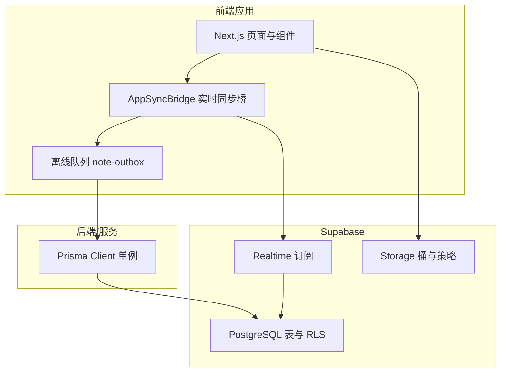
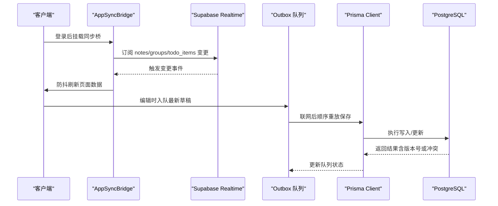
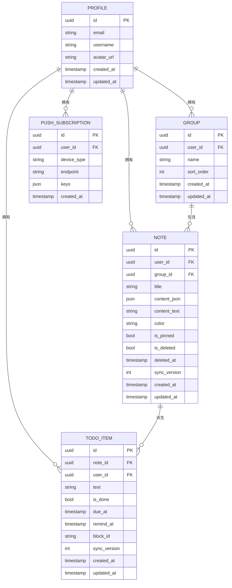
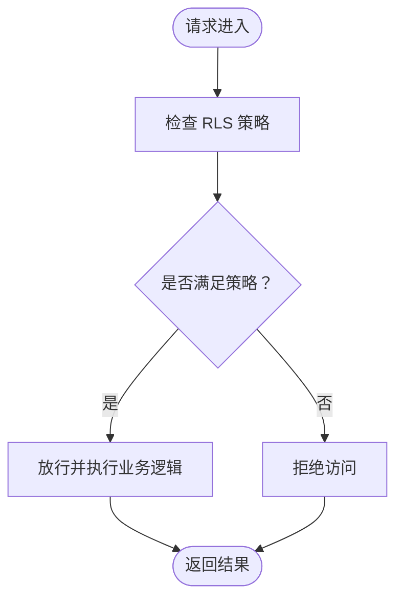
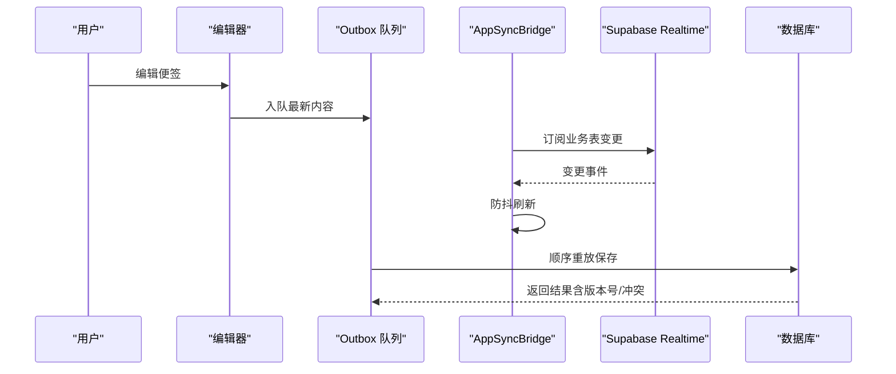
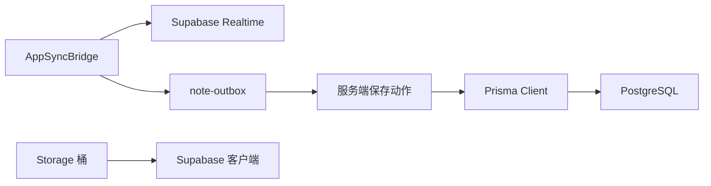

# 数据架构设计

<cite>
**本文引用的文件**
- [prisma/schema.prisma](file://prisma/schema.prisma)
- [supabase/migrations/20260513000000_enable_rls_policies.sql](file://supabase/migrations/20260513000000_enable_rls_policies.sql)
- [supabase/migrations/20260513120000_storage_note_images.sql](file://supabase/migrations/20260513120000_storage_note_images.sql)
- [supabase/migrations/20260513140000_realtime_publication.sql](file://supabase/migrations/20260513140000_realtime_publication.sql)
- [src/lib/db/index.ts](file://src/lib/db/index.ts)
- [src/components/app/app-sync-bridge.tsx](file://src/components/app/app-sync-bridge.tsx)
- [src/lib/offline/note-outbox.ts](file://src/lib/offline/note-outbox.ts)
- [src/lib/supabase/client.ts](file://src/lib/supabase/client.ts)
</cite>

## 目录
1. [简介](#简介)
2. [项目结构](#项目结构)
3. [核心组件](#核心组件)
4. [架构总览](#架构总览)
5. [详细组件分析](#详细组件分析)
6. [依赖分析](#依赖分析)
7. [性能考虑](#性能考虑)
8. [故障排查指南](#故障排查指南)
9. [结论](#结论)
10. [附录](#附录)

## 简介
本文件系统化梳理 Smart-Todo 的数据架构，围绕 Prisma ORM 设计与使用、Supabase PostgreSQL 架构、数据同步机制、数据访问层设计、数据安全策略以及数据迁移与版本管理进行深入说明。目标是帮助开发者与运维人员快速理解并高效维护该系统的数据层。

## 项目结构
Smart-Todo 的数据层由以下关键部分组成：
- 数据模型与 ORM：基于 Prisma 定义的业务模型与关系映射，统一生成类型安全的查询接口。
- 数据库与安全：基于 Supabase 的 PostgreSQL，启用行级安全策略（RLS）与实时发布（Realtime）。
- 实时同步与离线：通过 Supabase Realtime 订阅业务表变更，结合本地 outbox 队列实现离线恢复与冲突处理。
- 数据访问层：以 PrismaClient 单例形式提供连接管理与日志配置，避免重复初始化。
- 存储与策略：Storage 桶用于便签图片，配合 Storage RLS 策略实现按用户隔离的文件访问。

图表来源
- [src/components/app/app-sync-bridge.tsx:1-118](file://src/components/app/app-sync-bridge.tsx#L1-L118)
- [src/lib/offline/note-outbox.ts:1-87](file://src/lib/offline/note-outbox.ts#L1-L87)
- [src/lib/db/index.ts:1-16](file://src/lib/db/index.ts#L1-L16)
- [supabase/migrations/20260513140000_realtime_publication.sql:1-7](file://supabase/migrations/20260513140000_realtime_publication.sql#L1-L7)
- [supabase/migrations/20260513120000_storage_note_images.sql:1-51](file://supabase/migrations/20260513120000_storage_note_images.sql#L1-L51)
- [supabase/migrations/20260513000000_enable_rls_policies.sql:1-203](file://supabase/migrations/20260513000000_enable_rls_policies.sql#L1-L203)

章节来源
- [prisma/schema.prisma:1-117](file://prisma/schema.prisma#L1-L117)
- [src/lib/db/index.ts:1-16](file://src/lib/db/index.ts#L1-L16)
- [src/lib/supabase/client.ts:1-9](file://src/lib/supabase/client.ts#L1-L9)

## 核心组件
- Prisma 数据模型：定义用户资料、分组、便签、待办项与推送订阅等实体及其关系、索引与映射。
- Supabase RLS 策略：为每个业务表建立“仅本人可见/修改/删除”的策略，并对跨表约束进行校验。
- 实时发布与订阅：将业务表加入 supabase_realtime 发布，前端通过 postgres_changes 订阅变更。
- 数据访问层：PrismaClient 单例，开发环境开启查询日志，生产环境聚焦错误日志。
- 离线同步：本地 outbox 队列保存最近一次编辑，联网后顺序重放并处理冲突。

章节来源
- [prisma/schema.prisma:15-117](file://prisma/schema.prisma#L15-L117)
- [supabase/migrations/20260513000000_enable_rls_policies.sql:34-203](file://supabase/migrations/20260513000000_enable_rls_policies.sql#L34-L203)
- [supabase/migrations/20260513140000_realtime_publication.sql:1-7](file://supabase/migrations/20260513140000_realtime_publication.sql#L1-L7)
- [src/lib/db/index.ts:7-15](file://src/lib/db/index.ts#L7-L15)
- [src/lib/offline/note-outbox.ts:26-86](file://src/lib/offline/note-outbox.ts#L26-L86)

## 架构总览
下图展示数据流从客户端到数据库的关键路径，包括实时订阅、离线队列与服务端 Prisma 访问。

图表来源
- [src/components/app/app-sync-bridge.tsx:37-114](file://src/components/app/app-sync-bridge.tsx#L37-L114)
- [src/lib/offline/note-outbox.ts:49-86](file://src/lib/offline/note-outbox.ts#L49-L86)
- [src/lib/db/index.ts:7-15](file://src/lib/db/index.ts#L7-L15)

## 详细组件分析

### Prisma 数据模型与关系映射
- 用户资料 Profile：与认证用户一对一，承载用户基本信息，关联分组、便签、待办与推送订阅。
- 分组 Group：属于单个用户，支持排序字段，与便签一对多。
- 便签 Note：属于单个用户，可选归属分组；包含富文本 JSON 结构与纯文本快照；带软删除与同步版本号；索引覆盖用户-删除-置顶-更新时间等常用筛选。
- 待办项 TodoItem：从便签 JSON 中抽取，与便签和用户强关联；唯一性约束保证同一便签内 blockId 唯一；索引覆盖提醒时间、完成状态与到期时间等查询场景。
- 推送订阅 PushSubscription：记录设备端推送信息，按用户隔离。

图表来源
- [prisma/schema.prisma:16-116](file://prisma/schema.prisma#L16-L116)

章节来源
- [prisma/schema.prisma:15-117](file://prisma/schema.prisma#L15-L117)

### Supabase PostgreSQL 架构与索引策略
- 表结构设计：遵循 Prisma 映射，所有主键与外键均使用 UUID 类型，确保分布式与去中心化标识能力。
- 索引策略：
  - notes：复合索引覆盖用户-删除-置顶-更新时间，满足列表检索与排序需求。
  - notes.group_id：单独索引，加速分组过滤。
  - todo_items：针对用户+提醒时间、用户+完成状态+到期时间、note_id 建立索引，支撑提醒与聚合视图查询。
  - groups.user_id：索引保障按用户查询效率。
  - push_subscriptions.user_id：索引保障推送订阅查询效率。
- 关系约束：外键级联删除与设置空值策略，确保数据一致性与软删除场景下的可追踪性。

章节来源
- [prisma/schema.prisma:44-98](file://prisma/schema.prisma#L44-L98)

### 数据安全策略：行级安全策略（RLS）
- 启用 RLS：对 profiles、groups、notes、todo_items、push_subscriptions 启用行级安全。
- 策略规则：
  - 仅本人可读写：使用 auth.uid() 进行过滤。
  - 跨表约束：notes 插入/更新时校验 group_id 属于当前用户；todo_items 插入/更新时校验 note_id 对应的 user_id 与当前用户一致。
  - 存储桶策略：Storage 桶 note-images 仅允许当前用户目录内的文件操作，限制 MIME 类型与大小。
- 服务端豁免：服务端使用数据库直连角色，不受 RLS 限制，适合后台任务与批处理。

图表来源
- [supabase/migrations/20260513000000_enable_rls_policies.sql:34-203](file://supabase/migrations/20260513000000_enable_rls_policies.sql#L34-L203)
- [supabase/migrations/20260513120000_storage_note_images.sql:18-50](file://supabase/migrations/20260513120000_storage_note_images.sql#L18-L50)

章节来源
- [supabase/migrations/20260513000000_enable_rls_policies.sql:1-203](file://supabase/migrations/20260513000000_enable_rls_policies.sql#L1-L203)
- [supabase/migrations/20260513120000_storage_note_images.sql:1-51](file://supabase/migrations/20260513120000_storage_note_images.sql#L1-L51)

### 实时数据流与版本控制
- 实时订阅：将 notes、groups、todo_items 加入 supabase_realtime 发布，前端通过 postgres_changes 订阅 user_id 过滤的变更事件。
- 防抖刷新：收到变更后进行防抖处理，减少频繁路由刷新带来的性能开销。
- 版本控制：便签与待办项均包含 sync_version 字段，用于最后写入获胜（LWW）的冲突解决基础。
- 离线队列：编辑器产生的最新内容入队，联网后顺序重放保存，处理成功、冲突与失败三类结果。

图表来源
- [src/components/app/app-sync-bridge.tsx:37-114](file://src/components/app/app-sync-bridge.tsx#L37-L114)
- [src/lib/offline/note-outbox.ts:49-86](file://src/lib/offline/note-outbox.ts#L49-L86)
- [supabase/migrations/20260513140000_realtime_publication.sql:4-6](file://supabase/migrations/20260513140000_realtime_publication.sql#L4-L6)

章节来源
- [src/components/app/app-sync-bridge.tsx:1-118](file://src/components/app/app-sync-bridge.tsx#L1-L118)
- [src/lib/offline/note-outbox.ts:1-87](file://src/lib/offline/note-outbox.ts#L1-L87)
- [supabase/migrations/20260513140000_realtime_publication.sql:1-7](file://supabase/migrations/20260513140000_realtime_publication.sql#L1-L7)

### 数据访问层设计：Repository 模式、事务与连接池
- Repository 模式：通过 Prisma Client 提供的类型化查询方法实现数据访问，避免直接手写 SQL，提升可维护性与安全性。
- 事务处理：在需要强一致性的批量操作中，使用 Prisma 的事务 API 包裹多个写入步骤，确保原子性。
- 连接池管理：PrismaClient 单例避免重复初始化，开发环境开启查询日志便于调试；生产环境聚焦错误日志，降低噪声。
- 服务端直连：服务端任务使用 directUrl 直连数据库，绕过 RLS，适用于后台作业与批处理。

章节来源
- [src/lib/db/index.ts:1-16](file://src/lib/db/index.ts#L1-L16)
- [prisma/schema.prisma:9-13](file://prisma/schema.prisma#L9-L13)

### 数据迁移策略与版本管理
- 迁移脚本：通过 Supabase Migration 文件管理数据库结构演进，RLS 策略、Storage 桶与 Realtime 发布均以独立脚本形式存在，便于版本化与回滚。
- 可重复执行：RLS 清理旧策略后再创建，支持重复部署；Storage 桶通过 upsert 保持幂等。
- 发布与订阅：Realtime 发布表变更需在 Supabase 控制台开启 Realtime 后执行，若已存在则忽略，避免重复添加。

章节来源
- [supabase/migrations/20260513000000_enable_rls_policies.sql:1-7](file://supabase/migrations/20260513000000_enable_rls_policies.sql#L1-L7)
- [supabase/migrations/20260513120000_storage_note_images.sql:4-16](file://supabase/migrations/20260513120000_storage_note_images.sql#L4-L16)
- [supabase/migrations/20260513140000_realtime_publication.sql:1-7](file://supabase/migrations/20260513140000_realtime_publication.sql#L1-L7)

## 依赖分析
- 前端依赖 Supabase 客户端用于实时订阅与存储访问。
- 同步桥依赖 Realtime 发布与业务表过滤条件。
- 离线队列依赖浏览器本地存储，顺序重放依赖服务端保存动作。
- 服务端依赖 Prisma Client 单例与数据库直连配置。

图表来源
- [src/components/app/app-sync-bridge.tsx:37-114](file://src/components/app/app-sync-bridge.tsx#L37-L114)
- [src/lib/offline/note-outbox.ts:49-86](file://src/lib/offline/note-outbox.ts#L49-L86)
- [src/lib/supabase/client.ts:1-9](file://src/lib/supabase/client.ts#L1-L9)
- [src/lib/db/index.ts:7-15](file://src/lib/db/index.ts#L7-L15)

章节来源
- [src/lib/supabase/client.ts:1-9](file://src/lib/supabase/client.ts#L1-L9)
- [src/lib/db/index.ts:1-16](file://src/lib/db/index.ts#L1-L16)

## 性能考虑
- 查询优化：根据现有索引策略，优先使用用户维度与时间维度的过滤条件；避免全表扫描，必要时补充复合索引。
- 实时订阅：合理设置防抖间隔，平衡实时性与性能；仅订阅必要表与必要字段。
- 离线队列：顺序重放时注意失败重试与退避策略，避免阻塞后续条目。
- 连接池：保持 PrismaClient 单例，避免频繁创建销毁；生产环境减少日志级别以降低 IO 开销。
- 存储访问：限制文件大小与类型，避免超大图片占用带宽与存储空间。

## 故障排查指南
- 实时订阅无响应
  - 检查 Supabase 控制台是否已开启 Realtime。
  - 确认业务表已加入 supabase_realtime 发布。
  - 核对前端过滤条件 user_id 是否正确。
- RLS 拒绝访问
  - 确认当前会话 JWT 中的 auth.uid() 与数据 user_id 一致。
  - 检查跨表约束策略（如 notes 的 group_id 属于当前用户）。
- 离线同步失败
  - 查看 outbox 队列是否堆积，逐条重放并记录错误原因。
  - 处理冲突：当返回冲突时，建议提示用户合并或保留最新本地内容。
- Prisma 日志定位
  - 开发环境可查看查询日志，定位慢查询与异常 SQL。
  - 生产环境聚焦错误日志，避免过多告警噪声。

章节来源
- [supabase/migrations/20260513140000_realtime_publication.sql:1-7](file://supabase/migrations/20260513140000_realtime_publication.sql#L1-L7)
- [supabase/migrations/20260513000000_enable_rls_policies.sql:84-122](file://supabase/migrations/20260513000000_enable_rls_policies.sql#L84-L122)
- [src/lib/offline/note-outbox.ts:49-86](file://src/lib/offline/note-outbox.ts#L49-L86)
- [src/lib/db/index.ts:9-11](file://src/lib/db/index.ts#L9-L11)

## 结论
Smart-Todo 的数据架构以 Prisma ORM 为核心，结合 Supabase 的 RLS、Realtime 与 Storage，构建了安全、可扩展且具备离线能力的数据系统。通过合理的索引策略、版本控制与离线队列，系统在多端协作与弱网环境下仍能保持良好的用户体验。建议持续关注查询性能、实时订阅稳定性与迁移脚本的幂等性，确保长期演进的可维护性。

## 附录
- 环境变量与配置要点
  - DATABASE_URL/DIRECT_URL：数据库连接字符串，区分应用连接与服务端直连。
  - NEXT_PUBLIC_SUPABASE_URL/NEXT_PUBLIC_SUPABASE_ANON_KEY：前端 Supabase 客户端初始化参数。
- 最佳实践
  - 新增字段时同步补充索引与迁移脚本。
  - 对敏感操作（删除、跨表变更）增加审计日志。
  - 定期审查 RLS 策略，确保与业务边界一致。