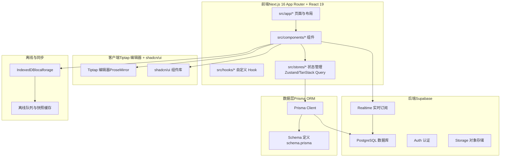
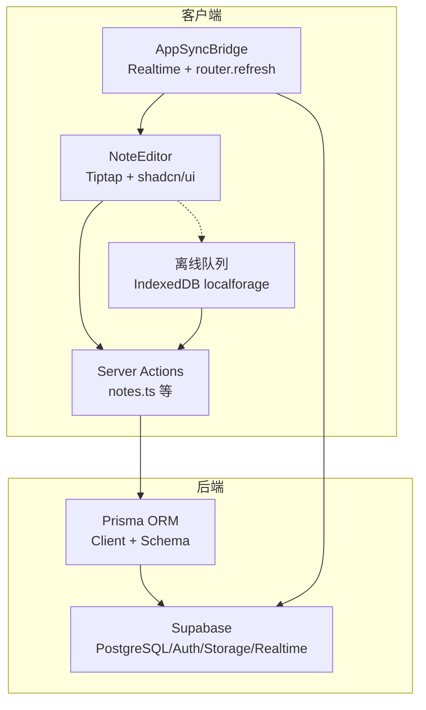
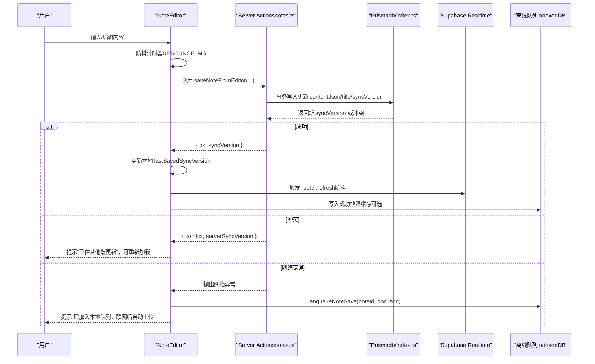
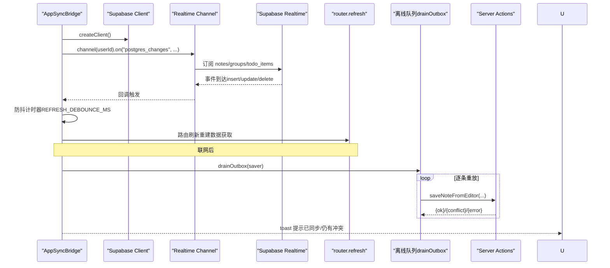
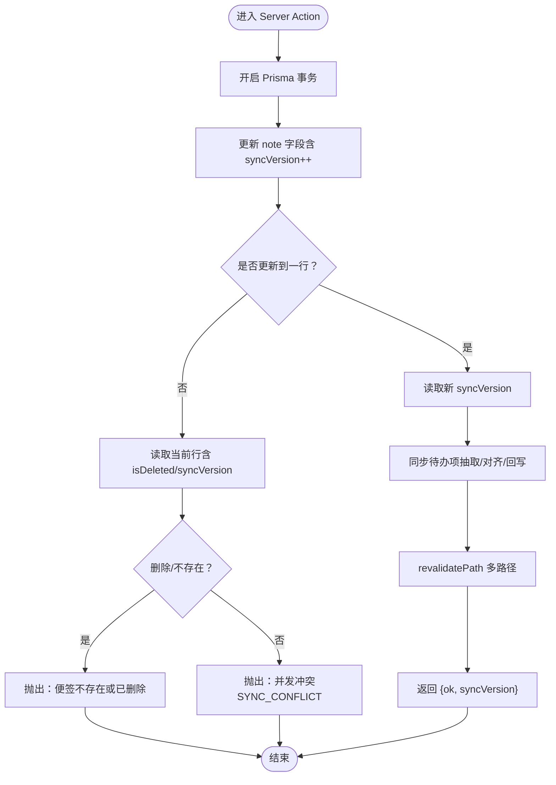
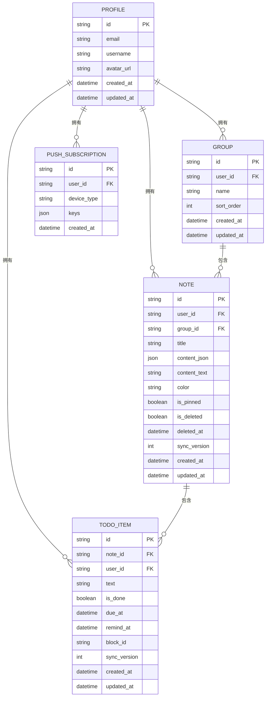
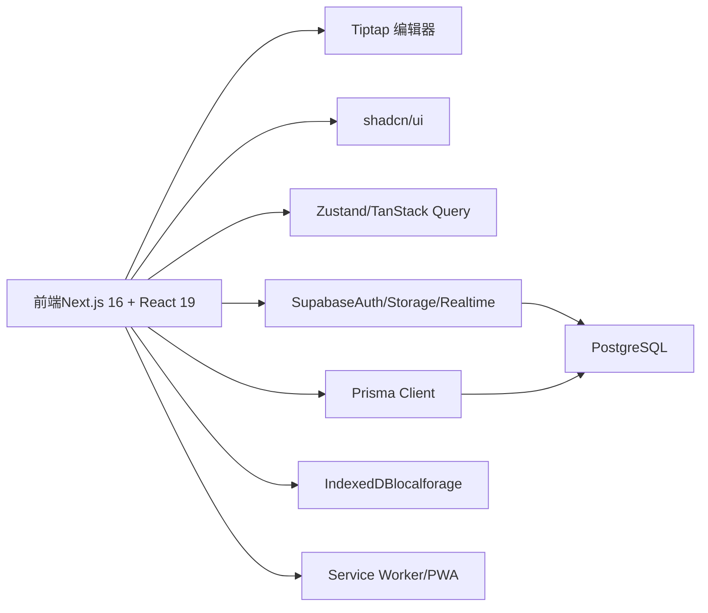

# 架构设计

<cite>
**本文引用的文件**
- [README.md](file://README.md)
- [package.json](file://package.json)
- [next.config.ts](file://next.config.ts)
- [prisma/schema.prisma](file://prisma/schema.prisma)
- [src/app/layout.tsx](file://src/app/layout.tsx)
- [src/proxy.ts](file://src/proxy.ts)
- [src/lib/supabase/client.ts](file://src/lib/supabase/client.ts)
- [src/lib/db/index.ts](file://src/lib/db/index.ts)
- [src/components/app/app-sync-bridge.tsx](file://src/components/app/app-sync-bridge.tsx)
- [src/lib/offline/note-outbox.ts](file://src/lib/offline/note-outbox.ts)
- [src/actions/notes.ts](file://src/actions/notes.ts)
- [src/components/editor/note-editor.tsx](file://src/components/editor/note-editor.tsx)
</cite>

## 目录
1. [引言](#引言)
2. [项目结构](#项目结构)
3. [核心组件](#核心组件)
4. [架构总览](#架构总览)
5. [详细组件分析](#详细组件分析)
6. [依赖分析](#依赖分析)
7. [性能考虑](#性能考虑)
8. [故障排查指南](#故障排查指南)
9. [结论](#结论)
10. [附录](#附录)

## 引言
Smart-Todo 是一款“便签 + 待办”的多端同步轻量笔记应用，采用 Next.js 16 App Router + React 19、Supabase（PostgreSQL + Auth + Storage + Realtime）、Prisma ORM、Tiptap 编辑器与 shadcn/ui 组件体系，并结合离线优先与实时同步策略，提供跨设备一致的用户体验。本文档系统梳理整体架构、数据流、组件化设计与可扩展性策略，帮助开发者快速理解与迭代。

章节来源
- [README.md:1-216](file://README.md#L1-L216)

## 项目结构
项目采用按功能域划分的目录组织，前端页面与组件位于 src/app 与 src/components，业务逻辑通过 Server Actions 与客户端组件协作，数据库通过 Prisma 管理，实时同步与鉴权由 Supabase 提供，离线能力通过 IndexedDB（localforage）实现。

图表来源
- [src/app/layout.tsx:1-54](file://src/app/layout.tsx#L1-L54)
- [prisma/schema.prisma:1-117](file://prisma/schema.prisma#L1-L117)
- [src/lib/supabase/client.ts:1-9](file://src/lib/supabase/client.ts#L1-L9)
- [src/lib/db/index.ts:1-16](file://src/lib/db/index.ts#L1-L16)
- [src/lib/offline/note-outbox.ts:1-87](file://src/lib/offline/note-outbox.ts#L1-L87)

章节来源
- [README.md:161-202](file://README.md#L161-L202)

## 核心组件
- Next.js 16 中间件（proxy）：统一刷新 Supabase 会话，匹配除静态资源外的所有请求。
- App Sync Bridge：订阅 Supabase Realtime（notes/groups/todo_items），防抖触发路由刷新，并在联网时尝试刷出本地离线队列。
- Note Editor：基于 Tiptap 的富文本编辑器，集成待办、图片、链接、撤销重做、分组与颜色等操作；具备防抖保存、冲突处理与离线入队能力。
- Server Actions：集中封装 CRUD 与业务操作，配合 Prisma 事务与 revalidatePath，确保一致性与缓存失效。
- 数据层：Prisma Client 与 schema 定义，支撑用户、分组、便签、待办项与推送订阅等模型。
- 离线队列：IndexedDB（localforage）实现 outbox 队列与成功快照缓存，支持冲突检测与重放。

章节来源
- [src/proxy.ts:1-24](file://src/proxy.ts#L1-L24)
- [src/components/app/app-sync-bridge.tsx:1-118](file://src/components/app/app-sync-bridge.tsx#L1-L118)
- [src/components/editor/note-editor.tsx:1-586](file://src/components/editor/note-editor.tsx#L1-L586)
- [src/actions/notes.ts:1-230](file://src/actions/notes.ts#L1-L230)
- [src/lib/db/index.ts:1-16](file://src/lib/db/index.ts#L1-L16)
- [prisma/schema.prisma:1-117](file://prisma/schema.prisma#L1-L117)
- [src/lib/offline/note-outbox.ts:1-87](file://src/lib/offline/note-outbox.ts#L1-L87)

## 架构总览
系统采用“前端组件 + Server Actions + Supabase Realtime + Prisma ORM + IndexedDB 离线”的分层设计。用户在编辑器中进行输入，组件通过 Server Actions 将变更持久化；同时通过 Supabase Realtime 订阅远端变更，结合防抖刷新与路由重建，实现多端一致；离线场景下，变更先入队 IndexedDB，联网后自动重放并处理冲突。

图表来源
- [src/components/editor/note-editor.tsx:1-586](file://src/components/editor/note-editor.tsx#L1-L586)
- [src/actions/notes.ts:1-230](file://src/actions/notes.ts#L1-L230)
- [src/components/app/app-sync-bridge.tsx:1-118](file://src/components/app/app-sync-bridge.tsx#L1-L118)
- [src/lib/offline/note-outbox.ts:1-87](file://src/lib/offline/note-outbox.ts#L1-L87)
- [src/lib/supabase/client.ts:1-9](file://src/lib/supabase/client.ts#L1-L9)
- [src/lib/db/index.ts:1-16](file://src/lib/db/index.ts#L1-L16)
- [prisma/schema.prisma:1-117](file://prisma/schema.prisma#L1-L117)

## 详细组件分析

### 组件 A：NoteEditor（编辑器与保存流程）
- 功能要点
  - 使用 Tiptap 扩展集（含任务列表、占位符、链接、图片、排版等），支持 Markdown 习惯与待办列表。
  - 防抖保存：编辑器内容变更后延迟提交，减少网络请求；失焦时强制保存。
  - 冲突处理：基于服务端返回的 syncVersion 与“预期版本”参数，识别并发冲突并提示用户重新加载。
  - 离线入队：网络异常时将变更入队 IndexedDB，联网后自动重放。
  - 交互：支持撤销/重做、置顶、颜色、分组、图片插入、链接弹窗、软删除确认等。
- 关键流程（保存序列）

图表来源
- [src/components/editor/note-editor.tsx:138-189](file://src/components/editor/note-editor.tsx#L138-L189)
- [src/actions/notes.ts:140-152](file://src/actions/notes.ts#L140-L152)
- [src/lib/db/index.ts:1-16](file://src/lib/db/index.ts#L1-L16)
- [src/lib/offline/note-outbox.ts:27-32](file://src/lib/offline/note-outbox.ts#L27-L32)

章节来源
- [src/components/editor/note-editor.tsx:1-586](file://src/components/editor/note-editor.tsx#L1-L586)
- [src/actions/notes.ts:1-230](file://src/actions/notes.ts#L1-L230)
- [src/lib/offline/note-outbox.ts:1-87](file://src/lib/offline/note-outbox.ts#L1-L87)

### 组件 B：AppSyncBridge（实时同步与离线重放）
- 功能要点
  - 为当前用户建立独立 Realtime 频道，订阅 notes/groups/todo_items 的所有事件。
  - 使用防抖定时器触发 router.refresh，降低频繁刷新带来的性能压力。
  - 监听 online 事件，在联网时调用 drainOutbox 顺序重放离线队列，成功与失败分别统计并提示。
- 关键流程（实时刷新与离线重放）

图表来源
- [src/components/app/app-sync-bridge.tsx:20-114](file://src/components/app/app-sync-bridge.tsx#L20-L114)
- [src/lib/offline/note-outbox.ts:48-86](file://src/lib/offline/note-outbox.ts#L48-L86)
- [src/actions/notes.ts:140-152](file://src/actions/notes.ts#L140-L152)

章节来源
- [src/components/app/app-sync-bridge.tsx:1-118](file://src/components/app/app-sync-bridge.tsx#L1-L118)
- [src/lib/offline/note-outbox.ts:1-87](file://src/lib/offline/note-outbox.ts#L1-L87)

### 组件 C：Server Actions（事务与缓存失效）
- 功能要点
  - 以 use server 方式定义，集中处理业务逻辑（创建/更新/移动/软删/恢复/置顶/着色/永久删除）。
  - 使用 Prisma 事务保证一致性，更新 contentJson、contentText、title、syncVersion，并同步待办项。
  - 通过 revalidatePath 触发 Next.js 缓存失效，确保页面与聚合视图（/todos）及时更新。
  - 支持“预期版本”参数与 skipExpectedVersion（离线重放）两种并发控制策略。
- 关键流程（并发控制与缓存失效）

图表来源
- [src/actions/notes.ts:59-138](file://src/actions/notes.ts#L59-L138)
- [src/lib/db/index.ts:1-16](file://src/lib/db/index.ts#L1-L16)

章节来源
- [src/actions/notes.ts:1-230](file://src/actions/notes.ts#L1-L230)
- [src/lib/db/index.ts:1-16](file://src/lib/db/index.ts#L1-L16)

### 组件 D：数据模型与索引（Prisma Schema）
- 模型关系
  - Profile 与 Note/Group/TodoItem/PushSubscription 一对多。
  - Note 与 Group 多对一（可空），与 TodoItem 一对多。
  - TodoItem 与 Note/Profile 多对一。
  - PushSubscription 与 Profile 多对一。
- 关键索引
  - Note：按 userId/isDeleted/isPinned/updatedAt 组合索引，便于列表排序与筛选。
  - TodoItem：按 userId/remindAt 与 userId/isDone/dueAt 索引，支持提醒与聚合视图查询。
  - TodoItem：noteId/blockId 唯一约束，保证便签 JSON 与待办项一一对应。
- 设计意图
  - 通过唯一约束与事务保障“便签正文 JSON 与待办项”的一致性。
  - 通过索引优化常见查询路径（提醒、聚合、列表）。

图表来源
- [prisma/schema.prisma:15-117](file://prisma/schema.prisma#L15-L117)

章节来源
- [prisma/schema.prisma:1-117](file://prisma/schema.prisma#L1-L117)

### 组件 E：离线队列与缓存（IndexedDB）
- 队列行为
  - enqueue：同一 noteId 只保留最后一次内容，避免冗余。
  - drainOutbox：顺序重放，遇到冲突或错误时停止并统计失败数。
- 缓存策略
  - 成功写入后可写入快照缓存（用于提升加载速度与冲突提示），异常忽略不影响主流程。
- 冲突处理
  - 服务端返回 conflict 时，客户端提示用户重新加载，避免 LWW（最后写入获胜）导致的数据丢失。

```mermaid
flowchart TD
QStart(["enqueueNoteSave"]) --> Read["读取现有队列"]
Read --> Filter["过滤掉相同 noteId 的条目"]
Filter --> Append["追加最新条目"]
Append --> Write["写入队列"]
DStart(["drainOutbox"]) --> Loop{"队列是否为空？"}
Loop --> |是| Done["返回 flushed/failed"]
Loop --> |否| Pop["取出第一条"]
Pop --> Try["调用 saver(noteId, docJson)"]
Try --> Res{"结果类型？"}
Res --> |ok| Remove["移除该条目"] --> IncF["flushed++"] --> Loop
Res --> |conflict| Remove --> IncS["failed++"] --> Loop
Res --> |error| IncS --> Break["停止重放"] --> Done
```

图表来源
- [src/lib/offline/note-outbox.ts:26-86](file://src/lib/offline/note-outbox.ts#L26-L86)

章节来源
- [src/lib/offline/note-outbox.ts:1-87](file://src/lib/offline/note-outbox.ts#L1-L87)

### 组件 F：Next.js 16 中间件与配置
- 中间件（proxy）
  - 名称与导出：Next.js 16 使用 proxy 作为中间件入口，而非 middleware。
  - 匹配规则：排除静态资源、图标与公共资产，对所有其他请求刷新 Supabase 会话。
- 配置
  - next.config.ts 保持默认，最小 Node.js 版本要求 20.9+，打包器默认 Turbopack。
- Next.js 16 特性
  - cookies()/headers()/params/searchParams 必须 await。
  - 固定开发端口 3005，避免与其他 Next 项目冲突。

章节来源
- [src/proxy.ts:1-24](file://src/proxy.ts#L1-L24)
- [next.config.ts:1-8](file://next.config.ts#L1-L8)
- [README.md:204-212](file://README.md#L204-L212)

## 依赖分析
- 前端依赖
  - Next.js 16、React 19、TypeScript、Tailwind CSS v4、shadcn/ui。
  - Tiptap（ProseMirror）富文本引擎，dnd-kit 拖拽，React Hook Form + Zod 表单校验，Zustand + TanStack Query 状态管理。
- 后端依赖
  - Supabase（PostgreSQL、Auth、Storage、Realtime），Prisma ORM。
- 离线与 PWA
  - localforage（IndexedDB）、Service Worker、manifest.json。

图表来源
- [package.json:22-60](file://package.json#L22-L60)
- [src/lib/supabase/client.ts:1-9](file://src/lib/supabase/client.ts#L1-L9)
- [src/lib/db/index.ts:1-16](file://src/lib/db/index.ts#L1-L16)
- [src/lib/offline/note-outbox.ts:1-87](file://src/lib/offline/note-outbox.ts#L1-L87)

章节来源
- [package.json:1-86](file://package.json#L1-L86)

## 性能考虑
- 防抖与批处理
  - 编辑器保存与实时刷新均采用防抖策略，降低网络与渲染压力。
- 事务与索引
  - Server Actions 使用事务保证一致性；Prisma Schema 针对高频查询建立索引，减少慢查询。
- 缓存与重建
  - revalidatePath 结合 Next.js 缓存策略，避免不必要的全量重渲染。
- 离线优先
  - IndexedDB 队列与快照缓存确保在网络不稳定时仍可高效工作，联网后自动重放。
- 打包与运行时
  - Turbopack 默认打包器与固定端口 3005，减少开发时切换成本。

## 故障排查指南
- 实时同步问题
  - 确认 Supabase Realtime publication 是否包含 notes/groups/todo_items；必要时执行数据库脚本注册。
  - 检查 AppSyncBridge 是否正确订阅并触发 router.refresh。
- 并发冲突
  - 保存返回 conflict 时，按提示重新加载；避免强制覆盖他人修改。
- 离线重放
  - 联网后查看 toast 提示；若仍有失败条目，检查服务端返回的 serverSyncVersion 与本地预期版本是否一致。
- 中间件与会话
  - Next.js 16 中间件名称为 proxy，匹配规则需排除静态资源；确保 cookies()/headers()/params/searchParams 已 await。
- PWA 与推送
  - Service Worker 与 manifest.json 已配置；Web Push 需要 VAPID 密钥与 CRON_SECRET，生产环境建议使用云服务器 crontab 定时扫描提醒接口。

章节来源
- [README.md:104-140](file://README.md#L104-L140)
- [src/components/app/app-sync-bridge.tsx:37-91](file://src/components/app/app-sync-bridge.tsx#L37-L91)
- [src/actions/notes.ts:121-133](file://src/actions/notes.ts#L121-L133)
- [src/proxy.ts:8-23](file://src/proxy.ts#L8-L23)

## 结论
Smart-Todo 通过“前端组件 + Server Actions + Supabase Realtime + Prisma ORM + IndexedDB 离线”的分层架构，实现了从用户输入到数据库持久化的高可靠数据流。Next.js 16 的中间件与 App Router 为应用提供了现代化的开发体验；Tiptap 与 shadcn/ui 提升了编辑与交互效率；离线优先与实时同步机制共同保障了跨设备的一致性与稳定性。该架构具备良好的可扩展性与性能表现，适合持续演进与迭代。

## 附录
- 常用脚本
  - 开发：npm run dev（固定端口 3005）
  - 数据库：db:generate/db:push/db:migrate/db:studio/db:reset
  - Supabase：db:rls/db:storage/db:realtime
  - M4 校验：verify:m4-cron
- 环境变量
  - NEXT_PUBLIC_SUPABASE_URL、NEXT_PUBLIC_SUPABASE_ANON_KEY、DATABASE_URL、DIRECT_URL、CRON_SECRET、NEXT_PUBLIC_VAPID_PUBLIC_KEY、VAPID_PRIVATE_KEY、VAPID_SUBJECT、NEXT_PUBLIC_APP_URL 等

章节来源
- [README.md:142-160](file://README.md#L142-L160)
- [package.json:6-21](file://package.json#L6-L21)