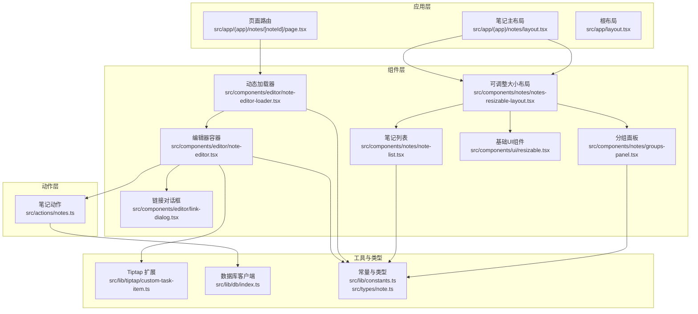
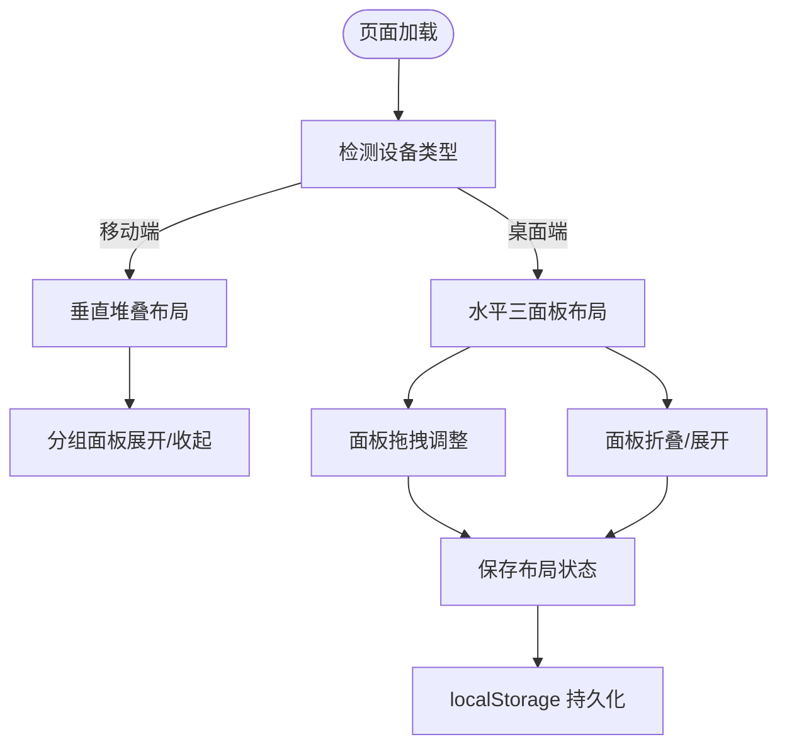
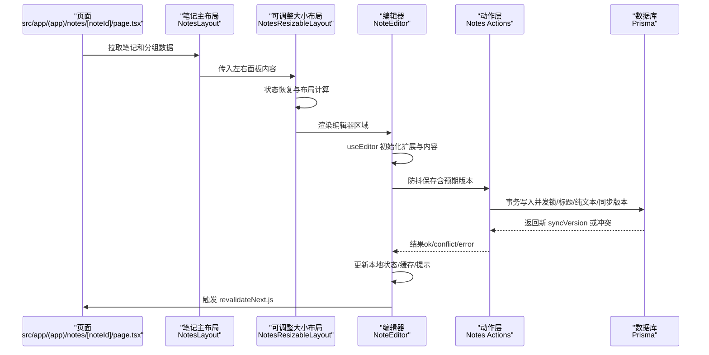
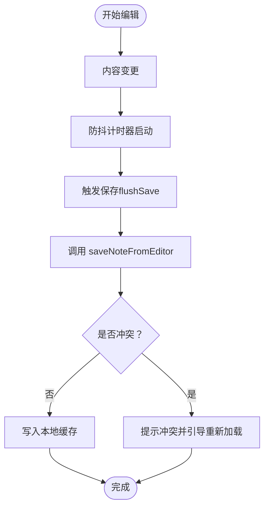
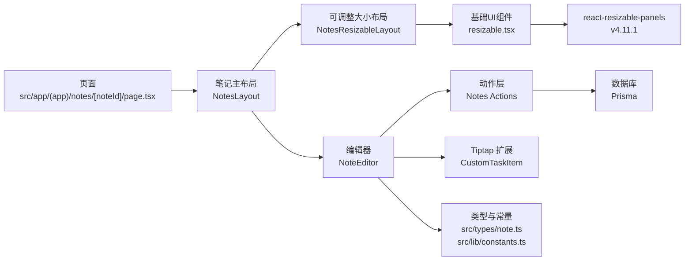

# 组件架构设计

<cite>
**本文引用的文件**
- [resizable.tsx](file://src/components/ui/resizable.tsx)
- [notes-resizable-layout.tsx](file://src/components/notes/notes-resizable-layout.tsx)
- [layout.tsx](file://src/app/(app)/notes/layout.tsx)
- [groups-panel.tsx](file://src/components/notes/groups-panel.tsx)
- [note-list.tsx](file://src/components/notes/note-list.tsx)
- [note-editor.tsx](file://src/components/editor/note-editor.tsx)
- [note-editor-loader.tsx](file://src/components/editor/note-editor-loader.tsx)
- [link-dialog.tsx](file://src/components/editor/link-dialog.tsx)
- [custom-task-item.ts](file://src/lib/tiptap/custom-task-item.ts)
- [notes.ts](file://src/actions/notes.ts)
- [page.tsx](file://src/app/(app)/notes/[noteId]/page.tsx)
- [layout.tsx:1-91](file://src/app/(app)/notes/layout.tsx#L1-L91)
- [layout.tsx:1-54](file://src/app/layout.tsx#L1-L54)
- [components.json:1-26](file://components.json#L1-L26)
- [package.json:54-54](file://package.json#L54-L54)
</cite>

## 更新摘要
**所做更改**
- 新增基础UI组件系统章节，详细介绍ResizablePanelGroup、ResizablePanel、ResizableHandle组件
- 更新架构总览图，增加可调整大小布局的组件关系
- 新增可调整大小布局的详细实现分析，包括面板折叠/展开功能、状态持久化、移动端响应式设计
- 更新依赖关系图，体现新的UI组件依赖
- 新增移动端适配和桌面端响应式布局的设计说明

## 目录
1. [简介](#简介)
2. [项目结构](#项目结构)
3. [核心组件](#核心组件)
4. [基础UI组件系统](#基础ui组件系统)
5. [可调整大小布局架构](#可调整大小布局架构)
6. [架构总览](#架构总览)
7. [详细组件分析](#详细组件分析)
8. [依赖关系分析](#依赖关系分析)
9. [性能考量](#性能考量)
10. [故障排查指南](#故障排查指南)
11. [结论](#结论)
12. [附录](#附录)

## 简介
本文件系统性梳理 Smart-Todo 的组件架构设计，重点覆盖以下方面：
- 组件化理念：函数组件、自定义 Hook、状态管理模式
- 编辑器架构：Tiptap 集成、扩展机制与插件系统
- 基础UI组件系统：ResizablePanelGroup、ResizablePanel、ResizableHandle等可调整大小布局组件
- 可调整大小布局架构：响应式设计、状态持久化、移动端适配
- 数据驱动设计：props 传递、状态提升与组件组合模式
- 状态管理策略：Zustand store、TanStack Query 与全局状态管理
- 组件通信：事件处理、回调函数与上下文传递
- 设计原则、性能优化与可维护性最佳实践

## 项目结构
项目采用按功能域划分的目录组织方式，前端代码集中在 src 下，围绕"编辑器""笔记""UI 组件库""工具库/类型/动作"等模块构建。新增的基础UI组件系统为整个应用提供了可调整大小的布局基础设施。

**图表来源**
- [page.tsx](file://src/app/(app)/notes/[noteId]/page.tsx#L1-L56)
- [layout.tsx:1-91](file://src/app/(app)/notes/layout.tsx#L1-L91)
- [layout.tsx:1-54](file://src/app/layout.tsx#L1-L54)
- [notes-resizable-layout.tsx:1-324](file://src/components/notes/notes-resizable-layout.tsx#L1-L324)
- [resizable.tsx:1-57](file://src/components/ui/resizable.tsx#L1-L57)
- [note-editor.tsx:1-586](file://src/components/editor/note-editor.tsx#L1-L586)
- [note-editor-loader.tsx:1-21](file://src/components/editor/note-editor-loader.tsx#L1-L21)
- [link-dialog.tsx:1-127](file://src/components/editor/link-dialog.tsx#L1-L127)
- [custom-task-item.ts:1-31](file://src/lib/tiptap/custom-task-item.ts#L1-L31)
- [notes.ts:1-230](file://src/actions/notes.ts#L1-L230)
- [index.ts:1-16](file://src/lib/db/index.ts#L1-L16)
- [constants.ts:1-16](file://src/lib/constants.ts#L1-L16)
- [note.ts:1-13](file://src/types/note.ts#L1-L13)

**章节来源**
- [page.tsx](file://src/app/(app)/notes/[noteId]/page.tsx#L1-L56)
- [layout.tsx:1-91](file://src/app/(app)/notes/layout.tsx#L1-L91)
- [layout.tsx:1-54](file://src/app/layout.tsx#L1-L54)

## 核心组件
本节聚焦于编辑器组件与相关支撑组件，阐述其职责、交互与协作关系。

- 编辑器容器（NoteEditor）
  - 职责：承载 Tiptap 编辑器实例、处理内容变更、执行保存与并发控制、处理粘贴图片、任务项属性（到期/提醒）联动、UI 控件（加粗/斜体/列表/链接/图片/撤销/重做/置顶/颜色/分组/删除）。
  - 关键点：使用 useEditor 初始化编辑器；通过 onUpdate/onBlur 触发防抖保存；基于 serverSyncVersion 实现并发冲突检测与提示；支持 UniqueID 与自定义 TaskItem 扩展。
- 动态加载器（NoteEditorLoader）
  - 职责：对 NoteEditor 进行客户端动态导入，避免 SSR 渲染，提供加载占位。
- 链接对话框（LinkDialog）
  - 职责：封装链接插入/编辑/移除流程，提供表单与提交回调。
- 自定义任务项扩展（CustomTaskItem）
  - 职责：在默认 TaskItem 基础上新增 dueAt/remindAt 属性，便于聚合页与推送使用。
- 笔记动作（Notes Actions）
  - 职责：服务端动作，负责保存内容、移动分组、软删除、恢复、置顶、着色、永久删除等，并进行 Next.js revalidate 与路径刷新。

**章节来源**
- [note-editor.tsx:1-586](file://src/components/editor/note-editor.tsx#L1-L586)
- [note-editor-loader.tsx:1-21](file://src/components/editor/note-editor-loader.tsx#L1-L21)
- [link-dialog.tsx:1-127](file://src/components/editor/link-dialog.tsx#L1-L127)
- [custom-task-item.ts:1-31](file://src/lib/tiptap/custom-task-item.ts#L1-L31)
- [notes.ts:1-230](file://src/actions/notes.ts#L1-L230)

## 基础UI组件系统
新增的基础UI组件系统为应用提供了可调整大小的布局基础设施，基于 react-resizable-panels 库构建。

### ResizablePanelGroup 组件
- 职责：作为可调整大小面板的容器，管理面板组的布局方向和状态
- 关键特性：强制内联样式以确保 Flex 布局，支持 data-slot 标识，继承 Tailwind 类名
- 实现要点：包装 react-resizable-panels 的 Group 组件，添加 data-slot 属性用于调试

### ResizablePanel 组件
- 职责：定义单个可调整大小的面板，支持最小/最大尺寸限制、折叠功能
- 关键特性：支持默认大小、最小/最大百分比限制、折叠状态管理
- 实现要点：包装 Panel 组件，添加 data-slot 属性标识

### ResizableHandle 组件
- 职责：提供面板间的调整手柄，支持可视化的拖拽操作
- 关键特性：支持带手柄的视觉反馈、键盘焦点管理、响应式方向适配
- 实现要点：自定义样式类名，支持 withHandle 参数控制手柄显示

**章节来源**
- [resizable.tsx:1-57](file://src/components/ui/resizable.tsx#L1-L57)

## 可调整大小布局架构
NotesResizableLayout 提供了完整的响应式布局解决方案，支持桌面端和移动端的不同布局策略。

### 布局结构
- 桌面端：三面板水平布局（分组面板、笔记列表、编辑器）
- 移动端：垂直堆叠布局，支持分组面板的展开/收起切换
- 状态管理：使用 localStorage 持久化布局状态，支持面板折叠/展开

### 核心功能
- **响应式设计**：桌面端使用 ResizablePanelGroup，移动端使用垂直堆叠
- **状态持久化**：布局尺寸和折叠状态保存到 localStorage
- **面板控制**：提供折叠/展开按钮，支持键盘快捷键
- **性能优化**：使用 useRef 和 useCallback 优化重渲染

### 折叠机制
- 分组面板折叠：通过 collapse()/expand() 方法控制
- 列表面板折叠：独立的状态管理
- 可见性控制：折叠时设置 invisible 和 pointer-events-none

### 交互流程

**图表来源**
- [notes-resizable-layout.tsx:189-322](file://src/components/notes/notes-resizable-layout.tsx#L189-L322)

**章节来源**
- [notes-resizable-layout.tsx:1-324](file://src/components/notes/notes-resizable-layout.tsx#L1-L324)

## 架构总览
下图展示从页面到编辑器、可调整大小布局、动作与数据库的整体调用链路与职责边界。

**图表来源**
- [page.tsx](file://src/app/(app)/notes/[noteId]/page.tsx#L1-L56)
- [layout.tsx:1-91](file://src/app/(app)/notes/layout.tsx#L1-L91)
- [notes-resizable-layout.tsx:1-324](file://src/components/notes/notes-resizable-layout.tsx#L1-L324)
- [note-editor-loader.tsx:1-21](file://src/components/editor/note-editor-loader.tsx#L1-L21)
- [note-editor.tsx:1-586](file://src/components/editor/note-editor.tsx#L1-L586)
- [notes.ts:1-230](file://src/actions/notes.ts#L1-L230)
- [index.ts:1-16](file://src/lib/db/index.ts#L1-L16)

## 详细组件分析

### 编辑器组件架构（NoteEditor）
- 组件职责
  - 管理编辑器生命周期与扩展配置
  - 处理内容变更与防抖保存
  - 并发冲突检测与用户提示
  - 图片粘贴与选择插入
  - 任务项到期/提醒属性联动
  - 置顶、颜色、分组、删除等操作
- 关键实现要点
  - useEditor 初始化：StarterKit、TaskList、UniqueID、Link、Image、Placeholder、Typography、自定义 CustomTaskItem
  - 防抖保存：onUpdate/onBlur 触发，DEBOUNCE_MS 控制
  - 并发控制：expectedSyncVersion 与 serverSyncVersion 对比，冲突时提示"重新加载"
  - 离线容错：网络错误时入队本地保存队列
  - UI 控件：按钮组与 select 组合，配合 editor.chain() 执行命令
  - 任务项属性：到期日期（YYYY-MM-DD）、提醒时间（datetime-local），通过 updateAttributes 写入
  - 粘贴图片：捕获剪贴板图片，上传后插入
  - 锚点定位：根据 anchorBlockId 使用 UniqueID 定位并滚动居中
- 交互流程（保存）

**图表来源**
- [note-editor.tsx:138-189](file://src/components/editor/note-editor.tsx#L138-L189)

**章节来源**
- [note-editor.tsx:1-586](file://src/components/editor/note-editor.tsx#L1-L586)

### 动态加载器（NoteEditorLoader）
- 目的：避免 SSR 渲染 Tiptap，减少首屏体积与等待
- 行为：客户端动态导入 NoteEditor，提供加载文案
- 适用场景：仅在浏览器端渲染的重型组件

**章节来源**
- [note-editor-loader.tsx:1-21](file://src/components/editor/note-editor-loader.tsx#L1-L21)

### 链接对话框（LinkDialog）
- 目的：统一链接插入/编辑/移除体验
- 行为：打开时聚焦输入框；提交后回调父组件设置/移除链接；支持初始 URL
- 交互：取消/确认/移除按钮，表单验证与默认值处理

**章节来源**
- [link-dialog.tsx:1-127](file://src/components/editor/link-dialog.tsx#L1-L127)

### 自定义任务项扩展（CustomTaskItem）
- 目的：增强任务项能力，支持到期与提醒属性
- 行为：扩展原生 TaskItem，新增 dueAt/remindAt HTML 属性映射，便于后续聚合与推送

**章节来源**
- [custom-task-item.ts:1-31](file://src/lib/tiptap/custom-task-item.ts#L1-L31)

### 笔记动作（Notes Actions）
- 目的：服务端动作封装，统一业务逻辑与 Next.js revalidate
- 关键点：并发控制（expectedSyncVersion）、标题/纯文本派生、任务项同步、路径失效
- 典型动作：保存内容、移动分组、软删除、恢复、置顶、着色、永久删除

**章节来源**
- [notes.ts:1-230](file://src/actions/notes.ts#L1-L230)

### 页面与数据流（/notes/[noteId]）
- 目的：拉取笔记与分组数据，传递给编辑器
- 行为：并行查询笔记与分组；若笔记不存在则 404；将初始内容、置顶、颜色、分组、同步版本与锚点 ID 传入编辑器

**章节来源**
- [page.tsx](file://src/app/(app)/notes/[noteId]/page.tsx#L1-L56)

### 笔记列表与分组面板
- 笔记列表：展示标题、预览、置顶标记，高亮当前项
- 分组面板：表单创建分组，列表渲染分组行

**章节来源**
- [note-list.tsx:1-68](file://src/components/notes/note-list.tsx#L1-L68)
- [groups-panel.tsx:1-50](file://src/components/notes/groups-panel.tsx#L1-L50)

### 可调整大小布局（NotesResizableLayout）
- 目的：提供响应式的三面板布局，支持桌面端和移动端的不同体验
- 行为：桌面端使用 ResizablePanelGroup 实现三面板水平布局，移动端使用垂直堆叠布局
- 状态管理：使用 localStorage 持久化布局状态，支持面板折叠/展开
- 性能优化：使用 useRef 和 useCallback 优化重渲染，避免不必要的布局计算
- **新增功能**：完整的面板折叠/展开机制，支持分组面板和列表面板的独立控制

**章节来源**
- [notes-resizable-layout.tsx:1-324](file://src/components/notes/notes-resizable-layout.tsx#L1-L324)

### 基础UI组件（Resizable）
- 目的：为应用提供可调整大小的布局基础设施
- 行为：封装 react-resizable-panels 库，提供 ResizablePanelGroup、ResizablePanel、ResizableHandle 三个核心组件
- 特性：支持响应式设计、键盘导航、视觉反馈、状态持久化

**章节来源**
- [resizable.tsx:1-57](file://src/components/ui/resizable.tsx#L1-L57)

## 依赖关系分析
- 组件耦合
  - NoteEditor 依赖：Tiptap 扩展、UI 组件库、动作层、常量与类型、离线缓存与队列
  - NoteEditorLoader 依赖：NoteEditor（客户端动态导入）
  - LinkDialog 依赖：UI 对话框组件库
  - NotesResizableLayout 依赖：Resizable 组件系统、react-resizable-panels、本地存储
  - 页面依赖：NoteEditorLoader、Prisma 查询、NotesResizableLayout
- 外部依赖
  - 数据库：Prisma Client（全局单例）
  - 编辑器：@tiptap/react 与多个扩展
  - UI：基于 shadcn/ui 的组件集合
  - 布局：react-resizable-panels v4.11.1
- 依赖可视化

**图表来源**
- [page.tsx](file://src/app/(app)/notes/[noteId]/page.tsx#L1-L56)
- [layout.tsx:1-91](file://src/app/(app)/notes/layout.tsx#L1-L91)
- [notes-resizable-layout.tsx:1-324](file://src/components/notes/notes-resizable-layout.tsx#L1-L324)
- [resizable.tsx:1-57](file://src/components/ui/resizable.tsx#L1-L57)
- [note-editor-loader.tsx:1-21](file://src/components/editor/note-editor-loader.tsx#L1-L21)
- [note-editor.tsx:1-586](file://src/components/editor/note-editor.tsx#L1-L586)
- [notes.ts:1-230](file://src/actions/notes.ts#L1-L230)
- [index.ts:1-16](file://src/lib/db/index.ts#L1-L16)
- [custom-task-item.ts:1-31](file://src/lib/tiptap/custom-task-item.ts#L1-L31)
- [note.ts:1-13](file://src/types/note.ts#L1-L13)
- [constants.ts:1-16](file://src/lib/constants.ts#L1-L16)

## 性能考量
- 编辑器渲染
  - 使用动态导入减少 SSR 体积与首屏阻塞
  - useEditor 配置 immediatelyRender=false，避免 SSR 渲染
- 保存策略
  - 防抖保存（DEBOUNCE_MS）降低请求频率
  - 网络错误入队离线保存，联网后自动重试
- 并发控制
  - 基于 syncVersion 的乐观并发锁，冲突时提示用户重新加载
- UI 交互
  - 使用 useTransition 包裹耗时操作，保证界面响应
  - 合理拆分状态，避免不必要的重渲染
- 可调整大小布局
  - 使用 useRef 存储定时器引用，避免内存泄漏
  - useCallback 优化布局变更回调，减少重渲染
  - localStorage 异步保存，避免阻塞主线程
  - **新增**：面板折叠状态的即时响应，折叠时立即隐藏面板内容

## 故障排查指南
- 保存失败
  - 现象：保存状态变为 error
  - 排查：检查网络状态、服务器返回、冲突提示
  - 处理：遵循提示"重新加载"，或等待离线队列自动重试
- 冲突提示
  - 现象：提示"保存冲突：便签已在其他端更新"
  - 排查：确认是否同时在多端编辑
  - 处理：点击"重新加载"获取最新内容
- 图片粘贴无效
  - 现象：粘贴图片未插入
  - 排查：确认剪贴板是否包含图片、上传接口返回
  - 处理：更换图片格式或手动选择文件上传
- 任务项属性异常
  - 现象：到期/提醒属性未生效
  - 排查：确认 UniqueID 与自定义扩展是否正确启用
  - 处理：检查编辑器扩展配置与属性写入逻辑
- 布局状态异常
  - 现象：布局尺寸不正确或面板无法调整
  - 排查：检查 localStorage 存储、面板尺寸限制、折叠状态
  - 处理：清除 localStorage 中的布局数据，重新加载页面
- **新增**：面板折叠问题
  - 现象：面板折叠后无法展开或展开后立即折叠
  - 排查：检查面板引用是否正确、折叠状态是否同步
  - 处理：重新初始化面板引用，检查折叠状态的持久化

**章节来源**
- [note-editor.tsx:146-187](file://src/components/editor/note-editor.tsx#L146-L187)
- [notes-resizable-layout.tsx:26-58](file://src/components/notes/notes-resizable-layout.tsx#L26-L58)

## 结论
Smart-Todo 的组件架构以"数据驱动 + 编辑器为中心"的设计思路构建，通过：
- 函数组件与细粒度子组件组合，实现高内聚低耦合
- Tiptap 扩展与自定义任务项增强，满足复杂内容形态
- 新增的基础UI组件系统，提供可调整大小的布局基础设施
- 可调整大小布局的响应式设计，优化不同设备的使用体验
- **新增**：完整的面板折叠/展开机制，提升空间利用率
- **新增**：localStorage 状态持久化，增强用户体验的一致性
- 服务端动作与 Next.js revalidate，保障数据一致性与实时性
- 防抖保存、离线队列与并发控制，提升可靠性与用户体验
- localStorage 状态持久化，增强用户体验的一致性

建议在后续迭代中继续完善：
- 引入 Zustand store 与 TanStack Query，进一步优化状态共享与数据缓存策略
- 完善全局状态管理与离线同步能力
- 增强可访问性支持，改进键盘导航体验
- 优化移动端手势操作，提升触摸交互体验
- **新增**：考虑添加布局动画效果，提升折叠/展开的用户体验

## 附录
- 设计原则
  - 单一职责：每个组件专注单一功能
  - 可组合：通过 props 与回调实现灵活组合
  - 可测试：将副作用隔离在动作层与自定义 Hook
  - 响应式：支持桌面端和移动端的不同布局策略
  - 可访问性：提供键盘导航和屏幕阅读器支持
  - **新增**：状态一致性：确保布局状态在不同设备间保持一致
- 最佳实践
  - 将 UI 与逻辑分离，保持组件纯净
  - 使用 TypeScript 类型约束 props 与状态
  - 合理使用 useTransition 与 Suspense，优化交互体验
  - 对重型客户端组件采用动态导入与懒加载
  - 使用 localStorage 进行状态持久化，但要处理存储异常
  - 遵循无障碍设计原则，提供适当的 ARIA 属性
  - **新增**：合理使用面板折叠功能，避免过度折叠影响可用性
  - **新增**：在移动端提供直观的折叠/展开指示器