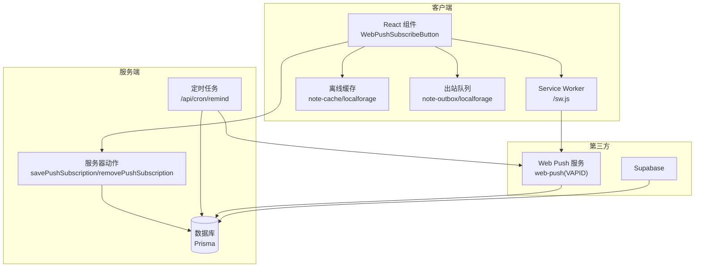
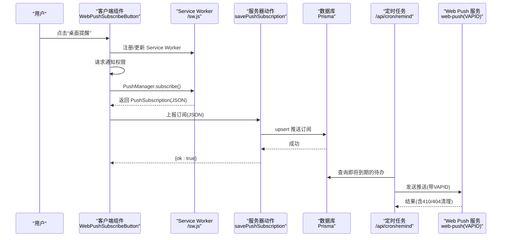
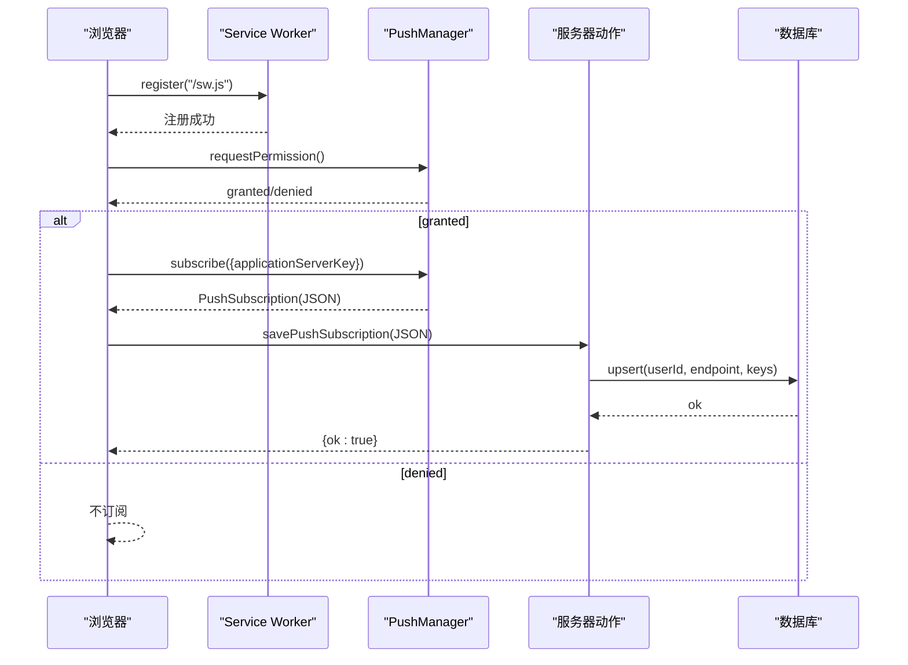
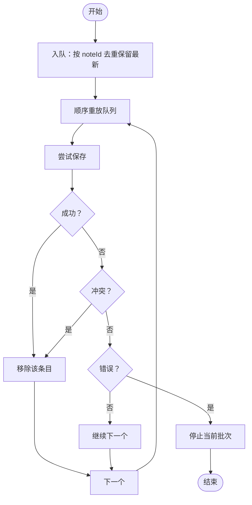
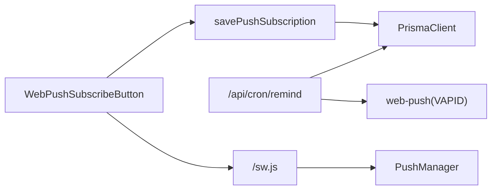

# 集成模式设计

<cite>
**本文引用的文件**
- [src/lib/supabase/client.ts](file://src/lib/supabase/client.ts)
- [src/actions/push.ts](file://src/actions/push.ts)
- [src/components/push/web-push-subscribe-button.tsx](file://src/components/push/web-push-subscribe-button.tsx)
- [src/app/api/cron/remind/route.ts](file://src/app/api/cron/remind/route.ts)
- [src/lib/push/url-base64.ts](file://src/lib/push/url-base64.ts)
- [src/lib/db/index.ts](file://src/lib/db/index.ts)
- [src/lib/offline/note-cache.ts](file://src/lib/offline/note-cache.ts)
- [src/lib/offline/note-outbox.ts](file://src/lib/offline/note-outbox.ts)
- [public/sw.js](file://public/sw.js)
- [public/manifest.json](file://public/manifest.json)
- [prisma/schema.prisma](file://prisma/schema.prisma)
- [supabase/migrations/20260513000000_enable_rls_policies.sql](file://supabase/migrations/20260513000000_enable_rls_policies.sql)
- [supabase/migrations/20260513120000_storage_note_images.sql](file://supabase/migrations/20260513120000_storage_note_images.sql)
- [supabase/migrations/20260513140000_realtime_publication.sql](file://supabase/migrations/20260513140000_realtime_publication.sql)
</cite>

## 目录
1. [引言](#引言)
2. [项目结构](#项目结构)
3. [核心组件](#核心组件)
4. [架构总览](#架构总览)
5. [详细组件分析](#详细组件分析)
6. [依赖关系分析](#依赖关系分析)
7. [性能考量](#性能考量)
8. [故障排查指南](#故障排查指南)
9. [结论](#结论)
10. [附录](#附录)

## 引言
本文件面向 Smart-Todo 的集成模式，系统性梳理第三方服务与前端运行时的关键集成点，覆盖以下主题：
- Supabase 生态集成：认证、存储、实时订阅的模式与最佳实践
- Web Push API 集成：订阅流程、通知发送、浏览器兼容性与安全要点
- 离线存储集成：IndexedDB（通过 localforage 抽象）的缓存与出站队列策略
- 编辑器扩展集成：Tiptap 插件体系、自定义扩展与内容解析机制
- 安全、错误处理与降级策略
- 集成测试方法与监控指标建议

## 项目结构
Smart-Todo 采用 Next.js App Router 架构，集成层主要分布在以下目录：
- src/lib：通用库封装（Supabase 客户端、数据库、离线存储、推送工具）
- src/actions：服务器端动作（如保存/移除推送订阅）
- src/components：UI 组件（如 Web Push 订阅按钮）
- src/app/api：服务端路由（如定时提醒任务）
- public：PWA 资源（Service Worker 与清单）
- prisma 与 supabase/migrations：数据库与 Supabase RLS/Storage/Realtime 的迁移

图表来源
- [src/components/push/web-push-subscribe-button.tsx:1-127](file://src/components/push/web-push-subscribe-button.tsx#L1-L127)
- [src/actions/push.ts:1-62](file://src/actions/push.ts#L1-L62)
- [src/app/api/cron/remind/route.ts:1-115](file://src/app/api/cron/remind/route.ts#L1-L115)
- [src/lib/offline/note-cache.ts:1-25](file://src/lib/offline/note-cache.ts#L1-L25)
- [src/lib/offline/note-outbox.ts:1-87](file://src/lib/offline/note-outbox.ts#L1-L87)
- [public/sw.js](file://public/sw.js)

章节来源
- [src/lib/supabase/client.ts:1-9](file://src/lib/supabase/client.ts#L1-L9)
- [src/lib/db/index.ts:1-16](file://src/lib/db/index.ts#L1-L16)
- [src/lib/push/url-base64.ts:1-14](file://src/lib/push/url-base64.ts#L1-L14)
- [public/sw.js](file://public/sw.js)
- [public/manifest.json](file://public/manifest.json)

## 核心组件
- Supabase 客户端封装：在浏览器侧创建 Supabase 客户端实例，用于认证、存储与实时订阅。
- 推送订阅动作：在服务器端持久化/删除 Web Push 订阅，支持幂等 upsert。
- Web Push 订阅按钮：负责注册 Service Worker、请求通知权限、生成订阅并上报到服务器。
- 定时提醒任务：按时间窗口扫描待办事项，向用户推送提醒，并清理失效订阅。
- 离线缓存与出站队列：基于 localforage 的 IndexedDB 抽象，实现笔记内容缓存与保存重放。
- 数据库与迁移：Prisma 客户端与 Supabase RLS/Storage/Realtime 的迁移脚本。

章节来源
- [src/lib/supabase/client.ts:1-9](file://src/lib/supabase/client.ts#L1-L9)
- [src/actions/push.ts:1-62](file://src/actions/push.ts#L1-L62)
- [src/components/push/web-push-subscribe-button.tsx:1-127](file://src/components/push/web-push-subscribe-button.tsx#L1-L127)
- [src/app/api/cron/remind/route.ts:1-115](file://src/app/api/cron/remind/route.ts#L1-L115)
- [src/lib/offline/note-cache.ts:1-25](file://src/lib/offline/note-cache.ts#L1-L25)
- [src/lib/offline/note-outbox.ts:1-87](file://src/lib/offline/note-outbox.ts#L1-L87)
- [src/lib/db/index.ts:1-16](file://src/lib/db/index.ts#L1-L16)
- [prisma/schema.prisma](file://prisma/schema.prisma)

## 架构总览
下图展示从用户操作到服务端推送的整体链路，以及离线存储与数据库交互：

图表来源
- [src/components/push/web-push-subscribe-button.tsx:39-96](file://src/components/push/web-push-subscribe-button.tsx#L39-L96)
- [src/actions/push.ts:12-49](file://src/actions/push.ts#L12-L49)
- [src/app/api/cron/remind/route.ts:28-114](file://src/app/api/cron/remind/route.ts#L28-L114)
- [src/lib/push/url-base64.ts:4-13](file://src/lib/push/url-base64.ts#L4-L13)

## 详细组件分析

### Supabase 集成模式与最佳实践
- 客户端初始化：在浏览器侧通过封装函数创建 Supabase 客户端，使用公开的 URL 与匿名密钥。
- 认证集成：结合 Next.js App Router 的服务器端会话校验与 Supabase Auth，确保用户身份可信。
- 存储集成：利用 Supabase Storage 进行图片等资源管理；配合 RLS 策略控制访问范围。
- 实时集成：通过 Supabase Realtime 订阅表变更，实现多端同步与增量更新。
- 最佳实践：
  - 将敏感密钥严格限制在服务器端，仅暴露公共密钥给客户端。
  - 使用 RLS 策略对用户数据进行行级隔离，避免越权访问。
  - 在客户端使用只读或受限查询，避免直接写入敏感表。
  - 对实时订阅进行去抖与合并，减少不必要的重渲染。

章节来源
- [src/lib/supabase/client.ts:1-9](file://src/lib/supabase/client.ts#L1-L9)
- [supabase/migrations/20260513000000_enable_rls_policies.sql](file://supabase/migrations/20260513000000_enable_rls_policies.sql)
- [supabase/migrations/20260513120000_storage_note_images.sql](file://supabase/migrations/20260513120000_storage_note_images.sql)
- [supabase/migrations/20260513140000_realtime_publication.sql](file://supabase/migrations/20260513140000_realtime_publication.sql)

### Web Push API 集成实现
- 订阅流程：
  - 注册 Service Worker 并更新，确保推送通道可用。
  - 请求通知权限，若拒绝则提示用户并保持未订阅状态。
  - 使用 VAPID 公钥转换为 Uint8Array 后调用 PushManager.subscribe。
  - 将订阅对象（包含 endpoint 与 keys）序列化为 JSON 并提交到服务器动作。
- 服务器端持久化：
  - 使用 Prisma upsert 幂等保存订阅，键为 (userId, endpoint)，支持 keys 更新。
  - 提供删除接口，便于用户关闭提醒或清理无效订阅。
- 定时推送：
  - 周期性扫描即将到期的待办项，构造通知负载（标题、正文、跳转 URL）。
  - 使用 web-push 设置 VAPID 凭据，逐条发送并统计成功/失败数。
  - 对 410/404 错误自动清理失效订阅，降低后续失败率。
- 浏览器兼容性与安全：
  - 仅在支持 serviceWorker 与 PushManager 的环境中显示按钮。
  - VAPID 公钥必须配置，否则无法完成订阅。
  - 必须使用 HTTPS 或 localhost，否则订阅会失败。
- 用户体验：
  - 使用过渡与禁用状态避免重复点击。
  - 成功/失败通过 toast 提示，提升反馈及时性。

图表来源
- [src/components/push/web-push-subscribe-button.tsx:44-77](file://src/components/push/web-push-subscribe-button.tsx#L44-L77)
- [src/actions/push.ts:13-49](file://src/actions/push.ts#L13-L49)
- [src/lib/push/url-base64.ts:4-13](file://src/lib/push/url-base64.ts#L4-L13)

章节来源
- [src/components/push/web-push-subscribe-button.tsx:1-127](file://src/components/push/web-push-subscribe-button.tsx#L1-L127)
- [src/actions/push.ts:1-62](file://src/actions/push.ts#L1-L62)
- [src/app/api/cron/remind/route.ts:1-115](file://src/app/api/cron/remind/route.ts#L1-L115)
- [src/lib/push/url-base64.ts:1-14](file://src/lib/push/url-base64.ts#L1-L14)

### 离线存储集成（IndexedDB 抽象）
- 缓存策略：
  - 使用 localforage 创建命名实例，分别用于“笔记缓存”和“出站队列”。
  - 笔记缓存记录内容 JSON、同步版本与保存时间戳，便于快速回放与冲突判断。
  - 出站队列以数组形式维护待保存条目，按 noteId 去重，保留最后一次内容。
- 保存重放：
  - 顺序消费队列，调用外部保存函数；根据返回结果决定移除或继续尝试。
  - 支持三种结果：成功、冲突（删除）、错误（停止当前批次）。
- 与编辑器的协作：
  - 编辑器内容以 Tiptap JSON 形式入队，保证跨设备一致性。
  - 离线恢复优先采用本地最新内容，避免丢失用户输入。

图表来源
- [src/lib/offline/note-outbox.ts:48-86](file://src/lib/offline/note-outbox.ts#L48-L86)
- [src/lib/offline/note-cache.ts:18-24](file://src/lib/offline/note-cache.ts#L18-L24)

章节来源
- [src/lib/offline/note-cache.ts:1-25](file://src/lib/offline/note-cache.ts#L1-L25)
- [src/lib/offline/note-outbox.ts:1-87](file://src/lib/offline/note-outbox.ts#L1-L87)

### 编辑器扩展集成（Tiptap）
- 插件系统：基于 Tiptap 的扩展机制，按需加载节点、标记与插件，实现富文本编辑能力。
- 自定义扩展：可扩展链接、图片、列表等节点，结合 Schema 与 Command 实现交互。
- 内容解析：统一以 Tiptap JSON 序列化存储，便于跨端一致渲染与离线缓存。
- 与离线存储协作：编辑器内容以 JSON 入队至出站队列，确保网络恢复后可靠同步。

章节来源
- [src/lib/offline/note-outbox.ts:10-15](file://src/lib/offline/note-outbox.ts#L10-L15)

### 安全、错误处理与降级策略
- 安全：
  - VAPID 密钥严格保密，仅在服务器端配置；客户端仅使用公钥。
  - Supabase 密钥分离：客户端仅使用公开 ANON KEY，敏感操作在服务器端执行。
  - RLS 策略强制行级隔离，防止越权访问。
- 错误处理：
  - 订阅失败：提示用户检查 HTTPS/localhost 与 VAPID 配置。
  - 推送失败：区分 410/404 清理无效订阅，其他错误记录并继续处理队列。
  - 服务器动作：对非法输入进行参数校验并返回明确错误信息。
- 降级策略：
  - 不支持推送的浏览器隐藏按钮；支持但权限拒绝时保持非订阅状态。
  - 离线场景：优先使用本地缓存与出站队列，网络恢复后重放。

章节来源
- [src/components/push/web-push-subscribe-button.tsx:38-77](file://src/components/push/web-push-subscribe-button.tsx#L38-L77)
- [src/app/api/cron/remind/route.ts:98-105](file://src/app/api/cron/remind/route.ts#L98-L105)
- [src/actions/push.ts:15-26](file://src/actions/push.ts#L15-L26)

### 集成测试方法与监控指标
- 测试方法：
  - 单元测试：针对服务器动作（订阅/删除）与推送发送逻辑进行断言。
  - 端到端测试：模拟订阅流程、权限授予、Service Worker 注册与推送接收。
  - 离线测试：断网场景验证入队与重放行为，确认冲突处理路径。
- 监控指标：
  - 推送成功率/失败率、410/404 清理数量、定时任务扫描条数。
  - 订阅创建/删除耗时、离线队列长度与重放耗时。
  - PWA 相关：Service Worker 更新频率、安装与激活状态。

## 依赖关系分析
- 组件耦合：
  - WebPushSubscribeButton 依赖服务器动作与 VAPID 工具，耦合度适中。
  - 定时任务依赖数据库与 web-push，关注点清晰。
- 外部依赖：
  - Supabase：认证、存储、实时
  - web-push：VAPID 推送
  - localforage：IndexedDB 抽象
  - Prisma：数据库访问

图表来源
- [src/components/push/web-push-subscribe-button.tsx:7-8](file://src/components/push/web-push-subscribe-button.tsx#L7-L8)
- [src/actions/push.ts:4-5](file://src/actions/push.ts#L4-L5)
- [src/app/api/cron/remind/route.ts:2-3](file://src/app/api/cron/remind/route.ts#L2-L3)
- [public/sw.js](file://public/sw.js)

章节来源
- [src/lib/db/index.ts:1-16](file://src/lib/db/index.ts#L1-L16)
- [src/lib/supabase/client.ts:1-9](file://src/lib/supabase/client.ts#L1-L9)

## 性能考量
- 推送批处理：定时任务限制扫描窗口与最大条数，避免高并发冲击。
- 队列重放：顺序消费出站队列，避免并发写入导致的冲突与死锁。
- 缓存命中：离线缓存命中时优先渲染，减少网络请求。
- 数据库日志：开发环境开启查询日志，生产环境关闭，降低 IO 开销。

## 故障排查指南
- 订阅失败：
  - 检查是否 HTTPS 或 localhost；确认 VAPID 公钥已配置。
  - 查看浏览器控制台与 toast 提示，定位权限或注册问题。
- 推送未送达：
  - 核对 VAPID 私钥配置与定时任务授权头。
  - 关注 410/404 清理日志，确认订阅是否被删除。
- 离线不同步：
  - 检查本地缓存与出站队列内容，确认 JSON 结构与同步版本。
  - 观察重放结果，区分冲突与错误分支。

章节来源
- [src/components/push/web-push-subscribe-button.tsx:71-76](file://src/components/push/web-push-subscribe-button.tsx#L71-L76)
- [src/app/api/cron/remind/route.ts:98-105](file://src/app/api/cron/remind/route.ts#L98-L105)
- [src/lib/offline/note-outbox.ts:48-86](file://src/lib/offline/note-outbox.ts#L48-L86)

## 结论
Smart-Todo 的集成模式围绕“客户端轻量、服务端强校验”的原则构建：浏览器侧负责用户体验与离线能力，服务端负责安全与一致性。通过 Supabase 生态实现认证、存储与实时，借助 Web Push 提升用户召回，结合 localforage 保障离线体验。整体方案具备良好的扩展性与可维护性，适合在多端协同场景中推广。

## 附录
- 环境变量建议：
  - NEXT_PUBLIC_SUPABASE_URL、NEXT_PUBLIC_SUPABASE_ANON_KEY
  - NEXT_PUBLIC_VAPID_PUBLIC_KEY、VAPID_PRIVATE_KEY、VAPID_SUBJECT
  - CRON_SECRET（定时任务鉴权）
  - NEXT_PUBLIC_APP_URL（推送跳转目标）
- PWA 资源：
  - Service Worker 与 Manifest 文件位于 public 目录，确保安装与后台唤醒能力。

章节来源
- [src/lib/supabase/client.ts:4-7](file://src/lib/supabase/client.ts#L4-L7)
- [src/lib/push/url-base64.ts:4-13](file://src/lib/push/url-base64.ts#L4-L13)
- [src/app/api/cron/remind/route.ts:19-26](file://src/app/api/cron/remind/route.ts#L19-L26)
- [public/sw.js](file://public/sw.js)
- [public/manifest.json](file://public/manifest.json)